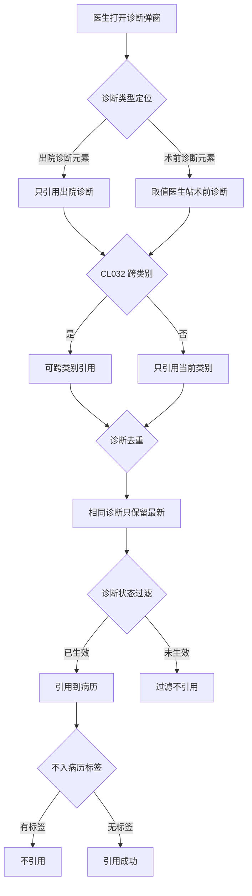
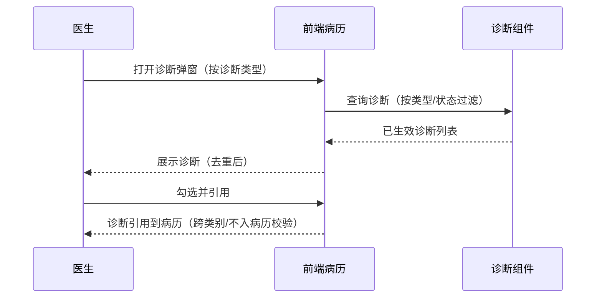

# BLGL-03-ZDYY-006 诊断类型引用 - Spec

> **功能编号**：BLGL-03-ZDYY-006
> **文档类型**：Spec（研发视角）
> **文档版本**：V1.0
> **编写时间**：2026-08-15
> **编写人**：RACC

---

## 文档索引

#### 章节索引

**Spec（研发视角）**

| 章节号 | 章节名称 | 内容说明 |
|--------|---------|---------|
| 1、 | 文档概述 | 文档目的、文档范围、术语定义、阅读指南、参考文档 |
| 2、 | 功能背景与定位 | 功能背景、功能定位、目标用户、核心价值 |
| 3、 | 业务流程设计 | 主流程/异常流程/边界流程（Given/When/Then） |
| 4、 | 数据模型设计 | 核心数据结构、状态定义、系统参数定义 |
| 5、 | 接口契约设计 | API列表、接口详细设计、错误码定义 |
| 6、 | 技术方案设计 | 页面路径、技术栈、关键技术点、部署方案 |
| 7、 | 测试用例预设计 | 功能/边界/异常/性能测试用例 |
| 8、 | 非功能性要求 | 性能、安全、可用性、兼容性 |
| 9、 | 依赖与风险 | 外部依赖、风险项 |
| 10、 | 附录 | 流程图、时序图、参考文档 |

**PM-Spec（业务视角）**

| 章节号 | 章节名称 | 内容说明 |
|--------|---------|---------|
| 一 | 目标 | 功能定位与核心价值 |
| 二 | 约束 | 业务/技术/非功能性约束 |
| 三 | 验收标准 | 验收条件与验证方法 |
| 四 | 排除范围 | 本次不做项与明确边界 |
| 五 | 关键决策记录 | 方案决策与选型理由 |
| 六 | 优先级 | 优先级定义 |
| 七 | 关联文档 | 关联文档索引 |
| 附录 | 填写检查清单 | 质量检查 |

**Analyst-Spec（产品视角）**

| 章节号 | 章节名称 | 内容说明 |
|--------|---------|---------|
| 一 | 功能编号体系 | 功能编号与层级结构 |
| 二 | 核心业务流程 | 核心业务流程与时序 |
| 三 | 功能规格说明 | 详细功能规格与验收标准 |
| 四 | 排除范围 | 排除范围 |
| 五 | 业务规则清单 | 业务规则清单 |
| 六 | 关联文档 | 关联文档索引 |
| 七 | 待确认问题清单 | 待确认问题汇总 |
| - | 填写检查清单 | 质量检查 |

#### 版本历史

| 版本 | 日期 | 变更说明 | 编写人 |
|------|------|---------|--------|
| V1.0 | 2026-08-15 | 初始版本 | RACC |

#### 关联文档索引

| 序号 | 文档名称 | 文档类型 | 版本 | 位置 |
|------|---------|---------|------|------|
| 1 | BLGL-03-ZDYY-006_诊断类型引用_PM-spec.md | PM-Spec（业务视角） | V0.1 | 本目录 |
| 2 | BLGL-03-ZDYY-006_诊断类型引用_Analyst-spec.md | Analyst-Spec（产品视角） | V1.0 | 本目录 |
| 3 | BLGL-03-ZDYY-006_诊断类型引用-Spec.md | Spec（研发视角）（本文档） | V1.0 | 本目录 |
| 4 | BLGL-03-ZDYY 诊断引用功能点Spec.md | 功能点Spec（模块级） | V1.1 | 上级目录 |
---

## 1、文档概述

### 1.1、文档目的

本文档旨在明确"诊断类型引用"功能（BLGL-03-ZDYY-006）的业务背景与设计方案，为需求分析、研发实现、测试验收及评审提供统一的业务上下文、设计口径与决策依据。

**具体目的包括**：

1. 梳理诊断类型引用功能的业务由来与历史需求演进脉络，说明"为什么要做"；
2. 明确功能的定位边界、目标用户与核心价值，回答"做成什么"；
3. 描述功能的业务流程、数据模型、接口契约与技术方案，回答"怎么做"；
4. 预设计测试用例并明确非功能性要求、依赖与风险，为研发与验收提供依据；
5. 作为 Analyst-Spec 的业务前提与设计输入，保证各层文档业务口径一致。

### 1.2、文档范围

#### 1.2.1 纳入范围

本文档覆盖诊断类型引用的完整业务背景与设计，包括：

- 按诊断类型引用：出院记录只能引用出院诊断、手术记录术前/术后诊断取值、会诊申请单临床诊断取值
- 跨类别引用控制：CL032 参数（诊断是否允许跨类别引用）
- 诊断去重：按诊断描述判断相同诊断、引用去重
- 诊断状态过滤：根据模板配置过滤未生效诊断状态
- 不入病历标签：疾病分类与代码概念域术语增加【不入病历】标签
- 中西医过滤：诊断数据元自定义属性 TCM/WM 控制只加载中医/西医诊断
- 新增诊断类型：产后诊断、最后诊断

#### 1.2.2 排除范围

本文档不涉及以下内容（详见其他功能点或模块）：

- 诊断数据接入与查询（诊断组件查询/ICD-11）—— BLGL-03-ZDYY-001
- 诊断变更同步与提醒（CL025 同步方式）—— BLGL-03-ZDYY-002
- 诊断引用弹窗交互（勾选/关闭/触发方式）—— BLGL-03-ZDYY-003
- 诊断样式显示配置（排序/标题/序号/分隔符）—— BLGL-03-ZDYY-005
- 诊断插入与编辑（插入位置/序号重算）—— BLGL-03-ZDYY-007
- 患者诊断录入/开立（医生站诊断控件内部）—— 归医生站模块

### 1.3、术语定义

| 术语 | 定义 |
|------|------|
| 诊断类型 | 入院诊断/出院诊断/术前诊断/术后诊断/目前诊断/死亡诊断/门诊诊断/产后诊断/最后诊断等 |
| CL032 | 诊断是否允许跨类别引用参数，下拉选择是/否，默认为是 |
| 不入病历标签 | 疾病分类与代码概念域（65439）术语增加【不入病历】标签，有此标签的诊断不引用到病历 |
| 跨类别引用 | 通过某诊断类型数据元进入诊断控件可引用其他类型诊断 |

### 1.4、阅读指南

- **章节关系**：第1~2章为业务全貌，第3~10章为设计实现层。与 Analyst-Spec、PM-Spec 互相引用保持一致。
- **读者对象**：产品经理/需求分析师读第1~2章；研发读第3~6、9~10章；测试读第3、7~8章；评审人员核对各层一致性。

### 1.5、参考文档

| 序号 | 文档名称 | 版本/日期 |
|------|---------|----------|
| 1 | 【历史需求】住院病历的历史需求.xlsx | - |
| 2 | BLGL-03-ZDYY-006_诊断类型引用_PM-spec.md | V0.1 |
| 3 | BLGL-03-ZDYY-006_诊断类型引用_Analyst-spec.md | V1.0 |
| 4 | BLGL-03-ZDYY 诊断引用功能点Spec.md | V1.1 |

---

## 2、功能背景与定位

### 2.1 功能背景

诊断类型引用是诊断引用模块的规则层，需满足：

- **现状痛点**：手术记录单术前/术后诊断只能从目前诊断中引用，无法从全部诊断勾选；诊断引用没有显示诊断类型，不便于识别；有编辑权限的诊断组件中未生效的诊断也显示
- **管理要求**：康慈医院质管科要求评估量表/同意书目前诊断数据元只显示西医诊断；诊断类型需扩展产后诊断、最后诊断
- **历史需求演进**：按诊断类型引用（需求）→ 跨类别引用参数 CL032（需求）→ 诊断去重原则（需求）→ 诊断状态过滤（需求）→ 不入病历标签（需求）→ 新增诊断类型产后/最后（需求）

### 2.2 功能定位

"诊断类型引用"是 WiNEX 病历管理-诊断引用的规则层，定位为：

- **类型约束**：按诊断类型限定引用范围，跨类别引用参数化控制
- **引用质量**：诊断去重、状态过滤、不入病历标签
- **类型扩展**：新增产后诊断/最后诊断等类型

### 2.3 目标用户

| 用户角色 | 主要使用场景 |
|---------|-------------|
| 住院医生 | 按诊断类型引用诊断到病历 |
| 病案管理员 | 配置跨类别引用、诊断状态过滤参数 |

### 2.4 核心价值

| 价值维度 | 价值描述 |
|---------|---------|
| 引用准确 | 按诊断类型引用、去重、状态过滤保证引用准确 |
| 跨类别可控 | CL032 参数控制跨类别引用 |
| 类型扩展 | 支持产后/最后等新诊断类型 |

---

## 3、业务流程设计（Given/When/Then）

### 3.1 主流程

**Scenario 1: 出院记录引用出院诊断**

```gherkin
Given:
 - 参数"引入病历时固定为默认值的诊断类型"配置了出院诊断
 - 出院记录中出院诊断元素

When:
 - 医生打开诊断弹窗引用诊断

Then:
 - 始终取默认值的诊断类型（出院诊断）
 - 不管定位在哪个类型 tab，只引用配置参数对应的默认值
```


### 3.2 异常流程

**Scenario 2: 业务异常——跨类别引用被禁止**

```gherkin
Given:
 - CL032（诊断是否允许跨类别引用）= 否
 - 医生通过入院诊断数据元进入诊断控件

When:
 - 医生勾选出院诊断中已开立的诊断

Then:
 - 不能引用（即便勾选了出院诊断的信息也不引用）
 - 只能引用入院诊断下的诊断
```


**Scenario 3: 数据异常——未生效诊断**

```gherkin
Given:
 - 病历诊断引用弹窗按模板配置的诊断状态属性过滤
 - 患者有未生效诊断（待审签/审签不通过/草稿/新增未保存）

When:
 - 医生引用诊断

Then:
 - 过滤掉未生效的诊断
 - 只显示已生效状态的诊断供医生引用
```


**Scenario 4: 数据异常——不入病历标签**

```gherkin
Given:
 - 疾病分类与代码概念域术语有【不入病历】标签

When:
 - 同步诊断/创建病历自动加载/点击诊断弹窗引用

Then:
 - 有此标签的诊断不引用到病历
```


### 3.3 边界流程

**Scenario 5: 边界——诊断去重**

```gherkin
Given:
 - 引用到病历的诊断需去重
 - 相同诊断判断：诊断编码、诊断前缀、诊断名称、诊断后缀全部相同

When:
 - 病历引用诊断

Then:
 - 相同的一级诊断只保留诊断日期最新的那条及其下二级/三级诊断
 - 其他一级诊断及二级/三级诊断不保留
```


**Scenario 6: 边界——编码重复按描述判断**

```gherkin
Given:
 - 北大支持相同诊断编码重复录入

When:
 - 病历引用诊断

Then:
 - 根据诊断描述是否完全一样判断是否为同一个诊断
 - 诊断描述完全相同时病历引用去重
```


---

## 4、数据模型设计

### 4.1 核心数据结构

#### 4.1.1 核心保存请求

| 字段名 | 类型 | 必填 | 备注 |
|--------|------|------|------|
| 诊断类型 | String | 是 | 引入病历时固定为默认值的诊断类型 |
| 诊断描述 | String | 否 | 相同诊断判断依据 |
| 诊断状态 | String | 否 | 引用诊断状态过滤 |

> ⏳ 待确认：引用接口完整字段以代码扫描和 API 契约为准。

#### 4.1.2 核心表/实体

| 表/实体 | 关键字段 | 说明 |
|---------|---------|------|
| INP_EMR_DIAGNOSIS | inpEmrDiagnosisRecordId、inpEmrDiagnosisTypeId、inpEmrSetId、encounterId、diagnosisTypeCode、diagnosisPriSecCode、diagnosisCode | 病历引用诊断记录表 |
| INPATIENT_RHB_DIAGNOSIS | inpatientRhbDiagnosisId、inpRhbRecordId、encounterId、patientEncounterDiagnosisId、diagnosisTypeCode、diagnosisCode、diagnosisDesc、diagnosisPrefixName、diagnosisSuffixName | 住院病历患者就诊主诊断表 |

### 4.2 状态定义

| 状态码 | 状态名称 | 说明 |
|--------|---------|------|
| 待审签 | 未生效 | 引用诊断状态过滤 |
| 审签不通过 | 未生效 | 引用诊断状态过滤 |
| 草稿 | 未生效 | 引用诊断状态过滤 |
| 新增未保存 | 未生效 | 引用诊断状态过滤 |
| 已生效 | 生效 | 可引用诊断 |

### 4.3 系统参数定义

| 参数编码 | 参数名称 | 说明 |
|---------|---------|------|
| CL032 | 诊断是否允许跨类别引用 | 是/否，默认为是 |
| - | 引入病历时固定为默认值的诊断类型 | 所有诊断类型，默认无，可多选 |
| - | 引用诊断状态的类型 | 下拉 399695596 的值域，默认为全选 |

---

## 5、接口契约设计

### 5.1 API列表

| 序号 | API名称（代码函数） | 路径 | 方法 | 说明 |
|:----:|---------|------|:----:|------|
| 1 | 根据就诊标识查询诊断信息 | /api/v1/app_record_inpatient/emr_inpatient_diagnosis/query/by_encounter_id | POST | 弹窗诊断数据 |
| 2 | 保存引用诊断（全部文书结构化） | /api/v2/app_record_inpatient/emr_inpatient/quote_diagnosis/save | POST | 保存引用诊断 |
| 3 | 根据就诊标识查询临床诊断信息 | /api/v1/app_record_inpatient/emr_inpatient_clinical_diagnosis/query/by_encounter_id | POST | 临床诊断查询 |

### 5.2 接口详细设计

#### 5.2.1 根据就诊标识查询诊断信息（弹窗诊断数据）

**请求参数**:
```json
{
 "encounterId": "12345",
 "diagnosisTypeCode": "256917"
}
```

**返回值（成功）**:
```json
{
 "success": true,
 "data": [
 {
 "diagnosisTypeCode": "256917",
 "diagnosisDesc": "出院诊断1",
 "diagnosisStatus": "已生效"
 }
 ]
}
```

> ⏳ 待确认：接口字段名以代码扫描和 API 契约为准（诊断状态字段 diagnosisStatus 依据需求）。

**返回值（失败）**:
```json
{
 "success": false,
 "message": "查询诊断失败",
 "data": null
}
```

### 5.3 错误码定义

| 错误码 | 错误信息 | 处理方式 |
|--------|---------|---------|
| ⏳ 待确认 | 引用失败（跨类别禁止） | 不引用勾选的跨类别诊断 |

---

## 6、技术方案设计

### 6.1 页面路径

- **页面路径**: 住院医生站→住院病历书写界面→诊断弹窗（PgEditor/widget/widget_diagnosis.vue）
- **核心逻辑**: 诊断引用时按诊断类型定位、跨类别控制、去重、状态过滤
- **前端 API**: src/api/global.js diagnosisApi.queryDiagnosisData → emr_inpatient_diagnosis/query/by_encounter_id

### 6.2 技术栈

| 类别 | 技术 | 版本 |
|------|------|------|
| 前端框架 | Vue | 2.6.14 |
| 前端UI | element-ui | 2.13.0 |
| 后端框架 | Spring Boot（Java 17）+ JPA/Hibernate | - |
| RPC | winning-akso-rpc-rest | - |

### 6.3 关键技术点

- 诊断引用时根据诊断描述是否完全一样判断是否为同一个诊断，相同则去重
- 诊断数据元自动加载诊断数据时判断自定义属性 TCM/WM，控制只加载中医/西医诊断
- 引用诊断状态过滤根据医生站出参 diagnosisStatus 判断

### 6.4 部署方案

⏳ 待确认：部署方案未在资料区中找到。

---

## 7、测试用例预设计

### 7.1 功能测试

| 用例编号 | 测试场景 | Given | When | Then |
|---------|---------|-------|------|------|
| TC-001 | 出院记录引用出院诊断 | 参数配置出院诊断默认值 | 打开弹窗引用 | 只引用出院诊断 |

### 7.2 边界测试

| 用例编号 | 测试场景 | Given | When | Then |
|---------|---------|-------|------|------|
| TC-002 | 诊断去重 | 相同诊断（编码/前缀/名称/后缀全同） | 引用 | 只保留最新日期诊断及其下级 |

### 7.3 异常测试

| 用例编号 | 测试场景 | Given | When | Then |
|---------|---------|-------|------|------|
| TC-003 | 跨类别禁止 | CL032=否 | 勾选跨类别诊断 | 不引用 |

### 7.4 性能测试

| 用例编号 | 测试场景 | 指标 |
|---------|---------|------|
| TC-004 | 诊断查询响应 | ⏳ 待确认：性能指标未在资料区中找到 |

---

## 8、非功能性要求

### 8.1 性能要求

| 指标 | 要求 |
|------|------|
| 诊断查询响应时间 | ⏳ 待确认 |

### 8.2 安全要求

| 要求 | 说明 |
|------|------|
| 权限控制 | 有编辑权限的诊断组件才显示未生效诊断 |

**医疗行业特殊要求**

| 要求 | 说明 |
|------|------|
| 引用准确性 | 未生效诊断不引用，避免诊断错误影响诊疗 |

### 8.3 可用性要求

| 指标 | 要求值 |
|------|--------|
| 可用性 | ⏳ 待确认 |

### 8.4 兼容性要求

| 类型 | 要求 |
|------|------|
| 诊断状态 | 过滤未生效诊断状态（待审签/审签不通过/草稿/新增未保存） |
| 诊断类型 | 支持产后诊断/最后诊断等新类型 |

---

## 9、依赖与风险

### 9.1 外部依赖

| 依赖项 | 说明 |
|--------|------|
| 疾病分类与代码概念域 | 【不入病历】标签 |
| 医生站诊断控件 | 诊断状态出参 diagnosisStatus |

### 9.2 风险项

| 风险项 | 等级 | 说明 | 应对方案 |
|--------|------|------|---------|
| 跨类别引用误控 | 中 | CL032=否时跨类别引用被禁止可能影响医生 | 参数化控制，默认是 |
| 去重误判 | 中 | 诊断编码/前缀/名称/后缀判断可能误删 | 严格按判断逻辑 |

---

## 10、附录

### 10.1 流程图



### 10.2 时序图



### 10.3 参考文档

- 【历史需求】住院病历的历史需求.xlsx（需求）
- BLGL-03-ZDYY 诊断引用功能点Spec.md（V1.1，第5章 BLGL-03-ZDYY-006 行）
- 关联Spec: BLGL-03-ZDYY-006_诊断类型引用_PM-spec.md、BLGL-03-ZDYY-006_诊断类型引用_Analyst-spec.md

---

## 填写检查清单

| 序号 | 检查项 | 是否完成 |
|:----:|--------|:--------:|
| 1 | 章节索引与正文章节一致 | ✅ |
| 2 | 版本历史记录完整 | ✅ |
| 3 | 关联文档索引已登记全部Spec | ✅ |
| 4 | 文档目的明确回答"为什么做/做成什么/怎么做" | ✅ |
| 5 | 纳入范围/排除范围清晰 | ✅ |
| 6 | 术语定义覆盖关键概念，从资料区可溯源 | ✅ |
| 7 | 参考文档已登记 | ✅ |
| 8 | 功能背景基于法规/规范/需求来源组织 | ✅ |
| 9 | 功能定位体现业务价值（3~5个定位点） | ✅ |
| 10 | 目标用户角色覆盖完整，在需求原文中有出处 | ✅ |
| 11 | 核心价值可陈述，与 Phase 1 口径一致 | ✅ |
| 12 | 业务流程：主流程≥1、异常≥3、边界≥2，Given/When/Then 具体 | ✅ |
| 13 | 数据模型：字段/表/状态/参数可溯源 | ✅ |
| 14 | 接口契约：API列表+详细设计+错误码齐全或标记待确认 | ✅ |
| 15 | 技术方案：页面路径/技术栈/关键点/部署方案或标记待确认 | ✅ |
| 16 | 测试用例：功能/边界/异常/性能覆盖 | ✅ |
| 17 | 非功能性要求：性能/安全/可用性/兼容性指标可量化或标记待确认 | ✅ |
| 18 | 依赖与风险：外部依赖登记完整 | ✅ |
| 19 | 附录：流程图/时序图与正文流程一致 | ✅ |
| 20 | 全文无占位符 `< >` 残留 | ✅ |
| 21 | 全文陈述可溯源至资料区 | ✅ |
| 22 | 人工审核确认完成 | ⏳ 待确认 |

---

**文档状态**：⬜ 待审核
**维护责任**：RACC
**下次更新**：根据评审反馈优化
