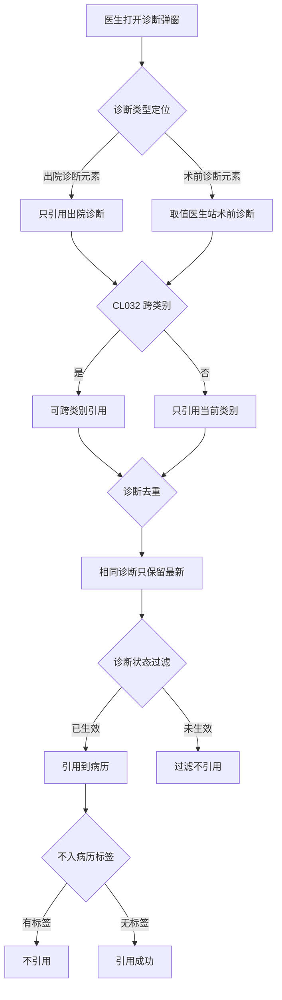
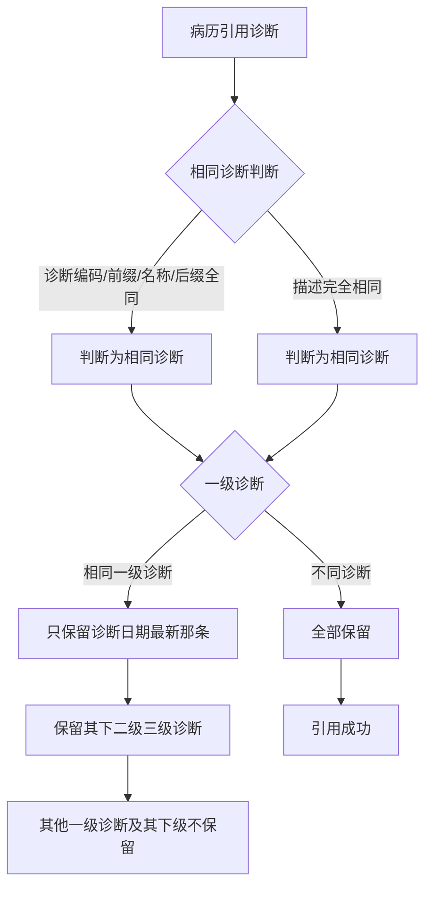

# BLGL-03-ZDYY-006 诊断类型引用 _ Analyst - Spec

> **需求编号**：BLGL-03-ZDYY-006
> **父需求**：BLGL-03-ZDYY
> **关联PM Spec**：BLGL-03-ZDYY-006_诊断类型引用_PM-spec.md
> **Spec版本**：V1.0
> **编写时间**：2026-08-15
> **编写人**：需求分析师

---

## 一、功能编号体系

### 1.1 功能层级结构

```
BLGL-03-ZDYY-006-001: 按诊断类型引用
  ├─ BLGL-03-ZDYY-006-001-01: 出院诊断只能引用出院诊断
  ├─ BLGL-03-ZDYY-006-001-02: 术前/术后诊断取值医生站
  ├─ BLGL-03-ZDYY-006-001-03: 会诊申请单临床诊断取值
  └─ BLGL-03-ZDYY-006-001-04: 固定默认值诊断类型参数

BLGL-03-ZDYY-006-002: 跨类别引用控制
  └─ BLGL-03-ZDYY-006-002-01: CL032 参数

BLGL-03-ZDYY-006-003: 诊断去重
  ├─ BLGL-03-ZDYY-006-003-01: 相同诊断判断（编码/前缀/名称/后缀）
  └─ BLGL-03-ZDYY-006-003-02: 编码重复按描述判断

BLGL-03-ZDYY-006-004: 诊断状态过滤
  └─ BLGL-03-ZDYY-006-004-01: 过滤未生效诊断状态

BLGL-03-ZDYY-006-005: 不入病历标签
  └─ BLGL-03-ZDYY-006-005-01: 概念域【不入病历】标签

BLGL-03-ZDYY-006-006: 中西医过滤
  └─ BLGL-03-ZDYY-006-006-01: TCM/WM 自定义属性

BLGL-03-ZDYY-006-007: 新增诊断类型
  ├─ BLGL-03-ZDYY-006-007-01: 产后诊断
  └─ BLGL-03-ZDYY-006-007-02: 最后诊断
```

### 1.2 功能编号表

| REQ-ID | 功能名称 | 类型 | 优先级 | 说明 |
|--------|---------|------|--------|------|
| BLGL-03-ZDYY-006-001 | 按诊断类型引用 | 功能 | P0 | 按诊断类型限定引用 |
| BLGL-03-ZDYY-006-001-01 | 出院诊断只能引用出院诊断 | 子功能 | P0 | 参数固定默认值诊断类型 |
| BLGL-03-ZDYY-006-001-02 | 术前/术后诊断取值医生站 | 子功能 | P1 | 手术记录取值医生站术前/术后诊断 |
| BLGL-03-ZDYY-006-001-03 | 会诊申请单临床诊断取值 | 子功能 | P1 | 临床诊断取值目前诊断 |
| BLGL-03-ZDYY-006-002 | 跨类别引用控制 | 功能 | P0 | CL032 参数控制 |
| BLGL-03-ZDYY-006-002-01 | CL032 参数 | 子功能 | P0 | 是/否，默认为是 |
| BLGL-03-ZDYY-006-003 | 诊断去重 | 功能 | P0 | 引用去重 |
| BLGL-03-ZDYY-006-003-01 | 相同诊断判断 | 子功能 | P0 | 编码/前缀/名称/后缀全同 |
| BLGL-03-ZDYY-006-003-02 | 编码重复按描述判断 | 子功能 | P0 | 描述完全相同去重 |
| BLGL-03-ZDYY-006-004 | 诊断状态过滤 | 功能 | P0 | 过滤未生效诊断 |
| BLGL-03-ZDYY-006-004-01 | 过滤未生效诊断状态 | 子功能 | P0 | 待审签/审签不通过/草稿/新增未保存 |
| BLGL-03-ZDYY-006-005 | 不入病历标签 | 功能 | P1 | 概念域标签控制 |
| BLGL-03-ZDYY-006-005-01 | 【不入病历】标签 | 子功能 | P1 | 有此标签不引用 |
| BLGL-03-ZDYY-006-006 | 中西医过滤 | 功能 | P1 | TCM/WM 属性过滤 |
| BLGL-03-ZDYY-006-006-01 | TCM/WM 自定义属性 | 子功能 | P1 | TCM 只加载中医，WM 只加载西医 |
| BLGL-03-ZDYY-006-007 | 新增诊断类型 | 功能 | P1 | 产后/最后诊断 |
| BLGL-03-ZDYY-006-007-01 | 产后诊断 | 子功能 | P1 | 产后诊断名称元素 399336527 |
| BLGL-03-ZDYY-006-007-02 | 最后诊断 | 子功能 | P1 | 最后诊断数据取值默认参数 |

---

## 二、核心业务流程

### 2.1 诊断类型引用与规则主流程



### 2.2 诊断去重流程




---

## 三、功能规格说明

### BLGL-03-ZDYY-006-001: 按诊断类型引用

#### 3.1.1 功能概述

出院记录中出院诊断要求只能引用出院诊断：参数"引入病历时固定为默认值的诊断类型"，打开诊断弹窗引用到病历时始终取默认值的诊断类型，配置在参数中的诊断类型元素，不管定位在哪个类型 tab，只引用 CL017-CL023 参数中对应的默认值。手术记录、术后首次病程记录中术前、术后诊断需要取值医生站诊断录入的【术前诊断】、【术后诊断】。

#### 3.1.2 用户角色

| 角色 | 使用场景 | 权限要求 | 操作频率 |
|------|---------|---------|---------|
| 住院医生 | 出院记录/手术记录引用诊断 | 病历书写权限 | 高频 |

#### 3.1.3 业务流程（Given/When/Then）

**Scenario 1: 出院诊断引用（主流程）**

```gherkin
Given:
  - 参数"引入病历时固定为默认值的诊断类型"配置了出院诊断

When:
  - 医生打开诊断弹窗引用出院诊断

Then:
  - 始终取默认值的诊断类型（出院诊断）
  - 不管定位在哪个类型 tab，只引用配置参数对应的默认值
```


**Scenario 2: 术前/术后诊断取值**

```gherkin
Given:
  - 手术记录、术后首次病程记录
  - 参数 COMMON051 配置【手麻】，SURGERY102 配置【三方手麻】

When:
  - 病历前端通过事件同步三方手麻信息

Then:
  - 去掉同步【术前诊断】、【术后诊断】
  - 直接从诊断控件同步诊断信息（取值医生站【术前诊断】【术后诊断】）
```


**Scenario 3: 数据异常——术前诊断取值不正确**

```gherkin
Given:
  - 手术记录术前诊断取值

When:
  - 取值错误

Then:
  - 需排查取值来源
```

#### 3.1.5 验收标准

| AC编号 | 验收标准 | 对应REQ-ID | 验证方法 | 验证场景 |
|--------|---------|-----------|---------|---------|
| AC-001 | 出院记录引用诊断只引用配置的默认值诊断类型 | BLGL-03-ZDYY-006-001 | 功能测试 | Scenario 1 |
| AC-002 | 手术记录术前/术后诊断取值医生站诊断控件 | BLGL-03-ZDYY-006-001 | 集成测试 | Scenario 2 |

---

### BLGL-03-ZDYY-006-002: 跨类别引用控制

#### 3.2.1 功能概述

CL032 诊断是否允许跨类别引用，下拉选择是/否，默认为是。设置为是：按现状可以跨类别引用诊断（通过入院诊断数据元进入诊断控件，勾选出院诊断中已开立的诊断也可引用进入院诊断）；设置为否：只能引用病历中当前诊断类别下的诊断。

#### 3.2.2 用户角色

| 角色 | 使用场景 | 权限要求 | 操作频率 |
|------|---------|---------|---------|
| 病案管理员 | 配置 CL032 | 配置权限 | 低频 |

#### 3.2.3 业务流程（Given/When/Then）

**Scenario 1: 跨类别引用允许（主流程）**

```gherkin
Given:
  - CL032 = 是（默认）

When:
  - 通过入院诊断数据元进入诊断控件，勾选出院诊断中已开立的诊断

Then:
  - 可以引用进入院诊断
```


**Scenario 2: 跨类别引用禁止**

```gherkin
Given:
  - CL032 = 否

When:
  - 通过入院诊断数据元进入诊断控件，勾选出院诊断

Then:
  - 只能引用入院诊断下的诊断
  - 即便勾选了出院诊断的信息也不引用
```


#### 3.2.5 验收标准

| AC编号 | 验收标准 | 对应REQ-ID | 验证方法 | 验证场景 |
|--------|---------|-----------|---------|---------|
| AC-003 | CL032=否 时只引用当前类别诊断 | BLGL-03-ZDYY-006-002 | 功能测试 | Scenario 2 |

---

### BLGL-03-ZDYY-006-003: 诊断去重

#### 3.3.1 功能概述

引用到病历的诊断需要去重：相同诊断判断逻辑为诊断编码、诊断前缀、诊断名称、诊断后缀全部相同时判断为相同诊断；去重只判断一级诊断（西医主要诊断、西医次要诊断、中医疾病），相同的一级诊断只保留诊断日期最新的那条及其下面的二级和三级诊断。诊断编码重复时也允许引用，只判断诊断描述是否完全相同。

#### 3.3.2 用户角色

| 角色 | 使用场景 | 权限要求 | 操作频率 |
|------|---------|---------|---------|
| 住院医生 | 病历引用诊断 | 病历书写权限 | 高频 |

#### 3.3.3 业务流程（Given/When/Then）

**Scenario 1: 相同诊断去重（主流程）**

```gherkin
Given:
  - 引用到病历的诊断需去重
  - 相同诊断：诊断编码、前缀、名称、后缀全部相同

When:
  - 病历引用诊断

Then:
  - 相同的一级诊断只保留诊断日期最新的那条及其下二级/三级诊断
  - 其他一级诊断及其下二级/三级诊断不保留
```


**Scenario 2: 编码重复按描述判断**

```gherkin
Given:
  - 北大支持相同诊断编码重复录入

When:
  - 病历引用诊断

Then:
  - 根据诊断描述是否完全一样判断是否为同一个诊断
  - 诊断描述完全相同时病历引用去重
```


#### 3.3.5 验收标准

| AC编号 | 验收标准 | 对应REQ-ID | 验证方法 | 验证场景 |
|--------|---------|-----------|---------|---------|
| AC-004 | 相同诊断只保留日期最新及下级诊断 | BLGL-03-ZDYY-006-003 | 功能测试 | Scenario 1 |
| AC-005 | 编码重复时按描述判断去重 | BLGL-03-ZDYY-006-003 | 功能测试 | Scenario 2 |

---

### BLGL-03-ZDYY-006-004: 诊断状态过滤

#### 3.4.1 功能概述

病历书写中引用诊断时，根据模板配置过滤未生效的诊断状态，只显示已生效状态的诊断供医生引用。新增参数"引用诊断状态的类型"（下拉 399695596 的值域，默认为全选），根据医生站出参 diagnosisStatus 判断。

#### 3.4.2 用户角色

| 角色 | 使用场景 | 权限要求 | 操作频率 |
|------|---------|---------|---------|
| 住院医生 | 病历中引用诊断 | 病历书写权限 | 高频 |

#### 3.4.3 业务流程（Given/When/Then）

**Scenario 1: 过滤未生效诊断（主流程）**

```gherkin
Given:
  - 病历诊断引用弹窗按模板配置的诊断状态属性过滤
  - 患者有未生效诊断（待审签/审签不通过/草稿/新增未保存）

When:
  - 医生引用诊断

Then:
  - 过滤掉未生效的诊断
  - 只显示已生效状态的诊断供医生引用
```


**Scenario 2: 参数默认全选**

```gherkin
Given:
  - 参数"引用诊断状态的类型"默认全选

When:
  - 未配置时引用诊断

Then:
  - ⏳ 待确认：默认全选时是否过滤所有未生效状态需与医生站核对
```


#### 3.4.5 验收标准

| AC编号 | 验收标准 | 对应REQ-ID | 验证方法 | 验证场景 |
|--------|---------|-----------|---------|---------|
| AC-006 | 引用诊断过滤未生效状态，只显示已生效诊断 | BLGL-03-ZDYY-006-004 | 功能测试 | Scenario 1 |

---

### BLGL-03-ZDYY-006-005: 不入病历标签

#### 3.5.1 功能概述

疾病分类与代码概念域（65439）术语增加【不入病历】标签，同步到病历的诊断需要判断标签，有此标签的不引用到病历。场景：右下角弹窗提醒【诊断内容有变更，请同步到入院记录】、创建病历自动加载诊断、点击诊断弹窗引用到病历中。

#### 3.5.2 用户角色

| 角色 | 使用场景 | 权限要求 | 操作频率 |
|------|---------|---------|---------|
| 住院医生 | 病历引用诊断 | 病历书写权限 | 高频 |

#### 3.5.3 业务流程（Given/When/Then）

**Scenario 1: 不入病历标签（主流程）**

```gherkin
Given:
  - 诊断术语有【不入病历】标签

When:
  - 同步诊断/创建病历自动加载/点击诊断弹窗引用

Then:
  - 有此标签的诊断不引用到病历
```


#### 3.5.5 验收标准

| AC编号 | 验收标准 | 对应REQ-ID | 验证方法 | 验证场景 |
|--------|---------|-----------|---------|---------|
| AC-007 | 有不入病历标签的诊断不引用到病历 | BLGL-03-ZDYY-006-005 | 功能测试 | Scenario 1 |

---

### BLGL-03-ZDYY-006-006: 中西医过滤

#### 3.6.1 功能概述

诊断数据元自动加载诊断数据到病历时，判断自定义属性 TCM/WM：值配置为 TCM 只加载中医诊断，配置为 WM 只加载西医诊断。住院首次病程记录诊断分类分别取中医诊断和西医诊断。

#### 3.6.2 用户角色

| 角色 | 使用场景 | 权限要求 | 操作频率 |
|------|---------|---------|---------|
| 病案管理员 | 配置诊断数据元自定义属性 | 配置权限 | 低频 |

#### 3.6.3 业务流程（Given/When/Then）

**Scenario 1: TCM/WM 过滤（主流程）**

```gherkin
Given:
  - 诊断数据元自定义属性配置 TCM 或 WM

When:
  - 自动加载诊断数据到病历

Then:
  - TCM 配置只加载中医诊断
  - WM 配置只加载西医诊断
```


**Scenario 2: 首程诊断分类**

```gherkin
Given:
  - 住院首次病程记录初步诊断

When:
  - 病历引用诊断

Then:
  - 分别取中医诊断和西医诊断
```


#### 3.6.5 验收标准

| AC编号 | 验收标准 | 对应REQ-ID | 验证方法 | 验证场景 |
|--------|---------|-----------|---------|---------|
| AC-008 | TCM/WM 自定义属性控制只加载中医/西医诊断 | BLGL-03-ZDYY-006-006 | 功能测试 | Scenario 1 |

---

### BLGL-03-ZDYY-006-007: 新增诊断类型

#### 3.7.1 功能概述

产后诊断名称元素（399336527）支持触发弹出产后诊断修改控件并自动定位"产后诊断"tab。新增最后诊断类型：参数"最后诊断的数据取值默认参数"，值同死亡诊断数据取值默认参数值域，默认为无；双击/右键添加打开最后诊断时诊断弹窗默认定位在设置的诊断类型 tab。

#### 3.7.2 用户角色

| 角色 | 使用场景 | 权限要求 | 操作频率 |
|------|---------|---------|---------|
| 住院医生 | 引用产后/最后诊断 | 病历书写权限 | 中频 |

#### 3.7.3 业务流程（Given/When/Then）

**Scenario 1: 产后诊断引用（主流程）**

```gherkin
Given:
  - 病历中"产后诊断名称"元素（399336527）

When:
  - 医生点击元素

Then:
  - 触发诊断控件并自动定位"产后诊断"tab
  - 可引用产后诊断数据
```


**Scenario 2: 最后诊断定位**

```gherkin
Given:
  - 参数"最后诊断的数据取值默认参数"已设置

When:
  - 双击或右键添加打开最后诊断

Then:
  - 诊断弹窗默认定位在设置的诊断类型 tab
  - 若设置为无，则定位在全部诊断
```


#### 3.7.5 验收标准

| AC编号 | 验收标准 | 对应REQ-ID | 验证方法 | 验证场景 |
|--------|---------|-----------|---------|---------|
| AC-009 | 产后诊断名称元素触发控件定位产后 tab 并可引用 | BLGL-03-ZDYY-006-007 | 功能测试 | Scenario 1 |
| AC-010 | 最后诊断数据取值参数控制弹窗定位 | BLGL-03-ZDYY-006-007 | 功能测试 | Scenario 2 |

---

## 四、排除范围

本需求不包含以下功能项：

1. **诊断数据接入与查询**（诊断组件查询/ICD-11）—— BLGL-03-ZDYY-001
2. **诊断变更同步与提醒**（CL025 同步方式/强制同步）—— BLGL-03-ZDYY-002
3. **诊断引用弹窗交互**（勾选/关闭/触发方式）—— BLGL-03-ZDYY-003
4. **诊断权限与签名**（上级加签/职称比较）—— BLGL-03-ZDYY-004
5. **诊断样式显示配置**（排序/标题/序号/分隔符）—— BLGL-03-ZDYY-005
6. **诊断插入与编辑**（插入位置/序号重算）—— BLGL-03-ZDYY-007
7. **患者诊断录入/开立**（医生站诊断控件内部）—— 归医生站模块

---

## 五、业务规则清单

| 规则ID | 规则名称 | 规则描述 | 优先级 |
|--------|---------|---------|--------|
| BR-001 | 固定默认值诊断类型 | 引入病历时固定为默认值的诊断类型，打开弹窗始终取默认值，只引用 CL017-CL023 对应默认值 | P0 |
| BR-002 | 跨类别引用 | CL032 诊断是否允许跨类别引用，是/否，默认为是 | P0 |
| BR-003 | 相同诊断判断 | 诊断编码、前缀、名称、后缀全部相同时判断为相同诊断 | P0 |
| BR-004 | 去重逻辑 | 只判断一级诊断，相同的一级诊断只保留诊断日期最新那条及其下二级三级诊断 | P0 |
| BR-005 | 编码重复 | 诊断编码重复时允许引用，只判断诊断描述是否完全相同 | P0 |
| BR-006 | 状态过滤 | 病历引用诊断过滤未生效状态（待审签/审签不通过/草稿/新增未保存） | P0 |
| BR-007 | 不入病历标签 | 概念域术语有【不入病历】标签的诊断不引用到病历 | P1 |
| BR-008 | 中西医过滤 | 诊断数据元自定义属性 TCM 只加载中医、WM 只加载西医 | P1 |

---

## 六、关联文档

| 文档类型 | 文档路径 | 说明 |
|---------|---------|------|
| 功能点Spec（模块级） | BLGL-03-ZDYY 诊断引用功能点Spec.md（V1.1，上级目录） | Phase 1 功能点索引 |
| PM-Spec（业务视角） | 本目录 BLGL-03-ZDYY-006_诊断类型引用_PM-spec.md（V0.1） | PM 产出的 Spec 文档 |
| Spec（研发视角） | 本目录 BLGL-03-ZDYY-006_诊断类型引用-Spec.md（V1.0） | 业务背景与目标 Spec |
| data-model.md | 待产出 | 架构师产出的数据建模文档 |
| design.md | 待产出 | 架构师产出的技术方案文档 |
| api-contract.md | 待产出 | 开发经理产出的 API 契约文档 |

---

## 七、待确认问题清单

| 编号 | 问题描述 | 缺失信息 | 影响范围 | 建议补充方 |
|------|---------|---------|---------|-----------|
| Q-001 | 引用接口完整入参/出参（含诊断状态字段） | API 契约 | -Spec 第5章 | 开发经理 |
| Q-002 | CL032/固定默认值类型/引用诊断状态参数概念 ID | 概念ID | 3.2.4/3.4.4 | 产品经理 |
| Q-003 | 不入病历标签 tagId | 概念ID | 3.5.4 | 产品经理 |
| Q-004 | 引用诊断状态的类型参数默认全选的具体过滤行为 | 需求分析原文 | 3.4.3 Scenario 2 | 需求分析师 |
| Q-005 | 性能指标（诊断查询响应时间） | 资料区无量化指标 | -Spec 第8章 | 产品经理 |

---

## 填写检查清单

| 序号 | 检查项 | 是否完成 |
|:----:|--------|:--------:|
| 1 | 功能编号带父子层级 | ✅ |
| 2 | 每个 REQ-ID 有功能概述和用户角色 | ✅ |
| 3 | 主流程至少 1 个 Given/When/Then 场景 | ✅ |
| 4 | 异常流程至少 3 个 Given/When/Then 场景 | ✅ |
| 5 | 边界流程至少 2 个 Given/When/Then 场景 | ✅ |
| 6 | 每个 Given/When/Then 内容具体，不模糊 | ✅ |
| 7 | 数据字段定义完整（字段名、类型、必填、说明、概念ID） | ✅ |
| 8 | 验收标准 AC 编号独立，可验证 | ✅ |
| 9 | 验收标准无"功能正常"等模糊表述 | ✅ |
| 10 | 排除范围明确列出 | ✅ |
| 11 | 业务规则清单列出所有规则，每条标注来源 | ✅ |
| 12 | 流程图使用 Mermaid 格式（≥2 个） | ✅ |
| 13 | 关联文档索引包含 Phase 1 功能点Spec | ✅ |
| 14 | 待确认问题清单汇总了全文所有 ⏳ 项 | ✅ |
| 15 | 全文无占位符 `< >` 残留 | ✅ |
| 16 | 全文陈述可溯源至资料区（S1~S10 溯源核查） | ✅ |
| 17 | 人工审核确认完成 | ⏳ 待确认 |

---

**文档状态**：⬜ 待审核
**维护责任**：需求分析师规范组
**下次更新**：根据评审反馈优化

---

## 版本历史

| 版本 | 日期 | 变更说明 | 编写人 |
|------|------|---------|--------|
| V1.0 | 2026-08-15 | 初始版本 | 需求分析师 |
