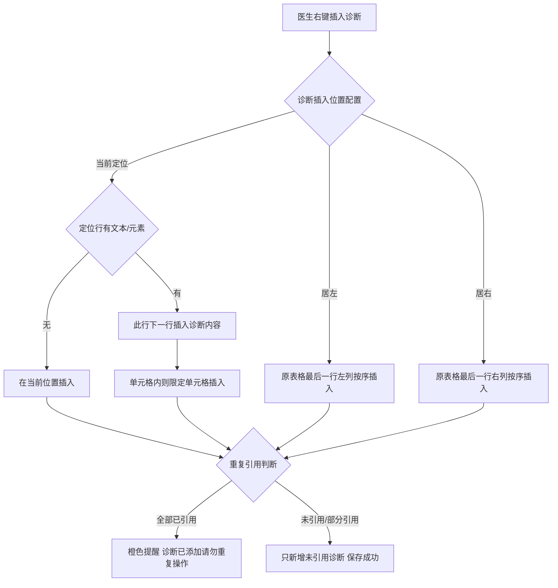
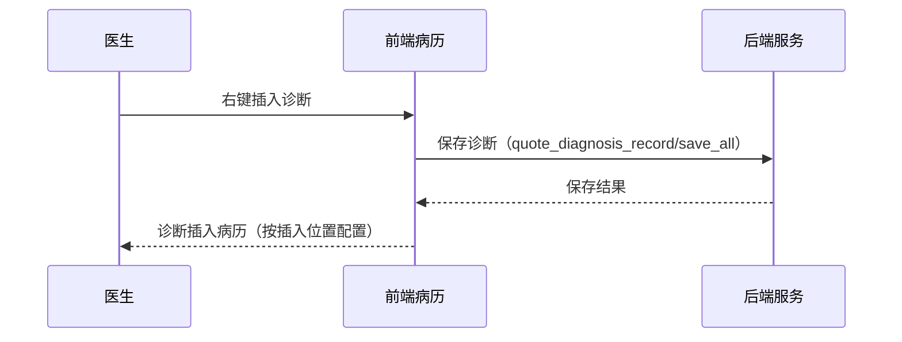

# BLGL-03-ZDYY-007 诊断插入与编辑 - Spec

> **功能编号**：BLGL-03-ZDYY-007
> **文档类型**：Spec（研发视角）
> **文档版本**：V1.0
> **编写时间**：2026-08-15
> **编写人**：RACC

---

## 文档索引

#### 章节索引

**Spec（研发视角）**

| 章节号 | 章节名称 | 内容说明 |
|--------|---------|---------|
| 1、 | 文档概述 | 文档目的、文档范围、术语定义、阅读指南、参考文档 |
| 2、 | 功能背景与定位 | 功能背景、功能定位、目标用户、核心价值 |
| 3、 | 业务流程设计 | 主流程/异常流程/边界流程（Given/When/Then） |
| 4、 | 数据模型设计 | 核心数据结构、状态定义、系统参数定义 |
| 5、 | 接口契约设计 | API列表、接口详细设计、错误码定义 |
| 6、 | 技术方案设计 | 页面路径、技术栈、关键技术点、部署方案 |
| 7、 | 测试用例预设计 | 功能/边界/异常/性能测试用例 |
| 8、 | 非功能性要求 | 性能、安全、可用性、兼容性 |
| 9、 | 依赖与风险 | 外部依赖、风险项 |
| 10、 | 附录 | 流程图、时序图、参考文档 |

**PM-Spec（业务视角）**

| 章节号 | 章节名称 | 内容说明 |
|--------|---------|---------|
| 一 | 目标 | 功能定位与核心价值 |
| 二 | 约束 | 业务/技术/非功能性约束 |
| 三 | 验收标准 | 验收条件与验证方法 |
| 四 | 排除范围 | 本次不做项与明确边界 |
| 五 | 关键决策记录 | 方案决策与选型理由 |
| 六 | 优先级 | 优先级定义 |
| 七 | 关联文档 | 关联文档索引 |
| 附录 | 填写检查清单 | 质量检查 |

**Analyst-Spec（产品视角）**

| 章节号 | 章节名称 | 内容说明 |
|--------|---------|---------|
| 一 | 功能编号体系 | 功能编号与层级结构 |
| 二 | 核心业务流程 | 核心业务流程与时序 |
| 三 | 功能规格说明 | 详细功能规格与验收标准 |
| 四 | 排除范围 | 排除范围 |
| 五 | 业务规则清单 | 业务规则清单 |
| 六 | 关联文档 | 关联文档索引 |
| 七 | 待确认问题清单 | 待确认问题汇总 |
| - | 填写检查清单 | 质量检查 |

#### 版本历史

| 版本 | 日期 | 变更说明 | 编写人 |
|------|------|---------|--------|
| V1.0 | 2026-08-15 | 初始版本 | RACC |

#### 关联文档索引

| 序号 | 文档名称 | 文档类型 | 版本 | 位置 |
|------|---------|---------|------|------|
| 1 | BLGL-03-ZDYY-007_诊断插入与编辑_PM-spec.md | PM-Spec（业务视角） | V0.1 | 本目录 |
| 2 | BLGL-03-ZDYY-007_诊断插入与编辑_Analyst-spec.md | Analyst-Spec（产品视角） | V1.0 | 本目录 |
| 3 | BLGL-03-ZDYY-007_诊断插入与编辑-Spec.md | Spec（研发视角）（本文档） | V1.0 | 本目录 |
| 4 | BLGL-03-ZDYY 诊断引用功能点Spec.md | 功能点Spec（模块级） | V1.1 | 上级目录 |
---

## 1、文档概述

### 1.1、文档目的

本文档旨在明确"诊断插入与编辑"功能（BLGL-03-ZDYY-007）的业务背景与设计方案，为需求分析、研发实现、测试验收及评审提供统一的业务上下文、设计口径与决策依据。

**具体目的包括**：

1. 梳理诊断插入与编辑功能的业务由来与历史需求演进脉络，说明"为什么要做"；
2. 明确功能的定位边界、目标用户与核心价值，回答"做成什么"；
3. 描述功能的业务流程、数据模型、接口契约与技术方案，回答"怎么做"；
4. 预设计测试用例并明确非功能性要求、依赖与风险，为研发与验收提供依据；
5. 作为 Analyst-Spec 的业务前提与设计输入，保证各层文档业务口径一致。

### 1.2、文档范围

#### 1.2.1 纳入范围

本文档覆盖诊断插入与编辑的完整业务背景与设计，包括：

- 诊断插入位置：当前定位、居左、居右
- 补充诊断插入：自定义插入、重复引用提醒
- 诊断排序：诊断顺序与患者诊断保持一致、病历同步更新顺序
- 诊断编辑：模板上编辑诊断数据、诊断控件内编辑前后缀
- 诊断另存模板：另存个人模板只清除内容不清除段落
- 诊断英文标题：右键添加诊断支持英文标题渲染

#### 1.2.2 排除范围

本文档不涉及以下内容（详见其他功能点或模块）：

- 诊断数据接入与查询（诊断组件查询/ICD-11）—— BLGL-03-ZDYY-001
- 诊断变更同步与提醒（CL025 同步方式）—— BLGL-03-ZDYY-002
- 诊断引用弹窗交互（勾选/关闭/触发方式）—— BLGL-03-ZDYY-003
- 诊断权限与签名（上级加签/职称比较）—— BLGL-03-ZDYY-004
- 诊断样式显示配置（排序/标题/序号/分隔符）—— BLGL-03-ZDYY-005
- 诊断类型引用（跨类别引用/去重/状态过滤）—— BLGL-03-ZDYY-006
- 诊断日期取值设置（引入时间/下达时间）—— BLGL-03-ZDYY-008

### 1.3、术语定义

| 术语 | 定义 |
|------|------|
| 诊断插入位置 | 入院记录诊断样式配置中控制诊断插入位置的配置项：当前定位/居左/居右 |
| 补充诊断 | 入院记录中追加补充的诊断，需支持自定义插入位置 |
| 前后缀 | 诊断名称前/后的修饰描述 |

### 1.4、阅读指南

- **章节关系**：第1~2章为业务全貌，第3~10章为设计实现层。与 Analyst-Spec、PM-Spec 互相引用保持一致。
- **读者对象**：产品经理/需求分析师读第1~2章；研发读第3~6、9~10章；测试读第3、7~8章；评审人员核对各层一致性。

### 1.5、参考文档

| 序号 | 文档名称 | 版本/日期 |
|------|---------|----------|
| 1 | 【历史需求】住院病历的历史需求.xlsx | - |
| 2 | BLGL-03-ZDYY-007_诊断插入与编辑_PM-spec.md | V0.1 |
| 3 | BLGL-03-ZDYY-007_诊断插入与编辑_Analyst-spec.md | V1.0 |
| 4 | BLGL-03-ZDYY 诊断引用功能点Spec.md | V1.1 |

---

## 2、功能背景与定位

### 2.1 功能背景

诊断插入与编辑是诊断引用模块的落笔层，需满足：

- **现状痛点**：补充诊断只能往后新增，无法自定义插入；入院记录初步诊断过多导致左侧插入内容出现空白；诊断插入后对不齐、顺序错误
- **管理要求**：诊断插入位置需参数化配置（当前定位/居左/居右）
- **历史需求演进**：诊断排序和自主编辑（需求）→ 补充诊断自定义插入（需求）→ 诊断插入位置居左居右（需求）→ 重复引用提醒（需求）

### 2.2 功能定位

"诊断插入与编辑"是 WiNEX 病历管理-诊断引用的落笔层，定位为：

- **插入控制**：诊断插入位置（当前定位/居左/居右）参数化
- **顺序一致**：诊断顺序与患者诊断保持一致
- **编辑能力**：模板上编辑诊断数据、编辑前后缀

### 2.3 目标用户

| 用户角色 | 主要使用场景 |
|---------|-------------|
| 住院医生 | 病历中插入/编辑诊断 |

### 2.4 核心价值

| 价值维度 | 价值描述 |
|---------|---------|
| 插入灵活 | 诊断插入位置可配置，避免空白 |
| 顺序准确 | 诊断顺序与患者诊断一致 |
| 重复防控 | 重复引用补充诊断提醒 |

---

## 3、业务流程设计（Given/When/Then）

### 3.1 主流程

**Scenario 1: 补充诊断自定义插入**

```gherkin
Given:
 - 入院记录诊断样式配置的诊断插入位置=当前定位

When:
 - 医生右键插入补充诊断

Then:
 - 判断当前鼠标定位行是否有文本或元素
 - 有则在此行下一行插入诊断内容，无则直接在当前位置插入
 - 若定位在表格单元格中，插入位置只能在此单元格中
```


### 3.2 异常流程

**Scenario 2: 业务异常——重复引用补充诊断**

```gherkin
Given:
 - 入院记录已补充 1、2
 - 医生第二次引用包含 1 或 2

When:
 - 右键引用补充诊断

Then:
 - 若选择的诊断已全部引用过，橙色轻提醒"诊断已添加，请勿重复操作"，引用失败，不加空白片段
 - 若未引用过或部分引用过，只新增未引用过的诊断，提醒"诊断更新，病历保存成功"
```


**Scenario 3: 数据异常——诊断插入后对不齐**

```gherkin
Given:
 - 病历引用诊断

When:
 - 插入诊断后

Then:
 - 诊断对不齐（问题）
 - 需修复插入对齐逻辑
```


**Scenario 4: 数据异常——诊断顺序错误**

```gherkin
Given:
 - 出院记录引用入院诊断

When:
 - 引用后

Then:
 - 顺序错误（问题）
 - 需与患者诊断顺序保持一致
```


### 3.3 边界流程

**Scenario 5: 边界——诊断插入位置居左/居右**

```gherkin
Given:
 - 入院记录诊断样式配置的诊断插入位置=居左/居右

When:
 - 入院记录右键插入该类型诊断

Then:
 - 居左：直接在原来诊断表格最后一行的左列按序插入，不新增表格行
 - 居右：直接在原来诊断表格最后一行的右列按序插入，不新增表格行
```


**Scenario 6: 边界——右键删除诊断**

```gherkin
Given:
 - 医生右键删除诊断

When:
 - 鼠标光标没定位在某个插入诊断片段时

Then:
 - 删除最新一条该类型的诊断
 - 定位在片段时删除定位的这条
```


---

## 4、数据模型设计

### 4.1 核心数据结构

#### 4.1.1 核心保存请求

| 字段名 | 类型 | 必填 | 备注 |
|--------|------|------|------|
| 诊断插入位置 | String | 否 | 当前定位/居左/居右 |
| 诊断信息 | - | 是 | 插入的诊断 |

> ⏳ 待确认：插入接口完整字段以代码扫描和 API 契约为准。

#### 4.1.2 核心表/实体

| 表/实体 | 关键字段 | 说明 |
|---------|---------|------|
| INP_EMR_DIAGNOSIS | inpEmrDiagnosisRecordId、inpEmrDiagnosisTypeId、inpEmrSetId、encounterId、diagnosisTypeCode、diagnosisPriSecCode、diagnosisCode | 病历引用诊断记录表 |
| INP_EMR_DIAGNOSIS_SIGNATURE | inpEmrDiagnosisTypeId、diagnosisGroupNo、inpEmrSetId、encounterId、emrDiagnosisTypeCode | 病历引用诊断类型记录表 |

### 4.2 状态定义

| ⏳ 待确认 | 状态定义 | 状态定义未在资料区中找到 |

### 4.3 系统参数定义

| 参数编码 | 参数名称 | 说明 |
|---------|---------|------|
| - | 诊断插入位置 | 入院记录诊断样式配置，下拉值：当前定位/居左/居右 |

---

## 5、接口契约设计

### 5.1 API列表

| 序号 | API名称（代码函数） | 路径 | 方法 | 说明 |
|:----:|---------|------|:----:|------|
| 1 | 保存病历引用诊断类型记录 V1 | /api/v1/app_record_inpatient/emr_inpatient/set/quote_diagnosis_record/save_all | POST | 全量覆盖引用落库 |
| 2 | 保存病历引用诊断类型记录 V2 | /api/v2/app_record_inpatient/emr_inpatient/set/quote_diagnosis_record/save | POST | 增量保存 |

### 5.2 接口详细设计

#### 5.2.1 保存病历引用诊断类型记录（save_all）

**请求参数**:
```json
{
 "inpEmrSetId": "12345",
 "encounterId": "12345",
 "diagnosisGroupList": []
}
```

**返回值（成功）**:
```json
{
 "success": true,
 "data": null
}
```

> ⏳ 待确认：插入接口字段以代码扫描和 API 契约为准。

**返回值（失败）**:
```json
{
 "success": false,
 "message": "保存诊断失败",
 "data": null
}
```

### 5.3 错误码定义

| 错误码 | 错误信息 | 处理方式 |
|--------|---------|---------|
| ⏳ 待确认 | 诊断已添加，请勿重复操作 | 橙色轻提醒，引用失败 |

---

## 6、技术方案设计

### 6.1 页面路径

- **页面路径**: 住院医生站→住院病历书写界面→入院记录（右键插入诊断）
- **前端逻辑**: mixin/emrEditor/diagnosis.js saveQuoteDiagnosisInfo 组装 diagnosisGroupList/diagnosisTypeList 调 saveQuoteDiagnosisAll 落库
- **前端 API**: src/api/global.js diagnosisApi.saveQuoteDiagnosisAll → quote_diagnosis_record/save_all

### 6.2 技术栈

| 类别 | 技术 | 版本 |
|------|------|------|
| 前端框架 | Vue | 2.6.14 |
| 前端UI | element-ui | 2.13.0 |
| 后端框架 | Spring Boot（Java 17）+ JPA/Hibernate | - |
| RPC | winning-akso-rpc-rest | - |

### 6.3 关键技术点

- 诊断插入位置配置控制前台右键插入诊断的位置判断
- 前端组装 diagnosisGroupList/diagnosisTypeList 调 saveQuoteDiagnosisAll 落库
- 诊断顺序保持与患者诊断一致

### 6.4 部署方案

⏳ 待确认：部署方案未在资料区中找到。

---

## 7、测试用例预设计

### 7.1 功能测试

| 用例编号 | 测试场景 | Given | When | Then |
|---------|---------|-------|------|------|
| TC-001 | 补充诊断自定义插入 | 诊断插入位置=当前定位 | 右键插入 | 按当前定位逻辑插入 |

### 7.2 边界测试

| 用例编号 | 测试场景 | Given | When | Then |
|---------|---------|-------|------|------|
| TC-002 | 居左/居右插入 | 诊断插入位置=居左 | 右键插入 | 左列按序插入，不新增行 |

### 7.3 异常测试

| 用例编号 | 测试场景 | Given | When | Then |
|---------|---------|-------|------|------|
| TC-003 | 重复引用补充诊断 | 已补充 1、2，再引用含 1 | 右键引用 | 橙色提醒引用失败 |

### 7.4 性能测试

| 用例编号 | 测试场景 | 指标 |
|---------|---------|------|
| TC-004 | 诊断插入响应 | ⏳ 待确认：性能指标未在资料区中找到 |

---

## 8、非功能性要求

### 8.1 性能要求

| 指标 | 要求 |
|------|------|
| 诊断插入响应时间 | ⏳ 待确认 |

### 8.2 安全要求

| 要求 | 说明 |
|------|------|
| 权限控制 | 诊断插入需病历书写权限 |

**医疗行业特殊要求**

| 要求 | 说明 |
|------|------|
| 诊断准确性 | 插入诊断与患者诊断一致，顺序正确 |

### 8.3 可用性要求

| 指标 | 要求值 |
|------|--------|
| 可用性 | ⏳ 待确认 |

### 8.4 兼容性要求

| 类型 | 要求 |
|------|------|
| 插入位置 | 当前定位/居左/居右配置兼容 |
| 模板 | 诊断另存个人模板只清除内容不清除段落 |

---

## 9、依赖与风险

### 9.1 外部依赖

| 依赖项 | 说明 |
|--------|------|
| 编辑器 | 右键插入诊断、诊断对齐 |

### 9.2 风险项

| 风险项 | 等级 | 说明 | 应对方案 |
|--------|------|------|---------|
| 插入位置判断 | 中 | 当前定位插入逻辑复杂 | 明确行/单元格判断规则 |
| 重复引用 | 中 | 重复补充诊断影响病历质量 | 引用前判断去重提醒 |

---

## 10、附录

### 10.1 流程图



### 10.2 时序图



### 10.3 参考文档

- 【历史需求】住院病历的历史需求.xlsx（需求）
- BLGL-03-ZDYY 诊断引用功能点Spec.md（V1.1，第5章 BLGL-03-ZDYY-007 行）
- 关联Spec: BLGL-03-ZDYY-007_诊断插入与编辑_PM-spec.md、BLGL-03-ZDYY-007_诊断插入与编辑_Analyst-spec.md

---

## 填写检查清单

| 序号 | 检查项 | 是否完成 |
|:----:|--------|:--------:|
| 1 | 章节索引与正文章节一致 | ✅ |
| 2 | 版本历史记录完整 | ✅ |
| 3 | 关联文档索引已登记全部Spec | ✅ |
| 4 | 文档目的明确回答"为什么做/做成什么/怎么做" | ✅ |
| 5 | 纳入范围/排除范围清晰 | ✅ |
| 6 | 术语定义覆盖关键概念，从资料区可溯源 | ✅ |
| 7 | 参考文档已登记 | ✅ |
| 8 | 功能背景基于法规/规范/需求来源组织 | ✅ |
| 9 | 功能定位体现业务价值（3~5个定位点） | ✅ |
| 10 | 目标用户角色覆盖完整，在需求原文中有出处 | ✅ |
| 11 | 核心价值可陈述，与 Phase 1 口径一致 | ✅ |
| 12 | 业务流程：主流程≥1、异常≥3、边界≥2，Given/When/Then 具体 | ✅ |
| 13 | 数据模型：字段/表/状态/参数可溯源 | ✅ |
| 14 | 接口契约：API列表+详细设计+错误码齐全或标记待确认 | ✅ |
| 15 | 技术方案：页面路径/技术栈/关键点/部署方案或标记待确认 | ✅ |
| 16 | 测试用例：功能/边界/异常/性能覆盖 | ✅ |
| 17 | 非功能性要求：性能/安全/可用性/兼容性指标可量化或标记待确认 | ✅ |
| 18 | 依赖与风险：外部依赖登记完整 | ✅ |
| 19 | 附录：流程图/时序图与正文流程一致 | ✅ |
| 20 | 全文无占位符 `< >` 残留 | ✅ |
| 21 | 全文陈述可溯源至资料区 | ✅ |
| 22 | 人工审核确认完成 | ⏳ 待确认 |

---

**文档状态**：⬜ 待审核
**维护责任**：RACC
**下次更新**：根据评审反馈优化
