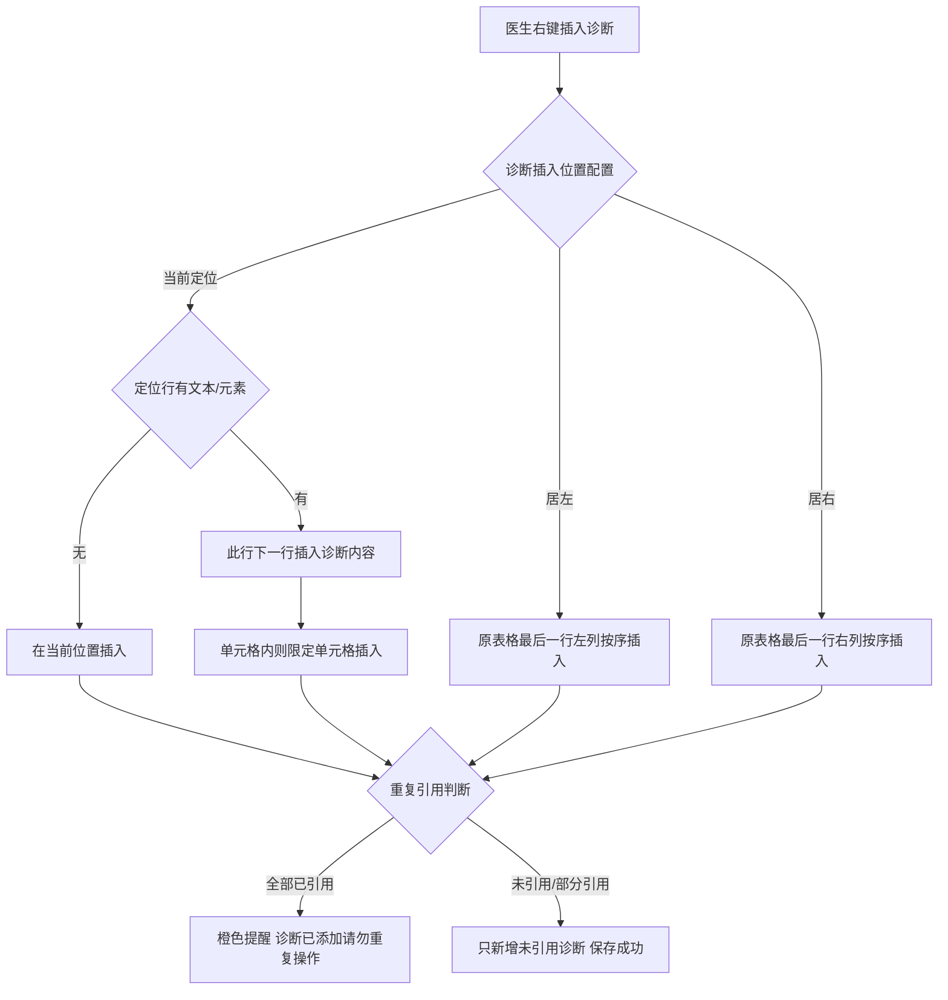
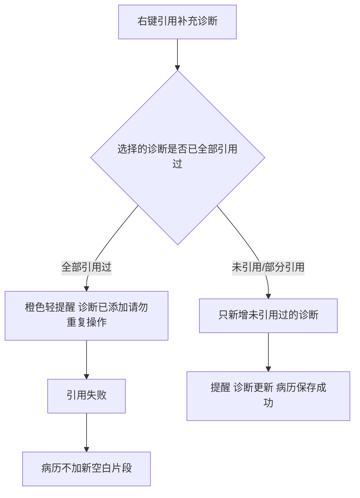

# BLGL-03-ZDYY-007 诊断插入与编辑 _ Analyst - Spec

> **需求编号**：BLGL-03-ZDYY-007
> **父需求**：BLGL-03-ZDYY
> **关联PM Spec**：BLGL-03-ZDYY-007_诊断插入与编辑_PM-spec.md
> **Spec版本**：V1.0
> **编写时间**：2026-08-15
> **编写人**：需求分析师

---

## 一、功能编号体系

### 1.1 功能层级结构

```
BLGL-03-ZDYY-007-001: 诊断插入位置
  ├─ BLGL-03-ZDYY-007-001-01: 当前定位插入
  ├─ BLGL-03-ZDYY-007-001-02: 居左插入
  ├─ BLGL-03-ZDYY-007-001-03: 居右插入
  └─ BLGL-03-ZDYY-007-001-04: 右键删除诊断

BLGL-03-ZDYY-007-002: 补充诊断插入
  ├─ BLGL-03-ZDYY-007-002-01: 补充诊断自定义插入
  └─ BLGL-03-ZDYY-007-002-02: 重复引用提醒

BLGL-03-ZDYY-007-003: 诊断排序
  ├─ BLGL-03-ZDYY-007-003-01: 顺序与患者诊断一致
  └─ BLGL-03-ZDYY-007-003-02: 病历同步更新顺序

BLGL-03-ZDYY-007-004: 诊断编辑
  ├─ BLGL-03-ZDYY-007-004-01: 模板上编辑诊断数据
  ├─ BLGL-03-ZDYY-007-004-02: 编辑前后缀
  └─ BLGL-03-ZDYY-007-004-03: 另存模板清除内容不清除段落

BLGL-03-ZDYY-007-005: 诊断英文标题
  └─ BLGL-03-ZDYY-007-005-01: 右键添加诊断英文标题渲染
```

### 1.2 功能编号表

| REQ-ID | 功能名称 | 类型 | 优先级 | 说明 |
|--------|---------|------|--------|------|
| BLGL-03-ZDYY-007-001 | 诊断插入位置 | 功能 | P0 | 插入位置配置 |
| BLGL-03-ZDYY-007-001-01 | 当前定位插入 | 子功能 | P0 | 按定位行判断插入 |
| BLGL-03-ZDYY-007-001-02 | 居左插入 | 子功能 | P0 | 最后一行为左列按序插入 |
| BLGL-03-ZDYY-007-001-03 | 居右插入 | 子功能 | P0 | 最后一行为右列按序插入 |
| BLGL-03-ZDYY-007-001-04 | 右键删除诊断 | 子功能 | P0 | 按光标定位删除最新或定位片段 |
| BLGL-03-ZDYY-007-002 | 补充诊断插入 | 功能 | P0 | 补充诊断自定义插入 |
| BLGL-03-ZDYY-007-002-01 | 补充诊断自定义插入 | 子功能 | P0 | 补充诊断可自定义插入位置 |
| BLGL-03-ZDYY-007-002-02 | 重复引用提醒 | 子功能 | P0 | 已引用过诊断引用提醒 |
| BLGL-03-ZDYY-007-003 | 诊断排序 | 功能 | P1 | 顺序与患者诊断一致 |
| BLGL-03-ZDYY-007-003-01 | 顺序与患者诊断一致 | 子功能 | P1 | 诊断顺序保持一致 |
| BLGL-03-ZDYY-007-003-02 | 病历同步更新顺序 | 子功能 | P1 | 调整顺序后病历同步更新 |
| BLGL-03-ZDYY-007-004 | 诊断编辑 | 功能 | P1 | 模板上编辑诊断数据 |
| BLGL-03-ZDYY-007-004-01 | 模板上编辑诊断数据 | 子功能 | P1 | 诊断控件内编辑前后缀 |
| BLGL-03-ZDYY-007-004-03 | 另存模板清除内容 | 子功能 | P1 | 另存个人模板只清内容不清除段落 |
| BLGL-03-ZDYY-007-005 | 诊断英文标题 | 功能 | P1 | 右键添加诊断英文标题渲染 |
| BLGL-03-ZDYY-007-005-01 | 英文标题渲染 | 子功能 | P1 | 标题英文显示新罗马字体 |

---

## 二、核心业务流程

### 2.1 诊断插入位置主流程



### 2.2 补充诊断重复引用提醒流程




---

## 三、功能规格说明

### BLGL-03-ZDYY-007-001: 诊断插入位置

#### 3.1.1 功能概述

病历业务配置→病历诊断设置→入院记录诊断样式配置：诊断插入位置新增"当前定位"（所有诊断都需要添加），前台右键插入诊断时判断当前鼠标定位行是否有文本或元素，若有则在此行下一行插入诊断内容，若无则直接在当前位置插入；若选择插入位置在表格单元格中，插入的诊断位置也只能在此单元格中。每种诊断类型诊断插入位置增加居左/居右下拉值：居左时直接在原来诊断表格最后一行的左列按序插入，不新增表格行；居右时在右列按序插入。

#### 3.1.2 用户角色

| 角色 | 使用场景 | 权限要求 | 操作频率 |
|------|---------|---------|---------|
| 住院医生 | 入院记录右键插入诊断 | 病历书写权限 | 高频 |
| 病案管理员 | 配置诊断插入位置 | 配置权限 | 低频 |

#### 3.1.3 业务流程（Given/When/Then）

**Scenario 1: 当前定位插入（主流程）**

```gherkin
Given:
  - 入院记录诊断样式配置的诊断插入位置=当前定位

When:
  - 医生右键插入诊断

Then:
  - 判断当前鼠标定位行是否有文本或元素
  - 有则在此行下一行插入诊断内容
  - 无则直接在当前位置插入
  - 若定位在表格单元格中，插入位置只能在此单元格中
```


**Scenario 2: 居左/居右插入**

```gherkin
Given:
  - 诊断插入位置=居左/居右

When:
  - 入院记录右键插入该类型诊断

Then:
  - 居左：直接在原来诊断表格最后一行的左列按序插入，不新增表格行
  - 居右：直接在原来诊断表格最后一行的右列按序插入，不新增表格行
```


**Scenario 3: 右键删除诊断**

```gherkin
Given:
  - 医生右键删除诊断

When:
  - 鼠标光标没定位在某个插入诊断片段

Then:
  - 删除最新一条该类型的诊断
  - 定位在片段时删除定位的这条
```


**Scenario 4: 边界——初步诊断过多**

```gherkin
Given:
  - 入院记录初步诊断过多

When:
  - 按居左/居右排列插入诊断

Then:
  - 不换表格行，不出现大片空白
```


#### 3.1.5 验收标准

| AC编号 | 验收标准 | 对应REQ-ID | 验证方法 | 验证场景 |
|--------|---------|-----------|---------|---------|
| AC-001 | 当前定位插入按定位行判断，单元格内限定单元格 | BLGL-03-ZDYY-007-001 | 功能测试 | Scenario 1 |
| AC-002 | 居左/居右插入不新增表格行 | BLGL-03-ZDYY-007-001 | 功能测试 | Scenario 2 |
| AC-003 | 右键删除按光标定位删除最新或定位片段 | BLGL-03-ZDYY-007-001 | 功能测试 | Scenario 3 |

---

### BLGL-03-ZDYY-007-002: 补充诊断插入

#### 3.2.1 功能概述

补充诊断可自定义插入位置，目前插入不了、只会往后新增。入院记录第二次右键添加补充诊断已添加过的诊断需提醒：如果选择的诊断病历里已全部引用过，橙色轻提醒"诊断已添加，请勿重复操作"，引用失败，不加新空白片段；如果未引用过或部分引用过，只新增未引用过的诊断，提醒"诊断更新，病历保存成功"。

#### 3.2.2 用户角色

| 角色 | 使用场景 | 权限要求 | 操作频率 |
|------|---------|---------|---------|
| 住院医生 | 入院记录补充诊断 | 病历书写权限 | 高频 |

#### 3.2.3 业务流程（Given/When/Then）

**Scenario 1: 补充诊断自定义插入（主流程）**

```gherkin
Given:
  - 入院记录诊断样式配置的诊断插入位置=当前定位

When:
  - 医生右键插入补充诊断

Then:
  - 按当前定位逻辑插入
  - 可自定义插入位置而非只往后新增
```


**Scenario 2: 重复引用提醒**

```gherkin
Given:
  - 入院记录已补充 1、2
  - 医生第二次引用包含 1 或 2

When:
  - 右键引用补充诊断

Then:
  - 若全部已引用：橙色轻提醒"诊断已添加，请勿重复操作"，引用失败，不加新空白片段
  - 若未引用/部分引用：只新增未引用过的诊断，提醒"诊断更新，病历保存成功"
```


**Scenario 3: 异常——补充诊断不显示**

```gherkin
Given:
  - 入院记录添加完补充诊断

When:
  - 查看入院记录

Then:
  - 入院记录上面不显示（问题）
  - 需排查补充诊断落库/渲染逻辑
```


#### 3.2.5 验收标准

| AC编号 | 验收标准 | 对应REQ-ID | 验证方法 | 验证场景 |
|--------|---------|-----------|---------|---------|
| AC-004 | 补充诊断可自定义插入位置 | BLGL-03-ZDYY-007-002 | 功能测试 | Scenario 1 |
| AC-005 | 重复引用时橙色提醒引用失败，部分引用只新增未引用诊断 | BLGL-03-ZDYY-007-002 | 功能测试 | Scenario 2 |

---

### BLGL-03-ZDYY-007-003: 诊断排序

#### 3.3.1 功能概述

患者的诊断信息可以调整先后顺序，病历同步更新顺序；患者诊断的主诊断和辅诊断可调整（已实现）。出院记录引用入院诊断时顺序错误需修复，引用出院诊断到病案首页时伴并发症顺序按诊断顺序来。

#### 3.3.2 用户角色

| 角色 | 使用场景 | 权限要求 | 操作频率 |
|------|---------|---------|---------|
| 住院医生 | 病历中查看/调整诊断顺序 | 病历书写权限 | 高频 |

#### 3.3.3 业务流程（Given/When/Then）

**Scenario 1: 诊断顺序一致（主流程）**

```gherkin
Given:
  - 患者诊断信息可调整先后顺序

When:
  - 调整顺序

Then:
  - 病历同步更新顺序
```


**Scenario 2: 异常——出院记录引用入院诊断顺序错误**

```gherkin
Given:
  - 出院记录引用入院诊断

When:
  - 引用后

Then:
  - 顺序错误（问题）
  - 需修复顺序保持与患者诊断一致
```


**Scenario 3: 边界——伴并发症顺序**

```gherkin
Given:
  - 引用出院诊断到病案首页

When:
  - 引用第二条伴并发症

Then:
  - 按诊断顺序来，不能到最后一条
```


#### 3.3.5 验收标准

| AC编号 | 验收标准 | 对应REQ-ID | 验证方法 | 验证场景 |
|--------|---------|-----------|---------|---------|
| AC-006 | 诊断顺序与患者诊断保持一致 | BLGL-03-ZDYY-007-003 | 功能测试 | Scenario 1/2 |

---

### BLGL-03-ZDYY-007-004: 诊断编辑

#### 3.4.1 功能概述

在病历模板上支持编辑诊断数据（在诊断控件内支持编辑前后缀）；患者的诊断信息可以调整先后顺序，病历同步更新顺序；另存为个人模板时，模板上预制的诊断数据元只清空数据元的内容，不要把诊断在的这一行整个删掉。

#### 3.4.2 用户角色

| 角色 | 使用场景 | 权限要求 | 操作频率 |
|------|---------|---------|---------|
| 住院医生 | 病历中编辑诊断 | 病历书写权限 | 中频 |

#### 3.4.3 业务流程（Given/When/Then）

**Scenario 1: 模板上编辑诊断数据（主流程）**

```gherkin
Given:
  - 病历模板上有诊断数据

When:
  - 医生编辑诊断数据

Then:
  - 在诊断控件内支持编辑前后缀
```


**Scenario 2: 另存模板清除内容**

```gherkin
Given:
  - 医生将病历另存为个人模板
  - 模板上预制诊断数据元

When:
  - 另存操作

Then:
  - 只清空数据元的内容
  - 不要把诊断在的这一行整个删掉
```


#### 3.4.5 验收标准

| AC编号 | 验收标准 | 对应REQ-ID | 验证方法 | 验证场景 |
|--------|---------|-----------|---------|---------|
| AC-007 | 模板上可编辑诊断数据（含前后缀） | BLGL-03-ZDYY-007-004 | 功能测试 | Scenario 1 |
| AC-008 | 另存个人模板只清内容不清除段落 | BLGL-03-ZDYY-007-004 | 功能测试 | Scenario 2 |

---

### BLGL-03-ZDYY-007-005: 诊断英文标题

#### 3.5.1 功能概述

不管是模板上的标题还是右键或者通过预制诊断元素插入的诊断，标题里面的英文都需要显示为新罗马字体。模板设计器增加模板配置英文字体，医院模板和个人模板支持批量修改，病历编辑时右键或通过预制诊断元素插入的诊断，标题里的中文和英文都渲染成模板配置的字体。

#### 3.5.2 用户角色

| 角色 | 使用场景 | 权限要求 | 操作频率 |
|------|---------|---------|---------|
| 病案管理员 | 配置模板英文字体 | 配置权限 | 低频 |

#### 3.5.3 业务流程（Given/When/Then）

**Scenario 1: 英文标题渲染（主流程）**

```gherkin
Given:
  - 模板设计器已配置英文字体

When:
  - 病历编辑时右键或通过预制诊断元素插入诊断

Then:
  - 标题里的英文显示为新罗马字体
  - 中文和英文都渲染成模板配置的字体
```


#### 3.5.5 验收标准

| AC编号 | 验收标准 | 对应REQ-ID | 验证方法 | 验证场景 |
|--------|---------|-----------|---------|---------|
| AC-009 | 右键/预制元素插入诊断标题英文渲染为新罗马字体 | BLGL-03-ZDYY-007-005 | 功能测试 | Scenario 1 |

---

## 四、排除范围

本需求不包含以下功能项：

1. **诊断数据接入与查询**（诊断组件查询/ICD-11）—— BLGL-03-ZDYY-001
2. **诊断变更同步与提醒**（CL025 同步方式/强制同步）—— BLGL-03-ZDYY-002
3. **诊断引用弹窗交互**（勾选/关闭/触发方式）—— BLGL-03-ZDYY-003
4. **诊断权限与签名**（上级加签/职称比较）—— BLGL-03-ZDYY-004
5. **诊断样式显示配置**（排序/标题/序号/分隔符）—— BLGL-03-ZDYY-005
6. **诊断类型引用**（跨类别引用/去重/状态过滤）—— BLGL-03-ZDYY-006
7. **诊断日期取值设置**（引入时间/下达时间）—— BLGL-03-ZDYY-008

---

## 五、业务规则清单

| 规则ID | 规则名称 | 规则描述 | 优先级 |
|--------|---------|---------|--------|
| BR-001 | 当前定位插入 | 诊断插入位置为当前定位时，判断定位行有文本/元素则下一行插入，无则当前位置插入；单元格内限定单元格 | P0 |
| BR-002 | 居左居右插入 | 居左在原来诊断表格最后一行为左列按序插入，居右在右列，不新增表格行 | P0 |
| BR-003 | 右键删除 | 右键删除诊断时，光标未定位片段删除最新一条该类型诊断，定位片段删除定位的这条 | P0 |
| BR-004 | 重复引用提醒 | 补充诊断全部引用过则橙色轻提醒"诊断已添加，请勿重复操作"引用失败；部分引用只新增未引用诊断 | P0 |
| BR-005 | 顺序一致 | 患者诊断信息调整先后顺序，病历同步更新顺序 | P1 |
| BR-006 | 另存模板 | 另存为个人模板时只清空诊断数据元内容，不清除诊断所在行 | P1 |

---

## 六、关联文档

| 文档类型 | 文档路径 | 说明 |
|---------|---------|------|
| 功能点Spec（模块级） | BLGL-03-ZDYY 诊断引用功能点Spec.md（V1.1，上级目录） | Phase 1 功能点索引 |
| PM-Spec（业务视角） | 本目录 BLGL-03-ZDYY-007_诊断插入与编辑_PM-spec.md（V0.1） | PM 产出的 Spec 文档 |
| Spec（研发视角） | 本目录 BLGL-03-ZDYY-007_诊断插入与编辑-Spec.md（V1.0） | 业务背景与目标 Spec |
| data-model.md | 待产出 | 架构师产出的数据建模文档 |
| design.md | 待产出 | 架构师产出的技术方案文档 |
| api-contract.md | 待产出 | 开发经理产出的 API 契约文档 |

---

## 七、待确认问题清单

| 编号 | 问题描述 | 缺失信息 | 影响范围 | 建议补充方 |
|------|---------|---------|---------|-----------|
| Q-001 | 诊断插入接口完整入参/出参 | API 契约 | -Spec 第5章 | 开发经理 |
| Q-002 | 诊断插入位置参数概念 ID | 概念ID | 3.1.4 | 产品经理 |
| Q-003 | 插入后对不齐、顺序错误根因 | 需求分析原文缺失 | 3.3.3 | 开发经理 |
| Q-004 | 诊断顺序调整的前端交互细节 | 需求分析原文 | 3.3.3 Scenario 1 | 需求分析师 |
| Q-005 | 性能指标（诊断插入响应时间） | 资料区无量化指标 | -Spec 第8章 | 产品经理 |

---

## 填写检查清单

| 序号 | 检查项 | 是否完成 |
|:----:|--------|:--------:|
| 1 | 功能编号带父子层级 | ✅ |
| 2 | 每个 REQ-ID 有功能概述和用户角色 | ✅ |
| 3 | 主流程至少 1 个 Given/When/Then 场景 | ✅ |
| 4 | 异常流程至少 3 个 Given/When/Then 场景 | ✅ |
| 5 | 边界流程至少 2 个 Given/When/Then 场景 | ✅ |
| 6 | 每个 Given/When/Then 内容具体，不模糊 | ✅ |
| 7 | 数据字段定义完整（字段名、类型、必填、说明、概念ID） | ✅ |
| 8 | 验收标准 AC 编号独立，可验证 | ✅ |
| 9 | 验收标准无"功能正常"等模糊表述 | ✅ |
| 10 | 排除范围明确列出 | ✅ |
| 11 | 业务规则清单列出所有规则，每条标注来源 | ✅ |
| 12 | 流程图使用 Mermaid 格式（≥2 个） | ✅ |
| 13 | 关联文档索引包含 Phase 1 功能点Spec | ✅ |
| 14 | 待确认问题清单汇总了全文所有 ⏳ 项 | ✅ |
| 15 | 全文无占位符 `< >` 残留 | ✅ |
| 16 | 全文陈述可溯源至资料区（S1~S10 溯源核查） | ✅ |
| 17 | 人工审核确认完成 | ⏳ 待确认 |

---

**文档状态**：⬜ 待审核
**维护责任**：需求分析师规范组
**下次更新**：根据评审反馈优化

---

## 版本历史

| 版本 | 日期 | 变更说明 | 编写人 |
|------|------|---------|--------|
| V1.0 | 2026-08-15 | 初始版本 | 需求分析师 |
