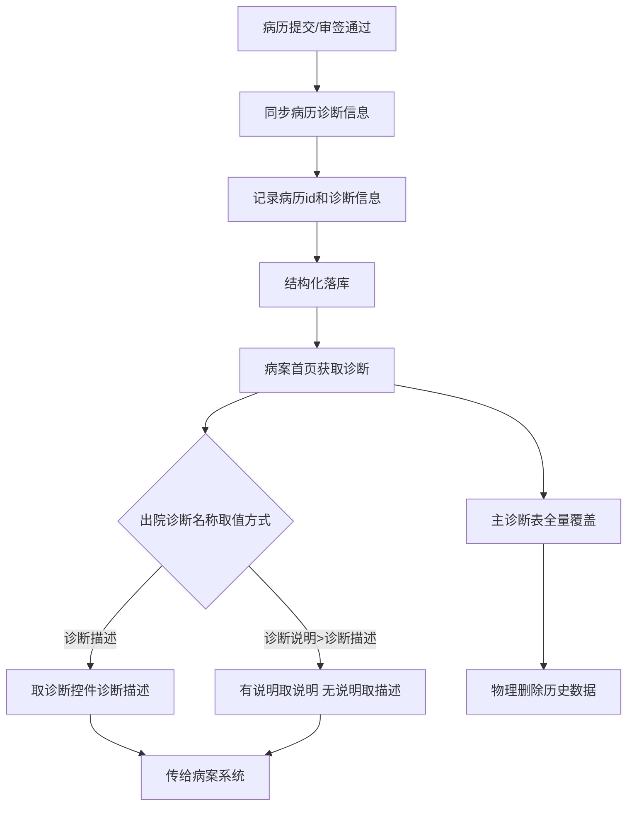
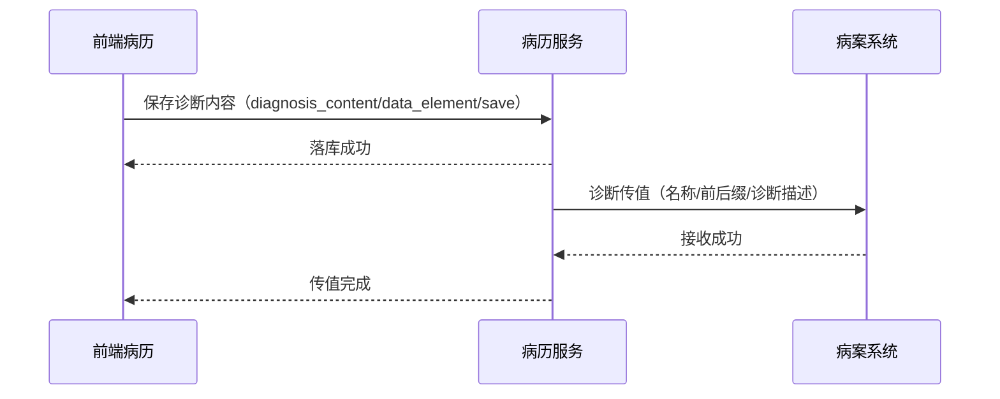

# BLGL-03-ZDYY-008 诊断落库与对外对接 - Spec

> **功能编号**：BLGL-03-ZDYY-008
> **文档类型**：Spec（研发视角）
> **文档版本**：V1.0
> **编写时间**：2026-08-15
> **编写人**：RACC

---

## 文档索引

#### 章节索引

**Spec（研发视角）**

| 章节号 | 章节名称 | 内容说明 |
|--------|---------|---------|
| 1、 | 文档概述 | 文档目的、文档范围、术语定义、阅读指南、参考文档 |
| 2、 | 功能背景与定位 | 功能背景、功能定位、目标用户、核心价值 |
| 3、 | 业务流程设计 | 主流程/异常流程/边界流程（Given/When/Then） |
| 4、 | 数据模型设计 | 核心数据结构、状态定义、系统参数定义 |
| 5、 | 接口契约设计 | API列表、接口详细设计、错误码定义 |
| 6、 | 技术方案设计 | 页面路径、技术栈、关键技术点、部署方案 |
| 7、 | 测试用例预设计 | 功能/边界/异常/性能测试用例 |
| 8、 | 非功能性要求 | 性能、安全、可用性、兼容性 |
| 9、 | 依赖与风险 | 外部依赖、风险项 |
| 10、 | 附录 | 流程图、时序图、参考文档 |

**PM-Spec（业务视角）**

| 章节号 | 章节名称 | 内容说明 |
|--------|---------|---------|
| 一 | 目标 | 功能定位与核心价值 |
| 二 | 约束 | 业务/技术/非功能性约束 |
| 三 | 验收标准 | 验收条件与验证方法 |
| 四 | 排除范围 | 本次不做项与明确边界 |
| 五 | 关键决策记录 | 方案决策与选型理由 |
| 六 | 优先级 | 优先级定义 |
| 七 | 关联文档 | 关联文档索引 |
| 附录 | 填写检查清单 | 质量检查 |

**Analyst-Spec（产品视角）**

| 章节号 | 章节名称 | 内容说明 |
|--------|---------|---------|
| 一 | 功能编号体系 | 功能编号与层级结构 |
| 二 | 核心业务流程 | 核心业务流程与时序 |
| 三 | 功能规格说明 | 详细功能规格与验收标准 |
| 四 | 排除范围 | 排除范围 |
| 五 | 业务规则清单 | 业务规则清单 |
| 六 | 关联文档 | 关联文档索引 |
| 七 | 待确认问题清单 | 待确认问题汇总 |
| - | 填写检查清单 | 质量检查 |

#### 版本历史

| 版本 | 日期 | 变更说明 | 编写人 |
|------|------|---------|--------|
| V1.0 | 2026-08-15 | 初始版本 | RACC |

#### 关联文档索引

| 序号 | 文档名称 | 文档类型 | 版本 | 位置 |
|------|---------|---------|------|------|
| 1 | BLGL-03-ZDYY-008_诊断落库与对外对接_PM-spec.md | PM-Spec（业务视角） | V0.1 | 本目录 |
| 2 | BLGL-03-ZDYY-008_诊断落库与对外对接_Analyst-spec.md | Analyst-Spec（产品视角） | V1.0 | 本目录 |
| 3 | BLGL-03-ZDYY-008_诊断落库与对外对接-Spec.md | Spec（研发视角）（本文档） | V1.0 | 本目录 |
| 4 | BLGL-03-ZDYY 诊断引用功能点Spec.md | 功能点Spec（模块级） | V1.1 | 上级目录 |
---

## 1、文档概述

### 1.1、文档目的

本文档旨在明确"诊断落库与对外对接"功能（BLGL-03-ZDYY-008）的业务背景与设计方案，为需求分析、研发实现、测试验收及评审提供统一的业务上下文、设计口径与决策依据。

**具体目的包括**：

1. 梳理诊断落库与对外对接功能的业务由来与历史需求演进脉络，说明"为什么要做"；
2. 明确功能的定位边界、目标用户与核心价值，回答"做成什么"；
3. 描述功能的业务流程、数据模型、接口契约与技术方案，回答"怎么做"；
4. 预设计测试用例并明确非功能性要求、依赖与风险，为研发与验收提供依据；
5. 作为 Analyst-Spec 的业务前提与设计输入，保证各层文档业务口径一致。

### 1.2、文档范围

#### 1.2.1 纳入范围

本文档覆盖诊断落库与对外对接的完整业务背景与设计，包括：

- 诊断内容结构化落库：病历提交/审签通过时同步病历诊断信息
- 主诊断表删除优化：入区/引用诊断/出区/归档四节点全量覆盖改为物理删除
- 病案首页诊断传值：诊断名称按字典传值、前后缀分开传、诊断描述拼接
- 诊断说明落库：INP_EMR_MAHP_DIAG 新增诊断说明字段、出院诊断名称取值方式参数
- 医疗资源占比：首页诊断新增字段【医疗资源占比】并传给病案系统
- 诊断日期取值设置：诊断日期是否需要更新、诊断日期取值设置（引入时间/最早下达时间）
- 诊断证明书治疗经过接口：病历提供最新"诊疗经过"数据

#### 1.2.2 排除范围

本文档不涉及以下内容（详见其他功能点或模块）：

- 诊断数据接入与查询（诊断组件查询/ICD-11）—— BLGL-03-ZDYY-001
- 诊断变更同步与提醒（CL025 同步方式）—— BLGL-03-ZDYY-002
- 诊断引用弹窗交互（勾选/关闭/触发方式）—— BLGL-03-ZDYY-003
- 诊断样式显示配置（排序/标题/序号/分隔符）—— BLGL-03-ZDYY-005
- 诊断插入与编辑（插入位置/序号重算）—— BLGL-03-ZDYY-007

### 1.3、术语定义

| 术语 | 定义 |
|------|------|
| 结构化落库 | 病历诊断内容建立数据模型，病历提交/审签通过时同步病历中的诊断信息，记录病历 id 和诊断信息 |
| INP_EMR_MAHP_DIAG | 病案首页诊断表，新增"诊断说明"字段 |
| 诊断说明 | 医生站接口返回的诊断说明，需保存至 INP_EMR_MAHP_DIAG |
| 医疗资源占比 | 临床出院诊断界面新增字段，通过病历接口传给病案首页/病案系统 |
| 诊断日期取值设置 | 入院记录诊断样式配置中控制诊断日期取值（0-诊断引入时间 / 1-诊断最早下达时间） |

### 1.4、阅读指南

- **章节关系**：第1~2章为业务全貌，第3~10章为设计实现层。与 Analyst-Spec、PM-Spec 互相引用保持一致。
- **读者对象**：产品经理/需求分析师读第1~2章；研发读第3~6、9~10章；测试读第3、7~8章；评审人员核对各层一致性。

### 1.5、参考文档

| 序号 | 文档名称 | 版本/日期 |
|------|---------|----------|
| 1 | 【历史需求】住院病历的历史需求.xlsx | - |
| 2 | BLGL-03-ZDYY-008_诊断落库与对外对接_PM-spec.md | V0.1 |
| 3 | BLGL-03-ZDYY-008_诊断落库与对外对接_Analyst-spec.md | V1.0 |
| 4 | BLGL-03-ZDYY 诊断引用功能点Spec.md | V1.1 |

---

## 2、功能背景与定位

### 2.1 功能背景

诊断落库与对外对接是诊断引用模块的数据沉淀层，需满足：

- **现状痛点**：病历诊断内容未结构化落库，病历提交/审签后诊断信息无法按病历 id 检索；病案首页诊断传值未按字典规范，中医诊断编码相同名称不一致时病案首页显示不正确；入区/引用诊断/出区/归档四节点全量覆盖产生大量逻辑删除垃圾数据
- **管理要求**：病案首页出院诊断名称取值方式需参数化（诊断描述/诊断说明>诊断描述）
- **历史需求演进**：病历诊断内容结构化落库（需求）→ 主诊断表删除逻辑优化（需求）→ 病案首页获取诊断逻辑（需求）→ 医疗资源占比传病案系统（需求）→ 诊断传值改造（需求）→ 诊断日期取值设置（需求）

### 2.2 功能定位

"诊断落库与对外对接"是 WiNEX 病历管理-诊断引用的数据沉淀层，定位为：

- **结构化落库**：病历诊断内容结构化落库，支持病历 id 关联
- **对外传值**：病案首页/病案系统诊断传值规范化
- **数据治理**：主诊断表删除优化、诊断日期取值规则

### 2.3 目标用户

| 用户角色 | 主要使用场景 |
|---------|-------------|
| 病案管理员 | 配置病案首页诊断取值方式、监控病历类型 |
| 住院医生 | 病历提交/审签（触发诊断落库） |
| 病案系统 | 接收病历诊断传值 |

### 2.4 核心价值

| 价值维度 | 价值描述 |
|---------|---------|
| 数据可用 | 诊断内容结构化落库，支持按病历 id 检索 |
| 传值规范 | 诊断名称按字典传值、前后缀分开传 |
| 数据治理 | 主诊断表物理删除减少垃圾数据 |

---

## 3、业务流程设计（Given/When/Then）

### 3.1 主流程

**Scenario 1: 病历诊断内容结构化落库**

```gherkin
Given:
 - 病历诊断内容已建立数据模型
 - 病历中存在诊断信息

When:
 - 病历提交或病历审签通过

Then:
 - 同步病历中的诊断信息
 - 记录病历 id 和诊断信息
```


### 3.2 异常流程

**Scenario 2: 业务异常——主诊断表覆盖未物理删除**

```gherkin
Given:
 - 入区/引用诊断/出区/归档四节点保存主诊断时全量覆盖

When:
 - 覆盖历史主诊断数据

Then:
 - 历史数据原本逻辑删除，垃圾数据太多
 - 需改为物理删除
```


**Scenario 3: 数据异常——病案首页诊断显示不正确**

```gherkin
Given:
 - 中医诊断编码相同但名称不一致
 - 病历系统传给病案首页系统的诊断字段未按字典规范传值

When:
 - 病案首页展示诊断

Then:
 - 病案首页显示不正确
 - 需按字典传值、前后缀分开传、诊断描述拼接
```


**Scenario 4: 数据异常——诊断日期取值**

```gherkin
Given:
 - 入院记录诊断样式配置的诊断日期取值设置=1（诊断最早下达时间）

When:
 - 插入补充/修正诊断

Then:
 - 诊断日期取当前插入的诊断中诊断日期最早的那条诊断的时间
```


### 3.3 边界流程

**Scenario 5: 边界——诊断日期是否更新**

```gherkin
Given:
 - 参数"入院记录诊断样式中的诊断日期是否需要更新"

When:
 - 病历修改诊断

Then:
 - 参数=是：每次修改诊断更新诊断引入时间
 - 参数=否（默认是）：诊断首次添加后获取引入时间就不再更新
```


**Scenario 6: 边界——出院诊断名称取值方式**

```gherkin
Given:
 - 病案首页配置参数"出院诊断诊断名称取值方式"

When:
 - 病案首页展示出院诊断

Then:
 - =诊断描述：取诊断控件中的诊断描述
 - =诊断说明>诊断描述：有说明优先取说明，没有取描述
```


---

## 4、数据模型设计

### 4.1 核心数据结构

#### 4.1.1 核心保存请求

| 字段名 | 类型 | 必填 | 备注 |
|--------|------|------|------|
| 病历 id | Long | 是 | 结构化落库记录病历 id |
| 诊断信息 | - | 是 | 病历诊断内容 |
| 诊断说明 | String | 否 | INP_EMR_MAHP_DIAG 新增字段 |
| 医疗资源占比 | String | 否 | 首页诊断新增字段（数据元 399770837） |

> ⏳ 待确认：落库/传值接口完整字段以代码扫描和 API 契约为准。

#### 4.1.2 核心表/实体

| 表/实体 | 关键字段 | 说明 |
|---------|---------|------|
| INP_EMR_DIAGNOSIS | inpEmrDiagnosisRecordId、inpEmrDiagnosisTypeId、inpEmrSetId、encounterId、diagnosisTypeCode、diagnosisPriSecCode、diagnosisCode、diagnosisModifiedAt | 病历引用诊断记录表 |
| INP_EMR_DIAGNOSIS_RECORD | inpEmrDiagnosisRecordId、diagnosisGroupNo、quoteAt、diagnosisTypeCode、diagnosisNo、diagnosisCodeSystemId、diagnosisCode、diagnosisDesc、diagnosisPrefixName、diagnosisSuffixName、diagnosisAt、seqNo | 诊断引用记录表（结构化明细，来源：代码） |
| INPATIENT_RHB_DIAGNOSIS | inpatientRhbDiagnosisId、inpRhbRecordId、encounterId、patientEncounterDiagnosisId、diagnosisTypeCode、diagnosisCode、diagnosisDesc、diagnosisPrefixName、diagnosisSuffixName、diagnosisDate | 住院病历患者就诊主诊断表 |
| INP_EMR_MAHP_DIAG | 诊断说明 | 病案首页诊断表，新增"诊断说明"字段 |

### 4.2 状态定义

| ⏳ 待确认 | 状态定义 | 状态定义未在资料区中找到 |

### 4.3 系统参数定义

| 参数编码 | 参数名称 | 说明 |
|---------|---------|------|
| - | 出院诊断诊断名称取值方式 | 诊断描述/诊断说明>诊断描述，默认诊断描述 |
| - | 入院记录诊断样式中的诊断日期是否需要更新 | 是/否，默认是 |
| - | 诊断日期取值设置 | 0-诊断引入时间 / 1-诊断最早下达时间，默认 0 |
| - | 没有患者出区时间时取医嘱出院时间的病历监控类型 | 默认无，多选病历监控类型 |

---

## 5、接口契约设计

### 5.1 API列表

| 序号 | API名称（代码函数） | 路径 | 方法 | 说明 |
|:----:|---------|------|:----:|------|
| 1 | 存储住院病历内容结构化数据 | /api/v1/app_record_inpatient/emr_inpatient/diagnosis_content/data_element/save | POST | 专门用来下诊断的结构化落库 |
| 2 | 保存引用诊断（全部文书结构化） | /api/v2/app_record_inpatient/emr_inpatient/quote_diagnosis/save | POST | 保存引用诊断 |
| 3 | 保存病历引用诊断类型记录 V1 | /api/v1/app_record_inpatient/emr_inpatient/set/quote_diagnosis_record/save_all | POST | 全量覆盖引用落库 |

### 5.2 接口详细设计

#### 5.2.1 存储住院病历内容结构化数据（diagnosis_content/data_element/save）

**请求参数**:
```json
{
 "inpEmrSetId": "12345",
 "diagnosisContent": {}
}
```

**返回值（成功）**:
```json
{
 "success": true,
 "data": null
}
```

> ⏳ 待确认：结构化落库接口字段以代码扫描和 API 契约为准。

**返回值（失败）**:
```json
{
 "success": false,
 "message": "保存诊断内容失败",
 "data": null
}
```

### 5.3 错误码定义

| 错误码 | 错误信息 | 处理方式 |
|--------|---------|---------|
| ⏳ 待确认 | 保存诊断内容失败 | 提示医生，病历保持原状态 |

---

## 6、技术方案设计

### 6.1 页面路径

- **页面路径**: 住院医生站→住院病历书写界面（病历提交/审签触发落库）
- **核心逻辑模块**: InpatientEmrRecordController.saveEmrDaignosisContentDataElementV2（存储住院病历内容结构化数据，专门用来下诊断）
- **前端 API**: src/api/global.js diagnosisApi.saveEmrContentByDiagnosis → emr_inpatient/diagnosis_content/data_element/save

### 6.2 技术栈

| 类别 | 技术 | 版本 |
|------|------|------|
| 前端框架 | Vue | 2.6.14 |
| 前端UI | element-ui | 2.13.0 |
| 后端框架 | Spring Boot（Java 17）+ JPA/Hibernate | - |
| RPC | winning-akso-rpc-rest | - |

### 6.3 关键技术点

- 病历提交、病历审签通过时同步病历中的诊断信息，记录病历 id
- 首页诊断传值：诊断名称按字典传值、前后缀分开传、诊断描述按前缀+名称+后缀拼接
- 入区/引用诊断/出区/归档四节点保存主诊断全量覆盖改为物理删除

### 6.4 部署方案

⏳ 待确认：部署方案未在资料区中找到。

---

## 7、测试用例预设计

### 7.1 功能测试

| 用例编号 | 测试场景 | Given | When | Then |
|---------|---------|-------|------|------|
| TC-001 | 诊断内容结构化落库 | 病历有诊断信息 | 病历提交/审签通过 | 同步诊断信息，记录病历 id |

### 7.2 边界测试

| 用例编号 | 测试场景 | Given | When | Then |
|---------|---------|-------|------|------|
| TC-002 | 出院诊断名称取值 | 参数=诊断说明>诊断描述 | 病案首页展示 | 有说明取说明，无说明取描述 |

### 7.3 异常测试

| 用例编号 | 测试场景 | Given | When | Then |
|---------|---------|-------|------|------|
| TC-003 | 主诊断覆盖物理删除 | 入区/引用诊断/出区/归档保存主诊断 | 全量覆盖 | 历史数据物理删除 |

### 7.4 性能测试

| 用例编号 | 测试场景 | 指标 |
|---------|---------|------|
| TC-004 | 诊断落库响应 | ⏳ 待确认：性能指标未在资料区中找到 |

---

## 8、非功能性要求

### 8.1 性能要求

| 指标 | 要求 |
|------|------|
| 诊断落库响应时间 | ⏳ 待确认 |

### 8.2 安全要求

| 要求 | 说明 |
|------|------|
| 数据一致性 | 病历诊断与病案首页/病案系统传值一致 |

**医疗行业特殊要求**

| 要求 | 说明 |
|------|------|
| 诊断准确性 | 病案首页诊断按字典传值，避免名称不一致 |

### 8.3 可用性要求

| 指标 | 要求值 |
|------|--------|
| 可用性 | ⏳ 待确认 |

### 8.4 兼容性要求

| 类型 | 要求 |
|------|------|
| 诊断日期 | 诊断日期取值设置兼容引入时间/下达时间 |
| 传值规范 | 诊断名称按字典传值、前后缀分开传兼容多版本 |

---

## 9、依赖与风险

### 9.1 外部依赖

| 依赖项 | 说明 |
|--------|------|
| 病案首页系统 | 诊断传值 |
| 病案系统 | 医疗资源占比等字段传递 |
| 医生站诊断接口 | 诊断说明返回 |

### 9.2 风险项

| 风险项 | 等级 | 说明 | 应对方案 |
|--------|------|------|---------|
| 传值不一致 | 中 | 中医诊断编码相同名称不一致导致病案首页显示不正确 | 按字典规范传值 |
| 删除误伤 | 中 | 主诊断表物理删除需谨慎 | 明确删除边界 |

---

## 10、附录

### 10.1 流程图



### 10.2 时序图



### 10.3 参考文档

- 【历史需求】住院病历的历史需求.xlsx（需求）
- BLGL-03-ZDYY 诊断引用功能点Spec.md（V1.1，第5章 BLGL-03-ZDYY-008 行）
- 关联Spec: BLGL-03-ZDYY-008_诊断落库与对外对接_PM-spec.md、BLGL-03-ZDYY-008_诊断落库与对外对接_Analyst-spec.md

---

## 填写检查清单

| 序号 | 检查项 | 是否完成 |
|:----:|--------|:--------:|
| 1 | 章节索引与正文章节一致 | ✅ |
| 2 | 版本历史记录完整 | ✅ |
| 3 | 关联文档索引已登记全部Spec | ✅ |
| 4 | 文档目的明确回答"为什么做/做成什么/怎么做" | ✅ |
| 5 | 纳入范围/排除范围清晰 | ✅ |
| 6 | 术语定义覆盖关键概念，从资料区可溯源 | ✅ |
| 7 | 参考文档已登记 | ✅ |
| 8 | 功能背景基于法规/规范/需求来源组织 | ✅ |
| 9 | 功能定位体现业务价值（3~5个定位点） | ✅ |
| 10 | 目标用户角色覆盖完整，在需求原文中有出处 | ✅ |
| 11 | 核心价值可陈述，与 Phase 1 口径一致 | ✅ |
| 12 | 业务流程：主流程≥1、异常≥3、边界≥2，Given/When/Then 具体 | ✅ |
| 13 | 数据模型：字段/表/状态/参数可溯源 | ✅ |
| 14 | 接口契约：API列表+详细设计+错误码齐全或标记待确认 | ✅ |
| 15 | 技术方案：页面路径/技术栈/关键点/部署方案或标记待确认 | ✅ |
| 16 | 测试用例：功能/边界/异常/性能覆盖 | ✅ |
| 17 | 非功能性要求：性能/安全/可用性/兼容性指标可量化或标记待确认 | ✅ |
| 18 | 依赖与风险：外部依赖登记完整 | ✅ |
| 19 | 附录：流程图/时序图与正文流程一致 | ✅ |
| 20 | 全文无占位符 `< >` 残留 | ✅ |
| 21 | 全文陈述可溯源至资料区 | ✅ |
| 22 | 人工审核确认完成 | ⏳ 待确认 |

---

**文档状态**：⬜ 待审核
**维护责任**：RACC
**下次更新**：根据评审反馈优化
