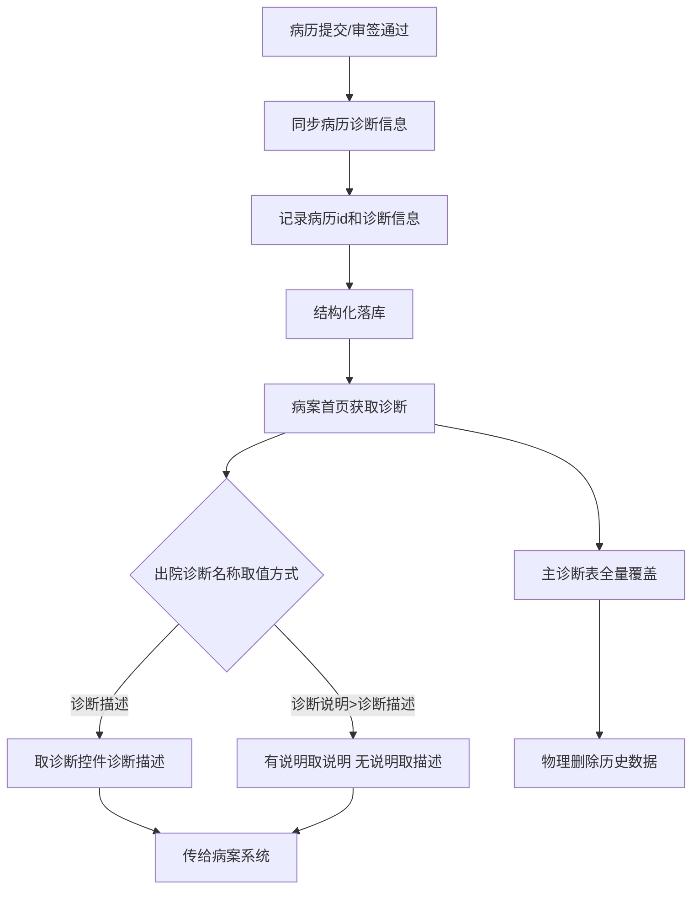
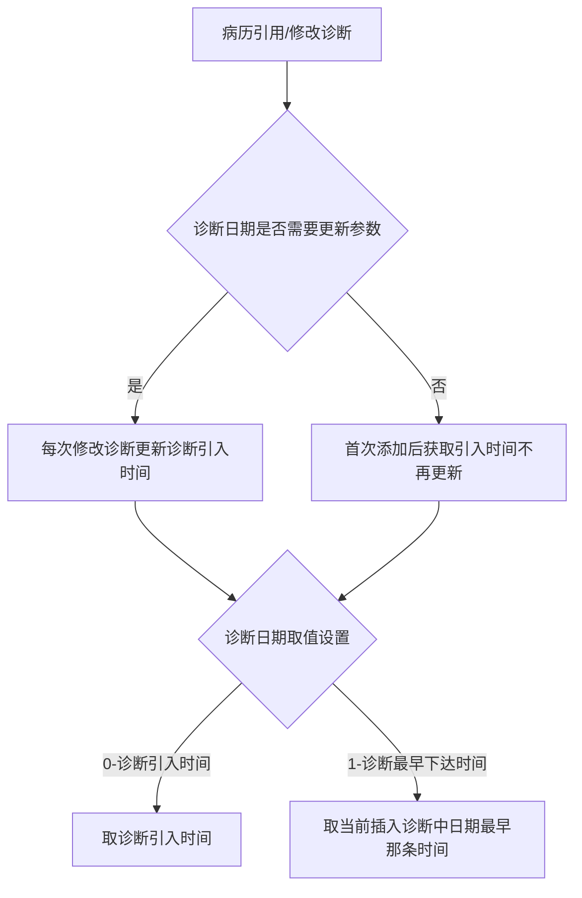

# BLGL-03-ZDYY-008 诊断落库与对外对接 _ Analyst - Spec

> **需求编号**：BLGL-03-ZDYY-008
> **父需求**：BLGL-03-ZDYY
> **关联PM Spec**：BLGL-03-ZDYY-008_诊断落库与对外对接_PM-spec.md
> **Spec版本**：V1.0
> **编写时间**：2026-08-15
> **编写人**：需求分析师

---

## 一、功能编号体系

### 1.1 功能层级结构

```
BLGL-03-ZDYY-008-001: 诊断内容结构化落库
  └─ BLGL-03-ZDYY-008-001-01: 病历提交/审签同步诊断信息

BLGL-03-ZDYY-008-002: 主诊断表删除优化
  └─ BLGL-03-ZDYY-008-002-01: 全量覆盖物理删除

BLGL-03-ZDYY-008-003: 病案首页诊断传值
  ├─ BLGL-03-ZDYY-008-003-01: 诊断名称按字典传值
  ├─ BLGL-03-ZDYY-008-003-02: 前后缀分开传
  ├─ BLGL-03-ZDYY-008-003-03: 出院诊断名称取值方式参数
  ├─ BLGL-03-ZDYY-008-003-04: 诊断说明落库
  └─ BLGL-03-ZDYY-008-003-05: 医疗资源占比传值

BLGL-03-ZDYY-008-004: 诊断日期取值设置
  ├─ BLGL-03-ZDYY-008-004-01: 诊断日期是否需要更新
  └─ BLGL-03-ZDYY-008-004-02: 诊断日期取值设置（引入/下达时间）

BLGL-03-ZDYY-008-005: 对外接口提供
  └─ BLGL-03-ZDYY-008-005-01: 诊断证明书治疗经过接口
```

### 1.2 功能编号表

| REQ-ID | 功能名称 | 类型 | 优先级 | 说明 |
|--------|---------|------|--------|------|
| BLGL-03-ZDYY-008-001 | 诊断内容结构化落库 | 功能 | P0 | 病历诊断内容结构化落库 |
| BLGL-03-ZDYY-008-001-01 | 病历提交/审签同步诊断信息 | 子功能 | P0 | 提交/审签通过时同步诊断，记录病历 id |
| BLGL-03-ZDYY-008-002 | 主诊断表删除优化 | 功能 | P1 | 全量覆盖物理删除 |
| BLGL-03-ZDYY-008-002-01 | 全量覆盖物理删除 | 子功能 | P1 | 入区/引用诊断/出区/归档四节点 |
| BLGL-03-ZDYY-008-003 | 病案首页诊断传值 | 功能 | P0 | 病案首页/病案系统传值 |
| BLGL-03-ZDYY-008-003-01 | 诊断名称按字典传值 | 子功能 | P0 | 名称按字典传值 |
| BLGL-03-ZDYY-008-003-02 | 前后缀分开传 | 子功能 | P0 | 诊断前后缀分开传 |
| BLGL-03-ZDYY-008-003-03 | 出院诊断名称取值方式参数 | 子功能 | P0 | 诊断描述/诊断说明>诊断描述 |
| BLGL-03-ZDYY-008-003-04 | 诊断说明落库 | 子功能 | P0 | INP_EMR_MAHP_DIAG 新增诊断说明 |
| BLGL-03-ZDYY-008-003-05 | 医疗资源占比传值 | 子功能 | P1 | 数据元 399770837 |
| BLGL-03-ZDYY-008-004 | 诊断日期取值设置 | 功能 | P1 | 诊断日期规则 |
| BLGL-03-ZDYY-008-004-01 | 诊断日期是否需要更新 | 子功能 | P1 | 是/否，默认是 |
| BLGL-03-ZDYY-008-004-02 | 诊断日期取值设置 | 子功能 | P1 | 0-引入时间/1-最早下达时间 |
| BLGL-03-ZDYY-008-005 | 对外接口提供 | 功能 | P1 | 诊断证明书治疗经过接口 |
| BLGL-03-ZDYY-008-005-01 | 治疗经过查询接口 | 子功能 | P1 | 病历提供最新诊疗经过 |

---

## 二、核心业务流程

### 2.1 诊断结构化落库与病案传值主流程



### 2.2 诊断日期取值流程




---

## 三、功能规格说明

### BLGL-03-ZDYY-008-001: 诊断内容结构化落库

#### 3.1.1 功能概述

建立病历诊断内容数据模型，病历提交、病历审签通过时同步病历中的诊断信息，需要记录病历 id 和诊断信息。

#### 3.1.2 用户角色

| 角色 | 使用场景 | 权限要求 | 操作频率 |
|------|---------|---------|---------|
| 住院医生 | 病历提交/审签 | 病历书写权限 | 高频 |

#### 3.1.3 业务流程（Given/When/Then）

**Scenario 1: 结构化落库（主流程）**

```gherkin
Given:
  - 病历诊断内容已建立数据模型
  - 病历中存在诊断信息

When:
  - 病历提交或病历审签通过

Then:
  - 同步病历中的诊断信息
  - 记录病历 id 和诊断信息
```


**Scenario 2: 异常——诊断信息缺失**

```gherkin
Given:
  - 病历无诊断信息

When:
  - 病历提交

Then:
  - ⏳ 待确认：无诊断时落库行为资料区未明确
```

#### 3.1.5 验收标准

| AC编号 | 验收标准 | 对应REQ-ID | 验证方法 | 验证场景 |
|--------|---------|-----------|---------|---------|
| AC-001 | 病历提交/审签通过时诊断信息结构化落库，记录病历 id | BLGL-03-ZDYY-008-001 | 集成测试 | Scenario 1 |

---

### BLGL-03-ZDYY-008-002: 主诊断表删除优化

#### 3.2.1 功能概述

入区/引用诊断/出区/归档四个节点保存主诊断的时候，会重新全量覆盖，被覆盖的历史数据原本是逻辑删除，现在需要改成物理删除，不然逻辑删除的垃圾数据太多。

#### 3.2.2 用户角色

| 角色 | 使用场景 | 权限要求 | 操作频率 |
|------|---------|---------|---------|
| 住院医生 | 入区/引用诊断/出区/归档 | 病历书写权限 | 中频 |

#### 3.2.3 业务流程（Given/When/Then）

**Scenario 1: 主诊断表物理删除（主流程）**

```gherkin
Given:
  - 入区/引用诊断/出区/归档四个节点保存主诊断

When:
  - 重新全量覆盖主诊断

Then:
  - 被覆盖的历史数据由逻辑删除改为物理删除
  - 减少逻辑删除垃圾数据
```


#### 3.2.5 验收标准

| AC编号 | 验收标准 | 对应REQ-ID | 验证方法 | 验证场景 |
|--------|---------|-----------|---------|---------|
| AC-002 | 四节点全量覆盖时历史主诊断物理删除 | BLGL-03-ZDYY-008-002 | 集成测试 | Scenario 1 |

---

### BLGL-03-ZDYY-008-003: 病案首页诊断传值

#### 3.3.1 功能概述

病历系统传给病案首页系统的诊断字段按字典规范传值：诊断名称按字典传值、前后缀分开传、诊断描述按前缀+名称+后缀拼接。INP_EMR_MAHP_DIAG 新增诊断说明字段，保存医生站接口返回的诊断说明；病案首页配置参数"出院诊断诊断名称取值方式"（诊断描述/诊断说明>诊断描述，默认诊断描述）。首页诊断新增字段【医疗资源占比】（数据元 399770837），从诊断控件同步数据并传给病案系统。

#### 3.3.2 用户角色

| 角色 | 使用场景 | 权限要求 | 操作频率 |
|------|---------|---------|---------|
| 病案管理员 | 配置诊断取值方式 | 配置权限 | 低频 |
| 病案系统 | 接收诊断传值 | - | 中频 |

#### 3.3.3 业务流程（Given/When/Then）

**Scenario 1: 诊断传值（主流程）**

```gherkin
Given:
  - 病历系统传给病案首页系统诊断字段

When:
  - 传值

Then:
  - 诊断名称按字典传值
  - 前后缀分开传
  - 诊断描述按前缀+诊断名称+后缀拼接
```


**Scenario 2: 出院诊断名称取值**

```gherkin
Given:
  - 参数"出院诊断诊断名称取值方式"=诊断说明>诊断描述

When:
  - 病案首页展示出院诊断

Then:
  - 有诊断说明优先取说明
  - 没有说明再取诊断描述
```


**Scenario 3: 数据异常——名称不一致**

```gherkin
Given:
  - 中医诊断编码相同但名称不一致

When:
  - 病案首页展示诊断

Then:
  - 病案首页显示不正确
  - 需按字典规范传值修复
```


**Scenario 4: 医疗资源占比传值**

```gherkin
Given:
  - 临床出院诊断界面有医疗资源占比

When:
  - 病案首页获取医疗资源占比

Then:
  - 首页诊断表存入【医疗资源占比】字段
  - 传到病案系统
  - 模板没配置数据元也能同步数据
```


#### 3.3.5 验收标准

| AC编号 | 验收标准 | 对应REQ-ID | 验证方法 | 验证场景 |
|--------|---------|-----------|---------|---------|
| AC-003 | 病历传病案系统诊断按字典传值、前后缀分开、描述拼接 | BLGL-03-ZDYY-008-003 | 集成测试 | Scenario 1 |
| AC-004 | 出院诊断名称取值方式参数生效 | BLGL-03-ZDYY-008-003 | 功能测试 | Scenario 2 |
| AC-005 | 医疗资源占比字段同步并传给病案系统 | BLGL-03-ZDYY-008-003 | 集成测试 | Scenario 4 |

---

### BLGL-03-ZDYY-008-004: 诊断日期取值设置

#### 3.4.1 功能概述

入院记录初步诊断、确定诊断、补充诊断的日期在引用诊断的时候自动带入。参数"入院记录诊断样式中的诊断日期是否需要更新"：是=病历每次修改诊断更新诊断引入时间；否=首次添加后获取引入时间不再更新。入院记录诊断样式配置新增"诊断日期取值设置"：0-诊断引入时间（默认）/1-诊断最早下达时间。

#### 3.4.2 用户角色

| 角色 | 使用场景 | 权限要求 | 操作频率 |
|------|---------|---------|---------|
| 病案管理员 | 配置诊断日期参数 | 配置权限 | 低频 |

#### 3.4.3 业务流程（Given/When/Then）

**Scenario 1: 诊断日期是否需要更新（主流程）**

```gherkin
Given:
  - 参数"入院记录诊断样式中的诊断日期是否需要更新"

When:
  - 病历修改诊断

Then:
  - 参数=是：每次修改诊断更新诊断引入时间
  - 参数=否：诊断首次添加后获取引入时间不再更新
```


**Scenario 2: 诊断日期取值设置**

```gherkin
Given:
  - 入院记录诊断样式配置的诊断日期取值设置=1（诊断最早下达时间）

When:
  - 插入补充/修正/确定诊断

Then:
  - 诊断日期取当前插入的诊断中诊断日期最早的那条诊断的时间
```


**Scenario 3: 边界——默认值 0**

```gherkin
Given:
  - 诊断日期取值设置=0（默认）

When:
  - 插入诊断

Then:
  - 诊断日期取诊断引入时间
```


#### 3.4.5 验收标准

| AC编号 | 验收标准 | 对应REQ-ID | 验证方法 | 验证场景 |
|--------|---------|-----------|---------|---------|
| AC-006 | 诊断日期是否需要更新参数生效 | BLGL-03-ZDYY-008-004 | 功能测试 | Scenario 1 |
| AC-007 | 诊断日期取值设置生效（引入/下达时间） | BLGL-03-ZDYY-008-004 | 功能测试 | Scenario 2/3 |

---

### BLGL-03-ZDYY-008-005: 对外接口提供

#### 3.5.1 功能概述

住院医生站-诊断证明书中增加"治疗经过"字段，选中患者点击右侧诊断证明书时能从病历提供的接口中实时获取当前患者最新的"治疗经过"数据。病历提供接口：病历中最新一次的"诊疗经过"数据元中书写的内容（数据元 ID：WIN1.399308810.399319399）。

#### 3.5.2 用户角色

| 角色 | 使用场景 | 权限要求 | 操作频率 |
|------|---------|---------|---------|
| 住院医生 | 医生站查看诊断证明书 | 医生站权限 | 中频 |

#### 3.5.3 业务流程（Given/When/Then）

**Scenario 1: 治疗经过查询（主流程）**

```gherkin
Given:
  - 住院医生站-诊断证明书
  - 病历中已有"诊疗经过"数据元内容

When:
  - 医生选中患者点击右侧诊断证明书

Then:
  - 病历提供接口实时获取最新"治疗经过"数据
  - 展示在诊断证明书中
```


#### 3.5.5 验收标准

| AC编号 | 验收标准 | 对应REQ-ID | 验证方法 | 验证场景 |
|--------|---------|-----------|---------|---------|
| AC-008 | 诊断证明书实时获取病历最新治疗经过 | BLGL-03-ZDYY-008-005 | 集成测试 | Scenario 1 |

---

## 四、排除范围

本需求不包含以下功能项：

1. **诊断数据接入与查询**（诊断组件查询/ICD-11）—— BLGL-03-ZDYY-001
2. **诊断变更同步与提醒**（CL025 同步方式/强制同步）—— BLGL-03-ZDYY-002
3. **诊断引用弹窗交互**（勾选/关闭/触发方式）—— BLGL-03-ZDYY-003
4. **诊断样式显示配置**（排序/标题/序号/分隔符）—— BLGL-03-ZDYY-005
5. **诊断插入与编辑**（插入位置/序号重算）—— BLGL-03-ZDYY-007
6. **病案首页模块**（病案首页自身功能，仅诊断传值归属本功能点）—— BLGL-13-BASY

---

## 五、业务规则清单

| 规则ID | 规则名称 | 规则描述 | 优先级 |
|--------|---------|---------|--------|
| BR-001 | 结构化落库 | 病历提交/审签通过时同步病历诊断信息，记录病历 id | P0 |
| BR-002 | 主诊断物理删除 | 入区/引用诊断/出区/归档四节点全量覆盖时历史数据物理删除 | P1 |
| BR-003 | 传值规范 | 诊断名称按字典传值、前后缀分开传、诊断描述按前缀+名称+后缀拼接 | P0 |
| BR-004 | 名称取值方式 | 出院诊断诊断名称取值方式：诊断描述/诊断说明>诊断描述，默认诊断描述 | P0 |
| BR-005 | 诊断日期更新 | 入院记录诊断日期是否需要更新，是/否，默认是 | P1 |
| BR-006 | 诊断日期取值 | 诊断日期取值设置：0-诊断引入时间/1-诊断最早下达时间，默认 0 | P1 |
| BR-007 | 医疗资源占比 | 首页诊断新增医疗资源占比字段，模板未配置数据元也能同步传病案系统 | P1 |

---

## 六、关联文档

| 文档类型 | 文档路径 | 说明 |
|---------|---------|------|
| 功能点Spec（模块级） | BLGL-03-ZDYY 诊断引用功能点Spec.md（V1.1，上级目录） | Phase 1 功能点索引 |
| PM-Spec（业务视角） | 本目录 BLGL-03-ZDYY-008_诊断落库与对外对接_PM-spec.md（V0.1） | PM 产出的 Spec 文档 |
| Spec（研发视角） | 本目录 BLGL-03-ZDYY-008_诊断落库与对外对接-Spec.md（V1.0） | 业务背景与目标 Spec |
| data-model.md | 待产出 | 架构师产出的数据建模文档 |
| design.md | 待产出 | 架构师产出的技术方案文档 |
| api-contract.md | 待产出 | 开发经理产出的 API 契约文档 |

---

## 七、待确认问题清单

| 编号 | 问题描述 | 缺失信息 | 影响范围 | 建议补充方 |
|------|---------|---------|---------|-----------|
| Q-001 | 结构化落库接口（diagnosis_content/data_element/save）完整入参/出参 | API 契约 | -Spec 第5章 | 开发经理 |
| Q-002 | INP_EMR_MAHP_DIAG 表结构（诊断说明字段） | 数据模型 | 3.3.4 | 架构师 |
| Q-003 | 诊断日期参数概念 ID | 概念ID | 3.4.4 | 产品经理 |
| Q-004 | 无诊断时结构化落库行为 | 需求分析原文 | 3.1.3 Scenario 2 | 需求分析师 |
| Q-005 | 医疗资源占比完整字段流转 | 需求分析原文 | 3.3.4 | 需求分析师 |
| Q-006 | 性能指标（诊断落库响应时间） | 资料区无量化指标 | -Spec 第8章 | 产品经理 |

---

## 填写检查清单

| 序号 | 检查项 | 是否完成 |
|:----:|--------|:--------:|
| 1 | 功能编号带父子层级 | ✅ |
| 2 | 每个 REQ-ID 有功能概述和用户角色 | ✅ |
| 3 | 主流程至少 1 个 Given/When/Then 场景 | ✅ |
| 4 | 异常流程至少 3 个 Given/When/Then 场景 | ✅ |
| 5 | 边界流程至少 2 个 Given/When/Then 场景 | ✅ |
| 6 | 每个 Given/When/Then 内容具体，不模糊 | ✅ |
| 7 | 数据字段定义完整（字段名、类型、必填、说明、概念ID） | ✅ |
| 8 | 验收标准 AC 编号独立，可验证 | ✅ |
| 9 | 验收标准无"功能正常"等模糊表述 | ✅ |
| 10 | 排除范围明确列出 | ✅ |
| 11 | 业务规则清单列出所有规则，每条标注来源 | ✅ |
| 12 | 流程图使用 Mermaid 格式（≥2 个） | ✅ |
| 13 | 关联文档索引包含 Phase 1 功能点Spec | ✅ |
| 14 | 待确认问题清单汇总了全文所有 ⏳ 项 | ✅ |
| 15 | 全文无占位符 `< >` 残留 | ✅ |
| 16 | 全文陈述可溯源至资料区（S1~S10 溯源核查） | ✅ |
| 17 | 人工审核确认完成 | ⏳ 待确认 |

---

**文档状态**：⬜ 待审核
**维护责任**：需求分析师规范组
**下次更新**：根据评审反馈优化

---

## 版本历史

| 版本 | 日期 | 变更说明 | 编写人 |
|------|------|---------|--------|
| V1.0 | 2026-08-15 | 初始版本 | 需求分析师 |
