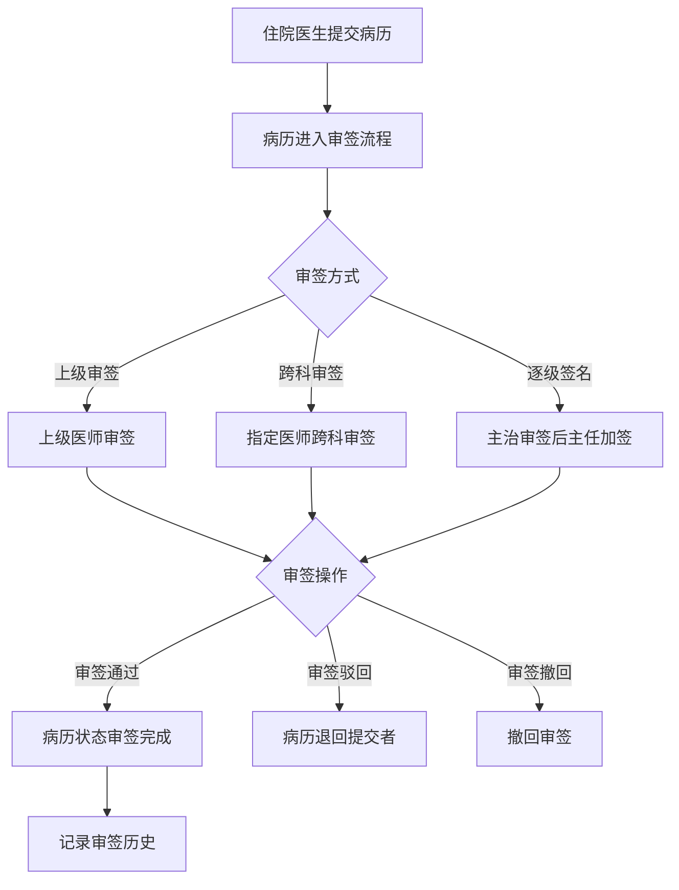
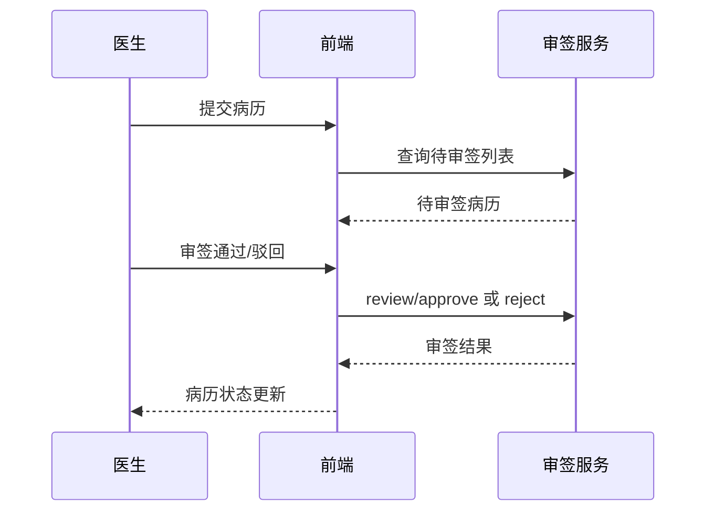

# BLGL-04-QXGL-001 病历审签权限管理 - Spec

> **功能编号**：BLGL-04-QXGL-001
> **文档类型**：功能Spec（业务背景与设计）
> **文档版本**：V1.0
> **编写时间**：2026-08-15
> **编写人**：RACC

---

## 文档索引

#### 章节索引

**Spec（研发视角）**

| 章节号 | 章节名称 | 内容说明 |
|--------|---------|---------|
| 1、 | 文档概述 | 文档目的、文档范围、术语定义、阅读指南、参考文档 |
| 2、 | 功能背景与定位 | 功能背景、功能定位、目标用户、核心价值 |
| 3、 | 业务流程设计 | 主流程/异常流程/边界流程（Given/When/Then） |
| 4、 | 数据模型设计 | 核心数据结构、状态定义、系统参数定义 |
| 5、 | 接口契约设计 | API列表、接口详细设计、错误码定义 |
| 6、 | 技术方案设计 | 页面路径、技术栈、关键技术点、部署方案 |
| 7、 | 测试用例预设计 | 功能/边界/异常/性能测试用例 |
| 8、 | 非功能性要求 | 性能、安全、可用性、兼容性 |
| 9、 | 依赖与风险 | 外部依赖、风险项 |
| 10、 | 附录 | 流程图、时序图、参考文档 |

**PM-Spec（业务视角）**

| 章节号 | 章节名称 | 内容说明 |
|--------|---------|---------|
| 一 | 目标 | 功能定位与核心价值 |
| 二 | 约束 | 业务/技术/非功能性约束 |
| 三 | 验收标准 | 验收条件与验证方法 |
| 四 | 排除范围 | 本次不做项与明确边界 |
| 五 | 关键决策记录 | 方案决策与选型理由 |
| 六 | 优先级 | 优先级定义 |
| 七 | 关联文档 | 关联文档索引 |
| 附录 | 填写检查清单 | 质量检查 |

**Analyst-Spec（产品视角）**

| 章节号 | 章节名称 | 内容说明 |
|--------|---------|---------|
| 一 | 功能编号体系 | 功能编号与层级结构 |
| 二 | 核心业务流程 | 核心业务流程与时序 |
| 三 | 功能规格说明 | 详细功能规格与验收标准 |
| 四 | 排除范围 | 排除范围 |
| 五 | 业务规则清单 | 业务规则清单 |
| 六 | 关联文档 | 关联文档索引 |
| 七 | 待确认问题清单 | 待确认问题汇总 |
| - | 填写检查清单 | 质量检查 |

#### 版本历史

| 版本 | 日期 | 变更说明 | 编写人 |
|------|------|---------|--------|
| V1.0 | 2026-08-15 | 初始版本 | RACC |

#### 关联文档索引

| 序号 | 文档名称 | 文档类型 | 版本 | 位置 |
|------|---------|---------|------|------|
| 1 | BLGL-04-QXGL 权限管理功能点Spec.md | 功能点Spec（模块级） | V1.0 | 上级目录 |
| 2 | BLGL-04-QXGL-001_病历审签权限管理-Spec.md | 功能Spec（业务背景与设计）（本文档） | V1.0 | 本目录 |
| 3 | BLGL-04-QXGL-001_病历审签权限管理_Analyst-spec.md | Analyst-Spec（分析规格） | V1.0 | 本目录 |
| 4 | BLGL-04-QXGL-001_病历审签权限管理_PM-spec.md | PM-Spec（需求规格） | V0.1 | 本目录 |

---

## 1、文档概述

### 1.1、文档目的

本文档旨在明确"病历审签权限管理"功能（BLGL-04-QXGL-001）的业务背景与设计方案，为需求分析、研发实现、测试验收及评审提供统一的业务上下文、设计口径与决策依据。

**具体目的包括**：

1. 梳理病历审签权限管理功能的业务由来与历史需求演进脉络，说明"为什么要做"；
2. 明确功能的定位边界、目标用户与核心价值，回答"做成什么"；
3. 描述功能的业务流程、数据模型、接口契约与技术方案，回答"怎么做"；
4. 预设计测试用例并明确非功能性要求、依赖与风险，为研发与验收提供依据；
5. 作为 Analyst-Spec 的业务前提与设计输入，保证各层文档业务口径一致。

### 1.2、文档范围

#### 1.2.1 纳入范围

本文档覆盖病历审签权限管理的完整业务背景与设计，包括：

- 上级审签：上级医师审签、逐级签名
- 跨科审签：跨科审签 tab、指定其他科室医生审签
- 住院总审批：住院总具备等同主任医师审批权限
- 阅改签名：阅改签名 CA 校验、阅改流程
- 审签流程配置：审核通用配置/审核流程/解锁审核流程
- 审签状态异常修复：申签中无法撤销、审签流程异常

#### 1.2.2 排除范围

本文档不涉及以下内容（详见其他功能点或模块）：

- 规培生教学权限管理 —— BLGL-04-QXGL-002
- 分级访问控制 —— BLGL-04-QXGL-003
- 病历操作权限管理 —— BLGL-04-QXGL-004
- 角色职称权限管理 —— BLGL-04-QXGL-005
- 科室病区权限管理 —— BLGL-04-QXGL-006
- 病历业务授权 —— BLGL-04-QXGL-007

### 1.3、术语定义

| 术语 | 定义 |
|------|------|
| 审签通过 | 上级医师审签通过（PASSED_REVIEW_AND_SIGN，代码 EmrPermissionACL） |
| 跨科审签 | 支持审签其他科室的待我审签病历 |
| 住院总 | 住院总人员，审签时具备等同主任医师审批权限 |
| 阅改签名 | 上级医生修改下级医生病历后需点击阅改签名保存 |

### 1.4、阅读指南

- **章节关系**：第1~2章为业务全貌，第3~10章为设计实现层。与 Analyst-Spec、PM-Spec 互相引用保持一致。
- **读者对象**：产品经理/需求分析师读第1~2章；研发读第3~6、9~10章；测试读第3、7~8章；评审人员核对各层一致性。

### 1.5、参考文档

| 序号 | 文档名称 | 版本/日期 |
|------|---------|----------|
| 1 | 【历史需求】住院病历的历史需求.xlsx | - |
| 2 | BLGL-04-QXGL-001_病历审签权限管理_PM-spec.md | V0.1 |
| 3 | BLGL-04-QXGL-001_病历审签权限管理_Analyst-spec.md | V1.0 |
| 4 | BLGL-04-QXGL 权限管理功能点Spec.md | V1.0 |

---

## 2、功能背景与定位

### 2.1 功能背景

病历审签权限管理是权限管理模块的核心起点（L1），需满足：

- **现状痛点**：手术记录指定主刀医生审签时，部分主刀医生为其他科室医生，没有患者所在科室权限，无法查询到审签任务进行审签；病历审签时出现状态为"申签中"无法撤销；出院记录指定审签流程异常
- **管理要求**：病历上级加签需要能够按照职称逐级签名；病历审签调用医务管理系统住院总人员设置接口，住院总需具备等同主任医师审批权限
- **历史需求演进**：上级审签逐级签名→ 跨科审签→ 住院总审批→ 阅改签名 CA 校验

### 2.2 功能定位

"病历审签权限管理"是 WiNEX 病历管理-权限管理的核心起点，定位为：

- **审签执行**：上级医师审签通过/驳回/撤回
- **审签范围**：跨科审签、逐级签名、住院总审批
- **审签流程**：审核流程配置、阅改指派

### 2.3 目标用户

| 用户角色 | 主要使用场景 |
|---------|-------------|
| 上级医师 | 审签通过/驳回/撤回 |
| 主任医师 | 逐级签名、审签 |
| 住院总 | 等同主任医师审批 |
| 住院医生 | 提交病历待审签 |

### 2.4 核心价值

| 价值维度 | 价值描述 |
|---------|---------|
| 审签合规 | 上级医师审签保证病历质量与法律效力 |
| 跨科协同 | 跨科审签支持指定其他科室医生 |
| 流程可溯 | 审签历史记录、流程配置 |

---

## 3、业务流程设计（Given/When/Then）

### 3.1 主流程

**Scenario 1: 上级医师审签**

```gherkin
Given:
  - 住院医生提交病历
  - 病历进入审签流程

When:
  - 上级医师打开病历审签界面
  - 审签通过/驳回/撤回

Then:
  - 审签通过：病历状态更新为审签完成
  - 审签驳回：病历退回提交者
  - 审签撤回：撤回审签操作
  - 记录审签历史
```

### 3.2 异常流程

**Scenario 2: 业务异常——跨科审签**

```gherkin
Given:
  - 手术记录指定主刀医生审签
  - 主刀医生为其他科室医生

When:
  - 主刀医生查询待我审签

Then:
  - 原逻辑无法查询到审签任务（问题）
  - 需增加跨科审签功能
```

**Scenario 3: 数据异常——申签中无法撤销**

```gherkin
Given:
  - 病历审签时状态为"申签中"

When:
  - 撤销审签

Then:
  - 无法撤销（问题）
  - 需修复审签状态逻辑
```

**Scenario 4: 系统异常——审签流程异常**

```gherkin
Given:
  - 出院记录指定审签流程

When:
  - 执行审签

Then:
  - 审签流程异常（问题）
  - 需排查审签流程配置
```

### 3.3 边界流程

**Scenario 5: 边界——逐级签名**

```gherkin
Given:
  - 参数"上级审签模式下主任医师是否可以加签"=是

When:
  - 主治审签通过之后

Then:
  - 主任医师可以审核加签
  - 只能操作"审签通过"，没有审签退回
  - 签名插入"上级医师签名"数据元，排在原签名左边
```

**Scenario 6: 边界——住院总审批**

```gherkin
Given:
  - 病历审签调用医务管理系统住院总人员设置接口

When:
  - 审签医生是住院总

Then:
  - 具备等同主任医师审批的权限
  - 自动同步医务院总名单
```

---

## 4、数据模型设计

### 4.1 核心数据结构

#### 4.1.1 核心保存请求

| 字段名 | 类型 | 必填 | 备注 |
|--------|------|------|------|
| inpEmrSetId | Long | 是 | 病历集ID |
| inpEmrReviewStatus | Long | 是 | 审签状态 |
| reviewerId | Long | 是 | 审签人 |
| inpEmrReviewResultCode | Long | 是 | 审签结果 |

> ⏳ 待确认：审签接口完整入参/出参以 API 契约为准。

#### 4.1.2 核心表/实体

| 表/实体 | 关键字段 | 说明 |
|---------|---------|------|
| INPATIENT_EMR_REVIEW（InpatientEmrReviewPO） | inpEmrReviewId(INP_EMR_REVIEW_ID)、inpRhbRecordId、inpEmrSetId、inpEmrReviewStatus(INP_EMR_REVIEW_STATUS)、currentEmrReviewerId(CURRENT_EMR_REVIEWER_ID)、inpEmrReviewExpertiseCode、firstLevelActualBy/At、secondLevelActualBy/At、thirdLevelActualBy/At、extSignedBy/At | 审签主表 |
| INP_EMR_REVIEW_ACTION（InpEmrReviewPerProcessPO） | inpEmrReviewActionId、inpEmrReviewId、inpEmrReviewStepId、inpEmrReviewExpertiseCode、reviewerId、inpEmrPermissionCode(INP_EMR_PERMISSION_CODE)、inpEmrReviewResultCode、msgTaskId | 审签节点操作表 |
| ERM_REVIEW_ASSIGNING（EmrReviewAssigningPO） | erMReviewAssigningId、inpEmrSetId、assigningEmployeeId、mainAssigningFlag、followEmployeeFlag、emrReviewStatus | 阅改指派表 |
| EMR_REVIEW_FLOW_SETTING（EmrReviewFlowSettingPO） | emrReviewFlowSettingId、reviewLevel、reviewTypeFlag、emrMrtMonitorId | 审签流程设置表 |
| EMR_REVIEW_FLOW_RULE_SETTING（EmrReviewFlowRuleSettingPO） | emrReviewFlowRuleSettingId、reviewLevel、ruleTypeFlag、ruleContent、signConceptId | 审签流程规则表 |

### 4.2 状态定义

| 状态码 | 状态名称 | 说明 |
|--------|---------|------|
| - | 审签中 | 病历待审签 |
| - | 审签完成 | 病历审签完成 |
| - | 申签中 | 审签中状态（问题，） |

### 4.3 系统参数定义

| 参数编码 | 参数名称 | 说明 |
|---------|---------|------|
| - | 上级审签模式下主任医师是否可以加签 | 是/否，默认为否 |
| - | 自动同步医务院总名单 | 开启/关闭，默认关闭 |
| - | 是否启用病历加签授权功能 | 是/否，默认为否 |

---

## 5、接口契约设计

### 5.1 API列表

| 序号 | API名称（代码函数） | 路径 | 方法 | 说明 |
|:----:|---------|------|:----:|------|
| 1 | 审签通过 | /api/v2/app_record_inpatient/emr_inpatient/review/approve/by_example | POST | 审签通过（@EmrPermissionACL PASSED_REVIEW_AND_SIGN，入参 InpEmrReviewApprovedInputAO） |
| 2 | 审签驳回 | /api/v2/app_record_inpatient/emr_inpatient/review/reject/by_example | POST | 审签驳回（入参 InpEmrReviewRejectedInputAO） |
| 3 | 审签撤回 | /api/v2/app_record_inpatient/emr_inpatient/review/withdraw/by_example | POST | 审签撤回（入参 InpEmrReviewWithdrawInputAO） |
| 4 | 查询待审核病历总数 | /api/v1/app_record_inpatient/emr_inpatient/pending_review_emr/count/by_example | POST | 待审病历总数 |
| 5 | 病历审签保存 | /api/v1/app_record_inpatient/emr_inpatient/audit/save_audit_emr | POST | 审签保存（入参 InpEmrReviewApprovedInputAO） |
| 6 | 获取是否有下一个审签节点 | /api/v1/app_record_inpatient/emr_inpatient/review/get_has_next_audit_node | POST | 下一审签节点 |
| 7 | 查询病历文书审签历史记录 | /api/v1/app_record_inpatient/emr_inpatient/emr_review_history_record/query | POST | 审签历史 |
| 8 | 查询待审签病历列表 | /api/v1/app_record_inpatient/emr_inpatient/emr_set/query_authing_sets | POST | 待审签列表 |
| 9 | 查询病历授权加签记录 | /api/v1/app_record_inpatient/emr_inpatient/auth_sign/query/by_example | POST | 加签记录（入参 InpatientEmrSignAuthQueryInputAO） |

### 5.2 接口详细设计

#### 5.2.1 审签通过（review/approve/by_example）

**请求参数**:
```json
{
  "inpEmrSetId": "12345",
  "inpEmrReviewId": "67890",
  "reviewerId": "1001",
  "reviewResultCode": "1"
}
```

**返回值（成功）**:
```json
{
  "success": true,
  "data": {
    "modifyTime": "2026-08-15 10:00:00"
  }
}
```

> ⏳ 待确认：审签接口字段以代码扫描（InpEmrReviewApprovedInputAO）和 API 契约为准。

**返回值（失败）**:
```json
{
  "success": false,
  "message": "审签失败",
  "data": null
}
```

### 5.3 错误码定义

| 错误码 | 错误信息 | 处理方式 |
|--------|---------|---------|
| ⏳ 待确认 | 审签状态为"申签中"无法撤销 | 修复审签状态逻辑 |
| ⏳ 待确认 | 审签流程异常 | 排查审签流程配置 |

---

## 6、技术方案设计

### 6.1 页面路径

- **页面路径**: 住院医生站→病历审核（/clinicalnoteReview，tab：病历提交/病历审签/病历审签记录/我的审签记录/跨科审签/转科审签）
- **后端模块**: winning-emr-ipt-emrset/.../controller/InpatientEmrReviewController.java（审签通过/驳回/撤回/待审签列表/审签历史）+ InpatientEmrRecordController.java（签署/权限）
- **前端 API**: src/pages/InpatientClinicalnoteReviewPage/api/index.js（pending_review_rhb/query、pending_review_emr/query、emr_review_emr/query、inp_emr_review_status/query、inp_emr_review_process_detail/query、my_inp_emr_reviewed/query）、src/pages/EmrEditor/api/index.js（approveReviewEmr/rejectReviewEmr/withdrawReviewEmr/saveAuditEmr）

### 6.2 技术栈

| 类别 | 技术 | 版本 |
|------|------|------|
| 前端框架 | Vue | 2.6.14 |
| 前端UI | element-ui | 2.13.0 |
| 后端框架 | Spring Boot（Java 17）+ JPA/Hibernate | - |
| 权限控制 | EmrPermissionACL 注解（PASSED_REVIEW_AND_SIGN） | - |
| RPC | winning-akso-rpc-rest | - |

### 6.3 关键技术点

- 审签通过需 EmrPermissionACL(permissionEnum=PASSED_REVIEW_AND_SIGN) 权限校验
- 跨科审签：监控类型配置为指定医师审签模式&没有科室权限的&指定本人审签的患者病历
- 逐级签名：主治审签通过后主任医师可审核加签，只能操作审签通过

### 6.4 部署方案

⏳ 待确认：部署方案未在资料区中找到。

---

## 7、测试用例预设计

### 7.1 功能测试

| 用例编号 | 测试场景 | Given | When | Then |
|---------|---------|-------|------|------|
| TC-001 | 上级医师审签通过 | 病历提交待审签 | 调用 review/approve | 病历状态审签完成 |
| TC-002 | 审签通过接口 | 审签界面 | 调用 approveReviewEmr | 返回修改时间 |

### 7.2 边界测试

| 用例编号 | 测试场景 | Given | When | Then |
|---------|---------|-------|------|------|
| TC-003 | 逐级签名 | 参数开启 | 主治审签后主任加签 | 主任可审核加签，只审签通过 |
| TC-004 | 跨科审签 | 主刀医生其他科室 | 查询待我审签 | 可跨科审签 |

### 7.3 异常测试

| 用例编号 | 测试场景 | Given | When | Then |
|---------|---------|-------|------|------|
| TC-005 | 审签驳回 | 上级审签 | 调用 review/reject | 病历退回提交者 |
| TC-006 | 申签中无法撤销 | 状态申签中 | 撤销审签 | 无法撤销（问题） |

### 7.4 性能测试

| 用例编号 | 测试场景 | 指标 |
|---------|---------|------|
| TC-007 | 审签接口响应 | ⏳ 待确认：性能指标未在资料区中找到 |
| TC-008 | 待审签列表查询 | ⏳ 待确认：性能指标未在资料区中找到 |

---

## 8、非功能性要求

### 8.1 性能要求

| 指标 | 要求 |
|------|------|
| 审签接口响应时间 | ⏳ 待确认 |

### 8.2 安全要求

| 要求 | 说明 |
|------|------|
| 审签权限 | 审签通过需 PASSED_REVIEW_AND_SIGN 权限校验 |
| 跨科权限 | 跨科审签需指定医师审签模式 |

**医疗行业特殊要求**

| 要求 | 说明 |
|------|------|
| 审签合规 | 上级医师审签保证病历质量与法律效力 |

### 8.3 可用性要求

| 指标 | 要求值 |
|------|--------|
| 可用性 | ⏳ 待确认 |

### 8.4 兼容性要求

| 类型 | 要求 |
|------|------|
| 审签模式 | 指定医师审签/跨科审签/逐级签名兼容 |
| 住院总 | 住院总审批等同主任医师 |

---

## 9、依赖与风险

### 9.1 外部依赖

| 依赖项 | 说明 |
|--------|------|
| 医务管理系统 | 住院总人员设置 |

### 9.2 风险项

| 风险项 | 等级 | 说明 | 应对方案 |
|--------|------|------|---------|
| 审签状态异常 | 中 | 申签中无法撤销 | 修复审签状态逻辑 |
| 跨科审签缺失 | 中 | 主刀医生无法审签其他科室病历 | 增加跨科审签功能 |

---

## 10、附录

### 10.1 流程图



### 10.2 时序图



### 10.3 参考文档

- 【历史需求】住院病历的历史需求.xlsx（8、1467757、1389298、1276252、1294718、1414155、1426105、1507840、1508136、1618875、1541358、1561317、1351548、1371956、1519789）
- BLGL-04-QXGL 权限管理功能点Spec.md（V1.0，第5章 BLGL-04-QXGL-001 行）
- 关联Spec: BLGL-04-QXGL-001_病历审签权限管理_PM-spec.md、BLGL-04-QXGL-001_病历审签权限管理_Analyst-spec.md

---

## 填写检查清单

| 序号 | 检查项 | 是否完成 |
|:----:|--------|:--------:|
| 1 | 章节索引与正文章节一致 | ✅ |
| 2 | 版本历史记录完整 | ✅ |
| 3 | 关联文档索引已登记全部Spec | ✅ |
| 4 | 文档目的明确回答"为什么做/做成什么/怎么做" | ✅ |
| 5 | 纳入范围/排除范围清晰 | ✅ |
| 6 | 术语定义覆盖关键概念，从资料区可溯源 | ✅ |
| 7 | 参考文档已登记 | ✅ |
| 8 | 功能背景基于法规/规范/需求来源组织 | ✅ |
| 9 | 功能定位体现业务价值（3~5个定位点） | ✅ |
| 10 | 目标用户角色覆盖完整，在需求原文中有出处 | ✅ |
| 11 | 核心价值可陈述，与 Phase 1 口径一致 | ✅ |
| 12 | 业务流程：主流程≥1、异常≥3、边界≥2，Given/When/Then 具体 | ✅ |
| 13 | 数据模型：字段/表/状态/参数可溯源 | ✅ |
| 14 | 接口契约：API列表+详细设计+错误码齐全或标记待确认 | ✅ |
| 15 | 技术方案：页面路径/技术栈/关键点/部署方案或标记待确认 | ✅ |
| 16 | 测试用例：功能/边界/异常/性能覆盖 | ✅ |
| 17 | 非功能性要求：性能/安全/可用性/兼容性指标可量化或标记待确认 | ✅ |
| 18 | 依赖与风险：外部依赖登记完整 | ✅ |
| 19 | 附录：流程图/时序图与正文流程一致 | ✅ |
| 20 | 全文无占位符 `< >` 残留 | ✅ |
| 21 | 全文陈述可溯源至资料区 | ✅ |
| 22 | 人工审核确认完成 | ⏳ 待确认 |

---

**文档状态**：⬜ 待审核
**维护责任**：RACC
**下次更新**：根据评审反馈优化
