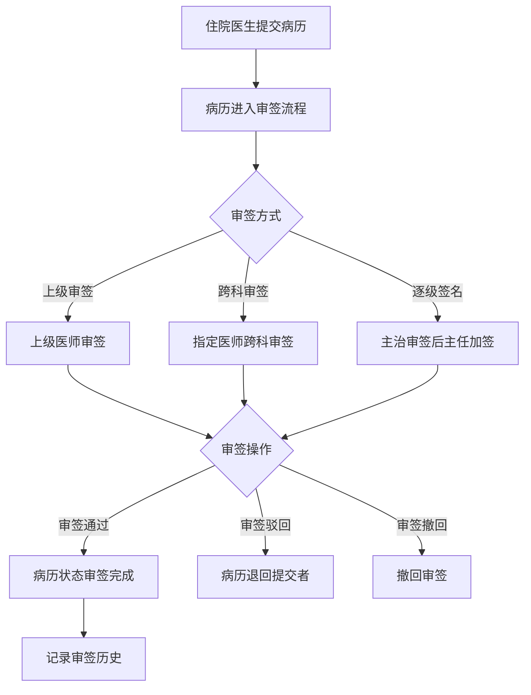
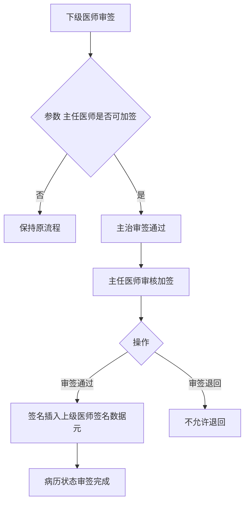

# BLGL-04-QXGL-001 病历审签权限管理 _ Analyst - Spec

> **需求编号**：BLGL-04-QXGL-001
> **父需求**：BLGL-04-QXGL
> **关联PM Spec**：BLGL-04-QXGL-001_病历审签权限管理_PM-spec.md
> **Spec版本**：V1.0
> **编写时间**：2026-08-15
> **编写人**：需求分析师

---

## 一、功能编号体系

### 1.1 功能层级结构

```
BLGL-04-QXGL-001-001: 上级医师审签
  ├─ BLGL-04-QXGL-001-001-01: 审签通过
  ├─ BLGL-04-QXGL-001-001-02: 审签驳回
  └─ BLGL-04-QXGL-001-001-03: 审签撤回

BLGL-04-QXGL-001-002: 跨科审签
  ├─ BLGL-04-QXGL-001-002-01: 跨科审签tab
  └─ BLGL-04-QXGL-001-002-02: 指定医师审签

BLGL-04-QXGL-001-003: 逐级签名
  └─ BLGL-04-QXGL-001-003-01: 主任医师审核加签

BLGL-04-QXGL-001-004: 住院总审批
  ├─ BLGL-04-QXGL-001-004-01: 住院总等同主任医师
  └─ BLGL-04-QXGL-001-004-02: 医务院总名单同步

BLGL-04-QXGL-001-005: 阅改签名
  ├─ BLGL-04-QXGL-001-005-01: 阅改签名保存
  └─ BLGL-04-QXGL-001-005-02: 修改未保存提醒

BLGL-04-QXGL-001-006: 审签流程配置
  ├─ BLGL-04-QXGL-001-006-01: 审核通用配置
  ├─ BLGL-04-QXGL-001-006-02: 审核流程配置
  └─ BLGL-04-QXGL-001-006-03: 解锁审核流程配置
```

### 1.2 功能编号表

| REQ-ID | 功能名称 | 类型 | 优先级 | 说明 |
|--------|---------|------|--------|------|
| BLGL-04-QXGL-001-001 | 上级医师审签 | 功能 | P0 | 审签通过/驳回/撤回 |
| BLGL-04-QXGL-001-001-01 | 审签通过 | 子功能 | P0 | PASSED_REVIEW_AND_SIGN |
| BLGL-04-QXGL-001-001-02 | 审签驳回 | 子功能 | P0 | 退回提交者 |
| BLGL-04-QXGL-001-001-03 | 审签撤回 | 子功能 | P0 | 撤回审签 |
| BLGL-04-QXGL-001-002 | 跨科审签 | 功能 | P0 | 跨科审签 |
| BLGL-04-QXGL-001-002-01 | 跨科审签tab | 子功能 | P0 | 始终展示 |
| BLGL-04-QXGL-001-002-02 | 指定医师审签 | 子功能 | P0 | 指定医师审签模式 |
| BLGL-04-QXGL-001-003 | 逐级签名 | 功能 | P0 | 逐级签名 |
| BLGL-04-QXGL-001-003-01 | 主任医师审核加签 | 子功能 | P0 | 参数控制 |
| BLGL-04-QXGL-001-004 | 住院总审批 | 功能 | P1 | 住院总审批 |
| BLGL-04-QXGL-001-004-01 | 住院总等同主任医师 | 子功能 | P1 | 审批权限 |
| BLGL-04-QXGL-001-004-02 | 医务院总名单同步 | 子功能 | P1 | 自动同步 |
| BLGL-04-QXGL-001-005 | 阅改签名 | 功能 | P0 | 阅改签名 |
| BLGL-04-QXGL-001-005-01 | 阅改签名保存 | 子功能 | P0 | 点击阅改签名保存 |
| BLGL-04-QXGL-001-005-02 | 修改未保存提醒 | 子功能 | P1 | 提醒保存 |
| BLGL-04-QXGL-001-006 | 审签流程配置 | 功能 | P1 | 流程配置 |
| BLGL-04-QXGL-001-006-01 | 审核通用配置 | 子功能 | P1 | 通用配置 |
| BLGL-04-QXGL-001-006-02 | 审核流程配置 | 子功能 | P1 | 流程设置 |
| BLGL-04-QXGL-001-006-03 | 解锁审核流程配置 | 子功能 | P1 | 解锁审核 |

---

## 二、核心业务流程

### 2.1 上级医师审签主流程



### 2.2 逐级签名流程



---

## 三、功能规格说明

### BLGL-04-QXGL-001-001: 上级医师审签

#### 3.1.1 功能概述

上级医师对住院医生提交的病历进行审签，支持审签通过、审签驳回、审签撤回。审签通过需 EmrPermissionACL(permissionEnum=PASSED_REVIEW_AND_SIGN) 权限校验。

#### 3.1.2 用户角色

| 角色 | 使用场景 | 权限要求 | 操作频率 |
|------|---------|---------|---------|
| 上级医师 | 审签通过/驳回/撤回 | PASSED_REVIEW_AND_SIGN | 高频 |

#### 3.1.3 业务流程（Given/When/Then）

**Scenario 1: 上级医师审签（主流程）**

```gherkin
Given:
  - 住院医生提交病历
  - 病历进入审签流程

When:
  - 上级医师打开病历审签界面
  - 审签通过

Then:
  - 病历状态更新为审签完成
  - 记录审签历史
```

**Scenario 2: 审签驳回**

```gherkin
Given:
  - 上级医师审签

When:
  - 审签驳回

Then:
  - 病历退回提交者
  - 提交者无法再次提交需修复
```

**Scenario 3: 异常——申签中无法撤销**

```gherkin
Given:
  - 病历审签时状态为"申签中"

When:
  - 撤销审签

Then:
  - 无法撤销（问题）
  - 需修复审签状态逻辑
```

#### 3.1.4 数据字段定义

| 字段名 | 类型 | 必填 | 默认值 | 取值范围 | 说明 | 概念ID |
|--------|------|------|--------|---------|------|--------|
| inpEmrReviewId | Long | 是 | - | - | 审签主表ID（INP_EMR_REVIEW_ID，代码） | ⏳ 待确认 |
| inpEmrReviewStatus | Long | 是 | - | - | 审签状态（INP_EMR_REVIEW_STATUS，代码） | ⏳ 待确认 |
| currentEmrReviewerId | Long | 是 | - | - | 当前审签人（CURRENT_EMR_REVIEWER_ID，代码） | ⏳ 待确认 |
| inpEmrReviewResultCode | Long | 是 | - | 通过/驳回 | 审签结果 | ⏳ 待确认 |

#### 3.1.5 验收标准

| AC编号 | 验收标准 | 对应REQ-ID | 验证方法 | 验证场景 |
|--------|---------|-----------|---------|---------|
| AC-001 | 上级医师审签通过/驳回/撤回生效，病历状态更新 | BLGL-04-QXGL-001-001 | 功能测试 | Scenario 1/2 |

---

### BLGL-04-QXGL-001-002: 跨科审签

#### 3.2.1 功能概述

手术记录指定主刀医生审签时，部分主刀医生为其他科室医生，没有患者所在科室权限，无法查询到审签任务进行审签。增加跨科审签功能：新增跨科审签 tab 始终展示，查询监控类型配置为指定医师审签模式&没有科室权限的&指定本人审签的患者病历。

#### 3.2.2 用户角色

| 角色 | 使用场景 | 权限要求 | 操作频率 |
|------|---------|---------|---------|
| 手术医生 | 跨科审签其他科室病历 | 指定医师审签模式 | 中频 |

#### 3.2.3 业务流程（Given/When/Then）

**Scenario 1: 跨科审签（主流程）**

```gherkin
Given:
  - 手术记录指定主刀医生审签
  - 主刀医生为其他科室医生

When:
  - 主刀医生打开跨科审签tab

Then:
  - 查询指定医师审签模式&没有科室权限&指定本人审签的病历
  - 可审签其他科室病历
```

#### 3.2.4 数据字段定义

| ⏳ 待确认 | 跨科审签无独立数据字段 | 依赖审签模式/科室权限 |

#### 3.2.5 验收标准

| AC编号 | 验收标准 | 对应REQ-ID | 验证方法 | 验证场景 |
|--------|---------|-----------|---------|---------|
| AC-002 | 跨科审签支持指定其他科室医生审签 | BLGL-04-QXGL-001-002 | 功能测试 | Scenario 1 |

---

### BLGL-04-QXGL-001-003: 逐级签名

#### 3.3.1 功能概述

病历上级加签需要能够按照职称逐级签名。病历业务配置→住院病历审核→参数配置，新增参数"上级审签模式下，主任医师是否可以加签"。开启参数后，主治审签通过之后主任医师可以审核加签，只能操作"审签通过"，没有审签退回。签名还是插入到"上级医师签名"的数据元，排在原有签名的左边，且自动插入/。

#### 3.3.2 用户角色

| 角色 | 使用场景 | 权限要求 | 操作频率 |
|------|---------|---------|---------|
| 主任医师 | 审核加签 | 主任医师权限 | 中频 |

#### 3.3.3 业务流程（Given/When/Then）

**Scenario 1: 逐级签名（主流程）**

```gherkin
Given:
  - 参数"上级审签模式下主任医师是否可以加签"=是

When:
  - 主治审签通过之后

Then:
  - 主任医师可以审核加签
  - 只能操作"审签通过"，没有审签退回
  - 签名插入"上级医师签名"数据元，排在原签名左边，自动插入/
  - 病历状态审签完成
```

#### 3.3.4 数据字段定义

| 字段名 | 类型 | 必填 | 默认值 | 取值范围 | 说明 | 概念ID |
|--------|------|------|--------|---------|------|--------|
| 上级审签模式下主任医师是否可以加签 | Boolean | 否 | 否 | 是/否 | 逐级签名参数 | ⏳ 待确认 |

#### 3.3.5 验收标准

| AC编号 | 验收标准 | 对应REQ-ID | 验证方法 | 验证场景 |
|--------|---------|-----------|---------|---------|
| AC-003 | 逐级签名：主治审签后主任医师可审核加签，只能审签通过 | BLGL-04-QXGL-001-003 | 功能测试 | Scenario 1 |

---

### BLGL-04-QXGL-001-004: 住院总审批

#### 3.4.1 功能概述

病历审签调用医务管理系统住院总人员设置接口，如果审签医生是住院总，需要具备等同主任医师审批的权限。医务系统在科室院总管理菜单中变更数据（新增、修改、删除）需要推送给病历，支持批量。病历系统增加配置"自动同步医务院总名单"，开启后默认当前列表数据都从医务取。

#### 3.4.2 用户角色

| 角色 | 使用场景 | 权限要求 | 操作频率 |
|------|---------|---------|---------|
| 住院总 | 审签审批 | 等同主任医师 | 中频 |
| 医务科 | 院总名单维护 | 医务权限 | 低频 |

#### 3.4.3 业务流程（Given/When/Then）

**Scenario 1: 住院总审批（主流程）**

```gherkin
Given:
  - 病历审签调用医务管理系统住院总人员设置接口

When:
  - 审签医生是住院总

Then:
  - 具备等同主任医师审批的权限
  - 自动同步医务院总名单（参数开启）
  - 新增人员更新医生职称为院总职称映射中选择的职称
```

#### 3.4.4 数据字段定义

| 字段名 | 类型 | 必填 | 默认值 | 取值范围 | 说明 | 概念ID |
|--------|------|------|--------|---------|------|--------|
| 自动同步医务院总名单 | Boolean | 否 | 关闭 | 开启/关闭 | 住院总名单同步 | ⏳ 待确认 |

#### 3.4.5 验收标准

| AC编号 | 验收标准 | 对应REQ-ID | 验证方法 | 验证场景 |
|--------|---------|-----------|---------|---------|
| AC-004 | 住院总审批等同主任医师，自动同步医务院总名单 | BLGL-04-QXGL-001-004 | 集成测试 | Scenario 1 |

---

### BLGL-04-QXGL-001-005: 阅改签名

#### 3.5.1 功能概述

上级医生修改病历后只有点击"阅改签名"才能保存修改的内容；修改未保存需要进行"病历已修改，是否保存并签名"提醒。有"阅改签名"权限时和有"审核"权限时的场景不同。

#### 3.5.2 用户角色

| 角色 | 使用场景 | 权限要求 | 操作频率 |
|------|---------|---------|---------|
| 上级医师 | 阅改签名 | 阅改权限 | 中频 |

#### 3.5.3 业务流程（Given/When/Then）

**Scenario 1: 阅改签名（主流程）**

```gherkin
Given:
  - 上级医生修改下级医生病历

When:
  - 修改未保存离开病历界面

Then:
  - 提醒"病历内容已经修改，需点击病历下方操作按钮进行保存"
  - 有阅改签名权限时点击阅改签名保存
  - 阅改签名时需进行CA校验
```

#### 3.5.4 数据字段定义

| ⏳ 待确认 | 阅改签名无独立数据字段 | 依赖审签权限/CA校验 |

#### 3.5.5 验收标准

| AC编号 | 验收标准 | 对应REQ-ID | 验证方法 | 验证场景 |
|--------|---------|-----------|---------|---------|
| AC-005 | 上级医生修改病历后需点击阅改签名保存，未保存提醒 | BLGL-04-QXGL-001-005 | 功能测试 | Scenario 1 |

---

### BLGL-04-QXGL-001-006: 审签流程配置

#### 3.6.1 功能概述

定义态审签流程配置：审核通用配置查询/保存、审核流程查询/保存、解锁审核流程配置。

#### 3.6.2 用户角色

| 角色 | 使用场景 | 权限要求 | 操作频率 |
|------|---------|---------|---------|
| 病案管理员 | 配置审签流程 | 配置权限 | 低频 |

#### 3.6.3 业务流程（Given/When/Then）

**Scenario 1: 审签流程配置（主流程）**

```gherkin
Given:
  - 定义态病历业务配置

When:
  - 配置审核通用配置/审核流程/解锁审核流程

Then:
  - 保存审签流程设置
  - 按 EMR_REVIEW_FLOW_SETTING/RULE_SETTING 生效
```

#### 3.6.4 数据字段定义

| 字段名 | 类型 | 必填 | 默认值 | 取值范围 | 说明 | 概念ID |
|--------|------|------|--------|---------|------|--------|
| reviewLevel | Integer | 否 | - | - | 审签级别 | ⏳ 待确认 |
| ruleContent | String | 否 | - | - | 规则内容 | ⏳ 待确认 |

#### 3.6.5 验收标准

| AC编号 | 验收标准 | 对应REQ-ID | 验证方法 | 验证场景 |
|--------|---------|-----------|---------|---------|
| AC-006 | 审签流程配置（审核通用/流程/解锁）保存生效 | BLGL-04-QXGL-001-006 | 功能测试 | Scenario 1 |

---

## 四、排除范围

本需求不包含以下功能项：

1. **规培生教学权限管理** —— BLGL-04-QXGL-002
2. **分级访问控制** —— BLGL-04-QXGL-003
3. **病历操作权限管理** —— BLGL-04-QXGL-004
4. **角色职称权限管理** —— BLGL-04-QXGL-005
5. **科室病区权限管理** —— BLGL-04-QXGL-006
6. **病历业务授权** —— BLGL-04-QXGL-007

---

## 五、业务规则清单

| 规则ID | 规则名称 | 规则描述 | 来源 | 优先级 |
|--------|---------|---------|------|--------|
| BR-001 | 审签权限 | 审签通过需 EmrPermissionACL(PASSED_REVIEW_AND_SIGN) 权限校验 | 代码 | P0 |
| BR-002 | 逐级签名 | 上级审签模式下主任医师可加签，只能审签通过，签名排原签名左边自动插入/ |  | P0 |
| BR-003 | 跨科审签 | 跨科审签查询指定医师审签模式&无科室权限&指定本人审签病历 |  | P0 |
| BR-004 | 住院总审批 | 审签医生是住院总需具备等同主任医师审批权限 |  | P1 |
| BR-005 | 阅改签名 | 上级医生修改病历后需点击阅改签名保存，修改未保存需提醒 |  | P0 |
| BR-006 | 审签状态 | 审签状态申签中可撤销，审签流程不异常 |  | P0 |

---

## 六、关联文档

| 文档类型 | 文档路径 | 说明 |
|---------|---------|------|
| 功能点Spec（模块级） | 上级目录 BLGL-04-QXGL 权限管理功能点Spec.md（V1.0） | 模块级功能点索引 |
| 功能Spec（业务背景与设计） | 本目录 BLGL-04-QXGL-001_病历审签权限管理-Spec.md（V1.0） | 业务背景与目标 Spec |
| Analyst-Spec（分析规格） | 本目录 BLGL-04-QXGL-001_病历审签权限管理_Analyst-spec.md（V1.0）（本文档） | 分析规格 |
| PM-Spec（需求规格） | 本目录 BLGL-04-QXGL-001_病历审签权限管理_PM-spec.md（V0.1） | PM 产出的 Spec 文档 |
| data-model.md | 待产出 | 架构师产出的数据建模文档 |
| design.md | 待产出 | 架构师产出的技术方案文档 |
| api-contract.md | 待产出 | 开发经理产出的 API 契约文档 |

---

## 七、待确认问题清单

| 编号 | 问题描述 | 缺失信息 | 影响范围 | 建议补充方 |
|------|---------|---------|---------|-----------|
| Q-001 | 审签接口（InpEmrReviewApprovedInputAO）完整字段 | API 契约 | -Spec 第5章 | 开发经理 |
| Q-002 | 审签参数（主任加签/医务院总名单/加签授权）概念 ID | 概念ID | 3.3.4/3.4.4 | 产品经理 |
| Q-003 | 申签中无法撤销根因 | 需求分析原文缺失 | 3.1.3 | 开发经理 |
| Q-004 | 出院记录审签流程异常根因 | 需求分析原文缺失 | 3.1.3 | 开发经理 |
| Q-005 | 跨科审签查询逻辑细节 | 需求分析原文缺失 | 3.2.3 | 需求分析师 |
| Q-006 | 性能指标（审签接口响应时间） | 资料区无量化指标 | -Spec 第8章 | 产品经理 |

---

## 填写检查清单

| 序号 | 检查项 | 是否完成 |
|:----:|--------|:--------:|
| 1 | 功能编号带父子层级 | ✅ |
| 2 | 每个 REQ-ID 有功能概述和用户角色 | ✅ |
| 3 | 主流程至少 1 个 Given/When/Then 场景 | ✅ |
| 4 | 异常流程至少 3 个 Given/When/Then 场景 | ✅ |
| 5 | 边界流程至少 2 个 Given/When/Then 场景 | ✅ |
| 6 | 每个 Given/When/Then 内容具体，不模糊 | ✅ |
| 7 | 数据字段定义完整（字段名、类型、必填、说明、概念ID） | ✅ |
| 8 | 验收标准 AC 编号独立，可验证 | ✅ |
| 9 | 验收标准无"功能正常"等模糊表述 | ✅ |
| 10 | 排除范围明确列出 | ✅ |
| 11 | 业务规则清单列出所有规则，每条标注来源 | ✅ |
| 12 | 流程图使用 Mermaid 格式（≥2 个） | ✅ |
| 13 | 关联文档索引包含 Phase 1 功能点Spec | ✅ |
| 14 | 待确认问题清单汇总了全文所有 ⏳ 项 | ✅ |
| 15 | 全文无占位符 `< >` 残留 | ✅ |
| 16 | 全文陈述可溯源至资料区（S1~S10 溯源核查） | ✅ |
| 17 | 人工审核确认完成 | ⏳ 待确认 |

---

**文档状态**：⬜ 待审核
**维护责任**：需求分析师规范组
**下次更新**：根据评审反馈优化

---

## 版本历史

| 版本 | 日期 | 变更说明 | 编写人 |
|------|------|---------|--------|
| V1.0 | 2026-08-15 | 初始版本 | 需求分析师 |
