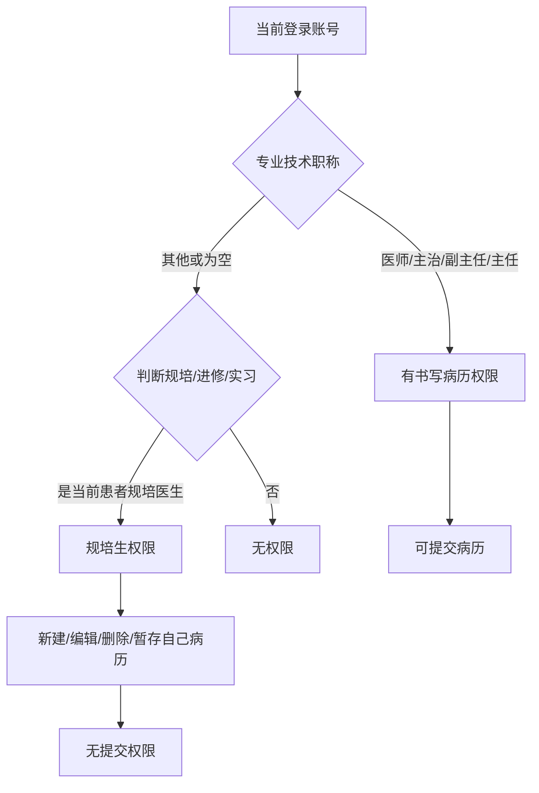
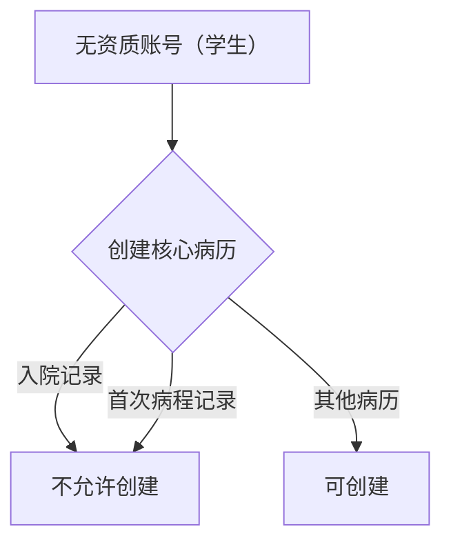

# BLGL-04-QXGL-002 规培生教学权限管理 _ Analyst - Spec

> **需求编号**：BLGL-04-QXGL-002
> **父需求**：BLGL-04-QXGL
> **关联PM Spec**：BLGL-04-QXGL-002_规培生教学权限管理_PM-spec.md
> **Spec版本**：V1.0
> **编写时间**：2026-08-15
> **编写人**：需求分析师

---

## 一、功能编号体系

### 1.1 功能层级结构

```
BLGL-04-QXGL-002-001: 规培生书写病历权限
  ├─ BLGL-04-QXGL-002-001-01: 规培生判断
  ├─ BLGL-04-QXGL-002-001-02: 新建/编辑/删除/暂存权限
  └─ BLGL-04-QXGL-002-001-03: 无提交权限

BLGL-04-QXGL-002-002: 规培生签署病历
  ├─ BLGL-04-QXGL-002-002-01: 规培生签署
  └─ BLGL-04-QXGL-002-002-02: 正式医生提交规培生病历

BLGL-04-QXGL-002-003: 无资质限制
  ├─ BLGL-04-QXGL-002-003-01: 无资质账号限制
  └─ BLGL-04-QXGL-002-003-02: 核心病历创建限制

BLGL-04-QXGL-002-004: 教学组功能
  └─ BLGL-04-QXGL-002-004-01: 教学组改造
```

### 1.2 功能编号表

| REQ-ID | 功能名称 | 类型 | 优先级 | 说明 |
|--------|---------|------|--------|------|
| BLGL-04-QXGL-002-001 | 规培生书写病历权限 | 功能 | P0 | 规培书写 |
| BLGL-04-QXGL-002-001-01 | 规培生判断 | 子功能 | P0 | 职称+规培/进修/实习 |
| BLGL-04-QXGL-002-001-02 | 新建/编辑/删除/暂存权限 | 子功能 | P0 | 自己病历 |
| BLGL-04-QXGL-002-001-03 | 无提交权限 | 子功能 | P0 | 规培生无提交 |
| BLGL-04-QXGL-002-002 | 规培生签署病历 | 功能 | P1 | 规培签署 |
| BLGL-04-QXGL-002-002-01 | 规培生签署 | 子功能 | P1 | 签署自己病历 |
| BLGL-04-QXGL-002-002-02 | 正式医生提交规培生病历 | 子功能 | P1 | 正式医生提交 |
| BLGL-04-QXGL-002-003 | 无资质限制 | 功能 | P0 | 无资质限制 |
| BLGL-04-QXGL-002-003-01 | 无资质账号限制 | 子功能 | P0 | 学生不能创建 |
| BLGL-04-QXGL-002-003-02 | 核心病历创建限制 | 子功能 | P0 | 入院/首程 |
| BLGL-04-QXGL-002-004 | 教学组功能 | 功能 | P2 | 教学组 |
| BLGL-04-QXGL-002-004-01 | 教学组改造 | 子功能 | P2 | 教学组功能 |

---

## 二、核心业务流程

### 2.1 规培生书写病历主流程



### 2.2 无资质限制流程



---

## 三、功能规格说明

### BLGL-04-QXGL-002-001: 规培生书写病历权限

#### 3.1.1 功能概述

如何判断当前登录账号为规培生账号：目前书写病历的权限是通过专业技术职称判断的，当专业技术职称是医师、主治医师、副主任医师、主任医师时，有书写病历的权限。那么再加一层规培生的判断，打开患者床位卡，定位在住院病历菜单，当前账号如果专业技术职称不是上面那四个或者为空时，需要判断是否为当前患者的规培医生、进修医生、实习医生，如果是的话，那么该账号对当前患者拥有规培生的权限，也就是有新建、编辑、删除、暂存当前患者病历（自己创建的病历）的权限，没有提交的权限。

#### 3.1.2 用户角色

| 角色 | 使用场景 | 权限要求 | 操作频率 |
|------|---------|---------|---------|
| 规培生 | 书写病历 | 规培权限（新建/编辑/删除/暂存，无提交） | 高频 |
| 进修医生 | 书写病历 | 规培权限 | 中频 |
| 实习医生 | 书写病历 | 规培权限 | 中频 |

#### 3.1.3 业务流程（Given/When/Then）

**Scenario 1: 规培生书写病历（主流程）**

```gherkin
Given:
  - 当前登录账号专业技术职称不是医师/主治/副主任/主任（或为空）

When:
  - 打开患者床位卡，定位在住院病历菜单

Then:
  - 判断是否为当前患者的规培/进修/实习医生
  - 是则拥有规培生权限：新建/编辑/删除/暂存自己创建的病历
  - 无提交权限
```

**Scenario 2: 正式医生提交规培生病历**

```gherkin
Given:
  - 规培生书写病历

When:
  - 正式医生提交

Then:
  - 正式医生可提交规培生写的病历
```

**Scenario 3: 异常——权限判断**

```gherkin
Given:
  - 规培生打开非自己创建的病历

When:
  - 编辑

Then:
  - 无编辑权限
```

#### 3.1.4 数据字段定义

| 字段名 | 类型 | 必填 | 默认值 | 取值范围 | 说明 | 概念ID |
|--------|------|------|--------|---------|------|--------|
| 专业技术职称 | String | 是 | - | 医师/主治/副主任/主任 | 规培生判断 | ⏳ 待确认 |
| 规培生标识 | Boolean | 否 | - | 规培/进修/实习 | 规培生判断 | ⏳ 待确认 |

#### 3.1.5 验收标准

| AC编号 | 验收标准 | 对应REQ-ID | 验证方法 | 验证场景 |
|--------|---------|-----------|---------|---------|
| AC-001 | 规培生判断生效，规培生可新建/编辑/删除/暂存自己病历 | BLGL-04-QXGL-002-001 | 功能测试 | Scenario 1 |
| AC-002 | 正式医生可提交规培生病历 | BLGL-04-QXGL-002-001 | 功能测试 | Scenario 2 |

---

### BLGL-04-QXGL-002-002: 规培生签署病历

#### 3.2.1 功能概述

住院病历新增规培生书写病历、签署病历的功能。

#### 3.2.2 用户角色

| 角色 | 使用场景 | 权限要求 | 操作频率 |
|------|---------|---------|---------|
| 规培生 | 签署病历 | 规培权限 | 中频 |

#### 3.2.3 业务流程（Given/When/Then）

**Scenario 1: 规培生签署病历（主流程）**

```gherkin
Given:
  - 规培生病历已书写

When:
  - 规培生签署病历

Then:
  - 规培生可签署自己写的病历
```

#### 3.2.4 数据字段定义

| ⏳ 待确认 | 规培生签署无独立数据字段 | 依赖规培权限 |

#### 3.2.5 验收标准

| AC编号 | 验收标准 | 对应REQ-ID | 验证方法 | 验证场景 |
|--------|---------|-----------|---------|---------|
| AC-003 | 规培生可签署自己写的病历 | BLGL-04-QXGL-002-002 | 功能测试 | Scenario 1 |

---

### BLGL-04-QXGL-002-003: 无资质限制

#### 3.3.1 功能概述

医院要求无资质账号（学生）不能创建入院记录以及首次病程记录。

#### 3.3.2 用户角色

| 角色 | 使用场景 | 权限要求 | 操作频率 |
|------|---------|---------|---------|
| 实习医生/学生 | 创建病历 | 无资质限制 | 中频 |

#### 3.3.3 业务流程（Given/When/Then）

**Scenario 1: 无资质限制（主流程）**

```gherkin
Given:
  - 无资质账号（学生）

When:
  - 创建入院记录/首次病程记录

Then:
  - 不允许创建
  - 提示无资质
```

#### 3.3.4 数据字段定义

| ⏳ 待确认 | 无资质限制无独立数据字段 | 依赖资质判断 |

#### 3.3.5 验收标准

| AC编号 | 验收标准 | 对应REQ-ID | 验证方法 | 验证场景 |
|--------|---------|-----------|---------|---------|
| AC-004 | 无资质账号不能创建入院记录/首次病程记录 | BLGL-04-QXGL-002-003 | 功能测试 | Scenario 1 |

---

### BLGL-04-QXGL-002-004: 教学组功能

#### 3.4.1 功能概述

教学组功能改造，支持教学组管理。

#### 3.4.2 用户角色

| 角色 | 使用场景 | 权限要求 | 操作频率 |
|------|---------|---------|---------|
| 教学主任 | 教学组管理 | 教学权限 | 低频 |

#### 3.4.3 业务流程（Given/When/Then）

**Scenario 1: 教学组功能（主流程）**

```gherkin
Given:
  - 教学组功能

When:
  - 教学主任管理教学组

Then:
  - 教学组功能生效
  - ⏳ 待确认：教学组具体功能资料区未明确
```

#### 3.4.4 数据字段定义

| ⏳ 待确认 | 教学组功能无独立数据字段 | 依赖教学组配置 |

#### 3.4.5 验收标准

| AC编号 | 验收标准 | 对应REQ-ID | 验证方法 | 验证场景 |
|--------|---------|-----------|---------|---------|
| AC-005 | 教学组功能生效 | BLGL-04-QXGL-002-004 | 功能测试 | Scenario 1 |

---

## 四、排除范围

本需求不包含以下功能项：

1. **病历审签权限管理** —— BLGL-04-QXGL-001
2. **分级访问控制** —— BLGL-04-QXGL-003
3. **病历操作权限管理** —— BLGL-04-QXGL-004
4. **角色职称权限管理** —— BLGL-04-QXGL-005
5. **科室病区权限管理** —— BLGL-04-QXGL-006
6. **病历业务授权** —— BLGL-04-QXGL-007

---

## 五、业务规则清单

| 规则ID | 规则名称 | 规则描述 | 来源 | 优先级 |
|--------|---------|---------|------|--------|
| BR-001 | 规培生判断 | 专业技术职称非四类时判断是否为规培/进修/实习医生 |  | P0 |
| BR-002 | 规培生权限 | 规培生有新建/编辑/删除/暂存自己病历权限，无提交权限 |  | P0 |
| BR-003 | 正式医生提交 | 正式医生可提交规培生写病历 |  | P1 |
| BR-004 | 无资质限制 | 无资质账号（学生）不能创建入院记录以及首次病程记录 |  | P0 |
| BR-005 | 规培签署 | 规培生可签署自己写的病历 |  | P1 |

---

## 六、关联文档

| 文档类型 | 文档路径 | 说明 |
|---------|---------|------|
| 功能点Spec（模块级） | 上级目录 BLGL-04-QXGL 权限管理功能点Spec.md（V1.0） | 模块级功能点索引 |
| 功能Spec（业务背景与设计） | 本目录 BLGL-04-QXGL-002_规培生教学权限管理-Spec.md（V1.0） | 业务背景与目标 Spec |
| Analyst-Spec（分析规格） | 本目录 BLGL-04-QXGL-002_规培生教学权限管理_Analyst-spec.md（V1.0）（本文档） | 分析规格 |
| PM-Spec（需求规格） | 本目录 BLGL-04-QXGL-002_规培生教学权限管理_PM-spec.md（V0.1） | PM 产出的 Spec 文档 |
| data-model.md | 待产出 | 架构师产出的数据建模文档 |
| design.md | 待产出 | 架构师产出的技术方案文档 |
| api-contract.md | 待产出 | 开发经理产出的 API 契约文档 |

---

## 七、待确认问题清单

| 编号 | 问题描述 | 缺失信息 | 影响范围 | 建议补充方 |
|------|---------|---------|---------|-----------|
| Q-001 | 规培生权限接口完整字段 | API 契约 | -Spec 第5章 | 开发经理 |
| Q-002 | 规培生判断参数/概念 ID | 概念ID | 3.1.4 | 产品经理 |
| Q-003 | 教学组功能（0）具体功能 | 需求分析原文缺失 | 3.4.3 | 需求分析师 |
| Q-004 | 职工控件只能选护士（0）根因 | 需求分析原文缺失 | 3.2.3 | 开发经理 |
| Q-005 | 性能指标（规培权限查询响应时间） | 资料区无量化指标 | -Spec 第8章 | 产品经理 |

---

## 填写检查清单

| 序号 | 检查项 | 是否完成 |
|:----:|--------|:--------:|
| 1 | 功能编号带父子层级 | ✅ |
| 2 | 每个 REQ-ID 有功能概述和用户角色 | ✅ |
| 3 | 主流程至少 1 个 Given/When/Then 场景 | ✅ |
| 4 | 异常流程至少 3 个 Given/When/Then 场景 | ✅ |
| 5 | 边界流程至少 2 个 Given/When/Then 场景 | ✅ |
| 6 | 每个 Given/When/Then 内容具体，不模糊 | ✅ |
| 7 | 数据字段定义完整（字段名、类型、必填、说明、概念ID） | ✅ |
| 8 | 验收标准 AC 编号独立，可验证 | ✅ |
| 9 | 验收标准无"功能正常"等模糊表述 | ✅ |
| 10 | 排除范围明确列出 | ✅ |
| 11 | 业务规则清单列出所有规则，每条标注来源 | ✅ |
| 12 | 流程图使用 Mermaid 格式（≥2 个） | ✅ |
| 13 | 关联文档索引包含 Phase 1 功能点Spec | ✅ |
| 14 | 待确认问题清单汇总了全文所有 ⏳ 项 | ✅ |
| 15 | 全文无占位符 `< >` 残留 | ✅ |
| 16 | 全文陈述可溯源至资料区（S1~S10 溯源核查） | ✅ |
| 17 | 人工审核确认完成 | ⏳ 待确认 |

---

**文档状态**：⬜ 待审核
**维护责任**：需求分析师规范组
**下次更新**：根据评审反馈优化

---

## 版本历史

| 版本 | 日期 | 变更说明 | 编写人 |
|------|------|---------|--------|
| V1.0 | 2026-08-15 | 初始版本 | 需求分析师 |
