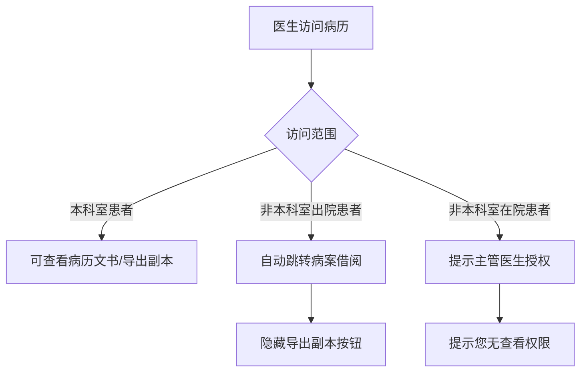
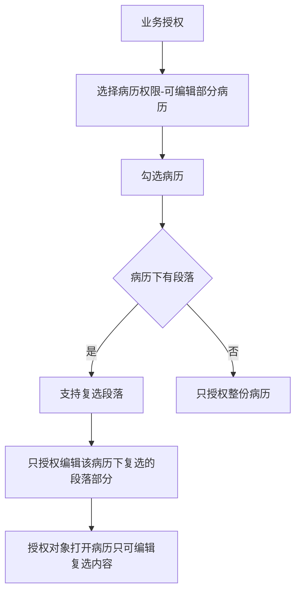

# BLGL-04-QXGL-003 分级访问控制 _ Analyst - Spec

> **需求编号**：BLGL-04-QXGL-003
> **父需求**：BLGL-04-QXGL
> **关联PM Spec**：BLGL-04-QXGL-003_分级访问控制_PM-spec.md
> **Spec版本**：V1.0
> **编写时间**：2026-08-15
> **编写人**：需求分析师

---

## 一、功能编号体系

### 1.1 功能层级结构

```
BLGL-04-QXGL-003-001: 五级分级访问控制
  ├─ BLGL-04-QXGL-003-001-01: 科室角色权限分配
  ├─ BLGL-04-QXGL-003-001-02: 医务管理人员全院访问
  └─ BLGL-04-QXGL-003-001-03: 会诊/临时授权

BLGL-04-QXGL-003-002: 六级授权内容
  ├─ BLGL-04-QXGL-003-002-01: 指定内容授权
  └─ BLGL-04-QXGL-003-002-02: 段落级授权

BLGL-04-QXGL-003-003: 全院查询权限控制
  ├─ BLGL-04-QXGL-003-003-01: 出院患者跳转借阅
  └─ BLGL-04-QXGL-003-003-02: 在院患者提示授权

BLGL-04-QXGL-003-004: 分块安全控制
  ├─ BLGL-04-QXGL-003-004-01: 分块安全控制
  └─ BLGL-04-QXGL-003-004-02: 访问日志

BLGL-04-QXGL-003-005: 隐私脱敏
  ├─ BLGL-04-QXGL-003-005-01: 脱敏开关/方案
  └─ BLGL-04-QXGL-003-005-02: 隐私查看日志
```

### 1.2 功能编号表

| REQ-ID | 功能名称 | 类型 | 优先级 | 说明 |
|--------|---------|------|--------|------|
| BLGL-04-QXGL-003-001 | 五级分级访问控制 | 功能 | P0 | 五级分级 |
| BLGL-04-QXGL-003-001-01 | 科室角色权限分配 | 子功能 | P0 | 各科室看本科室 |
| BLGL-04-QXGL-003-001-02 | 医务管理人员全院访问 | 子功能 | P0 | 医务可看各科室 |
| BLGL-04-QXGL-003-001-03 | 会诊/临时授权 | 子功能 | P1 | 已完成 |
| BLGL-04-QXGL-003-002 | 六级授权内容 | 功能 | P0 | 六级授权 |
| BLGL-04-QXGL-003-002-01 | 指定内容授权 | 子功能 | P0 | 授权编辑部分病历 |
| BLGL-04-QXGL-003-002-02 | 段落级授权 | 子功能 | P0 | 复选段落 |
| BLGL-04-QXGL-003-003 | 全院查询权限控制 | 功能 | P0 | 全院查询权限 |
| BLGL-04-QXGL-003-003-01 | 出院患者跳转借阅 | 子功能 | P0 | 自动跳转 |
| BLGL-04-QXGL-003-003-02 | 在院患者提示授权 | 子功能 | P0 | 提示主管医生授权 |
| BLGL-04-QXGL-003-004 | 分块安全控制 | 功能 | P1 | 分块安全 |
| BLGL-04-QXGL-003-004-01 | 分块安全控制 | 子功能 | P1 | 分块机制 |
| BLGL-04-QXGL-003-004-02 | 访问日志 | 子功能 | P1 | 访问日志 |
| BLGL-04-QXGL-003-005 | 隐私脱敏 | 功能 | P1 | 隐私脱敏 |
| BLGL-04-QXGL-003-005-01 | 脱敏开关/方案 | 子功能 | P1 | 脱敏配置 |
| BLGL-04-QXGL-003-005-02 | 隐私查看日志 | 子功能 | P1 | 查看日志 |

---

## 二、核心业务流程

### 2.1 分级访问控制主流程



### 2.2 六级授权指定内容流程



---

## 三、功能规格说明

### BLGL-04-QXGL-003-001: 五级分级访问控制

#### 3.1.1 功能概述

满足电子病历的五级评级：各角色人员权限分配控制，各科室临床医生只能看本科室患者，医务管理人员能够登录查看各科室患者（已完成）；会诊、临时授权（已完成）。

#### 3.1.2 用户角色

| 角色 | 使用场景 | 权限要求 | 操作频率 |
|------|---------|---------|---------|
| 住院医生 | 本科室病历访问 | 本科室权限 | 高频 |
| 医务管理人员 | 各科室病历查看 | 全院权限 | 中频 |

#### 3.1.3 业务流程（Given/When/Then）

**Scenario 1: 五级分级访问控制（主流程）**

```gherkin
Given:
  - 电子病历五级评级要求

When:
  - 医生访问病历

Then:
  - 各科室临床医生只能看本科室患者
  - 医务管理人员可查看各科室患者
  - 会诊/临时授权可访问
```

#### 3.1.4 数据字段定义

| 字段名 | 类型 | 必填 | 默认值 | 取值范围 | 说明 | 概念ID |
|--------|------|------|--------|---------|------|--------|
| inpEmrSetPermissionCode | Long | 否 | - | - | 病历权限编码 | ⏳ 待确认 |

#### 3.1.5 验收标准

| AC编号 | 验收标准 | 对应REQ-ID | 验证方法 | 验证场景 |
|--------|---------|-----------|---------|---------|
| AC-001 | 分级访问控制：本科室患者可见，跨科室受限 | BLGL-04-QXGL-003-001 | 功能测试 | Scenario 1 |

---

### BLGL-04-QXGL-003-002: 六级授权内容

#### 3.2.1 功能概述

满足电子病历的六级评级：在业务授权里，选择病历权限-可编辑部分病历，勾选病历，如果病历下有段落，支持复选段落，只授权编辑该病历下复选的段落部分。授权对象打开已经得到授权的病历，只可编辑复选的内容。

#### 3.2.2 用户角色

| 角色 | 使用场景 | 权限要求 | 操作频率 |
|------|---------|---------|---------|
| 病案管理员 | 业务授权配置 | 配置权限 | 低频 |
| 授权对象 | 编辑授权病历 | 段落授权 | 中频 |

#### 3.2.3 业务流程（Given/When/Then）

**Scenario 1: 六级授权指定内容（主流程）**

```gherkin
Given:
  - 六级评级要求

When:
  - 在业务授权里选择病历权限-可编辑部分病历
  - 勾选病历，复选段落

Then:
  - 只授权编辑该病历下复选的段落部分
  - 授权对象打开病历只可编辑复选内容
```

#### 3.2.4 数据字段定义

| ⏳ 待确认 | 六级授权无独立数据字段 | 依赖业务授权段落配置 |

#### 3.2.5 验收标准

| AC编号 | 验收标准 | 对应REQ-ID | 验证方法 | 验证场景 |
|--------|---------|-----------|---------|---------|
| AC-002 | 六级授权指定内容：可授权编辑病历指定段落 | BLGL-04-QXGL-003-002 | 功能测试 | Scenario 1 |

---

### BLGL-04-QXGL-003-003: 全院查询权限控制

#### 3.3.1 功能概述

浙江省中医院电子病历六级：当医生通过病历全院查询菜单查询病历时，全院查询非本科室出院患者自动跳转病案借阅功能，查询非本科室在院患者提示让主管医生授权。新增科室权限控制，判断当前登录人关联的科室：全院查询本科室患者支持查看病历文书/导出副本；非本科室出院患者点击查看自动跳转病案借阅，隐藏导出副本按钮；非本科室在院患者提示"您无查看权限，请联系主管医生授权"。

#### 3.3.2 用户角色

| 角色 | 使用场景 | 权限要求 | 操作频率 |
|------|---------|---------|---------|
| 住院医生 | 全院查询病历 | 本科室权限 | 高频 |

#### 3.3.3 业务流程（Given/When/Then）

**Scenario 1: 非本科室出院患者（主流程）**

```gherkin
Given:
  - 医生通过病历全院查询菜单查询病历

When:
  - 查询非本科室出院患者

Then:
  - 自动跳转病案借阅功能
  - 隐藏导出副本按钮
```

**Scenario 2: 非本科室在院患者**

```gherkin
Given:
  - 医生通过病历全院查询菜单查询病历

When:
  - 查询非本科室在院患者

Then:
  - 提示让主管医生授权
  - 提示文案"您无查看权限，请联系主管医生授权"
```

**Scenario 3: 本科室患者**

```gherkin
Given:
  - 医生全院查询本科室患者

When:
  - 点击查看/导出副本

Then:
  - 支持查看病历文书/导出副本
```

#### 3.3.4 数据字段定义

| 字段名 | 类型 | 必填 | 默认值 | 取值范围 | 说明 | 概念ID |
|--------|------|------|--------|---------|------|--------|
| 科室权限 | Boolean | 是 | - | 是/否 | 当前登录人科室访问权限 | ⏳ 待确认 |

#### 3.3.5 验收标准

| AC编号 | 验收标准 | 对应REQ-ID | 验证方法 | 验证场景 |
|--------|---------|-----------|---------|---------|
| AC-003 | 全院查询非本科室出院患者自动跳转病案借阅，隐藏导出副本 | BLGL-04-QXGL-003-003 | 功能测试 | Scenario 1 |
| AC-004 | 全院查询非本科室在院患者提示主管医生授权 | BLGL-04-QXGL-003-003 | 功能测试 | Scenario 2 |

---

### BLGL-04-QXGL-003-004: 分块安全控制

#### 3.4.1 功能概述

六级：病历具有分块安全控制机制和访问日志。

#### 3.4.2 用户角色

| 角色 | 使用场景 | 权限要求 | 操作频率 |
|------|---------|---------|---------|
| 住院医生 | 访问病历 | 本科室权限 | 高频 |

#### 3.4.3 业务流程（Given/When/Then）

**Scenario 1: 分块安全控制（主流程）**

```gherkin
Given:
  - 六级：病历具有分块安全控制机制

When:
  - 访问病历

Then:
  - 控制授权使用病历中的指定内容
  - 记录访问日志
```

#### 3.4.4 数据字段定义

| ⏳ 待确认 | 分块安全无独立数据字段 | 依赖访问控制配置 |

#### 3.4.5 验收标准

| AC编号 | 验收标准 | 对应REQ-ID | 验证方法 | 验证场景 |
|--------|---------|-----------|---------|---------|
| AC-005 | 病历分块安全控制机制和访问日志生效 | BLGL-04-QXGL-003-004 | 功能测试 | Scenario 1 |

---

### BLGL-04-QXGL-003-005: 隐私脱敏

#### 3.5.1 功能概述

隐私保护：获取前端脱敏开关、方案，记录隐私查看日志，获取员工隐私操作权限。

#### 3.5.2 用户角色

| 角色 | 使用场景 | 权限要求 | 操作频率 |
|------|---------|---------|---------|
| 住院医生 | 病历访问脱敏 | 本科室权限 | 高频 |

#### 3.5.3 业务流程（Given/When/Then）

**Scenario 1: 隐私脱敏（主流程）**

```gherkin
Given:
  - 病历访问隐私脱敏

When:
  - 获取脱敏开关、方案

Then:
  - 按脱敏配置展示
  - 记录隐私查看日志
```

#### 3.5.4 数据字段定义

| ⏳ 待确认 | 隐私脱敏无独立数据字段 | 依赖脱敏配置 |

#### 3.5.5 验收标准

| AC编号 | 验收标准 | 对应REQ-ID | 验证方法 | 验证场景 |
|--------|---------|-----------|---------|---------|
| AC-006 | 隐私脱敏开关/方案生效，记录查看日志 | BLGL-04-QXGL-003-005 | 功能测试 | Scenario 1 |

---

## 四、排除范围

本需求不包含以下功能项：

1. **病历审签权限管理** —— BLGL-04-QXGL-001
2. **规培生教学权限管理** —— BLGL-04-QXGL-002
3. **病历操作权限管理** —— BLGL-04-QXGL-004
4. **角色职称权限管理** —— BLGL-04-QXGL-005
5. **科室病区权限管理** —— BLGL-04-QXGL-006
6. **病历业务授权** —— BLGL-04-QXGL-007

---

## 五、业务规则清单

| 规则ID | 规则名称 | 规则描述 | 来源 | 优先级 |
|--------|---------|---------|------|--------|
| BR-001 | 分级访问 | 各科室临床医生只能看本科室患者，医务管理人员可看各科室 |  | P0 |
| BR-002 | 六级授权 | 业务授权选择病历权限-可编辑部分病历，支持复选段落 |  | P0 |
| BR-003 | 全院查询 | 非本科室出院患者跳转借阅，非本科室在院患者提示授权 |  | P0 |
| BR-004 | 分块安全 | 病历分块安全控制机制和访问日志 | 5 | P1 |
| BR-005 | 隐私脱敏 | 获取脱敏开关/方案，记录隐私查看日志 | 代码 | P1 |

---

## 六、关联文档

| 文档类型 | 文档路径 | 说明 |
|---------|---------|------|
| 功能点Spec（模块级） | 上级目录 BLGL-04-QXGL 权限管理功能点Spec.md（V1.0） | 模块级功能点索引 |
| 功能Spec（业务背景与设计） | 本目录 BLGL-04-QXGL-003_分级访问控制-Spec.md（V1.0） | 业务背景与目标 Spec |
| Analyst-Spec（分析规格） | 本目录 BLGL-04-QXGL-003_分级访问控制_Analyst-spec.md（V1.0）（本文档） | 分析规格 |
| PM-Spec（需求规格） | 本目录 BLGL-04-QXGL-003_分级访问控制_PM-spec.md（V0.1） | PM 产出的 Spec 文档 |
| data-model.md | 待产出 | 架构师产出的数据建模文档 |
| design.md | 待产出 | 架构师产出的技术方案文档 |
| api-contract.md | 待产出 | 开发经理产出的 API 契约文档 |

---

## 七、待确认问题清单

| 编号 | 问题描述 | 缺失信息 | 影响范围 | 建议补充方 |
|------|---------|---------|---------|-----------|
| Q-001 | 分级访问接口完整字段 | API 契约 | -Spec 第5章 | 开发经理 |
| Q-002 | 科室权限配置概念 ID | 概念ID | 3.3.4 | 产品经理 |
| Q-003 | 六级授权段落配置表模型 | 数据模型 | 3.2.3 | 架构师 |
| Q-004 | 分块安全控制实现方式 | 需求分析原文缺失 | 3.4.3 | 需求分析师 |
| Q-005 | 性能指标（分级访问查询响应时间） | 资料区无量化指标 | -Spec 第8章 | 产品经理 |

---

## 填写检查清单

| 序号 | 检查项 | 是否完成 |
|:----:|--------|:--------:|
| 1 | 功能编号带父子层级 | ✅ |
| 2 | 每个 REQ-ID 有功能概述和用户角色 | ✅ |
| 3 | 主流程至少 1 个 Given/When/Then 场景 | ✅ |
| 4 | 异常流程至少 3 个 Given/When/Then 场景 | ✅ |
| 5 | 边界流程至少 2 个 Given/When/Then 场景 | ✅ |
| 6 | 每个 Given/When/Then 内容具体，不模糊 | ✅ |
| 7 | 数据字段定义完整（字段名、类型、必填、说明、概念ID） | ✅ |
| 8 | 验收标准 AC 编号独立，可验证 | ✅ |
| 9 | 验收标准无"功能正常"等模糊表述 | ✅ |
| 10 | 排除范围明确列出 | ✅ |
| 11 | 业务规则清单列出所有规则，每条标注来源 | ✅ |
| 12 | 流程图使用 Mermaid 格式（≥2 个） | ✅ |
| 13 | 关联文档索引包含 Phase 1 功能点Spec | ✅ |
| 14 | 待确认问题清单汇总了全文所有 ⏳ 项 | ✅ |
| 15 | 全文无占位符 `< >` 残留 | ✅ |
| 16 | 全文陈述可溯源至资料区（S1~S10 溯源核查） | ✅ |
| 17 | 人工审核确认完成 | ⏳ 待确认 |

---

**文档状态**：⬜ 待审核
**维护责任**：需求分析师规范组
**下次更新**：根据评审反馈优化

---

## 版本历史

| 版本 | 日期 | 变更说明 | 编写人 |
|------|------|---------|--------|
| V1.0 | 2026-08-15 | 初始版本 | 需求分析师 |
