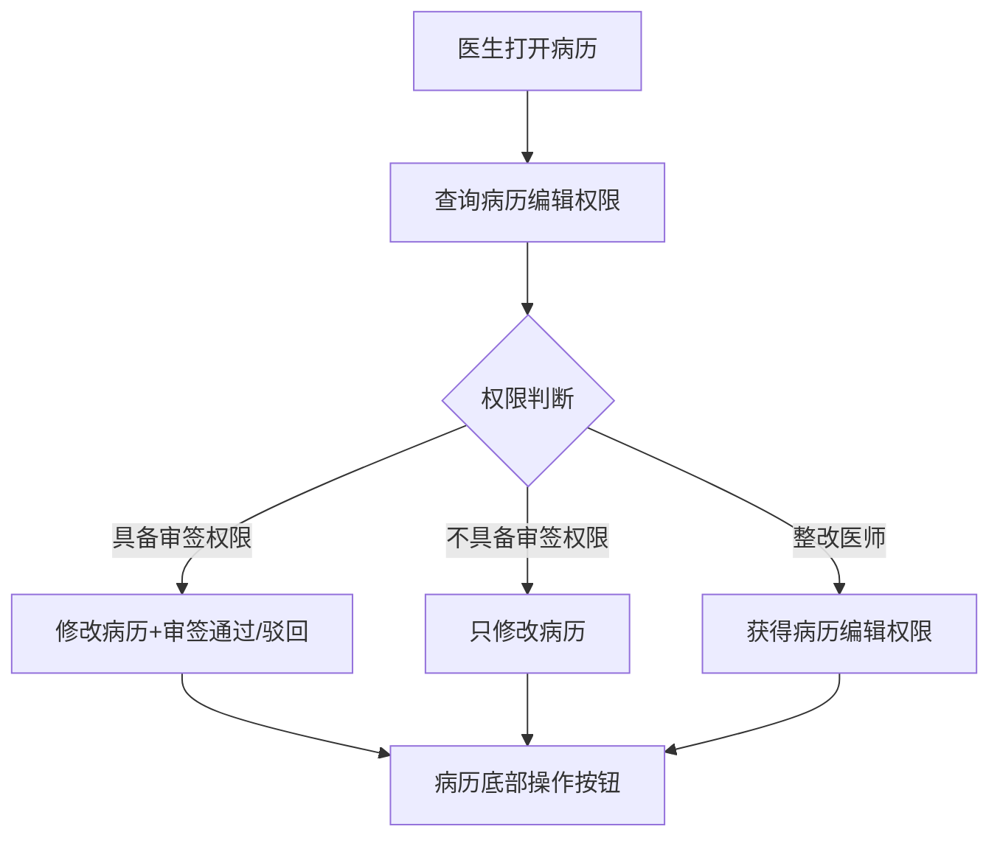
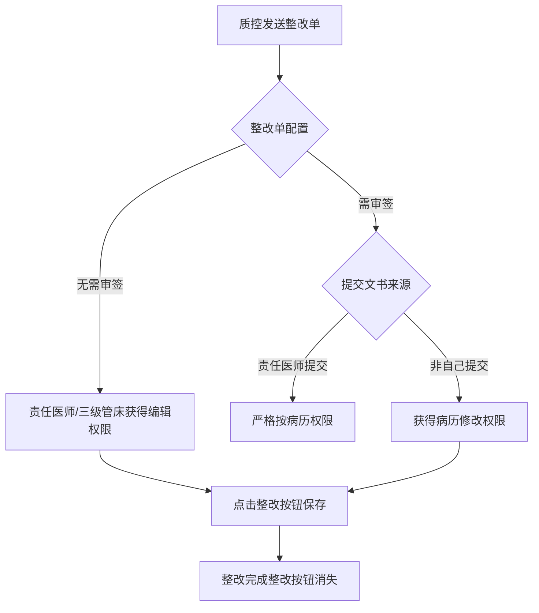

# BLGL-04-QXGL-004 病历操作权限管理 _ Analyst - Spec

> **需求编号**：BLGL-04-QXGL-004
> **父需求**：BLGL-04-QXGL
> **关联PM Spec**：BLGL-04-QXGL-004_病历操作权限管理_PM-spec.md
> **Spec版本**：V1.0
> **编写时间**：2026-08-15
> **编写人**：需求分析师

---

## 一、功能编号体系

### 1.1 功能层级结构

```
BLGL-04-QXGL-004-001: 病历操作权限查询
  ├─ BLGL-04-QXGL-004-001-01: 病历编辑权限查询
  ├─ BLGL-04-QXGL-004-001-02: 操作按钮权限展示
  └─ BLGL-04-QXGL-004-001-03: 操作权限码控制

BLGL-04-QXGL-004-002: 整改医师修改权限
  ├─ BLGL-04-QXGL-004-002-01: 整改单无需审核权限
  └─ BLGL-04-QXGL-004-002-02: 整改单需审签权限

BLGL-04-QXGL-004-003: 上级修改下级病历权限
  ├─ BLGL-04-QXGL-004-003-01: 上级修改权限
  └─ BLGL-04-QXGL-004-003-02: 操作按钮优化

BLGL-04-QXGL-004-004: 诊断录入权限
  ├─ BLGL-04-QXGL-004-004-01: diagnosisOnlyEdit 参数
  └─ BLGL-04-QXGL-004-004-02: 护士不可编辑诊断

BLGL-04-QXGL-004-005: 病历操作基本权限
  ├─ BLGL-04-QXGL-004-005-01: 创建/编辑/删除/提交/撤回
  └─ BLGL-04-QXGL-004-005-02: 本人诊断本人删
```

### 1.2 功能编号表

| REQ-ID | 功能名称 | 类型 | 优先级 | 说明 |
|--------|---------|------|--------|------|
| BLGL-04-QXGL-004-001 | 病历操作权限查询 | 功能 | P0 | 权限查询 |
| BLGL-04-QXGL-004-001-01 | 病历编辑权限查询 | 子功能 | P0 | emr_permission/query |
| BLGL-04-QXGL-004-001-02 | 操作按钮权限展示 | 子功能 | P0 | 按权限展示按钮 |
| BLGL-04-QXGL-004-001-03 | 操作权限码控制 | 子功能 | P0 | INP_EMR_PERMISSION_CODE |
| BLGL-04-QXGL-004-002 | 整改医师修改权限 | 功能 | P0 | 整改权限 |
| BLGL-04-QXGL-004-002-01 | 整改单无需审核权限 | 子功能 | P0 | 责任医师/三级管床获得权限 |
| BLGL-04-QXGL-004-002-02 | 整改单需审签权限 | 子功能 | P1 | 严格按病历权限 |
| BLGL-04-QXGL-004-003 | 上级修改下级病历权限 | 功能 | P0 | 上级修改权限 |
| BLGL-04-QXGL-004-003-01 | 上级修改权限 | 子功能 | P0 | 修改+审签 |
| BLGL-04-QXGL-004-003-02 | 操作按钮优化 | 子功能 | P1 | 减少操作权限误导 |
| BLGL-04-QXGL-004-004 | 诊断录入权限 | 功能 | P1 | 诊断权限 |
| BLGL-04-QXGL-004-004-01 | diagnosisOnlyEdit 参数 | 子功能 | P1 | 病历来源传 true |
| BLGL-04-QXGL-004-004-02 | 护士不可编辑诊断 | 子功能 | P1 | 来源区分 |
| BLGL-04-QXGL-004-005 | 病历操作基本权限 | 功能 | P1 | 基本操作 |
| BLGL-04-QXGL-004-005-01 | 创建/编辑/删除/提交/撤回 | 子功能 | P1 | 操作权限 |
| BLGL-04-QXGL-004-005-02 | 本人诊断本人删 | 子功能 | P1 | 本人可删 |

---

## 二、核心业务流程

### 2.1 病历操作权限主流程



### 2.2 整改医师权限流程



---

## 三、功能规格说明

### BLGL-04-QXGL-004-001: 病历操作权限查询

#### 3.1.1 功能概述

查询用户病历的编辑权限，按权限码控制病历操作按钮展示。病历编辑权限查询接口 emr_permission/query、check_permission/by_emr_set_id、edit_permission/query。

#### 3.1.2 用户角色

| 角色 | 使用场景 | 权限要求 | 操作频率 |
|------|---------|---------|---------|
| 住院医生 | 病历操作 | 病历操作权限管理 | 高频 |

#### 3.1.3 业务流程（Given/When/Then）

**Scenario 1: 病历操作权限查询（主流程）**

```gherkin
Given:
  - 医生打开病历

When:
  - 查询病历编辑权限

Then:
  - 按权限展示操作按钮
  - 具备审签权限则展示保存/审签通过/审签驳回
  - 不具备审签权限则只修改
```

**Scenario 2: 操作权限码**

```gherkin
Given:
  - 病历操作

When:
  - 判断操作权限

Then:
  - 按 INP_EMR_PERMISSION_CODE 权限码控制
```

#### 3.1.4 数据字段定义

| 字段名 | 类型 | 必填 | 默认值 | 取值范围 | 说明 | 概念ID |
|--------|------|------|--------|---------|------|--------|
| inpEmrSetId | Long | 是 | - | - | 病历集ID | ⏳ 待确认 |
| inpEmrPermissionCode | Long | 否 | - | - | 操作权限码（INP_EMR_PERMISSION_CODE，代码） | ⏳ 待确认 |

#### 3.1.5 验收标准

| AC编号 | 验收标准 | 对应REQ-ID | 验证方法 | 验证场景 |
|--------|---------|-----------|---------|---------|
| AC-001 | 病历操作权限查询接口 emr_permission/query 返回权限列表 | BLGL-04-QXGL-004-001 | 接口测试 | Scenario 1 |

---

### BLGL-04-QXGL-004-002: 整改医师修改权限

#### 3.2.1 功能概述

质控系统发送整改单后，配置的整改医生需要获得病历的相关编辑权限。整改单无需审核时，收到整改单的医生需要获得病历的所有编辑权限：责任医师、三级管床医师获得该获得所有需要整改病历文书的编辑权限，点击整改按钮即可保存本次整改内容，整改完成后整改按钮消失。整改单需审签时，责任医师提交的病历文书严格按病历权限，非自己提交文书获得病历修改权限。

#### 3.2.2 用户角色

| 角色 | 使用场景 | 权限要求 | 操作频率 |
|------|---------|---------|---------|
| 整改医师 | 整改病历 | 病历编辑权限 | 中频 |
| 三级医师 | 整改病历 | 病历修改权限 | 中频 |

#### 3.2.3 业务流程（Given/When/Then）

**Scenario 1: 整改权限（主流程）**

```gherkin
Given:
  - 质控系统发送整改单
  - 整改单配置为无需审签

When:
  - 整改医生修改病历

Then:
  - 责任医师、三级管床医师获得所有需要整改病历文书的编辑权限
  - 点击整改按钮保存整改内容
  - 整改完成后整改按钮消失
```

**Scenario 2: 整改单需审签**

```gherkin
Given:
  - 整改单配置需审签

When:
  - 非自己提交文书

Then:
  - 获得病历修改权限，病历主界面显示整改按钮
```

#### 3.2.4 数据字段定义

| ⏳ 待确认 | 整改权限无独立数据字段 | 依赖整改单配置 |

#### 3.2.5 验收标准

| AC编号 | 验收标准 | 对应REQ-ID | 验证方法 | 验证场景 |
|--------|---------|-----------|---------|---------|
| AC-002 | 整改医师获得病历编辑权限，整改完成按钮消失 | BLGL-04-QXGL-004-002 | 功能测试 | Scenario 1 |

---

### BLGL-04-QXGL-004-003: 上级修改下级病历权限

#### 3.3.1 功能概述

开启上级医生修改下级医生病历的参数，会导致病历下的操作权限很多，给用户造成误解。优化规则：日常管理病历审签界面审签流程中配置的文书，上级医生具备修改病历文书和审核签名权限，病历底部展示操作按钮保存、审签通过、审签驳回；患者主界面先判断当前登录人是否具备审签权限。

#### 3.3.2 用户角色

| 角色 | 使用场景 | 权限要求 | 操作频率 |
|------|---------|---------|---------|
| 上级医师 | 修改下级病历 | 修改+审签权限 | 中频 |

#### 3.3.3 业务流程（Given/When/Then）

**Scenario 1: 上级修改下级病历（主流程）**

```gherkin
Given:
  - 开启上级医生修改下级医生病历参数

When:
  - 上级医生修改下级医生病历

Then:
  - 审签流程中配置的文书具备修改+审核签名权限
  - 病历底部展示保存/审签通过/审签驳回
```

#### 3.3.4 数据字段定义

| ⏳ 待确认 | 上级修改权限无独立数据字段 | 依赖审签权限 |

#### 3.3.5 验收标准

| AC编号 | 验收标准 | 对应REQ-ID | 验证方法 | 验证场景 |
|--------|---------|-----------|---------|---------|
| AC-003 | 上级医生修改下级病历具备修改+审签权限，操作按钮按权限展示 | BLGL-04-QXGL-004-003 | 功能测试 | Scenario 1 |

---

### BLGL-04-QXGL-004-004: 诊断录入权限

#### 3.4.1 功能概述

临床诊断增加对录入诊断权限控制字段 diagnosisOnlyEdit，病历来源传固定参数给前端进行来源判断；诊断组件打开时入参区分来源，医生可以编辑诊断，护士不能编辑诊断（包含护理病历、病历协同页面）。

#### 3.4.2 用户角色

| 角色 | 使用场景 | 权限要求 | 操作频率 |
|------|---------|---------|---------|
| 住院医生 | 病历引用诊断 | 可编辑诊断 | 高频 |
| 护士 | 护理文书引用诊断 | 不可编辑诊断 | 中频 |

#### 3.4.3 业务流程（Given/When/Then）

**Scenario 1: 诊断录入权限（主流程）**

```gherkin
Given:
  - 病历调用诊断组件

When:
  - 传 diagnosisOnlyEdit

Then:
  - 病历来源传值为 true
  - 控制录入诊断权限
```

**Scenario 2: 护士不可编辑诊断**

```gherkin
Given:
  - 护士打开护理文书（知情同意书）

When:
  - 双击引用诊断

Then:
  - 护士不能编辑诊断
  - 医生可以编辑诊断
```

#### 3.4.4 数据字段定义

| 字段名 | 类型 | 必填 | 默认值 | 取值范围 | 说明 | 概念ID |
|--------|------|------|--------|---------|------|--------|
| diagnosisOnlyEdit | Boolean | 否 | - | true/false | 录入诊断权限 | ⏳ 待确认 |

#### 3.4.5 验收标准

| AC编号 | 验收标准 | 对应REQ-ID | 验证方法 | 验证场景 |
|--------|---------|-----------|---------|---------|
| AC-004 | 诊断录入权限 diagnosisOnlyEdit 病历来源传 true | BLGL-04-QXGL-004-004 | 功能测试 | Scenario 1 |
| AC-005 | 护士引用诊断不可编辑 | BLGL-04-QXGL-004-004 | 功能测试 | Scenario 2 |

---

### BLGL-04-QXGL-004-005: 病历操作基本权限

#### 3.5.1 功能概述

病历创建/编辑/删除/提交/撤回等操作权限。本人插入的诊断只有本人能够删除，删除后恢复预制的样式。

#### 3.5.2 用户角色

| 角色 | 使用场景 | 权限要求 | 操作频率 |
|------|---------|---------|---------|
| 住院医生 | 病历操作 | 病历操作权限管理 | 高频 |

#### 3.5.3 业务流程（Given/When/Then）

**Scenario 1: 本人诊断本人删（主流程）**

```gherkin
Given:
  - 医生在入院记录预制诊断元素插入诊断并签名

When:
  - 其他医生尝试删除

Then:
  - 本人插入的诊断只有本人能够删除
  - 删除后恢复预制的样式
```

#### 3.5.4 数据字段定义

| ⏳ 待确认 | 病历操作基本权限无独立数据字段 | 依赖操作权限码 |

#### 3.5.5 验收标准

| AC编号 | 验收标准 | 对应REQ-ID | 验证方法 | 验证场景 |
|--------|---------|-----------|---------|---------|
| AC-006 | 本人插入的诊断只有本人可删 | BLGL-04-QXGL-004-005 | 功能测试 | Scenario 1 |

---

## 四、排除范围

本需求不包含以下功能项：

1. **病历审签权限管理** —— BLGL-04-QXGL-001
2. **规培生教学权限管理** —— BLGL-04-QXGL-002
3. **分级访问控制** —— BLGL-04-QXGL-003
4. **角色职称权限管理** —— BLGL-04-QXGL-005
5. **科室病区权限管理** —— BLGL-04-QXGL-006
6. **病历业务授权** —— BLGL-04-QXGL-007

---

## 五、业务规则清单

| 规则ID | 规则名称 | 规则描述 | 来源 | 优先级 |
|--------|---------|---------|------|--------|
| BR-001 | 操作权限码 | 病历操作按 INP_EMR_PERMISSION_CODE 权限码控制 | 代码 | P0 |
| BR-002 | 整改权限 | 整改单无需审核时责任医师/三级管床获得编辑权限，整改完成按钮消失 |  | P0 |
| BR-003 | 上级修改 | 审签流程中配置的文书上级医生具备修改+审核签名权限 |  | P0 |
| BR-004 | 诊断录入权限 | 临床诊断录入权限字段 diagnosisOnlyEdit，病历来源传 true |  | P1 |
| BR-005 | 护士权限 | 护士不能编辑诊断（含护理病历、病历协同页面） |  | P1 |
| BR-006 | 本人删除 | 本人插入的诊断只有本人能够删除，删除后恢复预制样式 |  | P1 |

---

## 六、关联文档

| 文档类型 | 文档路径 | 说明 |
|---------|---------|------|
| 功能点Spec（模块级） | 上级目录 BLGL-04-QXGL 权限管理功能点Spec.md（V1.0） | 模块级功能点索引 |
| 功能Spec（业务背景与设计） | 本目录 BLGL-04-QXGL-004_病历操作权限管理-Spec.md（V1.0） | 业务背景与目标 Spec |
| Analyst-Spec（分析规格） | 本目录 BLGL-04-QXGL-004_病历操作权限管理_Analyst-spec.md（V1.0）（本文档） | 分析规格 |
| PM-Spec（需求规格） | 本目录 BLGL-04-QXGL-004_病历操作权限管理_PM-spec.md（V0.1） | PM 产出的 Spec 文档 |
| data-model.md | 待产出 | 架构师产出的数据建模文档 |
| design.md | 待产出 | 架构师产出的技术方案文档 |
| api-contract.md | 待产出 | 开发经理产出的 API 契约文档 |

---

## 七、待确认问题清单

| 编号 | 问题描述 | 缺失信息 | 影响范围 | 建议补充方 |
|------|---------|---------|---------|-----------|
| Q-001 | 病历操作权限接口（InpatientEMRPermissionGetOutputVO）完整字段 | API 契约 | -Spec 第5章 | 开发经理 |
| Q-002 | 整改权限参数概念 ID | 概念ID | 3.2.4 | 产品经理 |
| Q-003 | 整改医师权限整改范围 | 需求分析原文缺失 | 3.2.3 | 需求分析师 |
| Q-004 | 上级修改下级病历操作权限过多问题 | 需求分析原文缺失 | 3.3.3 | 需求分析师 |
| Q-005 | 性能指标（病历操作权限查询响应时间） | 资料区无量化指标 | -Spec 第8章 | 产品经理 |

---

## 填写检查清单

| 序号 | 检查项 | 是否完成 |
|:----:|--------|:--------:|
| 1 | 功能编号带父子层级 | ✅ |
| 2 | 每个 REQ-ID 有功能概述和用户角色 | ✅ |
| 3 | 主流程至少 1 个 Given/When/Then 场景 | ✅ |
| 4 | 异常流程至少 3 个 Given/When/Then 场景 | ✅ |
| 5 | 边界流程至少 2 个 Given/When/Then 场景 | ✅ |
| 6 | 每个 Given/When/Then 内容具体，不模糊 | ✅ |
| 7 | 数据字段定义完整（字段名、类型、必填、说明、概念ID） | ✅ |
| 8 | 验收标准 AC 编号独立，可验证 | ✅ |
| 9 | 验收标准无"功能正常"等模糊表述 | ✅ |
| 10 | 排除范围明确列出 | ✅ |
| 11 | 业务规则清单列出所有规则，每条标注来源 | ✅ |
| 12 | 流程图使用 Mermaid 格式（≥2 个） | ✅ |
| 13 | 关联文档索引包含 Phase 1 功能点Spec | ✅ |
| 14 | 待确认问题清单汇总了全文所有 ⏳ 项 | ✅ |
| 15 | 全文无占位符 `< >` 残留 | ✅ |
| 16 | 全文陈述可溯源至资料区（S1~S10 溯源核查） | ✅ |
| 17 | 人工审核确认完成 | ⏳ 待确认 |

---

**文档状态**：⬜ 待审核
**维护责任**：需求分析师规范组
**下次更新**：根据评审反馈优化

---

## 版本历史

| 版本 | 日期 | 变更说明 | 编写人 |
|------|------|---------|--------|
| V1.0 | 2026-08-15 | 初始版本 | 需求分析师 |
