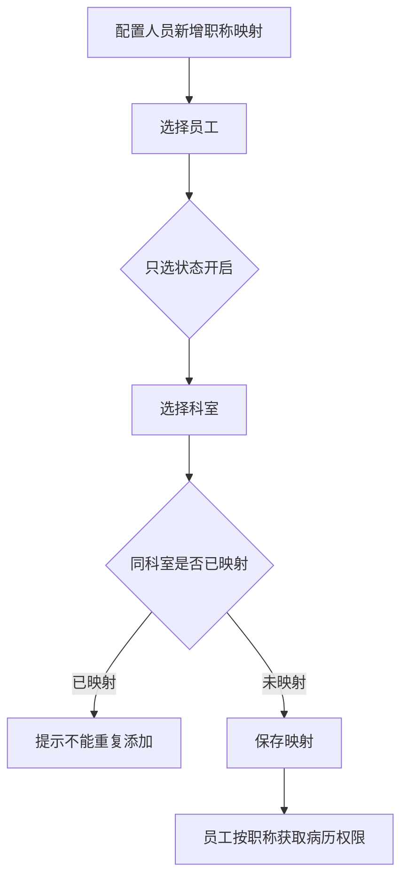
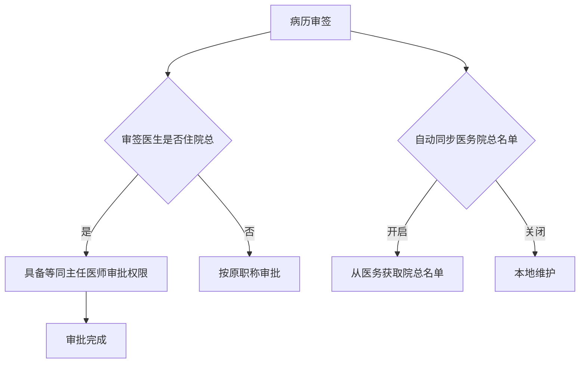

# BLGL-04-QXGL-005 角色职称权限管理 _ Analyst - Spec

> **需求编号**：BLGL-04-QXGL-005
> **父需求**：BLGL-04-QXGL
> **关联PM Spec**：BLGL-04-QXGL-005_角色职称权限管理_PM-spec.md
> **Spec版本**：V1.0
> **编写时间**：2026-08-15
> **编写人**：需求分析师

---

## 一、功能编号体系

### 1.1 功能层级结构

```
BLGL-04-QXGL-005-001: 医生职称映射配置
  ├─ BLGL-04-QXGL-005-001-01: 职称映射界面
  ├─ BLGL-04-QXGL-005-001-02: 状态开启用户选择
  └─ BLGL-04-QXGL-005-001-03: 同科室唯一性校验

BLGL-04-QXGL-005-002: 住院总职称审批
  ├─ BLGL-04-QXGL-005-002-01: 住院总等同主任医师
  └─ BLGL-04-QXGL-005-002-02: 医务院总名单同步

BLGL-04-QXGL-005-003: 中医师职称书写
  ├─ BLGL-04-QXGL-005-003-01: 中医师职称权限
  └─ BLGL-04-QXGL-005-003-02: 知识文档员工过滤

BLGL-04-QXGL-005-004: 责任医生判断
  └─ BLGL-04-QXGL-005-004-01: 跨责任医生创建警示
```

### 1.2 功能编号表

| REQ-ID | 功能名称 | 类型 | 优先级 | 说明 |
|--------|---------|------|--------|------|
| BLGL-04-QXGL-005-001 | 医生职称映射配置 | 功能 | P0 | 职称映射 |
| BLGL-04-QXGL-005-001-01 | 职称映射界面 | 子功能 | P0 | 映射配置 |
| BLGL-04-QXGL-005-001-02 | 状态开启用户选择 | 子功能 | P0 | 只选开启用户 |
| BLGL-04-QXGL-005-001-03 | 同科室唯一性校验 | 子功能 | P0 | 不能重复映射 |
| BLGL-04-QXGL-005-002 | 住院总职称审批 | 功能 | P1 | 住院总审批 |
| BLGL-04-QXGL-005-002-01 | 住院总等同主任医师 | 子功能 | P1 | 审批权限 |
| BLGL-04-QXGL-005-002-02 | 医务院总名单同步 | 子功能 | P1 | 自动同步 |
| BLGL-04-QXGL-005-003 | 中医师职称书写 | 功能 | P1 | 中医师职称 |
| BLGL-04-QXGL-005-003-01 | 中医师职称权限 | 子功能 | P1 | 可书写病历 |
| BLGL-04-QXGL-005-003-02 | 知识文档员工过滤 | 子功能 | P2 | 职称过滤条件 |
| BLGL-04-QXGL-005-004 | 责任医生判断 | 功能 | P1 | 责任医生 |
| BLGL-04-QXGL-005-004-01 | 跨责任医生创建警示 | 子功能 | P1 | 弹框警示 |

---

## 二、核心业务流程

### 2.1 医生职称映射配置流程



### 2.2 住院总审批流程



---

## 三、功能规格说明

### BLGL-04-QXGL-005-001: 医生职称映射配置

#### 3.1.1 功能概述

新增员工职称映射时，选择员工只选择状态=开启的用户；新增员工职称映射时需要限制，同一个员工在同一个科室只允许映射一次，如果校验到该用户在同一个科室已存在映射，点确定的时候要弹出提示信息"该员工在***科室已有映射，不能重复添加。"。

#### 3.1.2 用户角色

| 角色 | 使用场景 | 权限要求 | 操作频率 |
|------|---------|---------|---------|
| 医务科 | 职称映射配置 | 配置权限 | 低频 |

#### 3.1.3 业务流程（Given/When/Then）

**Scenario 1: 职称映射（主流程）**

```gherkin
Given:
  - 配置人员新增员工职称映射

When:
  - 选择员工

Then:
  - 只选择状态=开启的用户
  - 同一个员工在同一个科室只允许映射一次
  - 已存在映射则提示"该员工在***科室已有映射，不能重复添加"
```

**Scenario 2: 异常——重复映射**

```gherkin
Given:
  - 同一员工在同一个科室已存在映射

When:
  - 点击确定

Then:
  - 弹出提示"该员工在***科室已有映射，不能重复添加"
```

#### 3.1.4 数据字段定义

| 字段名 | 类型 | 必填 | 默认值 | 取值范围 | 说明 | 概念ID |
|--------|------|------|--------|---------|------|--------|
| employeeId | Long | 是 | - | - | 员工ID | ⏳ 待确认 |
| expertiseCode | Long | 是 | - | - | 职称编码 | ⏳ 待确认 |
| deptId | Long | 是 | - | - | 科室ID | ⏳ 待确认 |

#### 3.1.5 验收标准

| AC编号 | 验收标准 | 对应REQ-ID | 验证方法 | 验证场景 |
|--------|---------|-----------|---------|---------|
| AC-001 | 职称映射只选开启用户，同科室只允许映射一次，重复提示 | BLGL-04-QXGL-005-001 | 功能测试 | Scenario 1/2 |

---

### BLGL-04-QXGL-005-002: 住院总职称审批

#### 3.2.1 功能概述

病历审签调用医务管理系统住院总人员设置接口，如果审签医生是住院总，需要具备等同主任医师审批的权限。病历系统增加配置"自动同步医务院总名单"（开启/关闭，默认关闭），开启后默认当前列表数据都从医务取，新增人员更新医生职称为院总职称映射中选择的职称。

#### 3.2.2 用户角色

| 角色 | 使用场景 | 权限要求 | 操作频率 |
|------|---------|---------|---------|
| 住院总 | 审签审批 | 等同主任医师 | 中频 |

#### 3.2.3 业务流程（Given/When/Then）

**Scenario 1: 住院总审批（主流程）**

```gherkin
Given:
  - 病历审签调用医务管理系统住院总人员设置接口

When:
  - 审签医生是住院总

Then:
  - 具备等同主任医师审批的权限
  - 自动同步医务院总名单（参数开启）
```

#### 3.2.4 数据字段定义

| 字段名 | 类型 | 必填 | 默认值 | 取值范围 | 说明 | 概念ID |
|--------|------|------|--------|---------|------|--------|
| 自动同步医务院总名单 | Boolean | 否 | 关闭 | 开启/关闭 | 住院总名单同步 | ⏳ 待确认 |

#### 3.2.5 验收标准

| AC编号 | 验收标准 | 对应REQ-ID | 验证方法 | 验证场景 |
|--------|---------|-----------|---------|---------|
| AC-002 | 住院总审批等同主任医师，自动同步医务院总名单 | BLGL-04-QXGL-005-002 | 集成测试 | Scenario 1 |

---

### BLGL-04-QXGL-005-003: 中医师职称书写

#### 3.3.1 功能概述

医院需增加中医师、主治中医师、主任中医师等职称，需可书写病历。知识文档与动态数据中员工集合过滤条件需新增"专业技术职称"。

#### 3.3.2 用户角色

| 角色 | 使用场景 | 权限要求 | 操作频率 |
|------|---------|---------|---------|
| 中医师 | 书写病历 | 职称权限 | 高频 |
| 主治中医师 | 书写病历 | 职称权限 | 高频 |
| 主任中医师 | 书写病历 | 职称权限 | 高频 |

#### 3.3.3 业务流程（Given/When/Then）

**Scenario 1: 中医师职称书写（主流程）**

```gherkin
Given:
  - 医院需增加中医师、主治中医师、主任中医师等职称

When:
  - 中医师书写病历

Then:
  - 可书写病历
```

**Scenario 2: 知识文档员工过滤**

```gherkin
Given:
  - 知识文档与动态数据中员工集合过滤条件

When:
  - 过滤员工

Then:
  - 新增"专业技术职称"过滤条件
```

#### 3.3.4 数据字段定义

| 字段名 | 类型 | 必填 | 默认值 | 取值范围 | 说明 | 概念ID |
|--------|------|------|--------|---------|------|--------|
| 专业技术职称 | String | 否 | - | 中医师等 | 员工过滤条件 | ⏳ 待确认 |

#### 3.3.5 验收标准

| AC编号 | 验收标准 | 对应REQ-ID | 验证方法 | 验证场景 |
|--------|---------|-----------|---------|---------|
| AC-003 | 中医师/主治中医师/主任中医师可书写病历 | BLGL-04-QXGL-005-003 | 功能测试 | Scenario 1 |

---

### BLGL-04-QXGL-005-004: 责任医生判断

#### 3.4.1 功能概述

根据责任医生判断，A 医生对责任医生为 B 医生的患者进行病历创建，弹框提示"警示:该患者非本人管床患者!"，增加参数控制启用。

#### 3.4.2 用户角色

| 角色 | 使用场景 | 权限要求 | 操作频率 |
|------|---------|---------|---------|
| 住院医生 | 创建病历 | 病历书写权限 | 高频 |

#### 3.4.3 业务流程（Given/When/Then）

**Scenario 1: 跨责任医生创建警示（主流程）**

```gherkin
Given:
  - A医生对责任医生为B医生的患者创建病历
  - 参数启用

When:
  - 创建病历

Then:
  - 弹框提示"警示:该患者非本人管床患者!"
```

#### 3.4.4 数据字段定义

| 字段名 | 类型 | 必填 | 默认值 | 取值范围 | 说明 | 概念ID |
|--------|------|------|--------|---------|------|--------|
| 责任医生警示参数 | Boolean | 否 | - | 启用/停用 | 警示控制 | ⏳ 待确认 |

#### 3.4.5 验收标准

| AC编号 | 验收标准 | 对应REQ-ID | 验证方法 | 验证场景 |
|--------|---------|-----------|---------|---------|
| AC-004 | 跨责任医生创建病历弹框警示"该患者非本人管床患者!" | BLGL-04-QXGL-005-004 | 功能测试 | Scenario 1 |

---

## 四、排除范围

本需求不包含以下功能项：

1. **病历审签权限管理** —— BLGL-04-QXGL-001
2. **规培生教学权限管理** —— BLGL-04-QXGL-002
3. **分级访问控制** —— BLGL-04-QXGL-003
4. **病历操作权限管理** —— BLGL-04-QXGL-004
5. **科室病区权限管理** —— BLGL-04-QXGL-006
6. **病历业务授权** —— BLGL-04-QXGL-007

---

## 五、业务规则清单

| 规则ID | 规则名称 | 规则描述 | 来源 | 优先级 |
|--------|---------|---------|------|--------|
| BR-001 | 职称映射唯一 | 新增员工职称映射只选状态开启用户，同科室只允许映射一次 |  | P0 |
| BR-002 | 住院总审批 | 审签医生是住院总需具备等同主任医师审批权限 |  | P1 |
| BR-003 | 中医师书写 | 中医师/主治中医师/主任中医师可书写病历 | 8 | P1 |
| BR-004 | 责任医生警示 | 跨责任医生创建病历弹框警示"该患者非本人管床患者!" | 1 | P1 |

---

## 六、关联文档

| 文档类型 | 文档路径 | 说明 |
|---------|---------|------|
| 功能点Spec（模块级） | 上级目录 BLGL-04-QXGL 权限管理功能点Spec.md（V1.0） | 模块级功能点索引 |
| 功能Spec（业务背景与设计） | 本目录 BLGL-04-QXGL-005_角色职称权限管理-Spec.md（V1.0） | 业务背景与目标 Spec |
| Analyst-Spec（分析规格） | 本目录 BLGL-04-QXGL-005_角色职称权限管理_Analyst-spec.md（V1.0）（本文档） | 分析规格 |
| PM-Spec（需求规格） | 本目录 BLGL-04-QXGL-005_角色职称权限管理_PM-spec.md（V0.1） | PM 产出的 Spec 文档 |
| data-model.md | 待产出 | 架构师产出的数据建模文档 |
| design.md | 待产出 | 架构师产出的技术方案文档 |
| api-contract.md | 待产出 | 开发经理产出的 API 契约文档 |

---

## 七、待确认问题清单

| 编号 | 问题描述 | 缺失信息 | 影响范围 | 建议补充方 |
|------|---------|---------|---------|-----------|
| Q-001 | 职称映射接口完整字段 | API 契约 | -Spec 第5章 | 开发经理 |
| Q-002 | 职称映射表模型 | 数据模型 | 3.1.4 | 架构师 |
| Q-003 | 医务院总名单同步接口 | 需求分析原文 | 3.2.3 | 需求分析师 |
| Q-004 | 中医师职称权限配置方式 | 需求分析原文缺失 | 3.3.3 | 需求分析师 |
| Q-005 | 性能指标（职称权限查询响应时间） | 资料区无量化指标 | -Spec 第8章 | 产品经理 |

---

## 填写检查清单

| 序号 | 检查项 | 是否完成 |
|:----:|--------|:--------:|
| 1 | 功能编号带父子层级 | ✅ |
| 2 | 每个 REQ-ID 有功能概述和用户角色 | ✅ |
| 3 | 主流程至少 1 个 Given/When/Then 场景 | ✅ |
| 4 | 异常流程至少 3 个 Given/When/Then 场景 | ✅ |
| 5 | 边界流程至少 2 个 Given/When/Then 场景 | ✅ |
| 6 | 每个 Given/When/Then 内容具体，不模糊 | ✅ |
| 7 | 数据字段定义完整（字段名、类型、必填、说明、概念ID） | ✅ |
| 8 | 验收标准 AC 编号独立，可验证 | ✅ |
| 9 | 验收标准无"功能正常"等模糊表述 | ✅ |
| 10 | 排除范围明确列出 | ✅ |
| 11 | 业务规则清单列出所有规则，每条标注来源 | ✅ |
| 12 | 流程图使用 Mermaid 格式（≥2 个） | ✅ |
| 13 | 关联文档索引包含 Phase 1 功能点Spec | ✅ |
| 14 | 待确认问题清单汇总了全文所有 ⏳ 项 | ✅ |
| 15 | 全文无占位符 `< >` 残留 | ✅ |
| 16 | 全文陈述可溯源至资料区（S1~S10 溯源核查） | ✅ |
| 17 | 人工审核确认完成 | ⏳ 待确认 |

---

**文档状态**：⬜ 待审核
**维护责任**：需求分析师规范组
**下次更新**：根据评审反馈优化

---

## 版本历史

| 版本 | 日期 | 变更说明 | 编写人 |
|------|------|---------|--------|
| V1.0 | 2026-08-15 | 初始版本 | 需求分析师 |
