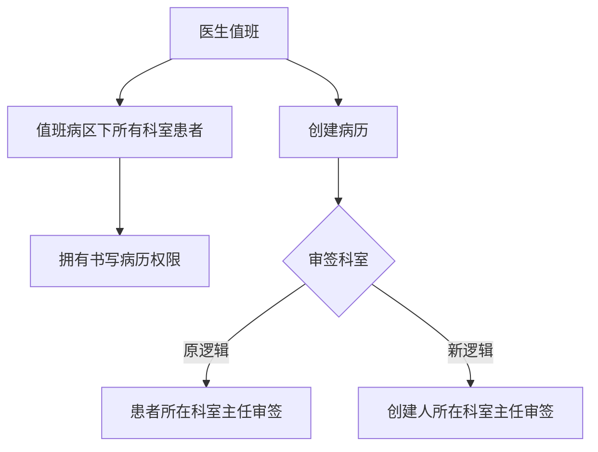
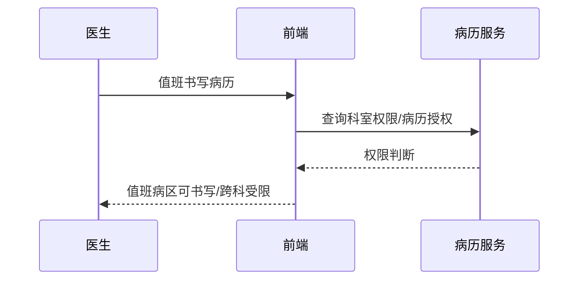

# BLGL-04-QXGL-006 科室病区权限管理 - Spec

> **功能编号**：BLGL-04-QXGL-006
> **文档类型**：功能Spec（业务背景与设计）
> **文档版本**：V1.0
> **编写时间**：2026-08-15
> **编写人**：RACC

---

## 文档索引

#### 章节索引

**Spec（研发视角）**

| 章节号 | 章节名称 | 内容说明 |
|--------|---------|---------|
| 1、 | 文档概述 | 文档目的、文档范围、术语定义、阅读指南、参考文档 |
| 2、 | 功能背景与定位 | 功能背景、功能定位、目标用户、核心价值 |
| 3、 | 业务流程设计 | 主流程/异常流程/边界流程（Given/When/Then） |
| 4、 | 数据模型设计 | 核心数据结构、状态定义、系统参数定义 |
| 5、 | 接口契约设计 | API列表、接口详细设计、错误码定义 |
| 6、 | 技术方案设计 | 页面路径、技术栈、关键技术点、部署方案 |
| 7、 | 测试用例预设计 | 功能/边界/异常/性能测试用例 |
| 8、 | 非功能性要求 | 性能、安全、可用性、兼容性 |
| 9、 | 依赖与风险 | 外部依赖、风险项 |
| 10、 | 附录 | 流程图、时序图、参考文档 |

**PM-Spec（业务视角）**

| 章节号 | 章节名称 | 内容说明 |
|--------|---------|---------|
| 一 | 目标 | 功能定位与核心价值 |
| 二 | 约束 | 业务/技术/非功能性约束 |
| 三 | 验收标准 | 验收条件与验证方法 |
| 四 | 排除范围 | 本次不做项与明确边界 |
| 五 | 关键决策记录 | 方案决策与选型理由 |
| 六 | 优先级 | 优先级定义 |
| 七 | 关联文档 | 关联文档索引 |
| 附录 | 填写检查清单 | 质量检查 |

**Analyst-Spec（产品视角）**

| 章节号 | 章节名称 | 内容说明 |
|--------|---------|---------|
| 一 | 功能编号体系 | 功能编号与层级结构 |
| 二 | 核心业务流程 | 核心业务流程与时序 |
| 三 | 功能规格说明 | 详细功能规格与验收标准 |
| 四 | 排除范围 | 排除范围 |
| 五 | 业务规则清单 | 业务规则清单 |
| 六 | 关联文档 | 关联文档索引 |
| 七 | 待确认问题清单 | 待确认问题汇总 |
| - | 填写检查清单 | 质量检查 |

#### 版本历史

| 版本 | 日期 | 变更说明 | 编写人 |
|------|------|---------|--------|
| V1.0 | 2026-08-15 | 初始版本 | RACC |

#### 关联文档索引

| 序号 | 文档名称 | 文档类型 | 版本 | 位置 |
|------|---------|---------|------|------|
| 1 | BLGL-04-QXGL 权限管理功能点Spec.md | 功能点Spec（模块级） | V1.0 | 上级目录 |
| 2 | BLGL-04-QXGL-006_科室病区权限管理-Spec.md | 功能Spec（业务背景与设计）（本文档） | V1.0 | 本目录 |
| 3 | BLGL-04-QXGL-006_科室病区权限管理_Analyst-spec.md | Analyst-Spec（分析规格） | V1.0 | 本目录 |
| 4 | BLGL-04-QXGL-006_科室病区权限管理_PM-spec.md | PM-Spec（需求规格） | V0.1 | 本目录 |

---

## 1、文档概述

### 1.1、文档目的

本文档旨在明确"科室病区权限管理"功能（BLGL-04-QXGL-006）的业务背景与设计方案，为需求分析、研发实现、测试验收及评审提供统一的业务上下文、设计口径与决策依据。

**具体目的包括**：

1. 梳理科室病区权限管理功能的业务由来与历史需求演进脉络，说明"为什么要做"；
2. 明确功能的定位边界、目标用户与核心价值，回答"做成什么"；
3. 描述功能的业务流程、数据模型、接口契约与技术方案，回答"怎么做"；
4. 预设计测试用例并明确非功能性要求、依赖与风险，为研发与验收提供依据；
5. 作为 Analyst-Spec 的业务前提与设计输入，保证各层文档业务口径一致。

### 1.2、文档范围

#### 1.2.1 纳入范围

本文档覆盖科室病区权限管理的完整业务背景与设计，包括：

- 值班病区权限：医生值班时拥有值班病区下所有科室所有患者书写病历权限
- 审签科室规则：创建病历审签按创建人所在科室主任审签
- 转科历史病历权限：转科历史病历权限接口调用调整
- 跨科审签：跨科审签支持指定其他科室手术医生
- 科室权限表：INP_EMR_SET_DEPT_PERMISSION

#### 1.2.2 排除范围

本文档不涉及以下内容（详见其他功能点或模块）：

- 病历审签权限管理 —— BLGL-04-QXGL-001
- 规培生教学权限管理 —— BLGL-04-QXGL-002
- 分级访问控制 —— BLGL-04-QXGL-003
- 病历操作权限管理 —— BLGL-04-QXGL-004
- 角色职称权限管理 —— BLGL-04-QXGL-005
- 病历业务授权 —— BLGL-04-QXGL-007

### 1.3、术语定义

| 术语 | 定义 |
|------|------|
| 值班病区 | 医生值班时拥有值班病区下所有科室患者书写权限 |
| 审签科室 | 创建病历审签按创建人所在科室主任审签 |
| 转科历史病历权限 | 转科患者历史病历的访问/授权 |

### 1.4、阅读指南

- **章节关系**：第1~2章为业务全貌，第3~10章为设计实现层。与 Analyst-Spec、PM-Spec 互相引用保持一致。
- **读者对象**：产品经理/需求分析师读第1~2章；研发读第3~6、9~10章；测试读第3、7~8章；评审人员核对各层一致性。

### 1.5、参考文档

| 序号 | 文档名称 | 版本/日期 |
|------|---------|----------|
| 1 | 【历史需求】住院病历的历史需求.xlsx | - |
| 2 | BLGL-04-QXGL-006_科室病区权限管理_PM-spec.md | V0.1 |
| 3 | BLGL-04-QXGL-006_科室病区权限管理_Analyst-spec.md | V1.0 |
| 4 | BLGL-04-QXGL 权限管理功能点Spec.md | V1.0 |

---

## 2、功能背景与定位

### 2.1 功能背景

科室病区权限管理是权限管理模块的范围管控层（L2），需满足：

- **现状痛点**：医生值班时没有值班病区下所有科室患者书写权限；创建病历审签按患者所在科室主任审签而非创建人科室主任；转科科室无法对患者归档病历召回修改
- **管理要求**：医生值班时需要拥有值班病区下的所有科室的所有患者书写病历的权限
- **历史需求演进**：转科历史病历权限接口调用调整→ 值班病区权限→ 审签科室规则

### 2.2 功能定位

"科室病区权限管理"是 WiNEX 病历管理-权限管理的范围管控层，定位为：

- **值班权限**：值班病区下所有科室患者书写权限
- **审签科室**：按创建人科室审签规则
- **转科授权**：转科历史病历权限

### 2.3 目标用户

| 用户角色 | 主要使用场景 |
|---------|-------------|
| 住院医生 | 值班病区书写病历 |
| 上级医师 | 跨科审签 |
| 转科医生 | 转科历史病历修改 |

### 2.4 核心价值

| 价值维度 | 价值描述 |
|---------|---------|
| 值班协同 | 值班病区患者书写权限 |
| 审签准确 | 按创建人科室审签 |
| 转科可溯 | 转科历史病历权限 |

---

## 3、业务流程设计（Given/When/Then）

### 3.1 主流程

**Scenario 1: 值班病区权限**

```gherkin
Given:
  - 医生值班
  - 值班病区下多个科室

When:
  - 医生书写病历

Then:
  - 拥有值班病区下所有科室所有患者书写病历的权限
```

### 3.2 异常流程

**Scenario 2: 业务异常——值班权限缺失**

```gherkin
Given:
  - 医生值班

When:
  - 书写值班病区其他科室患者病历

Then:
  - 无书写权限（问题）
  - 需增加值班病区权限
```

**Scenario 3: 数据异常——审签科室错误**

```gherkin
Given:
  - 住院病历医生创建病历需要审签

When:
  - 计算审签人

Then:
  - 原逻辑按患者所在科室主任审签（问题）
  - 需调整为创建人所在科室主任审签
```

**Scenario 4: 系统异常——转科历史病历权限**

```gherkin
Given:
  - 患者转科

When:
  - 访问转科历史病历

Then:
  - 权限接口需调整
  - 授权来源代码入参/返回值需调整
```

### 3.3 边界流程

**Scenario 5: 边界——跨科审签**

```gherkin
Given:
  - 手术记录指定主刀医生审签
  - 主刀医生为其他科室医生

When:
  - 主刀医生跨科审签

Then:
  - 可审签其他科室病历
  - 转科审签 tab 支持
```

**Scenario 6: 边界——转科患者审签规则**

```gherkin
Given:
  - 患者从 A 科室转到 B 科室

When:
  - A 科室医生提交病历

Then:
  - 需要 A 科室的上级医生审签
  - 审签对象为提交病历的提交人所在科室的上级医生
```

---

## 4、数据模型设计

### 4.1 核心数据结构

#### 4.1.1 核心保存请求

| 字段名 | 类型 | 必填 | 备注 |
|--------|------|------|------|
| deptId | Long | 是 | 科室ID |
| wardId | Long | 是 | 病区ID |

> ⏳ 待确认：科室病区权限接口完整入参/出参以 API 契约为准。

#### 4.1.2 核心表/实体

| 表/实体 | 关键字段 | 说明 |
|---------|---------|------|
| INP_EMR_SET_DEPT_PERMISSION（InpatientEmrSubjectRelPO） | inpEmrSetDeptPermissionId、inpRrdPermissionId、inpEmrSetId、inpEmrSetPermissionCode | 病历科室权限表 |
| INP_RHB_RECORD_DEPT_PERMISSION（InpatientSubjectLimitPO） | inpRrdPermissionId、inpRhbRecordId、deptId/Name、wardId/Name、bedNo、inpEmrSetPermissionCode | 病历簿科室权限表 |

### 4.2 状态定义

| ⏳ 待确认 | 科室病区权限无独立状态 | 依赖科室/病区权限 |

### 4.3 系统参数定义

| 参数编码 | 参数名称 | 说明 |
|---------|---------|------|
| - | 值班病区权限 | 值班病区下所有科室患者权限 |

---

## 5、接口契约设计

### 5.1 API列表

| 序号 | API名称（代码函数） | 路径 | 方法 | 说明 |
|:----:|---------|------|:----:|------|
| 1 | 查询用户病历的编辑权限 | /api/v1/app_record_inpatient/emr_inpatient/emr_permission/query/by_example | POST | 病历编辑权限 |
| 2 | 查询病历授权信息 | /api/v1/app_record_inpatient/inpatient_record_emr/query_inpat_enc_authorization | POST | 病历授权（入参 InpatEncAuthorizationInputAO） |

### 5.2 接口详细设计

#### 5.2.1 查询病历授权信息（query_inpat_enc_authorization）

**请求参数**:
```json
{
  "inpRhbRecordId": "12345",
  "encounterId": "12345"
}
```

**返回值（成功）**:
```json
{
  "success": true,
  "data": {
    "authorizationList": []
  }
}
```

> ⏳ 待确认：科室病区权限接口字段以代码扫描（InpatEncAuthorizationOutputVO）和 API 契约为准。

**返回值（失败）**:
```json
{
  "success": false,
  "message": "无科室权限",
  "data": null
}
```

### 5.3 错误码定义

| 错误码 | 错误信息 | 处理方式 |
|--------|---------|---------|
| ⏳ 待确认 | 无科室权限 | 提示授权 |

---

## 6、技术方案设计

### 6.1 页面路径

- **页面路径**: 住院医生站→患者床位卡→住院病历菜单（值班病区判断）
- **后端模块**: winning-emr-ipt-emrset/.../controller/InpatientEmrRecordController.java（emr_permission/query、query_inpat_enc_authorization）
- **前端 API**: src/api/global.js queryAuthorizationPermission → query_inpat_enc_authorization

### 6.2 技术栈

| 类别 | 技术 | 版本 |
|------|------|------|
| 前端框架 | Vue | 2.6.14 |
| 前端UI | element-ui | 2.13.0 |
| 后端框架 | Spring Boot（Java 17）+ JPA/Hibernate | - |
| RPC | winning-akso-rpc-rest | - |

### 6.3 关键技术点

- 值班病区权限：值班时拥有值班病区下所有科室所有患者书写病历权限
- 审签科室规则：审签对象为提交病历的提交人所在科室的上级医生
- 转科历史病历权限：就诊域治疗授权接口调整，增加授权来源代码入参/返回值

### 6.4 部署方案

⏳ 待确认：部署方案未在资料区中找到。

---

## 7、测试用例预设计

### 7.1 功能测试

| 用例编号 | 测试场景 | Given | When | Then |
|---------|---------|-------|------|------|
| TC-001 | 值班病区权限 | 医生值班 | 书写值班病区病历 | 有书写权限 |

### 7.2 边界测试

| 用例编号 | 测试场景 | Given | When | Then |
|---------|---------|-------|------|------|
| TC-002 | 转科患者审签 | 患者从A转B | A科室医生提交 | A科室上级审签 |

### 7.3 异常测试

| 用例编号 | 测试场景 | Given | When | Then |
|---------|---------|-------|------|------|
| TC-003 | 值班权限缺失 | 医生值班 | 书写其他科室病历 | 无权限（问题） |

### 7.4 性能测试

| 用例编号 | 测试场景 | 指标 |
|---------|---------|------|
| TC-004 | 科室权限查询 | ⏳ 待确认：性能指标未在资料区中找到 |

---

## 8、非功能性要求

### 8.1 性能要求

| 指标 | 要求 |
|------|------|
| 科室权限查询响应时间 | ⏳ 待确认 |

### 8.2 安全要求

| 要求 | 说明 |
|------|------|
| 科室权限 | 病历科室权限表控制 |
| 值班权限 | 值班病区权限 |

**医疗行业特殊要求**

| 要求 | 说明 |
|------|------|
| 审签合规 | 审签按创建人科室 |

### 8.3 可用性要求

| 指标 | 要求值 |
|------|--------|
| 可用性 | ⏳ 待确认 |

### 8.4 兼容性要求

| 类型 | 要求 |
|------|------|
| 科室/病区 | 值班病区/转科兼容 |
| 审签范围 | 本科室/跨科审签兼容 |

---

## 9、依赖与风险

### 9.1 外部依赖

| 依赖项 | 说明 |
|--------|------|
| 就诊域 | 转科历史病历授权接口 |

### 9.2 风险项

| 风险项 | 等级 | 说明 | 应对方案 |
|--------|------|------|---------|
| 值班权限缺失 | 中 | 值班医生无法书写其他科室病历 | 增加值班病区权限 |
| 审签科室错误 | 中 | 审签人计算错误 | 按创建人科室 |

---

## 10、附录

### 10.1 流程图



### 10.2 时序图



### 10.3 参考文档

- 【历史需求】住院病历的历史需求.xlsx（2、1528870、1422903、1646093、1648500、1327900）
- BLGL-04-QXGL 权限管理功能点Spec.md（V1.0，第5章 BLGL-04-QXGL-006 行）
- 关联Spec: BLGL-04-QXGL-006_科室病区权限管理_PM-spec.md、BLGL-04-QXGL-006_科室病区权限管理_Analyst-spec.md

---

## 填写检查清单

| 序号 | 检查项 | 是否完成 |
|:----:|--------|:--------:|
| 1 | 章节索引与正文章节一致 | ✅ |
| 2 | 版本历史记录完整 | ✅ |
| 3 | 关联文档索引已登记全部Spec | ✅ |
| 4 | 文档目的明确回答"为什么做/做成什么/怎么做" | ✅ |
| 5 | 纳入范围/排除范围清晰 | ✅ |
| 6 | 术语定义覆盖关键概念，从资料区可溯源 | ✅ |
| 7 | 参考文档已登记 | ✅ |
| 8 | 功能背景基于法规/规范/需求来源组织 | ✅ |
| 9 | 功能定位体现业务价值（3~5个定位点） | ✅ |
| 10 | 目标用户角色覆盖完整，在需求原文中有出处 | ✅ |
| 11 | 核心价值可陈述，与 Phase 1 口径一致 | ✅ |
| 12 | 业务流程：主流程≥1、异常≥3、边界≥2，Given/When/Then 具体 | ✅ |
| 13 | 数据模型：字段/表/状态/参数可溯源 | ✅ |
| 14 | 接口契约：API列表+详细设计+错误码齐全或标记待确认 | ✅ |
| 15 | 技术方案：页面路径/技术栈/关键点/部署方案或标记待确认 | ✅ |
| 16 | 测试用例：功能/边界/异常/性能覆盖 | ✅ |
| 17 | 非功能性要求：性能/安全/可用性/兼容性指标可量化或标记待确认 | ✅ |
| 18 | 依赖与风险：外部依赖登记完整 | ✅ |
| 19 | 附录：流程图/时序图与正文流程一致 | ✅ |
| 20 | 全文无占位符 `< >` 残留 | ✅ |
| 21 | 全文陈述可溯源至资料区 | ✅ |
| 22 | 人工审核确认完成 | ⏳ 待确认 |

---

**文档状态**：⬜ 待审核
**维护责任**：RACC
**下次更新**：根据评审反馈优化
