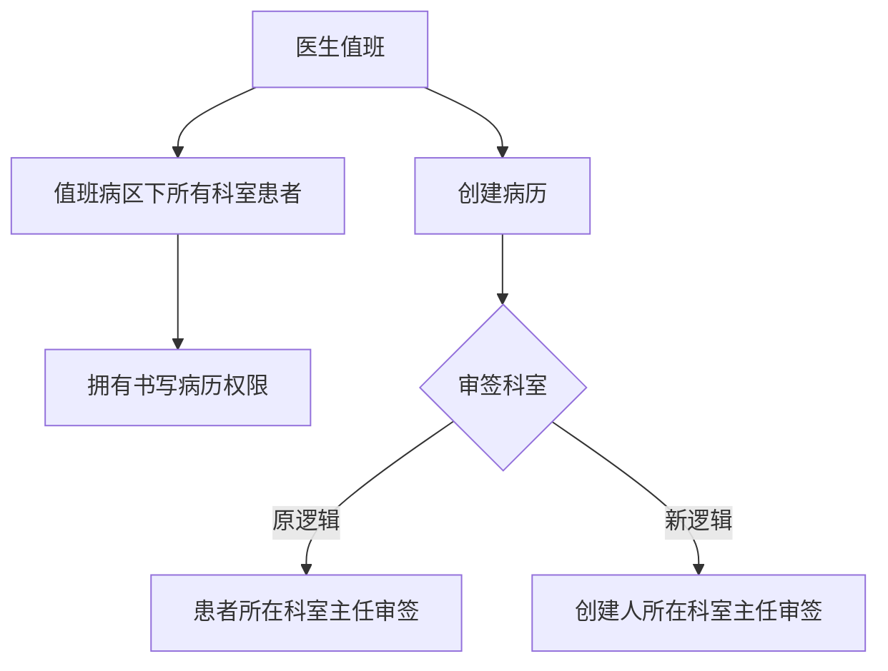
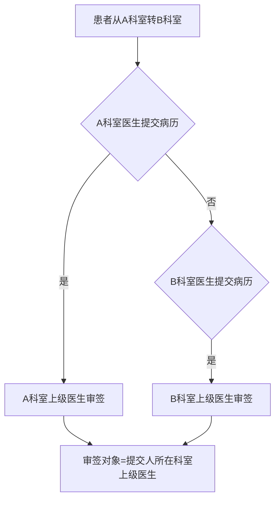

# BLGL-04-QXGL-006 科室病区权限管理 _ Analyst - Spec

> **需求编号**：BLGL-04-QXGL-006
> **父需求**：BLGL-04-QXGL
> **关联PM Spec**：BLGL-04-QXGL-006_科室病区权限管理_PM-spec.md
> **Spec版本**：V1.0
> **编写时间**：2026-08-15
> **编写人**：需求分析师

---

## 一、功能编号体系

### 1.1 功能层级结构

```
BLGL-04-QXGL-006-001: 值班病区权限
  ├─ BLGL-04-QXGL-006-001-01: 值班病区书写权限
  └─ BLGL-04-QXGL-006-001-02: 值班病区所有科室患者

BLGL-04-QXGL-006-002: 审签科室规则
  ├─ BLGL-04-QXGL-006-002-01: 创建人科室审签
  └─ BLGL-04-QXGL-006-002-02: 转科审签规则

BLGL-04-QXGL-006-003: 转科历史病历权限
  ├─ BLGL-04-QXGL-006-003-01: 转科授权接口调整
  └─ BLGL-04-QXGL-006-003-02: 授权来源代码

BLGL-04-QXGL-006-004: 跨科审签
  └─ BLGL-04-QXGL-006-004-01: 跨科审签支持
```

### 1.2 功能编号表

| REQ-ID | 功能名称 | 类型 | 优先级 | 说明 |
|--------|---------|------|--------|------|
| BLGL-04-QXGL-006-001 | 值班病区权限 | 功能 | P0 | 值班权限 |
| BLGL-04-QXGL-006-001-01 | 值班病区书写权限 | 子功能 | P0 | 值班病区书写 |
| BLGL-04-QXGL-006-001-02 | 值班病区所有科室患者 | 子功能 | P0 | 所有科室 |
| BLGL-04-QXGL-006-002 | 审签科室规则 | 功能 | P0 | 审签科室 |
| BLGL-04-QXGL-006-002-01 | 创建人科室审签 | 子功能 | P0 | 创建人科室主任 |
| BLGL-04-QXGL-006-002-02 | 转科审签规则 | 子功能 | P0 | 提交人科室上级审签 |
| BLGL-04-QXGL-006-003 | 转科历史病历权限 | 功能 | P1 | 转科授权 |
| BLGL-04-QXGL-006-003-01 | 转科授权接口调整 | 子功能 | P1 | 就诊域接口 |
| BLGL-04-QXGL-006-003-02 | 授权来源代码 | 子功能 | P1 | 授权类型代码 |
| BLGL-04-QXGL-006-004 | 跨科审签 | 功能 | P1 | 跨科审签 |
| BLGL-04-QXGL-006-004-01 | 跨科审签支持 | 子功能 | P1 | 指定其他科室医生 |

---

## 二、核心业务流程

### 2.1 值班病区权限流程



### 2.2 转科审签规则流程



---

## 三、功能规格说明

### BLGL-04-QXGL-006-001: 值班病区权限

#### 3.1.1 功能概述

深圳前海泰康：医生值班时，需要拥有值班病区下的所有科室的所有患者书写病历的权限。

#### 3.1.2 用户角色

| 角色 | 使用场景 | 权限要求 | 操作频率 |
|------|---------|---------|---------|
| 住院医生 | 值班书写病历 | 值班病区权限 | 高频 |

#### 3.1.3 业务流程（Given/When/Then）

**Scenario 1: 值班病区权限（主流程）**

```gherkin
Given:
  - 医生值班
  - 值班病区下多个科室

When:
  - 医生书写病历

Then:
  - 拥有值班病区下所有科室所有患者书写病历的权限
```

**Scenario 2: 异常——值班权限缺失**

```gherkin
Given:
  - 医生值班

When:
  - 书写值班病区其他科室患者病历

Then:
  - 无书写权限（问题）
  - 需增加值班病区权限
```

#### 3.1.4 数据字段定义

| 字段名 | 类型 | 必填 | 默认值 | 取值范围 | 说明 | 概念ID |
|--------|------|------|--------|---------|------|--------|
| 值班病区 | String | 是 | - | - | 值班病区 | ⏳ 待确认 |
| 科室 | String | 是 | - | 值班病区下科室 | 值班权限范围 | ⏳ 待确认 |

#### 3.1.5 验收标准

| AC编号 | 验收标准 | 对应REQ-ID | 验证方法 | 验证场景 |
|--------|---------|-----------|---------|---------|
| AC-001 | 值班病区下所有科室患者书写病历权限生效 | BLGL-04-QXGL-006-001 | 功能测试 | Scenario 1 |

---

### BLGL-04-QXGL-006-002: 审签科室规则

#### 3.2.1 功能概述

住院病历医生创建病历需要审签时目前是按照创建病历时患者所在科室的时间来算，审签人是创建病历时患者所在科室的主任，现需要调整为创建病历的创建人所在科室的主任审签。转科场景：A 科室医生提交的病历需要 A 科室上级医生审签，B 科室医生提交的需要 B 科室上级医生审签。判断上级审签范围的规则：审签对象为提交病历的提交人所在科室的上级医生，且科室为提交病历的科室。

#### 3.2.2 用户角色

| 角色 | 使用场景 | 权限要求 | 操作频率 |
|------|---------|---------|---------|
| 住院医生 | 创建病历提交 | 病历书写权限 | 高频 |
| 上级医师 | 审签 | 审签权限 | 高频 |

#### 3.2.3 业务流程（Given/When/Then）

**Scenario 1: 创建人科室审签（主流程）**

```gherkin
Given:
  - 住院病历医生创建病历需要审签

When:
  - 计算审签人

Then:
  - 审签人为创建病历的创建人所在科室的主任
```

**Scenario 2: 转科审签规则**

```gherkin
Given:
  - 患者从A科室转到B科室

When:
  - A科室医生提交病历

Then:
  - 需要A科室的上级医生审签
  - 审签对象为提交病历的提交人所在科室的上级医生
```

#### 3.2.4 数据字段定义

| ⏳ 待确认 | 审签科室规则无独立数据字段 | 依赖审签流程 |

#### 3.2.5 验收标准

| AC编号 | 验收标准 | 对应REQ-ID | 验证方法 | 验证场景 |
|--------|---------|-----------|---------|---------|
| AC-002 | 审签人按创建人科室主任计算，而非患者所在科室 | BLGL-04-QXGL-006-002 | 功能测试 | Scenario 1 |
| AC-003 | 转科患者病历由提交人科室上级审签 | BLGL-04-QXGL-006-002 | 功能测试 | Scenario 2 |

---

### BLGL-04-QXGL-006-003: 转科历史病历权限

#### 3.3.1 功能概述

转科历史病历授权接口调用调整：就诊域治疗授权接口进行了调整以适应不同授权场景，增加了授权来源代码的入参及返回值（详见），因此转科历史病历授权接口需进行调整。授权来源代码来自术语：授权类型代码：病历授权。

#### 3.3.2 用户角色

| 角色 | 使用场景 | 权限要求 | 操作频率 |
|------|---------|---------|---------|
| 转科医生 | 访问转科历史病历 | 转科授权 | 中频 |

#### 3.3.3 业务流程（Given/When/Then）

**Scenario 1: 转科历史病历权限（主流程）**

```gherkin
Given:
  - 患者转科
  - 就诊域治疗授权接口调整

When:
  - 访问转科历史病历

Then:
  - 转科历史病历授权接口调整
  - 增加授权来源代码入参/返回值
  - 授权来源代码=病历授权
```

#### 3.3.4 数据字段定义

| 字段名 | 类型 | 必填 | 默认值 | 取值范围 | 说明 | 概念ID |
|--------|------|------|--------|---------|------|--------|
| 授权来源代码 | String | 是 | - | 病历授权 | 授权类型代码 | ⏳ 待确认 |

#### 3.3.5 验收标准

| AC编号 | 验收标准 | 对应REQ-ID | 验证方法 | 验证场景 |
|--------|---------|-----------|---------|---------|
| AC-004 | 转科历史病历授权接口调整（授权来源代码）生效 | BLGL-04-QXGL-006-003 | 集成测试 | Scenario 1 |

---

### BLGL-04-QXGL-006-004: 跨科审签

#### 3.4.1 功能概述

跨科审签功能支持指定其他科室手术医生。手术记录指定主刀医生审签时，部分主刀医生为其他科室医生，没有患者所在科室权限，无法查询到审签任务进行审签。

#### 3.4.2 用户角色

| 角色 | 使用场景 | 权限要求 | 操作频率 |
|------|---------|---------|---------|
| 手术医生 | 跨科审签 | 指定医师审签模式 | 中频 |

#### 3.4.3 业务流程（Given/When/Then）

**Scenario 1: 跨科审签（主流程）**

```gherkin
Given:
  - 手术记录指定主刀医生审签
  - 主刀医生为其他科室医生

When:
  - 主刀医生跨科审签

Then:
  - 可审签其他科室病历
  - 转科审签 tab 支持
```

#### 3.4.4 数据字段定义

| ⏳ 待确认 | 跨科审签无独立数据字段 | 依赖审签模式 |

#### 3.4.5 验收标准

| AC编号 | 验收标准 | 对应REQ-ID | 验证方法 | 验证场景 |
|--------|---------|-----------|---------|---------|
| AC-005 | 跨科审签支持指定其他科室手术医生 | BLGL-04-QXGL-006-004 | 功能测试 | Scenario 1 |

---

## 四、排除范围

本需求不包含以下功能项：

1. **病历审签权限管理** —— BLGL-04-QXGL-001
2. **规培生教学权限管理** —— BLGL-04-QXGL-002
3. **分级访问控制** —— BLGL-04-QXGL-003
4. **病历操作权限管理** —— BLGL-04-QXGL-004
5. **角色职称权限管理** —— BLGL-04-QXGL-005
6. **病历业务授权** —— BLGL-04-QXGL-007

---

## 五、业务规则清单

| 规则ID | 规则名称 | 规则描述 | 来源 | 优先级 |
|--------|---------|---------|------|--------|
| BR-001 | 值班病区权限 | 医生值班时拥有值班病区下所有科室患者书写病历权限 |  | P0 |
| BR-002 | 审签科室 | 审签人为创建病历的创建人所在科室的主任 |  | P0 |
| BR-003 | 转科审签 | 转科患者病历由提交人科室上级医生审签 |  | P0 |
| BR-004 | 转科授权 | 转科历史病历授权接口增加授权来源代码 |  | P1 |
| BR-005 | 跨科审签 | 跨科审签支持指定其他科室手术医生 |  | P1 |

---

## 六、关联文档

| 文档类型 | 文档路径 | 说明 |
|---------|---------|------|
| 功能点Spec（模块级） | 上级目录 BLGL-04-QXGL 权限管理功能点Spec.md（V1.0） | 模块级功能点索引 |
| 功能Spec（业务背景与设计） | 本目录 BLGL-04-QXGL-006_科室病区权限管理-Spec.md（V1.0） | 业务背景与目标 Spec |
| Analyst-Spec（分析规格） | 本目录 BLGL-04-QXGL-006_科室病区权限管理_Analyst-spec.md（V1.0）（本文档） | 分析规格 |
| PM-Spec（需求规格） | 本目录 BLGL-04-QXGL-006_科室病区权限管理_PM-spec.md（V0.1） | PM 产出的 Spec 文档 |
| data-model.md | 待产出 | 架构师产出的数据建模文档 |
| design.md | 待产出 | 架构师产出的技术方案文档 |
| api-contract.md | 待产出 | 开发经理产出的 API 契约文档 |

---

## 七、待确认问题清单

| 编号 | 问题描述 | 缺失信息 | 影响范围 | 建议补充方 |
|------|---------|---------|---------|-----------|
| Q-001 | 科室病区权限接口完整字段 | API 契约 | -Spec 第5章 | 开发经理 |
| Q-002 | 值班病区权限参数概念 ID | 概念ID | 3.1.4 | 产品经理 |
| Q-003 | 转科授权接口（就诊域）字段 | 需求分析原文缺失 | 3.3.3 | 需求分析师 |
| Q-004 | 跨科审签查询逻辑细节 | 需求分析原文缺失 | 3.4.3 | 需求分析师 |
| Q-005 | 性能指标（科室权限查询响应时间） | 资料区无量化指标 | -Spec 第8章 | 产品经理 |

---

## 填写检查清单

| 序号 | 检查项 | 是否完成 |
|:----:|--------|:--------:|
| 1 | 功能编号带父子层级 | ✅ |
| 2 | 每个 REQ-ID 有功能概述和用户角色 | ✅ |
| 3 | 主流程至少 1 个 Given/When/Then 场景 | ✅ |
| 4 | 异常流程至少 3 个 Given/When/Then 场景 | ✅ |
| 5 | 边界流程至少 2 个 Given/When/Then 场景 | ✅ |
| 6 | 每个 Given/When/Then 内容具体，不模糊 | ✅ |
| 7 | 数据字段定义完整（字段名、类型、必填、说明、概念ID） | ✅ |
| 8 | 验收标准 AC 编号独立，可验证 | ✅ |
| 9 | 验收标准无"功能正常"等模糊表述 | ✅ |
| 10 | 排除范围明确列出 | ✅ |
| 11 | 业务规则清单列出所有规则，每条标注来源 | ✅ |
| 12 | 流程图使用 Mermaid 格式（≥2 个） | ✅ |
| 13 | 关联文档索引包含 Phase 1 功能点Spec | ✅ |
| 14 | 待确认问题清单汇总了全文所有 ⏳ 项 | ✅ |
| 15 | 全文无占位符 `< >` 残留 | ✅ |
| 16 | 全文陈述可溯源至资料区（S1~S10 溯源核查） | ✅ |
| 17 | 人工审核确认完成 | ⏳ 待确认 |

---

**文档状态**：⬜ 待审核
**维护责任**：需求分析师规范组
**下次更新**：根据评审反馈优化

---

## 版本历史

| 版本 | 日期 | 变更说明 | 编写人 |
|------|------|---------|--------|
| V1.0 | 2026-08-15 | 初始版本 | 需求分析师 |
