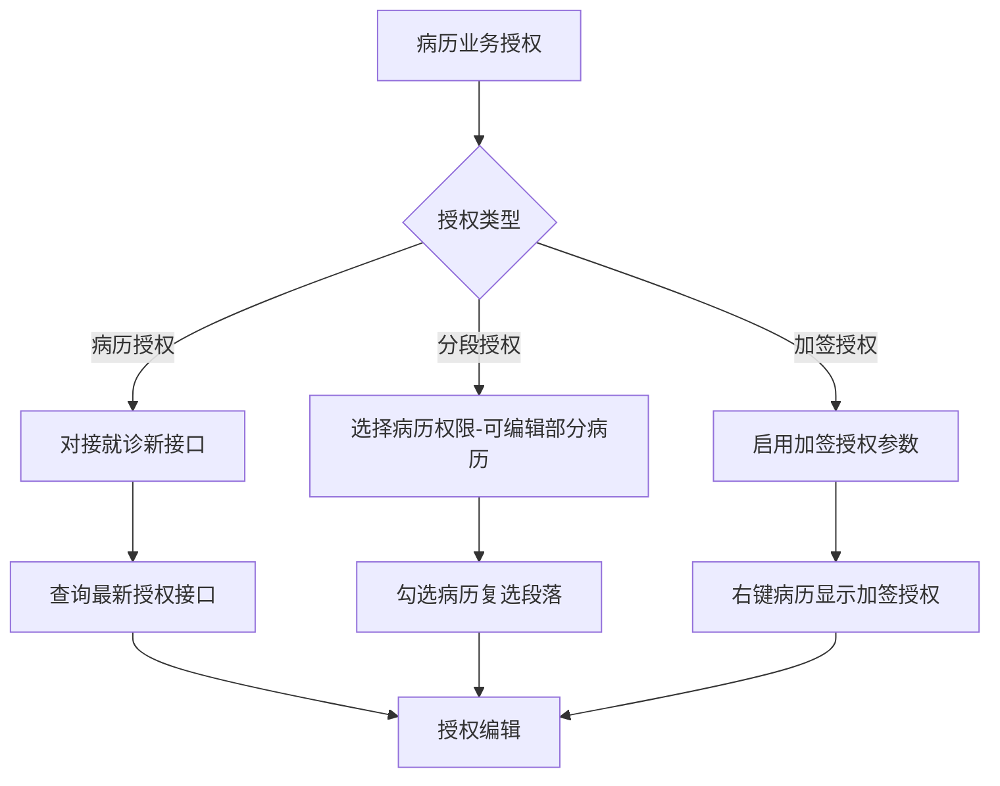
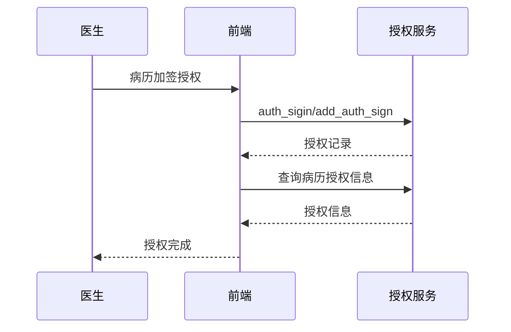

# BLGL-04-QXGL-007 病历业务授权 - Spec

> **功能编号**：BLGL-04-QXGL-007
> **文档类型**：功能Spec（业务背景与设计）
> **文档版本**：V1.0
> **编写时间**：2026-08-15
> **编写人**：RACC

---

## 文档索引

#### 章节索引

**Spec（研发视角）**

| 章节号 | 章节名称 | 内容说明 |
|--------|---------|---------|
| 1、 | 文档概述 | 文档目的、文档范围、术语定义、阅读指南、参考文档 |
| 2、 | 功能背景与定位 | 功能背景、功能定位、目标用户、核心价值 |
| 3、 | 业务流程设计 | 主流程/异常流程/边界流程（Given/When/Then） |
| 4、 | 数据模型设计 | 核心数据结构、状态定义、系统参数定义 |
| 5、 | 接口契约设计 | API列表、接口详细设计、错误码定义 |
| 6、 | 技术方案设计 | 页面路径、技术栈、关键技术点、部署方案 |
| 7、 | 测试用例预设计 | 功能/边界/异常/性能测试用例 |
| 8、 | 非功能性要求 | 性能、安全、可用性、兼容性 |
| 9、 | 依赖与风险 | 外部依赖、风险项 |
| 10、 | 附录 | 流程图、时序图、参考文档 |

**PM-Spec（业务视角）**

| 章节号 | 章节名称 | 内容说明 |
|--------|---------|---------|
| 一 | 目标 | 功能定位与核心价值 |
| 二 | 约束 | 业务/技术/非功能性约束 |
| 三 | 验收标准 | 验收条件与验证方法 |
| 四 | 排除范围 | 本次不做项与明确边界 |
| 五 | 关键决策记录 | 方案决策与选型理由 |
| 六 | 优先级 | 优先级定义 |
| 七 | 关联文档 | 关联文档索引 |
| 附录 | 填写检查清单 | 质量检查 |

**Analyst-Spec（产品视角）**

| 章节号 | 章节名称 | 内容说明 |
|--------|---------|---------|
| 一 | 功能编号体系 | 功能编号与层级结构 |
| 二 | 核心业务流程 | 核心业务流程与时序 |
| 三 | 功能规格说明 | 详细功能规格与验收标准 |
| 四 | 排除范围 | 排除范围 |
| 五 | 业务规则清单 | 业务规则清单 |
| 六 | 关联文档 | 关联文档索引 |
| 七 | 待确认问题清单 | 待确认问题汇总 |
| - | 填写检查清单 | 质量检查 |

#### 版本历史

| 版本 | 日期 | 变更说明 | 编写人 |
|------|------|---------|--------|
| V1.0 | 2026-08-15 | 初始版本 | RACC |

#### 关联文档索引

| 序号 | 文档名称 | 文档类型 | 版本 | 位置 |
|------|---------|---------|------|------|
| 1 | BLGL-04-QXGL 权限管理功能点Spec.md | 功能点Spec（模块级） | V1.0 | 上级目录 |
| 2 | BLGL-04-QXGL-007_病历业务授权-Spec.md | 功能Spec（业务背景与设计）（本文档） | V1.0 | 本目录 |
| 3 | BLGL-04-QXGL-007_病历业务授权_Analyst-spec.md | Analyst-Spec（分析规格） | V1.0 | 本目录 |
| 4 | BLGL-04-QXGL-007_病历业务授权_PM-spec.md | PM-Spec（需求规格） | V0.1 | 本目录 |

---

## 1、文档概述

### 1.1、文档目的

本文档旨在明确"病历业务授权"功能（BLGL-04-QXGL-007）的业务背景与设计方案，为需求分析、研发实现、测试验收及评审提供统一的业务上下文、设计口径与决策依据。

**具体目的包括**：

1. 梳理病历业务授权功能的业务由来与历史需求演进脉络，说明"为什么要做"；
2. 明确功能的定位边界、目标用户与核心价值，回答"做成什么"；
3. 描述功能的业务流程、数据模型、接口契约与技术方案，回答"怎么做"；
4. 预设计测试用例并明确非功能性要求、依赖与风险，为研发与验收提供依据；
5. 作为 Analyst-Spec 的业务前提与设计输入，保证各层文档业务口径一致。

### 1.2、文档范围

#### 1.2.1 纳入范围

本文档覆盖病历业务授权的完整业务背景与设计，包括：

- 病历授权接口对接：对接就诊的病历授权新接口
- 分段授权编辑：选择病历权限-可编辑部分病历、段落级授权
- 同级/下级加签授权：启用病历加签授权功能
- 病历授权信息查询：query_inpat_enc_authorization
- 病历起草者：inp_emr_set_authors 更新/查询

#### 1.2.2 排除范围

本文档不涉及以下内容（详见其他功能点或模块）：

- 病历审签权限管理 —— BLGL-04-QXGL-001
- 规培生教学权限管理 —— BLGL-04-QXGL-002
- 分级访问控制 —— BLGL-04-QXGL-003
- 病历操作权限管理 —— BLGL-04-QXGL-004
- 角色职称权限管理 —— BLGL-04-QXGL-005
- 科室病区权限管理 —— BLGL-04-QXGL-006

### 1.3、术语定义

| 术语 | 定义 |
|------|------|
| 病历授权 | 病历的访问/编辑授权 |
| 分段授权 | 选择病历权限-可编辑部分病历，段落级授权 |
| 加签授权 | 授权本科室同级和下级医生对某份病历进行签名 |

### 1.4、阅读指南

- **章节关系**：第1~2章为业务全貌，第3~10章为设计实现层。与 Analyst-Spec、PM-Spec 互相引用保持一致。
- **读者对象**：产品经理/需求分析师读第1~2章；研发读第3~6、9~10章；测试读第3、7~8章；评审人员核对各层一致性。

### 1.5、参考文档

| 序号 | 文档名称 | 版本/日期 |
|------|---------|----------|
| 1 | 【历史需求】住院病历的历史需求.xlsx | - |
| 2 | BLGL-04-QXGL-007_病历业务授权_PM-spec.md | V0.1 |
| 3 | BLGL-04-QXGL-007_病历业务授权_Analyst-spec.md | V1.0 |
| 4 | BLGL-04-QXGL 权限管理功能点Spec.md | V1.0 |

---

## 2、功能背景与定位

### 2.1 功能背景

病历业务授权是权限管理模块的授权协同层（L1），需满足：

- **现状痛点**：六级评级要求控制授权使用病历中的指定内容，但未支持段落级授权；同级/下级医生加签授权未支持
- **管理要求**：病历业务授权对接就诊新接口
- **历史需求演进**：病历业务授权对接就诊新接口→ 六级分段授权→ 同级/下级加签授权

### 2.2 功能定位

"病历业务授权"是 WiNEX 病历管理-权限管理的授权协同层，定位为：

- **授权接口**：对接就诊病历授权新接口
- **分段授权**：段落级授权编辑
- **加签授权**：同级/下级加签授权

### 2.3 目标用户

| 用户角色 | 主要使用场景 |
|---------|-------------|
| 病案管理员 | 病历业务授权配置 |
| 授权对象 | 授权编辑病历 |
| 上级医师 | 加签授权 |

### 2.4 核心价值

| 价值维度 | 价值描述 |
|---------|---------|
| 授权合规 | 六级分段授权 |
| 授权可溯 | 病历授权信息查询 |
| 协同授权 | 同级/下级加签授权 |

---

## 3、业务流程设计（Given/When/Then）

### 3.1 主流程

**Scenario 1: 病历业务授权对接**

```gherkin
Given:
  - 病历业务授权

When:
  - 对接就诊的病历授权新接口

Then:
  - 添加查询最新授权接口
  - /api/v1/inpatient_encounter/inpat_encounter_authorization_last/query/by_example
```

### 3.2 异常流程

**Scenario 2: 业务异常——分段授权**

```gherkin
Given:
  - 六级评级要求

When:
  - 在业务授权里选择病历权限-可编辑部分病历

Then:
  - 勾选病历，支持复选段落
  - 只授权编辑该病历下复选的段落部分
  - 授权对象打开病历只可编辑复选内容
```

**Scenario 3: 数据异常——加签授权未生效**

```gherkin
Given:
  - 参数"是否启用病历加签授权功能"=是

When:
  - 有权限的医生右键病历文件

Then:
  - 显示【病历加签授权】按钮
  - 可选择授权人（职称范围必须是医生）
```

**Scenario 4: 系统异常——授权接口**

```gherkin
Given:
  - 病历业务授权对接就诊新接口

When:
  - 调用授权接口

Then:
  - 授权接口需兼容新接口
  - 授权来源代码入参/返回值调整
```

### 3.3 边界流程

**Scenario 5: 边界——加签授权对象**

```gherkin
Given:
  - 参数启用病历加签授权功能

When:
  - 有权限的医生（病历最新修改人/可编辑病历的人）

Then:
  - 显示【病历加签授权】按钮
  - 授权人职称范围：医师/主治医师/副主任医师/主任医师
```

**Scenario 6: 边界——病历起草者**

```gherkin
Given:
  - 病历创建

When:
  - 查询/更新病历起草者

Then:
  - inp_emr_set_authors/update|query 生效
```

---

## 4、数据模型设计

### 4.1 核心数据结构

#### 4.1.1 核心保存请求

| 字段名 | 类型 | 必填 | 备注 |
|--------|------|------|------|
| inpEmrSetId | Long | 是 | 病历集ID |
| authStatus | Long | 是 | 授权状态 |
| authFromEmployeeId | Long | 是 | 授权人 |
| authToEmployeeId | Long | 是 | 被授权人 |

> ⏳ 待确认：病历业务授权接口完整入参/出参以 API 契约为准。

#### 4.1.2 核心表/实体

| 表/实体 | 关键字段 | 说明 |
|---------|---------|------|
| INPATIENT_EMR_SIGN_AUTH（InpatientEmrSignAuthPO） | inpatientEmrSignAuthId、inpatEmrSetId、encounterId、days(DAYS)、authStatus(AUTH_STATUS)、authReason(AUTH_REASON)、authFromEmployeeId、authToEmployeeId、expireTime(EXPIRE_TIME)、encDeptId | 授权加签表 |
| INP_EMR_SET_AUTHOR_RECORD（InpEmrSetAuthorsHistoryPO） | inpEmrSetAuthorRecordId、inpEmrSetId、inpEmrRecordId、fromBy | 病历起草者历史表 |

### 4.2 状态定义

| 状态码 | 状态名称 | 说明 |
|--------|---------|------|
| authStatus=399631413 | 未加签 | 加签状态 |
| authStatus=399631414 | 已加签 | 加签状态 |
| authStatus=399631415 | 超时未签 | 加签状态 |

### 4.3 系统参数定义

| 参数编码 | 参数名称 | 说明 |
|---------|---------|------|
| - | 是否启用病历加签授权功能 | 是/否，默认为否 |

---

## 5、接口契约设计

### 5.1 API列表

| 序号 | API名称（代码函数） | 路径 | 方法 | 说明 |
|:----:|---------|------|:----:|------|
| 1 | 查询病历授权加签记录 | /api/v1/app_record_inpatient/emr_inpatient/auth_sign/query/by_example | POST | 加签授权查询（入参 InpatientEmrSignAuthQueryInputAO） |
| 2 | 新增病历授权加签记录 | /api/v1/app_record_inpatient/emr_inpatient/auth_sigin/add_auth_sign | POST | 加签授权新增（入参 InpatientEmrSignAuthInputAO） |
| 3 | 查询病历授权信息 | /api/v1/app_record_inpatient/inpatient_record_emr/query_inpat_enc_authorization | POST | 病历授权查询（入参 InpatEncAuthorizationInputAO） |
| 4 | 更新病历起草者 | /api/v1/app_record_inpatient/inp_emr_set_authors/update/by_inp_emr_set_id | POST | 起草者更新 |
| 5 | 查询病历起草者 | /api/v1/app_record_inpatient/inp_emr_set_authors/query/by_inp_emr_set_id | POST | 起草者查询 |

### 5.2 接口详细设计

#### 5.2.1 新增病历授权加签记录（auth_sigin/add_auth_sign）

**请求参数**:
```json
{
  "inpatEmrSetId": "12345",
  "authFromEmployeeId": "1001",
  "authToEmployeeId": "1002",
  "days": 3,
  "authReason": "手术协作",
  "expireTime": "2026-08-18 10:00:00"
}
```

**返回值（成功）**:
```json
{
  "success": true,
  "data": {
    "inpatientEmrSignAuthId": "67890"
  }
}
```

> ⏳ 待确认：病历业务授权接口字段以代码扫描（InpatientEmrSignAuthInputAO）和 API 契约为准。

**返回值（失败）**:
```json
{
  "success": false,
  "message": "授权加签失败",
  "data": null
}
```

### 5.3 错误码定义

| 错误码 | 错误信息 | 处理方式 |
|--------|---------|---------|
| ⏳ 待确认 | 授权加签失败 | 提示授权失败 |

---

## 6、技术方案设计

### 6.1 页面路径

- **页面路径**: 住院医生站→病历簿右键【病历加签授权】；业务授权配置
- **后端模块**: winning-emr-ipt-manage/.../controller/EmrAuthSignController.java（auth_sign/query、auth_sigin/add_auth_sign）+ InpatientEmrRecordController.java（query_inpat_enc_authorization）
- **前端 API**: src/pages/EmrMenuActions/api/index.js addCounterSignToEmr → auth_sigin/add_auth_sign、queryCounterSignDocList → mdm_employee_query/query_auth_sigin_employee；src/api/global.js queryAuthorizationPermission → query_inpat_enc_authorization

### 6.2 技术栈

| 类别 | 技术 | 版本 |
|------|------|------|
| 前端框架 | Vue | 2.6.14 |
| 前端UI | element-ui | 2.13.0 |
| 后端框架 | Spring Boot（Java 17）+ JPA/Hibernate | - |
| RPC | winning-akso-rpc-rest | - |

### 6.3 关键技术点

- 病历业务授权对接就诊新接口：添加查询最新授权接口 inpat_encounter_authorization_last/query
- 分段授权：业务授权选择病历权限-可编辑部分病历，支持复选段落
- 加签授权：参数启用后显示【病历加签授权】按钮，授权人职称范围必须是医生

### 6.4 部署方案

⏳ 待确认：部署方案未在资料区中找到。

---

## 7、测试用例预设计

### 7.1 功能测试

| 用例编号 | 测试场景 | Given | When | Then |
|---------|---------|-------|------|------|
| TC-001 | 病历加签授权 | 参数启用 | 右键病历文件 | 显示【病历加签授权】按钮 |

### 7.2 边界测试

| 用例编号 | 测试场景 | Given | When | Then |
|---------|---------|-------|------|------|
| TC-002 | 分段授权 | 六级评级 | 选择可编辑部分病历 | 支持复选段落 |

### 7.3 异常测试

| 用例编号 | 测试场景 | Given | When | Then |
|---------|---------|-------|------|------|
| TC-003 | 授权加签接口 | 加签授权 | 调用 auth_sigin/add_auth_sign | 返回授权记录ID |

### 7.4 性能测试

| 用例编号 | 测试场景 | 指标 |
|---------|---------|------|
| TC-004 | 病历授权查询 | ⏳ 待确认：性能指标未在资料区中找到 |

---

## 8、非功能性要求

### 8.1 性能要求

| 指标 | 要求 |
|------|------|
| 病历授权查询响应时间 | ⏳ 待确认 |

### 8.2 安全要求

| 要求 | 说明 |
|------|------|
| 授权合规 | 授权编辑病历指定内容 |
| 加签授权 | 授权人职称范围必须是医生 |

**医疗行业特殊要求**

| 要求 | 说明 |
|------|------|
| 授权合规 | 六级分段授权控制 |

### 8.3 可用性要求

| 指标 | 要求值 |
|------|--------|
| 可用性 | ⏳ 待确认 |

### 8.4 兼容性要求

| 类型 | 要求 |
|------|------|
| 授权接口 | 对接就诊新接口 |
| 加签范围 | 同级/下级医生加签 |

---

## 9、依赖与风险

### 9.1 外部依赖

| 依赖项 | 说明 |
|--------|------|
| 就诊域 | 病历授权接口 |

### 9.2 风险项

| 风险项 | 等级 | 说明 | 应对方案 |
|--------|------|------|---------|
| 授权接口兼容 | 中 | 就诊新接口兼容 | 接口调整 |
| 加签越权 | 中 | 授权人职称范围 | 职称校验 |

---

## 10、附录

### 10.1 流程图



### 10.2 时序图



### 10.3 参考文档

- 【历史需求】住院病历的历史需求.xlsx（0、1662007、1284524、794601、519607、1591120、1297054、1319098、1328797）
- BLGL-04-QXGL 权限管理功能点Spec.md（V1.0，第5章 BLGL-04-QXGL-007 行）
- 关联Spec: BLGL-04-QXGL-007_病历业务授权_PM-spec.md、BLGL-04-QXGL-007_病历业务授权_Analyst-spec.md

---

## 填写检查清单

| 序号 | 检查项 | 是否完成 |
|:----:|--------|:--------:|
| 1 | 章节索引与正文章节一致 | ✅ |
| 2 | 版本历史记录完整 | ✅ |
| 3 | 关联文档索引已登记全部Spec | ✅ |
| 4 | 文档目的明确回答"为什么做/做成什么/怎么做" | ✅ |
| 5 | 纳入范围/排除范围清晰 | ✅ |
| 6 | 术语定义覆盖关键概念，从资料区可溯源 | ✅ |
| 7 | 参考文档已登记 | ✅ |
| 8 | 功能背景基于法规/规范/需求来源组织 | ✅ |
| 9 | 功能定位体现业务价值（3~5个定位点） | ✅ |
| 10 | 目标用户角色覆盖完整，在需求原文中有出处 | ✅ |
| 11 | 核心价值可陈述，与 Phase 1 口径一致 | ✅ |
| 12 | 业务流程：主流程≥1、异常≥3、边界≥2，Given/When/Then 具体 | ✅ |
| 13 | 数据模型：字段/表/状态/参数可溯源 | ✅ |
| 14 | 接口契约：API列表+详细设计+错误码齐全或标记待确认 | ✅ |
| 15 | 技术方案：页面路径/技术栈/关键点/部署方案或标记待确认 | ✅ |
| 16 | 测试用例：功能/边界/异常/性能覆盖 | ✅ |
| 17 | 非功能性要求：性能/安全/可用性/兼容性指标可量化或标记待确认 | ✅ |
| 18 | 依赖与风险：外部依赖登记完整 | ✅ |
| 19 | 附录：流程图/时序图与正文流程一致 | ✅ |
| 20 | 全文无占位符 `< >` 残留 | ✅ |
| 21 | 全文陈述可溯源至资料区 | ✅ |
| 22 | 人工审核确认完成 | ⏳ 待确认 |

---

**文档状态**：⬜ 待审核
**维护责任**：RACC
**下次更新**：根据评审反馈优化
