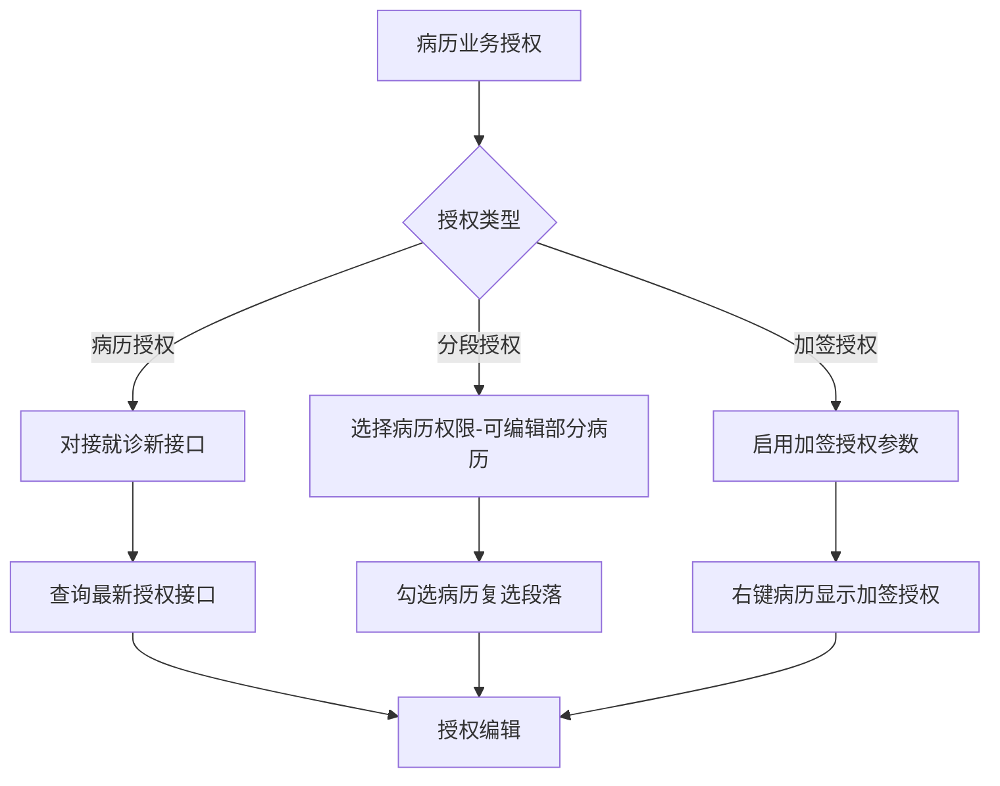
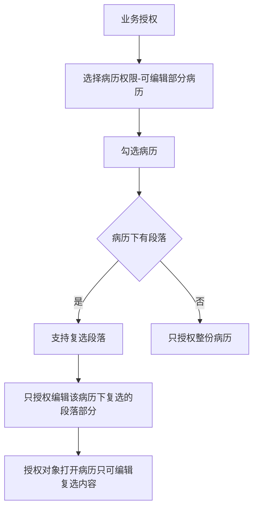

# BLGL-04-QXGL-007 病历业务授权 _ Analyst - Spec

> **需求编号**：BLGL-04-QXGL-007
> **父需求**：BLGL-04-QXGL
> **关联PM Spec**：BLGL-04-QXGL-007_病历业务授权_PM-spec.md
> **Spec版本**：V1.0
> **编写时间**：2026-08-15
> **编写人**：需求分析师

---

## 一、功能编号体系

### 1.1 功能层级结构

```
BLGL-04-QXGL-007-001: 病历授权接口对接
  ├─ BLGL-04-QXGL-007-001-01: 对接就诊新接口
  └─ BLGL-04-QXGL-007-001-02: 查询最新授权

BLGL-04-QXGL-007-002: 分段授权编辑
  ├─ BLGL-04-QXGL-007-002-01: 可编辑部分病历
  ├─ BLGL-04-QXGL-007-002-02: 段落级授权
  └─ BLGL-04-QXGL-007-002-03: 授权对象编辑

BLGL-04-QXGL-007-003: 加签授权
  ├─ BLGL-04-QXGL-007-003-01: 加签授权参数
  ├─ BLGL-04-QXGL-007-003-02: 加签授权按钮
  └─ BLGL-04-QXGL-007-003-03: 授权人职称范围

BLGL-04-QXGL-007-004: 病历起草者
  ├─ BLGL-04-QXGL-007-004-01: 病历起草者更新
  └─ BLGL-04-QXGL-007-004-02: 病历起草者查询
```

### 1.2 功能编号表

| REQ-ID | 功能名称 | 类型 | 优先级 | 说明 |
|--------|---------|------|--------|------|
| BLGL-04-QXGL-007-001 | 病历授权接口对接 | 功能 | P0 | 授权接口 |
| BLGL-04-QXGL-007-001-01 | 对接就诊新接口 | 子功能 | P0 | 病历授权新接口 |
| BLGL-04-QXGL-007-001-02 | 查询最新授权 | 子功能 | P0 | 最新授权接口 |
| BLGL-04-QXGL-007-002 | 分段授权编辑 | 功能 | P0 | 分段授权 |
| BLGL-04-QXGL-007-002-01 | 可编辑部分病历 | 子功能 | P0 | 病历权限选择 |
| BLGL-04-QXGL-007-002-02 | 段落级授权 | 子功能 | P0 | 复选段落 |
| BLGL-04-QXGL-007-002-03 | 授权对象编辑 | 子功能 | P0 | 只可编辑复选内容 |
| BLGL-04-QXGL-007-003 | 加签授权 | 功能 | P0 | 加签授权 |
| BLGL-04-QXGL-007-003-01 | 加签授权参数 | 子功能 | P0 | 是否启用 |
| BLGL-04-QXGL-007-003-02 | 加签授权按钮 | 子功能 | P0 | 病历加签授权 |
| BLGL-04-QXGL-007-003-03 | 授权人职称范围 | 子功能 | P0 | 职称必须是医生 |
| BLGL-04-QXGL-007-004 | 病历起草者 | 功能 | P1 | 起草者 |
| BLGL-04-QXGL-007-004-01 | 病历起草者更新 | 子功能 | P1 | inp_emr_set_authors/update |
| BLGL-04-QXGL-007-004-02 | 病历起草者查询 | 子功能 | P1 | inp_emr_set_authors/query |

---

## 二、核心业务流程

### 2.1 病历业务授权主流程



### 2.2 分段授权流程



---

## 三、功能规格说明

### BLGL-04-QXGL-007-001: 病历授权接口对接

#### 3.1.1 功能概述

病历业务授权对接就诊的新接口，添加查询最新授权接口 /api/v1/inpatient_encounter/inpat_encounter_authorization_last/query/by_example，com.winning.bmts.inpatient.rest.InpatEncAuthorizationApiImpl#queryInpatEncounterAuthorizationLast。

#### 3.1.2 用户角色

| 角色 | 使用场景 | 权限要求 | 操作频率 |
|------|---------|---------|---------|
| 病案管理员 | 病历授权配置 | 配置权限 | 低频 |

#### 3.1.3 业务流程（Given/When/Then）

**Scenario 1: 病历授权接口对接（主流程）**

```gherkin
Given:
  - 病历业务授权

When:
  - 对接就诊的病历授权新接口

Then:
  - 添加查询最新授权接口
  - /api/v1/inpatient_encounter/inpat_encounter_authorization_last/query/by_example
```

#### 3.1.4 数据字段定义

| 字段名 | 类型 | 必填 | 默认值 | 取值范围 | 说明 | 概念ID |
|--------|------|------|--------|---------|------|--------|
| 授权类型代码 | String | 是 | - | 病历授权 | 授权来源代码 | ⏳ 待确认 |

#### 3.1.5 验收标准

| AC编号 | 验收标准 | 对应REQ-ID | 验证方法 | 验证场景 |
|--------|---------|-----------|---------|---------|
| AC-001 | 病历业务授权对接就诊新接口，查询最新授权接口生效 | BLGL-04-QXGL-007-001 | 集成测试 | Scenario 1 |

---

### BLGL-04-QXGL-007-002: 分段授权编辑

#### 3.2.1 功能概述

满足电子病历六级评级：在业务授权里，选择病历权限-可编辑部分病历，勾选病历，如果病历下有段落，支持复选段落，只授权编辑该病历下复选的段落部分。授权对象打开已经得到授权的病历，只可编辑复选的内容。

#### 3.2.2 用户角色

| 角色 | 使用场景 | 权限要求 | 操作频率 |
|------|---------|---------|---------|
| 病案管理员 | 业务授权配置 | 配置权限 | 低频 |
| 授权对象 | 编辑授权病历 | 段落授权 | 中频 |

#### 3.2.3 业务流程（Given/When/Then）

**Scenario 1: 分段授权（主流程）**

```gherkin
Given:
  - 六级评级要求

When:
  - 在业务授权里选择病历权限-可编辑部分病历
  - 勾选病历，复选段落

Then:
  - 只授权编辑该病历下复选的段落部分
  - 授权对象打开病历只可编辑复选内容
```

#### 3.2.4 数据字段定义

| ⏳ 待确认 | 分段授权无独立数据字段 | 依赖业务授权段落配置 |

#### 3.2.5 验收标准

| AC编号 | 验收标准 | 对应REQ-ID | 验证方法 | 验证场景 |
|--------|---------|-----------|---------|---------|
| AC-002 | 分段授权：可授权编辑病历指定段落 | BLGL-04-QXGL-007-002 | 功能测试 | Scenario 1 |

---

### BLGL-04-QXGL-007-003: 加签授权

#### 3.3.1 功能概述

病历基本配置增加参数"是否启用病历加签授权功能"，启用后能授权本科室同级和下级医生对某份病历进行签名。参数为是，显示【病历加签】按钮和菜单：有权限的医生（病历最新修改人以及当前有编辑权限可以编辑病历的人）在病历簿上右键点击病历文件，显示【病历加签授权】按钮，可选择授权人（职称范围必须是医生：医师、主治医师、副主任医师、主任医师）。

#### 3.3.2 用户角色

| 角色 | 使用场景 | 权限要求 | 操作频率 |
|------|---------|---------|---------|
| 上级医师 | 加签授权 | 最新修改人/可编辑权限 | 中频 |

#### 3.3.3 业务流程（Given/When/Then）

**Scenario 1: 加签授权（主流程）**

```gherkin
Given:
  - 参数"是否启用病历加签授权功能"=是

When:
  - 有权限的医生在病历簿上右键点击病历文件

Then:
  - 显示【病历加签授权】按钮
  - 可选择授权人（职称范围必须是医生）
  - 授权本科室同级和下级医生对某份病历进行签名
```

**Scenario 2: 权限判断**

```gherkin
Given:
  - 未打开病历时

When:
  - 判断权限

Then:
  - 只判断最新修改人有权限
  - 打开病历时同时判断最新修改人和可编辑病历的人
```

#### 3.3.4 数据字段定义

| 字段名 | 类型 | 必填 | 默认值 | 取值范围 | 说明 | 概念ID |
|--------|------|------|--------|---------|------|--------|
| 是否启用病历加签授权功能 | Boolean | 否 | 否 | 是/否 | 加签授权参数 | ⏳ 待确认 |
| authStatus | Long | 否 | - | 399631413未加签/399631414已加签/399631415超时未签 | 加签状态 | ⏳ 待确认 |

#### 3.3.5 验收标准

| AC编号 | 验收标准 | 对应REQ-ID | 验证方法 | 验证场景 |
|--------|---------|-----------|---------|---------|
| AC-003 | 加签授权参数启用后显示【病历加签授权】按钮 | BLGL-04-QXGL-007-003 | 功能测试 | Scenario 1 |
| AC-004 | 加签授权人职称范围必须是医生 | BLGL-04-QXGL-007-003 | 功能测试 | Scenario 1 |

---

### BLGL-04-QXGL-007-004: 病历起草者

#### 3.4.1 功能概述

病历起草者更新/查询：inp_emr_set_authors/update、query/by_inp_emr_set_id。

#### 3.4.2 用户角色

| 角色 | 使用场景 | 权限要求 | 操作频率 |
|------|---------|---------|---------|
| 住院医生 | 病历起草 | 病历书写权限 | 高频 |

#### 3.4.3 业务流程（Given/When/Then）

**Scenario 1: 病历起草者（主流程）**

```gherkin
Given:
  - 病历创建

When:
  - 查询/更新病历起草者

Then:
  - inp_emr_set_authors/update|query 生效
  - 记录病历起草者历史
```

#### 3.4.4 数据字段定义

| 字段名 | 类型 | 必填 | 默认值 | 取值范围 | 说明 | 概念ID |
|--------|------|------|--------|---------|------|--------|
| inpEmrSetId | Long | 是 | - | - | 病历集ID | ⏳ 待确认 |
| fromBy | Long | 否 | - | - | 起草者 | ⏳ 待确认 |

#### 3.4.5 验收标准

| AC编号 | 验收标准 | 对应REQ-ID | 验证方法 | 验证场景 |
|--------|---------|-----------|---------|---------|
| AC-005 | 病历起草者更新/查询接口生效 | BLGL-04-QXGL-007-004 | 接口测试 | Scenario 1 |

---

## 四、排除范围

本需求不包含以下功能项：

1. **病历审签权限管理** —— BLGL-04-QXGL-001
2. **规培生教学权限管理** —— BLGL-04-QXGL-002
3. **分级访问控制** —— BLGL-04-QXGL-003
4. **病历操作权限管理** —— BLGL-04-QXGL-004
5. **角色职称权限管理** —— BLGL-04-QXGL-005
6. **科室病区权限管理** —— BLGL-04-QXGL-006

---

## 五、业务规则清单

| 规则ID | 规则名称 | 规则描述 | 来源 | 优先级 |
|--------|---------|---------|------|--------|
| BR-001 | 授权接口 | 病历业务授权对接就诊新接口，查询最新授权 |  | P0 |
| BR-002 | 分段授权 | 业务授权选择病历权限-可编辑部分病历，支持复选段落 |  | P0 |
| BR-003 | 加签授权 | 参数启用后授权本科室同级/下级医生签名，职称必须是医生 |  | P0 |
| BR-004 | 起草者 | 病历起草者更新/查询，记录历史 | 代码 | P1 |

---

## 六、关联文档

| 文档类型 | 文档路径 | 说明 |
|---------|---------|------|
| 功能点Spec（模块级） | 上级目录 BLGL-04-QXGL 权限管理功能点Spec.md（V1.0） | 模块级功能点索引 |
| 功能Spec（业务背景与设计） | 本目录 BLGL-04-QXGL-007_病历业务授权-Spec.md（V1.0） | 业务背景与目标 Spec |
| Analyst-Spec（分析规格） | 本目录 BLGL-04-QXGL-007_病历业务授权_Analyst-spec.md（V1.0）（本文档） | 分析规格 |
| PM-Spec（需求规格） | 本目录 BLGL-04-QXGL-007_病历业务授权_PM-spec.md（V0.1） | PM 产出的 Spec 文档 |
| data-model.md | 待产出 | 架构师产出的数据建模文档 |
| design.md | 待产出 | 架构师产出的技术方案文档 |
| api-contract.md | 待产出 | 开发经理产出的 API 契约文档 |

---

## 七、待确认问题清单

| 编号 | 问题描述 | 缺失信息 | 影响范围 | 建议补充方 |
|------|---------|---------|---------|-----------|
| Q-001 | 病历授权接口（InpatientEmrSignAuthInputAO）完整字段 | API 契约 | -Spec 第5章 | 开发经理 |
| Q-002 | 分段授权段落配置表模型 | 数据模型 | 3.2.3 | 架构师 |
| Q-003 | 就诊授权新接口（inpat_encounter_authorization_last）字段 | 需求分析原文缺失 | 3.1.3 | 需求分析师 |
| Q-004 | 加签授权人职称范围配置方式 | 需求分析原文缺失 | 3.3.3 | 需求分析师 |
| Q-005 | 性能指标（病历授权查询响应时间） | 资料区无量化指标 | -Spec 第8章 | 产品经理 |

---

## 填写检查清单

| 序号 | 检查项 | 是否完成 |
|:----:|--------|:--------:|
| 1 | 功能编号带父子层级 | ✅ |
| 2 | 每个 REQ-ID 有功能概述和用户角色 | ✅ |
| 3 | 主流程至少 1 个 Given/When/Then 场景 | ✅ |
| 4 | 异常流程至少 3 个 Given/When/Then 场景 | ✅ |
| 5 | 边界流程至少 2 个 Given/When/Then 场景 | ✅ |
| 6 | 每个 Given/When/Then 内容具体，不模糊 | ✅ |
| 7 | 数据字段定义完整（字段名、类型、必填、说明、概念ID） | ✅ |
| 8 | 验收标准 AC 编号独立，可验证 | ✅ |
| 9 | 验收标准无"功能正常"等模糊表述 | ✅ |
| 10 | 排除范围明确列出 | ✅ |
| 11 | 业务规则清单列出所有规则，每条标注来源 | ✅ |
| 12 | 流程图使用 Mermaid 格式（≥2 个） | ✅ |
| 13 | 关联文档索引包含 Phase 1 功能点Spec | ✅ |
| 14 | 待确认问题清单汇总了全文所有 ⏳ 项 | ✅ |
| 15 | 全文无占位符 `< >` 残留 | ✅ |
| 16 | 全文陈述可溯源至资料区（S1~S10 溯源核查） | ✅ |
| 17 | 人工审核确认完成 | ⏳ 待确认 |

---

**文档状态**：⬜ 待审核
**维护责任**：需求分析师规范组
**下次更新**：根据评审反馈优化

---

## 版本历史

| 版本 | 日期 | 变更说明 | 编写人 |
|------|------|---------|--------|
| V1.0 | 2026-08-15 | 初始版本 | 需求分析师 |
