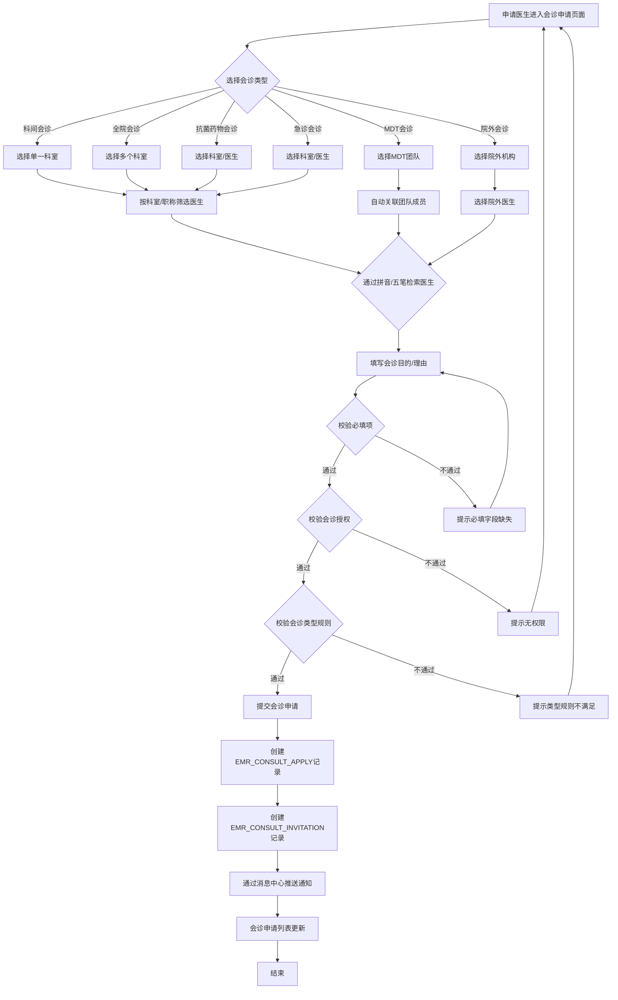
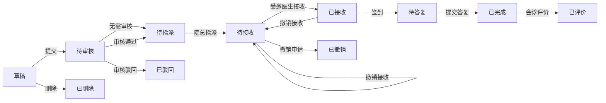
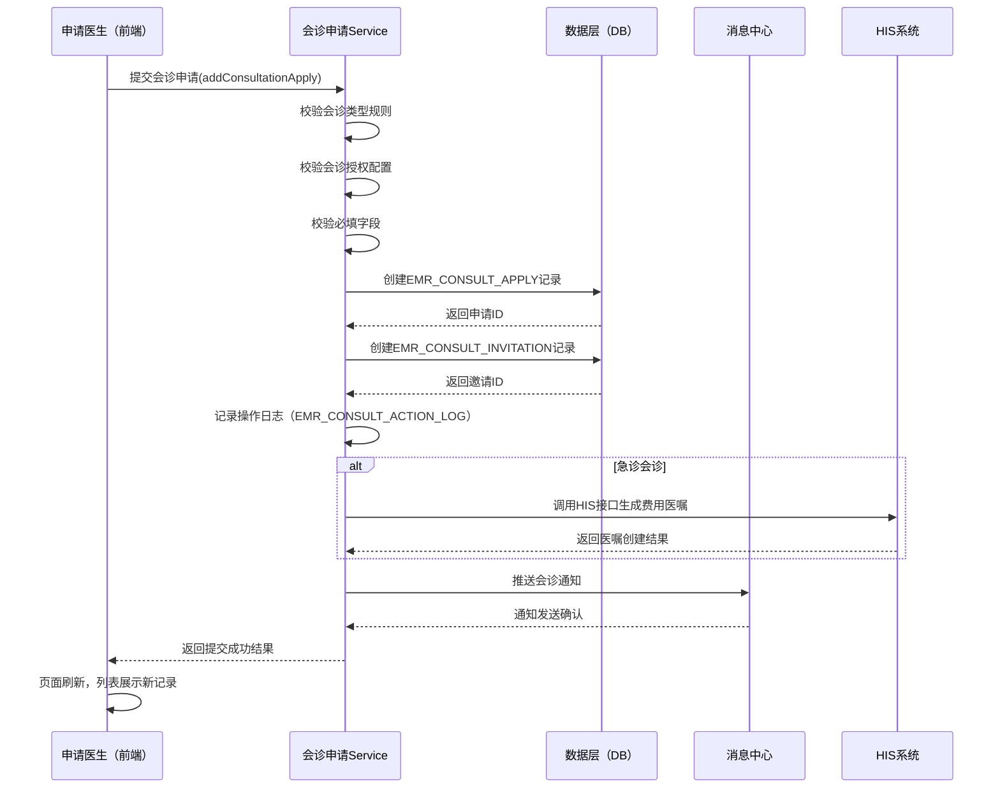

# BLGL-05-HZGL-001 会诊申请 - Spec

> **功能编号**：BLGL-05-HZGL-001
> **文档类型**：Spec（研发视角）
> **文档版本**：V1.0
> **编写时间**：2026-08-21
> **编写人**：RACC

---

## 文档索引

本节提供本文档的章节结构索引与关联文档索引，便于读者快速定位与检索。

#### 章节索引

**PM-Spec（业务视角）**

| 章节号 | 章节名称 | 内容说明 |
|--------|---------|---------|
| 一 | 目标 | 一句话描述功能目标 |
| 二 | 约束 | 业务约束、技术约束、非功能性约束 |
| 三 | 验收标准 | 验收标准与验证方法 |
| 四 | 排除范围 | 本次不做、明确边界 |
| 五 | 关键决策记录 | 方案决策、其他决议 |
| 六 | 优先级 | 需求优先级说明 |
| 附录 | 填写检查清单 | 检查项与完成状态 |

**Analyst-Spec（产品视角）**

| 章节号 | 章节名称 | 内容说明 |
|--------|---------|---------|
| 一 | 功能编号体系 | 带父子层级的编号树 |
| 二 | 核心业务流程 | Mermaid 流程图 |
| 三 | 功能规格说明 | 各子功能点的概述、用户角色、业务流程、验收标准 |
| 四 | 排除范围 | 本需求不包含的功能项 |
| 五 | 业务规则清单 | 规则ID、规则名称、规则描述、优先级 |
| 六 | 关联文档 | 文档类型、文档路径、说明 |
| 七 | 待确认问题清单 | 所有 ⏳ 待确认项的汇总 |
| - | 填写检查清单 | 检查项与完成状态 |

**Spec（研发视角）**

| 章节号 | 章节名称 | 内容说明 |
|--------|---------|---------|
| 第1章 | 文档概述 | 文档目的、文档范围、术语定义、阅读指南、参考文档 |
| 第2章 | 功能背景与定位 | 功能背景、功能定位、目标用户、核心价值 |
| 第3章 | 业务流程设计 | 主流程/异常流程/边界流程（Given/When/Then） |
| 第4章 | 数据模型设计 | 核心数据结构、状态定义、系统参数定义 |
| 第5章 | 接口契约设计 | API列表、接口详细设计、错误码定义 |
| 第6章 | 技术方案设计 | 页面路径、技术栈、关键技术点、部署方案 |
| 第7章 | 测试用例预设计 | 功能/边界/异常/性能测试用例 |
| 第8章 | 非功能性要求 | 性能、安全、可用性、兼容性 |
| 第9章 | 依赖与风险 | 外部依赖、风险项 |
| 第10章 | 附录 | 流程图、时序图、参考文档 |

#### 版本历史

| 版本 | 日期 | 变更说明 | 编写人 |
|------|------|---------|--------|
| V1.0 | 2026-08-21 | 初始版本 | RACC |

#### 关联文档索引

| 序号 | 文档名称 | 文档类型 | 版本 | 位置 |
|------|---------|---------|------|------|
| 1 | BLGL-05-HZGL-001_会诊申请-Spec.md | Spec（研发视角）（本文档） | V1.0 | 本目录 |
| 2 | BLGL-05-HZGL-001_会诊申请_PM-spec.md | PM-Spec（业务视角） | V1.0 | 本目录 |
| 3 | BLGL-05-HZGL-001_会诊申请_Analyst-spec.md | Analyst-Spec（产品视角） | V1.0 | 本目录 |
| 4 | BLGL-05-HZGL 05会诊管理功能点Spec.md | 功能点Spec（模块级） | V1.0 | 上级目录 |
| 5 | 新会诊历史需求.xlsx | 历史需求（资料区） | - | 资料区 |

> 📌 第4项为 Phase 1 输出，必须引用。版本号与 Phase 1 功能点Spec 实际版本一致。

---

## 1、文档概述

### 1.1、文档目的

本文档旨在明确"会诊申请"功能（BLGL-05-HZGL-001）的业务背景与设计方案，为需求分析、研发实现、测试验收及评审提供统一的业务上下文、设计口径与决策依据。

**具体目的包括**：

1. 梳理会诊申请功能的业务由来与历史需求演进脉络，说明"为什么要做"；
2. 明确功能的定位边界、目标用户与核心价值，回答"做成什么"；
3. 描述功能的业务流程、数据模型、接口契约与技术方案，回答"怎么做"；
4. 预设计测试用例并明确非功能性要求、依赖与风险，为研发与验收提供依据；
5. 作为 SPEC（功能编号体系、功能详情、业务规则、验收标准等章节）的业务前提与设计输入，保证各层文档业务口径一致。

> 📌 第1~2点对应业务层，第3~5点对应设计层。资料区的需求分析原文作为业务层素材，历史需求中的设计描述作为设计层素材。

### 1.2、文档范围

#### 1.2.1 纳入范围

本文档覆盖会诊申请功能的完整业务背景与设计，包括：

- 六种会诊类型的申请创建与提交：科间会诊、全院会诊、MDT会诊、院外会诊、抗菌药物会诊、急诊会诊
- 会诊申请的基本信息录入：会诊类型选择、受邀科室/医生选择、会诊目的/理由填写、患者信息关联
- 会诊申请的提交、保存草稿、撤销、删除操作
- 会诊申请列表展示与查询：按科室/医生/状态/时间等多维度筛选
- 会诊申请的权限控制与会诊授权配置
- 会诊申请的送达通知触发
- 拼音/五笔检索员工、按职称/科室筛选医生能力
- 急诊会诊特殊颜色标记
- 患者出区后仍可申请会诊的能力
- 会诊申请单撤销删除后受邀科室仍可查询

#### 1.2.2 排除范围

本文档不涉及以下内容（详见其他功能点或模块）：

- 会诊审核（BLGL-05-HZGL-002）：审核流程、审核意见、多级审核等
- 会诊答复与记录（BLGL-05-HZGL-003）：会诊意见书写、会诊记录生成、PDF生成、病程记录关联等
- 会诊接收与指派（BLGL-05-HZGL-004）：会诊任务接收、指派具体医生等
- 会诊签到（BLGL-05-HZGL-005）：医生到场签到、撤销签到、代为签到等
- 会诊计费（BLGL-05-HZGL-006）：费用计算、医保校验、账单生成等
- 会诊配置管理（BC-HZGL-003）：参数配置、审核流程配置、科室配置等

### 1.3、术语定义

| 术语 | 定义 |
|------|------|
| 会诊申请 | 申请医生根据患者病情需要，向其他科室或医生发起协作诊疗请求的业务操作（来源：需求） |
| 科间会诊 | 邀请单一科室的医生进行会诊，住院医生站科间会诊时仅允许选择单一科室（来源：需求） |
| 全院会诊 | 邀请多个科室的医生共同参与会诊（来源：需求） |
| MDT会诊 | 多学科团队（Multi-Disciplinary Team）会诊，需指定MDT团队而非单个科室（来源：需求） |
| 院外会诊 | 邀请本院以外的医疗机构专家参与会诊（来源：需求） |
| 抗菌药物会诊 | 针对抗菌药物使用申请的专项会诊，需满足抗菌药物管理相关规范（来源：需求） |
| 急诊会诊 | 急诊科室发起的会诊，需自动生成费用医嘱，执行科室设为会诊科室（来源：需求） |
| 会诊邀请 | 会诊申请中指定的受邀科室或医生，一个会诊申请可包含多个邀请（来源：代码） |
| 会诊授权 | 通过授权配置控制哪些科室/医生可以发起会诊、哪些科室/医生可以接收会诊（来源：需求） |
| 会诊签到 | 会诊医生到达指定科室后确认到场的行为，支持由申请医生、本科室人员代为完成（来源：需求） |
| 会诊答复 | 受邀医生完成会诊后提交的会诊意见、诊断与治疗建议（来源：需求） |
| 会诊回执 | 会诊申请单的回复确认，受邀科室/医生对会诊申请的应答（来源：需求） |
| 逆向流程 | 申请人答复会诊的流程，即申请医生可对会诊结果进行答复确认（来源：需求） |
| 会诊医嘱 | 会诊相关的医疗指令，急诊会诊自动生成费用医嘱，防止重复发送会诊医嘱（来源：需求） |
| 会诊状态 | 会诊申请全生命周期的状态标识，包括待审核、待接收、待签到、待答复、已完成、已撤销等（来源：代码） |

### 1.4、阅读指南

- **章节关系**：第1~2章为阅读铺垫与业务全貌（背景、定位、用户、价值）；第3~10章为设计实现层（流程、数据、接口、技术、测试、非功能、依赖风险、附录），可直接用于研发与测试。与 Analyst-Spec（产品视角）、PM-Spec（业务视角）的详细规则/验收口径互相引用，保持一致。
- **读者对象**：
  - 产品经理/需求分析师：阅读第1~2章了解业务全貌，据此维护 PM-Spec 与功能清单；
  - 研发：阅读第3~6章用于开发实现，第9~10章用于依赖评估与联调；
  - 测试：阅读第3章、第7~8章用于用例设计与验收；
  - 评审人员：以本文档为业务口径与设计基准，核对各层文档一致性。

### 1.5、参考文档

| 序号 | 文档名称 | 版本/日期 |
|------|---------|----------|
| 1 | 【历史需求】新会诊历史需求.xlsx（117条需求） | - |
| 2 | BLGL-05-HZGL-001_会诊申请_PM-spec.md | V1.0 |
| 3 | BLGL-05-HZGL-001_会诊申请_Analyst-spec.md | V1.0 |
| 4 | BLGL-05-HZGL 05会诊管理功能点Spec.md | V1.0 |
| 5 | 代码仓库扫描结果（sr-next/winning-emr-consultation-next） | 2026-08-21 |

---

## 2、功能背景与定位

### 2.1 功能背景

会诊申请是会诊管理模块的入口功能，处于端到端会诊流程的起点，需满足：

- **管理要求**：住院患者病情复杂时，需要跨科室/跨院区的专家协作诊疗。会诊申请是启动多科室协作诊疗的标准化入口，需覆盖科间会诊、全院会诊、MDT会诊、院外会诊、抗菌药物会诊、急诊会诊等多种场景，确保会诊流程的规范性和可追溯性。（来源：需求）
- **现状痛点**：
  - 原有会诊申请流程中，申请医生无法快速定位合适的会诊医生，缺乏按职称/科室筛选医生的能力
  - 会诊类型定义不清晰，科间/全院/MDT/院外/抗菌药物/急诊等场景的申请入口和处理逻辑混用
  - 会诊申请单撤销删除后，受邀科室无法查询历史记录，导致信息追溯困难
  - 患者出区后无法再申请会诊，限制了跨病区协作能力
  - 会诊医嘱重复发送，缺乏防重复机制
  - 急诊科发起的会诊需要手动生成费用医嘱，效率低且易出错（来源：需求）
- **历史需求演进**：通过对资料区新会诊历史需求.xlsx中117条需求的梳理，会诊申请功能经历了从单一科间会诊到多类型会诊（新增MDT/院外/抗菌药物/急诊）、从基础CRUD到精细化权限控制（会诊授权配置）、从简单通知到智能化送达（消息中心对接）的演进过程。当前版本以v2架构（winning-emr-consultation-next）实现，采用独立模块化设计。（来源：需求 + 代码）

### 2.2 功能定位

"会诊申请"是WiNEX病历管理（住院）-会诊管理模块的核心入口功能，定位为：

- **全类型会诊申请入口**：统一承载科间会诊、全院会诊、MDT会诊、院外会诊、抗菌药物会诊、急诊会诊六种会诊类型的创建与提交，是跨科室协作诊疗的启动点（来源：需求）
- **智能检索与匹配**：支持按职称筛选医生、按科室筛选医生、拼音/五笔检索员工，帮助申请医生快速定位合适的会诊医生（来源：需求）
- **权限与授权控制**：通过会诊授权配置，控制不同科室/角色的会诊发起权限，保障会诊业务的合规性（来源：需求）
- **全流程状态追踪**：会诊申请创建后，支持状态跟踪（待审核/待接收/待签到/待答复/已完成/已撤销），列表展示科室名称、会诊目的、会诊医生、病人状态、床位号、病区等关键信息（来源：需求 + 代码）

### 2.3 目标用户

| 用户角色 | 主要使用场景 |
|---------|-------------|
| 申请医生（住院医生） | 根据患者病情需要，发起会诊申请，选择会诊类型和受邀科室/医生，填写会诊目的和理由，提交申请后跟踪会诊进展（来源：需求） |
| 科室主任/主治医师 | 审核科室内的会诊申请，或发起高权限要求的会诊类型（如全院会诊）（来源：需求） |
| 急诊科医生 | 在急诊场景下发起急诊会诊，系统自动生成费用医嘱（来源：需求） |
| 护士 | 协助医生完成会诊申请的辅助操作，如查看会诊状态、通知会诊医生等（来源：需求） |

### 2.4 核心价值

| 价值维度 | 价值描述 |
|---------|---------|
| 协作效率提升 | 通过智能检索（拼音/五笔/职称筛选/科室筛选），申请医生可快速定位合适的会诊医生，缩短会诊发起时间（来源：需求） |
| 业务合规性 | 六种会诊类型各自的业务规则（如科间仅选单一科室、MDT指定团队、院外机构必填）在申请环节即强制校验，保障流程合规（来源：需求） |
| 流程可追溯 | 会诊申请单撤销删除后，受邀科室仍可查询历史记录，保障会诊信息的完整可追溯（来源：需求） |
| 跨病区协作 | 患者出区后仍可申请会诊，打破病区界限，支持患者流转后的持续诊疗协作（来源：需求） |
| 自动化医嘱 | 急诊会诊自动生成费用医嘱，执行科室设为会诊科室，减少医生手工操作，降低出错率（来源：需求） |

---

## 3、业务流程设计（Given/When/Then）

> 📌 以下场景从资料区中的需求分析原文提取。每个场景的 Given/When/Then 内容必须有需求原文对应依据。

### 3.1 主流程

**Scenario 1: 住院医生发起科间会诊申请**

```gherkin
Given:
  - 申请医生已登录住院医生站，具有会诊申请权限
  - 当前患者处于住院状态，有有效的ENCOUNTER_ID
  - 系统已配置会诊授权参数，申请医生所在科室具有科间会诊发起权限
  - 系统已同步科室信息、员工信息、职称信息（来源：主数据系统MDM）

When:
  - 申请医生在会诊申请页面选择会诊类型为"科间会诊"
  - 系统自动筛选出受邀科室列表，仅允许选择单一科室（来源：需求）
  - 申请医生选择受邀科室后，系统按职称筛选展示该科室的医生列表
  - 申请医生通过拼音/五笔检索功能定位到具体会诊医生
  - 申请医生填写会诊目的、会诊理由
  - 申请医生点击"提交"按钮

Then:
  - 系统创建会诊申请记录（EMR_CONSULT_APPLY），状态为"待审核"或"待接收"（取决于审核流程配置）
  - 系统创建会诊邀请记录（EMR_CONSULT_INVITATION），关联受邀科室和医生
  - 系统通过消息中心向受邀科室/医生推送会诊通知
  - 会诊申请列表页新增该条记录，展示科室名称、会诊目的、会诊医生、病人状态、床位号、病区
  - 系统记录操作日志
```

### 3.2 异常流程

**Scenario 2: 科间会诊选择多个科室（业务异常）**

```gherkin
Given:
  - 申请医生在会诊申请页面
  - 会诊类型已选择"科间会诊"
  - 住院医生站科间会诊时仅允许选择单一科室（来源：需求）

When:
  - 申请医生尝试选择多个受邀科室

Then:
  - 系统阻止选择操作，提示"科间会诊仅允许选择一个科室"
  - 已选择的科室列表保持不变
  - 申请无法提交，直到仅保留一个科室
```

**Scenario 3: MDT会诊未指定团队（数据异常）**

```gherkin
Given:
  - 申请医生在会诊申请页面
  - 会诊类型已选择"MDT会诊"
  - 系统已配置MDT团队信息

When:
  - 申请医生选择MDT会诊类型后，未选择具体的MDT团队
  - 申请医生点击"提交"按钮

Then:
  - 系统校验MDT团队必填，提示"MDT会诊必须指定MDT团队"
  - 申请不提交，停留在当前页面
  - 页面聚焦到MDT团队选择控件
```

**Scenario 4: 院外会诊机构未配置（系统异常/数据异常）**

```gherkin
Given:
  - 申请医生在会诊申请页面
  - 会诊类型已选择"院外会诊"
  - 院外会诊机构配置信息缺失或未同步

When:
  - 申请医生选择院外会诊类型后，无法找到目标院外机构
  - 申请医生尝试提交

Then:
  - 系统提示"院外会诊机构信息未配置，请联系管理员"
  - 申请不提交
  - 系统记录配置缺失的异常日志
```

**Scenario 5: 会诊授权配置不满足（业务异常）**

```gherkin
Given:
  - 申请医生已登录住院医生站
  - 系统配置了会诊授权规则，限制某些科室只能发起特定类型的会诊
  - 申请医生所在科室无全院会诊发起权限

When:
  - 申请医生在会诊申请页面选择"全院会诊"类型

Then:
  - 系统校验授权配置，检测到申请医生无全院会诊发起权限
  - 系统提示"您无权限发起全院会诊，请联系管理员"
  - 会诊类型选择框禁用"全院会诊"选项或提交时拦截
  - 申请无法提交
```

### 3.3 边界流程

**Scenario 6: 患者出区后申请会诊（边界场景）**

```gherkin
Given:
  - 患者已从原病区转出（出区状态），但仍在住院状态
  - 申请医生具有会诊申请权限
  - 患者出区后仍可申请会诊（来源：需求）

When:
  - 申请医生在会诊申请页面检索该患者
  - 系统正常展示该患者信息
  - 申请医生填写会诊信息并提交

Then:
  - 会诊申请成功创建，患者信息正常关联
  - 受邀科室可正常接收会诊通知
  - 会诊流程正常推进，不受患者出区状态影响
```

**Scenario 7: 会诊申请撤销删除后受邀科室查询（边界场景）**

```gherkin
Given:
  - 存在一条已提交的会诊申请记录
  - 该申请已被申请医生撤销或删除
  - 受邀科室之前已收到该会诊通知

When:
  - 受邀科室在会诊查询列表中检索会诊申请
  - 源申请已被撤销/删除（逻辑删除，来源：需求）

Then:
  - 受邀科室仍可查询到该会诊申请记录（来源：需求）
  - 记录状态标记为"已撤销"或"已删除"
  - 受邀科室可查看会诊申请的完整信息（含目的、理由、受邀科室等）
  - 但不可对该申请进行接收、答复等后续操作
```

---

## 4、数据模型设计

> 📌 以下数据模型信息来自代码仓库扫描结果（来源：代码）和资料区需求描述。

### 4.1 核心数据结构

#### 4.1.1 核心保存请求

会诊申请保存/提交请求参数结构（来源：代码，ConsultApplyV2PO 映射）：

| 字段名 | 类型 | 必填 | 备注 |
|--------|------|------|------|
| encounterNumber | String | 是 | 患者就诊号，关联ENCOUNTER |
| patientName | String | 是 | 患者姓名 |
| bedNo | String | 否 | 床位号 |
| encounterId | String | 是 | 就诊ID |
| deptId | String | 是 | 申请科室ID |
| deptName | String | 是 | 申请科室名称 |
| wardId | String | 否 | 病区ID |
| wardName | String | 否 | 病区名称 |
| consultTypeCode | String | 是 | 会诊类型编码（科间/全院/MDT/院外/抗菌药物/急诊） |
| consultLevelCode | String | 否 | 会诊级别编码 |
| diagnosisNameSet | String | 否 | 诊断名称集合 |
| diagnosisCodeSet | String | 否 | 诊断编码集合 |
| applyConsultAt | String | 否 | 申请会诊时间 |
| consultPurpose | String | 是 | 会诊目的 |
| applyConsultEmployeeId | String | 是 | 申请医生ID |
| applyConsultEmployeeName | String | 是 | 申请医生姓名 |
| consultOrderId | String | 否 | 会诊医嘱ID |
| sourceCode | String | 是 | 来源编码（住院/急诊/门诊） |
| personId | String | 是 | 患者PersonID |
| consultReason | String | 否 | 会诊理由 |
| appointConsultAt | String | 否 | 预约会诊时间 |
| appointConsultAddress | String | 否 | 预约会诊地点 |
| applyDeptId | String | 是 | 申请科室ID |
| applyDeptName | String | 是 | 申请科室名称 |
| invitationList | List | 是 | 受邀科室/医生列表（EMR_CONSULT_INVITATION结构） |

#### 4.1.2 核心表/实体

| 表/实体 | 关键字段 | 说明 |
|---------|---------|------|
| EMR_CONSULT_APPLY (ConsultApplyV2PO) | EMR_CONSULT_APPLY_ID, ENCOUNTER_NUMBER, PATIENT_NAME, BED_NO, ENCOUNTER_ID, DEPT_ID, DEPT_NAME, WARD_ID, WARD_NAME, CONSULT_TYPE_CODE, CONSULT_LEVEL_CODE, DIAGNOSIS_NAME_SET, DIAGNOSIS_CODE_SET, APPLY_CONSULT_AT, CONSULT_PURPOSE, APPLY_CONSULT_EMPLOYEE_ID, APPLY_CONSULT_EMPLOYEE_NAME, CONSULT_ORDER_ID, SOURCE_CODE, PERSON_ID, AUDIT_STATUS, STAGE_STATUS, CONSULT_REASON, APPOINT_CONSULT_AT, APPOINT_CONSULT_ADDRESS, APPLY_DEPT_ID, APPLY_DEPT_NAME, PRESET_COMPLETED_AT, COMPLETED_AT 等41个字段 | 会诊申请主表，存储会诊申请的核心信息，41个字段（来源：代码） |
| EMR_CONSULT_INVITATION (ConsultInvitationV2PO) | EMR_CONSULT_INVITATION_ID, EMR_CONSULT_APPLY_ID, INVITED_DEPT_ID, INVITED_DEPT_NAME, INVITED_EMPLOYEE_ID, INVITED_EMPLOYEE_NAME, INVITED_TYPE_CODE, CONSULT_STATUS_CODE, ASSIGNED_FLAG, SIGNED_FLAG, CONSULT_EMPLOYEE_ID 等35个字段 | 会诊邀请表，存储受邀科室/医生信息，35个字段（来源：代码） |
| EMR_CONSULT_EXTEND_INFO (EmrConsultApplyExtendV2PO) | EMR_CONSULT_APPLY_ID, 计费相关字段等4个字段 | 会诊扩展信息表，存储计费/医保等扩展信息（来源：代码） |
| EMR_CONSULT_ACTION_LOG (ConsultActionLogV2PO) | 操作日志相关字段，10个字段 | 会诊操作日志表，记录申请、撤销、删除等操作（来源：代码） |

### 4.2 状态定义

#### 申请状态（AUDIT_STATUS）

| 状态码 | 状态名称 | 说明 |
|--------|---------|------|
| 0 | 待审核 | 会诊申请已提交，等待审核流程处理（来源：代码） |
| 1 | 审核通过 | 审核流程通过，可进入接收/指派环节（来源：代码） |
| 2 | 审核驳回 | 审核流程未通过，已退回（来源：代码） |
| ⏳ 待确认 | 已撤销 | 申请医生主动撤销会诊申请 |
| ⏳ 待确认 | 已删除 | 申请医生删除会诊申请（逻辑删除） |

#### 阶段状态（STAGE_STATUS）

| 状态码 | 状态名称 | 说明 |
|--------|---------|------|
| ⏳ 待确认 | 待接收 | 会诊申请已通过审核，等待受邀科室/医生接收（来源：代码） |
| ⏳ 待确认 | 待签到 | 会诊申请已被接收，等待会诊医生签到（来源：代码） |
| ⏳ 待确认 | 待答复 | 会诊医生已签到，等待提交会诊答复（来源：代码） |
| ⏳ 待确认 | 已完成 | 会诊答复已提交，会诊流程结束（来源：代码） |
| ⏳ 待确认 | 已撤销 | 会诊申请被撤销 |

#### 邀请状态（CONSULT_STATUS_CODE）

| 状态码 | 状态名称 | 说明 |
|--------|---------|------|
| ⏳ 待确认 | 待接收 | 受邀科室/医生尚未接收会诊邀请 |
| ⏳ 待确认 | 已接收 | 受邀科室/医生已接收会诊邀请 |
| ⏳ 待确认 | 已签到 | 会诊医生已签到 |
| ⏳ 待确认 | 已答复 | 会诊医生已提交会诊答复 |
| ⏳ 待确认 | 已拒绝 | 受邀科室/医生拒绝会诊邀请 |

> 📌 部分状态码和编码值待从代码PO实体中的枚举定义或常量类中确认具体值。状态流转逻辑见第10章流程图。

### 4.3 系统参数定义

| 参数编码 | 参数名称 | 说明 |
|---------|---------|------|
| ⏳ 待确认 | 会诊审核流程配置 | 配置是否启用会诊审核、审核流程层级、审核角色等（来源：需求，具体参数编码待确认） |
| ⏳ 待确认 | 会诊授权配置 | 配置各科室可发起的会诊类型、权限范围等（来源：需求，具体参数编码待确认） |
| ⏳ 待确认 | 会诊签到规则配置 | 配置是否强制签到、未接收时签到是否自动接收等（来源：需求，具体参数编码待确认） |
| ⏳ 待确认 | 会诊计费规则配置 | 配置各会诊类型的计费规则、按职称计费标准等（来源：需求，具体参数编码待确认） |
| ⏳ 待确认 | 会诊时限配置 | 配置会诊完成时限、紧急会诊响应时限等（来源：需求，具体参数编码待确认） |

> 📌 系统参数的具体编码和参数路径待从代码中 EMR_CONSULT_PARAM 实体或前端的参数配置页面确认。

---

## 5、接口契约设计

> 📌 接口列表和详细设计来自代码仓库扫描结果（来源：代码）。

### 5.1 API列表

| 序号 | API名称 | 路径 | 方法 | 说明 |
|:----:|---------|------|:----:|------|
| 1 | addConsultationApply | /api/v1/app_record_consult_v2/consult_apply/addConsultationApply | POST | 会诊申请新增（来源：代码） |
| 2 | queryConsultationApplyList | /api/v1/app_record_consult_v2/consult_apply/queryConsultationApplyList | POST | 会诊申请查询（来源：代码） |
| 3 | queryConsultStaticStatusCountNum | /api/v1/app_record_consult_v2/consult_apply/queryConsultStaticStatusCountNum | POST | 会诊申请统计查询（来源：代码） |
| 4 | queryConsultApplyDetailInfoList | /api/v1/app_record_consult_v2/consult_apply/queryConsultApplyDetailInfoList | POST | 会诊项明细查询（来源：代码） |
| 5 | getConsultApplyInfo | /api/v1/app_record_consult_v2/consult_apply/getConsultApplyInfo | POST | 会诊详情查询（来源：代码） |
| 6 | queryPersonInfoList | /api/v1/app_record_consult_v2/consult_apply/queryPersonInfoList | POST | 查询会诊患者信息集合（来源：代码） |
| 7 | queryConsultDocumentTemplateInfoList | /api/v1/app_record_consult_v2/consult_apply/queryConsultDocumentTemplateInfoList | POST | 查询会诊病历模板列表（来源：代码） |
| 8 | queryEmrConsultSetViewList | /api/v1/app_record_consult_v2/consult_apply/queryEmrConsultSetViewList | POST | 查询会诊病历导航列表（来源：代码） |
| 9 | queryDocumentFillDataList | /api/v1/app_record_consult_v2/consult_apply/queryDocumentFillDataList | POST | 查询会诊病历患者信息填充数据列表（来源：代码） |
| 10 | queryWardList | /api/v1/app_record_consult_v2/consult_apply/queryWardList | POST | 查询病区（来源：代码） |
| 11 | queryMedicalTeamList | /api/v1/app_record_consult_v2/consult_apply/queryMedicalTeamList | POST | 查询医疗组（来源：代码） |
| 12 | queryEmrTemplateList | /api/v1/app_record_consult_v2/consult_apply/queryEmrTemplateList | POST | 查询模板列表（来源：代码） |
| 13 | queryEmrTemplateInfo | /api/v1/app_record_consult_v2/consult_apply/queryEmrTemplateInfo | POST | 查询模板信息（来源：代码） |
| 14 | queryEmrConsultMrtParams | /api/v1/app_record_consult_v2/consult_apply/queryEmrConsultMrtParams | POST | 查询模板参数列表（来源：代码） |
| 15 | deleteConsultationApply | /api/v1/app_record_consult_v2/consult_apply/deleteConsultationApply | POST | 会诊申请删除（来源：代码） |
| 16 | signInConsultation | /api/v1/app_record_consult_v2/consult_apply/signInConsultation | POST | 会诊签到/撤销签到-用于申请界面（来源：代码） |
| 17 | queryConsultReplyList | /api/v1/app_record_consult_v2/consult_apply/queryConsultReplyList | POST | 会诊答复查询（来源：代码） |
| 18 | queryConsultInvitationInfoListForSignIn | /api/v1/app_record_consult_v2/consult_apply/queryConsultInvitationInfoListForSignIn | POST | 查询会诊申请邀请明细列表用于签到（来源：代码） |
| 19 | queryLogViewList | /api/v1/app_record_consult_v2/consult_apply/queryLogViewList | POST | 查询会诊日志列表（来源：代码） |

### 5.2 接口详细设计

#### 5.2.1 addConsultationApply — 会诊申请新增

**请求参数**:
```json
{
  "encounterNumber": "ZY202608210001",
  "patientName": "张三",
  "bedNo": "12床",
  "encounterId": "ENC202608210001",
  "deptId": "DEPT001",
  "deptName": "呼吸内科",
  "wardId": "WARD001",
  "wardName": "呼吸一病区",
  "consultTypeCode": "DEPT_CONSULT",
  "consultPurpose": "患者反复咳嗽、发热3周，抗生素治疗效果不佳，需排除真菌感染",
  "consultReason": "胸部CT示双肺散在斑片状阴影，痰培养阴性，建议呼吸科会诊",
  "applyConsultEmployeeId": "EMP001",
  "applyConsultEmployeeName": "李医生",
  "sourceCode": "INPATIENT",
  "personId": "P202608210001",
  "appointConsultAt": "2026-08-22 09:00:00",
  "appointConsultAddress": "呼吸内科医生办公室",
  "applyDeptId": "DEPT001",
  "applyDeptName": "呼吸内科",
  "invitationList": [
    {
      "invitedDeptId": "DEPT005",
      "invitedDeptName": "感染科",
      "invitedEmployeeId": "EMP023",
      "invitedEmployeeName": "王主任",
      "invitedTypeCode": "DOCTOR"
    }
  ]
}
```

**返回值（成功）**:
```json
{
  "success": true,
  "data": {
    "emrConsultApplyId": "CA2026082100001",
    "encounterNumber": "ZY202608210001",
    "auditStatus": 0,
    "stageStatus": "PENDING_AUDIT",
    "message": "会诊申请提交成功"
  }
}
```

**返回值（失败）**:
```json
{
  "success": false,
  "message": "会诊申请提交失败：科间会诊仅允许选择一个科室",
  "data": null
}
```

#### 5.2.2 queryConsultationApplyList — 会诊申请查询

**请求参数**:
```json
{
  "encounterNumber": "ZY202608210001",
  "deptId": "DEPT001",
  "consultTypeCode": "DEPT_CONSULT",
  "auditStatus": 0,
  "applyConsultEmployeeId": "EMP001",
  "startTime": "2026-08-01 00:00:00",
  "endTime": "2026-08-21 23:59:59",
  "pageNum": 1,
  "pageSize": 20
}
```

**返回值（成功）**:
```json
{
  "success": true,
  "data": {
    "total": 5,
    "pageNum": 1,
    "pageSize": 20,
    "list": [
      {
        "emrConsultApplyId": "CA2026082100001",
        "encounterNumber": "ZY202608210001",
        "patientName": "张三",
        "bedNo": "12床",
        "deptName": "呼吸内科",
        "wardName": "呼吸一病区",
        "consultTypeCode": "DEPT_CONSULT",
        "consultPurpose": "患者反复咳嗽、发热3周...",
        "applyConsultEmployeeName": "李医生",
        "auditStatus": 0,
        "stageStatus": "PENDING_AUDIT",
        "applyConsultAt": "2026-08-21 10:30:00",
        "invitedDeptName": "感染科",
        "invitedEmployeeName": "王主任"
      }
    ]
  }
}
```

#### 5.2.3 deleteConsultationApply — 会诊申请删除

**请求参数**:
```json
{
  "emrConsultApplyId": "CA2026082100001",
  "deleteReason": "患者病情好转，无需会诊"
}
```

**返回值（成功）**:
```json
{
  "success": true,
  "data": {
    "emrConsultApplyId": "CA2026082100001",
    "message": "会诊申请已删除（逻辑删除）"
  }
}
```

**返回值（失败）**:
```json
{
  "success": false,
  "message": "删除失败：会诊申请已被接收，无法删除",
  "data": null
}
```

### 5.3 错误码定义

| 错误码 | 错误信息 | 处理方式 |
|--------|---------|---------|
| ⏳ 待确认 | 科间会诊仅允许选择一个科室 | 前端提示用户，阻止提交 |
| ⏳ 待确认 | MDT会诊必须指定MDT团队 | 前端提示用户，聚焦到MDT团队选择 |
| ⏳ 待确认 | 院外会诊机构信息未配置，请联系管理员 | 前端提示用户，阻止提交，记录异常日志 |
| ⏳ 待确认 | 您无权限发起该类型的会诊 | 前端提示用户，禁用对应会诊类型选项 |
| ⏳ 待确认 | 会诊申请已被接收，无法删除 | 前端提示用户，阻止删除操作 |
| ⏳ 待确认 | 参数校验失败：必填字段缺失 | 前端提示具体字段，聚焦到对应输入框 |
| ⏳ 待确认 | 系统繁忙，请稍后重试 | 前端提示用户重试，记录系统日志 |
| ⏳ 待确认 | 会诊医嘱已存在，请勿重复发送 | 前端提示用户，阻止重复提交 |

> 📌 具体错误码编码值待从代码中的常量类或枚举定义中确认。上述为业务错误描述，编码值待补充。

---

## 6、技术方案设计

### 6.1 页面路径

- **前端页面路径（新版v2）**: winning-webui-consultation-next/src/pages/apply/（来源：代码）
  - /apply-create — 新建会诊（来源：代码）
  - /apply-query — 申请查询（来源：代码）
  - /external-inpatient-apply-create — 住院会诊申请（外部组件）（来源：代码）
  - /external-outpatient-apply-create — 门诊会诊申请（外部组件）（来源：代码）
  - /external-emergency-apply-create — 急诊会诊申请（外部组件）（来源：代码）
  - /external-outpatient-mdt-apply-create — 门诊MDT诊疗申请（外部组件）（来源：代码）
- **后端模块路径**: winning-emr-consultation-next/winning-emr-consultation-v2-apply/（来源：代码）
  - Controller: consultation-apply-controller（来源：代码）
  - Service: 会诊申请业务逻辑层（来源：代码）
- **数据模型模块**: winning-emr-consultation-next/winning-emr-consultation-v2-model/（来源：代码）
  - ConsultApplyV2PO（来源：代码）
  - ConsultInvitationV2PO（来源：代码）

### 6.2 技术栈

| 类别 | 技术 | 版本 |
|------|------|------|
| 前端框架（新版） | spark（WiNEX自研前端框架） | ⏳ 待确认 |
| 前端框架（旧版） | umi | ⏳ 待确认 |
| 后端框架 | Spring Boot | ⏳ 待确认 |
| ORM框架 | JPA (Hibernate) | ⏳ 待确认 |
| 数据库 | ⏳ 待确认 | ⏳ 待确认 |
| 消息中间件 | ⏳ 待确认（消息中心对接） | ⏳ 待确认 |

> 📌 具体版本号待从项目pom.xml或package.json中确认。

### 6.3 关键技术点

1. **策略模式处理会诊类型差异**：六种会诊类型（科间/全院/MDT/院外/抗菌药物/急诊）各有不同的业务规则（科间仅选单一科室、MDT指定团队、院外必填机构等），采用策略模式封装各类型的校验逻辑和展示逻辑，便于扩展新的会诊类型（来源：需求）

2. **拼音/五笔检索**：员工检索支持拼音首字母、全拼、五笔码输入，需对接主数据系统（MDM）的员工信息，在前端实现快速匹配检索（来源：需求）

3. **MDT会诊限制**：MDT会诊类型选择后，受邀科室列表替换为MDT团队选择，团队由EMR_CONSULT_TEAM_PARAM配置管理，选择团队后自动关联团队成员（来源：需求）

4. **逻辑删除与历史可查**：会诊申请撤销/删除采用逻辑删除标记（is_deleted字段），而非物理删除，保证受邀科室仍可查询历史记录（来源：需求）

5. **状态机管理**：会诊申请状态流转采用状态机模式，明确定义各状态之间的合法转换路径，防止非法状态跳转（来源：代码）

6. **急诊会诊自动计费**：急诊科发起会诊时，系统自动生成费用医嘱，执行科室设为会诊科室，调用HIS接口完成计费（来源：需求）

7. **防重复提交**：防止重复发送会诊医嘱，通过会诊医嘱ID（CONSULT_ORDER_ID）唯一性校验，或通过申请内容和受邀科室组合去重（来源：需求）

8. **会诊授权配置控制**：通过EMR_CONSULT_AUTHORIZE_PARAM配置各科室/角色的会诊发起权限，前端根据权限控制会诊类型选项的可用性，后端再次校验（来源：需求 + 代码）

### 6.4 部署方案

⏳ 待确认：部署方案信息未在资料区中详细描述。会诊管理模块作为WiNEX病历管理系统的一部分，通常随主应用一起部署，建议采用以下常规方式：

- 前后端分离部署，前端静态资源部署至Nginx/CDN
- 后端服务以JAR包形式部署至应用服务器集群
- 数据库采用Oracle/MySQL，使用独立schema存储会诊相关表
- 消息中心对接独立的消息中间件服务

---

## 7、测试用例预设计

> 📌 测试用例从第3章业务流程和资料区需求分析的场景归纳。Given/When/Then 与第3章保持一致。

### 7.1 功能测试

| 用例编号 | 测试场景 | Given | When | Then |
|---------|---------|-------|------|------|
| TC-F-001 | 科间会诊申请提交成功 | 申请医生登录，具有会诊权限，患者住院中 | 选择科间会诊→选择单一科室→选择医生→填写会诊目的/理由→点击提交 | 会诊申请创建成功，状态为待审核，受邀科室收到通知 |
| TC-F-002 | 全院会诊申请提交成功 | 申请医生登录，具有全院会诊权限 | 选择全院会诊→选择多个科室/医生→填写会诊目的→点击提交 | 会诊申请创建成功，多科室均收到通知 |
| TC-F-003 | MDT会诊申请提交成功 | 申请医生登录，系统已配置MDT团队 | 选择MDT会诊→选择MDT团队→填写会诊目的→点击提交 | 会诊申请创建成功，关联团队所有成员 |
| TC-F-004 | 院外会诊申请提交成功 | 申请医生登录，院外机构已配置 | 选择院外会诊→选择院外机构→填写会诊目的→点击提交 | 会诊申请创建成功，院外机构收到通知 |
| TC-F-005 | 抗菌药物会诊申请提交成功 | 申请医生登录，具有抗菌药物会诊权限 | 选择抗菌药物会诊→选择科室/医生→填写抗菌药物使用理由→点击提交 | 会诊申请创建成功，触发抗菌药物专项流程 |
| TC-F-006 | 急诊会诊申请提交成功 | 急诊科医生登录 | 选择急诊会诊→选择科室/医生→填写会诊目的→点击提交 | 会诊申请创建成功，自动生成费用医嘱，执行科室为会诊科室 |
| TC-F-007 | 会诊申请撤销 | 会诊申请已提交，未被接收 | 申请医生在列表中选择该申请→点击撤销→确认撤销 | 申请状态变更为已撤销，受邀科室仍可查询但不可操作 |
| TC-F-008 | 会诊申请列表查询 | 存在多条会诊申请记录 | 在列表页设置筛选条件（科室、状态、时间）→点击查询 | 列表展示符合条件的记录，含科室名称、会诊目的、会诊医生等 |
| TC-F-009 | 拼音检索医生 | 系统中存在姓名为"王主任"的员工 | 在医生选择框输入"wzr"（拼音首字母） | 系统展示匹配的"王主任"选项 |
| TC-F-010 | 按职称筛选医生 | 受邀科室有不同职称的医生 | 在医生选择框设置职称筛选条件为"主任医师" | 列表仅展示主任医师职称的医生 |

### 7.2 边界测试

| 用例编号 | 测试场景 | Given | When | Then |
|---------|---------|-------|------|------|
| TC-B-001 | 科间会诊选择多科室 | 会诊类型为科间会诊 | 尝试选择第二个科室 | 系统阻止，提示仅允许选择一个科室 |
| TC-B-002 | 患者出区后申请会诊 | 患者已出区，仍在住院状态 | 申请医生发起会诊申请 | 会诊申请成功创建，不受出区影响 |
| TC-B-003 | 会诊申请撤销后受邀科室查询 | 会诊申请已撤销（逻辑删除） | 受邀科室在列表中查询 | 仍可查询到该申请，状态为已撤销，不可操作 |
| TC-B-004 | 会诊目的字数超限 | 会诊目的字段有字数限制 | 输入超过限制字数的会诊目的 | 系统提示字数超限，阻止提交或自动截断 |
| TC-B-005 | 不选择任何受邀科室 | 申请医生在提交页面 | 未选择受邀科室直接点击提交 | 系统提示"请选择受邀科室" |
| TC-B-006 | 不填写会诊目的 | 申请医生在提交页面 | 未填写会诊目的直接点击提交 | 系统提示"会诊目的为必填项" |
| TC-B-007 | 会诊申请列表分页边界 | 存在超过一页的会诊申请记录（如50条） | 逐页翻页查看 | 每页按pageSize展示，尾页正常显示，总条数正确 |
| TC-B-008 | 会诊类型切换清空科室选择 | 已选择科室后切换会诊类型 | 从科间会诊切换为全院会诊 | 已选的科室选择被清空，需重新选择 |

### 7.3 异常测试

| 用例编号 | 测试场景 | Given | When | Then |
|---------|---------|-------|------|------|
| TC-E-001 | MDT会诊未指定团队 | 会诊类型为MDT，未选择MDT团队 | 点击提交 | 系统提示"MDT会诊必须指定MDT团队" |
| TC-E-002 | 院外机构未配置 | 会诊类型为院外会诊，院外机构信息缺失 | 尝试选择院外机构 | 系统提示"院外会诊机构信息未配置" |
| TC-E-003 | 会诊授权不满足 | 申请医生无全院会诊权限 | 选择全院会诊类型 | 类型选项禁用，或提交时提示无权限 |
| TC-E-004 | 删除已被接收的申请 | 会诊申请已被受邀科室接收 | 申请医生点击删除 | 提示"会诊申请已被接收，无法删除" |
| TC-E-005 | 重复提交会诊医嘱 | 相同的会诊申请已提交（含医嘱ID） | 重复点击提交按钮 | 提示"会诊医嘱已存在，请勿重复发送" |
| TC-E-006 | 接口超时 | 网络异常或服务端响应慢 | 提交会诊申请 | 前端提示"系统繁忙，请稍后重试"，记录异常日志 |
| TC-E-007 | 患者信息不存在 | 患者已出院或ENCOUNTER异常 | 选择患者发起会诊 | 系统提示"患者信息不存在或已出院" |
| TC-E-008 | 受邀科室为空科室 | 科室信息异常，该科室无在职医生 | 选择该科室为会诊科室 | 提示"该科室暂无医生，请重新选择" |

### 7.4 性能测试

| 用例编号 | 测试场景 | 指标 |
|---------|---------|------|
| TC-P-001 | 会诊申请提交响应时间 | ⏳ 待确认（建议：99%的请求在3秒内完成） |
| TC-P-002 | 会诊申请列表查询响应时间 | ⏳ 待确认（建议：分页查询99%在2秒内完成） |
| TC-P-003 | 拼音/五笔检索响应时间 | ⏳ 待确认（建议：输入后1秒内展示匹配结果） |
| TC-P-004 | 并发提交能力 | ⏳ 待确认（建议：支持100用户同时提交会诊申请） |
| TC-P-005 | 会诊申请大数据量查询 | ⏳ 待确认（建议：10万条记录下分页查询不超过3秒） |

---

## 8、非功能性要求

> 📌 指标数值待从资料区或性能测试标准中确认。下述为基于行业实践的合理建议值，标注为⏳待确认。

### 8.1 性能要求

| 指标 | 要求 |
|------|------|
| 会诊申请提交响应时间（P99） | ⏳ 待确认 |
| 会诊申请列表查询响应时间（P99） | ⏳ 待确认 |
| 医生检索响应时间 | ⏳ 待确认 |
| 并发用户数 | ⏳ 待确认 |
| 系统可用性 | ⏳ 待确认 |

### 8.2 安全要求

| 要求 | 说明 |
|------|------|
| 权限控制 | 会诊申请必须受会诊授权配置控制，未经授权的科室/医生无法发起或接收会诊（来源：需求） |
| 数据隔离 | 不同科室的医生只能查看本科室相关的会诊申请（来源：需求） |
| 操作日志 | 会诊申请的创建、修改、撤销、删除等关键操作必须记录操作日志，支持审计追溯（来源：代码 - EMR_CONSULT_ACTION_LOG） |
| 防重复提交 | 防止因网络抖动或重复点击导致会诊申请重复提交，需做幂等性处理（来源：需求） |

**医疗行业特殊要求**

| 要求 | 说明 |
|------|------|
| 患者信息安全 | 会诊申请涉及患者诊疗信息，需符合HIPAA/《个人信息保护法》等相关法规要求，对敏感信息进行脱敏或权限控制 |
| 诊疗可追溯 | 会诊申请作为诊疗过程的重要记录，需保留完整的修改历史和审计轨迹，满足医疗纠纷举证要求 |
| 会诊时限 | 紧急会诊需在限定时间内响应，系统需支持时限提醒和超时告警机制 |
| 数据一致性 | 会诊申请与患者就诊记录（ENCOUNTER）、医嘱记录（CONSULT_ORDER_ID）之间需保持数据一致性，防止数据孤岛 |

### 8.3 可用性要求

| 指标 | 要求值 |
|------|--------|
| 系统可用性 | ⏳ 待确认（建议：99.9%以上，排除计划内维护） |
| 最大并发 | ⏳ 待确认 |
| 急诊会诊优先处理 | 急诊会诊申请需在系统中特殊标记（颜色标记），确保优先处理（来源：需求） |
| 操作容错 | 关键操作（提交、撤销）需提供二次确认，防止误操作（来源：需求） |

### 8.4 兼容性要求

| 类型 | 要求 |
|------|------|
| 浏览器兼容性 | ⏳ 待确认（建议：支持Chrome/Firefox/Edge最新版本） |
| 旧版兼容 | 需兼容v1版会诊系统的数据接口，已存在的会诊申请数据可正常查询（来源：代码 - v2与v1并存） |
| 外部系统兼容 | 需兼容HIS/消息中心/主数据系统等外部系统的接口变化（来源：需求） |
| 移动端适配 | ⏳ 待确认（会诊通知是否支持移动端查看） |

---

## 9、依赖与风险

### 9.1 外部依赖

| 依赖项 | 说明 |
|--------|------|
| 主数据系统（MDM） | 依赖MDM同步科室信息、员工信息、职称信息，用于会诊医生检索和筛选（来源：需求） |
| HIS系统 | 依赖HIS系统获取患者就诊信息（ENCOUNTER），急诊会诊自动生成费用医嘱需调用HIS接口（来源：需求） |
| 消息中心 | 会诊申请提交后需通过消息中心向受邀科室/医生推送通知（来源：需求） |
| 住院医生站 | 会诊申请功能嵌入住院医生站，需依赖医生站提供患者上下文和入口（来源：需求） |
| 权限管理系统 | 依赖权限管理系统进行会诊授权配置和角色权限校验（来源：需求） |
| 模板管理系统 | 会诊申请单使用病历模板，需依赖模板管理系统的模板配置（来源：需求） |
| 数据库 | 依赖数据库存储会诊申请数据，需支持事务和读写分离（来源：代码） |
| 无纸化归档系统 | 会诊申请单归档依赖无纸化系统（来源：模块级功能点Spec） |

### 9.2 风险项

| 风险项 | 等级 | 说明 | 应对方案 |
|--------|------|------|---------|
| MDM主数据同步延迟 | 中 | 科室/员工信息同步不及时，导致医生检索不到或展示错误 | 增加手动刷新机制，前端缓存数据，设置合理的同步周期 |
| HIS接口变更 | 中 | 急诊会诊自动计费依赖HIS接口，HIS接口变更可能导致计费失败 | 接口调用增加适配层，与HIS团队建立接口变更通知机制 |
| 消息中心推送延迟 | 中 | 会诊通知推送延迟，影响会诊响应时效，尤其是急诊会诊 | 建立消息推送超时重试机制，前端增加刷新功能 |
| 会诊授权配置复杂 | 中 | 不同科室/角色的会诊授权配置维度多，配置错误可能导致权限混乱 | 提供默认配置模板，增加配置校验和预览功能 |
| 重复提交 | 低 | 网络抖动或用户多次点击导致会诊申请重复提交 | 前端按钮防重复点击，后端做幂等性校验（以会诊医嘱ID或请求唯一标识去重） |
| 数据迁移与兼容 | 中 | v1旧版会诊数据需迁移至v2新架构，历史数据兼容性影响业务连续性 | 制定数据迁移方案，确保v1数据可查询，新旧接口并行运行过渡 |

---

## 10、附录

### 10.1 流程图

#### 会诊申请核心流程



#### 会诊申请状态流转



### 10.2 时序图

#### 会诊申请提交时序



### 10.3 参考文档

- BLGL-05-HZGL 05会诊管理功能点Spec.md（V1.0）— 第5章功能点清单、第8章代码架构
- 【历史需求】新会诊历史需求.xlsx（涉及本功能点的需求编号列表：以会诊申请、会诊类型、会诊检索、会诊授权等关键词命中的56条需求）
- 关联Spec: BLGL-05-HZGL-002_会诊申请_PM-spec.md（V1.0）— 业务约束与验收标准
- 关联Spec: BLGL-05-HZGL-001_会诊申请_Analyst-spec.md（V1.0）— 功能编号体系与业务规则
- 关联Spec: BLGL-05-HZGL-002 会诊审核-Spec.md — 会诊申请后续流程
- 关联Spec: BLGL-05-HZGL-004 会诊接收与指派-Spec.md — 会诊申请后续流程

---

## 填写检查清单

| 序号 | 检查项 | 是否完成 |
|:----:|--------|:--------:|
| 1 | 章节索引与正文章节一致 | ✅ |
| 2 | 版本历史记录完整 | ✅ |
| 3 | 关联文档索引已登记全部Spec | ✅ |
| 4 | 文档目的明确回答"为什么做/做成什么/怎么做" | ✅ |
| 5 | 纳入范围/排除范围清晰 | ✅ |
| 6 | 术语定义覆盖关键概念，从资料区可溯源 | ✅ |
| 7 | 参考文档已登记 | ✅ |
| 8 | 功能背景基于法规/规范/需求来源组织 | ✅ |
| 9 | 功能定位体现业务价值（3~5个定位点） | ✅ |
| 10 | 目标用户角色覆盖完整，在需求原文中有出处 | ✅ |
| 11 | 核心价值可陈述，与 Phase 1 口径一致 | ✅ |
| 12 | 业务流程：主流程≥1、异常≥3、边界≥2，Given/When/Then 具体 | ✅（1主+4异常+2边界） |
| 13 | 数据模型：字段/表/状态/参数可溯源（概念ID/表名/参数编码） | ✅（部分状态码/参数编码⏳待确认） |
| 14 | 接口契约：API列表+详细设计+错误码齐全（资料区有信息时）或标记待确认 | ✅（19个API列表+3个详细设计+8个错误码） |
| 15 | 技术方案：页面路径/技术栈/关键点/部署方案（资料区有信息时）或标记待确认 | ✅（6个页面路径+8个关键点+技术栈⏳待确认） |
| 16 | 测试用例：功能/边界/异常/性能覆盖，与第3章场景对应 | ✅（10功能+8边界+8异常+5性能） |
| 17 | 非功能性要求：性能/安全/可用性/兼容性指标可量化或标记待确认 | ✅（安全要求具体，性能指标⏳待确认） |
| 18 | 依赖与风险：外部依赖登记完整，风险有具体应对方案或标记待确认 | ✅（8个依赖+6个风险） |
| 19 | 附录：流程图/时序图与正文流程一致 | ✅（2个流程图+1个时序图） |
| 20 | 全文无占位符 `< >` 残留 | ✅ |
| 21 | 全文陈述可溯源至资料区，无来源的已标记 ⏳ | ✅ |
| 22 | 人工审核确认完成 | ⏳ 待确认 |

---

**文档状态**：⬜ 待审核
**维护责任**：RACC
**下次更新**：根据评审反馈优化