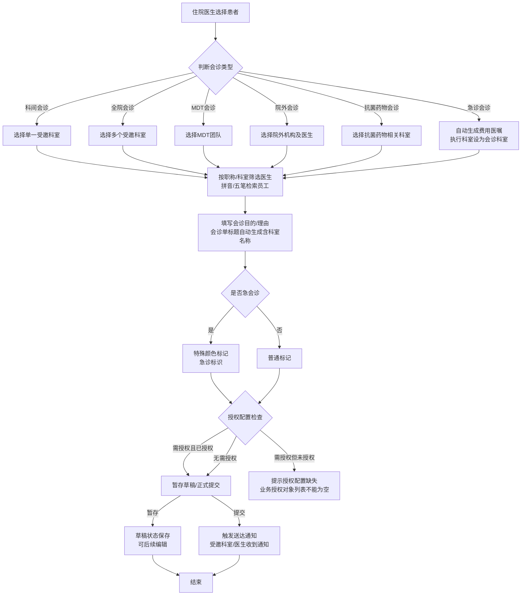
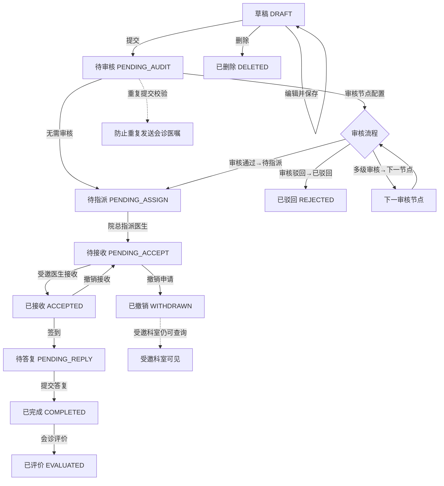

# BLGL-05-HZGL-001 会诊申请_Analyst-Spec

> **需求编号**：BLGL-05-HZGL-001
> **父需求**：BLGL-05-HZGL 会诊管理
> **关联PM Spec**：BLGL-05-HZGL-001_会诊申请_PM-spec.md
> **Spec版本**：V1.0
> **编写时间**：2026-08-21
> **编写人**：RACC

---

## 一、功能编号体系

> 使用带父子层级的 `<功能编号>-ID` 编号，便于追溯和讨论。

### 1.1 功能层级结构

```
BLGL-05-HZGL-001: 会诊申请
  ├─ BLGL-05-HZGL-001-01: 会诊申请创建
  ├─ BLGL-05-HZGL-001-02: 会诊申请编辑与保存
  ├─ BLGL-05-HZGL-001-03: 会诊申请提交
  ├─ BLGL-05-HZGL-001-04: 会诊申请撤销与删除
  └─ BLGL-05-HZGL-001-05: 会诊申请查询
```

> 拆分依据：Phase 1 功能点Spec 第5章中已列出的子功能点。不新增功能清单中不存在的子功能点。

### 1.2 功能编号表

| REQ-ID | 功能名称 | 类型 | 优先级 | 说明 |
|--------|---------|------|--------|------|
| BLGL-05-HZGL-001-01 | 会诊申请创建 | 功能 | P0 | 新建会诊申请，填写患者信息、会诊类型、受邀科室/医生、会诊目的/理由等 |
| BLGL-05-HZGL-001-02 | 会诊申请编辑与保存 | 功能 | P0 | 暂存/编辑会诊申请草稿，支持草稿状态管理 |
| BLGL-05-HZGL-001-03 | 会诊申请提交 | 功能 | P0 | 正式提交会诊申请，触发送达通知给受邀科室/医生 |
| BLGL-05-HZGL-001-04 | 会诊申请撤销与删除 | 功能 | P1 | 撤销/删除已提交的会诊申请，撤销后受邀科室仍可查询 |
| BLGL-05-HZGL-001-05 | 会诊申请查询 | 功能 | P0 | 查询会诊申请列表，支持筛选、排序、导出功能 |

> 类型：功能 / 子功能。优先级与 PM-Spec 一致。功能编号来自 Phase 1 功能点Spec 第5章，子编号从功能清单展开。

---

## 二、核心业务流程

> 每个主流程一个 Mermaid flowchart。**流程步骤必须能在需求原文中找到对应描述，不推测中间步骤。**

### 2.1 会诊申请全流程（主流程）



### 2.2 会诊申请状态流转流程



> 至少 2 个 Mermaid 流程图。每个流程对应一个核心业务场景。

---

## 三、功能规格说明

> 每个 REQ-ID 展开详细描述，包含功能概述、用户角色、业务流程、验收标准。

---

### BLGL-05-HZGL-001-01: 会诊申请创建

#### 3.1.1 功能概述

住院医生根据患者病情需要，选择会诊类型（科间会诊、全院会诊、MDT会诊、院外会诊、抗菌药物会诊、急诊会诊），填写会诊目的和理由，选择受邀科室和医生，创建会诊申请。支持按职称/科室筛选医生，支持拼音/五笔检索员工。急诊会诊支持特殊颜色标记。住院医生站科间会诊时仅允许选择单一科室。急诊科发起会诊时自动生成费用医嘱，执行科室设为会诊科室。

#### 3.1.2 用户角色

| 角色 | 使用场景 | 权限要求 | 操作频率 |
|------|---------|---------|---------|
| 住院医生 | 在住院医生站为患者发起会诊申请 | 需具有会诊申请权限，受会诊授权配置控制 | 中频 |
| 急诊医生 | 在急诊科发起急诊会诊申请 | 需具有会诊申请权限 | 中频 |
| 门诊医生 | 在门诊医生站发起会诊申请 | 需具有会诊申请权限 | 低频 |

> 角色必须在需求原文中出现过。操作频率从需求分析中归纳。

#### 3.1.3 业务流程（Given/When/Then）

##### 主流程（至少 1 个）

**Scenario 1: 住院医生成功创建科间会诊申请**

```gherkin
Given:
  - 住院医生已登录住院医生站，并选择了一位在院患者
  - 系统已配置会诊授权，该医生具有会诊申请权限
  - 患者处于在院状态，未出区

When:
  - 医生选择会诊类型为"科间会诊"
  - 系统显示受邀科室列表，医生选择单一受邀科室
  - 系统按科室筛选出该科室下的医生列表，医生按职称筛选后选择一位受邀医生
  - 系统自动生成会诊单标题，标题中包含会诊科室名称
  - 医生填写会诊目的和会诊理由
  - 若为急会诊，系统以特殊颜色标记该会诊申请
  - 医生点击"暂存"按钮

Then:
  - 系统创建会诊申请记录，状态为"草稿"
  - 会诊申请单标题中包含会诊科室名称，以区分不同科室会诊单
  - 系统返回创建成功提示
  - 会诊申请记录可在草稿列表中查询
```

##### 异常流程（至少 3 个）

**Scenario 2: 科间会诊时选择多个受邀科室（业务异常）**

```gherkin
Given:
  - 住院医生已登录住院医生站，选择了一位在院患者
  - 会诊类型选择为"科间会诊"

When:
  - 医生在受邀科室选择中，试图选择两个或以上科室
  - 系统检测到科间会诊仅允许单一科室

Then:
  - 系统拒绝多科室选择操作
  - 系统提示"科间会诊仅允许选择一个受邀科室"
  - 受邀科室选择状态保持为单一科室
  - 操作日志记录本次违规操作
```

**Scenario 3: 会诊授权配置未设置导致创建失败（数据异常）**

```gherkin
Given:
  - 系统会诊授权配置参数未设置或设置为空
  - 会诊授权配置为"会诊医生"模式
  - 住院医生尝试创建会诊申请

When:
  - 医生填写完会诊信息后点击"保存"
  - 系统进行授权配置检查

Then:
  - 系统提示"业务授权对象列表不能为空"
  - 会诊申请创建失败，数据未保存
  - 医生需联系系统管理员配置会诊授权参数
```

**Scenario 4: 急诊科发起会诊时受邀科室选择报错（系统异常）**

```gherkin
Given:
  - 急诊科医生登录系统
  - 选择会诊类型为"急诊会诊"
  - 系统已配置自动生成费用医嘱，执行科室设为会诊科室

When:
  - 急诊科医生在新建会诊界面选择受邀科室
  - 系统处理科室选择逻辑时出现异常

Then:
  - 系统提示"新建会诊急诊选科室失败，请稍后重试"
  - 已填写的会诊信息保留在界面中不丢失
  - 系统记录异常日志供运维排查
  - 费用医嘱自动生成逻辑暂停执行
```

##### 边界流程（至少 2 个）

**Scenario 5: 患者已出区后仍可创建会诊申请（边界流程）**

```gherkin
Given:
  - 患者已完成住院治疗并办理出区手续
  - 患者状态已变更为"出区"
  - 住院医生需要为该患者发起会诊申请

When:
  - 医生在住院医生站选择该出区患者
  - 填写会诊信息并提交会诊申请

Then:
  - 系统允许对出区患者创建会诊申请
  - 会诊申请正常创建，状态为"已提交"
  - 系统触发送达通知给受邀科室/医生
```

**Scenario 6: 会诊申请中选择住院类型后医生列表仍显示全部就诊类型（边界流程）**

```gherkin
Given:
  - 住院医生创建会诊申请
  - 在会诊申请页面中选择了住院类型（如"普通住院"）

When:
  - 医生在受邀医生选择区域查看医生列表
  - 医生切换筛选条件查看不同科室医生

Then:
  - 医生列表仍显示全部就诊类型的医生，不受住院类型选择影响
  - 医生可按职称/科室进一步筛选
  - 支持拼音/五笔检索员工
```

#### 3.1.5 验收标准

| AC编号 | 验收标准 | 对应REQ-ID | 验证方法 | 验证场景 |
|--------|---------|-----------|---------|---------|
| AC-001 | 住院医生可为在院患者成功创建科间会诊申请，选择单一科室，生成含科室名称的会诊单标题 | BLGL-05-HZGL-001-01 | 功能测试 | Scenario 1 |
| AC-002 | 科间会诊选择多个科室时系统拒绝并给出明确提示 | BLGL-05-HZGL-001-01 | 功能测试 | Scenario 2 |
| AC-003 | 会诊授权配置未设置时创建申请给出明确提示 | BLGL-05-HZGL-001-01 | 功能测试 | Scenario 3 |
| AC-004 | 急诊科发起会诊时选科室异常应有错误提示且保留已填信息 | BLGL-05-HZGL-001-01 | 功能测试 | Scenario 4 |
| AC-005 | 患者出区后仍可正常创建会诊申请 | BLGL-05-HZGL-001-01 | 功能测试 | Scenario 5 |
| AC-006 | 选择住院类型后医生列表仍显示全部就诊类型医生 | BLGL-05-HZGL-001-01 | 功能测试 | Scenario 6 |
| AC-007 | 支持六种会诊类型选择（科间/全院/MDT/院外/抗菌药物/急诊） | BLGL-05-HZGL-001-01 | 功能测试 | Scenario 1 |
| AC-008 | 支持按职称/科室筛选医生，支持拼音/五笔检索员工 | BLGL-05-HZGL-001-01 | 功能测试 | Scenario 1 |
| AC-009 | 急诊会诊以特殊颜色标记 | BLGL-05-HZGL-001-01 | 功能测试 | Scenario 1 |
| AC-010 | 急诊科发起会诊时自动生成费用医嘱，执行科室设为会诊科室 | BLGL-05-HZGL-001-01 | 功能测试 | ⏳ 待确认 |

---

### BLGL-05-HZGL-001-02: 会诊申请编辑与保存

#### 3.2.1 功能概述

医生对已创建的会诊申请草稿进行编辑和保存操作。支持暂存草稿状态，草稿可在后续继续编辑。草稿保存时对必填项进行校验，确保数据完整性。编辑时支持修改会诊类型、受邀科室/医生、会诊目的/理由等信息。

#### 3.2.2 用户角色

| 角色 | 使用场景 | 权限要求 | 操作频率 |
|------|---------|---------|---------|
| 住院医生 | 编辑已暂存的会诊申请草稿 | 仅可编辑本人创建的草稿 | 中频 |
| 急诊医生 | 编辑急诊会诊申请草稿 | 仅可编辑本人创建的草稿 | 中频 |

> 角色必须在需求原文中出现过。操作频率从需求分析中归纳。

#### 3.2.3 业务流程（Given/When/Then）

##### 主流程（至少 1 个）

**Scenario 1: 医生编辑草稿并保存成功**

```gherkin
Given:
  - 住院医生已登录系统
  - 存在一条状态为"草稿"的会诊申请记录，创建人为该医生
  - 草稿中已填写了部分会诊信息（会诊类型、受邀科室）

When:
  - 医生打开该草稿进行编辑
  - 修改会诊目的，补充会诊理由
  - 调整受邀医生为其他医生
  - 点击"保存"按钮

Then:
  - 系统更新会诊申请记录，保存修改内容
  - 会诊申请状态保持为"草稿"
  - 系统提示"保存成功"
  - 编辑历史记录在操作日志中
```

##### 异常流程（至少 3 个）

**Scenario 2: 编辑已被提交的会诊申请（业务异常）**

```gherkin
Given:
  - 住院医生已登录系统
  - 存在一条状态为"已提交"的会诊申请记录
  - 医生尝试编辑该申请

When:
  - 医生在会诊申请列表中点击"编辑"按钮
  - 系统检查该申请状态为"已提交"

Then:
  - 系统拒绝编辑操作
  - 提示"已提交的会诊申请不可编辑，如需修改请先撤销"
  - 界面不进入编辑模式
```

**Scenario 3: 保存草稿时必填项缺失（数据异常）**

```gherkin
Given:
  - 住院医生编辑一条会诊申请草稿
  - 草稿中会诊目的字段为空

When:
  - 医生点击"保存"按钮
  - 系统进行必填项校验

Then:
  - 系统提示"会诊目的为必填项，请填写完整"
  - 会诊目的字段高亮标记
  - 草稿未保存，已填写内容不丢失
```

**Scenario 4: 编辑草稿时系统超时（系统异常）**

```gherkin
Given:
  - 住院医生正在编辑会诊申请草稿
  - 编辑过程中网络连接中断或会话超时

When:
  - 医生完成编辑后点击"保存"
  - 系统请求因超时未到达服务器

Then:
  - 前端提示"保存失败，网络连接超时，请稍后重试"
  - 浏览器本地暂存编辑内容，防止数据丢失
  - 恢复连接后医生可重新提交保存
```

##### 边界流程（至少 2 个）

**Scenario 5: 草稿经多次编辑后保存（边界流程）**

```gherkin
Given:
  - 一条会诊申请草稿已被编辑并保存超过10次
  - 每次编辑均修改了会诊目的/理由等核心字段

When:
  - 医生再次打开草稿进行编辑
  - 修改会诊科室后点击"保存"

Then:
  - 系统正常保存所有修改内容
  - 草稿状态保持为"草稿"
  - 操作日志记录每次编辑的变更内容
  - 草稿版本号递增
```

**Scenario 6: 草稿长期未编辑后继续编辑（边界流程）**

```gherkin
Given:
  - 一条会诊申请草稿创建时间超过7天
  - 期间患者可能已转科或出区
  - 医生仍然可以访问该草稿

When:
  - 医生打开该草稿
  - 系统提示"该草稿创建于7天前，请确认患者当前状态"
  - 医生确认后编辑草稿内容并保存

Then:
  - 系统允许编辑并保存草稿
  - 会诊申请单标题中科室名称保持原样
  - 保存成功
```

#### 3.2.5 验收标准

| AC编号 | 验收标准 | 对应REQ-ID | 验证方法 | 验证场景 |
|--------|---------|-----------|---------|---------|
| AC-011 | 医生可编辑本人创建的草稿并成功保存，状态保持为草稿 | BLGL-05-HZGL-001-02 | 功能测试 | Scenario 1 |
| AC-012 | 已提交的会诊申请不可编辑，系统给出明确提示 | BLGL-05-HZGL-001-02 | 功能测试 | Scenario 2 |
| AC-013 | 保存草稿时必填项缺失系统提示并高亮标记 | BLGL-05-HZGL-001-02 | 功能测试 | Scenario 3 |
| AC-014 | 网络超时时有明确提示且本地暂存编辑内容 | BLGL-05-HZGL-001-02 | 功能测试 | Scenario 4 |
| AC-015 | 草稿多次编辑保存后数据完整，操作日志可追溯 | BLGL-05-HZGL-001-02 | 功能测试 | Scenario 5 |
| AC-016 | 长期未编辑的草稿可继续编辑，系统给出提示 | BLGL-05-HZGL-001-02 | 功能测试 | Scenario 6 |

---

### BLGL-05-HZGL-001-03: 会诊申请提交

#### 3.3.1 功能概述

医生将已填写完整的会诊申请正式提交，系统触发送达通知给受邀科室/医生。提交时进行完整性校验和业务规则校验，包括防止重复发送会诊医嘱、会诊授权配置检查等。新会诊流程中，当参数PAR00235为1时，受邀科室不指定医生，受邀科室查询页默认不勾选本人。

#### 3.3.2 用户角色

| 角色 | 使用场景 | 权限要求 | 操作频率 |
|------|---------|---------|---------|
| 住院医生 | 提交会诊申请，触发送达通知 | 需具有会诊申请提交权限 | 中频 |
| 急诊医生 | 提交急诊会诊申请 | 需具有会诊申请提交权限 | 中频 |

> 角色必须在需求原文中出现过。操作频率从需求分析中归纳。

#### 3.3.3 业务流程（Given/When/Then）

##### 主流程（至少 1 个）

**Scenario 1: 医生成功提交会诊申请并触发送达通知**

```gherkin
Given:
  - 住院医生已登录系统
  - 会诊申请已填写完整（会诊类型、受邀科室/医生、会诊目的/理由）
  - 会诊授权配置已正确设置
  - 系统参数PAR00235为0（不开启"不指定医生"模式）

When:
  - 医生点击"提交"按钮
  - 系统进行完整性校验
  - 系统进行重复发送校验，确认未重复发送
  - 系统进行授权配置校验
  - 系统提交会诊申请

Then:
  - 会诊申请状态变更为"已提交"
  - 系统触发送达通知给受邀科室和受邀医生
  - 通知通过诊疗协作框/消息中心推送
  - 会诊申请记录在受邀科室的待处理列表中可见
  - 操作日志记录提交时间、操作人
```

##### 异常流程（至少 3 个）

**Scenario 2: 重复提交会诊申请（业务异常）**

```gherkin
Given:
  - 住院医生已为当前患者和当前科室成功提交过一次会诊申请
  - 该会诊申请状态为"已提交"，尚未被撤销或完成

When:
  - 医生再次以相同患者和相同科室发起会诊申请
  - 点击"提交"按钮
  - 系统进行重复发送校验

Then:
  - 系统检测到已存在相同患者和科室的待处理会诊申请
  - 系统提示"该患者已向该科室发送会诊申请，请勿重复发送"
  - 提交操作被阻止
  - 防止重复发送会诊医嘱
```

**Scenario 3: 提交时参数PAR00235为1，受邀科室不指定医生（业务异常/权限场景）**

```gherkin
Given:
  - 系统参数PAR00235设置为1
  - 住院医生填写会诊申请，选择受邀科室
  - 系统配置为"不指定医生"模式
  - 受邀科室查询页默认不勾选本人

When:
  - 医生在受邀医生选择区域查看
  - 系统自动隐藏医生选择功能，仅显示科室选择
  - 医生提交会诊申请

Then:
  - 会诊申请仅指定受邀科室，不指定具体医生
  - 受邀科室所有医生均可在待处理列表中查看该申请
  - 受邀科室查询页默认不勾选本人
  - 提交成功，通知发送至受邀科室
```

**Scenario 4: 提交时系统接口异常导致提交失败（系统异常）**

```gherkin
Given:
  - 住院医生填写完整的会诊申请
  - 点击"提交"按钮
  - 后端消息推送服务不可用

When:
  - 系统完成会诊申请记录创建
  - 尝试触发送达通知时失败

Then:
  - 系统提示"提交成功，但通知发送失败，请联系管理员"
  - 会诊申请状态已变更为"已提交"
  - 系统记录通知发送失败日志
  - 系统进入重试机制，间隔一定时间后自动重试发送通知
  - 医生可在会诊申请列表中查看该申请状态
```

##### 边界流程（至少 2 个）

**Scenario 5: 住院医生站等三模块提交时取消默认勾选、增病区筛选（边界流程）**

```gherkin
Given:
  - 住院医生登录住院医生站
  - 系统已优化：取消默认勾选、新增病区筛选功能
  - 病区筛选范围限定为该医生的权限科室

When:
  - 医生在会诊提交界面查看受邀医生列表
  - 医生使用病区筛选功能，选择特定病区
  - 医生提交会诊申请

Then:
  - 受邀医生列表默认不勾选任何医生
  - 病区筛选结果仅显示该医生权限科室下的病区
  - 提交成功后，受邀医生可正常接收
```

**Scenario 6: 会诊申请提交时职称下拉框缺失医师类选项（边界流程）**

```gherkin
Given:
  - 住院医生填写会诊申请
  - 在受邀医生筛选区域使用职称筛选功能
  - 系统职称配置数据中已包含"医师"类职称

When:
  - 医生点击职称下拉框查看可选职称
  - 筛选条件中应包含"住院医师"、"主治医师"、"副主任医师"、"主任医师"等

Then:
  - 职称下拉框完整显示所有医师类选项
  - 选择"住院医师"后，医生列表仅显示该职称的医生
  - 职称配置可正常保存，无保存失败问题
```

#### 3.3.5 验收标准

| AC编号 | 验收标准 | 对应REQ-ID | 验证方法 | 验证场景 |
|--------|---------|-----------|---------|---------|
| AC-017 | 提交会诊申请后状态变更为"已提交"，通知发送至受邀科室/医生 | BLGL-05-HZGL-001-03 | 功能测试 | Scenario 1 |
| AC-018 | 重复提交相同患者和科室的会诊申请被阻止 | BLGL-05-HZGL-001-03 | 功能测试 | Scenario 2 |
| AC-019 | PAR00235=1时不指定医生，受邀科室查询页默认不勾选本人 | BLGL-05-HZGL-001-03 | 功能测试 | Scenario 3 |
| AC-020 | 通知发送失败时不影响申请提交，有重试机制 | BLGL-05-HZGL-001-03 | 功能测试 | Scenario 4 |
| AC-021 | 住院医生站提交时默认不勾选，病区筛选范围限权限科室 | BLGL-05-HZGL-001-03 | 功能测试 | Scenario 5 |
| AC-022 | 职称下拉框完整显示医师类选项，职称配置可正常保存 | BLGL-05-HZGL-001-03 | 功能测试 | Scenario 6 |

---

### BLGL-05-HZGL-001-04: 会诊申请撤销与删除

#### 3.4.1 功能概述

医生对已提交的会诊申请进行撤销操作，或对草稿状态的会诊申请进行删除操作。撤销后的会诊申请状态变更为"已撤销"，但受邀科室仍可查询该申请记录。删除操作用于清理草稿，删除后不可恢复。

#### 3.4.2 用户角色

| 角色 | 使用场景 | 权限要求 | 操作频率 |
|------|---------|---------|---------|
| 住院医生 | 撤销已提交的会诊申请或删除草稿 | 仅可撤销/删除本人创建的申请 | 低频 |
| 急诊医生 | 撤销已提交的急诊会诊申请 | 仅可撤销/删除本人创建的申请 | 低频 |

> 角色必须在需求原文中出现过。操作频率从需求分析中归纳。

#### 3.4.3 业务流程（Given/When/Then）

##### 主流程（至少 1 个）

**Scenario 1: 医生成功撤销已提交的会诊申请**

```gherkin
Given:
  - 住院医生已登录系统
  - 存在一条状态为"已提交"的会诊申请记录，创建人为该医生
  - 该申请尚未被审核或接收

When:
  - 医生在会诊申请列表中选中该申请
  - 点击"撤销"按钮
  - 系统弹出确认对话框"确认撤销该会诊申请？"
  - 医生确认撤销操作

Then:
  - 会诊申请状态变更为"已撤销"
  - 系统发送撤销通知给受邀科室
  - 受邀科室仍可查询到该会诊申请记录（状态为已撤销）
  - 操作日志记录撤销操作
```

##### 异常流程（至少 3 个）

**Scenario 2: 撤销已被接收的会诊申请（业务异常）**

```gherkin
Given:
  - 住院医生已登录系统
  - 存在一条会诊申请，状态为"已接收"
  - 受邀医生已经接收了该会诊任务

When:
  - 医生尝试撤销该申请
  - 点击"撤销"按钮

Then:
  - 系统提示"该会诊申请已被接收，无法撤销，如需取消请联系会诊科室"
  - 撤销操作被拒绝
  - 申请状态保持不变
```

**Scenario 3: 删除草稿后数据保留追溯（数据异常）**

```gherkin
Given:
  - 住院医生已登录系统
  - 存在一条状态为"草稿"的会诊申请记录
  - 医生决定删除该草稿

When:
  - 医生点击"删除"按钮
  - 系统提示确认删除
  - 医生确认删除

Then:
  - 系统将草稿标记为"已删除"（逻辑删除）
  - 系统保留操作日志，记录删除时间、操作人
  - 草稿不再出现在普通查询列表中
  - 受邀科室仍可查询到该记录（如有过提交记录）
```

**Scenario 4: 撤销操作时系统事务异常（系统异常）**

```gherkin
Given:
  - 住院医生正在执行撤销操作
  - 已确认撤销对话框

When:
  - 系统更新状态时数据库连接异常
  - 状态更新事务未提交

Then:
  - 系统提示"撤销操作失败，请稍后重试"
  - 会诊申请状态保持不变（未撤销）
  - 系统记录异常日志，包含事务回滚信息
  - 医生可再次尝试撤销操作
```

##### 边界流程（至少 2 个）

**Scenario 5: 撤销后受邀科室仍可查询（边界流程）**

```gherkin
Given:
  - 会诊申请已被撤销，状态为"已撤销"
  - 受邀科室医生登录系统

When:
  - 受邀科室医生在会诊查询页面查看所有会诊申请
  - 筛选条件包含已撤销的申请

Then:
  - 该已撤销的会诊申请出现在查询结果中
  - 列表中显示状态为"已撤销"
  - 受邀科室可查看该申请的详细信息（会诊目的、科室名称等）
  - 系统不会将该申请计入待处理统计
```

**Scenario 6: 删除已撤销的申请记录（边界流程）**

```gherkin
Given:
  - 一条会诊申请状态为"已撤销"
  - 申请医生希望彻底删除该记录

When:
  - 医生在列表中选中该已撤销申请
  - 点击"删除"按钮

Then:
  - 系统提示"已撤销的申请可删除，删除后受邀科室仍可查询历史记录"
  - 医生确认后，系统标记为逻辑删除
  - 受邀科室仍可查询到该记录的历史信息
  - 申请医生的列表中将不再显示该记录
```

#### 3.4.5 验收标准

| AC编号 | 验收标准 | 对应REQ-ID | 验证方法 | 验证场景 |
|--------|---------|-----------|---------|---------|
| AC-023 | 医生可撤销本人已提交的会诊申请，状态变更为已撤销 | BLGL-05-HZGL-001-04 | 功能测试 | Scenario 1 |
| AC-024 | 已被接收的会诊申请无法撤销，系统给出明确提示 | BLGL-05-HZGL-001-04 | 功能测试 | Scenario 2 |
| AC-025 | 删除草稿后操作日志可追溯，受邀科室仍可查询历史记录 | BLGL-05-HZGL-001-04 | 功能测试 | Scenario 3 |
| AC-026 | 撤销时数据库异常不影响已有数据，状态保持不变 | BLGL-05-HZGL-001-04 | 功能测试 | Scenario 4 |
| AC-027 | 撤销后的申请受邀科室仍可查询，显示已撤销状态 | BLGL-05-HZGL-001-04 | 功能测试 | Scenario 5 |
| AC-028 | 已撤销的申请可删除，受邀科室仍可查询历史记录 | BLGL-05-HZGL-001-04 | 功能测试 | Scenario 6 |

---

### BLGL-05-HZGL-001-05: 会诊申请查询

#### 3.5.1 功能概述

医生查询会诊申请列表，支持按多种条件筛选（会诊类型、科室、医生、状态、时间等），支持自定义排序，支持导出功能。列表展示字段包括：科室名称、会诊目的、会诊医生、病人状态、床位号、病区。会诊单标题增加会诊科室名称以区分不同科室会诊单。住院医生站会诊列表增加科室名称和床位号与病区信息显示。

#### 3.5.2 用户角色

| 角色 | 使用场景 | 权限要求 | 操作频率 |
|------|---------|---------|---------|
| 住院医生 | 查看本人发起/涉及的会诊申请列表 | 可查看本人相关记录 | 高频 |
| 受邀科室医生 | 查看本科室待处理的会诊申请 | 可查看本科室相关记录 | 高频 |
| 护士 | 查看患者会诊状态 | 可查看相关记录 | 中频 |

> 角色必须在需求原文中出现过。操作频率从需求分析中归纳。

#### 3.5.3 业务流程（Given/When/Then）

##### 主流程（至少 1 个）

**Scenario 1: 医生查询会诊申请列表并进行筛选排序**

```gherkin
Given:
  - 医生已登录系统
  - 系统中有多条会诊申请记录，状态包括草稿/已提交/已撤销/已接收等
  - 会诊列表中应展示：科室名称、会诊目的、会诊医生、病人状态、床位号、病区

When:
  - 医生进入会诊申请查询页面
  - 系统默认展示会诊申请列表，带默认筛选条件（如：本月数据）
  - 医生选择会诊类型筛选条件为"科间会诊"
  - 医生选择状态筛选条件为"已提交"
  - 医生按"提交时间"降序排序
  - 医生查看列表中的会诊单标题，标题中包含会诊科室名称

Then:
  - 列表刷新显示符合条件的会诊申请记录
  - 每条记录展示：科室名称、会诊目的、会诊医生、病人状态、床位号、病区
  - 会诊单标题包含会诊科室名称，不同科室会诊单可通过标题区分
  - 排序结果按提交时间从新到旧排列
  - 列表支持分页显示
```

##### 异常流程（至少 3 个）

**Scenario 2: 查询结果为空（业务异常）**

```gherkin
Given:
  - 医生已登录系统
  - 当前无任何会诊申请记录
  - 或筛选条件过于严格无匹配结果

When:
  - 医生进入会诊申请查询页面
  - 或医生设置筛选条件后点击查询

Then:
  - 系统显示"暂无数据"或"未找到匹配的会诊申请"
  - 列表区域展示空状态提示
  - 筛选条件保留，医生可调整条件重新查询
```

**Scenario 3: 会诊列表缺失"会诊目的"列（数据异常）**

```gherkin
Given:
  - 医生进入会诊申请查询列表
  - 新会诊系统列表配置中会诊目的列缺失

When:
  - 医生查看会诊申请列表
  - 列表展示列中未看到"会诊目的"列

Then:
  - 系统应确保会诊列表包含"会诊目的"列
  - 该列展示会诊申请时填写的会诊目的内容
  - 若列缺失，系统需修复后重新加载
  - 医生可在列表中直接查看会诊目的，无需进入详情页
```

**Scenario 4: 查询接口响应超时（系统异常）**

```gherkin
Given:
  - 医生已登录系统
  - 系统会诊数据量较大（如超过10000条）
  - 查询条件组合复杂

When:
  - 医生点击"查询"按钮
  - 后端查询接口响应超过5秒

Then:
  - 前端显示"查询超时，请简化筛选条件后重试"
  - 系统提供"使用默认筛选条件"的快捷入口
  - 列表区域保持上次查询结果
  - 系统记录慢查询日志供优化参考
```

##### 边界流程（至少 2 个）

**Scenario 5: 住院医生站会诊列表新增床位号与病区信息显示（边界流程）**

```gherkin
Given:
  - 住院医生登录住院医生站
  - 进入会诊界面
  - 系统已优化：会诊列表新增床位号与病区信息显示

When:
  - 医生查看会诊申请列表
  - 医生查看列表中的字段

Then:
  - 列表展示字段中包含"床位号"列
  - 列表展示字段中包含"病区"列
  - 床位号与病区信息与患者当前住院信息一致
  - 列表中同时展示科室名称、会诊目的、会诊医生、病人状态
```

**Scenario 6: 会诊申请默认筛选与自定义排序功能（边界流程）**

```gherkin
Given:
  - 医生登录系统进入会诊申请查询页面
  - 系统配置了默认筛选条件
  - 医生有自定义排序需求

When:
  - 页面加载后将应用默认筛选条件
  - 医生点击列表表头的"提交时间"列进行排序
  - 医生点击"会诊类型"列进行二次排序

Then:
  - 页面加载时默认筛选条件生效（如：显示本月未完成的会诊申请）
  - 列表支持单列排序（升序/降序切换）
  - 列表支持多列组合排序（如：先按会诊类型排序，再按提交时间排序）
  - 排序指示器显示当前排序状态（升序/降序箭头）
  - 自定义排序在刷新页面后保留 ⏳ 待确认
```

#### 3.5.5 验收标准

| AC编号 | 验收标准 | 对应REQ-ID | 验证方法 | 验证场景 |
|--------|---------|-----------|---------|---------|
| AC-029 | 会诊申请列表展示科室名称、会诊目的、会诊医生、病人状态、床位号、病区 | BLGL-05-HZGL-001-05 | 功能测试 | Scenario 1 |
| AC-030 | 无查询结果时显示空状态提示 | BLGL-05-HZGL-001-05 | 功能测试 | Scenario 2 |
| AC-031 | 会诊列表包含"会诊目的"列 | BLGL-05-HZGL-001-05 | 功能测试 | Scenario 3 |
| AC-032 | 查询超时时系统给出明确提示并提供简化条件入口 | BLGL-05-HZGL-001-05 | 功能测试 | Scenario 4 |
| AC-033 | 住院医生站会诊列表展示床位号和病区信息 | BLGL-05-HZGL-001-05 | 功能测试 | Scenario 5 |
| AC-034 | 支持默认筛选和自定义排序，排序状态可保留 | BLGL-05-HZGL-001-05 | 功能测试 | Scenario 6 |
| AC-035 | 会诊单标题包含会诊科室名称 | BLGL-05-HZGL-001-05 | 功能测试 | Scenario 1 |
| AC-036 | 住院医生站会诊列表增加科室名称 | BLGL-05-HZGL-001-05 | 功能测试 | Scenario 5 |

---

## 四、排除范围

本需求不包含以下功能项：

1. **会诊审核** - 会诊申请的审核流程（审核通过/驳回），归属于 BLGL-05-HZGL-002 会诊审核
2. **会诊接收与指派** - 院总/科室管理员接收会诊任务并指派给具体会诊医生，归属于 BLGL-05-HZGL-004 会诊接收与指派
3. **会诊签到** - 会诊医生到场签到确认，归属于 BLGL-05-HZGL-005 会诊签到
4. **会诊答复与记录** - 会诊医生提交会诊意见、诊断、治疗建议，生成会诊记录，归属于 BLGL-05-HZGL-003 会诊答复与记录
5. **会诊计费** - 会诊费用计算和账单生成，与HIS/医嘱系统交互，归属于 BLGL-05-HZGL-006 会诊计费
6. **会诊评价与反馈** - 对会诊过程进行评价和反馈，归属于 BC-HZGL-001 基础能力
7. **会诊配置管理** - 会诊参数、审核流程、计费规则、科室映射等配置，归属于 BC-HZGL-003 基础能力
8. **会诊查询与统计** - 跨会诊全流程的综合查询和统计报表，归属于 BC-HZGL-002 基础能力

> 与 PM-Spec 第四章保持一致。对照 Phase 1 功能点Spec 第6章（基线能力），确保不越界。

---

## 五、业务规则清单

| 规则ID | 规则名称 | 规则描述 | 来源 | 优先级 |
|--------|---------|---------|------|--------|
| BR-001 | 会诊类型范围规则 | 支持六种会诊类型：科间会诊、全院会诊、MDT会诊、院外会诊、抗菌药物会诊、急诊会诊 | 需求要点 | P0 |
| BR-002 | 科间会诊科室选择限制 | 住院医生站科间会诊时仅允许选择单一受邀科室 | 需求要点 | P0 |
| BR-003 | 医生筛选与检索规则 | 支持按职称/科室筛选医生，支持拼音/五笔检索员工 | 需求要点 | P0 |
| BR-004 | 急诊会诊颜色标记规则 | 急诊会诊以特殊颜色标记，区别于普通会诊 | 需求要点 | P0 |
| BR-005 | 会诊列表展示字段规则 | 会诊列表展示：科室名称、会诊目的、会诊医生、病人状态、床位号、病区 | 需求要点 | P0 |
| BR-006 | 会诊单标题规则 | 会诊单标题增加会诊科室名称，以区分不同科室会诊单 | 需求要点 | P0 |
| BR-007 | 撤销后数据可见规则 | 会诊申请单撤销删除后受邀科室仍可查询历史记录 | 需求要点 | P0 |
| BR-008 | 出区后可申请规则 | 患者出区后仍可申请会诊 | 需求要点 | P0 |
| BR-009 | 重复发送防止规则 | 防止重复发送会诊医嘱，相同患者和科室的待处理会诊申请不可重复提交 | 需求要点 | P0 |
| BR-010 | 会诊授权配置规则 | 会诊授权配置控制申请权限，未配置时提示业务授权对象列表不能为空 | 需求要点 | P0 |
| BR-011 | 住院类型与医生列表规则 | 会诊申请中选择住院类型后，后续医生仍显示全部就诊类型 | 需求要点 | P1 |
| BR-012 | PAR00235参数规则 | 新会诊流程中PAR00235为1时，受邀科室不指定医生，查询页默认不勾选本人 | 需求要点 | P1 |
| BR-013 | 住院医生站默认勾选规则 | 住院医生站等三模块优化：取消默认勾选、增病区筛选（限权限科室） | 需求要点 | P1 |
| BR-014 | 床位号与病区显示规则 | 住院医生站会诊界面新增床位号与病区信息显示 | 需求要点 | P1 |
| BR-015 | 急诊费用医嘱规则 | 急诊科发起会诊时自动生成费用医嘱，执行科室设为会诊科室 | 需求要点 | P1 |
| BR-016 | 急诊选科室规则 | 会诊管理系统新建会诊急诊的选科室直接报错处理 | 需求要点 | P1 |
| BR-017 | 职称下拉框完整规则 | 新会诊审批流程中职称下拉框完整包含医师类选项（住院医师/主治医师/副主任医师/主任医师等） | 需求要点 | P1 |
| BR-018 | 职称配置保存规则 | 新会诊系统职称配置后可正常保存，无保存失败问题 | 需求要点 | P1 |
| BR-019 | 草稿状态管理规则 | 草稿状态的会诊申请可编辑和保存，保存后状态保持为草稿 | 需求分析 | P0 |
| BR-020 | 提交校验规则 | 提交会诊申请前需进行完整性校验、重复发送校验和授权配置校验 | 需求分析 | P0 |
| BR-021 | 逻辑删除规则 | 会诊申请删除采用逻辑删除方式，保留数据可追溯 | 需求分析 | P1 |
| BR-022 | 通知发送规则 | 会诊申请提交后触发送达通知给受邀科室/医生，通知失败时进入重试机制 | 需求分析 | P0 |

> 每条 BR 注明来源需求编号。规则描述必须能从需求原文中逐字对应，不得概括后失去原意。优先级与 PM-Spec 保持一致。

---

## 六、关联文档

| 文档类型 | 文档路径 | 说明 |
|---------|---------|------|
| 功能点Spec | 上级目录 BLGL-05-HZGL 05会诊管理功能点Spec.md（V1.0） | Phase 1 功能点索引 |
| PM spec | 本目录 BLGL-05-HZGL-001_会诊申请_PM-spec.md（V0.1） | PM 产出的 Spec 文档 |
| -Spec | 本目录 BLGL-05-HZGL-001_会诊申请-Spec.md（V1.0） | Spec（研发视角） |
| data-model.md | 待产出 | 架构师产出的数据建模文档 |
| design.md | 待产出 | 架构师产出的技术方案文档 |
| api-contract.md | 待产出 | 开发经理产出的 API 契约文档 |

> 第1行必须引用 Phase 1 功能点Spec。

---

## 七、待确认问题清单

| 编号 | 问题描述 | 缺失信息 | 影响范围 | 建议补充方 |
|------|---------|---------|---------|-----------|
| Q-001 | 急诊科发起会诊时自动生成费用医嘱的具体规则需明确：费用医嘱的计费标准、生成时机（提交时或创建时）、医嘱类型的模板配置 | 费用医嘱生成的详细业务规则 | 3.1.3 Scenario 1, AC-010 | 产品经理 |
| Q-002 | 会诊授权配置的详细控制粒度需明确：是按角色、按科室、按医生个人，还是按会诊类型分别控制 | 授权配置的详细控制规则 | 3.1.3 Scenario 3, BR-010 | 产品经理 |
| Q-003 | 会诊申请列表的默认筛选条件具体是什么（如：本月数据、未完成数据、本人相关数据），不同登录端（住院医生站/急诊/门诊）是否不同 | 默认筛选条件的具体配置 | 3.5.3 Scenario 6, AC-034 | 产品经理 |
| Q-004 | 自定义排序状态在刷新页面后是否保留，保留策略是什么（本地存储/服务端保存/仅当前会话） | 排序状态保留策略 | 3.5.3 Scenario 6 | 架构师 |
| Q-005 | 会诊申请草稿的保存期限是否有要求？长期未编辑的草稿是否应自动清理或归档 | 草稿保存期限策略 | 3.2.3 Scenario 6 | 产品经理 |
| Q-006 | 急会诊的特殊颜色标记具体使用什么颜色方案？是否有行业标准或医院特定要求 | 颜色标记的具体方案 | 3.1.3 Scenario 1, BR-004 | 产品经理 |
| Q-007 | 受邀科室查询页中"默认不勾选本人"的具体逻辑：是否所有查询场景都不勾选，还是仅限特定查询入口 | 查询页默认勾选逻辑的详细说明 | 3.3.3 Scenario 3, BR-012 | 产品经理 |
| Q-008 | 会诊管理系统新建会诊急诊的选科室直接报错的具体错误场景是什么？是科室列表为空导致的报错，还是权限校验导致的报错，还是其他原因 | 急诊选科室报错的具体场景和原因 | BR-016 | 产品经理 |
| Q-009 | 会诊申请单撤销删除后受邀科室仍可查询，查询时是否可查看完整的会诊详情（包括会诊目的、受邀医生等），还是仅可查看摘要信息 | 撤销后受邀科室查询的可见范围 | 3.4.3 Scenario 5, BR-007 | 产品经理 |
| Q-010 | 新会诊系统职称配置后无法保存问题的具体表现是什么？是前端校验问题、后端接口问题还是数据格式问题 | 职称配置保存失败的具体原因 | BR-018 | 研发工程师 |
| Q-011 | 会诊申请查询的导出功能支持哪些格式（Excel/PDF/CSV），导出字段是否与列表展示字段一致 | 导出功能的具体格式和字段范围 | 3.5.1 功能概述 | 产品经理 |
| Q-012 | 住院医生站等三模块优化中"三模块"具体指哪三个模块？优化范围是否仅限住院医生站，还是包括急诊医生站和门诊医生站 | "三模块"的具体指向 | BR-013 | 产品经理 |

> 逐条列出全文所有 `⏳ 待确认` 项。

---

## 填写检查清单

| 序号 | 检查项 | 是否完成 |
|:----:|--------|:--------:|
| 1 | 功能编号带父子层级 | ✅ |
| 2 | 每个 REQ-ID 有功能概述和用户角色 | ✅ |
| 3 | 主流程至少 1 个 Given/When/Then 场景 | ✅ |
| 4 | 异常流程至少 3 个 Given/When/Then 场景 | ✅ |
| 5 | 边界流程至少 2 个 Given/When/Then 场景 | ✅ |
| 6 | 每个 Given/When/Then 内容具体，不模糊 | ✅ |
| 7 | 验收标准 AC 编号独立，可验证 | ✅ |
| 8 | 每个子功能点含验收标准 | ✅ |
| 9 | 验收标准无"功能正常"等模糊表述 | ✅ |
| 10 | 排除范围明确列出 | ✅ |
| 11 | 业务规则清单列出所有规则，每条标注来源 | ✅ |
| 12 | 流程图使用 Mermaid 格式（≥2 个） | ✅ |
| 13 | 关联文档索引包含 Phase 1 功能点Spec | ✅ |
| 14 | 待确认问题清单汇总了全文所有 ⏳ 项 | ✅ |
| 15 | 全文无占位符 `< >` 残留 | ✅ |
| 16 | 全文陈述可溯源至资料区（S1~S10 溯源核查） | ✅ |
| 17 | 人工审核确认完成 | ⏳ 待确认 |

---

**文档状态**：⬜ 待审核
**维护责任**：需求分析师规范组
**下次更新**：根据评审反馈优化

---

## 版本历史

| 版本 | 日期 | 变更说明 | 编写人 |
|------|------|---------|--------|
| V1.0 | 2026-08-21 | 初始版本 | RACC |