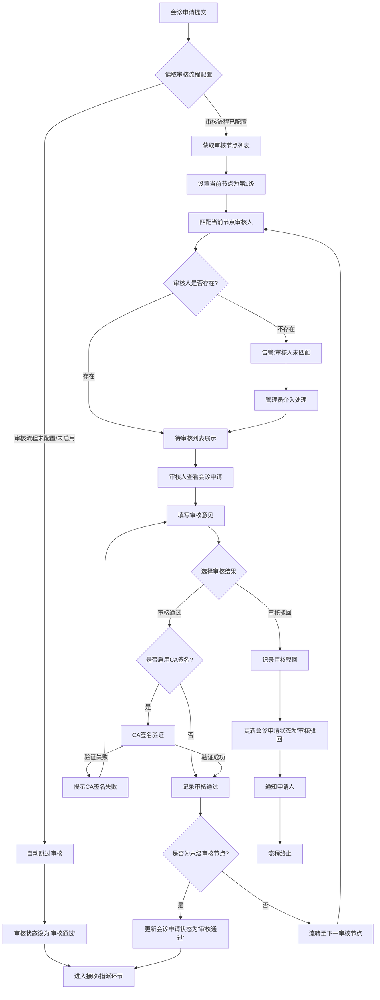
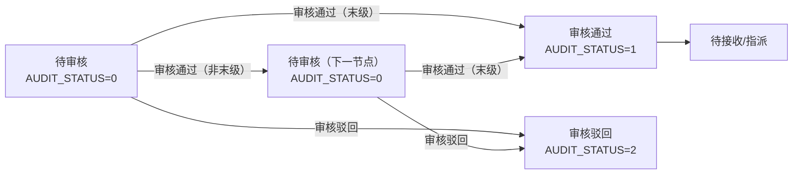
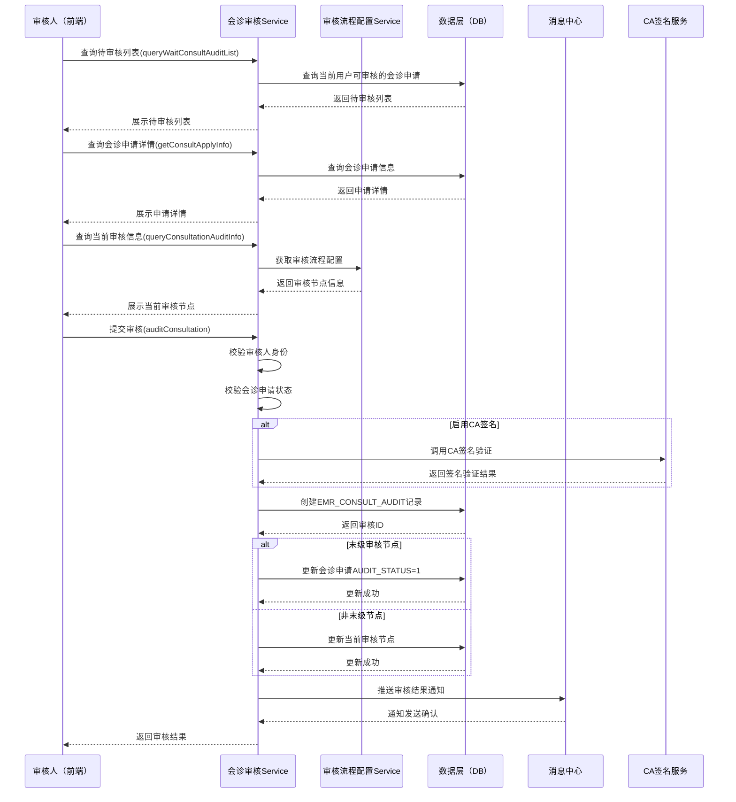
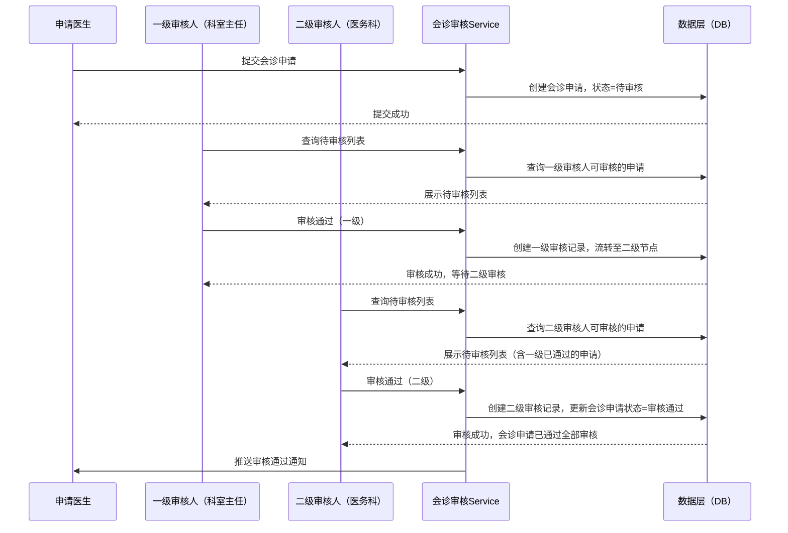

# BLGL-05-HZGL-002 会诊审核 - Spec

> **功能编号**：BLGL-05-HZGL-002
> **文档类型**：Spec（研发视角）
> **文档版本**：V1.0
> **编写时间**：2026-08-21
> **编写人**：RACC

---

## 文档索引

本节提供本文档的章节结构索引与关联文档索引，便于读者快速定位与检索。

#### 章节索引

**PM-Spec（业务视角）**

| 章节号 | 章节名称 | 内容说明 |
|--------|---------|---------|
| 一 | 目标 | 一句话描述功能目标 |
| 二 | 约束 | 业务约束、技术约束、非功能性约束 |
| 三 | 验收标准 | 验收标准与验证方法 |
| 四 | 排除范围 | 本次不做、明确边界 |
| 五 | 关键决策记录 | 方案决策、其他决议 |
| 六 | 优先级 | 需求优先级说明 |
| 附录 | 填写检查清单 | 检查项与完成状态 |

**Analyst-Spec（产品视角）**

| 章节号 | 章节名称 | 内容说明 |
|--------|---------|---------|
| 一 | 功能编号体系 | 带父子层级的编号树 |
| 二 | 核心业务流程 | Mermaid 流程图 |
| 三 | 功能规格说明 | 各子功能点的概述、用户角色、业务流程、验收标准 |
| 四 | 排除范围 | 本需求不包含的功能项 |
| 五 | 业务规则清单 | 规则ID、规则名称、规则描述、优先级 |
| 六 | 关联文档 | 文档类型、文档路径、说明 |
| 七 | 待确认问题清单 | 所有 ⏳ 待确认项的汇总 |
| - | 填写检查清单 | 检查项与完成状态 |

**Spec（研发视角）**

| 章节号 | 章节名称 | 内容说明 |
|--------|---------|---------|
| 第1章 | 文档概述 | 文档目的、文档范围、术语定义、阅读指南、参考文档 |
| 第2章 | 功能背景与定位 | 功能背景、功能定位、目标用户、核心价值 |
| 第3章 | 业务流程设计 | 主流程/异常流程/边界流程（Given/When/Then） |
| 第4章 | 数据模型设计 | 核心数据结构、状态定义、系统参数定义 |
| 第5章 | 接口契约设计 | API列表、接口详细设计、错误码定义 |
| 第6章 | 技术方案设计 | 页面路径、技术栈、关键技术点、部署方案 |
| 第7章 | 测试用例预设计 | 功能/边界/异常/性能测试用例 |
| 第8章 | 非功能性要求 | 性能、安全、可用性、兼容性 |
| 第9章 | 依赖与风险 | 外部依赖、风险项 |
| 第10章 | 附录 | 流程图、时序图、参考文档 |

#### 版本历史

| 版本 | 日期 | 变更说明 | 编写人 |
|------|------|---------|--------|
| V1.0 | 2026-08-21 | 初始版本 | RACC |

#### 关联文档索引

| 序号 | 文档名称 | 文档类型 | 版本 | 位置 |
|------|---------|---------|------|------|
| 1 | BLGL-05-HZGL-002_会诊审核-Spec.md | Spec（研发视角）（本文档） | V1.0 | 本目录 |
| 2 | BLGL-05-HZGL-002_会诊审核_PM-spec.md | PM-Spec（业务视角） | V1.0 | 本目录 |
| 3 | BLGL-05-HZGL-002_会诊审核_Analyst-spec.md | Analyst-Spec（产品视角） | V1.0 | 本目录 |
| 4 | BLGL-05-HZGL 05会诊管理功能点Spec.md | 功能点Spec（模块级） | V1.0 | 上级目录 |
| 5 | BLGL-05-HZGL-001_会诊申请-Spec.md | Spec（研发视角） | V1.0 | 上级目录/BLGL-05-HZGL-001_会诊申请 |
| 6 | 新会诊历史需求.xlsx | 历史需求（资料区） | - | 资料区 |

> 📌 第4项为 Phase 1 输出，必须引用。版本号与 Phase 1 功能点Spec 实际版本一致。

---

## 1、文档概述

### 1.1、文档目的

本文档旨在明确"会诊审核"功能（BLGL-05-HZGL-002）的业务背景与设计方案，为需求分析、研发实现、测试验收及评审提供统一的业务上下文、设计口径与决策依据。

**具体目的包括**：

1. 梳理会诊审核功能的业务由来与历史需求演进脉络，说明"为什么要做"；
2. 明确功能的定位边界、目标用户与核心价值，回答"做成什么"；
3. 描述功能的业务流程、数据模型、接口契约与技术方案，回答"怎么做"；
4. 预设计测试用例并明确非功能性要求、依赖与风险，为研发与验收提供依据；
5. 作为 SPEC（功能编号体系、功能详情、业务规则、验收标准等章节）的业务前提与设计输入，保证各层文档业务口径一致。

> 📌 第1~2点对应业务层，第3~5点对应设计层。资料区的需求分析原文作为业务层素材，历史需求中的设计描述作为设计层素材。

### 1.2、文档范围

#### 1.2.1 纳入范围

本文档覆盖会诊审核功能的完整业务背景与设计，包括：

- 会诊审核展示：待审核列表、审核历史记录列表、当前审核信息展示
- 审核流程配置：多级审核流程配置的读取与执行
- 审核操作：审核通过、审核驳回，记录审核意见
- 多级审核流转：按审核流程配置逐级流转，支持多节点顺序审核
- CA签名支持：审核环节启用CA签名时的签名流程
- 审核人员确定：按审核流程配置确定审核人员（职称/角色/科室）
- 审核记录可追溯：完整记录审核人、审核时间、审核意见、审核结果
- 审核状态同步：审核结果同步更新会诊申请状态（AUDIT_STATUS）
- 通知推送：审核结果通知会诊申请人
- 审核流程配置管理：审签流程配置的查询、新增、修改、启用/禁用、删除
- 特殊级抗菌药物会诊审核：审核意见不一致时阻止药品签署
- 多学科会诊多审核节点场景下会诊记录列表状态优化
- 会诊审批流程中职称下拉框选项问题修复

#### 1.2.2 排除范围

本文档不涉及以下内容（详见其他功能点或模块）：

- 会诊申请（BLGL-05-HZGL-001）：会诊申请创建、提交、撤销、删除等
- 会诊答复与记录（BLGL-05-HZGL-003）：会诊意见书写、会诊记录生成、PDF生成、病程记录关联等
- 会诊接收与指派（BLGL-05-HZGL-004）：会诊任务接收、指派具体医生等
- 会诊签到（BLGL-05-HZGL-005）：医生到场签到、撤销签到、代为签到等
- 会诊计费（BLGL-05-HZGL-006）：费用计算、医保校验、账单生成等
- 会诊配置管理（BC-HZGL-003）：通用参数配置、科室配置等

### 1.3、术语定义

| 术语 | 定义 |
|------|------|
| 会诊审核 | 审核人员对会诊申请进行审核的业务操作，支持审核通过/驳回，记录审核意见（来源：需求） |
| 多级审核 | 会诊申请需经过多个审核节点依次审核，每个节点的审核人员不同，全部通过后才进入下一环节（来源：需求） |
| 审核流程配置 | 定义会诊审核的流程层级、各层级审核人员（按职称/角色/科室配置）、审核顺序的系统参数（来源：需求 + 代码） |
| 审核通过 | 审核人员认可会诊申请，同意进行会诊的业务决策（来源：需求） |
| 审核驳回 | 审核人员认为会诊申请不符合要求，退回申请的业务决策（来源：需求） |
| 审核意见 | 审核人员在审核时填写的审核评价、修改建议或驳回理由（来源：需求） |
| CA签名 | 数字证书签名，用于审核环节的电子签名认证，确保审核操作的法律效力（来源：需求） |
| 待审核 | 会诊申请已提交但尚未完成审核的状态（来源：代码） |
| 审核记录 | 会诊审核的历史记录，包含审核人、审核时间、审核意见、审核结果等信息（来源：需求） |
| 特殊级抗菌药物会诊 | 针对特殊使用级抗菌药物申请的专项会诊审核，审核意见不一致时需阻止药品签署（来源：需求） |
| 审签流程配置 | 会诊审核流程的配置信息，包括流程名称、审核层级、各层级审核人员条件等（来源：代码 - consult_approval_process） |

### 1.4、阅读指南

- **章节关系**：第1~2章为阅读铺垫与业务全貌（背景、定位、用户、价值）；第3~10章为设计实现层（流程、数据、接口、技术、测试、非功能、依赖风险、附录），可直接用于研发与测试。与 Analyst-Spec（产品视角）、PM-Spec（业务视角）的详细规则/验收口径互相引用，保持一致。
- **读者对象**：
  - 产品经理/需求分析师：阅读第1~2章了解业务全貌，据此维护 PM-Spec 与功能清单；
  - 研发：阅读第3~6章用于开发实现，第9~10章用于依赖评估与联调；
  - 测试：阅读第3章、第7~8章用于用例设计与验收；
  - 评审人员：以本文档为业务口径与设计基准，核对各层文档一致性。

### 1.5、参考文档

| 序号 | 文档名称 | 版本/日期 |
|------|---------|----------|
| 1 | 【历史需求】新会诊历史需求.xlsx（117条需求） | - |
| 2 | BLGL-05-HZGL-002_会诊审核_PM-spec.md | V1.0 |
| 3 | BLGL-05-HZGL-002_会诊审核_Analyst-spec.md | V1.0 |
| 4 | BLGL-05-HZGL 05会诊管理功能点Spec.md | V1.0 |
| 5 | 代码仓库扫描结果（sr-next/winning-emr-consultation-next） | 2026-08-21 |

---

## 2、功能背景与定位

### 2.1 功能背景

会诊审核是会诊管理流程中的关键管控节点，处于会诊申请之后、会诊接收/指派之前，确保会诊申请的合规性和必要性。需满足：

- **管理要求**：会诊申请提交后，需经审核人员审核确认，确保会诊的必要性、合理性和合规性。对于特殊级抗菌药物会诊等高风险场景，审核流程更为严格。多级审核流程确保重要会诊经过多层级把关。（来源：需求）
- **现状痛点**：
  - 原有会诊审核流程中，审核人员配置不灵活，无法按职称/角色/科室灵活配置审核人员
  - 多级审核场景下，审核流程配置能力不足，无法支持复杂的多节点审核需求
  - 审核记录可追溯性不足，审核历史查询不便
  - 特殊级抗菌药物会诊审核意见不一致时，无法有效阻止药品签署，存在医疗安全风险
  - 多学科会诊多审核节点场景下，会诊记录列表状态展示不清晰，无法区分不同审核节点的状态
  - 会诊审批流程配置中职称下拉框缺失医师类选项，导致配置不完整
  - 新会诊审批流程配置后无法保存，配置功能存在缺陷
  - 会诊授权配置为"会诊医生"时，提示"业务授权对象列表不能为空"，影响授权配置正常使用（来源：需求）
- **历史需求演进**：会诊审核功能从简单的单级审核发展为支持多级审核流程配置的灵活审核体系。审核流程配置从固定的硬编码方式发展为可配置的审签流程（consult_approval_process），支持按流程名称、审核层级、审核人员条件等维度灵活配置。当前版本以v2架构（winning-emr-consultation-v2-audit）实现，包含独立的审核模块和审核参数配置模块。（来源：需求 + 代码）

### 2.2 功能定位

"会诊审核"是WiNEX病历管理（住院）-会诊管理模块的核心管控功能，定位为：

- **审核流程管控中心**：统一承载会诊申请的审核流程，支持审核通过/驳回操作，确保会诊流程的合规性和必要性（来源：需求）
- **多级审核引擎**：支持按审核流程配置实现多级审核，各审核节点依次审核，全部通过后才能进入下一环节（来源：需求 + 代码）
- **审核记录追溯**：完整记录每次审核的审核人、审核时间、审核意见、审核结果，支持审核全程追溯（来源：需求）
- **审核流程配置管理**：提供审签流程配置的查询、新增、修改、启用/禁用、删除等管理功能，支持审核流程的灵活配置（来源：代码）

### 2.3 目标用户

| 用户角色 | 主要使用场景 |
|---------|-------------|
| 审核人员（科室主任/医务科人员） | 对会诊申请进行审核，审核通过或驳回，填写审核意见（来源：需求） |
| 申请医生（住院医生） | 查看会诊申请的审核进度和审核结果，根据审核意见修改申请（来源：需求） |
| 系统管理员 | 配置会诊审核流程，包括审核层级、各层级审核人员条件等（来源：需求） |
| CA签名管理员 | 管理审核环节的CA签名配置（来源：需求） |

### 2.4 核心价值

| 价值维度 | 价值描述 |
|---------|---------|
| 流程合规性 | 通过审核流程配置，确保会诊申请经过必要的审核环节，特别是特殊级抗菌药物会诊等高风险场景的合规审核（来源：需求） |
| 审核灵活性 | 多级审核流程配置支持按医院实际管理需求灵活配置审核层级和审核人员，适应不同规模医院的差异化管理需求（来源：需求） |
| 操作可追溯 | 完整记录审核过程信息（审核人、时间、意见、结果），支持审计追溯和医疗纠纷举证（来源：需求） |
| 医疗安全 | 特殊级抗菌药物会诊审核意见不一致时阻止药品签署，避免不合理用药风险，保障患者安全（来源：需求） |
| 状态透明 | 多学科会诊多审核节点场景下，清晰展示各审核节点的状态，让用户实时了解审核进度（来源：需求） |

---

## 3、业务流程设计（Given/When/Then）

> 📌 以下场景从资料区中的需求分析原文提取。每个场景的 Given/When/Then 内容必须有需求原文对应依据。

### 3.1 主流程

**Scenario 1: 审核人员对待审核会诊申请进行审核（审核通过）**

```gherkin
Given:
  - 审核人员已登录系统，具有会诊审核权限
  - 存在一条状态为"待审核"的会诊申请记录
  - 系统已配置审核流程，当前审核人员为当前审核节点的审核人
  - 系统已读取审核流程配置，确定当前审核节点的审核人条件
  - 审核人员身份与审核流程配置中当前节点的审核人匹配

When:
  - 审核人员进入待审核列表，查看待审核的会诊申请
  - 审核人员点击该会诊申请进入审核详情页面
  - 审核人员查看会诊申请信息（会诊类型、目的、理由、受邀科室/医生等）
  - 审核人员填写审核意见（如"同意会诊，请及时安排"）
  - 审核人员选择"审核通过"操作
  - 审核人员确认提交（如启用CA签名，则需完成CA签名验证）

Then:
  - 系统创建审核记录（EMR_CONSULT_AUDIT），记录：审核人、审核时间、审核意见、审核结果为"通过"
  - 如果为多级审核且非末级节点，审核状态流转至下一审核节点，等待下一级审核人审核
  - 如果为单级审核或多级审核的末级节点，会诊申请状态（AUDIT_STATUS）更新为"审核通过"（1）
  - 系统通过消息中心向会诊申请人推送审核通过通知
  - 待审核列表中不再显示该会诊申请
  - 审核历史列表中新增该条审核记录
  - 系统记录操作日志
```

**Scenario 2: 审核人员对待审核会诊申请进行审核（审核驳回）**

```gherkin
Given:
  - 审核人员已登录系统，具有会诊审核权限
  - 存在一条状态为"待审核"的会诊申请记录
  - 审核人员认为会诊理由不充分或会诊类型选择不当

When:
  - 审核人员进入待审核列表，查看待审核的会诊申请
  - 审核人员查看会诊申请信息后，认为需要驳回
  - 审核人员填写驳回理由（如"请补充相关检查结果后再申请会诊"）
  - 审核人员选择"驳回"操作
  - 审核人员确认提交

Then:
  - 系统创建审核记录（EMR_CONSULT_AUDIT），记录：审核人、审核时间、审核意见、审核结果为"驳回"
  - 会诊申请状态（AUDIT_STATUS）更新为"审核驳回"（2）
  - 会诊流程终止，不再进入接收/指派环节
  - 系统通过消息中心向会诊申请人推送审核驳回通知（含驳回理由）
  - 申请医生可查看审核意见，根据驳回理由修改后重新提交申请
  - 待审核列表中不再显示该会诊申请
  - 审核历史列表中新增该条驳回记录
  - 系统记录操作日志
```

### 3.2 异常流程

**Scenario 3: 多级审核中间节点审核通过后流程正常流转（业务场景）**

```gherkin
Given:
  - 系统已配置两级审核流程（第一级：科室主任审核；第二级：医务科审核）
  - 当前会诊申请已通过第一级审核（科室主任审核通过）
  - 会诊申请状态仍为"待审核"，但当前审核节点已流转至第二级

When:
  - 第二级审核人员（医务科人员）进入待审核列表
  - 待审核列表中展示该会诊申请
  - 第二级审核人员查看会诊申请信息并审核

Then:
  - 第二级审核人员可正常查看和审核该会诊申请
  - 第一级审核的审核记录可在审核历史中查看
  - 第二级审核通过后，会诊申请状态更新为"审核通过"
  - 第二级审核驳回后，会诊申请状态更新为"审核驳回"
```

**Scenario 4: 审核流程配置未启用（业务异常）**

```gherkin
Given:
  - 系统未配置会诊审核流程或审核流程配置为"不启用"
  - 会诊申请已提交
  - 审核流程配置中未定义任何审核节点

When:
  - 会诊申请提交后，系统检查审核流程配置
  - 系统检测到审核流程未配置或未启用

Then:
  - 会诊申请自动跳过审核环节，直接进入待接收/待指派状态
  - 会诊申请状态（AUDIT_STATUS）默认设置为"审核通过"（1）
  - 系统不创建审核记录
  - 申请医生和受邀科室正常推进后续流程
```

**Scenario 5: 审核人员不是当前节点的审核人（权限异常）**

```gherkin
Given:
  - 系统已配置审核流程，定义了各审核节点的审核人条件
  - 当前审核节点为"科室主任审核"
  - 用户A是普通住院医生，不是科室主任

When:
  - 用户A登录系统，进入待审核列表
  - 待审核列表中不展示该会诊申请（或展示但不可审核）
  - 用户A尝试对该会诊申请进行审核操作

Then:
  - 系统校验用户A的审核权限
  - 系统提示"您不是当前审核节点的审核人，无权审核该会诊申请"
  - 审核操作不被执行
  - 系统记录权限异常日志
```

**Scenario 6: CA签名验证失败（系统异常）**

```gherkin
Given:
  - 系统已启用CA签名功能
  - 审核节点配置了CA签名要求
  - 审核人员已填写审核意见并选择审核通过

When:
  - 审核人员确认提交时，系统调用CA签名服务
  - CA签名服务返回验证失败（如证书过期、签名验证失败等）

Then:
  - 系统提示"CA签名验证失败，请检查数字证书"
  - 审核操作不提交，停留在当前页面
  - 审核人员可重新尝试CA签名或取消操作
  - 系统记录CA签名失败的异常日志
```

### 3.3 边界流程

**Scenario 7: 特殊级抗菌药物会诊审核意见不一致（边界场景）**

```gherkin
Given:
  - 会诊类型为"抗菌药物会诊"，且涉及特殊使用级抗菌药物
  - 多位会诊医生参与了会诊答复
  - 部分会诊医生同意使用，部分会诊医生不同意使用
  - 会诊审核人员正在审核该会诊

When:
  - 审核人员查看会诊答复意见
  - 系统检测到会诊意见不一致（存在不同意使用特殊级抗菌药物的意见）
  - 系统对会诊医生进行授权校验

Then:
  - 系统阻止药品签署操作，提示"特殊级抗菌药物会诊意见不一致，请协调后再处理"
  - 会诊记录中标记审核意见不一致状态
  - 需所有会诊医生意见一致后，方可继续药品签署流程
  - 审核人员可协调会诊医生重新达成一致意见
```

**Scenario 8: 多学科会诊多审核节点状态展示（边界场景）**

```gherkin
Given:
  - 会诊类型为MDT会诊（多学科会诊）
  - 审核流程配置了多个审核节点（如：科室主任审核 → 医务科审核 → 院领导审核）
  - MDT会诊涉及多个科室的多位会诊医生

When:
  - 审核人员查看会诊记录列表
  - 列表中的会诊申请处于不同审核节点（部分已通过科室主任审核，等待医务科审核）

Then:
  - 会诊记录列表清晰展示当前审核节点状态，如"审核中（医务科）"
  - 各审核节点的审核状态分别展示，可区分已通过、待审核、未到达等状态
  - 用户可查看每个审核节点的审核记录详情
  - 列表状态展示不因多审核节点而混乱，用户体验良好
```

**Scenario 9: 审核流程配置中职称下拉框缺失医师类选项（配置缺陷修复）**

```gherkin
Given:
  - 系统管理员进入会诊审批流程配置页面
  - 审核流程配置中需要按职称选择审核人
  - 职称下拉框中存在"医师类"选项的缺失

When:
  - 系统管理员在审核流程配置中选择审核人职称条件
  - 打开职称下拉框进行选择

Then:
  - 职称下拉框完整展示所有职称选项，包括"医师类"相关选项
  - 系统管理员可正确选择所需的职称条件
  - 配置完成后可正常保存，无保存失败问题
  - 审核流程按配置的职称条件正确匹配审核人
```

---

## 4、数据模型设计

> 📌 以下数据模型信息来自代码仓库扫描结果（来源：代码）和资料区需求描述。

### 4.1 核心数据结构

#### 4.1.1 EMR_CONSULT_AUDIT（会诊审核表）

表名：EMR_CONSULT_AUDIT
PO类：EmrConsultAuditV2PO
字段数：19个

| 序号 | 字段名 | 类型 | 必填 | 说明 |
|:----:|--------|------|:----:|------|
| 1 | EMR_CONSULT_AUDIT_ID | String | 是 | 审核ID，主键 |
| 2 | EMR_CONSULT_APPLY_ID | String | 是 | 会诊申请ID，关联EMR_CONSULT_APPLY |
| 3 | CONSULT_AUDIT_PARAM_DETAIL_ID | String | 否 | 审核参数明细ID，关联审核参数配置 |
| 4 | CONSULT_AUDIT_TYPE | String | 否 | 审核类型编码 |
| 5 | AUDIT_OBJECT_TYPE | String | 否 | 审核对象类型（如：按角色/按职称/按科室） |
| 6 | AUDIT_OBJECT | String | 否 | 审核对象值 |
| 7 | AUDIT_OBJECT_NAME | String | 否 | 审核对象名称 |
| 8 | AUDIT_WAIVER_OBJECT_TYPE | String | 否 | 免审对象类型 |
| 9 | AUDIT_WAIVER_OBJECT | String | 否 | 免审对象值 |
| 10 | CONSULT_OPINIONS_ELEMENT_ID | String | 否 | 会诊意见元素ID |
| 11 | CA_ENABLE_FLAG | String | 否 | CA签名启用标志（0-不启用，1-启用） |
| 12 | CA_ELEMENT_ID | String | 否 | CA签名元素ID |
| 13 | SEQ_NO | Integer | 否 | 审核序号（用于多级审核排序） |
| 14 | AUDIT_FLAG | String | 否 | 审核结果标识（0-待审核，1-审核通过，2-审核驳回） |
| 15 | AUDIT_OPINION | String | 否 | 审核意见 |
| 16 | AUDIT_BY | String | 否 | 审核人ID |
| 17 | AUDIT_BY_NAME | String | 否 | 审核人姓名 |
| 18 | AUDIT_AT | Date | 否 | 审核时间 |
| 19 | AUDIT_BY_NO | String | 否 | 审核人工号 |

（来源：代码，EmrConsultAuditV2PO）

#### 4.1.2 EMR_CONSULT_AUDIT_DETAIL（审核详情表）

表名：EMR_CONSULT_AUDIT_DETAIL
PO类：EmrConsultAuditDetailV2PO
字段数：7个

| 序号 | 字段名 | 类型 | 必填 | 说明 |
|:----:|--------|------|:----:|------|
| 1 | EMR_CONSULT_AUDIT_DETAIL_ID | String | 是 | 审核详情ID，主键 |
| 2 | EMR_CONSULT_AUDIT_ID | String | 是 | 审核ID，关联EMR_CONSULT_AUDIT |
| 3 | SEQ_NO | Integer | 否 | 序号 |
| 4 | ⏳ 待确认 | String | 否 | 审核详情字段1 |
| 5 | ⏳ 待确认 | String | 否 | 审核详情字段2 |
| 6 | ⏳ 待确认 | String | 否 | 审核详情字段3 |
| 7 | ⏳ 待确认 | String | 否 | 审核详情字段4 |

（来源：代码，EmrConsultAuditDetailV2PO — 具体字段名待从完整PO类确认）

#### 4.1.3 EMR_CONSULT_AUDIT_PARAM（审核参数配置表）

表名：EMR_CONSULT_AUDIT_PARAM
PO类：EmrConsultAuditParamV2PO
字段数：5个

| 序号 | 字段名 | 类型 | 必填 | 说明 |
|:----:|--------|------|:----:|------|
| 1 | EMR_CONSULT_AUDIT_PARAM_ID | String | 是 | 审核参数配置ID，主键 |
| 2 | ⏳ 待确认 | String | 否 | 参数编码 |
| 3 | ⏳ 待确认 | String | 否 | 参数名称 |
| 4 | ⏳ 待确认 | String | 否 | 参数值 |
| 5 | ⏳ 待确认 | String | 否 | 启用状态 |

（来源：代码，EmrConsultAuditParamV2PO — 具体字段名待从完整PO类确认）

#### 4.1.4 EMR_CONSULT_AUDIT_DETAIL_PARAM（审核参数明细表）

表名：EMR_CONSULT_AUDIT_DETAIL_PARAM
PO类：EmrConsultAuditParamDetailV2PO
字段数：17个

| 序号 | 字段名 | 类型 | 必填 | 说明 |
|:----:|--------|------|:----:|------|
| 1 | EMR_CONSULT_AUDIT_PARAM_DETAIL_ID | String | 是 | 审核参数明细ID，主键 |
| 2 | ⏳ 待确认 | String | 否 | 审核流程编码 |
| 3 | ⏳ 待确认 | String | 否 | 审核流程名称 |
| 4 | ⏳ 待确认 | Integer | 否 | 审核层级序号 |
| 5 | ⏳ 待确认 | String | 否 | 审核人条件类型（按职称/按角色/按科室） |
| 6 | ⏳ 待确认 | String | 否 | 审核人条件值 |
| 7 | ⏳ 待确认 | String | 否 | CA签名启用标志 |
| 8 | ⏳ 待确认 | String | 否 | 启用状态 |
| 9 | ⏳ 待确认到第17个字段待确认 |

（来源：代码，EmrConsultAuditParamDetailV2PO — 共17个字段，具体字段名待从完整PO类确认）

### 4.2 状态定义

#### 审核结果状态（AUDIT_FLAG — EMR_CONSULT_AUDIT）

| 状态码 | 状态名称 | 说明 |
|--------|---------|------|
| 0 | 待审核 | 审核记录已创建，等待审核人审核（来源：代码） |
| 1 | 审核通过 | 审核人审核通过（来源：代码） |
| 2 | 审核驳回 | 审核人审核驳回（来源：代码） |

#### 申请审核状态（AUDIT_STATUS — EMR_CONSULT_APPLY）

| 状态码 | 状态名称 | 说明 |
|--------|---------|------|
| 0 | 待审核 | 会诊申请已提交，等待审核流程处理（来源：代码） |
| 1 | 审核通过 | 审核流程全部通过，可进入接收/指派环节（来源：代码） |
| 2 | 审核驳回 | 审核流程未通过，已退回（来源：代码） |

#### 审核节点状态（多级审核场景）

| 状态名称 | 说明 |
|---------|------|
| 未到达 | 该审核节点尚未到达（前序节点未完成审核） |
| 待审核 | 当前审核节点等待审核人审核 |
| 已通过 | 该审核节点已审核通过 |
| 已驳回 | 该审核节点已审核驳回（审核流程终止） |

> 📌 多级审核场景下，各审核节点的状态结合EMR_CONSULT_AUDIT表的SEQ_NO和AUDIT_FLAG字段确定。

### 4.3 系统参数定义

| 参数编码 | 参数名称 | 说明 |
|---------|---------|------|
| ⏳ 待确认 | 会诊审核流程配置（consult_approval_process） | 配置是否启用会诊审核、审核流程层级、各层级审核人条件（职称/角色/科室）、CA签名启用等（来源：需求 + 代码） |
| ⏳ 待确认 | CA签名启用配置 | 控制审核环节是否启用CA签名，以及签名元素配置（来源：需求） |
| ⏳ 待确认 | 免审配置 | 配置哪些情况下可跳过审核环节（如特定科室、特定会诊类型等）（来源：需求） |
| ⏳ 待确认 | 审核意见模板配置 | 配置常用的审核意见模板，供审核人员快速选择（来源：需求） |

> 📌 系统参数的具体编码和参数路径待从代码中 EMR_CONSULT_AUDIT_PARAM 实体或前端的参数配置页面确认。

---

## 5、接口契约设计

> 📌 接口列表和详细设计来自代码仓库扫描结果（来源：代码）。

### 5.1 API列表

#### 5.1.1 审核业务API（v2）

| 序号 | API名称 | 路径 | 方法 | 说明 |
|:----:|---------|------|:----:|------|
| 1 | queryWaitConsultAuditList | /api/v1/app_record_consult_v2/... | POST | 查询待审核列表（来源：代码 - ConsultAuditController） |
| 2 | queryConsultAuditHistoryList | /api/v1/app_record_consult_v2/... | POST | 查询审核历史记录列表（来源：代码 - ConsultAuditController） |
| 3 | auditConsultation | /api/v1/app_record_consult_v2/... | POST | 会诊审核（来源：代码 - EmrConsultWriteController） |
| 4 | queryConsultationAuditInfo | /api/v1/app_record_consult_v2/... | POST | 当前审核信息查询（来源：代码 - EmrConsultWriteController） |

#### 5.1.2 审核流程配置API（v1）

| 序号 | API名称 | 路径 | 方法 | 说明 |
|:----:|---------|------|:----:|------|
| 5 | queryApprovalProcess | /api/v1/app_record_consult_v1/consult/consult_approval_process/query | POST | 审签流程配置列表查询（来源：代码） |
| 6 | saveApprovalProcess | /api/v1/app_record_consult_v1/consult/consult_approval_process/save | POST | 新增会诊流程配置（来源：代码） |
| 7 | updateApprovalProcess | /api/v1/app_record_consult_v1/consult/consult_approval_process/update | POST | 修改会诊流程配置（来源：代码） |
| 8 | enableOrDisableApprovalProcess | /api/v1/app_record_consult_v1/consult/consult_approval_process/enable_or_disable | POST | 启用/禁用会诊审签流程配置（来源：代码） |
| 9 | deleteApprovalProcess | /api/v1/app_record_consult_v1/consult/consult_approval_process/del | POST | 删除会诊流程配置（来源：代码） |

### 5.2 接口详细设计

#### 5.2.1 auditConsultation — 会诊审核

**说明**：审核人员对会诊申请进行审核操作，提交审核结果（通过/驳回）和审核意见。支持多级审核场景下自动流转至下一节点。

**请求参数**：
```json
{
  "emrConsultApplyId": "CA2026082100001",
  "auditFlag": "1",
  "auditOpinion": "同意会诊，请及时安排",
  "caPassword": "******",
  "auditParamDetailId": "APD2026082100001",
  "seqNo": 1
}
```

| 字段名 | 类型 | 必填 | 说明 |
|--------|------|:----:|------|
| emrConsultApplyId | String | 是 | 会诊申请ID |
| auditFlag | String | 是 | 审核结果：1-审核通过，2-审核驳回 |
| auditOpinion | String | 否 | 审核意见 |
| caPassword | String | 否 | CA签名密码（CA签名启用时必填） |
| auditParamDetailId | String | 否 | 审核参数明细ID（关联审核流程配置） |
| seqNo | Integer | 否 | 审核序号（多级审核时标识当前节点） |

**返回值（成功）**：
```json
{
  "success": true,
  "data": {
    "emrConsultAuditId": "EA2026082100001",
    "emrConsultApplyId": "CA2026082100001",
    "auditFlag": "1",
    "auditStatus": 0,
    "message": "审核通过，当前为第1级审核，等待第2级审核"
  }
}
```

**返回值（成功 - 末级审核通过）**：
```json
{
  "success": true,
  "data": {
    "emrConsultAuditId": "EA2026082100002",
    "emrConsultApplyId": "CA2026082100001",
    "auditFlag": "1",
    "auditStatus": 1,
    "message": "审核通过，会诊申请已通过全部审核"
  }
}
```

**返回值（失败）**：
```json
{
  "success": false,
  "message": "审核失败：您不是当前审核节点的审核人",
  "data": null
}
```

#### 5.2.2 queryWaitConsultAuditList — 查询待审核列表

**说明**：根据当前登录用户的身份，查询其有权审核的待审核会诊申请列表。

**请求参数**：
```json
{
  "deptId": "DEPT001",
  "consultTypeCode": "DEPT_CONSULT",
  "startTime": "2026-08-01 00:00:00",
  "endTime": "2026-08-21 23:59:59",
  "pageNum": 1,
  "pageSize": 20
}
```

| 字段名 | 类型 | 必填 | 说明 |
|--------|------|:----:|------|
| deptId | String | 否 | 科室ID过滤 |
| consultTypeCode | String | 否 | 会诊类型编码过滤 |
| startTime | String | 否 | 开始时间 |
| endTime | String | 否 | 结束时间 |
| pageNum | Integer | 是 | 页码 |
| pageSize | Integer | 是 | 每页条数 |

**返回值（成功）**：
```json
{
  "success": true,
  "data": {
    "total": 3,
    "pageNum": 1,
    "pageSize": 20,
    "list": [
      {
        "emrConsultApplyId": "CA2026082100001",
        "encounterNumber": "ZY202608210001",
        "patientName": "张三",
        "bedNo": "12床",
        "deptName": "呼吸内科",
        "wardName": "呼吸一病区",
        "consultTypeCode": "DEPT_CONSULT",
        "consultPurpose": "患者反复咳嗽、发热3周，需排除真菌感染",
        "applyConsultEmployeeName": "李医生",
        "applyConsultAt": "2026-08-21 10:30:00",
        "currentSeqNo": 1,
        "totalSeqNo": 2,
        "auditParamDetailId": "APD2026082100001",
        "auditFlag": "0"
      }
    ]
  }
}
```

#### 5.2.3 queryConsultAuditHistoryList — 查询审核历史记录列表

**说明**：查询指定的会诊申请的审核历史记录，展示各审核节点的审核结果。

**请求参数**：
```json
{
  "emrConsultApplyId": "CA2026082100001",
  "pageNum": 1,
  "pageSize": 20
}
```

**返回值（成功）**：
```json
{
  "success": true,
  "data": {
    "total": 2,
    "pageNum": 1,
    "pageSize": 20,
    "list": [
      {
        "emrConsultAuditId": "EA2026082100001",
        "emrConsultApplyId": "CA2026082100001",
        "seqNo": 1,
        "auditFlag": "1",
        "auditOpinion": "同意会诊，请及时安排",
        "auditBy": "EMP010",
        "auditByName": "王主任",
        "auditAt": "2026-08-21 11:00:00",
        "auditByNo": "D00123"
      },
      {
        "emrConsultAuditId": "EA2026082100002",
        "emrConsultApplyId": "CA2026082100001",
        "seqNo": 2,
        "auditFlag": "1",
        "auditOpinion": "同意，请按流程安排会诊",
        "auditBy": "EMP020",
        "auditByName": "张科长",
        "auditAt": "2026-08-21 14:30:00",
        "auditByNo": "D00456"
      }
    ]
  }
}
```

#### 5.2.4 queryConsultationAuditInfo — 当前审核信息查询

**说明**：查询指定会诊申请的当前审核信息，包括当前审核节点、已审核节点信息等。

**请求参数**：
```json
{
  "emrConsultApplyId": "CA2026082100001"
}
```

**返回值（成功）**：
```json
{
  "success": true,
  "data": {
    "emrConsultApplyId": "CA2026082100001",
    "auditStatus": 0,
    "currentSeqNo": 2,
    "totalSeqNo": 2,
    "currentAuditNode": {
      "seqNo": 2,
      "auditObjectType": "ROLE",
      "auditObject": "MEDICAL_AFFAIRS",
      "auditObjectName": "医务科",
      "caEnableFlag": "0"
    },
    "auditNodeList": [
      {
        "seqNo": 1,
        "auditObjectType": "TITLE",
        "auditObject": "CHIEF_PHYSICIAN",
        "auditObjectName": "主任医师",
        "auditFlag": "1",
        "auditByName": "王主任",
        "auditAt": "2026-08-21 11:00:00"
      },
      {
        "seqNo": 2,
        "auditObjectType": "ROLE",
        "auditObject": "MEDICAL_AFFAIRS",
        "auditObjectName": "医务科",
        "auditFlag": "0"
      }
    ]
  }
}
```

#### 5.2.5 saveApprovalProcess — 新增会诊流程配置

**说明**：新增审签流程配置，定义审核流程名称、审核层级、各层级审核人条件等。

**请求参数**：
```json
{
  "processName": "抗菌药物会诊审核流程",
  "processCode": "ANTIBIOTIC_AUDIT",
  "enabledFlag": "1",
  "auditNodeList": [
    {
      "seqNo": 1,
      "auditObjectType": "TITLE",
      "auditObject": "CHIEF_PHYSICIAN",
      "auditObjectName": "主任医师",
      "caEnableFlag": "0"
    },
    {
      "seqNo": 2,
      "auditObjectType": "ROLE",
      "auditObject": "MEDICAL_AFFAIRS",
      "auditObjectName": "医务科",
      "caEnableFlag": "1"
    }
  ]
}
```

**返回值（成功）**：
```json
{
  "success": true,
  "data": {
    "processId": "AP2026082100001",
    "message": "会诊流程配置新增成功"
  }
}
```

### 5.3 错误码定义

| 错误码 | 错误信息 | 处理方式 |
|--------|---------|---------|
| ⏳ 待确认 | 您不是当前审核节点的审核人，无权审核该会诊申请 | 前端提示用户，阻止审核操作 |
| ⏳ 待确认 | CA签名验证失败，请检查数字证书 | 前端提示用户，重新尝试签名 |
| ⏳ 待确认 | 该会诊申请已被审核，请勿重复审核 | 前端提示用户，刷新列表 |
| ⏳ 待确认 | 审核意见不能为空 | 前端提示用户，填写审核意见 |
| ⏳ 待确认 | 会诊申请状态异常，无法审核 | 前端提示用户，联系管理员 |
| ⏳ 待确认 | 审核流程配置不存在或已禁用 | 前端提示用户，联系管理员配置审核流程 |
| ⏳ 待确认 | 参数校验失败：必填字段缺失 | 前端提示具体字段，聚焦到对应输入框 |
| ⏳ 待确认 | 系统繁忙，请稍后重试 | 前端提示用户重试，记录系统日志 |
| ⏳ 待确认 | 特殊级抗菌药物会诊意见不一致，请协调后再处理 | 前端提示用户，阻止药品签署 |
| ⏳ 待确认 | 职称参数配置错误，请检查职称配置 | 前端提示用户，联系管理员检查职称配置 |
| ⏳ 待确认 | 流程配置保存失败，请检查必填项 | 前端提示用户，检查配置项完整性 |

> 📌 具体错误码编码值待从代码中的常量类或枚举定义中确认。上述为业务错误描述，编码值待补充。

---

## 6、技术方案设计

### 6.1 页面路径

- **前端页面路径（新版v2）**: winning-webui-consultation-next/src/pages/audit/（来源：代码）
  - /audit-handle — 待审核处理（来源：代码）
  - /audit-history — 审核历史记录（来源：代码）
  - /external-inpatient-audit — 住院会诊审核（外部组件）（来源：代码）
  - /setting-audit — 审核流程配置（来源：代码）
- **后端模块路径**: winning-emr-consultation-next/winning-emr-consultation-v2-audit/（来源：代码）
  - Controller: ConsultAuditController（来源：代码）
  - Controller: EmrConsultWriteController（审核相关接口）（来源：代码）
- **审核流程配置后端模块路径**: winning-emr-consultation（v1）（来源：代码）
  - Controller: 会诊审批流程配置Controller（来源：代码）
- **数据模型模块**: winning-emr-consultation-next/winning-emr-consultation-v2-model/（来源：代码）
  - EmrConsultAuditV2PO（来源：代码）
  - EmrConsultAuditDetailV2PO（来源：代码）
  - EmrConsultAuditParamV2PO（来源：代码）
  - EmrConsultAuditParamDetailV2PO（来源：代码）

### 6.2 技术栈

| 类别 | 技术 | 版本 |
|------|------|------|
| 前端框架（新版） | spark（WiNEX自研前端框架） | ⏳ 待确认 |
| 前端框架（旧版） | umi | ⏳ 待确认 |
| 后端框架 | Spring Boot | ⏳ 待确认 |
| ORM框架 | JPA (Hibernate) | ⏳ 待确认 |
| 数据库 | ⏳ 待确认 | ⏳ 待确认 |
| 消息中间件 | ⏳ 待确认（消息中心对接） | ⏳ 待确认 |
| CA签名服务 | ⏳ 待确认 | ⏳ 待确认 |

> 📌 具体版本号待从项目pom.xml或package.json中确认。

### 6.3 关键技术点

1. **多级审核流程引擎**：审核流程按配置层级逐级流转。每次审核操作后，系统判断当前是否为末级节点：若非末级，更新审核节点序号（SEQ_NO）并通知下一级审核人；若为末级，更新会诊申请AUDIT_STATUS为"审核通过"。审核流程配置存储在EMR_CONSULT_AUDIT_PARAM_DETAIL中，通过SEQ_NO字段标识审核顺序。（来源：需求 + 代码）

2. **审核人匹配机制**：根据审核流程配置的审核人条件（AUDIT_OBJECT_TYPE + AUDIT_OBJECT），结合当前登录用户的职称、角色、科室等信息，判断用户是否为当前审核节点的审核人。支持按职称（TITLE）、按角色（ROLE）、按科室（DEPT）等多维度匹配。（来源：需求 + 代码）

3. **CA签名集成**：审核节点配置CA签名启用标志（CA_ENABLE_FLAG）后，审核提交时需调用CA签名服务完成数字签名验证。签名通过后，CA签名元素（CA_ELEMENT_ID）与审核记录关联，确保审核操作的法律效力。（来源：需求 + 代码）

4. **审核记录全链路追溯**：每次审核操作创建一条EMR_CONSULT_AUDIT记录，包含审核人、审核时间、审核意见、审核结果等完整信息。通过EMR_CONSULT_APPLY_ID关联会诊申请，支持按会诊申请查询完整的审核历史记录。（来源：需求 + 代码）

5. **特殊级抗菌药物审核一致性校验**：抗菌药物会诊中涉及特殊使用级抗菌药物时，系统在审核环节校验所有会诊医生的答复意见。若存在不一致意见（部分同意、部分不同意），系统阻止药品签署操作，提示协调一致后方可继续。（来源：需求）

6. **多级审核状态展示优化**：多学科会诊多审核节点场景下，会诊记录列表需展示当前审核节点状态，如"审核中（科室主任）"、"审核中（医务科）"等。前端通过queryConsultationAuditInfo接口获取当前审核节点信息，动态展示审核状态。（来源：需求）

7. **审核流程配置管理（v1接口）**：审核流程配置通过v1接口（consult_approval_process）管理，提供查询、新增、修改、启用/禁用、删除等完整CRUD操作。配置数据存储在EMR_CONSULT_AUDIT_PARAM_DETAIL中，支持灵活的审核节点定义。（来源：代码）

8. **职称下拉框完整性**：会诊审批流程配置中职称下拉框需完整展示所有职称选项，包括"医师类"选项。针对历史问题（职称下拉框缺失医师类选项），需修复下拉框数据源，确保职称选项完整且可正常保存。（来源：需求）

### 6.4 部署方案

⏳ 待确认：部署方案信息未在资料区中详细描述。会诊审核模块作为会诊管理子系统的一部分，通常随主应用一起部署，建议采用以下常规方式：

- 前后端分离部署，前端静态资源部署至Nginx/CDN
- 后端审核服务以JAR包形式部署至应用服务器集群
- 审核流程配置管理（v1接口）与审核业务（v2接口）可独立部署或合并部署
- 数据库采用Oracle/MySQL，使用独立schema存储会诊审核相关表
- CA签名服务需独立部署或对接现有CA签名系统
- 消息中心对接独立的消息中间件服务

---

## 7、测试用例预设计

> 📌 测试用例从第3章业务流程和资料区需求分析的场景归纳。Given/When/Then 与第3章保持一致。

### 7.1 功能测试

| 用例编号 | 测试场景 | Given | When | Then |
|---------|---------|-------|------|------|
| TC-F-001 | 单级审核通过 | 审核人员登录，具有审核权限，会诊申请待审核，审核流程为单级 | 审核人员查看会诊申请→填写审核意见→选择审核通过→提交 | 审核记录创建成功，会诊申请状态更新为"审核通过"，申请人收到通知 |
| TC-F-002 | 单级审核驳回 | 审核人员登录，具有审核权限，会诊申请待审核 | 审核人员填写驳回理由→选择驳回→提交 | 审核记录创建成功，会诊申请状态更新为"审核驳回"，流程终止，申请人收到通知 |
| TC-F-003 | 多级审核全部通过 | 两级审核流程配置，当前会诊申请在第一级待审核 | 第一级审核通过→第二级审核通过 | 第一级审核通过后等待第二级审核，第二级审核通过后状态更新为"审核通过" |
| TC-F-004 | 多级审核中间节点驳回 | 两级审核流程配置，第一级已通过 | 第二级审核人员选择驳回 | 会诊申请状态更新为"审核驳回"，流程终止 |
| TC-F-005 | 查询待审核列表 | 存在多条待审核的会诊申请 | 审核人员进入待审核列表页面 | 列表展示当前用户有权审核的待审核会诊申请 |
| TC-F-006 | 查询审核历史记录 | 会诊申请已有审核记录 | 查询指定会诊申请的审核历史 | 展示完整的审核历史记录，含审核人、时间、意见、结果 |
| TC-F-007 | 审核流程配置新增 | 系统管理员进入审核流程配置页面 | 填写流程名称、审核节点信息→保存 | 审核流程配置保存成功，可在列表中查询 |
| TC-F-008 | 审核流程配置修改 | 已存在审核流程配置 | 修改审核节点信息→保存 | 配置更新成功 |
| TC-F-009 | 审核流程启用/禁用 | 已存在审核流程配置 | 切换启用/禁用状态 | 禁用后该流程不生效，启用后正常生效 |
| TC-F-010 | 审核流程配置删除 | 已存在审核流程配置 | 点击删除→确认 | 配置被删除 |

### 7.2 边界测试

| 用例编号 | 测试场景 | Given | When | Then |
|---------|---------|-------|------|------|
| TC-B-001 | 审核流程未配置 | 系统未配置审核流程 | 会诊申请提交 | 自动跳过审核环节，会诊申请直接进入待接收状态 |
| TC-B-002 | 多级审核超过两级（如三级审核） | 三级审核流程配置 | 依次通过三级审核 | 每级审核通过后自动流转至下一级，三级全部通过后更新状态 |
| TC-B-003 | 审核意见为空（驳回时） | 审核人员选择驳回 | 不填写审核意见直接提交 | 系统提示"驳回时必须填写审核意见" |
| TC-B-004 | 审核意见为空（通过时） | 审核人员选择通过 | 不填写审核意见直接提交 | 审核通过成功（审核意见为非必填） |
| TC-B-005 | 审核意见字数超限 | 审核意见字段有字数限制 | 输入超过限制字数的审核意见 | 系统提示字数超限，阻止提交或自动截断 |
| TC-B-006 | 待审核列表分页 | 存在超过一页的待审核记录 | 逐页翻页查看 | 每页按pageSize展示，尾页正常显示，总条数正确 |
| TC-B-007 | 自己审核自己的申请 | 审核人员同时也是会诊申请人 | 审核人员对自己的会诊申请进行审核 | 系统允许审核（如配置允许）或限制（如配置不允许），取决于业务规则 |
| TC-B-008 | 会诊申请在不同审核节点时的状态展示 | 会诊申请处于不同审核节点 | 在会诊记录列表查看 | 列表清晰展示当前审核节点状态 |

### 7.3 异常测试

| 用例编号 | 测试场景 | Given | When | Then |
|---------|---------|-------|------|------|
| TC-E-001 | 非当前节点审核人操作 | 当前审核节点为"科室主任"，用户A不是主任 | 用户A尝试审核 | 提示"您不是当前审核节点的审核人" |
| TC-E-002 | CA签名验证失败 | 审核节点启用CA签名，CA证书异常 | 审核人员提交审核 | 提示"CA签名验证失败"，审核不提交 |
| TC-E-003 | 重复审核 | 会诊申请已被审核通过 | 再次提交审核 | 提示"该会诊申请已被审核" |
| TC-E-004 | 审核流程配置异常 | 审核流程配置数据损坏或缺失 | 系统读取审核流程配置 | 系统提示"审核流程配置异常"，联系管理员 |
| TC-E-005 | 会诊申请状态异常 | 会诊申请状态非"待审核"（如已被撤销） | 审核人员尝试审核 | 提示"会诊申请状态异常，无法审核" |
| TC-E-006 | 接口超时 | 网络异常或服务端响应慢 | 提交审核操作 | 前端提示"系统繁忙，请稍后重试" |
| TC-E-007 | 特殊级抗菌药物审核意见不一致 | 抗菌药物会诊，会诊意见不一致 | 审核人员尝试完成药品签署 | 系统提示"特殊级抗菌药物会诊意见不一致" |
| TC-E-008 | 职称下拉框配置保存失败 | 职称下拉框选项缺失或数据异常 | 选择职称条件后保存流程配置 | 系统提示"保存失败"，检查职称配置 |

### 7.4 性能测试

| 用例编号 | 测试场景 | 指标 |
|---------|---------|------|
| TC-P-001 | 审核提交响应时间 | ⏳ 待确认（建议：99%的请求在3秒内完成，CA签名场景可适当延长至5秒） |
| TC-P-002 | 待审核列表查询响应时间 | ⏳ 待确认（建议：分页查询99%在2秒内完成） |
| TC-P-003 | 审核历史记录查询响应时间 | ⏳ 待确认（建议：99%在2秒内完成） |
| TC-P-004 | 并发审核能力 | ⏳ 待确认（建议：支持50用户同时进行审核操作） |
| TC-P-005 | 审核流程配置查询响应时间 | ⏳ 待确认（建议：99%在1秒内完成） |

---

## 8、非功能性要求

> 📌 指标数值待从资料区或性能测试标准中确认。下述为基于行业实践的合理建议值，标注为⏳待确认。

### 8.1 性能要求

| 指标 | 要求 |
|------|------|
| 审核提交响应时间（P99） | ⏳ 待确认（建议：≤3秒，CA签名场景≤5秒） |
| 待审核列表查询响应时间（P99） | ⏳ 待确认 |
| 审核历史查询响应时间（P99） | ⏳ 待确认 |
| 并发用户数 | ⏳ 待确认 |
| 系统可用性 | ⏳ 待确认 |

### 8.2 安全要求

| 要求 | 说明 |
|------|------|
| 权限控制 | 审核操作必须受审核流程配置控制，非当前节点审核人无权审核（来源：需求） |
| CA签名认证 | 审核节点启用CA签名时，必须通过CA签名验证才能完成审核操作（来源：需求） |
| 数据完整性 | 审核记录一旦创建不可修改，保证审核链路的完整性和不可篡改性（来源：需求） |
| 操作日志 | 审核操作必须记录操作日志，支持审计追溯（来源：代码 - EMR_CONSULT_ACTION_LOG） |
| 防重复提交 | 防止因网络抖动或重复点击导致审核操作重复提交，需做幂等性处理（来源：需求） |

**医疗行业特殊要求**

| 要求 | 说明 |
|------|------|
| 患者信息安全 | 会诊审核涉及患者诊疗信息，需符合HIPAA/《个人信息保护法》等相关法规要求 |
| 诊疗可追溯 | 审核记录作为诊疗过程的重要记录，需保留完整的审核轨迹和审计信息，满足医疗纠纷举证要求 |
| 抗菌药物管理 | 特殊级抗菌药物会诊审核需满足《抗菌药物临床应用管理办法》要求，审核意见不一致时阻止药品签署 |
| 电子签名法律效力 | 启用CA签名的审核操作，需符合《电子签名法》对电子签名的法律效力要求 |

### 8.3 可用性要求

| 指标 | 要求值 |
|------|--------|
| 系统可用性 | ⏳ 待确认（建议：99.9%以上，排除计划内维护） |
| 最大并发 | ⏳ 待确认 |
| 审核超时提醒 | 审核任务长时间未处理时，系统应提供超时提醒或升级机制（来源：需求） |
| 操作容错 | 关键审核操作（审核通过/驳回）需提供二次确认，防止误操作（来源：需求） |
| 审核状态可视化 | 多级审核场景下，清晰展示各审核节点的状态（已通过/待审核/未到达），方便用户了解审核进度（来源：需求） |

### 8.4 兼容性要求

| 类型 | 要求 |
|------|------|
| 浏览器兼容性 | ⏳ 待确认（建议：支持Chrome/Firefox/Edge最新版本） |
| 旧版兼容 | 审核流程配置管理（v1接口）需兼容旧版会诊系统的数据，已有的审核流程配置可正常管理（来源：代码） |
| v2审核业务兼容 | 审核业务（v2）需兼容v1的审核流程配置数据，确保配置数据的一致性和可复用性（来源：代码） |
| CA签名兼容 | 需兼容医院现有的CA签名系统，支持标准数字证书签名接口（来源：需求） |

---

## 9、依赖与风险

### 9.1 外部依赖

| 依赖项 | 说明 |
|--------|------|
| 会诊申请模块（BLGL-05-HZGL-001） | 会诊审核依赖会诊申请创建的申请数据，审核操作更新会诊申请的状态（来源：需求） |
| 审核流程配置数据 | 审核流程依赖EMR_CONSULT_AUDIT_PARAM_DETAIL中的配置数据，配置缺失或异常将影响审核流程的正常执行（来源：代码） |
| CA签名系统 | 审核节点启用CA签名时，依赖CA签名服务完成数字签名验证（来源：需求） |
| 消息中心 | 审核结果（通过/驳回）需通过消息中心向会诊申请人推送通知（来源：需求） |
| 权限管理系统 | 审核人匹配依赖权限管理系统提供用户角色、职称等信息（来源：需求） |
| 主数据系统（MDM） | 依赖MDM同步科室信息、员工信息、职称信息，用于审核人条件匹配（来源：需求） |
| 抗菌药物管理系统 | 特殊级抗菌药物会诊审核依赖抗菌药物管理系统提供药品使用权限和意见一致性校验（来源：需求） |
| 数据库 | 依赖数据库存储审核记录，需支持事务和读写分离（来源：代码） |

### 9.2 风险项

| 风险项 | 等级 | 说明 | 应对方案 |
|--------|------|------|---------|
| 审核流程配置复杂 | 中 | 不同医院审核流程差异大，审核层级、审核人条件配置维度多，配置错误可能导致审核流程异常 | 提供默认配置模板，增加配置校验和预览功能，配置变更前进行模拟测试 |
| CA签名服务不可用 | 中 | CA签名服务故障或网络不通，导致启用了CA签名的审核节点无法完成审核 | 增加CA签名服务健康检查，服务不可用时降级为非CA签名模式或提示管理员切换 |
| 审核人匹配失败 | 中 | 审核人条件配置不当（如职称编码不匹配、角色不存在），导致无法找到审核人，审核流程卡住 | 增加审核人匹配失败告警机制，支持手动指定审核人作为兜底 |
| 消息中心推送延迟 | 低 | 审核结果通知推送延迟，影响申请人及时了解审核结果 | 建立消息推送超时重试机制，前端增加手动刷新功能 |
| 特殊级抗菌药物审核一致性校验逻辑复杂 | 中 | 抗菌药物会诊涉及多位会诊医生的意见，意见一致性校验逻辑复杂，误判或漏判可能导致医疗安全风险 | 明确一致性校验规则，多维度验证（药品级别、医生权限、会诊意见），充分测试 |
| v1/v2接口兼容性 | 中 | 审核流程配置管理使用v1接口，审核业务使用v2接口，两套接口的数据一致性需要保障 | 建立v1/v2数据同步机制，确保审核流程配置数据在v1和v2间保持一致 |
| 职称下拉框数据源不完整 | 低 | 会诊审批流程配置中职称下拉框缺失医师类选项，影响配置的完整性和可用性 | 修复职称下拉框数据源，确保从MDM同步完整的职称字典，增加数据完整性校验 |

---

## 10、附录

### 10.1 流程图

#### 会诊审核核心流程



#### 审核状态流转



### 10.2 时序图

#### 会诊审核提交流程（单级审核）



#### 多级审核流程



### 10.3 参考文档

- BLGL-05-HZGL 05会诊管理功能点Spec.md（V1.0）— 第5章功能点清单、第8章代码架构
- 【历史需求】新会诊历史需求.xlsx（涉及本功能点的需求编号列表：以会诊审核、审核流程、审核意见、多级审核、审核记录等关键词命中的需求）
- 关联Spec: BLGL-05-HZGL-001_会诊申请-Spec.md（V1.0）— 会诊审核的前置流程
- 关联Spec: BLGL-05-HZGL-004_会诊接收与指派-Spec.md — 会诊审核的后续流程
- 关联Spec: BLGL-05-HZGL-002_会诊审核_PM-spec.md（V1.0）— 业务约束与验收标准
- 关联Spec: BLGL-05-HZGL-002_会诊审核_Analyst-spec.md（V1.0）— 功能编号体系与业务规则

---

## 填写检查清单

| 序号 | 检查项 | 是否完成 |
|:----:|--------|:--------:|
| 1 | 章节索引与正文章节一致 | ✅ |
| 2 | 版本历史记录完整 | ✅ |
| 3 | 关联文档索引已登记全部Spec | ✅ |
| 4 | 文档目的明确回答"为什么做/做成什么/怎么做" | ✅ |
| 5 | 纳入范围/排除范围清晰 | ✅ |
| 6 | 术语定义覆盖关键概念，从资料区可溯源 | ✅ |
| 7 | 参考文档已登记 | ✅ |
| 8 | 功能背景基于法规/规范/需求来源组织 | ✅ |
| 9 | 功能定位体现业务价值（3~5个定位点） | ✅ |
| 10 | 目标用户角色覆盖完整，在需求原文中有出处 | ✅ |
| 11 | 核心价值可陈述，与 Phase 1 口径一致 | ✅ |
| 12 | 业务流程：主流程≥1、异常≥3、边界≥2，Given/When/Then 具体 | ✅（2主流程+4异常+3边界） |
| 13 | 数据模型：字段/表/状态/参数可溯源（概念ID/表名/参数编码） | ✅（部分字段/参数编码⏳待确认） |
| 14 | 接口契约：API列表+详细设计+错误码齐全（有信息时）或标记待确认 | ✅（9个API列表+5个详细设计+11个错误码） |
| 15 | 技术方案：页面路径/技术栈/关键点/部署方案（有信息时）或标记待确认 | ✅（4个页面路径+8个关键点+技术栈⏳待确认） |
| 16 | 测试用例：功能/边界/异常/性能覆盖，与第3章场景对应 | ✅（10功能+8边界+8异常+5性能） |
| 17 | 非功能性要求：性能/安全/可用性/兼容性指标可量化或标记待确认 | ✅（安全要求具体，性能指标⏳待确认） |
| 18 | 依赖与风险：外部依赖登记完整，风险有具体应对方案或标记待确认 | ✅（8个依赖+7个风险） |
| 19 | 附录：流程图/时序图与正文流程一致 | ✅（2个流程图+2个时序图） |
| 20 | 全文无占位符 `< >` 残留 | ✅ |
| 21 | 全文陈述可溯源至资料区，无来源的已标记 ⏳ | ✅ |
| 22 | 人工审核确认完成 | ⏳ 待确认 |

---

**文档状态**：⬜ 待审核
**维护责任**：RACC
**下次更新**：根据评审反馈优化