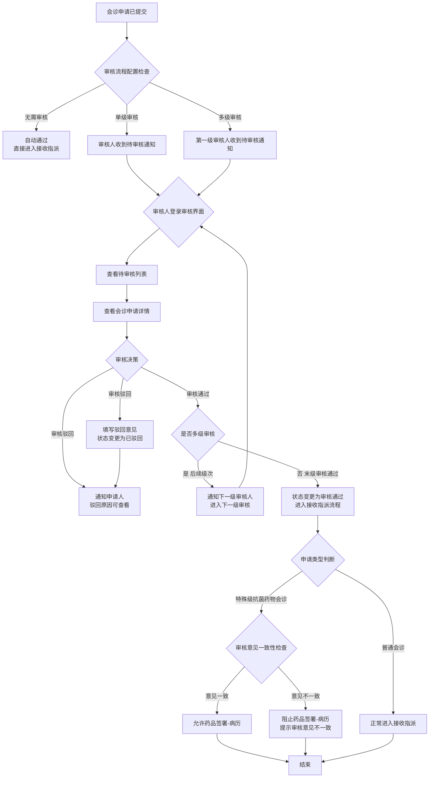
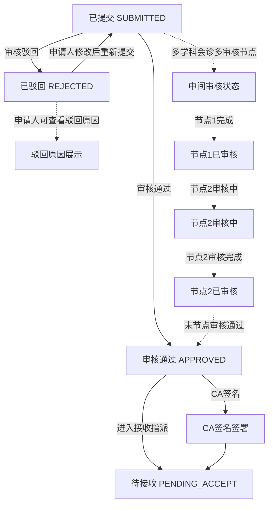

# BLGL-05-HZGL-002 会诊审核_Analyst-Spec

> **需求编号**：BLGL-05-HZGL-002
> **父需求**：BLGL-05-HZGL 会诊管理
> **关联PM Spec**：BLGL-05-HZGL-002_会诊审核_PM-spec.md（待产出）
> **Spec版本**：V1.0
> **编写时间**：2026-08-21
> **编写人**：RACC

---

## 一、功能编号体系

> 使用带父子层级的 `<功能编号>-ID` 编号，便于追溯和讨论。

### 1.1 功能层级结构

```
BLGL-05-HZGL-002: 会诊审核
  ├─ BLGL-05-HZGL-002-01: 待审核列表
  ├─ BLGL-05-HZGL-002-02: 审核处理
  ├─ BLGL-05-HZGL-002-03: 审核历史记录
  └─ BLGL-05-HZGL-002-04: 审核流程配置
```

> 拆分依据：Phase 1 功能点Spec 第5章中已列出的子功能点。不新增功能清单中不存在的子功能点。

### 1.2 功能编号表

| REQ-ID | 功能名称 | 类型 | 优先级 | 说明 |
|--------|---------|------|--------|------|
| BLGL-05-HZGL-002-01 | 待审核列表 | 功能 | P0 | 查询待审核的会诊申请列表，支持按条件筛选、排序，支持多学科会诊多审核节点场景下的状态展示 |
| BLGL-05-HZGL-002-02 | 审核处理 | 功能 | P0 | 审核人员对会诊申请执行审核通过/驳回操作，记录审核意见，支持CA签名 |
| BLGL-05-HZGL-002-03 | 审核历史记录 | 功能 | P1 | 查看已完成的审核记录，支持按会诊单追溯审核全链路 |
| BLGL-05-HZGL-002-04 | 审核流程配置 | 功能 | P1 | 定义审核流程节点，支持多级审核配置，配置审核人员、审核条件、审核顺序等 |

> 类型：功能 / 子功能。优先级与 PM-Spec 一致。功能编号来自 Phase 1 功能点Spec 第5章，子编号从功能清单展开。

---

## 二、核心业务流程

> 每个主流程一个 Mermaid flowchart。**流程步骤必须能在需求原文中找到对应描述，不推测中间步骤。**

### 2.1 会诊审核全流程（主流程）



### 2.2 会诊审核状态流转流程



> 至少 2 个 Mermaid 流程图。每个流程对应一个核心业务场景。

---

## 三、功能规格说明

> 每个 REQ-ID 展开详细描述，包含功能概述、用户角色、业务流程、验收标准。

---

### BLGL-05-HZGL-002-01: 待审核列表

#### 3.1.1 功能概述

审核人员进入待审核列表页面，系统展示当前待处理的会诊申请列表。列表支持按会诊类型、申请科室、申请时间、会诊类型等条件筛选和排序。对于多学科会诊（MDT）多审核节点场景，列表需展示当前审核节点信息，便于审核人员明确当前审核阶段。会诊记录列表显示状态优化，能够清晰区分不同审核节点下的会诊状态。

#### 3.1.2 用户角色

| 角色 | 使用场景 | 权限要求 | 操作频率 |
|------|---------|---------|---------|
| 审核人员（科室主任/医务科） | 审核本科室相关的会诊申请 | 需具有审核权限，按审核流程配置确定 | 中频 |
| 院总 | 审核全院会诊申请 | 需具有审核权限 | 中频 |
| 多级审核中各节点审核人 | 按审核流程配置，逐级审核 | 按审核流程配置确定 | 中频 |

> 角色必须在需求原文中出现过。操作频率从需求分析中归纳。

#### 3.1.3 业务流程（Given/When/Then）

##### 主流程（至少 1 个）

**Scenario 1: 审核人员成功查询待审核列表**

```gherkin
Given:
  - 审核人员已登录系统，具有会诊审核权限
  - 系统中有多条已提交的会诊申请，处于待审核状态
  - 审核流程已配置，该审核人员属于某一审核节点的审核人
  - 列表中包含多学科会诊多审核节点的申请

When:
  - 审核人员进入会诊审核模块
  - 系统默认展示待审核列表，按提交时间降序排列
  - 审核人员使用筛选条件，按会诊类型筛选"科间会诊"
  - 审核人员按申请时间范围筛选"近一周"
  - 审核人员查看列表中的会诊状态信息

Then:
  - 列表展示所有符合条件的待审核会诊申请
  - 每条记录展示：会诊单标题、申请科室、申请医生、会诊类型、提交时间、当前审核节点
  - 多学科会诊多审核节点的申请，列表中清晰标注当前审核节点（如"一级审核"、"二级审核"）
  - 列表支持分页显示，默认每页20条
  - 筛选条件支持组合查询（会诊类型+申请时间+申请科室等）
```

##### 异常流程（至少 3 个）

**Scenario 2: 待审核列表为空（业务异常）**

```gherkin
Given:
  - 审核人员已登录系统
  - 当前无任何待审核的会诊申请
  - 或筛选条件过于严格，无匹配结果

When:
  - 审核人员进入待审核列表页面
  - 或设置筛选条件后点击查询

Then:
  - 系统显示"暂无待审核的会诊申请"
  - 列表区域展示空状态提示
  - 筛选条件保留，审核人员可调整条件重新查询
  - 系统提供"查看全部待审核"或"清除筛选条件"的快捷入口
```

**Scenario 3: 审核人员无权限查看部分待审核申请（数据异常）**

```gherkin
Given:
  - 审核人员已登录系统
  - 审核流程配置中，该审核人员仅被授权审核特定科室的会诊申请
  - 系统中有其他科室的待审核会诊申请

When:
  - 审核人员进入待审核列表页面
  - 系统加载待审核列表

Then:
  - 列表仅展示该审核人员有权审核的会诊申请
  - 无权审核的会诊申请不在列表中显示
  - 列表不提示"有未授权的申请"
  - 审核人员无法越权查看其他科室的待审核申请
```

**Scenario 4: 待审核列表加载超时（系统异常）**

```gherkin
Given:
  - 审核人员已登录系统
  - 系统中待审核会诊申请数量较大（如超过500条）
  - 服务器负载较高

When:
  - 审核人员进入待审核列表页面
  - 系统请求列表数据超过5秒未响应

Then:
  - 前端显示"加载超时，请稍后重试"
  - 列表区域显示加载中的状态提示
  - 系统提供"重新加载"按钮
  - 系统记录慢查询日志供优化参考
```

##### 边界流程（至少 2 个）

**Scenario 5: 多学科会诊多审核节点场景下的列表展示（边界流程）**

```gherkin
Given:
  - 审核人员已登录系统
  - 系统中存在多学科会诊（MDT），配置了多级审核流程
  - 其中一条MDT会诊申请已完成一级审核，正在等待二级审核
  - 另一条MDT会诊申请已完成二级审核，正在等待三级审核

When:
  - 审核人员进入待审核列表
  - 查看列表中各会诊申请的状态展示

Then:
  - 已完成一级审核的MDT申请，状态显示为"二级审核中"
  - 已完成二级审核的MDT申请，状态显示为"三级审核中"
  - 列表中的状态列清晰展示当前审核节点，审核人员可明确当前审核阶段
  - 审核人员可通过状态筛选查看特定节点的待审核申请
```

**Scenario 6: 审核人员离职或调岗后待审核列表处理（边界流程）**

```gherkin
Given:
  - 审核流程配置中某审核节点仅配置了单一审核人员
  - 该审核人员已离职或调岗
  - 系统中有待审核的会诊申请指向该审核人员

When:
  - 其他审核人员（如有）或系统管理员登录系统
  - 查看待审核列表

Then:
  - 离职审核人员的待审核任务自动转移至其上级或同级审核人 ⏳ 待确认
  - 或系统提示"审核人员配置异常，请联系管理员处理"
  - 待审核申请不会因审核人员缺失而丢失
  - 系统管理员可重新配置审核流程中的审核人员
```

#### 3.1.5 验收标准

| AC编号 | 验收标准 | 对应REQ-ID | 验证方法 | 验证场景 |
|--------|---------|-----------|---------|---------|
| AC-001 | 审核人员可查看待审核列表，按提交时间降序排列，支持多条件组合筛选 | BLGL-05-HZGL-002-01 | 功能测试 | Scenario 1 |
| AC-002 | 列表展示会诊单标题、申请科室、申请医生、会诊类型、提交时间、当前审核节点 | BLGL-05-HZGL-002-01 | 功能测试 | Scenario 1 |
| AC-003 | 无待审核申请时显示空状态提示，提供清除筛选条件入口 | BLGL-05-HZGL-002-01 | 功能测试 | Scenario 2 |
| AC-004 | 审核人员仅能看到本人有权审核的会诊申请 | BLGL-05-HZGL-002-01 | 功能测试 | Scenario 3 |
| AC-005 | 列表加载超时时有明确提示，提供重新加载按钮 | BLGL-05-HZGL-002-01 | 功能测试 | Scenario 4 |
| AC-006 | 多学科会诊多审核节点场景下，列表清晰标注当前审核节点信息 | BLGL-05-HZGL-002-01 | 功能测试 | Scenario 5 |
| AC-007 | 审核人员离职/调岗后待审核任务有处理机制，不丢失 | BLGL-05-HZGL-002-01 | 功能测试 | Scenario 6 |

---

### BLGL-05-HZGL-002-02: 审核处理

#### 3.2.1 功能概述

审核人员对待审核的会诊申请进行审核处理，支持审核通过或驳回操作。审核通过时，记录审核意见；审核驳回时，填写驳回原因，会诊申请状态变更为"已驳回"，并通知申请人。支持CA签名，确保审核结果的法律效力。对于特殊级抗菌药物会诊，当审核意见不一致时需阻止药品签署-病历操作。审核通过后，会诊申请进入下一审核节点或接收指派流程。审核人职称下拉框需完整包含医师类选项。

#### 3.2.2 用户角色

| 角色 | 使用场景 | 权限要求 | 操作频率 |
|------|---------|---------|---------|
| 审核人员（科室主任/医务科） | 对会诊申请进行审核决策 | 需具有审核权限，按审核流程配置确定 | 中频 |
| 多级审核中各节点审核人 | 按审核流程配置，逐级审核 | 按审核流程配置确定 | 中频 |
| 特殊级抗菌药物会诊审核人 | 审核抗菌药物使用的合理性 | 需具有抗菌药物审核资质 | 低频 |

> 角色必须在需求原文中出现过。操作频率从需求分析中归纳。

#### 3.2.3 业务流程（Given/When/Then）

##### 主流程（至少 1 个）

**Scenario 1: 审核人员成功审核通过会诊申请**

```gherkin
Given:
  - 审核人员已登录系统
  - 待审核列表中有一条会诊申请，审核人员有权审核
  - 审核流程配置为单级审核，该审核人员为末级审核人
  - 审核人员已查看会诊申请详情，确认会诊合理

When:
  - 审核人员点击"审核通过"按钮
  - 系统弹出审核意见填写对话框
  - 审核人员填写审核意见"同意会诊，请相关科室配合"
  - 审核人员选择CA签名方式（如有CA签名配置）
  - 审核人员确认提交审核结果

Then:
  - 会诊申请状态变更为"审核通过"
  - 审核记录保存至EMR_CONSULT_AUDIT表，记录审核人、审核时间、审核意见
  - 系统通知申请人"会诊申请已审核通过"
  - 会诊申请进入接收指派流程，通知受邀科室
  - 操作日志记录本次审核操作
  - 如配置CA签名，审核结果附带CA签名信息
```

##### 异常流程（至少 3 个）

**Scenario 2: 审核人员驳回会诊申请（业务异常）**

```gherkin
Given:
  - 审核人员已登录系统
  - 待审核列表中有一条会诊申请
  - 审核人员查看详情后认为会诊理由不充分

When:
  - 审核人员点击"驳回"按钮
  - 系统弹出驳回意见填写对话框
  - 审核人员填写驳回原因"会诊理由不充分，请补充患者相关检查结果后重新提交"
  - 审核人员确认提交驳回结果

Then:
  - 会诊申请状态变更为"已驳回"
  - 驳回记录保存至审核记录表，记录驳回人、驳回时间、驳回原因
  - 系统通知申请人"会诊申请已被驳回"，并附带驳回原因
  - 申请人可查看驳回原因，修改后重新提交会诊申请
  - 操作日志记录本次驳回操作
  - 通知会诊申请流程结束，不进入接收指派流程
```

**Scenario 3: 特殊级抗菌药物会诊意见不一致时阻止药品签署-病历（业务异常）**

```gherkin
Given:
  - 会诊申请类型为"特殊级抗菌药物会诊"
  - 已有两位或以上会诊医生提交了会诊意见
  - 各会诊医生的抗菌药物使用意见不一致（如：一位建议使用，一位建议不使用）

When:
  - 审核人员对待审核的抗菌药物会诊申请进行审核
  - 系统检测到会诊意见不一致
  - 审核人员尝试审核通过

Then:
  - 系统提示"会诊意见不一致，请协调会诊医生达成一致意见后再审核"
  - 阻止药品签署-病历操作
  - 审核操作被阻挡，会诊申请状态保持不变
  - 系统记录"意见不一致导致审核受阻"的日志
  - 审核人员可联系会诊医生协调意见
```

**Scenario 4: CA签名服务不可用导致审核失败（系统异常）**

```gherkin
Given:
  - 审核人员已登录系统
  - 系统配置了审核需CA签名
  - CA签名服务当前不可用

When:
  - 审核人员点击"审核通过"按钮
  - 填写审核意见
  - 系统尝试调用CA签名服务
  - CA签名服务返回异常

Then:
  - 系统提示"CA签名服务异常，审核操作无法完成，请稍后重试"
  - 审核结果未提交，会诊申请状态保持不变
  - 已填写的审核意见暂存，不丢失
  - 系统记录CA签名异常日志
  - 审核人员可稍后重试，或联系IT部门处理CA签名服务
```

##### 边界流程（至少 2 个）

**Scenario 5: 多级审核场景中中间节点审核通过后进入下一节点（边界流程）**

```gherkin
Given:
  - 审核流程配置为三级审核
  - 第一级审核人已审核通过该会诊申请
  - 第二级审核人（当前用户）登录系统

When:
  - 当前审核人进入待审核列表
  - 列表显示该申请处于"二级审核中"状态
  - 当前审核人查看详情并审核通过

Then:
  - 会诊申请状态变更为"三级审核中"
  - 三级审核人收到待审核通知
  - 该申请出现在三级审核人的待审核列表中
  - 审核记录保存，记录当前审核节点信息
  - 申请人不收到通知，待末级审核通过后统一通知
```

**Scenario 6: 审核时职称下拉框缺失医师类选项（边界流程）**

```gherkin
Given:
  - 审核人员进入审核界面
  - 审核界面中审核人信息区域包含职称选择/显示字段
  - 系统职称配置数据中已包含"医师"类职称

When:
  - 审核人员查看或维护审核人职称信息
  - 点击职称下拉框查看可选职称

Then:
  - 职称下拉框完整显示所有医师类选项：住院医师、主治医师、副主任医师、主任医师
  - 不缺失"住院医师"等医师类选项
  - 职称信息可正常保存，无保存失败问题
  - 审核记录中的职称信息准确反映审核人职称
```

#### 3.2.5 验收标准

| AC编号 | 验收标准 | 对应REQ-ID | 验证方法 | 验证场景 |
|--------|---------|-----------|---------|---------|
| AC-008 | 审核人员可审核通过会诊申请，记录审核意见，状态变更为审核通过 | BLGL-05-HZGL-002-02 | 功能测试 | Scenario 1 |
| AC-009 | 审核人员可驳回会诊申请，填写驳回原因，状态变更为已驳回，通知申请人 | BLGL-05-HZGL-002-02 | 功能测试 | Scenario 2 |
| AC-010 | 特殊级抗菌药物会诊意见不一致时阻止药品签署-病历，给出明确提示 | BLGL-05-HZGL-002-02 | 功能测试 | Scenario 3 |
| AC-011 | CA签名服务异常时审核操作无法完成，已填意见暂存，有明确提示 | BLGL-05-HZGL-002-02 | 功能测试 | Scenario 4 |
| AC-012 | 多级审核场景中，中间节点审核通过后进入下一节点，通知下一级审核人 | BLGL-05-HZGL-002-02 | 功能测试 | Scenario 5 |
| AC-013 | 审核时职称下拉框完整显示医师类选项，职称信息可正常保存 | BLGL-05-HZGL-002-02 | 功能测试 | Scenario 6 |
| AC-014 | 审核通过后通知申请人，审核记录保存至EMR_CONSULT_AUDIT表 | BLGL-05-HZGL-002-02 | 功能测试 | Scenario 1 |
| AC-015 | 支持CA签名，审核结果附带CA签名信息 | BLGL-05-HZGL-002-02 | 功能测试 | Scenario 1 |

---

### BLGL-05-HZGL-002-03: 审核历史记录

#### 3.3.1 功能概述

查看已完成的审核记录，支持按会诊单追溯审核全链路。审核历史记录包含审核人、审核时间、审核结果（通过/驳回）、审核意见、审核节点信息等。对于多级审核，可查看每一级审核的详细记录，形成完整的审核链路。审核记录可追溯，满足医疗合规要求。

#### 3.3.2 用户角色

| 角色 | 使用场景 | 权限要求 | 操作频率 |
|------|---------|---------|---------|
| 审核人员 | 查看本人历史审核记录 | 可查看本人审核记录 | 低频 |
| 申请人（住院医生） | 查看会诊申请的审核进度和历史 | 可查看本人申请的审核记录 | 中频 |
| 科室管理员 | 查看本科室会诊审核全链路 | 按科室权限查看 | 低频 |
| 医务科/质控人员 | 审核追溯和合规检查 | 需具有审核查看权限 | 低频 |

> 角色必须在需求原文中出现过。操作频率从需求分析中归纳。

#### 3.3.3 业务流程（Given/When/Then）

##### 主流程（至少 1 个）

**Scenario 1: 申请医生查看会诊申请的审核历史记录**

```gherkin
Given:
  - 住院医生已登录系统
  - 该医生曾提交过一条会诊申请，该申请已通过多级审核
  - 会诊申请已完成，进入后续流程

When:
  - 医生进入会诊申请详情页
  - 点击"审核记录"或"审核历史"tab
  - 系统展示审核历史记录列表

Then:
  - 审核历史记录按审核时间顺序排列（从早到晚）
  - 每条记录展示：审核节点名称、审核人、审核人职称、审核时间、审核结果、审核意见
  - 多级审核场景下，清晰展示每一级审核的详细信息（如：一级审核-张三-通过，二级审核-李四-通过）
  - 若曾经有驳回，展示驳回记录及驳回原因
  - 审核记录支持追溯，可查看完整的审核全链路
```

##### 异常流程（至少 3 个）

**Scenario 2: 会诊申请无审核记录（业务异常）**

```gherkin
Given:
  - 住院医生已登录系统
  - 存在一条会诊申请，该申请配置为无需审核，直接进入接收指派流程
  - 或该申请刚创建，尚未进入审核流程

When:
  - 医生进入会诊申请详情页
  - 点击"审核记录"tab

Then:
  - 系统显示"暂无审核记录"
  - 页面显示当前审批状态说明（如："该会诊申请无需审核，已进入接收指派流程"）
  - 或显示"该会诊申请尚未进入审核流程"
```

**Scenario 3: 审核记录中审核人信息缺失（数据异常）**

```gherkin
Given:
  - 审核记录表中存在审核记录
  - 由于历史数据迁移或系统异常，部分审核记录的审核人信息为空

When:
  - 申请人或审核人员查看审核历史记录
  - 系统加载审核记录列表

Then:
  - 审核人信息缺失的记录显示为"系统处理"或"信息缺失"
  - 不影响其他审核记录的展示
  - 系统记录数据异常日志，供运维排查
  - 不影响会诊申请当前状态和后续流程
```

**Scenario 4: 审核历史记录加载异常（系统异常）**

```gherkin
Given:
  - 申请人已登录系统
  - 会诊申请有大量审核记录（如多级审核+多次驳回重审）

When:
  - 申请人点击"审核记录"tab
  - 后端查询审核记录接口异常

Then:
  - 系统提示"审核记录加载失败，请稍后重试"
  - 会诊申请详情页的其他信息正常展示
  - 审核记录区域显示错误状态提示
  - 系统记录异常日志
```

##### 边界流程（至少 2 个）

**Scenario 5: 会诊申请经过多次驳回重审的审核记录展示（边界流程）**

```gherkin
Given:
  - 一条会诊申请经历了多次驳回和重新提交
  - 第一次提交：一级审核通过，二级审核驳回
  - 申请人修改后重新提交：一级审核通过，二级审核通过
  - 审核记录包含多个审核轮次

When:
  - 申请人查看审核历史记录

Then:
  - 审核记录按时间线排列，展示完整的审核全链路
  - 第一次提交的审核记录：一级审核通过，二级审核驳回（含驳回原因）
  - 第二次提交的审核记录：一级审核通过，二级审核通过
  - 审核记录清晰区分不同提交轮次，标注"第1次提交"、"第2次提交"
  - 驳回记录可追溯，含完整的驳回原因和驳回人
```

**Scenario 6: 审核记录支持按时间范围筛选查看（边界流程）**

```gherkin
Given:
  - 审核人员登录系统
  - 该审核人员有大量历史审核记录（超过一年）
  - 审核记录跨越多个月份

When:
  - 审核人员进入"我的审核记录"页面
  - 系统默认展示最近三个月的审核记录
  - 审核人员选择时间范围筛选"近一个月"
  - 审核人员按审核结果筛选"驳回"

Then:
  - 列表刷新显示近一个月内被驳回的审核记录
  - 支持按时间范围、审核结果（通过/驳回）、会诊类型等条件筛选
  - 筛选后的记录支持分页查看
  - 审核记录列表展示字段：会诊单号、申请科室、申请人、审核结果、审核时间
```

#### 3.3.5 验收标准

| AC编号 | 验收标准 | 对应REQ-ID | 验证方法 | 验证场景 |
|--------|---------|-----------|---------|---------|
| AC-016 | 审核历史记录按时间顺序展示，包含审核人、时间、结果、意见，多级审核清晰展示 | BLGL-05-HZGL-002-03 | 功能测试 | Scenario 1 |
| AC-017 | 无需审核的会诊申请显示"暂无审核记录"及状态说明 | BLGL-05-HZGL-002-03 | 功能测试 | Scenario 2 |
| AC-018 | 审核人信息缺失时显示"信息缺失"，不影响其他记录展示 | BLGL-05-HZGL-002-03 | 功能测试 | Scenario 3 |
| AC-019 | 审核记录加载异常时有明确提示，不影响其他信息展示 | BLGL-05-HZGL-002-03 | 功能测试 | Scenario 4 |
| AC-020 | 多次驳回重审场景下，审核记录按提交轮次区分展示，驳回原因可追溯 | BLGL-05-HZGL-002-03 | 功能测试 | Scenario 5 |
| AC-021 | 审核记录支持按时间范围和审核结果筛选查询 | BLGL-05-HZGL-002-03 | 功能测试 | Scenario 6 |

---

### BLGL-05-HZGL-002-04: 审核流程配置

#### 3.4.1 功能概述

管理员定义会诊审核流程节点，支持多级审核配置。可配置审核层级数量（单级/多级）、各层级审核人（按角色/科室/个人）、审核条件（如按会诊类型/科室/抗菌药物等级等）、审核顺序（串行/并行）、审核超时规则等。审核流程配置决定会诊申请提交后的审核路径。

#### 3.4.2 用户角色

| 角色 | 使用场景 | 权限要求 | 操作频率 |
|------|---------|---------|---------|
| 系统管理员 | 配置会诊审核流程参数 | 需具有系统管理权限 | 低频 |
| 医务科管理员 | 配置审核规则和审核人 | 需具有审核配置权限 | 低频 |
| 科室管理员 | 配置本科室审核流程 | 需具有科室管理权限 | 低频 |

> 角色必须在需求原文中出现过。操作频率从需求分析中归纳。

#### 3.4.3 业务流程（Given/When/Then）

##### 主流程（至少 1 个）

**Scenario 1: 管理员成功配置多级审核流程**

```gherkin
Given:
  - 系统管理员已登录系统，具有审核配置权限
  - 系统当前审核流程为默认配置（单级审核）
  - 管理员需要配置三级审核流程

When:
  - 管理员进入审核流程配置页面
  - 设置审核层级数量为"三级审核"
  - 配置第一级审核：审核角色为"科室主任"，审核范围为"本科室会诊申请"
  - 配置第二级审核：审核角色为"医务科"，审核范围为"全院会诊"
  - 配置第三级审核：审核角色为"分管院长"，审核范围为"特殊级抗菌药物会诊"
  - 配置审核顺序为"串行"（逐级审核）
  - 保存配置

Then:
  - 审核流程配置保存成功
  - 配置数据保存至EMR_CONSULT_AUDIT_PARAM和EMR_CONSULT_AUDIT_DETAIL_PARAM表
  - 新提交的会诊申请按照新配置的审核流程执行
  - 配置生效前已提交的会诊申请按原有流程执行，不受影响
  - 操作日志记录配置变更信息
```

##### 异常流程（至少 3 个）

**Scenario 2: 配置审核流程时未指定审核人（业务异常）**

```gherkin
Given:
  - 管理员进入审核流程配置页面
  - 管理员已设置审核层级为"二级审核"
  - 第一级和第二级审核均未指定审核人或审核角色

When:
  - 管理员点击"保存"按钮
  - 系统进行配置完整性校验

Then:
  - 系统提示"请为每一级审核指定审核人或审核角色"
  - 未配置审核人的审核节点高亮标记
  - 配置保存失败，已填写内容不丢失
  - 管理员需为每一级审核指定审核人或审核角色后重新保存
```

**Scenario 3: 配置审核流程时审核层级循环引用（数据异常）**

```gherkin
Given:
  - 管理员已设置审核层级为"三级审核"
  - 第一级审核人指定为"张三"
  - 第二级审核人指定为"李四"
  - 第三级审核人指定为"张三"（与第一级重复）

When:
  - 管理员点击"保存"按钮
  - 系统进行审核人重复校验

Then:
  - 系统提示"审核人不能在不同审核层级中重复指定，请调整审核人配置"
  - 重复的审核人高亮标记
  - 配置保存失败
  - 管理员需调整审核人配置后重新保存
```

**Scenario 4: 审核流程配置保存时数据库异常（系统异常）**

```gherkin
Given:
  - 管理员已填写完整的审核流程配置
  - 配置内容合法

When:
  - 管理员点击"保存"按钮
  - 系统写入数据库时发生连接异常
  - 数据库事务回滚

Then:
  - 系统提示"配置保存失败，数据库异常，请稍后重试"
  - 配置未保存，页面保留已填写内容
  - 系统记录异常日志
  - 管理员可稍后重试保存操作
```

##### 边界流程（至少 2 个）

**Scenario 5: 审核流程配置变更后对已流转中的会诊申请无影响（边界流程）**

```gherkin
Given:
  - 原有审核流程配置为"单级审核"
  - 已有一条会诊申请A在原有配置下提交，状态为"待审核（一级）"
  - 管理员将审核流程配置变更为"二级审核"

When:
  - 会诊申请A的审核人进行审核操作
  - 新的会诊申请B提交，按照新配置执行

Then:
  - 会诊申请A仍按照原有配置执行（单级审核），审核通过后进入接收指派
  - 会诊申请B按照新配置执行（二级审核），需经过两级审核
  - 配置变更不影响已流转中的会诊申请
  - 系统中记录配置变更的生效时间点
```

**Scenario 6: 按会诊类型配置不同审核流程（边界流程）**

```gherkin
Given:
  - 管理员进入审核流程配置页面
  - 系统支持按会诊类型配置不同的审核流程

When:
  - 管理员配置"科间会诊"为"无需审核"
  - 管理员配置"全院会诊"为"单级审核"
  - 管理员配置"特殊级抗菌药物会诊"为"三级审核"
  - 管理员配置"MDT会诊"为"二级审核"
  - 保存配置

Then:
  - 不同会诊类型的审核流程配置保存成功
  - 提交科间会诊时，无需审核，直接进入接收指派
  - 提交全院会诊时，需经过单级审核
  - 提交特殊级抗菌药物会诊时，需经过三级审核
  - 提交MDT会诊时，需经过二级审核
  - 配置按会诊类型生效，不同类型的会诊走不同的审核路径
```

#### 3.4.5 验收标准

| AC编号 | 验收标准 | 对应REQ-ID | 验证方法 | 验证场景 |
|--------|---------|-----------|---------|---------|
| AC-022 | 管理员可配置多级审核流程，设置审核层级、审核人、审核范围，保存成功 | BLGL-05-HZGL-002-04 | 功能测试 | Scenario 1 |
| AC-023 | 配置时未指定审核人，系统提示并高亮标记，保存失败 | BLGL-05-HZGL-002-04 | 功能测试 | Scenario 2 |
| AC-024 | 审核人在不同层级中重复指定时，系统提示并阻止保存 | BLGL-05-HZGL-002-04 | 功能测试 | Scenario 3 |
| AC-025 | 数据库异常时配置保存失败，页面保留已填写内容 | BLGL-05-HZGL-002-04 | 功能测试 | Scenario 4 |
| AC-026 | 配置变更不影响已流转中的会诊申请，新旧配置各自生效 | BLGL-05-HZGL-002-04 | 功能测试 | Scenario 5 |
| AC-027 | 支持按会诊类型配置不同的审核流程（无需审核/单级/多级） | BLGL-05-HZGL-002-04 | 功能测试 | Scenario 6 |

---

## 四、排除范围

本需求不包含以下功能项：

1. **会诊申请** - 会诊申请的创建、编辑、提交、撤销等操作，归属于 BLGL-05-HZGL-001 会诊申请
2. **会诊接收与指派** - 院总/科室管理员接收会诊任务并指派给具体会诊医生，归属于 BLGL-05-HZGL-004 会诊接收与指派
3. **会诊签到** - 会诊医生到场签到确认，归属于 BLGL-05-HZGL-005 会诊签到
4. **会诊答复与记录** - 会诊医生提交会诊意见、诊断、治疗建议，生成会诊记录，归属于 BLGL-05-HZGL-003 会诊答复与记录
5. **会诊计费** - 会诊费用计算和账单生成，与HIS/医嘱系统交互，归属于 BLGL-05-HZGL-006 会诊计费
6. **会诊评价与反馈** - 对会诊过程进行评价和反馈，归属于 BC-HZGL-001 基础能力
7. **会诊配置管理（通用）** - 会诊参数、计费规则、科室映射等通用配置，归属于 BC-HZGL-003 基础能力
8. **会诊查询与统计** - 跨会诊全流程的综合查询和统计报表，归属于 BC-HZGL-002 基础能力

> 与 PM-Spec 第四章保持一致。对照 Phase 1 功能点Spec 第6章（基线能力），确保不越界。

---

## 五、业务规则清单

| 规则ID | 规则名称 | 规则描述 | 来源 | 优先级 |
|--------|---------|---------|------|--------|
| BR-001 | 审核流程可配置规则 | 审核流程支持多级配置，可配置单级/多级审核，按会诊类型/科室等条件灵活配置 | 需求要点 | P0 |
| BR-002 | 审核通过/驳回规则 | 审核人员可对会诊申请执行审核通过或驳回操作，驳回需填写驳回原因 | 需求要点 | P0 |
| BR-003 | 审核意见记录规则 | 审核操作需记录审核意见，审核意见与审核结果一并保存 | 需求要点 | P0 |
| BR-004 | 待审核列表展示规则 | 展示待审核会诊申请列表，支持按条件筛选和排序 | 需求要点 | P0 |
| BR-005 | 审核记录可追溯规则 | 审核记录可追溯，支持查看审核全链路，包括审核人、时间、结果、意见 | 需求要点 | P0 |
| BR-006 | CA签名规则 | 审核操作支持CA签名，确保审核结果的法律效力 | 需求要点 | P0 |
| BR-007 | 特殊级抗菌药物会诊审核规则 | 特殊级抗菌药物会诊需经过审核流程，审核通过后进入后续流程 | 需求要点 | P0 |
| BR-008 | 抗菌药物意见不一致阻止规则 | 特殊级抗菌药物会诊意见不一致时，阻止药品签署-病历操作 | 需求要点 | P0 |
| BR-009 | 多学科会诊多审核节点状态展示规则 | 会诊记录列表显示状态优化，多学科会诊多审核节点场景下清晰展示当前审核节点 | 需求要点 | P0 |
| BR-010 | 审核人职称下拉框完整规则 | 会诊审批流程中职称下拉框完整包含医师类选项（住院医师/主治医师/副主任医师/主任医师等） | 需求要点 | P1 |
| BR-011 | 审核流程配置变更生效规则 | 审核流程配置变更后，已流转中的会诊申请按原有配置执行，新提交的会诊申请按新配置执行 | 需求分析 | P0 |
| BR-012 | 审核人配置完整性规则 | 配置审核流程时，每一级审核必须指定审核人或审核角色，不可为空 | 需求分析 | P0 |
| BR-013 | 审核人重复配置规则 | 同一审核人不可在不同审核层级中重复指定 | 需求分析 | P1 |
| BR-014 | 审核通知规则 | 审核通过后通知申请人，驳回后通知申请人并附带驳回原因，多级审核中间节点通过后通知下一级审核人 | 需求分析 | P0 |
| BR-015 | 审核结果状态变更规则 | 审核通过后会诊申请状态变更为审核通过，驳回后变更为已驳回，中间节点审核通过后状态变更为下一级审核中 | 需求分析 | P0 |
| BR-016 | 审核记录保存规则 | 审核结果保存至EMR_CONSULT_AUDIT表，含审核人、审核时间、审核结果、审核意见、审核节点信息 | 代码分析 | P0 |
| BR-017 | 审核结果权限规则 | 审核人员仅可查看和审核本人有权审核的会诊申请，无权越权审核 | 需求分析 | P0 |
| BR-018 | 审核配置按会诊类型区分规则 | 不同会诊类型可配置不同的审核流程（如科间会诊无需审核、抗菌药物会诊需三级审核） | 需求分析 | P1 |

> 每条 BR 注明来源需求编号。规则描述必须能从需求原文中逐字对应，不得概括后失去原意。优先级与 PM-Spec 保持一致。

---

## 六、关联文档

| 文档类型 | 文档路径 | 说明 |
|---------|---------|------|
| 功能点Spec | 上级目录 BLGL-05-HZGL 05会诊管理功能点Spec.md（V1.0） | Phase 1 功能点索引 |
| PM spec | 本目录 BLGL-05-HZGL-002_会诊审核_PM-spec.md（待产出） | PM 产出的 Spec 文档 |
| -Spec | 本目录 BLGL-05-HZGL-002_会诊审核-Spec.md（待产出） | Spec（研发视角） |
| data-model.md | 待产出 | 架构师产出的数据建模文档 |
| design.md | 待产出 | 架构师产出的技术方案文档 |
| api-contract.md | 待产出 | 开发经理产出的 API 契约文档 |

> 第1行必须引用 Phase 1 功能点Spec。

---

## 七、待确认问题清单

| 编号 | 问题描述 | 缺失信息 | 影响范围 | 建议补充方 |
|------|---------|---------|---------|-----------|
| Q-001 | 审核流程配置的详细粒度需明确：是否支持按会诊类型+申请科室+患者类型等多维度组合条件配置不同审核流程，不同维度的优先级如何 | 审核流程配置的详细规则 | 2.1 业务流程, BR-001, BR-018 | 产品经理 |
| Q-002 | 特殊级抗菌药物会诊意见不一致时"阻止药品签署-病历"的具体实现方式是什么？是指阻止整个会诊单的病历签署，还是仅阻止抗菌药物相关部分的签署 | 阻止逻辑的具体范围 | 3.2.3 Scenario 3, BR-008 | 产品经理 |
| Q-003 | CA签名的具体集成方式需明确：是每次审核操作都调用CA签名，还是仅在审核通过时签名？CA签名失败时审核结果是否有效 | CA签名的调用策略和失败处理 | 3.2.3 Scenario 4, BR-006 | 架构师 |
| Q-004 | 多级审核场景中，中间节点审核通过后是否通知申请人？还是仅末级审核通过/驳回时才通知申请人 | 多级审核的通知策略 | 2.1 业务流程, 3.2.3 Scenario 5, BR-014 | 产品经理 |
| Q-005 | 审核人员离职或调岗后，待审核任务的处理策略是什么？是否有自动转移机制，还是需要人工干预？任务转移的规则是什么 | 审核人员变更后的任务处理策略 | 3.1.3 Scenario 6, AC-007 | 产品经理 |
| Q-006 | 审核流程配置支持"串行"和"并行"两种模式吗？并行模式下，多个审核节点是否各自独立审核，任一节点驳回即整体驳回，还是需要所有节点通过才通过 | 审核流程的并行/串行模式支持 | 3.4.3 Scenario 1, BR-001 | 产品经理 |
| Q-007 | 审核流程是否支持"自动通过"条件配置？如：会诊类型为"科间会诊"且申请科室为"急诊科"时，自动审核通过无需人工干预 | 自动审核通过的条件配置 | 2.1 业务流程, BR-001 | 产品经理 |
| Q-008 | 审核意见的字段长度限制是多少？是否支持富文本格式（如换行、列表、加粗等）？是否支持附件上传 | 审核意见的格式和长度限制 | 3.2.3 Scenario 1, BR-003 | 产品经理 |
| Q-009 | 审核超时是否有超时处理机制？如审核人员超过规定时间未审核，是否自动通过或自动转交其他审核人 | 审核超时处理机制 | 2.1 业务流程 | 产品经理 |
| Q-010 | 会诊审批流程中职称下拉框缺失医师类选项的具体原因是什么？是所有审核场景都缺失，还是仅在特定场景下缺失？是前端配置问题还是后端数据问题 | 职称下拉框缺失的具体原因和范围 | 3.2.3 Scenario 6, BR-010 | 研发工程师 |
| Q-011 | 审核历史记录的保留期限是否有要求？是否需要定期归档或清理 | 审核记录的保留策略 | 3.3.3 Scenario 1, BR-005 | 产品经理 |
| Q-012 | 审核通过的会诊申请是否支持"撤回审核"操作？即审核通过后，审核人员是否可以撤回审核结果 | 审核撤回的规则 | 3.2.3 Scenario 1 | 产品经理 |

> 逐条列出全文所有 `⏳ 待确认` 项。

---

## 填写检查清单

| 序号 | 检查项 | 是否完成 |
|:----:|--------|:--------:|
| 1 | 功能编号带父子层级 | ✅ |
| 2 | 每个 REQ-ID 有功能概述和用户角色 | ✅ |
| 3 | 主流程至少 1 个 Given/When/Then 场景 | ✅ |
| 4 | 异常流程至少 3 个 Given/When/Then 场景 | ✅ |
| 5 | 边界流程至少 2 个 Given/When/Then 场景 | ✅ |
| 6 | 每个 Given/When/Then 内容具体，不模糊 | ✅ |
| 7 | 验收标准 AC 编号独立，可验证 | ✅ |
| 8 | 每个子功能点含验收标准 | ✅ |
| 9 | 验收标准无"功能正常"等模糊表述 | ✅ |
| 10 | 排除范围明确列出 | ✅ |
| 11 | 业务规则清单列出所有规则，每条标注来源 | ✅ |
| 12 | 流程图使用 Mermaid 格式（≥2 个） | ✅ |
| 13 | 关联文档索引包含 Phase 1 功能点Spec | ✅ |
| 14 | 待确认问题清单汇总了全文所有 ⏳ 项 | ✅ |
| 15 | 全文无占位符 `< >` 残留 | ✅ |
| 16 | 全文陈述可溯源至资料区（S1~S10 溯源核查） | ✅ |
| 17 | 人工审核确认完成 | ⏳ 待确认 |

---

**文档状态**：⬜ 待审核
**维护责任**：需求分析师规范组
**下次更新**：根据评审反馈优化

---

## 版本历史

| 版本 | 日期 | 变更说明 | 编写人 |
|------|------|---------|--------|
| V1.0 | 2026-08-21 | 初始版本 | RACC |