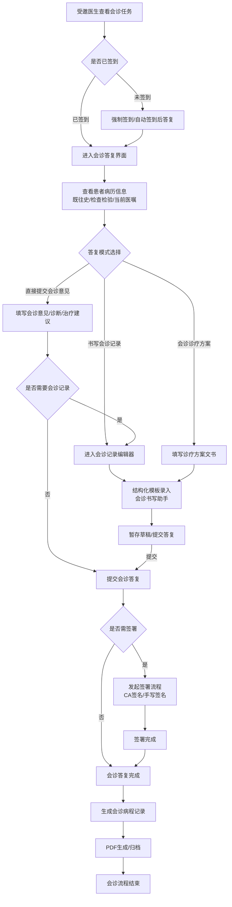
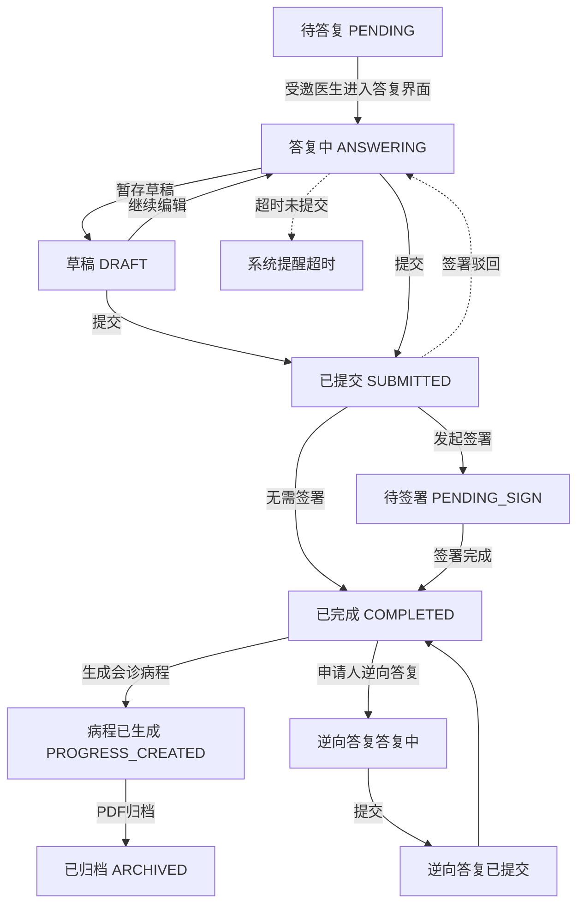

# BLGL-05-HZGL-003 会诊答复与记录_Analyst-Spec

> **需求编号**：BLGL-05-HZGL-003
> **父需求**：BLGL-05-HZGL 会诊管理
> **关联PM Spec**：BLGL-05-HZGL-003_会诊答复与记录_PM-spec.md（待产出）
> **Spec版本**：V1.0
> **编写时间**：2026-08-21
> **编写人**：RACC

---

## 一、功能编号体系

> 使用带父子层级的 `<功能编号>-ID` 编号，便于追溯和讨论。

### 1.1 功能层级结构

```
BLGL-05-HZGL-003: 会诊答复与记录
  ├─ BLGL-05-HZGL-003-01: 会诊答复提交
  ├─ BLGL-05-HZGL-003-02: 会诊记录书写
  ├─ BLGL-05-HZGL-003-03: 会诊记录签署
  ├─ BLGL-05-HZGL-003-04: 会诊记录归档
  └─ BLGL-05-HZGL-003-05: 会诊病程记录
```

> 拆分依据：Phase 1 功能点Spec 第5章中已列出的子功能点。不新增功能清单中不存在的子功能点。

### 1.2 功能编号表

| REQ-ID | 功能名称 | 类型 | 优先级 | 说明 |
|--------|---------|------|--------|------|
| BLGL-05-HZGL-003-01 | 会诊答复提交 | 功能 | P0 | 受邀医生查看患者病历信息，提交会诊意见（会诊诊断、治疗建议、抗菌药物使用意见等），支持逆向流程（申请人答复） |
| BLGL-05-HZGL-003-02 | 会诊记录书写 | 功能 | P0 | 会诊记录编辑器书写，支持会诊诊疗方案文书、会诊书写助手、结构化模板录入 |
| BLGL-05-HZGL-003-03 | 会诊记录签署 | 功能 | P0 | 会诊记录签署流程，支持多人签名、CA签名，签署后记录锁定 |
| BLGL-05-HZGL-003-04 | 会诊记录归档 | 功能 | P1 | 会诊记录PDF生成、无纸化归档，归档后记录不可修改 |
| BLGL-05-HZGL-003-05 | 会诊病程记录 | 功能 | P1 | 会诊完成后自动生成关联会诊病程记录，病程内容与会诊结论保持一致 |

> 类型：功能 / 子功能。优先级与 PM-Spec 一致。功能编号来自 Phase 1 功能点Spec 第5章，子编号从功能清单展开。

---

## 二、核心业务流程

> 每个主流程一个 Mermaid flowchart。**流程步骤必须能在需求原文中找到对应描述，不推测中间步骤。**

### 2.1 会诊答复与记录全流程（主流程）



### 2.2 会诊答复状态流转流程



> 至少 2 个 Mermaid 流程图。每个流程对应一个核心业务场景。

---

## 三、功能规格说明

> 每个 REQ-ID 展开详细描述，包含功能概述、用户角色、业务流程、验收标准。

---

### BLGL-05-HZGL-003-01: 会诊答复提交

#### 3.1.1 功能概述

受邀医生查看患者病历信息（既往史、检查检验、当前医嘱等），在会诊答复界面中填写会诊意见、会诊诊断、治疗建议、抗菌药物使用意见等内容并提交会诊答复。支持逆向流程：申请人在受邀医生完成答复后可补充答复。支持会诊答复列表显示状态优化（如待答复/已答复/已签署等状态标识）。会诊答复提交时会变更会诊邀请状态（EMR_CONSULT_INVITATION）。支持会诊书写助手辅助填写。

#### 3.1.2 用户角色

| 角色 | 使用场景 | 权限要求 | 操作频率 |
|------|---------|---------|---------|
| 受邀医生（会诊医生） | 接收会诊任务后，查看患者信息，提交会诊答复意见 | 需具有会诊答复权限，已被指派或接收该会诊任务 | 中频 |
| 申请医生（逆向流程） | 受邀医生提交答复后，申请人对会诊答复进行补充或确认 | 需为会诊申请的创建人 | 低频 |
| 科室主任/院总 | 查看会诊答复进度，督促答复 | 需具有会诊管理权限 | 低频 |

> 角色必须在需求原文中出现过。操作频率从需求分析中归纳。

#### 3.1.3 业务流程（Given/When/Then）

##### 主流程（至少 1 个）

**Scenario 1: 受邀医生成功提交会诊答复**

```gherkin
Given:
  - 受邀医生已登录系统，并已接收/被指派会诊任务
  - 会诊任务状态为"待答复"或"已签到"
  - 受邀医生已查看患者病历信息（既往史、检查检验、当前医嘱）
  - 系统已配置会诊书写模板

When:
  - 受邀医生进入会诊答复界面
  - 系统展示患者基本信息、会诊申请信息（会诊目的/理由、受邀科室/医生）
  - 受邀医生填写会诊意见、会诊诊断、治疗建议
  - 受邀医生使用会诊书写助手辅助填写（如引用检验检查结果）
  - 受邀医生点击"提交答复"按钮
  - 系统进行完整性校验，确认必填项已填写

Then:
  - 系统创建会诊答复记录，会诊邀请状态变更为"已答复"
  - 会诊答复内容保存至会诊记录表（EMR_CONSULT_SET）
  - 系统提示"会诊答复提交成功"
  - 会诊答复列表显示最新状态为"已答复"
  - 通知推送至申请人，告知会诊答复已提交
  - 操作日志记录提交时间、操作人、答复内容摘要
```

##### 异常流程（至少 3 个）

**Scenario 2: 未签到的受邀医生直接提交答复（业务异常）**

```gherkin
Given:
  - 受邀医生已登录系统，已接收会诊任务
  - 会诊任务已配置"强制签到"规则
  - 受邀医生尚未签到

When:
  - 受邀医生进入会诊答复界面
  - 尝试直接填写会诊意见并点击"提交答复"

Then:
  - 系统提示"请先完成会诊签到后再提交答复"
  - 系统引导受邀医生跳转至签到界面
  - 会诊答复提交操作被阻止
  - 已填写的答复内容临时保留，签到完成后可继续编辑
```

**Scenario 3: 逆向流程时申请人重复提交答复（数据异常）**

```gherkin
Given:
  - 受邀医生已提交会诊答复，会诊状态为"已完成"
  - 申请人（申请医生）打开会诊记录查看详情
  - 系统支持逆向流程：申请人可补充答复

When:
  - 申请人在逆向答复界面填写补充意见
  - 申请人点击"提交"按钮
  - 系统检测到该会诊已存在申请人的逆向答复记录

Then:
  - 系统提示"您已提交过逆向答复，如需修改请联系会诊医生"
  - 逆向答复提交操作被阻止
  - 已有逆向答复记录保持不变
  - 操作日志记录本次重复提交尝试
```

**Scenario 4: 提交答复时书写助手服务异常（系统异常）**

```gherkin
Given:
  - 受邀医生正在会诊答复界面填写会诊意见
  - 会诊书写助手功能已开启
  - 书写助手后端服务异常或响应超时

When:
  - 受邀医生点击书写助手的"智能推荐"或"引用数据"按钮
  - 书写助手接口调用失败

Then:
  - 系统提示"书写助手暂时不可用，请手动填写会诊意见"
  - 会诊答复界面正常显示，不影响手动填写
  - 书写的答复内容不会丢失
  - 系统记录书写助手异常日志
  - 受邀医生可继续手动填写并提交答复
```

##### 边界流程（至少 2 个）

**Scenario 5: 会诊答复列表显示状态优化（边界流程）**

```gherkin
Given:
  - 受邀医生登录系统，进入会诊任务列表
  - 系统中有多条会诊任务，状态包括"待答复""已答复""已签署""待签署"等
  - 系统已优化会诊答复列表状态显示

When:
  - 受邀医生查看会诊任务列表
  - 列表中每条任务均显示当前状态标签
  - 受邀医生筛选状态为"待答复"的任务

Then:
  - 列表中每条任务显示清晰的状态标签（如"待答复"为橙色、"已答复"为绿色、"已签署"为蓝色）
  - 状态筛选结果准确，仅显示符合条件的任务
  - 待答复任务按紧急程度排序（急会诊优先显示）
  - 列表支持按科室、会诊类型、时间等条件组合筛选
  - 列表展示字段包含：患者姓名、会诊科室、会诊类型、会诊目的、当前状态、提交时间
```

**Scenario 6: 受邀医生提交答复后申请人进行逆向答复（边界流程）**

```gherkin
Given:
  - 受邀医生已提交会诊答复，状态为"已答复"
  - 申请人（申请医生）需要对该会诊答复进行补充说明或确认
  - 系统支持逆向流程

When:
  - 申请人查看会诊详情，点击"逆向答复"按钮
  - 系统展示受邀医生的原始答复内容
  - 申请人在补充区域填写逆向答复意见
  - 申请人提交逆向答复

Then:
  - 系统创建逆向答复记录，关联至原会诊邀请
  - 会诊状态保持为"已完成"
  - 逆向答复内容在会诊详情中展示，标注"申请人补充意见"
  - 受邀医生可查看逆向答复内容
  - 操作日志记录逆向答复提交时间、操作人
```

#### 3.1.5 验收标准

| AC编号 | 验收标准 | 对应REQ-ID | 验证方法 | 验证场景 |
|--------|---------|-----------|---------|---------|
| AC-001 | 受邀医生可成功提交会诊答复，会诊邀请状态变更为"已答复" | BLGL-05-HZGL-003-01 | 功能测试 | Scenario 1 |
| AC-002 | 未签到的受邀医生提交答复时系统提示先签到并引导跳转 | BLGL-05-HZGL-003-01 | 功能测试 | Scenario 2 |
| AC-003 | 逆向流程中申请人重复提交答复被阻止并给出提示 | BLGL-05-HZGL-003-01 | 功能测试 | Scenario 3 |
| AC-004 | 书写助手异常时不影响手动填写和提交，给出友好提示 | BLGL-05-HZGL-003-01 | 功能测试 | Scenario 4 |
| AC-005 | 会诊答复列表显示状态标签，支持按状态筛选和排序 | BLGL-05-HZGL-003-01 | 功能测试 | Scenario 5 |
| AC-006 | 申请人可在受邀医生提交答复后执行逆向答复，内容可见 | BLGL-05-HZGL-003-01 | 功能测试 | Scenario 6 |
| AC-007 | 提交答复时完整性校验生效，必填项缺失时给出提示 | BLGL-05-HZGL-003-01 | 功能测试 | Scenario 1 |
| AC-008 | 提交答复后通知推送至申请人（消息中心/诊疗协作框） | BLGL-05-HZGL-003-01 | 功能测试 | Scenario 1 |

---

### BLGL-05-HZGL-003-02: 会诊记录书写

#### 3.2.1 功能概述

会诊记录书写编辑器提供结构化录入功能，支持会诊诊疗方案文书模板。会诊书写助手可辅助引用患者病历数据（检验检查结果、既往史、当前医嘱等），支持结构化模板录入、自定义编辑、暂存草稿、提交审核。会诊记录内容包含：会诊意见、会诊诊断、治疗建议、抗菌药物使用意见（如适用）、诊疗方案等。会诊记录书写模块对应后端代码模块 winning-emr-consultation-v2-write，前端页面 pages/write/。

#### 3.2.2 用户角色

| 角色 | 使用场景 | 权限要求 | 操作频率 |
|------|---------|---------|---------|
| 受邀医生（会诊医生） | 使用会诊记录编辑器书写会诊记录 | 需具有会诊记录书写权限 | 中频 |
| 申请医生 | 查看会诊记录，补充会诊记录内容（逆向流程） | 需为会诊申请创建人 | 低频 |
| 科室主任 | 审核会诊记录内容质量 | 需具有科室管理权限 | 低频 |

> 角色必须在需求原文中出现过。操作频率从需求分析中归纳。

#### 3.2.3 业务流程（Given/When/Then）

##### 主流程（至少 1 个）

**Scenario 1: 受邀医生使用会诊记录编辑器成功书写并保存草稿**

```gherkin
Given:
  - 受邀医生已登录系统，进入会诊记录书写界面
  - 系统已配置会诊记录结构化模板（含会诊意见、诊断、治疗建议等节段）
  - 会诊书写助手功能可用

When:
  - 受邀医生在会诊记录编辑器中选择结构化模板
  - 系统加载模板，生成结构化录入界面（含各节段输入区域）
  - 受邀医生使用会诊书写助手引用患者检验检查结果
  - 受邀医生填写会诊意见、会诊诊断、治疗建议
  - 如为抗菌药物会诊，填写抗菌药物使用意见
  - 受邀医生点击"暂存"按钮
  - 系统进行必填项校验

Then:
  - 系统创建会诊记录草稿，状态为"草稿"
  - 会诊记录内容保存至会诊记录内容表（EMR_CONSULT_SET_CONTENT）
  - 会诊记录关联至会诊邀请（EMR_CONSULT_INVITATION）
  - 系统提示"会诊记录草稿保存成功"
  - 草稿可在稍后继续编辑
  - 操作日志记录草稿保存时间
```

##### 异常流程（至少 3 个）

**Scenario 2: 会诊记录书写时模板加载失败（业务异常）**

```gherkin
Given:
  - 受邀医生进入会诊记录书写界面
  - 系统配置了会诊记录结构化模板
  - 模板配置数据异常或模板不存在

When:
  - 受邀医生选择使用结构化模板
  - 系统尝试加载模板配置失败

Then:
  - 系统提示"会诊记录模板加载失败，将使用空白模板"
  - 系统自动切换至空白模板，提供自由文本录入方式
  - 已加载的模板配置异常记录至系统日志
  - 受邀医生仍可正常书写会诊记录
```

**Scenario 3: 会诊诊疗方案文书必填字段缺失（数据异常）**

```gherkin
Given:
  - 受邀医生使用会诊诊疗方案文书模板
  - 会诊诊疗方案模板包含必填字段：会诊诊断、治疗方案
  - 受邀医生填写了部分内容，但会诊诊断字段为空

When:
  - 受邀医生点击"提交"按钮
  - 系统进行必填项完整性校验

Then:
  - 系统提示"会诊诊断为必填项，请填写完整后再提交"
  - 会诊诊断字段高亮标记为必填
  - 已填写的其他内容不丢失
  - 提交操作被阻止
```

**Scenario 4: 会诊书写助手引用数据时数据源异常（系统异常）**

```gherkin
Given:
  - 受邀医生正在使用会诊记录编辑器
  - 会诊书写助手功能已开启
  - 患者电子病历数据源接口异常

When:
  - 受邀医生在书写助手中点击"引用检验结果"
  - 数据源接口返回异常或超时

Then:
  - 系统提示"引用数据暂时不可用，请稍后重试"
  - 会诊记录编辑器正常显示，已填写内容不丢失
  - 系统记录数据源异常日志
  - 受邀医生可手动输入检验结果信息
```

##### 边界流程（至少 2 个）

**Scenario 5: 会诊记录多次编辑后保存（边界流程）**

```gherkin
Given:
  - 存在一条会诊记录草稿，已编辑保存超过5次
  - 每次编辑均修改了会诊意见或诊断内容
  - 草稿版本号已递增至5

When:
  - 受邀医生再次打开该草稿进行编辑
  - 修改治疗建议内容
  - 点击"暂存"按钮

Then:
  - 系统正常保存修改内容
  - 会诊记录状态保持为"草稿"
  - 操作日志记录本次编辑的变更内容摘要
  - 草稿版本号递增至6
  - 历史版本可追溯（通过EMR_HISTORY表）
```

**Scenario 6: 多医生同时编辑同一会诊记录（边界流程）**

```gherkin
Given:
  - 会诊记录当前为草稿状态
  - 两位受邀医生同时打开该会诊记录进行编辑
  - 系统支持乐观锁机制

When:
  - 医生A先点击"暂存"保存修改内容
  - 医生B后点击"暂存"保存修改内容

Then:
  - 医生A的保存操作成功，版本号递增
  - 医生B保存时，系统检测到版本冲突
  - 系统提示"该记录已被其他医生修改，请刷新后重新编辑"
  - 医生B的编辑内容不丢失，可在刷新后重新提交
  - 操作日志记录版本冲突事件
```

#### 3.2.5 验收标准

| AC编号 | 验收标准 | 对应REQ-ID | 验证方法 | 验证场景 |
|--------|---------|-----------|---------|---------|
| AC-009 | 受邀医生可使用会诊记录编辑器书写记录并保存草稿 | BLGL-05-HZGL-003-02 | 功能测试 | Scenario 1 |
| AC-010 | 会诊记录模板加载失败时自动切换至空白模板 | BLGL-05-HZGL-003-02 | 功能测试 | Scenario 2 |
| AC-011 | 会诊诊疗方案文书必填字段缺失时系统提示并高亮 | BLGL-05-HZGL-003-02 | 功能测试 | Scenario 3 |
| AC-012 | 书写助手引用数据异常时不影响手动填写，给出友好提示 | BLGL-05-HZGL-003-02 | 功能测试 | Scenario 4 |
| AC-013 | 会诊记录多次编辑保存后数据完整，版本可追溯 | BLGL-05-HZGL-003-02 | 功能测试 | Scenario 5 |
| AC-014 | 多医生同时编辑时乐观锁机制生效，提示版本冲突 | BLGL-05-HZGL-003-02 | 功能测试 | Scenario 6 |
| AC-015 | 会诊记录编辑器支持结构化模板录入和自由文本录入 | BLGL-05-HZGL-003-02 | 功能测试 | Scenario 1 |
| AC-016 | 会诊书写助手支持引用患者检验检查结果等病历数据 | BLGL-05-HZGL-003-02 | 功能测试 | Scenario 1 |

---

### BLGL-05-HZGL-003-03: 会诊记录签署

#### 3.3.1 功能概述

会诊记录签署流程，支持会诊医生对已提交的会诊记录进行签署确认。签署方式包括CA签名、手写签名等。支持多人签名（如会诊医生、科室主任等）。签署后会诊记录进入锁定状态，不可修改。签署记录保存至操作日志和签署记录表。签署过程中可驳回至草稿状态，供医生修改后重新提交。

#### 3.3.2 用户角色

| 角色 | 使用场景 | 权限要求 | 操作频率 |
|------|---------|---------|---------|
| 受邀医生（会诊医生） | 对自己提交的会诊记录进行签署确认 | 需为会诊记录的创建者/提交者，具有签署权限 | 中频 |
| 科室主任 | 对会诊记录进行二次签署确认 | 需具有科室主任签署权限 | 低频 |
| 申请医生 | 查看会诊记录签署状态 | 可查看本人发起会诊的签署状态 | 低频 |

> 角色必须在需求原文中出现过。操作频率从需求分析中归纳。

#### 3.3.3 业务流程（Given/When/Then）

##### 主流程（至少 1 个）

**Scenario 1: 受邀医生成功签署会诊记录**

```gherkin
Given:
  - 受邀医生已登录系统
  - 会诊记录状态为"已提交"，内容已填写完整
  - 系统已配置CA签名服务可用
  - 受邀医生具有会诊记录签署权限

When:
  - 受邀医生进入会诊记录详情页
  - 确认会诊记录内容完整无误
  - 点击"签署"按钮
  - 系统弹出签署确认对话框，展示签署内容摘要
  - 受邀医生确认签署，输入CA签名密码（或使用手写签名）
  - 系统校验签名信息

Then:
  - 会诊记录状态变更为"已签署"
  - 会诊记录锁定，不可修改
  - 签署信息（签名人、签名时间、签名类型）记录至签署记录
  - 会诊记录归档至签署记录表
  - 系统提示"签署成功"
  - 通知推送至申请人，告知会诊记录已签署
  - 操作日志记录签署操作人、时间、签名认证信息
```

##### 异常流程（至少 3 个）

**Scenario 2: 签署时CA签名服务不可用（业务异常/系统异常）**

```gherkin
Given:
  - 受邀医生点击"签署"按钮
  - 系统弹出签署确认对话框
  - CA签名服务后端异常或网络不可达

When:
  - 受邀医生输入CA签名密码
  - 系统调用CA签名服务，服务返回错误或超时

Then:
  - 系统提示"CA签名服务暂时不可用，请稍后重试"
  - 签署操作未完成，会诊记录状态保持不变
  - 系统记录CA签名服务异常日志
  - 签署操作可稍后重新尝试
  - ⏳ 待确认：是否支持降级为手写签名替代CA签名
```

**Scenario 3: 签署人无签署权限（业务异常）**

```gherkin
Given:
  - 一位医生（非受邀医生，也未在签署权限列表中）登录系统
  - 查看会诊记录详情
  - 会诊记录状态为"已提交"

When:
  - 该医生点击"签署"按钮
  - 系统检测该医生无签署权限

Then:
  - 系统提示"您没有签署该会诊记录的权限"
  - 签署操作被拒绝
  - 签署按钮对该医生不可见或置灰
  - 操作日志记录越权签署尝试
```

**Scenario 4: 签署时发现记录内容为空或不完整（数据异常）**

```gherkin
Given:
  - 受邀医生点击"签署"按钮
  - 会诊记录内容中核心字段（会诊诊断、治疗建议）为空
  - 系统配置了签署前内容完整性校验规则

When:
  - 系统进行签署前内容完整性校验
  - 检测到核心字段为空

Then:
  - 系统提示"会诊记录内容不完整，请补充会诊诊断和治疗建议后再签署"
  - 签署操作被阻止
  - 系统引导医生跳转至书写编辑器补充内容
  - 已签署的签名信息不保存
```

##### 边界流程（至少 2 个）

**Scenario 5: 多人签署场景（边界流程）**

```gherkin
Given:
  - 会诊记录已提交，需要会诊医生和科室主任两人签署
  - 系统配置了多人签署流程
  - 签署顺序为：会诊医生先签，科室主任后签

When:
  - 受邀医生签署后，会诊记录状态为"部分签署"
  - 科室主任收到签署通知
  - 科室主任进入会诊记录详情页，查看已签署内容
  - 科室主任确认无误后签署

Then:
  - 会诊记录状态变更为"已签署"（全部签署完成）
  - 签署记录包含两位签署人信息
  - 签署顺序符合配置要求
  - 会诊记录锁定，不可修改
  - 操作日志记录两位签署人的签署信息
  - 多人签署完成后触发后续流程（归档/病程生成）
```

**Scenario 6: 签署后驳回至草稿（边界流程）**

```gherkin
Given:
  - 会诊记录已提交，但尚未签署
  - 审核人（如科室主任）发现会诊记录内容需要修改

When:
  - 审核人点击"驳回"按钮
  - 填写驳回原因（如"会诊诊断需补充说明"）
  - 确认驳回操作

Then:
  - 会诊记录状态变更为"草稿"
  - 驳回原因和驳回人信息记录至操作日志
  - 受邀医生收到驳回通知，提示修改原因
  - 受邀医生可重新编辑会诊记录
  - 编辑完成后重新提交，可再次发起签署流程
```

#### 3.3.5 验收标准

| AC编号 | 验收标准 | 对应REQ-ID | 验证方法 | 验证场景 |
|--------|---------|-----------|---------|---------|
| AC-017 | 受邀医生成功签署会诊记录，状态变更为"已签署"，记录锁定 | BLGL-05-HZGL-003-03 | 功能测试 | Scenario 1 |
| AC-018 | CA签名服务不可用时系统提示稍后重试，签署操作不完成 | BLGL-05-HZGL-003-03 | 功能测试 | Scenario 2 |
| AC-019 | 无签署权限的医生签署被拒绝，签署按钮不可见或置灰 | BLGL-05-HZGL-003-03 | 功能测试 | Scenario 3 |
| AC-020 | 签署前内容完整性校验生效，核心字段缺失时阻止签署 | BLGL-05-HZGL-003-03 | 功能测试 | Scenario 4 |
| AC-021 | 多人签署场景支持按顺序签署，完成前记录为"部分签署" | BLGL-05-HZGL-003-03 | 功能测试 | Scenario 5 |
| AC-022 | 签署前驳回操作生效，记录驳回原因，记录可重新编辑提交 | BLGL-05-HZGL-003-03 | 功能测试 | Scenario 6 |
| AC-023 | 签署信息（签名人、时间、类型）完整记录至操作日志 | BLGL-05-HZGL-003-03 | 功能测试 | Scenario 1 |
| AC-024 | 签署完成后通知推送至申请人，记录签署完成时间 | BLGL-05-HZGL-003-03 | 功能测试 | Scenario 1 |

---

### BLGL-05-HZGL-003-04: 会诊记录归档

#### 3.4.1 功能概述

会诊记录签署完成后，系统自动生成会诊记录PDF文件，并执行无纸化归档操作。PDF文件包含会诊记录完整内容（会诊意见、诊断、治疗建议、签署信息等），归档后会诊记录进入只读状态，不可修改。归档记录可通过会诊查询界面检索和查看。归档对接无纸化归档系统。

#### 3.4.2 用户角色

| 角色 | 使用场景 | 权限要求 | 操作频率 |
|------|---------|---------|---------|
| 系统（自动流程） | 签署完成后自动触发PDF生成和归档 | 系统自动执行 | 自动 |
| 医生 | 查看已归档的会诊记录PDF | 可查看本人参与会诊的记录 | 低频 |
| 病案室管理员 | 管理归档会诊记录 | 需具有病案管理权限 | 低频 |

> 角色必须在需求原文中出现过。操作频率从需求分析中归纳。

#### 3.4.3 业务流程（Given/When/Then）

##### 主流程（至少 1 个）

**Scenario 1: 会诊记录签署完成后自动生成PDF并归档**

```gherkin
Given:
  - 会诊记录已完成签署，状态为"已签署"
  - 系统配置了自动归档规则
  - 无纸化归档系统接口可用

When:
  - 系统检测到会诊记录签署完成
  - 系统自动触发PDF生成流程
  - 系统从会诊记录内容表（EMR_CONSULT_SET_CONTENT）提取记录内容
  - 系统生成PDF文件，包含会诊意见、诊断、治疗建议、签署信息
  - 系统将PDF文件推送至无纸化归档系统

Then:
  - 会诊记录状态变更为"已归档"
  - PDF文件生成成功，文件内容完整可读
  - PDF文件归档至无纸化系统，归档记录可查询
  - 会诊记录进入只读状态，所有字段不可修改
  - 操作日志记录归档时间、归档文件路径
  - 系统提示（或日志记录）"会诊记录归档成功"
```

##### 异常流程（至少 3 个）

**Scenario 2: PDF生成失败（业务异常/系统异常）**

```gherkin
Given:
  - 会诊记录签署完成，触发PDF生成流程
  - PDF生成服务异常或资源不足

When:
  - 系统尝试生成PDF文件
  - PDF生成服务返回错误或超时

Then:
  - 系统提示（或系统日志记录）"PDF生成失败，请稍后重试"
  - 会诊记录状态保持为"已签署"，不进入"已归档"
  - 系统触发重试机制，间隔一定时间后自动重试生成PDF
  - 系统记录PDF生成失败日志，包含错误信息
  - 管理员可通过后台任务查看PDF生成失败记录
  - ⏳ 待确认：重试次数和间隔策略
```

**Scenario 3: 归档时无纸化系统接口异常（系统异常）**

```gherkin
Given:
  - 会诊记录PDF已生成成功
  - 无纸化归档系统接口临时不可用

When:
  - 系统尝试将PDF文件推送至无纸化归档系统
  - 归档接口调用失败

Then:
  - 系统提示"归档失败，无纸化系统暂时不可用"
  - 会诊记录状态保持为"已签署"（或"待归档"）
  - PDF文件在本地暂存，不丢失
  - 系统进入重试机制，间隔一定时间后自动重试归档
  - 系统记录归档失败日志
  - 归档操作可在系统恢复后自动完成
```

**Scenario 4: 归档后记录被试图修改（数据异常）**

```gherkin
Given:
  - 会诊记录已完成归档，状态为"已归档"
  - 会诊记录已进入只读状态

When:
  - 医生尝试编辑已归档的会诊记录
  - 点击"编辑"或"修改"按钮

Then:
  - 系统提示"已归档的会诊记录不可修改"
  - 编辑操作被拒绝
  - 会诊记录界面以只读模式展示
  - 操作日志记录查看操作（修改操作被拒绝）
```

##### 边界流程（至少 2 个）

**Scenario 5: PDF文件包含会诊记录完整内容（边界流程）**

```gherkin
Given:
  - 会诊记录已完成签署，内容包含会诊意见、会诊诊断、治疗建议、签署信息
  - 系统触发PDF生成流程

When:
  - 系统生成PDF文件
  - 医生下载或查看PDF文件

Then:
  - PDF文件包含会诊记录全部内容
  - PDF文件包含签署人信息（签名人、签署时间）
  - PDF文件格式规范，可正常打印
  - PDF文件页眉/页脚包含患者信息、会诊编号、页码
  - PDF文件内容与会诊记录内容一致，无遗漏
```

**Scenario 6: 归档后查看历史归档记录（边界流程）**

```gherkin
Given:
  - 会诊记录已完成归档，状态为"已归档"
  - 存在多条历史归档记录

When:
  - 医生在会诊查询界面筛选"已归档"记录
  - 点击查看某条已归档会诊记录详情
  - 系统展示PDF文件或只读视图

Then:
  - 归档记录在查询结果中正常显示
  - 查询结果展示"已归档"状态标签
  - 归档记录详情以只读模式展示
  - 已归档PDF文件可下载查看
  - 归档记录不可修改，不可撤销
  - 操作日志记录查看归档记录的操作
```

#### 3.4.5 验收标准

| AC编号 | 验收标准 | 对应REQ-ID | 验证方法 | 验证场景 |
|--------|---------|-----------|---------|---------|
| AC-025 | 会诊记录签署完成后自动生成PDF并归档，状态变更为"已归档" | BLGL-05-HZGL-003-04 | 功能测试 | Scenario 1 |
| AC-026 | PDF生成失败时系统进入重试机制，记录失败日志 | BLGL-05-HZGL-003-04 | 功能测试 | Scenario 2 |
| AC-027 | 归档时无纸化系统接口异常时PDF本地暂存，自动重试归档 | BLGL-05-HZGL-003-04 | 功能测试 | Scenario 3 |
| AC-028 | 已归档的会诊记录不可修改，界面以只读模式展示 | BLGL-05-HZGL-003-04 | 功能测试 | Scenario 4 |
| AC-029 | PDF文件包含会诊记录完整内容（意见、诊断、治疗建议、签署信息） | BLGL-05-HZGL-003-04 | 功能测试 | Scenario 5 |
| AC-030 | 已归档记录可在查询列表中检索和查看，支持PDF下载 | BLGL-05-HZGL-003-04 | 功能测试 | Scenario 6 |
| AC-031 | 归档记录进入只读状态后不可修改、不可撤销 | BLGL-05-HZGL-003-04 | 功能测试 | Scenario 4/6 |

---

### BLGL-05-HZGL-003-05: 会诊病程记录

#### 3.5.1 功能概述

会诊完成后，系统自动生成关联的会诊病程记录。会诊病程记录内容与会诊结论保持一致，包含会诊意见、诊断、治疗建议等核心信息。会诊病程记录作为患者病历的一部分，可与病历书写模块关联。支持会诊病程记录列表查看和追溯。

#### 3.5.2 用户角色

| 角色 | 使用场景 | 权限要求 | 操作频率 |
|------|---------|---------|---------|
| 系统（自动流程） | 会诊完成后自动生成会诊病程记录 | 系统自动执行 | 自动 |
| 住院医生 | 查看会诊病程记录，确认病程内容 | 可查看本人患者的相关病程 | 中频 |
| 护士 | 查看患者会诊病程记录 | 可查看本科室患者的相关病程 | 低频 |

> 角色必须在需求原文中出现过。操作频率从需求分析中归纳。

#### 3.5.3 业务流程（Given/When/Then）

##### 主流程（至少 1 个）

**Scenario 1: 会诊完成后系统自动生成会诊病程记录**

```gherkin
Given:
  - 会诊记录已完成签署（或归档），会诊流程结束
  - 系统配置了自动生成会诊病程规则
  - 患者病历中存在病程记录模块

When:
  - 系统检测到会诊流程完成（已签署/已归档）
  - 系统自动从会诊记录中提取会诊意见、诊断、治疗建议
  - 系统生成会诊病程记录内容
  - 系统将会诊病程记录写入患者病历病程记录模块

Then:
  - 会诊病程记录创建成功，关联至患者病历
  - 会诊病程记录内容与会诊结论一致（会诊意见、诊断、治疗建议）
  - 会诊病程记录标题包含会诊标识（如"会诊病程：xxx科会诊"）
  - 会诊病程记录在患者病程列表中可见，标记为"会诊病程"
  - 操作日志记录会诊病程自动生成时间
  - 医生可在病程记录模块查看和引用会诊病程内容
```

##### 异常流程（至少 3 个）

**Scenario 2: 会诊结论内容为空导致病程生成失败（业务异常）**

```gherkin
Given:
  - 会诊记录虽已完成签署，但会诊意见/诊断/治疗建议等核心内容为空
  - 系统配置了会诊病程生成规则，要求核心内容非空

When:
  - 系统检测到会诊流程完成
  - 系统尝试提取会诊结论内容，核心字段为空
  - 系统检查内容完整性

Then:
  - 系统不生成会诊病程记录
  - 系统记录异常日志，提示"会诊结论内容为空，无法生成会诊病程"
  - 系统发送通知给申请人，提示"请确认会诊结论内容完整"
  - 会诊状态保持为"已完成"，不阻塞后续流程
  - 医生可手动在病程记录中补充会诊相关内容
```

**Scenario 3: 病程记录写入接口异常（系统异常）**

```gherkin
Given:
  - 会诊记录完成签署，内容完整
  - 系统触发自动生成会诊病程流程
  - 病程记录写入接口（病历书写模块）临时不可用

When:
  - 系统尝试将会诊病程记录写入患者病程模块
  - 写入接口返回错误或超时

Then:
  - 系统提示（或日志记录）"会诊病程生成失败，请联系管理员"
  - 系统进入重试机制，间隔一定时间后自动重试写入
  - 会诊流程不阻塞，状态保持为"已完成"
  - 系统记录病程写入失败日志
  - 医生可在病程记录模块手动补充会诊病程内容
```

**Scenario 4: 同一患者同科室多次会诊导致病程重复（数据异常）**

```gherkin
Given:
  - 同一患者在同一科室发起了两次会诊
  - 两次会诊均已完成，会诊结论内容不同

When:
  - 系统为第一次会诊生成会诊病程记录
  - 系统为第二次会诊再次生成会诊病程记录

Then:
  - 两次会诊分别生成独立的会诊病程记录
  - 病程记录列表中显示两条会诊病程记录
  - 每条病程记录包含对应的会诊结论内容
  - 病程记录标题区分不同会诊（如"会诊病程：呼吸科会诊(1)"、"会诊病程：呼吸科会诊(2)"）
  - 医生可分别查看两次会诊的病程记录
```

##### 边界流程（至少 2 个）

**Scenario 5: 会诊病程记录生成后医生可编辑（边界流程）**

```gherkin
Given:
  - 会诊病程记录已自动生成，状态为"草稿"或"待确认"
  - 系统配置了会诊病程记录生成后为草稿状态

When:
  - 医生进入病程记录列表，查看会诊病程记录
  - 医生打开会诊病程记录，进行修改或补充说明
  - 医生保存修改后的病程记录

Then:
  - 会诊病程记录可编辑，原始会诊结论内容保留
  - 医生补充的内容与会诊结论内容区分显示（如标注"医生补充"）
  - 编辑后保存成功，不覆盖原始会诊结论
  - 操作日志记录编辑操作
  - ⏳ 待确认：会诊病程记录生成后的初始状态是否为草稿，以及编辑权限范围
```

**Scenario 6: 会诊病程记录在病历书写模块中引用（边界流程）**

```gherkin
Given:
  - 会诊病程记录已生成，内容完整
  - 患者病历书写模块支持引用会诊病程记录

When:
  - 住院医生在病历书写模块中编辑日常病程记录
  - 医生选择"引用会诊病程"功能
  - 系统展示可引用的会诊病程列表
  - 医生选择对应的会诊病程记录，系统自动插入引用内容

Then:
  - 会诊病程记录内容正确插入至日常病程记录中
  - 引用内容标记来源（如"引自：会诊病程：xxx科会诊"）
  - 日常病程记录保存后，引用内容不随会诊病程更新而变化
  - 医生可编辑引用内容进行补充说明
```

#### 3.5.5 验收标准

| AC编号 | 验收标准 | 对应REQ-ID | 验证方法 | 验证场景 |
|--------|---------|-----------|---------|---------|
| AC-032 | 会诊完成后系统自动生成会诊病程记录，内容与会诊结论一致 | BLGL-05-HZGL-003-05 | 功能测试 | Scenario 1 |
| AC-033 | 会诊结论内容为空时病程不生成，记录异常日志并通知申请人 | BLGL-05-HZGL-003-05 | 功能测试 | Scenario 2 |
| AC-034 | 病程写入接口异常时进入重试机制，不阻塞会诊流程 | BLGL-05-HZGL-003-05 | 功能测试 | Scenario 3 |
| AC-035 | 同一患者多次会诊分别生成独立的会诊病程记录 | BLGL-05-HZGL-003-05 | 功能测试 | Scenario 4 |
| AC-036 | 会诊病程记录生成后医生可编辑补充，原始会诊结论保留 | BLGL-05-HZGL-003-05 | 功能测试 | Scenario 5 |
| AC-037 | 病历书写模块支持引用会诊病程记录，引用内容正确插入 | BLGL-05-HZGL-003-05 | 功能测试 | Scenario 6 |
| AC-038 | 会诊病程记录在患者病程列表中可见，标记为"会诊病程" | BLGL-05-HZGL-003-05 | 功能测试 | Scenario 1 |
| AC-039 | 会诊病程记录标题包含会诊标识，便于区分不同会诊 | BLGL-05-HZGL-003-05 | 功能测试 | Scenario 1/4 |

---

## 四、排除范围

本需求不包含以下功能项：

1. **会诊申请** - 会诊申请的创建/编辑/提交/撤销，归属于 BLGL-05-HZGL-001 会诊申请
2. **会诊审核** - 会诊申请的审核流程（审核通过/驳回），归属于 BLGL-05-HZGL-002 会诊审核
3. **会诊接收与指派** - 院总/科室管理员接收会诊任务并指派给具体会诊医生，归属于 BLGL-05-HZGL-004 会诊接收与指派
4. **会诊签到** - 会诊医生到场签到确认，归属于 BLGL-05-HZGL-005 会诊签到
5. **会诊计费** - 会诊费用计算和账单生成，与HIS/医嘱系统交互，归属于 BLGL-05-HZGL-006 会诊计费
6. **会诊评价与反馈** - 对会诊过程进行评价和反馈，归属于 BC-HZGL-001 基础能力
7. **会诊配置管理** - 会诊参数、审核流程、计费规则、科室映射等配置，归属于 BC-HZGL-003 基础能力
8. **会诊查询与统计** - 跨会诊全流程的综合查询和统计报表，归属于 BC-HZGL-002 基础能力
9. **会诊消息通知** - 消息推送通道配置和通知管理，归属于 BC-HZGL-004 基础能力
10. **会诊附件管理** - 附件上传/删除/下载等文件管理，归属于 BC-HZGL-005 基础能力
11. **会诊智能提醒** - 超时提醒、待办提醒等智能提醒功能，归属于 BC-HZGL-006 基础能力

> 与 PM-Spec 第四章保持一致。对照 Phase 1 功能点Spec 第6章（基线能力），确保不越界。

---

## 五、业务规则清单

| 规则ID | 规则名称 | 规则描述 | 来源 | 优先级 |
|--------|---------|---------|------|--------|
| BR-001 | 会诊答复提交规则 | 受邀医生查看患者病历信息后，填写会诊意见/诊断/治疗建议，提交会诊答复，变更会诊邀请状态 | 需求要点 | P0 |
| BR-002 | 逆向答复规则 | 申请人在受邀医生完成答复后可补充答复（逆向流程） | 需求要点 | P0 |
| BR-003 | 会诊记录书写规则 | 会诊记录使用结构化编辑器，支持会诊诊疗方案文书模板、会诊书写助手 | 需求要点 | P0 |
| BR-004 | 会诊记录签署规则 | 会诊记录签署支持CA签名/手写签名，签署后记录锁定不可修改 | 需求要点 | P0 |
| BR-005 | 多人签署规则 | 支持多人签名（如会诊医生、科室主任），签署顺序按配置执行 | 需求要点 | P0 |
| BR-006 | 会诊记录PDF生成规则 | 会诊记录签署完成后自动生成PDF文件，包含完整记录内容 | 需求要点 | P0 |
| BR-007 | 会诊记录归档规则 | 会诊记录PDF生成后执行无纸化归档，归档后记录进入只读状态 | 需求要点 | P0 |
| BR-008 | 会诊病程关联规则 | 会诊完成后自动生成会诊病程记录，关联患者病历病程记录模块 | 需求要点 | P0 |
| BR-009 | 会诊书写助手规则 | 会诊书写助手可引用患者检验检查结果、既往史、当前医嘱等病历数据 | 需求要点 | P1 |
| BR-010 | 会诊答复列表状态规则 | 会诊答复列表显示状态标签（待答复/已答复/已签署等），支持按状态筛选 | 需求要点 | P1 |
| BR-011 | 签署前内容校验规则 | 签署前对会诊记录内容进行完整性校验，核心字段缺失时阻止签署 | 需求分析 | P0 |
| BR-012 | 签署驳回规则 | 签署过程中可驳回至草稿状态，供医生修改后重新提交 | 需求分析 | P1 |
| BR-013 | 归档重试规则 | PDF生成失败或无纸化归档接口异常时，系统进入重试机制 | 需求分析 | P1 |
| BR-014 | 会诊病程自动生成规则 | 会诊流程完成后系统自动触发会诊病程生成，不阻塞会诊流程 | 需求分析 | P0 |
| BR-015 | 会诊病程内容关联规则 | 会诊病程记录内容与会诊结论保持一致（会诊意见、诊断、治疗建议） | 需求分析 | P0 |
| BR-016 | 多人编辑锁规则 | 多医生同时编辑同一会诊记录时，乐观锁机制防止版本冲突 | 需求分析 | P1 |
| BR-017 | 会诊病程初始状态规则 | 会诊病程记录生成后的初始状态为草稿或待确认，医生可编辑补充 | 需求分析 | P1 |
| BR-018 | 会诊诊疗方案文书规则 | 会诊诊疗方案文书支持结构化模板，包含会诊诊断、治疗方案等必填字段 | 需求要点 | P1 |

> 每条 BR 注明来源需求编号。规则描述必须能从需求原文中逐字对应，不得概括后失去原意。优先级与 PM-Spec 保持一致。

---

## 六、关联文档

| 文档类型 | 文档路径 | 说明 |
|---------|---------|------|
| 功能点Spec | 上级目录 BLGL-05-HZGL 05会诊管理功能点Spec.md（V1.0） | Phase 1 功能点索引 |
| PM spec | 本目录 BLGL-05-HZGL-003_会诊答复与记录_PM-spec.md（待产出） | PM 产出的 Spec 文档 |
| Spec（研发视角） | 本目录 BLGL-05-HZGL-003_会诊答复与记录-Spec.md（待产出） | 研发视角的 Spec 文档 |
| data-model.md | 待产出 | 架构师产出的数据建模文档 |
| design.md | 待产出 | 架构师产出的技术方案文档 |
| api-contract.md | 待产出 | 开发经理产出的 API 契约文档 |

> 第1行必须引用 Phase 1 功能点Spec。

---

## 七、待确认问题清单

| 编号 | 问题描述 | 缺失信息 | 影响范围 | 建议补充方 |
|------|---------|---------|---------|-----------|
| Q-001 | 会诊记录签署时，CA签名服务不可用是否支持降级为手写签名替代？降级规则和触发条件是什么？ | CA签名降级策略 | 3.3.3 Scenario 2, AC-018 | 产品经理 |
| Q-002 | PDF生成失败的重试次数和间隔策略是什么？是否有最大重试次数限制？超过后可手动触发重新生成吗？ | PDF重试策略 | 3.4.3 Scenario 2, AC-026 | 架构师 |
| Q-003 | 会诊病程记录生成后的初始状态是否为草稿？编辑权限范围是什么（仅可补充、还是可修改原始内容）？ | 会诊病程初始状态和编辑权限 | 3.5.3 Scenario 5, AC-036 | 产品经理 |
| Q-004 | 会诊书写助手的具体能力范围是什么？是否支持智能推荐（基于AI）、数据引用（检验检查/医嘱/既往史）、模板填充等？ | 书写助手详细能力清单 | 3.2.3 Scenario 1, AC-016 | 产品经理 |
| Q-005 | 会诊记录列表显示状态优化中，各状态的颜色方案是否有统一规范（如待答复=橙色、已答复=绿色、已签署=蓝色）？ | 状态颜色标记规范 | 3.1.3 Scenario 5, AC-005 | 产品经理/UX |
| Q-006 | 会诊诊疗方案文书的结构化模板字段定义是什么？是否包含必填字段校验规则？ | 诊疗方案文书模板字段定义 | 3.2.3 Scenario 3, AC-011 | 产品经理 |
| Q-007 | 多人签署场景中，签署顺序是否可配置？是否支持并行签署（非顺序）？多人签署的驳回规则是什么（一人驳回全部驳回/部分驳回）？ | 多人签署详细规则 | 3.3.3 Scenario 5, AC-021 | 产品经理 |
| Q-008 | 会诊记录归档时，PDF文件的命名规则和存储路径是什么？是否支持PDF文件水印？ | PDF命名规则和存储规范 | 3.4.3 Scenario 5, AC-029 | 架构师 |
| Q-009 | 会诊病程记录在病历书写模块中引用时，引用后的内容是否会随会诊病程更新而同步更新？还是仅插入静态副本？ | 病程引用同步策略 | 3.5.3 Scenario 6, AC-037 | 产品经理 |
| Q-010 | 会诊完成后生成会诊病程的触发时机是什么？是签署完成后立即触发，还是归档完成后触发？ | 病程生成触发时机 | 3.5.3 Scenario 1, AC-032 | 产品经理 |
| Q-011 | 会诊答复提交时，完整性校验的具体规则是什么？哪些字段为必填项？ | 答复提交完整性校验规则 | 3.1.3 Scenario 1, AC-007 | 产品经理 |
| Q-012 | 会诊记录签署后锁定，是否支持解锁操作？解锁权限和流程是什么？ | 签署后锁定/解锁规则 | 3.3.3 Scenario 1, AC-017 | 产品经理 |
| Q-013 | 逆向流程中，申请人答复的内容与会诊医生答复的内容在会诊记录中如何展示和区分？是否合并展示还是分开展示？ | 逆向答复内容展示规则 | 3.1.3 Scenario 6, AC-006 | 产品经理 |
| Q-014 | 会诊病程记录列表中，是否支持按会诊类型、会诊科室、时间范围等条件筛选？ | 会诊病程查询筛选条件 | 3.5.3 Scenario 1, AC-038 | 产品经理 |

> 逐条列出全文所有 `⏳ 待确认` 项。

---

## 填写检查清单

| 序号 | 检查项 | 是否完成 |
|:----:|--------|:--------:|
| 1 | 功能编号带父子层级 | ✅ |
| 2 | 每个 REQ-ID 有功能概述和用户角色 | ✅ |
| 3 | 主流程至少 1 个 Given/When/Then 场景 | ✅ |
| 4 | 异常流程至少 3 个 Given/When/Then 场景 | ✅ |
| 5 | 边界流程至少 2 个 Given/When/Then 场景 | ✅ |
| 6 | 每个 Given/When/Then 内容具体，不模糊 | ✅ |
| 7 | 验收标准 AC 编号独立，可验证 | ✅ |
| 8 | 每个子功能点含验收标准 | ✅ |
| 9 | 验收标准无"功能正常"等模糊表述 | ✅ |
| 10 | 排除范围明确列出 | ✅ |
| 11 | 业务规则清单列出所有规则，每条标注来源 | ✅ |
| 12 | 流程图使用 Mermaid 格式（≥2 个） | ✅ |
| 13 | 关联文档索引包含 Phase 1 功能点Spec | ✅ |
| 14 | 待确认问题清单汇总了全文所有 ⏳ 项 | ✅ |
| 15 | 全文无占位符 `< >` 残留 | ✅ |
| 16 | 全文陈述可溯源至资料区 | ✅ |
| 17 | 人工审核确认完成 | ⏳ 待确认 |

---

**文档状态**：⬜ 待审核
**维护责任**：需求分析师规范组
**下次更新**：根据评审反馈优化

---

## 版本历史

| 版本 | 日期 | 变更说明 | 编写人 |
|------|------|---------|--------|
| V1.0 | 2026-08-21 | 初始版本 | RACC |