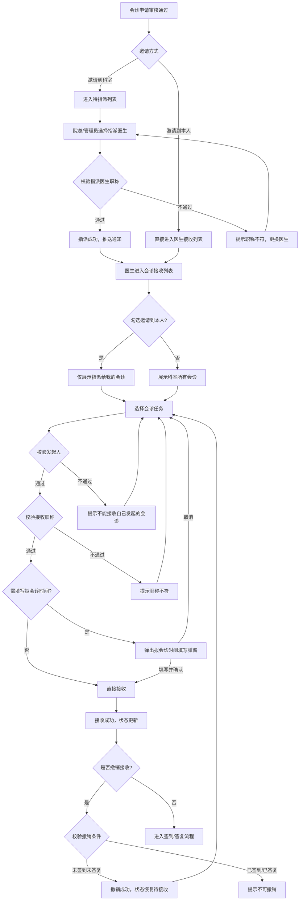
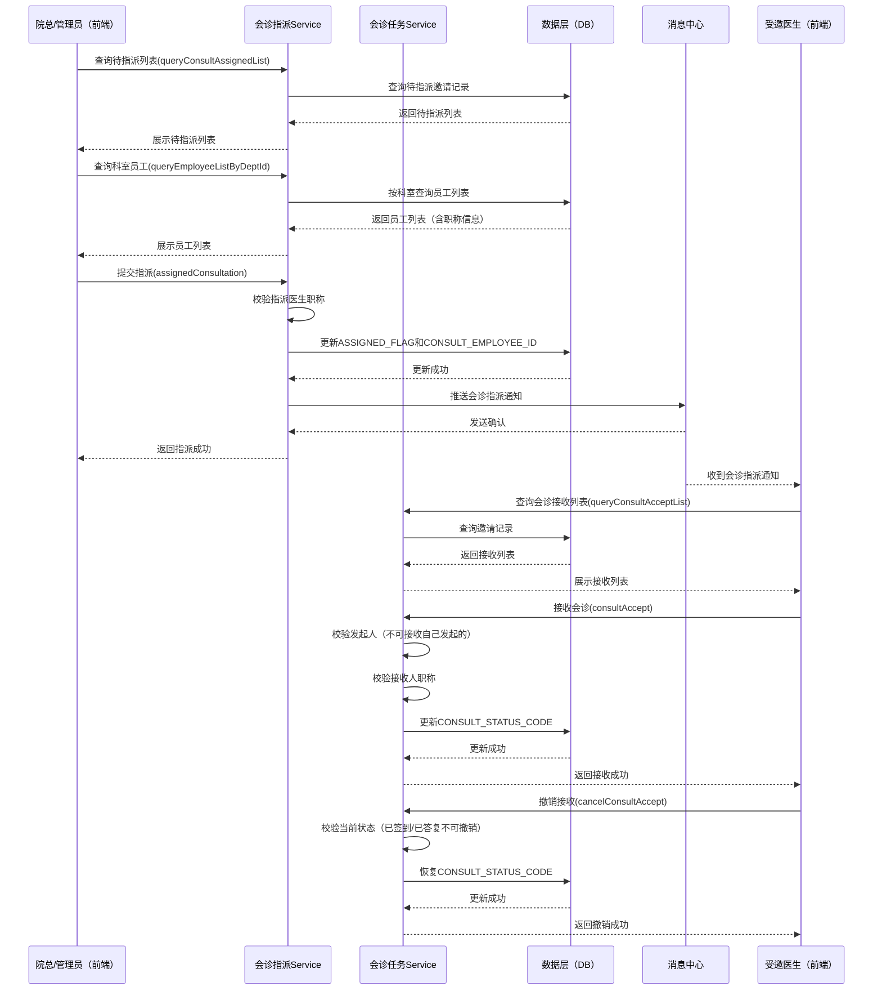

# BLGL-05-HZGL-004 会诊接收与指派 - Spec

> **功能编号**：BLGL-05-HZGL-004
> **文档类型**：Spec（研发视角）
> **文档版本**：V1.0
> **编写时间**：2026-08-21
> **编写人**：RACC

---

## 文档索引

本节提供本文档的章节结构索引与关联文档索引，便于读者快速定位与检索。

#### 章节索引

**PM-Spec（业务视角）**

| 章节号 | 章节名称 | 内容说明 |
|--------|---------|---------|
| 一 | 目标 | 一句话描述功能目标 |
| 二 | 约束 | 业务约束、技术约束、非功能性约束 |
| 三 | 验收标准 | 验收标准与验证方法 |
| 四 | 排除范围 | 本次不做、明确边界 |
| 五 | 关键决策记录 | 方案决策、其他决议 |
| 六 | 优先级 | 需求优先级说明 |
| 附录 | 填写检查清单 | 检查项与完成状态 |

**Analyst-Spec（产品视角）**

| 章节号 | 章节名称 | 内容说明 |
|--------|---------|---------|
| 一 | 功能编号体系 | 带父子层级的编号树 |
| 二 | 核心业务流程 | Mermaid 流程图 |
| 三 | 功能规格说明 | 各子功能点的概述、用户角色、业务流程、验收标准 |
| 四 | 排除范围 | 本需求不包含的功能项 |
| 五 | 业务规则清单 | 规则ID、规则名称、规则描述、优先级 |
| 六 | 关联文档 | 文档类型、文档路径、说明 |
| 七 | 待确认问题清单 | 所有 ⏳ 待确认项的汇总 |
| - | 填写检查清单 | 检查项与完成状态 |

**Spec（研发视角）**

| 章节号 | 章节名称 | 内容说明 |
|--------|---------|---------|
| 第1章 | 文档概述 | 文档目的、文档范围、术语定义、阅读指南、参考文档 |
| 第2章 | 功能背景与定位 | 功能背景、功能定位、目标用户、核心价值 |
| 第3章 | 业务流程设计 | 主流程/异常流程/边界流程（Given/When/Then） |
| 第4章 | 数据模型设计 | 核心数据结构、状态定义、系统参数定义 |
| 第5章 | 接口契约设计 | API列表、接口详细设计、错误码定义 |
| 第6章 | 技术方案设计 | 页面路径、技术栈、关键技术点、部署方案 |
| 第7章 | 测试用例预设计 | 功能/边界/异常/性能测试用例 |
| 第8章 | 非功能性要求 | 性能、安全、可用性、兼容性 |
| 第9章 | 依赖与风险 | 外部依赖、风险项 |
| 第10章 | 附录 | 流程图、时序图、参考文档 |

#### 版本历史

| 版本 | 日期 | 变更说明 | 编写人 |
|------|------|---------|--------|
| V1.0 | 2026-08-21 | 初始版本 | RACC |

#### 关联文档索引

| 序号 | 文档名称 | 文档类型 | 版本 | 位置 |
|------|---------|---------|------|------|
| 1 | BLGL-05-HZGL-004_会诊接收与指派-Spec.md | Spec（研发视角）（本文档） | V1.0 | 本目录 |
| 2 | BLGL-05-HZGL-004_会诊接收与指派_PM-spec.md | PM-Spec（业务视角） | V0.1 | 本目录 |
| 3 | BLGL-05-HZGL-004_会诊接收与指派_Analyst-spec.md | Analyst-Spec（产品视角） | V1.0 | 本目录 |
| 4 | BLGL-05-HZGL 05会诊管理功能点Spec.md | 功能点Spec（模块级） | V1.0 | 上级目录 |
| 5 | 新会诊历史需求.xlsx | 历史需求（资料区） | - | 资料区 |

> 📌 第4项为 Phase 1 输出，必须引用。版本号与 Phase 1 功能点Spec 实际版本一致。

---

## 1、文档概述

### 1.1、文档目的

本文档旨在明确"会诊接收与指派"功能（BLGL-05-HZGL-004）的业务背景与设计方案，为需求分析、研发实现、测试验收及评审提供统一的业务上下文、设计口径与决策依据。

**具体目的包括**：

1. 梳理会诊接收与指派功能的业务由来与历史需求演进脉络，说明"为什么要做"；
2. 明确功能的定位边界、目标用户与核心价值，回答"做成什么"；
3. 描述功能的业务流程、数据模型、接口契约与技术方案，回答"怎么做"；
4. 预设计测试用例并明确非功能性要求、依赖与风险，为研发与验收提供依据；
5. 作为 SPEC（功能编号体系、功能详情、业务规则、验收标准等章节）的业务前提与设计输入，保证各层文档业务口径一致。

> 📌 第1~2点对应业务层，第3~5点对应设计层。资料区的需求分析原文作为业务层素材，历史需求中的设计描述作为设计层素材。

### 1.2、文档范围

#### 1.2.1 纳入范围

本文档覆盖会诊接收与指派功能的完整业务背景与设计，包括：

- 会诊指派：院总/科室管理员分配会诊医生给具体会诊任务
- 待指派列表查询：查询"邀请到科室"且未经指派的会诊任务
- 指派记录查询：支持查询历史指派记录
- 会诊接收：受邀医生接收会诊任务（含指派到本人/科室未指派两种模式）
- 撤销接收：已接收的会诊支持撤销接收操作
- 不能接收自己发起的会诊申请（参数控制）
- 限制主治医师以下职称医生接收常规会诊（参数控制）
- 会诊接收查询增加受邀科室选择、会诊医生列、导出功能
- 会诊接收菜单支持科室全员查看及处理指定医生会诊申请
- 会诊接收列表查询增加会诊医生列、病人状态列、拟会诊时间列
- 会诊接收：【会诊患者】直接跳转到会诊患者界面
- 急会诊特殊颜色标记在会诊接收列表中的展示
- 会诊指派权限配置

#### 1.2.2 排除范围

本文档不涉及以下内容（详见其他功能点或模块）：

- 会诊申请（BLGL-05-HZGL-001）：会诊申请创建、提交、撤销、删除等
- 会诊审核（BLGL-05-HZGL-002）：审核流程、审核意见、多级审核等
- 会诊答复与记录（BLGL-05-HZGL-003）：会诊意见书写、会诊记录生成、PDF生成、病程记录关联等
- 会诊签到（BLGL-05-HZGL-005）：医生到场签到、撤销签到、代为签到等
- 会诊计费（BLGL-05-HZGL-006）：费用计算、医保校验、账单生成等
- 会诊配置管理（BC-HZGL-003）：参数配置、审核流程配置、科室配置等

### 1.3、术语定义

| 术语 | 定义 |
|------|------|
| 会诊指派 | 院总/科室管理员将"邀请到科室"的会诊任务分配给具体会诊医生的操作（来源：功能清单） |
| 会诊接收 | 受邀医生对会诊任务进行确认接收的操作，支持分配到我/科室未指派两种模式（来源：功能清单） |
| 撤销接收 | 已接收会诊的医生取消接收状态的操作，撤销后会诊状态恢复为待接收（来源：需求） |
| 待指派 | 会诊申请已审核通过但尚未指派具体会诊医生的任务列表，展示"邀请到科室"的会诊（来源：功能清单） |
| 指派到我 | 已指派给当前登录医生的会诊任务列表（来源：功能清单） |
| 科室未指派 | 邀请到科室但尚未指派具体医生的会诊任务列表，根据指派权限配置控制显示权限（来源：功能清单） |
| 邀请到本人 | 会诊申请时直接指定了具体医生的邀请方式，无需指派环节（来源：需求） |
| 邀请到科室 | 会诊申请时仅指定了受邀科室，未指定具体医生，需经指派环节分配医生（来源：需求） |
| 会诊邀请 | 会诊申请中指定的受邀科室或医生，一个会诊申请可包含多个邀请（来源：代码） |
| 会诊状态 | 会诊邀请的生命周期状态，包括待接收、已接收、已签到、已答复、已完成等（来源：代码） |

### 1.4、阅读指南

- **章节关系**：第1~2章为阅读铺垫与业务全貌（背景、定位、用户、价值）；第3~10章为设计实现层（流程、数据、接口、技术、测试、非功能、依赖风险、附录），可直接用于研发与测试。与 Analyst-Spec（产品视角）、PM-Spec（业务视角）的详细规则/验收口径互相引用，保持一致。
- **读者对象**：
  - 产品经理/需求分析师：阅读第1~2章了解业务全貌，据此维护 PM-Spec 与功能清单；
  - 研发：阅读第3~6章用于开发实现，第9~10章用于依赖评估与联调；
  - 测试：阅读第3章、第7~8章用于用例设计与验收；
  - 评审人员：以本文档为业务口径与设计基准，核对各层文档一致性。

### 1.5、参考文档

| 序号 | 文档名称 | 版本/日期 |
|------|---------|----------|
| 1 | 【历史需求】新会诊历史需求.xlsx（117条需求） | - |
| 2 | BLGL-05-HZGL-004_会诊接收与指派_PM-spec.md | V0.1 |
| 3 | BLGL-05-HZGL-004_会诊接收与指派_Analyst-spec.md | V1.0 |
| 4 | BLGL-05-HZGL 05会诊管理功能点Spec.md | V1.0 |
| 5 | 代码仓库扫描结果（sr-next） | 2026-08-21 |

---

## 2、功能背景与定位

### 2.1 功能背景

会诊接收与指派是会诊管理模块中承上启下的关键环节，处于审核通过后的任务分配与执行阶段，需满足：

- **管理要求**：会诊申请审核通过后，需要有效机制将会诊任务分配给合适的医生，并确保医生能够接收和处理任务。科室需要灵活的指派机制（院总指派/直接到人），以及严格的接收控制（职称限制、发起人限制）来保障会诊质量和患者安全。（来源：需求）
- **现状痛点**：
  - 会诊接收列表缺少按受邀科室筛选的能力，医生需浏览大量非本科室的会诊记录，查询效率低
  - 医生可能会接收自己发起的会诊申请，不符合医疗业务规范
  - 主治医师以下职称的医生可能接收常规会诊，影响会诊质量
  - 会诊接收列表缺少会诊医生列，需进入进展详情才能查看哪位医生做了答复
  - 已接收的会诊仅接收人本人能查看和操作，值班医生无法代处理
  - 会诊接收列表缺少"会诊目的"列，医生需反复点进详情页查看（来源：需求）
- **历史需求演进**：会诊接收与指派功能从最初的基础接收/指派操作，逐步演进到包含精细化控制（职称限制、发起人校验）、列表增强（受邀科室筛选、会诊医生列、导出功能）、权限扩展（科室全员查看、代处理）的完整能力集。涉及需求编号包括：1580340（不能接收自己发起的会诊）、1628426（限制主治医师以下接收）、1638561（科室全员查看）、1722466（会诊医生列及导出）、1551452（增加受邀科室选择）等。（来源：需求）

### 2.2 功能定位

"会诊接收与指派"是WiNEX病历管理（住院）-会诊管理模块的任务分配与执行功能，定位为：

- **会诊任务分配枢纽**：统一承载会诊任务的指派（院总/管理员分配医生）和接收（受邀医生确认接收）两大核心操作，是审核环节到执行环节的桥梁（来源：需求）
- **精细化接收控制**：通过参数控制不能接收自己发起的会诊、限制主治医师以下职称接收常规会诊，保障会诊业务的合规性和质量（来源：需求）
- **科室全员协作支撑**：支持科室全员查看会诊任务、代处理指定医生的会诊申请，满足值班医生代处理等日常协作场景（来源：需求）
- **高效查询与操作**：提供受邀科室筛选、会诊医生列、导出功能、列设置、急会诊颜色标记等增强能力，提升医生查找和处理会诊任务的效率（来源：需求）

### 2.3 目标用户

| 用户角色 | 主要使用场景 |
|---------|-------------|
| 院总/科室管理员（指派员） | 在待指派列表中查看邀请到科室的会诊，将任务指派给具体会诊医生（来源：需求） |
| 受邀医生（接收人） | 在会诊接收列表中查看指派给我/科室未指派的会诊任务，执行接收、撤销接收操作（来源：需求） |
| 科室值班医生 | 代处理本科室其他医生的会诊任务，查看患者信息并处理会诊（来源：需求） |
| 申请医生 | 在会诊申请后查看会诊被接收的状态，了解会诊进展（来源：需求） |

### 2.4 核心价值

| 价值维度 | 价值描述 |
|---------|---------|
| 任务分配效率提升 | 通过待指派列表和指派功能，院总/管理员可快速将会诊任务分配给合适的医生，支持指派权限配置（来源：需求） |
| 业务合规性 | 通过参数控制不能接收自己发起的会诊、限制主治医师以下职称接收常规会诊，保障会诊业务的合规性（来源：需求） |
| 科室协作效率 | 支持科室全员查看会诊任务、代处理指定医生的会诊申请，满足值班医生代处理需求，避免会诊延误（来源：需求） |
| 查询效率提升 | 新增受邀科室筛选、会诊医生列、会诊目的列、导出功能、列设置、急会诊颜色标记，减少医生无效点击，提升操作效率（来源：需求） |
| 流程可追溯 | 会诊接收记录（接收人、接收时间、撤销记录）完整保存，支持指派记录查询，保障会诊信息可追溯（来源：功能清单） |

---

## 3、业务流程设计（Given/When/Then）

> 📌 以下场景从资料区中的需求分析原文提取。每个场景的 Given/When/Then 内容必须有需求原文对应依据。

### 3.1 主流程

**Scenario 1: 院总指派会诊任务 + 医生接收会诊（完整流程）**

```gherkin
Given:
  - 会诊申请已通过审核（AUDIT_STATUS = 审核通过）
  - 会诊申请的邀请方式为"邀请到科室"（未指定具体医生）
  - 院总具有会诊指派权限（已配置指派权限，来源：需求）
  - 受邀医生具有会诊接收权限，且职称符合接收规则
  - 系统已配置不能接收自己发起的会诊参数（RECEIVE_RULE_001 = 否）
  - 系统已同步科室信息、员工信息、职称信息（来源：主数据系统MDM）

When:
  - 院总进入"待指派"列表，查看邀请到科室的会诊任务
  - 院总选择一条会诊记录，点击"指派"按钮
  - 系统弹出指派弹窗，展示该科室下的医生列表（含职称信息）
  - 院总选择目标会诊医生，填写指派备注（可选），点击"确认指派"
  - 系统校验被指派医生职称是否允许接收该会诊类型和级别
  - 指派成功后，系统向被指派医生推送会诊通知
  - 被指派医生收到通知后，进入"会诊接收"列表
  - 被指派医生勾选"邀请到本人"，查看指派给自己的会诊任务
  - 被指派医生点击"接收"按钮
  - 系统校验接收人与会诊发起人是否为同一人（校验不通过则拦截）
  - 系统校验接收人职称是否允许接收该会诊类型和级别
  - 系统完成接收操作

Then:
  - 会诊邀请记录（EMR_CONSULT_INVITATION）的 ASSIGNED_FLAG 更新为已指派
  - 会诊邀请记录的 CONSULT_EMPLOYEE_ID 更新为被指派医生ID
  - 会诊邀请记录的 CONSULT_STATUS_CODE 更新为"已接收"
  - 被指派医生在会诊接收列表中看到该会诊任务，状态为"已接收"
  - 院总在指派记录中可查询到该条指派历史和详情
  - 系统记录操作日志（EMR_CONSULT_ACTION_LOG）
  - 系统通过消息中心向被指派医生推送会诊通知
```

### 3.2 异常流程

**Scenario 2: 医生接收自己发起的会诊申请（业务异常）**

```gherkin
Given:
  - 某医生发起了一个会诊申请（申请医生 = 发起人A）
  - 系统参数 RECEIVE_RULE_001 配置为"否"（不允许发起人接收自己发起的会诊，来源：需求）
  - 该会诊邀请了医生A所在科室，并指派给了医生A本人
  - 医生A进入会诊接收列表，查看待接收任务

When:
  - 医生A点击"接收"按钮
  - 系统执行接收前工作流，校验接收人ID与会诊发起人ID

Then:
  - 系统校验发现接收人ID等于会诊发起人ID
  - 系统抛出异常，提示"不能接收自己发起的会诊！"
  - 接收操作被拦截，会诊邀请状态未变更
  - 系统记录异常日志
```

**Scenario 3: 主治医师以下职称医生接收常规会诊（业务异常）**

```gherkin
Given:
  - 系统参数 RECEIVE_RULE_002 配置了"限制不能接收会诊的职称规则"（来源：需求）
  - 限制规则：科间会诊 + 常规会诊 + 住院医师/医士不允许接收
  - 医生B为住院医师职称
  - 存在一条科间会诊（常规会诊级别），邀请到医生B所在科室并指派给医生B

When:
  - 医生B进入会诊接收列表，点击"接收"按钮
  - 系统校验接收人职称是否允许接收当前会诊类型和级别的会诊

Then:
  - 系统校验发现医生B的职称"住院医师"在限制规则中
  - 系统提示"您的职称不允许接收此类会诊"
  - 接收操作被拦截，会诊邀请状态未变更
  - 系统记录异常日志
```

**Scenario 4: 撤销接收时状态异常（数据异常）**

```gherkin
Given:
  - 医生C已接收某会诊任务（CONSULT_STATUS_CODE = 已接收）
  - 医生C已对该会诊进行签到（CONSULT_STATUS_CODE = 已签到）
  - 医生C点击"撤销接收"按钮

When:
  - 系统校验当前会诊邀请状态是否允许撤销接收

Then:
  - 系统检测到会诊状态为"已签到"，不允许撤销接收
  - 系统提示"该会诊已签到，无法撤销接收"
  - 撤销操作被拦截，会诊状态保持不变
  - 系统记录异常日志
```

### 3.3 边界流程

**Scenario 5: 会诊接收查询不勾选"邀请到本人"时展示科室全部会诊（边界场景）**

```gherkin
Given:
  - 系统参数"科室全员查询开关"已开启（来源：需求）
  - 登录医生归属于科室A
  - 科室A下有多个会诊任务：部分指派给登录医生本人，部分指派给其他医生，部分仅邀请到科室未指派

When:
  - 登录医生进入会诊接收列表
  - 取消勾选"邀请到本人"复选框
  - 点击"查询"按钮

Then:
  - 列表展示科室A下所有会诊任务（含指派给其他医生的和未指派的）
  - 已指派给其他医生的会诊，操作权限受授权配置控制
  - 未指派给登录医生的会诊，双击进入患者详情时校验授权记录
  - 有授权记录时允许进入，无授权记录时提示"无权限处理该会诊"
```

**Scenario 6: 会诊接收列表新增字段显示与列设置（边界场景）**

```gherkin
Given:
  - 会诊接收列表已新增"会诊医生"列、"会诊目的"列、"病人状态"列（来源：需求）
  - 系统已支持列设置功能

When:
  - 登录医生进入会诊接收列表
  - 列表默认显示"会诊医生"列（默认隐藏，需勾选后显示，来源：需求）
  - 医生点击"列设置"按钮，勾选"会诊医生"列
  - 确认后列表新增会诊医生列，显示会诊答复医生姓名
  - 医生点击"导出"按钮

Then:
  - 列表中"会诊医生"列展示各会诊的答复医生信息
  - 导出文件中包含"会诊医生"列数据
  - 列设置状态被记忆，下次进入页面时保持上次设置
  - 导出的数据与查询结果一致
```

---

## 4、数据模型设计

> 📌 以下数据模型信息来自代码仓库扫描结果（来源：代码）和资料区需求描述。

### 4.1 核心数据结构

#### 4.1.1 核心保存请求

**会诊指派请求参数**（来源：代码，ConsultAssignedController）：

| 字段名 | 类型 | 必填 | 备注 |
|--------|------|------|------|
| emrConsultInvitationId | String | 是 | 会诊邀请ID，标识需要指派的邀请记录 |
| consultEmployeeId | String | 是 | 被指派会诊医生ID |
| consultEmployeeName | String | 是 | 被指派会诊医生姓名 |
| assignRemark | String | 否 | 指派备注 |

**会诊接收请求参数**（来源：代码，ConsultTaskController）：

| 字段名 | 类型 | 必填 | 备注 |
|--------|------|------|------|
| emrConsultInvitationId | String | 是 | 会诊邀请ID |
| employeeId | String | 是 | 接收医生ID |

**会诊撤销接收请求参数**（来源：代码，ConsultTaskController）：

| 字段名 | 类型 | 必填 | 备注 |
|--------|------|------|------|
| emrConsultInvitationId | String | 是 | 会诊邀请ID |
| employeeId | String | 是 | 撤销医生ID |

#### 4.1.2 核心表/实体

| 表/实体 | 关键字段 | 说明 |
|---------|---------|------|
| EMR_CONSULT_INVITATION (ConsultInvitationV2PO) | EMR_CONSULT_INVITATION_ID, EMR_CONSULT_APPLY_ID, INVITED_DEPT_ID, INVITED_DEPT_NAME, INVITED_EMPLOYEE_ID, INVITED_EMPLOYEE_NAME, INVITED_TYPE_CODE, CONSULT_STATUS_CODE, ASSIGNED_FLAG, SIGNED_FLAG, CONSULT_EMPLOYEE_ID, CONSULT_EMPLOYEE_NAME 等35个字段 | 会诊邀请表，核心表。存储受邀科室/医生信息，其中 ASSIGNED_FLAG 标识是否已指派，CONSULT_STATUS_CODE 标识邀请状态，CONSULT_EMPLOYEE_ID 为被指派医生ID（来源：代码） |
| EMR_CONSULT_APPLY (ConsultApplyV2PO) | EMR_CONSULT_APPLY_ID, ENCOUNTER_NUMBER, PATIENT_NAME, BED_NO, CONSULT_TYPE_CODE, CONSULT_LEVEL_CODE, APPLY_CONSULT_EMPLOYEE_ID, APPLY_CONSULT_EMPLOYEE_NAME, CONSULT_PURPOSE, AUDIT_STATUS, STAGE_STATUS 等41个字段 | 会诊申请主表，通过 EMR_CONSULT_APPLY_ID 关联邀请表，用于获取发会诊人信息（来源：代码） |
| EMR_CONSULT_ASSIGNED_PARAM (EmrConsultAssignedParamV2PO) | 10个字段 | 指派参数配置表，存储指派相关配置（来源：代码） |
| EMR_CONSULT_ACTION_LOG (ConsultActionLogV2PO) | 操作日志相关字段，10个字段 | 会诊操作日志表，记录指派、接收、撤销接收等操作（来源：代码） |

### 4.2 状态定义

#### 邀请状态（CONSULT_STATUS_CODE）

| 状态码 | 状态名称 | 说明 |
|--------|---------|------|
| 399583869 | 未发送 | 申请已保存但未提交（来源：代码） |
| 399329838 | 已发送 | 申请已提交审核/审核通过已发送，等待接收（来源：代码） |
| 399329842 | 已接收 | 受邀医生已接收会诊任务（来源：代码） |
| 399583870 | 答复中 | 会诊医生正在书写会诊记录（来源：代码） |
| 399329843 | 已会诊 | 会诊记录已完成（来源：代码） |
| 399329839 | 已作废 | 申请已作废（来源：代码） |

#### 指派标记（ASSIGNED_FLAG）

| 状态码 | 状态名称 | 说明 |
|--------|---------|------|
| ⏳ 待确认 | 未指派 | 邀请到科室但尚未指派具体医生 |
| ⏳ 待确认 | 已指派 | 已指派具体会诊医生 |

> 📌 具体指派状态码值待从代码中的 ASSIGNED_FLAG 枚举定义确认。

### 4.3 系统参数定义

| 参数编码 | 参数名称 | 说明 |
|---------|---------|------|
| RECEIVE_RULE_001 | 是否允许发起人接收自己发起的会诊 | 参数路径：基础参数配置→会诊接收→接收规则。默认值：否（不允许）。控制是否允许会诊发起人接收自己发起的会诊申请（来源：需求） |
| RECEIVE_RULE_002 | 限制不能接收会诊的职称规则 | 参数路径：基础参数配置→会诊接收→接收规则。参数值结构：会诊类型+会诊级别+不允许接收的职称三维组合。默认值：空（不限制）。限制指定职称不能接收指定类型和级别的会诊（来源：需求） |
| ⏳ 待确认 | 科室全员查询开关 | 参数路径：基础参数配置→会诊接收→查询规则。控制会诊接收菜单是否允许科室全员查询模式（来源：需求） |
| RECEIVE_RULE_003 | 接收时需填写拟会诊时间的会诊分类 | 参数路径：基础参数配置→会诊接收→接收规则。默认值：空（不启用）。接收时需填写拟会诊时间的会诊分类（来源：需求） |
| ⏳ 待确认 | 指派权限配置 | 统一设置各科室的会诊指派人，可支持按角色、职称或具体人员进行配置（来源：功能清单） |
| ⏳ 待确认 | 必须走指派流程的会诊分类 | 配置哪些会诊分类邀请到科室后必须走指派流程（来源：功能清单） |

> 📌 部分参数编码和具体路径待从代码中 EMR_CONSULT_PARAM 实体或前端的参数配置页面确认。

---

## 5、接口契约设计

> 📌 接口列表和详细设计来自代码仓库扫描结果（来源：代码）。

### 5.1 API列表

| 序号 | API名称（代码函数） | 路径 | 方法 | 说明 |
|:----:|---------|------|:----:|------|
| 1 | queryConsultAssignedList | /api/v1/app_record_consult_v2/... (ConsultAssignedController) | POST | 查询待指派列表（来源：代码） |
| 2 | assignedConsultation | /api/v1/app_record_consult_v2/... (ConsultAssignedController) | POST | 会诊指派（来源：代码） |
| 3 | queryEmployeeListByDeptId | /api/v1/app_record_consult_v2/... (ConsultAssignedController) | POST | 根据科室查询员工信息（来源：代码） |
| 4 | queryConsultAcceptList | /api/v1/app_record_consult_v2/... (ConsultReplyController) | POST | 查询会诊接收列表（来源：代码） |
| 5 | queryAcceptConsultationStatic | /api/v1/app_record_consult_v2/... (ConsultReplyController) | POST | 会诊接收统计查询（来源：代码） |
| 6 | consultAccept | /api/v1/app_record_consult_v2/... (ConsultTaskController) | POST | 会诊接收（来源：代码） |
| 7 | cancelConsultAccept | /api/v1/app_record_consult_v2/... (ConsultTaskController) | POST | 会诊撤销接收（来源：代码） |

### 5.2 接口详细设计

#### 5.2.1 queryConsultAssignedList — 查询待指派列表

**请求参数**:
```json
{
  "emrConsultApplyId": "CA2026082100001",
  "invitedDeptId": "DEPT005",
  "pageNum": 1,
  "pageSize": 20
}
```

**返回值（成功）**:
```json
{
  "success": true,
  "data": {
    "total": 3,
    "pageNum": 1,
    "pageSize": 20,
    "list": [
      {
        "emrConsultInvitationId": "INV2026082100001",
        "emrConsultApplyId": "CA2026082100001",
        "encounterNumber": "ZY202608210001",
        "patientName": "张三",
        "bedNo": "12床",
        "deptName": "呼吸内科",
        "wardName": "呼吸一病区",
        "consultPurpose": "患者反复咳嗽、发热3周...",
        "consultTypeName": "科间会诊",
        "consultLevelName": "常规会诊",
        "invitedDeptId": "DEPT005",
        "invitedDeptName": "感染科",
        "assignedFlag": 0,
        "consultStatusCode": 399329838,
        "applyConsultEmployeeName": "李医生",
        "applyConsultAt": "2026-08-21 10:30:00"
      }
    ]
  }
}
```

**返回值（失败）**:
```json
{
  "success": false,
  "message": "查询失败",
  "data": null
}
```

#### 5.2.2 assignedConsultation — 会诊指派

**请求参数**:
```json
{
  "emrConsultInvitationId": "INV2026082100001",
  "consultEmployeeId": "EMP023",
  "consultEmployeeName": "王主任",
  "assignRemark": "请王主任会诊"
}
```

**返回值（成功）**:
```json
{
  "success": true,
  "data": {
    "emrConsultInvitationId": "INV2026082100001",
    "assignedFlag": 1,
    "message": "指派成功"
  }
}
```

**返回值（失败）**:
```json
{
  "success": false,
  "message": "指派失败：该医生的职称不允许接收此类会诊",
  "data": null
}
```

#### 5.2.3 consultAccept — 会诊接收

**请求参数**:
```json
{
  "emrConsultInvitationId": "INV2026082100001",
  "employeeId": "EMP023"
}
```

**返回值（成功）**:
```json
{
  "success": true,
  "data": {
    "emrConsultInvitationId": "INV2026082100001",
    "consultStatusCode": 399329842,
    "message": "会诊接收成功"
  }
}
```

**返回值（失败）**:
```json
{
  "success": false,
  "message": "接收失败：不能接收自己发起的会诊！",
  "data": null
}
```

#### 5.2.4 cancelConsultAccept — 会诊撤销接收

**请求参数**:
```json
{
  "emrConsultInvitationId": "INV2026082100001",
  "employeeId": "EMP023"
}
```

**返回值（成功）**:
```json
{
  "success": true,
  "data": {
    "emrConsultInvitationId": "INV2026082100001",
    "consultStatusCode": 399329838,
    "message": "撤销接收成功"
  }
}
```

**返回值（失败）**:
```json
{
  "success": false,
  "message": "撤销失败：该会诊已签到，无法撤销接收",
  "data": null
}
```

#### 5.2.5 queryConsultAcceptList — 查询会诊接收列表

**请求参数**:
```json
{
  "employeeId": "EMP023",
  "invitedDeptId": "DEPT005",
  "inviteToMeFlag": 1,
  "consultTypeCode": "DEPT_CONSULT",
  "consultStatusCode": 399329838,
  "startTime": "2026-08-01 00:00:00",
  "endTime": "2026-08-21 23:59:59",
  "pageNum": 1,
  "pageSize": 20
}
```

**返回值（成功）**:
```json
{
  "success": true,
  "data": {
    "total": 5,
    "pageNum": 1,
    "pageSize": 20,
    "list": [
      {
        "emrConsultInvitationId": "INV2026082100001",
        "emrConsultApplyId": "CA2026082100001",
        "encounterNumber": "ZY202608210001",
        "patientName": "张三",
        "bedNo": "12床",
        "deptName": "呼吸内科",
        "wardName": "呼吸一病区",
        "consultPurpose": "患者反复咳嗽、发热3周...",
        "consultTypeName": "科间会诊",
        "consultLevelName": "常规会诊",
        "invitedDeptId": "DEPT005",
        "invitedDeptName": "感染科",
        "consultStatusCode": 399329838,
        "applyConsultEmployeeName": "李医生",
        "applyConsultEmployeeId": "EMP001",
        "consultEmployeeName": "王主任",
        "applyConsultAt": "2026-08-21 10:30:00",
        "inpatientStatusName": "在区",
        "appointConsultAt": "2026-08-22 09:00:00"
      }
    ]
  }
}
```

### 5.3 错误码定义

| 错误码 | 错误信息 | 处理方式 |
|--------|---------|---------|
| ⏳ 待确认 | 不能接收自己发起的会诊！ | 前端提示用户，阻止接收操作 |
| ⏳ 待确认 | 您的职称不允许接收此类会诊 | 前端提示用户，阻止接收操作 |
| ⏳ 待确认 | 该医生的职称不允许接收此类会诊，请更换指派医生 | 前端提示用户，阻止指派操作 |
| ⏳ 待确认 | 该会诊已签到，无法撤销接收 | 前端提示用户，阻止撤销接收操作 |
| ⏳ 待确认 | 该会诊已答复，无法撤销接收 | 前端提示用户，阻止撤销接收操作 |
| ⏳ 待确认 | 该医生未找到或无权限 | 前端提示用户，阻止指派操作 |
| ⏳ 待确认 | 无权限处理该会诊 | 前端提示用户，阻止进入患者详情 |
| ⏳ 待确认 | 请填写拟会诊时间 | 前端提示用户，阻止接收操作 |

> 📌 具体错误码编码值待从代码中的常量类或枚举定义中确认。上述为业务错误描述，编码值待补充。

---

## 6、技术方案设计

### 6.1 页面路径

- **前端页面路径（新版v2）**: winning-webui-consultation-next/src/pages/task/（来源：代码）
  - /task-assign — 会诊指派（来源：代码）
  - /task-receive — 会诊接收（来源：代码）
  - /external-inpatient-bed-card — 住院床位卡（来源：代码）
  - /external-outpatient-task-receive — 门诊任务接收（来源：代码）
- **后端模块路径**: winning-emr-consultation-next/winning-emr-consultation-v2-task/（来源：代码）
  - Controller: ConsultAssignedController（指派）、ConsultReplyController（接收查询）、ConsultTaskController（接收/撤销接收）（来源：代码）
  - Service: 会诊任务业务逻辑层（来源：代码）
- **数据模型模块**: winning-emr-consultation-next/winning-emr-consultation-v2-model/（来源：代码）
  - ConsultInvitationV2PO（来源：代码）
  - EmrConsultAssignedParamV2PO（来源：代码）

### 6.2 技术栈

| 类别 | 技术 | 版本 |
|------|------|------|
| 前端框架（新版） | spark（WiNEX自研前端框架） | ⏳ 待确认 |
| 前端框架（旧版） | umi | ⏳ 待确认 |
| 后端框架 | Spring Boot | ⏳ 待确认 |
| ORM框架 | JPA (Hibernate) | ⏳ 待确认 |
| 数据库 | ⏳ 待确认 | ⏳ 待确认 |
| 消息中间件 | ⏳ 待确认（消息中心对接） | ⏳ 待确认 |

> 📌 具体版本号待从项目pom.xml或package.json中确认。

### 6.3 关键技术点

1. **工作流模式处理接收前校验**：会诊接收操作前需执行多个校验工作流（来源：代码）：
   - checkOperatePermissionWorkFlow — 操作权限校验
   - consultAuthorizationWorkFlow — 会诊授权校验
   - checkApplyerReceiveWorkFlow — 发起人校验（新增，来源：需求1580340）
   - 职称校验工作流 — 职称限制校验（新增，来源：需求1628426）
   - 采用工作流链模式（Chain of Responsibility），便于扩展新的校验规则

2. **参数驱动接收控制**：通过 RECEIVE_RULE_001（不允许发起人接收自己发起的会诊）和 RECEIVE_RULE_002（限制不能接收会诊的职称规则）两个参数控制接收行为，参数值变更即时生效，无需重启服务（来源：需求）

3. **三维组合参数配置**：RECEIVE_RULE_002 参数值结构为"会诊类型+会诊级别+不允许接收的职称"三维组合，配置界面复用已有的三联选择弹窗组件，后端通过 ConsultApplyInvitationRuleParam 解析（来源：需求）

4. **科室全员查询与授权**：会诊接收菜单通过"邀请到本人"勾选框控制查询范围，取消勾选时查询科室所有会诊（含指定给其他医生的）。通过授权配置（授权到科室/授权到医生）控制患者详情进入权限，满足值班医生代处理场景（来源：需求1638561）

5. **列设置与记忆功能**：会诊接收列表支持列设置（显示/隐藏、顺序调整），按界面独立记忆。首次访问显示默认列，后续恢复用户上次配置。新增的会诊医生列、病人状态列、拟会诊时间列等通过列设置控制显示（来源：需求）

6. **急会诊颜色标记**：会诊接收查询列表中，对会诊级别为"急会诊"（consultLevelCode = 977578）的数据行，整行字体颜色显示为红色，与旧版本行为保持一致（来源：需求1626513）

7. **指派流程控制**：通过参数配置哪些会诊分类邀请到科室后必须走指派流程，由指派人分配后才能接收，确保会诊任务分配的有序性（来源：功能清单）

8. **"邀请到本人"勾选记忆**：会诊接收查询的"邀请到本人"勾选框支持状态记忆，首次访问默认勾选，后续恢复用户上次操作状态（来源：需求）

### 6.4 部署方案

⏳ 待确认：部署方案信息未在资料区中详细描述。会诊管理模块作为WiNEX病历管理系统的一部分，通常随主应用一起部署，建议采用以下常规方式：

- 前后端分离部署，前端静态资源部署至Nginx/CDN
- 后端服务以JAR包形式部署至应用服务器集群
- 数据库采用Oracle/MySQL，使用独立schema存储会诊相关表
- 消息中心对接独立的消息中间件服务

---

## 7、测试用例预设计

> 📌 测试用例从第3章业务流程和资料区需求分析的场景归纳。Given/When/Then 与第3章保持一致。

### 7.1 功能测试

| 用例编号 | 测试场景 | Given | When | Then |
|---------|---------|-------|------|------|
| TC-F-001 | 院总指派会诊医生成功 | 院总登录，具有指派权限，存在邀请到科室的会诊任务 | 院总进入待指派列表→选择会诊→选择指派医生→点击确认指派 | 指派成功，ASSIGNED_FLAG更新，被指派医生收到通知 |
| TC-F-002 | 受邀医生接收会诊成功 | 会诊已指派给医生A，医生A登录 | 医生A进入会诊接收列表→勾选"邀请到本人"→点击接收 | 接收成功，CONSULT_STATUS_CODE更新为已接收 |
| TC-F-003 | 受邀医生撤销接收 | 医生A已接收会诊，未签到未答复 | 医生A在已接收列表中点击撤销接收→确认撤销 | 撤销成功，CONSULT_STATUS_CODE恢复为已发送 |
| TC-F-004 | 会诊接收列表增加受邀科室筛选 | 医生A登录，系统配置了多科室权限 | 医生A进入会诊接收列表→在受邀科室下拉选择科室→点击查询 | 列表仅展示该科室的会诊记录 |
| TC-F-005 | 会诊接收列表展示会诊医生列 | 存在已接收/已答复的会诊记录 | 医生A进入会诊接收列表→列设置勾选会诊医生列 | 列表展示会诊医生列，显示答复医生姓名 |
| TC-F-006 | 会诊接收列表导出功能 | 查询结果含多条会诊记录 | 医生A点击导出按钮 | 导出文件包含查询结果的全部列（含会诊医生列） |
| TC-F-007 | 会诊接收列表急会诊颜色标记 | 存在会诊级别为急会诊的记录 | 医生A进入会诊接收列表 | 急会诊行整行字体显示为红色 |
| TC-F-008 | 会诊接收列表--会诊患者跳转 | 会诊已被接收 | 医生A在会诊接收列表点击"会诊患者"操作 | 直接跳转到医生站对应患者详情界面 |
| TC-F-009 | 会诊指派查询员工列表 | 受邀科室有多个医生 | 院总在指派弹窗中选择受邀科室 | 系统展示该科室下的医生列表（含职称信息） |
| TC-F-010 | 会诊接收统计查询 | 系统中有多条会诊记录 | 医生A进入会诊接收统计页面 | 统计展示待接收、已接收、已会诊等状态数量 |

### 7.2 边界测试

| 用例编号 | 测试场景 | Given | When | Then |
|---------|---------|-------|------|------|
| TC-B-001 | 接收自己发起的会诊（参数不允许） | RECEIVE_RULE_001=否，医生A发起会诊，会诊指派给了医生A | 医生A点击接收按钮 | 提示"不能接收自己发起的会诊！"，接收被拦截 |
| TC-B-002 | 接收自己发起的会诊（参数允许） | RECEIVE_RULE_001=是，医生A发起会诊，会诊指派给了医生A | 医生A点击接收按钮 | 接收成功，不校验发起人 |
| TC-B-003 | 主治医师以下职称接收常规会诊 | RECEIVE_RULE_002配置住院医师不可接收常规会诊，医生B职称为住院医师 | 医生B接收常规会诊 | 提示"您的职称不允许接收此类会诊"，接收被拦截 |
| TC-B-004 | 主治医师接收常规会诊（不受限） | RECEIVE_RULE_002配置住院医师不可接收，医生C职称为主治医师 | 医生C接收常规会诊 | 接收成功 |
| TC-B-005 | 住院医师接收急会诊（不受限） | RECEIVE_RULE_002仅限制常规会诊 | 医生B（住院医师）接收急会诊 | 接收成功，不受职称限制 |
| TC-B-006 | 已签到后撤销接收 | 会诊已接收且已签到 | 医生点击撤销接收 | 提示"该会诊已签到，无法撤销接收" |
| TC-B-007 | 会诊接收列表不勾选"邀请到本人" | 科室全员查询开关已开启，存在科室全员会诊 | 取消勾选"邀请到本人"→点击查询 | 列表展示科室所有会诊（含指派给其他医生的） |
| TC-B-008 | 会诊医生列默认隐藏 | 首次进入会诊接收列表 | 查看列表 | 会诊医生列默认不显示，需通过列设置勾选 |

### 7.3 异常测试

| 用例编号 | 测试场景 | Given | When | Then |
|---------|---------|-------|------|------|
| TC-E-001 | 指派时被指派医生职称不符合 | RECEIVE_RULE_002配置住院医师不可接收，院总指派住院医师 | 院总点击确认指派 | 提示"该医生的职称不允许接收此类会诊，请更换指派医生" |
| TC-E-002 | 指派时被指派医生无权限 | 被指派医生不在受邀科室或权限不足 | 院总点击确认指派 | 提示"该医生未找到或无权限" |
| TC-E-003 | 接收时接口超时 | 网络异常或服务端响应慢 | 医生点击接收按钮 | 前端提示"系统繁忙，请稍后重试"，记录异常日志 |
| TC-E-004 | 会诊已被其他医生接收后重复接收 | 会诊已被医生A接收 | 医生B尝试接收同一会诊 | 提示"该会诊已被接收" |
| TC-E-005 | 参数未配置时的默认行为 | RECEIVE_RULE_001默认为"否" | 医生发起会诊后尝试接收自己发起的会诊 | 默认拦截，提示"不能接收自己发起的会诊！" |
| TC-E-006 | 受邀科室空医生列表 | 受邀科室无在职医生或医生信息未同步 | 院总在指派弹窗中选择该科室 | 提示"该科室暂无医生，请重新选择" |
| TC-E-007 | 会诊撤销后接收列表状态同步 | 会诊申请被撤销（逻辑删除） | 受邀医生在接收列表中查看 | 该会诊记录状态标记为"已撤销"，不可操作 |
| TC-E-008 | 无权限医生双击进入患者详情 | 科室全员查询模式下，值班医生无授权记录 | 值班医生双击非本人接收的会诊 | 提示"无权限处理该会诊"，不跳转 |

### 7.4 性能测试

| 用例编号 | 测试场景 | 指标 |
|---------|---------|------|
| TC-P-001 | 会诊接收列表查询响应时间 | ⏳ 待确认（建议：分页查询99%在2秒内完成） |
| TC-P-002 | 会诊指派提交响应时间 | ⏳ 待确认（建议：99%的请求在3秒内完成） |
| TC-P-003 | 会诊接收/撤销接收响应时间 | ⏳ 待确认（建议：99%的请求在2秒内完成） |
| TC-P-004 | 受邀科室员工列表查询响应时间 | ⏳ 待确认（建议：输入后1秒内展示匹配结果） |
| TC-P-005 | 会诊接收统计查询响应时间 | ⏳ 待确认（建议：统计查询99%在3秒内完成） |

---

## 8、非功能性要求

> 📌 指标数值待从资料区或性能测试标准中确认。下述为基于行业实践的合理建议值，标注为⏳待确认。

### 8.1 性能要求

| 指标 | 要求 |
|------|------|
| 会诊接收列表查询响应时间（P99） | ⏳ 待确认 |
| 会诊指派/接收/撤销接收响应时间（P99） | ⏳ 待确认 |
| 医生列表查询响应时间 | ⏳ 待确认 |
| 并发用户数 | ⏳ 待确认 |
| 系统可用性 | ⏳ 待确认 |

### 8.2 安全要求

| 要求 | 说明 |
|------|------|
| 权限控制 | 会诊指派必须受指派权限配置控制，未经授权的用户无法进行指派操作（来源：需求） |
| 接收校验 | 会诊接收时需校验接收人职称、发起人身份，不符合条件的拒绝接收（来源：需求） |
| 数据隔离 | 科室全员查询模式下，非本人接收的会诊进入患者详情需受授权配置控制（来源：需求） |
| 操作日志 | 会诊指派、接收、撤销接收等关键操作必须记录操作日志，支持审计追溯（来源：代码 - EMR_CONSULT_ACTION_LOG） |

**医疗行业特殊要求**

| 要求 | 说明 |
|------|------|
| 患者信息安全 | 会诊涉及患者诊疗信息，科室全员查询模式下需严格控制患者详情进入权限，防止未授权查看患者信息 |
| 诊疗可追溯 | 会诊指派和接收记录作为诊疗过程的重要记录，需保留完整的操作历史和审计轨迹 |
| 职称合规 | 限制主治医师以下职称医生接收常规会诊，保障会诊质量，符合医疗质量管理规范 |
| 防利益冲突 | 不允许医生接收自己发起的会诊申请，避免利益冲突，保障会诊客观性 |

### 8.3 可用性要求

| 指标 | 要求值 |
|------|--------|
| 系统可用性 | ⏳ 待确认（建议：99.9%以上，排除计划内维护） |
| 最大并发 | ⏳ 待确认 |
| 急会诊优先处理 | 会诊接收列表中急会诊行红色字体标记，确保优先处理（来源：需求） |
| 操作容错 | 关键操作（接收、撤销接收、指派）需提供二次确认，防止误操作 |
| 勾选状态记忆 | "邀请到本人"勾选框、列设置等用户偏好需记忆，提升操作效率（来源：需求） |

### 8.4 兼容性要求

| 类型 | 要求 |
|------|------|
| 浏览器兼容性 | ⏳ 待确认（建议：支持Chrome/Firefox/Edge最新版本） |
| 旧版兼容 | 新会诊V2的指派/接收功能需兼容V1版本的数据，已存在的会诊邀请数据可正常处理（来源：代码 - v2与v1并存） |
| 外部系统兼容 | 需兼容MDM主数据系统（员工/科室/职称信息）、消息中心（通知推送）等外部系统的接口变化（来源：需求） |
| 移动端适配 | ⏳ 待确认（会诊通知是否支持移动端查看和接收） |

---

## 9、依赖与风险

### 9.1 外部依赖

| 依赖项 | 说明 |
|--------|------|
| 主数据系统（MDM） | 依赖MDM同步科室信息、员工信息、职称信息，用于指派医生选择和接收时职称校验（来源：需求） |
| 消息中心 | 会诊指派后需通过消息中心向被指派医生推送通知（来源：需求） |
| 会诊申请模块 | 会诊接收与指派依赖会诊申请模块创建的会诊邀请数据（EMR_CONSULT_INVITATION）（来源：代码） |
| 会诊审核模块 | 会诊申请审核通过后，任务才可进入待指派/待接收列表（来源：需求） |
| 权限管理系统 | 依赖权限管理系统进行会诊指派权限配置和角色权限校验（来源：需求） |
| 住院医生站 | 会诊接收功能嵌入住院医生站，"会诊患者"跳转需依赖医生站的患者详情界面（来源：需求） |
| 数据库 | 依赖数据库存储会诊邀请数据和操作日志，需支持事务（来源：代码） |

### 9.2 风险项

| 风险项 | 等级 | 说明 | 应对方案 |
|--------|------|------|---------|
| MDM主数据同步延迟 | 中 | 员工/科室/职称信息同步不及时，导致指派医生列表不准确或职称校验失败 | 增加手动刷新机制，前端缓存数据，设置合理的同步周期 |
| 职称限制参数配置复杂 | 中 | RECEIVE_RULE_002 为三维组合参数（会诊类型+会诊级别+职称），配置错误可能导致应限制的未限制或不应限制的被限制 | 提供默认配置模板，配置界面使用下拉选择减少手动输入，保存时校验参数有效性 |
| 科室全员查询模式数据安全 | 中 | 科室全员可见指定医生会诊，可能泄露敏感信息 | 新增参数控制，默认关闭；开启前需医院评估风险；授权配置遗漏时提示无权限 |
| 并发接收冲突 | 中 | 同一会诊被多个医生同时点击接收，可能导致重复接收 | 后端接收操作加锁（乐观锁或悲观锁），确保同一邀请只能被一个医生成功接收 |
| 接收控制参数变更影响历史数据 | 低 | 参数变更后，已接收的会诊不受影响，但可能导致用户理解不一致 | 参数变更时记录变更日志，前端提示用户参数变更生效范围 |
| 撤销接收与签到状态冲突 | 低 | 已签到的会诊尝试撤销接收，导致状态不一致 | 后端校验当前状态，已签到/已答复的会诊不允许撤销接收，前端明确提示 |

---

## 10、附录

### 10.1 流程图

#### 会诊接收与指派核心流程



### 10.2 时序图

#### 会诊指派与接收时序



### 10.3 参考文档

- BLGL-05-HZGL 05会诊管理功能点Spec.md（V1.0）— 第5章功能点清单、第8章代码架构
- 【历史需求】新会诊历史需求.xlsx（涉及本功能点的需求编号：1580340_不能接收自己发起的会诊、1628426_限制主治医师以下接收、1638561_科室全员查看、1722466_会诊医生列及导出、1551452_增加受邀科室选择、1545919_会诊患者跳转、1626513_急会诊颜色标记、1623664_增加会诊目的列、1604738_拟会诊时间弹窗等）
- 关联Spec: BLGL-05-HZGL-004_会诊接收与指派_PM-spec.md（V0.1）— 业务约束与验收标准
- 关联Spec: BLGL-05-HZGL-004_会诊接收与指派_Analyst-spec.md（V1.0）— 功能编号体系与业务规则
- 关联Spec: BLGL-05-HZGL-001 会诊申请-Spec.md — 会诊申请前置流程
- 关联Spec: BLGL-05-HZGL-002 会诊审核-Spec.md — 会诊审核前置流程
- 关联Spec: BLGL-05-HZGL-005 会诊签到-Spec.md — 会诊接收后置流程

---

## 填写检查清单

| 序号 | 检查项 | 是否完成 |
|:----:|--------|:--------:|
| 1 | 章节索引与正文章节一致 | ✅ |
| 2 | 版本历史记录完整 | ✅ |
| 3 | 关联文档索引已登记全部Spec | ✅ |
| 4 | 文档目的明确回答"为什么做/做成什么/怎么做" | ✅ |
| 5 | 纳入范围/排除范围清晰 | ✅ |
| 6 | 术语定义覆盖关键概念，从资料区可溯源 | ✅ |
| 7 | 参考文档已登记 | ✅ |
| 8 | 功能背景基于法规/规范/需求来源组织 | ✅ |
| 9 | 功能定位体现业务价值（3~5个定位点） | ✅ |
| 10 | 目标用户角色覆盖完整，在需求原文中有出处 | ✅ |
| 11 | 核心价值可陈述，与 Phase 1 口径一致 | ✅ |
| 12 | 业务流程：主流程≥1、异常≥3、边界≥2，Given/When/Then 具体 | ✅（1主+3异常+2边界） |
| 13 | 数据模型：字段/表/状态/参数可溯源（概念ID/表名/参数编码） | ✅（部分状态码/参数编码⏳待确认） |
| 14 | 接口契约：API列表+详细设计+错误码齐全（资料区有信息时）或标记待确认 | ✅（7个API列表+5个详细设计+8个错误码） |
| 15 | 技术方案：页面路径/技术栈/关键点/部署方案（资料区有信息时）或标记待确认 | ✅（4个页面路径+8个关键点+技术栈⏳待确认） |
| 16 | 测试用例：功能/边界/异常/性能覆盖，与第3章场景对应 | ✅（10功能+8边界+8异常+5性能） |
| 17 | 非功能性要求：性能/安全/可用性/兼容性指标可量化或标记待确认 | ✅（安全要求具体，性能指标⏳待确认） |
| 18 | 依赖与风险：外部依赖登记完整，风险有具体应对方案或标记待确认 | ✅（7个依赖+6个风险） |
| 19 | 附录：流程图/时序图与正文流程一致 | ✅（1个流程图+1个时序图） |
| 20 | 全文无占位符 `< >` 残留 | ✅ |
| 21 | 全文陈述可溯源至资料区，无来源的已标记 ⏳ | ✅ |
| 22 | 人工审核确认完成 | ⏳ 待确认 |

---

**文档状态**：⬜ 待审核
**维护责任**：RACC
**下次更新**：根据评审反馈优化