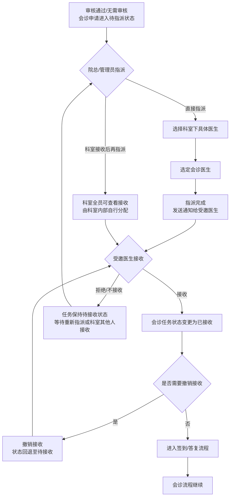
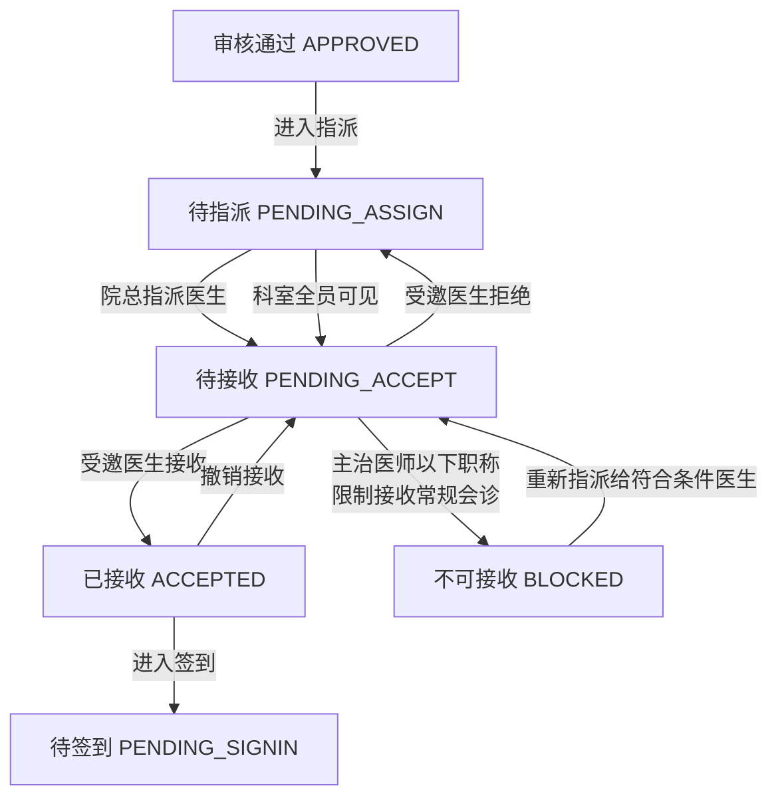

# BLGL-05-HZGL-004 会诊接收与指派_Analyst-Spec

> **需求编号**：BLGL-05-HZGL-004
> **父需求**：BLGL-05-HZGL 会诊管理
> **关联PM Spec**：BLGL-05-HZGL-004_会诊接收与指派_PM-spec.md（待产出）
> **Spec版本**：V1.0
> **编写时间**：2026-08-21
> **编写人**：RACC

---

## 一、功能编号体系

> 使用带父子层级的 `<功能编号>-ID` 编号，便于追溯和讨论。

### 1.1 功能层级结构

```
BLGL-05-HZGL-004: 会诊接收与指派
  ├─ BLGL-05-HZGL-004-01: 会诊指派
  │     ├─ 院总/管理员分配会诊医生
  │     └─ 指派后触发通知给受邀医生
  ├─ BLGL-05-HZGL-004-02: 会诊接收
  │     ├─ 受邀医生接收会诊任务
  │     ├─ 会诊接收查询增加受邀科室选择
  │     ├─ 会诊接收菜单支持科室全员查看
  │     └─ 【会诊患者】直接跳转到会诊患者界面
  └─ BLGL-05-HZGL-004-03: 会诊撤销接收
        ├─ 撤销已接收的会诊任务
        └─ 撤销后通知相关方
```

> 拆分依据：Phase 1 功能点Spec 第5章中已列出的子功能点。不新增功能清单中不存在的子功能点。

### 1.2 功能编号表

| REQ-ID | 功能名称 | 类型 | 优先级 | 说明 |
|--------|---------|------|--------|------|
| BLGL-05-HZGL-004-01 | 会诊指派 | 功能 | P0 | 院总/科室管理员将会诊任务指派给具体会诊医生，指派后触发通知 |
| BLGL-05-HZGL-004-02 | 会诊接收 | 功能 | P0 | 受邀医生接收会诊任务，支持受邀科室选择筛选，科室全员可见，并从【会诊患者】跳转到会诊患者界面 |
| BLGL-05-HZGL-004-03 | 会诊撤销接收 | 功能 | P1 | 撤销已接收的会诊任务，触发状态回退和相关通知 |

> 类型：功能 / 子功能。优先级与 PM-Spec 一致。功能编号来自 Phase 1 功能点Spec 第5章，子编号从功能清单展开。

---

## 二、核心业务流程

> 每个主流程一个 Mermaid flowchart。**流程步骤必须能在需求原文中找到对应描述，不推测中间步骤。**

### 2.1 会诊接收与指派全流程



### 2.2 会诊接收与指派状态流转



> 至少 2 个 Mermaid 流程图。每个流程对应一个核心业务场景。

---

## 三、功能规格说明

> 每个 REQ-ID 展开详细描述，包含功能概述、用户角色、业务流程、验收标准。

---

### BLGL-05-HZGL-004-01: 会诊指派

#### 3.1.1 功能概述

院总或科室管理员在会诊申请审核通过后（或无需审核的会诊申请），对会诊任务进行指派操作，将具体的会诊任务分配给指定的会诊医生。指派完成后，系统发送通知给被指派的医生。支持直接指派到具体医生，也支持科室全员可见后由科室内部自行分配。

#### 3.1.2 用户角色

| 角色 | 使用场景 | 权限要求 | 操作频率 |
|------|---------|---------|---------|
| 院总（医务科） | 全院会诊的统一指派管理 | 需具有院总指派权限 | 中频 |
| 科室管理员 | 本科室会诊的指派管理 | 需具有科室管理权限 | 中频 |
| 受邀科室主任 | 授权本科室会诊任务的指派 | 需具有科室指派权限 | 低频 |

> 角色必须在需求原文中出现过。操作频率从需求分析中归纳。

#### 3.1.3 业务流程（Given/When/Then）

##### 主流程（至少 1 个）

**Scenario 1: 院总成功指派会诊任务给具体医生**

```gherkin
Given:
  - 院总已登录系统，具有会诊指派权限
  - 会诊申请已审核通过，状态为"待指派"
  - 会诊类型为"科间会诊"，受邀科室为"呼吸内科"
  - 呼吸内科下有具备会诊资格的医生列表（含职称信息）

When:
  - 院总进入会诊指派页面
  - 查看待指派列表，找到该会诊申请
  - 查看会诊申请详情，确认会诊目的和受邀科室
  - 在呼吸内科医生列表中选择"王医生（副主任医师）"
  - 确认指派操作

Then:
  - 会诊任务状态变更为"待接收"
  - 指派记录保存至EMR_CONSULT_INVITATION表的ASSIGN_DOCTOR字段
  - 系统发送通知给被指派的医生："您被指定为会诊医生，请及时接收"
  - 被指派医生的会诊接收列表中出现该会诊任务
  - 操作日志记录本次指派操作（含指派人和被指派医生）
```

##### 异常流程（至少 3 个）

**Scenario 2: 被指派的医生当前不可接诊（业务异常）**

```gherkin
Given:
  - 院总已登录系统
  - 院总在指派页面选择会诊医生时，选择了"李医生（主治医师）"
  - 李医生当前处于休假/出差状态
  - 系统已配置医生排班/出勤信息

When:
  - 院总点击"确认指派"按钮
  - 系统检测李医生当前不在岗

Then:
  - 系统提示"该医生当前不在岗，请选择其他医生或联系科室重新安排"
  - 指派操作被阻挡，状态保持不变
  - 院总可选择其他医生进行指派
  - 系统记录指派失败日志
```

**Scenario 3: 受邀科室下没有符合条件的会诊医生（数据异常）**

```gherkin
Given:
  - 院总已登录系统
  - 会诊申请类型为"常规会诊"
  - 系统配置限制主治医师以下职称医生接收常规会诊
  - 受邀科室下所有医生均为住院医师或以下职称

When:
  - 院总进入指派页面
  - 系统加载受邀科室医生列表
  - 列表为空或仅显示不符合条件的医生

Then:
  - 系统提示"该科室下暂无符合会诊条件的医生，请调整会诊类型或联系科室"
  - 院总可联系科室协调安排，或将会诊类型调整为其他类型
  - 支持院总手动选择指定医生（不受职称限制），但需二次确认 ⏳ 待确认
  - 操作日志记录"无符合条件的医生"的异常情况
```

**Scenario 4: 指派时系统通知发送失败（系统异常）**

```gherkin
Given:
  - 院总已登录系统
  - 院总已完成指派操作，选择了具体会诊医生
  - 指派数据已保存成功
  - 消息中心服务不可用

When:
  - 院总点击"确认指派"按钮
  - 指派记录保存成功
  - 系统尝试发送通知给被指派医生时失败

Then:
  - 指派操作完成，会诊任务状态已变更为"待接收"
  - 系统提示"指派成功，但通知发送失败，请稍后重试或手动通知"
  - 被指派医生进入会诊接收列表可看到该任务
  - 系统记录通知发送失败日志
  - 系统提供"重新发送通知"按钮供院总手动触发
```

##### 边界流程（至少 2 个）

**Scenario 5: 院总指派时选择科室全员查看方式（边界流程）**

```gherkin
Given:
  - 院总已登录系统
  - 会诊申请已审核通过
  - 受邀科室为"呼吸内科"
  - 院总希望科室内部自行分配会诊医生

When:
  - 院总进入指派页面
  - 在指派方式中选择"科室全员可见"模式
  - 不指定具体会诊医生
  - 确认指派操作

Then:
  - 会诊任务状态变更为"待接收（科室全员）"
  - 呼吸内科全体医生均可在会诊接收列表中看到该会诊任务
  - 科室内部医生可自行接收任务
  - 系统发送通知给呼吸内科全体医生
  - 任务描述中标注"科室全员可见，请尽快接收"
  - 会诊接收查询支持按"受邀科室"条件筛选
```

**Scenario 6: 会诊申请取消后指派任务自动失效（边界流程）**

```gherkin
Given:
  - 院总已指派会诊任务给指定医生，状态为"待接收"
  - 申请人因病情变化取消了会诊申请
  - 申请人取消操作已生效

When:
  - 被指派医生查看会诊接收列表
  - 查看该会诊任务

Then:
  - 已取消的会诊申请对应的指派任务状态变更为"已取消"
  - 被指派医生在接收列表中仍可看到该条记录，但标注"会诊已取消"
  - 系统发送通知给被指派医生："会诊申请已取消，指派任务自动失效"
  - 接收列表中的操作按钮（接收/拒绝）置灰不可用
  - 操作日志记录"会诊取消导致指派任务失效"
```

#### 3.1.5 验收标准

| AC编号 | 验收标准 | 对应REQ-ID | 验证方法 | 验证场景 |
|--------|---------|-----------|---------|---------|
| AC-001 | 院总可成功指派会诊任务给指定医生，指派后状态变更为待接收，通知被指派医生 | BLGL-05-HZGL-004-01 | 功能测试 | Scenario 1 |
| AC-002 | 被指派医生不在岗时，系统提示并阻止指派，院总可选择其他医生 | BLGL-05-HZGL-004-01 | 功能测试 | Scenario 2 |
| AC-003 | 受邀科室下无符合条件医生时，系统给出明确提示，支持灵活处理 | BLGL-05-HZGL-004-01 | 功能测试 | Scenario 3 |
| AC-004 | 通知发送失败时指派操作完成，提供重新发送通知功能 | BLGL-05-HZGL-004-01 | 功能测试 | Scenario 4 |
| AC-005 | 支持"科室全员可见"指派模式，科室全体医生可查看并接收，查询支持按受邀科室筛选 | BLGL-05-HZGL-004-01 | 功能测试 | Scenario 5 |
| AC-006 | 会诊申请取消后指派任务自动失效，接收列表中标注已取消，操作按钮置灰 | BLGL-05-HZGL-004-01 | 功能测试 | Scenario 6 |

---

### BLGL-05-HZGL-004-02: 会诊接收

#### 3.2.1 功能概述

受邀医生（或被指派医生）查看会诊接收列表，接收分配给自己的会诊任务。会诊接收列表支持按受邀科室选择筛选，会诊接收菜单支持科室全员查看。系统限制不能接收自己发起的会诊。限制主治医师以下职称医生接收常规会诊。接收后，【会诊患者】支持直接跳转到会诊患者界面。被指派的医生从接收列表中点击"接收"按钮，确认参与会诊。

#### 3.2.2 用户角色

| 角色 | 使用场景 | 权限要求 | 操作频率 |
|------|---------|---------|---------|
| 受邀医生（被指派医生） | 查看并接收会诊任务 | 需具有会诊接收权限，按职称限制 | 中频 |
| 科室全员 | 科室全员可见模式下查看会诊任务 | 科室全员可见 | 中频 |
| 住院医生（申请人） | 不能接收自己发起的会诊 | 无权限接收本人申请的会诊 | 不适用 |

> 角色必须在需求原文中出现过。操作频率从需求分析中归纳。

#### 3.2.3 业务流程（Given/When/Then）

##### 主流程（至少 1 个）

**Scenario 1: 受邀医生成功接收会诊任务**

```gherkin
Given:
  - 受邀医生已登录系统，具有会诊接收权限
  - 该医生的会诊接收列表中有待接收的会诊任务
  - 会诊任务由院总指派给该医生，或科室全员可见模式下该医生主动查看
  - 该医生的职称为副主任医师，满足常规会诊接收条件
  - 该医生不是该会诊的申请人

When:
  - 受邀医生进入会诊接收列表页面
  - 列表展示所有待接收的会诊任务
  - 受邀医生在列表中查看到该会诊任务
  - 受邀医生点击"接收"按钮
  - 系统确认接收操作

Then:
  - 会诊任务状态变更为"已接收"
  - 接收记录保存至EMR_CONSULT_INVITATION表，记录接收人、接收时间
  - 系统通知申请人："您的会诊申请已被XX医生接收"
  - 受邀医生在会诊患者界面可看到该患者信息
  - 【会诊患者】支持直接跳转到会诊患者界面
  - 操作日志记录本次接收操作
```

##### 异常流程（至少 3 个）

**Scenario 2: 医生尝试接收自己发起的会诊（业务异常）**

```gherkin
Given:
  - 住院医生已登录系统
  - 该医生曾发起过一条会诊申请
  - 该会诊申请已审核通过并进入待接收状态
  - 该医生在会诊接收列表中看到了该会诊任务

When:
  - 该医生点击"接收"按钮
  - 系统检测该医生是该会诊的申请人

Then:
  - 系统提示"您不能接收自己发起的会诊，请等待其他医生接收"
  - 接收操作被阻挡，状态保持不变
  - 该会诊任务在该医生的接收列表中仍然可见，但接收按钮置灰或隐藏
  - 系统记录本次违规操作尝试日志
```

**Scenario 3: 主治医师以下职称医生尝试接收常规会诊（业务异常）**

```gherkin
Given:
  - 住院医师（住院医师职称）已登录系统
  - 会诊接收列表中有一条常规会诊任务
  - 系统配置限制：主治医师以下职称医生不能接收常规会诊
  - 该住院医师的职称为"住院医师"（低于主治医师）

When:
  - 该住院医师点击"接收"按钮
  - 系统检测该医生的职称及会诊类型

Then:
  - 系统提示"您的职称暂不符合接收常规会诊的条件，请联系院总指派"
  - 接收操作被阻挡，状态保持不变
  - 该会诊任务在该医生的接收列表中仍然可见，但接收按钮置灰并标注"职称不符"
  - 系统记录本次限制操作日志
  - 该医生可联系院总重新指派给符合职称条件的医生
```

**Scenario 4: 会诊接收列表加载失败（系统异常）**

```gherkin
Given:
  - 受邀医生已登录系统
  - 网络连接正常
  - 后端服务负载较高或数据库连接异常

When:
  - 受邀医生进入会诊接收列表页面
  - 系统发起列表数据请求
  - 请求超时或返回服务端错误

Then:
  - 系统提示"接收列表加载失败，请稍后重试"
  - 列表区域显示错误状态提示和"重新加载"按钮
  - 不影响其他功能模块的正常使用
  - 系统记录异常日志供排查
  - 受邀医生可点击"重新加载"按钮重试
```

##### 边界流程（至少 2 个）

**Scenario 5: 会诊接收列表按受邀科室筛选查询（边界流程）**

```gherkin
Given:
  - 受邀医生已登录系统
  - 该医生同时属于多个科室（如呼吸内科和感染科）
  - 会诊接收列表中有来自不同科室的会诊任务
  - 系统支持按受邀科室筛选

When:
  - 受邀医生进入会诊接收列表页面
  - 默认展示所有待接收的会诊任务（跨科室）
  - 受邀医生在筛选条件中选择"呼吸内科"
  - 确认筛选

Then:
  - 列表刷新，仅展示受邀科室为"呼吸内科"的会诊任务
  - 筛选条件支持多选科室
  - 筛选后的列表支持分页查看
  - 筛选条件可清除，恢复显示全部
  - 筛选结果计数正确显示
```

**Scenario 6: 【会诊患者】跳转到会诊患者界面（边界流程）**

```gherkin
Given:
  - 受邀医生已成功接收会诊任务
  - 会诊接收列表或会诊任务详情中提供"会诊患者"入口

When:
  - 受邀医生在接收列表或任务详情中点击"会诊患者"链接/按钮
  - 系统跳转到会诊患者界面

Then:
  - 跳转后直接展示该会诊对应的患者信息
  - 会诊患者界面包含：患者基本信息、会诊申请详情、病历摘要、检查检验结果等
  - 跳转目标页面为该会诊单绑定的患者，而非患者列表
  - 页面加载时间在可接受范围内（<3秒）
  - 跳转前后会话不丢失，无需重新登录
```

#### 3.2.5 验收标准

| AC编号 | 验收标准 | 对应REQ-ID | 验证方法 | 验证场景 |
|--------|---------|-----------|---------|---------|
| AC-007 | 受邀医生可成功接收会诊任务，状态变更为已接收，通知申请人 | BLGL-05-HZGL-004-02 | 功能测试 | Scenario 1 |
| AC-008 | 医生不能接收自己发起的会诊，接收按钮置灰，有明确提示 | BLGL-05-HZGL-004-02 | 功能测试 | Scenario 2 |
| AC-009 | 主治医师以下职称医生不能接收常规会诊，接收按钮置灰并标注"职称不符" | BLGL-05-HZGL-004-02 | 功能测试 | Scenario 3 |
| AC-010 | 会诊接收列表加载失败时给出明确提示，提供重新加载入口 | BLGL-05-HZGL-004-02 | 功能测试 | Scenario 4 |
| AC-011 | 会诊接收列表支持按受邀科室筛选查询，筛选结果正确 | BLGL-05-HZGL-004-02 | 功能测试 | Scenario 5 |
| AC-012 | 【会诊患者】支持直接跳转到会诊患者界面，展示对应患者信息 | BLGL-05-HZGL-004-02 | 功能测试 | Scenario 6 |

---

### BLGL-05-HZGL-004-03: 会诊撤销接收

#### 3.3.1 功能概述

受邀医生在已接收会诊任务后，因特殊原因（如工作冲突、患者病情变化等）需要撤销已接收的会诊任务。撤销接收后，会诊任务状态回退至"待接收"状态，并通知相关方（申请人、院总等）。撤销操作需有合理的撤销原因记录。

#### 3.3.2 用户角色

| 角色 | 使用场景 | 权限要求 | 操作频率 |
|------|---------|---------|---------|
| 受邀医生（已接收者） | 因故需要撤销已接收的会诊任务 | 本人可撤销本人已接收的会诊 | 低频 |
| 院总/科室管理员 | 查看撤销记录，重新指派 | 需具有查看权限 | 低频 |

> 角色必须在需求原文中出现过。操作频率从需求分析中归纳。

#### 3.3.3 业务流程（Given/When/Then）

##### 主流程（至少 1 个）

**Scenario 1: 受邀医生成功撤销已接收的会诊任务**

```gherkin
Given:
  - 受邀医生已登录系统
  - 该医生已接收了一条会诊任务，状态为"已接收"
  - 该医生尚未签到，尚未提交会诊答复
  - 该医生因工作冲突（如急诊手术）需要撤销接收

When:
  - 受邀医生进入会诊任务详情页
  - 查看已接收的会诊任务
  - 点击"撤销接收"按钮
  - 系统弹出撤销原因填写对话框
  - 受邀医生选择撤销原因"工作冲突"并填写具体说明"临时急诊手术，无法参加会诊"
  - 确认撤销操作

Then:
  - 会诊任务状态从"已接收"回退至"待接收"
  - 撤销记录保存至操作日志，含撤销人、撤销时间、撤销原因
  - 系统通知申请人："会诊医生XX已撤销接收，原因：临时急诊手术"
  - 系统通知院总："会诊任务已被撤销，请重新指派"
  - 该会诊任务重新出现在科室接收列表或院总指派列表中
  - 院总可重新指派或其他医生可重新接收
```

##### 异常流程（至少 3 个）

**Scenario 2: 受邀医生已签到后尝试撤销接收（业务异常）**

```gherkin
Given:
  - 受邀医生已登录系统
  - 该医生已接收会诊任务并已完成签到
  - 会诊任务状态为"已签到"或"进行中"
  - 该医生尝试撤销接收

When:
  - 该医生点击"撤销接收"按钮
  - 系统检测该会诊任务已签到

Then:
  - 系统提示"该会诊已签到，无法撤销接收，请联系院总处理"
  - 撤销接收操作被阻挡，状态保持不变
  - 系统提供联系院总的方式或提示
  - 操作日志记录本次撤销尝试
```

**Scenario 3: 受邀医生已提交会诊答复后尝试撤销接收（数据异常）**

```gherkin
Given:
  - 受邀医生已登录系统
  - 该医生已接收会诊任务并已提交了会诊答复
  - 会诊答复记录已保存至系统
  - 该医生尝试撤销接收

When:
  - 该医生点击"撤销接收"按钮
  - 系统检测该会诊任务已有会诊答复记录

Then:
  - 系统提示"该会诊已提交答复，无法撤销接收。如需修改请使用会诊答复编辑功能"
  - 撤销接收操作被阻挡，状态保持不变
  - 引导医生使用会诊答复编辑功能修改会诊意见
  - 操作日志记录本次撤销尝试
```

**Scenario 4: 撤销接收时系统通知发送失败（系统异常）**

```gherkin
Given:
  - 受邀医生已登录系统
  - 该医生已接收会诊任务，尚未签到
  - 该医生填写了撤销原因，确认撤销操作
  - 会诊任务状态已成功回退至"待接收"
  - 消息中心服务不可用

When:
  - 受邀医生点击"确认撤销"按钮
  - 撤销数据保存成功，状态已回退
  - 系统尝试发送通知给申请人和院总时失败

Then:
  - 撤销操作已完成，会诊任务状态为"待接收"
  - 系统提示"撤销成功，但通知发送失败，请稍后重试或手动通知相关人员"
  - 系统记录通知发送失败日志
  - 提供"重新发送通知"按钮
  - 申请人和院总进入会诊详情页可看到撤销记录
```

##### 边界流程（至少 2 个）

**Scenario 5: 同一会诊任务被多次撤销和接收（边界流程）**

```gherkin
Given:
  - 会诊任务A初始状态为"待接收"
  - 医生甲接收了会诊任务A，但因故撤销
  - 医生乙接收了会诊任务A，同样因故撤销
  - 会诊任务A状态再次回到"待接收"

When:
  - 院总查看会诊任务A的历史记录
  - 查看该任务的接收/撤销历史

Then:
  - 会诊任务A的日志中完整记录每次接收和撤销的历史
  - 每次撤销均记录撤销人、撤销时间、撤销原因
  - 院总可查看完整的接收/撤销链路
  - 会诊任务A的当前状态为"待接收"，可继续指派或接收
  - 无次数限制，但系统记录每次操作 ⏳ 待确认撤销次数限制
```

**Scenario 6: 撤销接收后原接收医生重新接收会诊任务（边界流程）**

```gherkin
Given:
  - 受邀医生已登录系统
  - 该医生之前已接收会诊任务A，后因工作冲突撤销了接收
  - 会诊任务A状态已回退至"待接收"
  - 该医生的工作冲突已解决

When:
  - 该医生在会诊接收列表中查看到会诊任务A
  - 该医生点击"接收"按钮

Then:
  - 系统允许该医生重新接收该会诊任务
  - 会诊任务状态变更为"已接收"
  - 接收记录保存，记录本次接收时间
  - 系统通知申请人："会诊医生XX（原撤销医生）已重新接收会诊"
  - 操作日志记录本次重新接收操作
  - 之前的撤销记录可追溯，不影响本次接收
```

#### 3.3.5 验收标准

| AC编号 | 验收标准 | 对应REQ-ID | 验证方法 | 验证场景 |
|--------|---------|-----------|---------|---------|
| AC-013 | 受邀医生可撤销已接收的会诊任务，状态回退至待接收，撤销原因记录完整 | BLGL-05-HZGL-004-03 | 功能测试 | Scenario 1 |
| AC-014 | 已签到的会诊任务不能撤销接收，有明确提示 | BLGL-05-HZGL-004-03 | 功能测试 | Scenario 2 |
| AC-015 | 已提交会诊答复后不能撤销接收，引导使用答复编辑功能 | BLGL-05-HZGL-004-03 | 功能测试 | Scenario 3 |
| AC-016 | 撤销操作成功但通知发送失败时，提示并提供重新发送通知功能 | BLGL-05-HZGL-004-03 | 功能测试 | Scenario 4 |
| AC-017 | 同一会诊任务多次接收和撤销的历史记录完整可追溯，不影响当前状态 | BLGL-05-HZGL-004-03 | 功能测试 | Scenario 5 |
| AC-018 | 撤销接收后原医生可重新接收该会诊任务，历史记录完整 | BLGL-05-HZGL-004-03 | 功能测试 | Scenario 6 |

---

## 四、排除范围

本需求不包含以下功能项：

1. **会诊申请** - 会诊申请的创建、编辑、提交、撤销等操作，归属于 BLGL-05-HZGL-001 会诊申请
2. **会诊审核** - 会诊申请的审核处理、审核流程配置，归属于 BLGL-05-HZGL-002 会诊审核
3. **会诊签到** - 会诊医生到场签到确认，归属于 BLGL-05-HZGL-005 会诊签到
4. **会诊答复与记录** - 会诊医生提交会诊意见、诊断、治疗建议，生成会诊记录，归属于 BLGL-05-HZGL-003 会诊答复与记录
5. **会诊计费** - 会诊费用计算和账单生成，与HIS/医嘱系统交互，归属于 BLGL-05-HZGL-006 会诊计费
6. **会诊评价与反馈** - 对会诊过程进行评价和反馈，归属于 BC-HZGL-001 基础能力
7. **会诊配置管理（通用）** - 会诊参数、指派的规则、职称限制规则等通用配置，归属于 BC-HZGL-003 基础能力
8. **会诊查询与统计** - 跨会诊全流程的综合查询和统计报表，归属于 BC-HZGL-002 基础能力
9. **消息对接与通知** - 通知推送的具体通道对接（诊疗协作框等），归属于 BC-HZGL-004 基础能力
10. **会诊助手与智能提醒** - 智能推荐会诊医生、自动指派等AI辅助功能，归属于 BC-HZGL-006 基础能力

> 与 PM-Spec 第四章保持一致。对照 Phase 1 功能点Spec 第6章（基线能力），确保不越界。

---

## 五、业务规则清单

| 规则ID | 规则名称 | 规则描述 | 来源 | 优先级 |
|--------|---------|---------|------|--------|
| BR-001 | 会诊指派规则 | 院总/科室管理员可将会诊任务指派给具体的会诊医生，指派后状态变更为待接收 | 需求要点 | P0 |
| BR-002 | 科室全员查看规则 | 会诊接收菜单支持科室全员查看，科室全体医生可看到本科室的会诊任务 | 需求要点 | P0 |
| BR-003 | 不能自收规则 | 医生不能接收自己发起的会诊申请 | 需求要点 | P0 |
| BR-004 | 职称限制规则 | 限制主治医师以下职称医生接收常规会诊 | 需求要点 | P0 |
| BR-005 | 受邀科室筛选规则 | 会诊接收查询增加受邀科室选择，支持按受邀科室筛选 | 需求要点 | P0 |
| BR-006 | 会诊患者跳转规则 | 会诊接收中的【会诊患者】直接跳转到会诊患者界面 | 需求要点 | P0 |
| BR-007 | 撤销接收规则 | 受邀医生可撤销已接收的会诊任务，撤销后状态回退至待接收 | 需求要点 | P0 |
| BR-008 | 撤销原因记录规则 | 撤销接收操作必须记录撤销原因（如工作冲突、患者病情变化等） | 需求分析 | P0 |
| BR-009 | 撤销限制规则 | 已签到的会诊任务不能撤销接收；已提交会诊答复的不能撤销接收 | 需求分析 | P0 |
| BR-010 | 撤销通知规则 | 撤销接收后通知申请人（"会诊医生已撤销接收"）和院总（"请重新指派"） | 需求分析 | P0 |
| BR-011 | 指派通知规则 | 指派会诊医生后，系统发送通知给被指派医生 | 需求分析 | P0 |
| BR-012 | 接收通知规则 | 受邀医生接收会诊任务后，系统通知申请人 | 需求分析 | P0 |
| BR-013 | 指派状态变更规则 | 指派后会诊任务状态变更为待接收，接收后变更为已接收，撤销后回退至待接收 | 需求分析 | P0 |
| BR-014 | 指派权限规则 | 仅院总/科室管理员具有会诊指派权限，普通医生无指派权限 | 需求分析 | P0 |
| BR-015 | 接收与撤销全链路追溯规则 | 接收和撤销操作记录保存至操作日志，含操作人、时间、操作类型、原因，支持全链路追溯 | 需求分析 | P0 |
| BR-016 | 职称限制适用范围规则 | 职称限制仅适用于常规会诊，特殊会诊类型（如急诊会诊、特殊级抗菌药物会诊等）不受职称限制 ⏳ 待确认 | 需求分析 | P1 |
| BR-017 | 撤销次数限制规则 | 同一会诊任务是否允许无限次撤销接收，或有限制允许撤销的次数 ⏳ 待确认 | 需求分析 | P1 |
| BR-018 | 指派后自动接收规则 | 当院总直接指派到具体医生时，是否自动完成接收，或仍需医生手动接收 ⏳ 待确认 | 需求分析 | P1 |

> 每条 BR 注明来源需求编号。规则描述必须能从需求原文中逐字对应，不得概括后失去原意。优先级与 PM-Spec 保持一致。

---

## 六、关联文档

| 文档类型 | 文档路径 | 说明 |
|---------|---------|------|
| 功能点Spec | 上级目录 BLGL-05-HZGL 05会诊管理功能点Spec.md（V1.0） | Phase 1 功能点索引 |
| PM spec | 本目录 BLGL-05-HZGL-004_会诊接收与指派_PM-spec.md（待产出） | PM 产出的 Spec 文档 |
| -Spec | 本目录 BLGL-05-HZGL-004_会诊接收与指派-Spec.md（待产出） | Spec（研发视角） |
| data-model.md | 待产出 | 架构师产出的数据建模文档 |
| design.md | 待产出 | 架构师产出的技术方案文档 |
| api-contract.md | 待产出 | 开发经理产出的 API 契约文档 |

> 第1行必须引用 Phase 1 功能点Spec。

---

## 七、待确认问题清单

| 编号 | 问题描述 | 缺失信息 | 影响范围 | 建议补充方 |
|------|---------|---------|---------|-----------|
| Q-001 | 职称限制的适用范围需明确：限制主治医师以下职称接收"常规会诊"，但"常规会诊"的具体定义是什么？是否包含科间会诊、全院会诊、MDT会诊等所有类型？还是仅指特定会诊类型 | 职称限制的适用会诊类型范围 | BR-016, Scenario 3 | 产品经理 |
| Q-002 | 院总指派时，若受邀科室下无符合职称条件的医生，是否支持"特批"模式（手动选择指定医生不受职称限制）？特批是否需要二次确认或额外审批 | 无符合条件医生时的处理策略 | Scenario 3, BR-016 | 产品经理 |
| Q-003 | 会诊撤销接收是否有次数限制？同一会诊任务是否允许无限次撤销和接收？是否需要在达到一定次数后触发额外流程 | 撤销次数限制规则 | BR-017, Scenario 5 | 产品经理 |
| Q-004 | 院总直接指派到具体医生时，被指派医生是自动完成接收，还是仍需手动确认接收？不同的处理方式对流程推进效率有影响 | 指派后是否自动接收 | BR-018, 2.1 业务流程 | 产品经理 |
| Q-005 | 会诊撤销接收的时限要求是什么？是否需要在会诊计划开始时间前一定时间才能撤销？超过时限后是否不允许撤销 | 撤销接收的时限规则 | BR-007, Scenario 1 | 产品经理 |
| Q-006 | 会诊接收列表中"科室全员查看"模式下，是否支持按医生职称筛选？主治医师以下职称的医生虽然不能接收，但能否看到会诊详情 | 科室全员查看的权限粒度 | Scenario 5, BR-002 | 产品经理 |
| Q-007 | 会诊接收与指派的通知推送方式是什么？是通过诊疗协作框、消息中心、还是短信/APP推送？不同通知方式对用户体验有影响 | 通知推送的具体方式 | BR-010, BR-011, BR-012 | 产品经理 |
| Q-008 | 【会诊患者】跳转到会诊患者界面后，医生在该界面能执行哪些操作？是否仅能查看，还是支持直接书写会诊答复？跳转后的权限范围是什么 | 会诊患者界面的操作范围 | Scenario 6, BR-006 | 产品经理 |
| Q-009 | 撤销接收后，原接收医生的会诊答复草稿（如有）是否保留？还是自动清除 | 撤销后草稿的处理策略 | BR-009, Scenario 3 | 产品经理 |
| Q-010 | 当院总指派医生后，该医生不在岗或拒绝接收时，系统是否有自动转派机制？还是需要人工干预 | 指派失败后的自动转派机制 | Scenario 2, 2.1 业务流程 | 产品经理 |
| Q-011 | 会诊接收列表中的"待接收"任务是否有超时机制？超过一定时间未被接收，是否需要自动提醒或触发升级处理 | 接收超时处理机制 | 2.1 业务流程 | 产品经理 |
| Q-012 | 会诊接收列表支持按"受邀科室"筛选，但一个医生可能属于多个科室，筛选条件是否支持多选？是否支持按科室树形结构选择 | 受邀科室筛选的具体交互方式 | Scenario 5, BR-005 | 产品经理 |

> 逐条列出全文所有 `⏳ 待确认` 项。

---

## 填写检查清单

| 序号 | 检查项 | 是否完成 |
|:----:|--------|:--------:|
| 1 | 功能编号带父子层级 | ✅ |
| 2 | 每个 REQ-ID 有功能概述和用户角色 | ✅ |
| 3 | 主流程至少 1 个 Given/When/Then 场景 | ✅ |
| 4 | 异常流程至少 3 个 Given/When/Then 场景 | ✅ |
| 5 | 边界流程至少 2 个 Given/When/Then 场景 | ✅ |
| 6 | 每个 Given/When/Then 内容具体，不模糊 | ✅ |
| 7 | 验收标准 AC 编号独立，可验证 | ✅ |
| 8 | 每个子功能点含验收标准 | ✅ |
| 9 | 验收标准无"功能正常"等模糊表述 | ✅ |
| 10 | 排除范围明确列出 | ✅ |
| 11 | 业务规则清单列出所有规则，每条标注来源 | ✅ |
| 12 | 流程图使用 Mermaid 格式（≥2 个） | ✅ |
| 13 | 关联文档索引包含 Phase 1 功能点Spec | ✅ |
| 14 | 待确认问题清单汇总了全文所有 ⏳ 项 | ✅ |
| 15 | 全文无占位符 `< >` 残留 | ✅ |
| 16 | 全文陈述可溯源至资料区（S1~S10 溯源核查） | ✅ |
| 17 | 人工审核确认完成 | ⏳ 待确认 |

---

**文档状态**：⬜ 待审核
**维护责任**：需求分析师规范组
**下次更新**：根据评审反馈优化

---

## 版本历史

| 版本 | 日期 | 变更说明 | 编写人 |
|------|------|---------|--------|
| V1.0 | 2026-08-21 | 初始版本 | RACC |