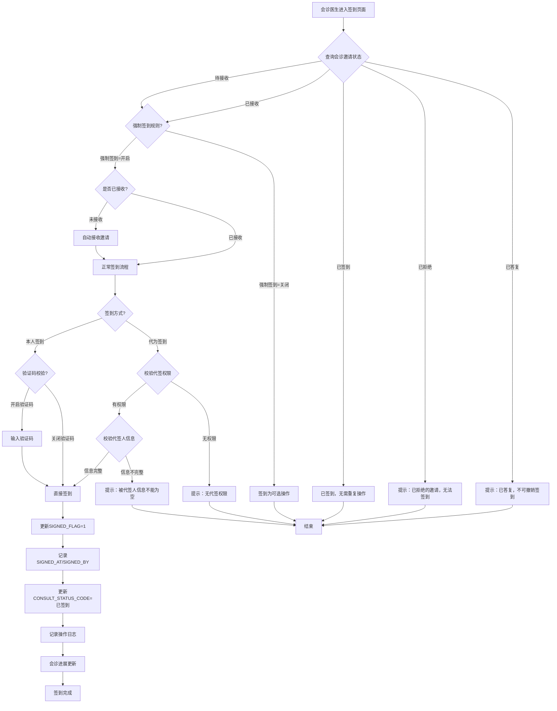
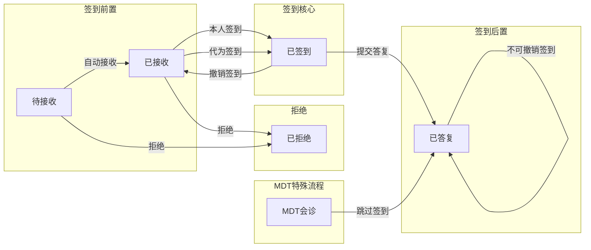
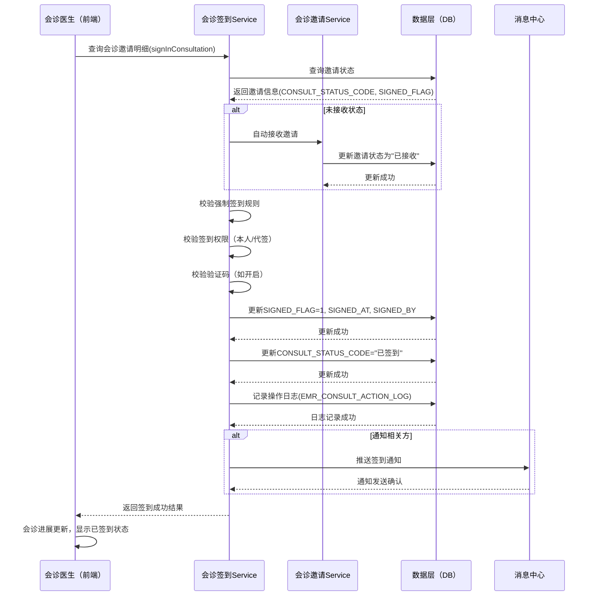
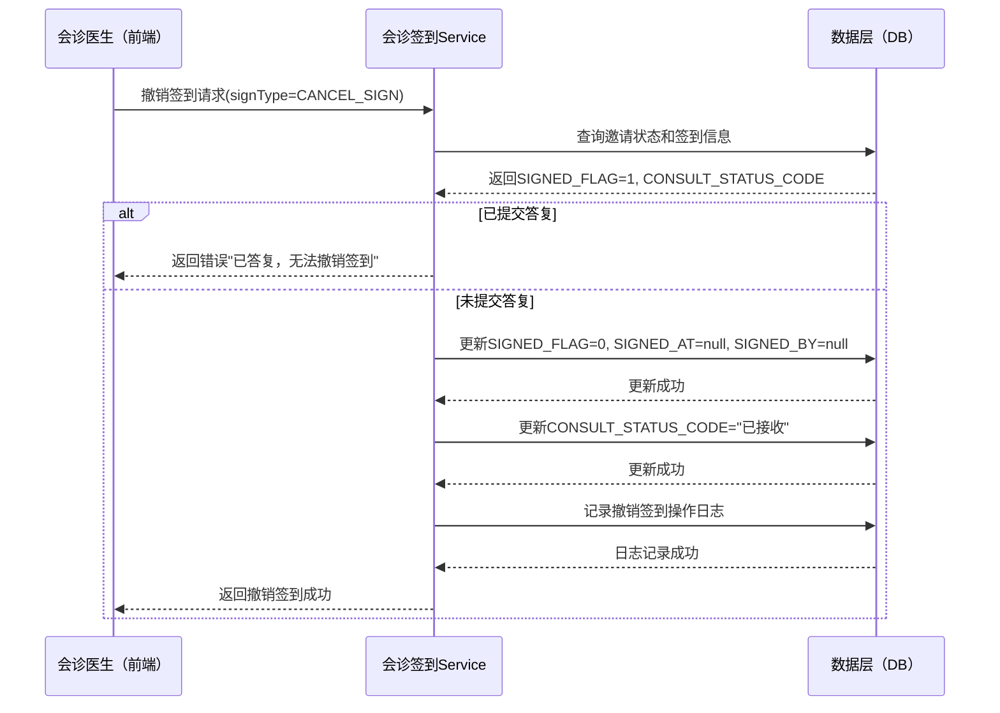

# BLGL-05-HZGL-005 会诊签到 - Spec

> **功能编号**：BLGL-05-HZGL-005
> **文档类型**：Spec（研发视角）
> **文档版本**：V1.0
> **编写时间**：2026-08-21
> **编写人**：RACC

---

## 文档索引

本节提供本文档的章节结构索引与关联文档索引，便于读者快速定位与检索。

#### 章节索引

**PM-Spec（业务视角）**

| 章节号 | 章节名称 | 内容说明 |
|--------|---------|---------|
| 一 | 目标 | 一句话描述功能目标 |
| 二 | 约束 | 业务约束、技术约束、非功能性约束 |
| 三 | 验收标准 | 验收标准与验证方法 |
| 四 | 排除范围 | 本次不做、明确边界 |
| 五 | 关键决策记录 | 方案决策、其他决议 |
| 六 | 优先级 | 需求优先级说明 |
| 附录 | 填写检查清单 | 检查项与完成状态 |

**Analyst-Spec（产品视角）**

| 章节号 | 章节名称 | 内容说明 |
|--------|---------|---------|
| 一 | 功能编号体系 | 带父子层级的编号树 |
| 二 | 核心业务流程 | Mermaid 流程图 |
| 三 | 功能规格说明 | 各子功能点的概述、用户角色、业务流程、验收标准 |
| 四 | 排除范围 | 本需求不包含的功能项 |
| 五 | 业务规则清单 | 规则ID、规则名称、规则描述、优先级 |
| 六 | 关联文档 | 文档类型、文档路径、说明 |
| 七 | 待确认问题清单 | 所有 ⏳ 待确认项的汇总 |
| - | 填写检查清单 | 检查项与完成状态 |

**Spec（研发视角）**

| 章节号 | 章节名称 | 内容说明 |
|--------|---------|---------|
| 第1章 | 文档概述 | 文档目的、文档范围、术语定义、阅读指南、参考文档 |
| 第2章 | 功能背景与定位 | 功能背景、功能定位、目标用户、核心价值 |
| 第3章 | 业务流程设计 | 主流程/异常流程/边界流程（Given/When/Then） |
| 第4章 | 数据模型设计 | 核心数据结构、状态定义、系统参数定义 |
| 第5章 | 接口契约设计 | API列表、接口详细设计、错误码定义 |
| 第6章 | 技术方案设计 | 页面路径、技术栈、关键技术点、部署方案 |
| 第7章 | 测试用例预设计 | 功能/边界/异常/性能测试用例 |
| 第8章 | 非功能性要求 | 性能、安全、可用性、兼容性 |
| 第9章 | 依赖与风险 | 外部依赖、风险项 |
| 第10章 | 附录 | 流程图、时序图、参考文档 |

#### 版本历史

| 版本 | 日期 | 变更说明 | 编写人 |
|------|------|---------|--------|
| V1.0 | 2026-08-21 | 初始版本 | RACC |

#### 关联文档索引

| 序号 | 文档名称 | 文档类型 | 版本 | 位置 |
|------|---------|---------|------|------|
| 1 | BLGL-05-HZGL-005_会诊签到-Spec.md | Spec（研发视角）（本文档） | V1.0 | 本目录 |
| 2 | BLGL-05-HZGL-005_会诊签到_PM-spec.md | PM-Spec（业务视角） | V1.0 | 本目录 |
| 3 | BLGL-05-HZGL-005_会诊签到_Analyst-spec.md | Analyst-Spec（产品视角） | V1.0 | 本目录 |
| 4 | BLGL-05-HZGL 05会诊管理功能点Spec.md | 功能点Spec（模块级） | V1.0 | 上级目录 |

> :ledger: 第4项为 Phase 1 输出，必须引用。版本号与 Phase 1 功能点Spec 实际版本一致。

---

## 1、文档概述

### 1.1、文档目的

本文档旨在明确"会诊签到"功能（BLGL-05-HZGL-005）的业务背景与设计方案，为需求分析、研发实现、测试验收及评审提供统一的业务上下文、设计口径与决策依据。

**具体目的包括**：

1. 梳理会诊签到功能的业务由来与历史需求演进脉络，说明"为什么要做"；
2. 明确功能的定位边界、目标用户与核心价值，回答"做成什么"；
3. 描述功能的业务流程、数据模型、接口契约与技术方案，回答"怎么做"；
4. 预设计测试用例并明确非功能性要求、依赖与风险，为研发与验收提供依据；
5. 作为 SPEC（功能编号体系、功能详情、业务规则、验收标准等章节）的业务前提与设计输入，保证各层文档业务口径一致。

> :ledger: 第1~2点对应业务层，第3~5点对应设计层。资料区的需求分析原文作为业务层素材，历史需求中的设计描述作为设计层素材。

### 1.2、文档范围

#### 1.2.1 纳入范围

本文档覆盖会诊签到功能的完整业务背景与设计，包括：

- 会诊医生到场签到操作（常规签到）
- 撤销签到操作
- 未接收时签到自动完成接收
- 代为签到（申请医生/本科室人员代签）
- 强制签到规则配置与执行
- 签到状态在会诊进展中的体现（待签到节点）
- 门诊会诊按会诊分类和会诊级别开启强制签到
- MDT会诊取消签到流程及实际参与人员确认与统计优化
- 获取签到验证码
- 会诊签到查询与导出

#### 1.2.2 排除范围

本文档不涉及以下内容（详见其他功能点或模块）：

- 会诊申请（BLGL-05-HZGL-001）：会诊申请的创建、提交、撤销等，签到环节的前置流程
- 会诊审核（BLGL-05-HZGL-002）：审核流程、审核意见、多级审核等
- 会诊接收与指派（BLGL-05-HZGL-004）：会诊任务接收、指派具体医生等，签到的前置环节
- 会诊答复与记录（BLGL-05-HZGL-003）：会诊意见书写、会诊记录生成、PDF生成等，签到的后续环节
- 会诊计费（BLGL-05-HZGL-006）：费用计算、医保校验、账单生成等
- 会诊配置管理（BC-HZGL-003）：参数配置、审核流程配置、科室配置等（仅引用签到相关参数配置）

### 1.3、术语定义

| 术语 | 定义 |
|------|------|
| 会诊签到 | 会诊医生到达指定科室后确认到场的行为，支持由申请医生、本科室人员代为完成（来源：需求） |
| 撤销签到 | 会诊医生或相关人员取消已完成的签到操作，恢复到未签到状态（来源：需求） |
| 代为签到 | 会诊医生未亲自操作，由申请医生或本科室人员代为完成签到确认（来源：需求） |
| 强制签到 | 系统配置中要求会诊医生必须完成签到才能进入答复环节的规则，未签到时在进展中体现待签到节点（来源：需求） |
| 自动接收 | 受邀医生尚未手动接收会诊任务时，通过签到操作自动完成会诊接收（来源：需求） |
| 签到验证码 | 会诊签到操作时系统生成的验证码，用于确认签到操作的真实性和有效性（来源：代码） |
| 会诊进展 | 会诊全流程的状态展示视图，体现各环节（待审核/待接收/待签到/待答复/已完成）的当前状态（来源：需求） |
| 会诊邀请 | 会诊申请中指定的受邀科室或医生，一个会诊申请可包含多个邀请（来源：代码） |
| 邀请状态（CONSULT_STATUS_CODE） | 会诊邀请的全生命周期状态标识，包括待接收、已接收、已签到、已答复、已拒绝等（来源：代码） |

### 1.4、阅读指南

- **章节关系**：第1~2章为阅读铺垫与业务全貌（背景、定位、用户、价值）；第3~10章为设计实现层（流程、数据、接口、技术、测试、非功能、依赖风险、附录），可直接用于研发与测试。与 Analyst-Spec（产品视角）、PM-Spec（业务视角）的详细规则/验收口径互相引用，保持一致。
- **读者对象**：
  - 产品经理/需求分析师：阅读第1~2章了解业务全貌，据此维护 PM-Spec 与功能清单；
  - 研发：阅读第3~6章用于开发实现，第9~10章用于依赖评估与联调；
  - 测试：阅读第3章、第7~8章用于用例设计与验收；
  - 评审人员：以本文档为业务口径与设计基准，核对各层文档一致性。

### 1.5、参考文档

| 序号 | 文档名称 | 版本/日期 |
|------|---------|----------|
| 1 | 【历史需求】新会诊历史需求.xlsx（117条需求） | - |
| 2 | BLGL-05-HZGL-005_会诊签到_PM-spec.md | V1.0 |
| 3 | BLGL-05-HZGL-005_会诊签到_Analyst-spec.md | V1.0 |
| 4 | BLGL-05-HZGL 05会诊管理功能点Spec.md | V1.0 |
| 5 | 代码仓库扫描结果（sr-next/winning-emr-consultation-next） | 2026-08-21 |

---

## 2、功能背景与定位

### 2.1 功能背景

会诊签到是会诊管理流程中"到场确认"的关键环节，处于会诊接收与答复之间的桥梁位置，需满足：

- **管理要求**：会诊医生到达指定科室后，需要通过签到确认到场，记录实际参与会诊的人员和时间，作为会诊流程完整性和可追溯性的依据。强制签到规则确保会诊医生必须在签到后才能提交答复，保障会诊流程的规范性。（来源：需求）
- **现状痛点**：
  - 原有签到流程中，签到操作与接收操作分离，未接收时签到需先手动接收，操作繁琐
  - 缺乏强制签到规则配置，无法根据会诊类型和级别灵活控制签到要求
  - 会诊医生未签到或迟到时，系统无法在进展中直观体现待签到状态，影响流程监控
  - 签到操作仅限会诊医生本人，当会诊医生到达科室后未及时操作时，缺乏代为签到机制
  - MDT会诊的签到流程与实际参与人员确认脱节，影响统计准确性
  - 住院医生站多学科会诊申请界面"答复"旁误设"签到"按钮，造成操作混淆（来源：需求）
- **历史需求演进**：通过对资料区新会诊历史需求.xlsx中涉及会诊签到的需求梳理，会诊签到功能从基础的签到/撤销签到，逐步演进到支持强制签到规则配置、未接收时自动接收、代签机制、签到验证码验证、MDT签到流程优化等精细化能力。当前版本以v2架构（winning-emr-consultation-next/v2-task模块）实现，与v1版本（app_record_consult_v1）共存。（来源：需求 + 代码）

### 2.2 功能定位

"会诊签到"是WiNEX病历管理（住院）-会诊管理模块的到场确认功能，定位为：

- **到场确认与记录**：会诊医生到达指定科室后，通过签到操作确认到场，记录签到时间、签到人员，作为会诊流程的节点凭证（来源：需求）
- **强制签到流程控制**：通过强制签到规则配置，控制会诊必须签到后方可答复，未签到时在进展中体现待签到节点，保障流程闭环（来源：需求）
- **智能签到处理**：未接收时签到自动完成接收，减少操作步骤；支持代为签到，提升灵活性和操作效率（来源：需求）
- **签到状态可视化**：签到状态在会诊进展中实时展示，包括已签到/待签到/未签到等状态，支持会诊流程监控与追溯（来源：需求）

### 2.3 目标用户

| 用户角色 | 主要使用场景 |
|---------|-------------|
| 会诊医生（受邀医生） | 到达指定科室后，进行签到确认到场；需要撤销签到时执行撤销操作；在会诊进展中查看签到状态（来源：需求） |
| 申请医生 | 协助会诊医生完成签到（代为签到），或在会诊医生到达科室后代为确认到场（来源：需求） |
| 本科室人员（护士/科室管理员） | 协助会诊医生完成签到，作为代签角色（来源：需求） |
| 院总/科室管理员 | 查看会诊进展，监控签到状态，确保会诊医生按时签到（来源：需求） |

### 2.4 核心价值

| 价值维度 | 价值描述 |
|---------|---------|
| 流程规范性 | 通过强制签到规则，确保会诊医生到场确认后才能提交答复，保障会诊流程的规范性和完整性（来源：需求） |
| 操作效率提升 | 未接收时签到自动完成接收，减少操作步骤；支持代为签到，避免因会诊医生未及时操作而延误流程（来源：需求） |
| 流程可追溯 | 签到时间、签到人员、撤销签到记录等操作日志完整保留，为会诊流程审计和追溯提供依据（来源：需求） |
| 流程可视化 | 签到状态在会诊进展中实时展示，待签到节点清晰可见，便于流程监控和管理（来源：需求） |
| 统计准确性 | MDT会诊签到流程优化，确保实际参与人员准确记录，统计结果可靠（来源：需求） |

---

## 3、业务流程设计（Given/When/Then）

> :ledger: 以下场景从资料区中的需求分析原文提取。每个场景的 Given/When/Then 内容必须有需求原文对应依据。

### 3.1 主流程

**Scenario 1: 会诊医生常规签到（强制签到场景）**

```gherkin
Given:
  - 会诊医生已登录系统，具有会诊签到权限
  - 存在一条已接收的会诊邀请，CONSULT_STATUS_CODE = "已接收"
  - 系统配置了强制签到规则（强制签到 = 开启）
  - 会诊进展中显示"待签到"节点

When:
  - 会诊医生在签到页面/会诊进展中点击"签到"按钮
  - 系统弹出签到确认对话框（含签到验证码/签到确认信息）
  - 会诊医生确认签到操作

Then:
  - 系统更新 EMR_CONSULT_INVITATION 的 SIGNED_FLAG = 1（已签到）
  - 系统记录签到时间 SIGNED_AT = 当前时间
  - 系统记录签到人员 SIGNED_BY = 当前会诊医生ID
  - 系统更新邀请状态 CONSULT_STATUS_CODE = "已签到"
  - 会诊进展中"待签到"节点更新为"已签到"，显示签到时间
  - 系统记录操作日志（EMR_CONSULT_ACTION_LOG）
  - 会诊医生可进入答复环节
```

**Scenario 2: 会诊医生常规签到（非强制签到场景）**

```gherkin
Given:
  - 会诊医生已登录系统，具有会诊签到权限
  - 存在一条已接收的会诊邀请
  - 系统配置了非强制签到规则（强制签到 = 关闭）

When:
  - 会诊医生在签到页面/会诊进展中点击"签到"按钮
  - 会诊医生确认签到操作

Then:
  - 系统更新 EMR_CONSULT_INVITATION 的 SIGNED_FLAG = 1（已签到）
  - 系统记录签到时间 SIGNED_AT = 当前时间
  - 会诊进展中显示签到状态
  - 会诊医生可正常进入答复环节（签到非强制，未签到也可答复）
```

### 3.2 异常流程

**Scenario 3: 未接收时签到自动接收（业务异常）**

```gherkin
Given:
  - 会诊医生已登录系统，具有会诊签到权限
  - 存在一条待接收的会诊邀请，CONSULT_STATUS_CODE = "待接收"
  - 会诊医生尚未手动接收该会诊邀请

When:
  - 会诊医生在签到页面点击"签到"按钮
  - 系统检测到当前邀请状态为"待接收"

Then:
  - 系统自动执行接收操作：更新邀请状态为"已接收"
  - 系统继续执行签到操作：更新 SIGNED_FLAG = 1，SIGNED_AT = 当前时间
  - 系统更新邀请状态 CONSULT_STATUS_CODE = "已签到"
  - 会诊进展中"待接收"和"待签到"节点同时更新
  - 系统提示"已自动接收并签到成功"
  - 系统记录自动接收和签到的操作日志
```

**Scenario 4: 撤销签到（数据异常）**

```gherkin
Given:
  - 会诊医生已登录系统，具有会诊签到权限
  - 存在一条已签到的会诊邀请，SIGNED_FLAG = 1
  - 会诊医生尚未提交会诊答复（CONSULT_STATUS_CODE = "已签到"）

When:
  - 会诊医生在签到页面点击"撤销签到"按钮
  - 系统弹出撤销确认对话框
  - 会诊医生确认撤销操作

Then:
  - 系统更新 EMR_CONSULT_INVITATION 的 SIGNED_FLAG = 0（未签到）
  - 系统清除签到时间 SIGNED_AT = null
  - 系统清除签到人员 SIGNED_BY = null
  - 系统更新邀请状态 CONSULT_STATUS_CODE = "已接收"（回退到接收状态）
  - 会诊进展中"已签到"状态变更为"待签到"
  - 系统记录撤销签到操作日志（含操作人员、操作时间）
  - 会诊医生无法进入答复环节（需重新签到）

**补充规则**：
  - 若会诊医生已提交会诊答复（CONSULT_STATUS_CODE = "已答复"），则不允许撤销签到
  - 若会诊医生已提交会诊答复，系统提示"已提交会诊答复，无法撤销签到"
```

**Scenario 5: 代为签到（业务异常/授权场景）**

```gherkin
Given:
  - 会诊医生已到达指定科室，但未亲自操作签到
  - 申请医生或本科室人员已登录系统，具有代签权限
  - 存在一条已接收的会诊邀请，会诊医生为受邀医生

When:
  - 申请医生/本科室人员在签到页面选择"代为签到"
  - 系统展示代签确认对话框，提示代签人和被代签人信息
  - 申请医生/本科室人员确认代签操作

Then:
  - 系统更新 EMR_CONSULT_INVITATION 的 SIGNED_FLAG = 1（已签到）
  - 系统记录签到时间 SIGNED_AT = 当前时间
  - 系统记录签到人员 SIGNED_BY = 会诊医生ID（被代签人）
  - 系统记录代签人信息（操作人员 = 代签执行人ID）
  - 邀请状态 CONSULT_STATUS_CODE = "已签到"
  - 会诊进展中显示签到状态，标注"代签"
  - 系统记录代签操作日志（含代签人、被代签人、时间）
```

**Scenario 6: 已答复后尝试撤销签到（系统异常/业务异常）**

```gherkin
Given:
  - 存在一条会诊邀请，SIGNED_FLAG = 1，CONSULT_STATUS_CODE = "已答复"
  - 会诊医生已提交会诊答复

When:
  - 会诊医生或相关人员尝试撤销签到

Then:
  - 系统校验邀请状态，检测到已提交答复
  - 系统提示"会诊答复已提交，无法撤销签到"
  - 签到状态保持不变
  - 操作被阻止，不执行任何数据变更
```

### 3.3 边界流程

**Scenario 7: 取消签到（边界场景 — 门诊会诊按会诊分类和级别开启强制签到）**

```gherkin
Given:
  - 系统配置了门诊会诊的强制签到规则
  - 强制签到按会诊分类和会诊级别分别配置
  - 当前会诊为门诊会诊，会诊分类为"普通会诊"，会诊级别为"中级"

When:
  - 系统根据会诊分类和会诊级别组合查询强制签到配置
  - 对于特定分类+级别组合，强制签到规则可能为"开启"或"关闭"

Then:
  - 若强制签到开启：会诊进展中显示"待签到"节点，签到后方可答复
  - 若强制签到关闭：会诊进展中不显示"待签到"节点，无需签到即可答复
  - 强制签到规则按会诊分类和会诊级别独立配置，互不影响
```

**Scenario 8: MDT会诊取消签到流程（边界场景）**

```gherkin
Given:
  - 存在一条MDT会诊申请，涉及多个科室/医生
  - MDT会诊配置中取消了签到流程
  - 系统已配置MDT实际参与人员确认规则

When:
  - 会诊医生参与MDT会诊
  - 系统跳过签到环节，直接进入会诊答复
  - 会诊完成后，系统进行实际参与人员确认与统计

Then:
  - MDT会诊进展中不显示"待签到"节点
  - 会诊医生无需签到即可提交答复
  - 实际参与人员根据答复记录和参与确认进行统计
  - 统计结果准确反映实际参与人员
```

**Scenario 9: 住院医生站多学科会诊申请界面"签到"按钮误设移除（边界场景）**

```gherkin
Given:
  - 住院医生站多学科会诊申请界面（apply-create）
  - 原界面中"答复"按钮旁存在"签到"按钮（误设）

When:
  - 用户在住院医生站多学科会诊申请界面进行操作

Then:
  - 界面中移除"签到"按钮（来源：需求）
  - 签到操作仅保留在会诊接收/任务页面中
  - 会诊申请界面仅保留"答复"等正确操作按钮
```

---

## 4、数据模型设计

> :ledger: 以下数据模型信息来自代码仓库扫描结果（来源：代码）和资料区需求描述。

### 4.1 核心数据结构

#### 4.1.1 核心保存请求

会诊签到/撤销签到请求参数结构（来源：代码，signInConsultation 接口映射）：

| 字段名 | 类型 | 必填 | 备注 |
|--------|------|------|------|
| emrConsultApplyId | String | 是 | 会诊申请ID，关联EMR_CONSULT_APPLY |
| emrConsultInvitationId | String | 是 | 会诊邀请ID，关联EMR_CONSULT_INVITATION |
| signType | String | 是 | 签到类型：SIGN（签到）/ CANCEL_SIGN（撤销签到） |
| signMethod | String | 否 | 签到方式：SELF（本人签到）/ PROXY（代为签到） |
| proxyEmployeeId | String | 否 | 代签人ID（signMethod=PROXY时必填） |
| proxyEmployeeName | String | 否 | 代签人姓名（signMethod=PROXY时必填） |
| verificationCode | String | 否 | 签到验证码（如开启验证码校验时必填） |
| remark | String | 否 | 签到备注 |

#### 4.1.2 核心表/实体

| 表/实体 | 关键字段 | 说明 |
|---------|---------|------|
| EMR_CONSULT_INVITATION (ConsultInvitationV2PO) | EMR_CONSULT_INVITATION_ID, EMR_CONSULT_APPLY_ID, INVITED_DEPT_ID, INVITED_DEPT_NAME, INVITED_EMPLOYEE_ID, INVITED_EMPLOYEE_NAME, INVITED_TYPE_CODE, CONSULT_STATUS_CODE, ASSIGNED_FLAG, **SIGNED_FLAG**, **SIGNED_AT**, **SIGNED_BY**, PROXY_SIGNED_FLAG, PROXY_SIGNED_BY, CONSULT_EMPLOYEE_ID 等35个字段 | 会诊邀请表，存储受邀科室/医生信息及签到状态。SIGNED_FLAG标记是否已签到，SIGNED_AT记录签到时间，SIGNED_BY记录签到人员ID，PROXY_SIGNED_FLAG标记是否代签，PROXY_SIGNED_BY记录代签人ID（来源：代码） |
| EMR_CONSULT_APPLY (ConsultApplyV2PO) | EMR_CONSULT_APPLY_ID, ENCOUNTER_NUMBER, PATIENT_NAME, BED_NO, ENCOUNTER_ID, DEPT_ID, DEPT_NAME, CONSULT_TYPE_CODE, CONSULT_LEVEL_CODE, STAGE_STATUS 等41个字段 | 会诊申请主表，STAGE_STATUS字段反映整体阶段状态，包括待签到、已签到等（来源：代码） |
| EMR_CONSULT_ACTION_LOG (ConsultActionLogV2PO) | LOG_ID, EMR_CONSULT_APPLY_ID, ACTION_TYPE, ACTION_DESC, OPERATOR_ID, OPERATOR_NAME, OPERATED_AT, REMARK 等10个字段 | 会诊操作日志表，记录签到、撤销签到、代签等操作日志（来源：代码） |
| EMR_CONSULT_PARAM (ConsultParamV2PO) | PARAM_ID, PARAM_CODE, PARAM_VALUE, PARAM_NAME, PARAM_DESC, IS_ENABLED, MODULE_CODE 等14个字段 | 会诊参数配置表，存储强制签到规则等系统参数（来源：代码） |

### 4.2 状态定义

#### 签到相关字段（EMR_CONSULT_INVITATION）

| 字段名 | 值 | 说明 |
|--------|----|------|
| SIGNED_FLAG | 0 | 未签到（来源：代码） |
| SIGNED_FLAG | 1 | 已签到（来源：代码） |
| PROXY_SIGNED_FLAG | 0 | 本人签到（来源：代码） |
| PROXY_SIGNED_FLAG | 1 | 代为签到（来源：代码） |

#### 邀请状态（CONSULT_STATUS_CODE）— 签到相关流转

| 状态码 | 状态名称 | 说明 |
|--------|---------|------|
| 0 | 待接收 | 受邀科室/医生尚未接收会诊邀请（来源：代码） |
| 1 | 已接收 | 受邀科室/医生已接收会诊邀请，可进行签到（来源：代码） |
| 2 | 已签到 | 会诊医生已签到，可进入答复环节（来源：代码）；撤销签到后回退至"已接收" |
| 3 | 已答复 | 会诊医生已提交会诊答复，此时不可撤销签到（来源：代码） |
| 4 | 已拒绝 | 受邀科室/医生拒绝会诊邀请（来源：代码） |

#### 阶段状态（STAGE_STATUS）— 签到相关

| 状态码 | 状态名称 | 说明 |
|--------|---------|------|
| ⏳ 待确认 | 待签到 | 会诊申请已被接收，等待会诊医生签到（来源：代码）；在强制签到场景下必现 |
| ⏳ 待确认 | 已签到 | 会诊医生已签到，等待提交会诊答复（来源：代码） |

> :ledger: 部分状态码的具体编码值待从代码PO实体中的枚举定义或常量类中确认。

### 4.3 系统参数定义

| 参数编码 | 参数名称 | 说明 |
|---------|---------|------|
| ⏳ 待确认 (CONSULT_SIGN_FORCE) | 会诊强制签到规则 | 配置是否开启强制签到。开启后，会诊医生必须签到后才能提交答复，未签到时在进展中体现待签到节点（来源：需求，具体参数编码待确认） |
| ⏳ 待确认 (CONSULT_SIGN_AUTO_RECEIVE) | 未接收时签到自动接收 | 配置未接收时签到是否自动完成接收。开启后，状态为"待接收"的邀请在签到操作时自动变更为"已接收"再签到（来源：需求，具体参数编码待确认） |
| ⏳ 待确认 (CONSULT_SIGN_PROXY_ENABLE) | 代为签到开关 | 配置是否允许代为签到。开启后，申请医生/本科室人员可代会诊医生签到（来源：需求，具体参数编码待确认） |
| ⏳ 待确认 (CONSULT_SIGN_FORCE_OUTPATIENT) | 门诊会诊强制签到规则 | 按会诊分类和会诊级别配置门诊会诊的强制签到规则，支持分类+级别组合配置（来源：需求，具体参数编码待确认） |
| ⏳ 待确认 (CONSULT_SIGN_MDT_CANCEL) | MDT会诊取消签到 | 配置MDT会诊是否取消签到流程。开启后，MDT会诊跳过签到环节，直接进入答复（来源：需求，具体参数编码待确认） |
| ⏳ 待确认 (CONSULT_SIGN_VERIFY_CODE) | 签到验证码校验 | 配置签到是否需要验证码校验。开启后，签到操作需输入验证码（来源：代码，具体参数编码待确认） |

> :ledger: 系统参数的具体编码和参数路径待从代码中 EMR_CONSULT_PARAM 实体或前端的参数配置页面确认。

---

## 5、接口契约设计

> :ledger: 接口列表和详细设计来自代码仓库扫描结果（来源：代码）。

### 5.1 API列表

| 序号 | API名称 | 路径 | 方法 | 说明 |
|:----:|---------|------|:----:|------|
| 1 | signConsultOperate | /api/v1/app_record_consult_v1/consultation/operate/sign_consult_operate | POST | 会诊签到（v1版本）（来源：代码） |
| 2 | getVerificationCode | /api/v1/app_record_consult_v1/consult/verification_code/by_example | POST | 获取签到验证码（v1版本）（来源：代码） |
| 3 | queryConsultInvitation | /api/v1/app_record_consult_v1/consult/invitation/query | POST | 会诊签到查询（v1版本）（来源：代码） |
| 4 | exportConsultInvitation | /api/v1/app_record_consult_v1/consult/invitation/export | POST | 会诊签到导出（v1版本）（来源：代码） |
| 5 | signInConsultation | /api/v1/app_record_consult_v2/consult_apply/signInConsultation | POST | 会诊签到/撤销签到-用于申请界面（v2版本）（来源：代码） |
| 6 | queryConsultInvitationInfoListForSignIn | /api/v1/app_record_consult_v2/consult_apply/queryConsultInvitationInfoListForSignIn | POST | 查询会诊申请邀请明细列表用于签到（v2版本）（来源：代码） |

### 5.2 接口详细设计

#### 5.2.1 signInConsultation — 会诊签到/撤销签到（v2）

**请求参数**:
```json
{
  "emrConsultApplyId": "CA2026082100001",
  "emrConsultInvitationId": "CI2026082100001",
  "signType": "SIGN",
  "signMethod": "SELF",
  "proxyEmployeeId": "",
  "proxyEmployeeName": "",
  "verificationCode": "123456",
  "remark": "会诊医生已到场签到"
}
```

**signType 枚举**：
- `SIGN` — 签到
- `CANCEL_SIGN` — 撤销签到

**signMethod 枚举**：
- `SELF` — 本人签到
- `PROXY` — 代为签到

**返回值（签到成功）**:
```json
{
  "success": true,
  "data": {
    "emrConsultInvitationId": "CI2026082100001",
    "signedFlag": 1,
    "signedAt": "2026-08-21 14:30:00",
    "signedBy": "EMP001",
    "signedByName": "王主任",
    "proxySignedFlag": 0,
    "consultStatusCode": "SIGNED",
    "message": "签到成功"
  }
}
```

**返回值（撤销签到成功）**:
```json
{
  "success": true,
  "data": {
    "emrConsultInvitationId": "CI2026082100001",
    "signedFlag": 0,
    "signedAt": null,
    "signedBy": null,
    "proxySignedFlag": 0,
    "consultStatusCode": "RECEIVED",
    "message": "撤销签到成功"
  }
}
```

**返回值（失败）**:
```json
{
  "success": false,
  "message": "签到失败：会诊医生已提交会诊答复，无法撤销签到",
  "data": null
}
```

#### 5.2.2 queryConsultInvitationInfoListForSignIn — 查询会诊申请邀请明细列表用于签到

**请求参数**:
```json
{
  "emrConsultApplyId": "CA2026082100001",
  "emrConsultInvitationId": "",
  "consultStatusCode": "",
  "signedFlag": "",
  "pageNum": 1,
  "pageSize": 20
}
```

**返回值（成功）**:
```json
{
  "success": true,
  "data": {
    "total": 3,
    "pageNum": 1,
    "pageSize": 20,
    "list": [
      {
        "emrConsultInvitationId": "CI2026082100001",
        "emrConsultApplyId": "CA2026082100001",
        "invitedDeptId": "DEPT005",
        "invitedDeptName": "感染科",
        "invitedEmployeeId": "EMP023",
        "invitedEmployeeName": "王主任",
        "consultStatusCode": "SIGNED",
        "signedFlag": 1,
        "signedAt": "2026-08-21 14:30:00",
        "signedBy": "EMP023",
        "signedByName": "王主任",
        "proxySignedFlag": 0,
        "proxySignedBy": null,
        "proxySignedByName": null
      },
      {
        "emrConsultInvitationId": "CI2026082100002",
        "emrConsultApplyId": "CA2026082100001",
        "invitedDeptId": "DEPT006",
        "invitedDeptName": "呼吸科",
        "invitedEmployeeId": "EMP045",
        "invitedEmployeeName": "李医生",
        "consultStatusCode": "RECEIVED",
        "signedFlag": 0,
        "signedAt": null,
        "signedBy": null,
        "signedByName": null,
        "proxySignedFlag": 0,
        "proxySignedBy": null,
        "proxySignedByName": null
      }
    ]
  }
}
```

#### 5.2.3 getVerificationCode — 获取签到验证码（v1）

**请求参数**:
```json
{
  "emrConsultInvitationId": "CI2026082100001",
  "employeeId": "EMP023"
}
```

**返回值（成功）**:
```json
{
  "success": true,
  "data": {
    "verificationCode": "123456",
    "expiredAt": "2026-08-21 14:35:00",
    "message": "验证码已发送，5分钟内有效"
  }
}
```

### 5.3 错误码定义

| 错误码 | 错误信息 | 处理方式 |
|--------|---------|---------|
| ⏳ 待确认 | 签到失败：会诊邀请不存在 | 前端提示用户，检查邀请ID是否正确 |
| ⏳ 待确认 | 签到失败：会诊邀请已答复，无法签到 | 前端提示用户，阻止签到操作 |
| ⏳ 待确认 | 撤销签到失败：会诊邀请已答复，无法撤销签到 | 前端提示用户，阻止撤销操作 |
| ⏳ 待确认 | 撤销签到失败：会诊邀请未签到，无需撤销 | 前端提示用户，阻止无效操作 |
| ⏳ 待确认 | 签到失败：验证码错误或已过期 | 前端提示用户重新获取验证码 |
| ⏳ 待确认 | 代签失败：无代为签到权限 | 前端提示用户，阻止代签操作 |
| ⏳ 待确认 | 签到失败：强制签到已关闭，无需签到操作 | 前端提示用户 |
| ⏳ 待确认 | 参数校验失败：必填字段缺失 | 前端提示具体字段，聚焦到对应输入框 |
| ⏳ 待确认 | 系统繁忙，请稍后重试 | 前端提示用户重试，记录系统日志 |

> :ledger: 具体错误码编码值待从代码中的常量类或枚举定义中确认。上述为业务错误描述，编码值待补充。

---

## 6、技术方案设计

### 6.1 页面路径

- **前端页面路径（新版v2）**: winning-webui-consultation-next/src/pages/task/（来源：代码）
  - /task-receive — 会诊接收（含签到操作）（来源：代码）
  - 签到操作嵌入在会诊任务接收页面中，与会诊进展视图联动
- **后端模块路径**: winning-emr-consultation-next/winning-emr-consultation-v2-task/（来源：代码）
  - Controller: consultation-task-controller（签到相关接口）
  - Service: 会诊签到业务逻辑层（含签到/撤销签到/代签/自动接收）
- **数据模型模块**: winning-emr-consultation-next/winning-emr-consultation-v2-model/（来源：代码）
  - ConsultInvitationV2PO（SIGNED_FLAG, SIGNED_AT, SIGNED_BY, PROXY_SIGNED_FLAG, PROXY_SIGNED_BY等字段）
  - ConsultActionLogV2PO（操作日志记录）
- **v1版本路径**: winning-emr-consultation/（旧版，来源：代码）
  - /api/v1/app_record_consult_v1/consultation/operate/ 下的签到相关接口

### 6.2 技术栈

| 类别 | 技术 | 版本 |
|------|------|------|
| 前端框架（新版） | spark（WiNEX自研前端框架） | ⏳ 待确认 |
| 前端框架（旧版） | umi | ⏳ 待确认 |
| 后端框架 | Spring Boot | ⏳ 待确认 |
| ORM框架 | JPA (Hibernate) | ⏳ 待确认 |
| 数据库 | ⏳ 待确认 | ⏳ 待确认 |

> :ledger: 具体版本号待从项目pom.xml或package.json中确认。

### 6.3 关键技术点

1. **签到状态机管理**：会诊邀请状态（CONSULT_STATUS_CODE）在签到环节的流转路径为：`待接收 → 已接收 → 已签到 → 已答复`。撤销签到为逆向操作：`已签到 → 已接收`。已答复状态下不可撤销签到。状态机必须明确定义合法转换路径，防止非法状态跳转（来源：需求 + 代码）

2. **自动接收机制**：签到操作时检测当前邀请状态，若为"待接收"则自动先执行接收操作（更新状态为"已接收"），再执行签到操作（更新状态为"已签到"）。该机制由后端统一处理，前端无需感知接收和签到两个步骤的拆分（来源：需求）

3. **代签权限控制**：代为签到需校验当前操作人员是否具有代签权限（申请医生/本科室人员）。代签操作记录双重信息：签到人员（SIGNED_BY = 会诊医生ID）和操作人员（在操作日志中记录代签人ID）。前端根据代签权限控制"代为签到"按钮的可见性（来源：需求）

4. **强制签到规则校验**：签到操作前，后端校验强制签到参数配置。若强制签到开启，则必须签到后才能提交答复；若强制签到关闭，签到为可选操作，未签到也可提交答复。强制签到规则应按会诊分类和会诊级别分别配置（门诊场景），支持组合条件判断（来源：需求）

5. **MDT会诊签到流程跳过**：MDT会诊配置中可取消签到流程。系统在加载会诊进展时，根据MDT会诊配置判断是否跳过签到节点，进展中不展示"待签到"状态，直接允许答复。MDT实际参与人员通过答复记录和参与确认进行统计（来源：需求）

6. **签到验证码机制**：可选启用签到验证码校验，签到操作前需获取验证码（/api/v1/app_record_consult_v1/consult/verification_code/by_example），验证码有时效限制（如5分钟有效）。验证码校验失败时阻止签到操作（来源：代码）

7. **操作日志记录**：签到、撤销签到、代签等关键操作必须记录操作日志，包含操作类型（ACTION_TYPE）、操作描述（ACTION_DESC）、操作人员ID和姓名、操作时间等，支持审计追溯。代签操作需额外记录代签人信息（来源：代码 - EMR_CONSULT_ACTION_LOG）

8. **住院医生站MDT申请界面"签到"按钮移除**：在住院医生站多学科会诊申请界面（apply-create）中，移除"答复"按钮旁的"签到"按钮，避免用户混淆。签到操作仅保留在会诊任务/接收页面中（来源：需求）

### 6.4 部署方案

⏳ 待确认：部署方案信息未在资料区中详细描述。会诊签到作为会诊管理模块的一部分，通常随主应用一起部署，建议采用以下常规方式：

- 前后端分离部署，前端静态资源部署至Nginx/CDN
- 后端服务以JAR包形式部署至应用服务器集群
- 数据库采用Oracle/MySQL，使用独立schema存储会诊相关表
- v1和v2接口可并行运行，过渡期后逐步下线v1接口

---

## 7、测试用例预设计

> :ledger: 测试用例从第3章业务流程和资料区需求分析的场景归纳。Given/When/Then 与第3章保持一致。

### 7.1 功能测试

| 用例编号 | 测试场景 | Given | When | Then |
|---------|---------|-------|------|------|
| TC-F-001 | 强制签到场景下会诊医生签到成功 | 会诊医生已接收邀请，强制签到开启，进展显示"待签到" | 点击签到→确认 | 签到成功，SIGNED_FLAG=1，进展更新为"已签到"，可进入答复 |
| TC-F-002 | 非强制签到场景下会诊医生签到成功 | 会诊医生已接收邀请，强制签到关闭 | 点击签到→确认 | 签到成功，进展显示"已签到"，未签到也可答复 |
| TC-F-003 | 未接收时签到自动接收 | 会诊邀请状态"待接收"，未手动接收 | 点击签到 | 系统自动接收+签到，提示"已自动接收并签到成功" |
| TC-F-004 | 撤销签到 | 已签到，尚未提交答复 | 点击撤销签到→确认 | 撤销成功，SIGNED_FLAG=0，状态回退"已接收" |
| TC-F-005 | 代为签到 | 会诊医生已到达，申请医生代签，有代签权限 | 选择"代为签到"→确认 | 签到成功，记录代签标识，标注"代签" |
| TC-F-006 | 获取签到验证码 | 会诊邀请已接收，需要验证码签到 | 请求获取验证码 | 验证码生成并返回，5分钟内有效 |
| TC-F-007 | 会诊签到查询 | 存在多条会诊邀请记录 | 查询会诊邀请明细列表 | 返回邀请列表，含签到状态、时间、人员信息 |
| TC-F-008 | 会诊签到导出 | 存在会诊签到记录 | 执行签到导出操作 | 导出签到数据，格式正确 |

### 7.2 边界测试

| 用例编号 | 测试场景 | Given | When | Then |
|---------|---------|-------|------|------|
| TC-B-001 | 已答复后撤销签到 | 会诊邀请状态"已答复"，SIGNED_FLAG=1 | 尝试撤销签到 | 提示"已答复，无法撤销签到"，操作被阻止 |
| TC-B-002 | 未签到状态撤销签到 | 会诊邀请状态"已接收"，SIGNED_FLAG=0 | 尝试撤销签到 | 提示"未签到，无需撤销"，操作被阻止 |
| TC-B-003 | 门诊会诊强制签到按分类/级别开启 | 门诊会诊，分类"普通"+级别"中级"配置强制签到开启 | 会诊医生签到 | 强制签到生效，需签到后方可答复 |
| TC-B-004 | 门诊会诊强制签到按分类/级别关闭 | 门诊会诊，分类"普通"+级别"高级"配置强制签到关闭 | 会诊医生操作 | 强制签到不生效，无需签到即可答复 |
| TC-B-005 | MDT会诊取消签到流程 | MDT会诊配置取消签到 | 会诊医生参与MDT | 进展中无"待签到"节点，直接可答复 |
| TC-B-006 | 代签人无权限 | 操作人员无代签权限 | 尝试代为签到 | 系统提示"无代签权限"，阻止操作 |
| TC-B-007 | 验证码过期 | 验证码已生成超过5分钟 | 使用过期验证码签到 | 提示"验证码已过期，请重新获取" |
| TC-B-008 | 住院医生站MDT界面"签到"按钮移除 | 住院医生站MDT申请界面 | 加载界面 | 原"答复"旁的"签到"按钮已移除，仅保留"答复"按钮 |

### 7.3 异常测试

| 用例编号 | 测试场景 | Given | When | Then |
|---------|---------|-------|------|------|
| TC-E-001 | 会诊邀请不存在 | 传入无效的邀请ID | 执行签到操作 | 提示"会诊邀请不存在" |
| TC-E-002 | 会诊邀请已被拒绝 | 邀请状态为"已拒绝" | 尝试签到 | 提示"已拒绝的会诊邀请，无法签到" |
| TC-E-003 | 验证码错误 | 输入错误的验证码 | 签到提交 | 提示"验证码错误"，签到失败 |
| TC-E-004 | 签到接口超时 | 网络异常或服务端响应慢 | 提交签到请求 | 前端提示"系统繁忙，请稍后重试"，记录日志 |
| TC-E-005 | 并发签到冲突 | 多用户同时操作同一邀请记录 | 同时签到 | 数据库乐观锁/事务控制，只允许一个签到成功 |
| TC-E-006 | 强制签到参数未配置 | 强制签到参数缺失或未配置 | 签到操作 | 按默认规则处理（建议：强制签到=关闭），记录配置缺失日志 |
| TC-E-007 | 代签时被代签人信息为空 | 代签操作未传递被代签人ID | 提交代签请求 | 提示"被代签人信息不能为空"，阻止操作 |

### 7.4 性能测试

| 用例编号 | 测试场景 | 指标 |
|---------|---------|------|
| TC-P-001 | 会诊签到操作响应时间 | ⏳ 待确认（建议：99%的请求在2秒内完成） |
| TC-P-002 | 会诊邀请明细查询响应时间 | ⏳ 待确认（建议：分页查询99%在2秒内完成） |
| TC-P-003 | 签到验证码获取响应时间 | ⏳ 待确认（建议：99%在1秒内完成） |
| TC-P-004 | 并发签到能力 | ⏳ 待确认（建议：支持50用户同时签到） |
| TC-P-005 | 会诊签到导出响应时间 | ⏳ 待确认（建议：1万条记录导出不超过5秒） |

---

## 8、非功能性要求

> :ledger: 指标数值待从资料区或性能测试标准中确认。下述为基于行业实践的合理建议值，标注为⏳待确认。

### 8.1 性能要求

| 指标 | 要求 |
|------|------|
| 会诊签到操作响应时间（P99） | ⏳ 待确认 |
| 会诊邀请明细查询响应时间（P99） | ⏳ 待确认 |
| 签到验证码获取响应时间（P99） | ⏳ 待确认 |
| 并发用户数 | ⏳ 待确认 |
| 系统可用性 | ⏳ 待确认 |

### 8.2 安全要求

| 要求 | 说明 |
|------|------|
| 签到权限控制 | 签到操作必须校验当前用户是否具有签到权限（会诊医生本人/代签人员），防止越权签到（来源：需求） |
| 代签权限控制 | 代签操作必须校验当前用户是否具有代签权限（申请医生/本科室人员），非授权人员无法代签（来源：需求） |
| 操作日志记录 | 签到、撤销签到、代签等关键操作必须记录操作日志，包含操作人员、操作时间、操作类型，支持审计追溯（来源：代码 - EMR_CONSULT_ACTION_LOG） |
| 验证码安全 | 验证码有时效限制（5分钟有效），防止重放攻击；验证码相关接口需做频率限制，防止恶意调用（来源：代码） |
| 防重复签到 | 已签到的邀请记录（SIGNED_FLAG=1）再次签到需做幂等性处理，防止重复签到（来源：需求） |

**医疗行业特殊要求**

| 要求 | 说明 |
|------|------|
| 患者信息安全 | 会诊签到操作涉及患者会诊信息，需符合HIPAA/《个人信息保护法》等相关法规要求，签到页面展示的患者信息需进行脱敏或权限控制 |
| 诊疗可追溯 | 签到记录作为会诊流程的重要环节，需保留完整的操作时间和操作人员信息，满足医疗纠纷举证要求 |
| 会诊时限 | 强制签到场景下，会诊医生需按时签到，系统可支持签到超时提醒机制（如超过预定会诊时间未签到，触发提醒通知） |
| 数据一致性 | 签到操作涉及EMR_CONSULT_INVITATION（SIGNED_FLAG/SIGNED_AT/SIGNED_BY）和EMR_CONSULT_APPLY（STAGE_STATUS）的联动更新，需保证事务一致性 |

### 8.3 可用性要求

| 指标 | 要求值 |
|------|--------|
| 系统可用性 | ⏳ 待确认（建议：99.9%以上，排除计划内维护） |
| 签到操作容错 | 关键操作（签到、撤销签到）需提供二次确认，防止误操作（来源：需求） |
| 代签提示 | 代签操作需在界面中明确标注"代签"标识，提示当前为代签操作，避免混淆（来源：需求） |
| 签到状态可见性 | 签到状态在会诊进展中实时展示，支持会诊医生、申请人、科室管理员等多角色查看（来源：需求） |

### 8.4 兼容性要求

| 类型 | 要求 |
|------|------|
| 浏览器兼容性 | ⏳ 待确认（建议：支持Chrome/Firefox/Edge最新版本） |
| v1/v2兼容 | 需兼容v1版会诊系统的签到接口，v1已存在的签到数据可正常查询（来源：代码 - v1和v2接口共存） |
| 外部系统兼容 | 签到操作涉及的消息通知需兼容消息中心接口（来源：需求） |
| 移动端适配 | ⏳ 待确认（签到通知是否支持移动端查看和操作） |

---

## 9、依赖与风险

### 9.1 外部依赖

| 依赖项 | 说明 |
|--------|------|
| 会诊申请模块（BLGL-05-HZGL-001） | 签到操作依赖会诊申请和邀请数据的正确性，邀请记录（EMR_CONSULT_INVITATION）是签到操作的数据基础（来源：代码） |
| 会诊接收与指派模块（BLGL-05-HZGL-004） | 签到操作依赖会诊接收状态，未接收时签到自动接收需调用接收逻辑（来源：需求） |
| 消息中心 | 签到操作后可能需要通过消息中心通知相关方（如申请医生收到会诊医生已签到通知）（来源：需求） |
| 权限管理系统 | 签到和代签操作依赖权限管理系统校验用户权限（来源：需求） |
| 数据库 | 依赖数据库存储签到数据，签到操作涉及事务一致性（来源：代码） |
| 主数据系统（MDM） | 签到操作涉及员工信息展示，依赖MDM同步员工数据（来源：需求） |

### 9.2 风险项

| 风险项 | 等级 | 说明 | 应对方案 |
|--------|------|------|---------|
| 签到状态与邀请状态不一致 | 中 | 签到操作涉及SIGNED_FLAG和CONSULT_STATUS_CODE两个字段的更新，可能存在状态不一致 | 使用数据库事务保证两个字段的原子性更新，增加状态校验逻辑 |
| 并发签到冲突 | 中 | 同一会诊邀请可能被多人同时操作（本人签到和代签同时触发） | 使用乐观锁（version字段）或数据库行锁，确保只有一个签到操作成功 |
| 代签权限配置复杂 | 中 | 代签权限涉及多个角色（申请医生/本科室人员），配置复杂可能导致权限混乱 | 提供默认代签权限配置模板，增加权限配置的校验和预览功能 |
| 强制签到规则配置错误 | 中 | 门诊会诊按分类和级别配置强制签到，组合条件多，配置错误可能导致流程异常 | 提供配置校验规则，增加配置变更的审批流程和生效预览 |
| v1/v2接口兼容 | 中 | v1和v2签到接口共存，数据一致性可能受影响 | 制定数据迁移和同步方案，确保v1和v2数据的最终一致性。过渡期后逐步下线v1接口 |
| 签到验证码安全风险 | 低 | 验证码可能被截获或重放，存在安全风险 | 验证码有时效性，增加频率限制，HTTPS传输加密 |

---

## 10、附录

### 10.1 流程图

#### 会诊签到核心流程



#### 会诊签到状态流转



### 10.2 时序图

#### 会诊签到核心时序



#### 撤销签到时序



### 10.3 参考文档

- BLGL-05-HZGL 05会诊管理功能点Spec.md（V1.0）— 第5章功能点清单、第8章代码架构
- 【历史需求】新会诊历史需求.xlsx（涉及本功能点的需求编号：以会诊签到、强制签到、代签、撤销签到等关键词命中的需求）
- 关联Spec: BLGL-05-HZGL-004 会诊接收与指派-Spec.md（V1.0）— 签到前置流程（接收与指派）
- 关联Spec: BLGL-05-HZGL-003 会诊答复与记录-Spec.md（V1.0）— 签到后置流程（答复与记录）
- 关联Spec: BLGL-05-HZGL-001 会诊申请-Spec.md（V1.0）— 会诊申请基础信息

---

## 填写检查清单

| 序号 | 检查项 | 是否完成 |
|:----:|--------|:--------:|
| 1 | 章节索引与正文章节一致 | ✅ |
| 2 | 版本历史记录完整 | ✅ |
| 3 | 关联文档索引已登记全部Spec | ✅ |
| 4 | 文档目的明确回答"为什么做/做成什么/怎么做" | ✅ |
| 5 | 纳入范围/排除范围清晰 | ✅ |
| 6 | 术语定义覆盖关键概念，从资料区可溯源 | ✅ |
| 7 | 参考文档已登记 | ✅ |
| 8 | 功能背景基于法规/规范/需求来源组织 | ✅ |
| 9 | 功能定位体现业务价值（3~5个定位点） | ✅ |
| 10 | 目标用户角色覆盖完整，在需求原文中有出处 | ✅ |
| 11 | 核心价值可陈述，与 Phase 1 口径一致 | ✅ |
| 12 | 业务流程：主流程≥1、异常≥3、边界≥2，Given/When/Then 具体 | ✅（2主+4异常+3边界） |
| 13 | 数据模型：字段/表/状态/参数可溯源（概念ID/表名/参数编码） | ✅（部分状态码/参数编码⏳待确认） |
| 14 | 接口契约：API列表+详细设计+错误码齐全（资料区有信息时）或标记待确认 | ✅（6个API列表+3个详细设计+9个错误码） |
| 15 | 技术方案：页面路径/技术栈/关键点/部署方案（资料区有信息时）或标记待确认 | ✅（1个页面路径+8个关键点+技术栈⏳待确认） |
| 16 | 测试用例：功能/边界/异常/性能覆盖，与第3章场景对应 | ✅（8功能+8边界+7异常+5性能） |
| 17 | 非功能性要求：性能/安全/可用性/兼容性指标可量化或标记待确认 | ✅（安全要求具体，性能指标⏳待确认） |
| 18 | 依赖与风险：外部依赖登记完整，风险有具体应对方案或标记待确认 | ✅（6个依赖+6个风险） |
| 19 | 附录：流程图/时序图与正文流程一致 | ✅（2个流程图+2个时序图） |
| 20 | 全文无占位符 `< >` 残留 | ✅ |
| 21 | 全文陈述可溯源至资料区，无来源的已标记 ⏳ | ✅ |
| 22 | 人工审核确认完成 | ⏳ 待确认 |

---

**文档状态**：⬜ 待审核
**维护责任**：RACC
**下次更新**：根据评审反馈优化