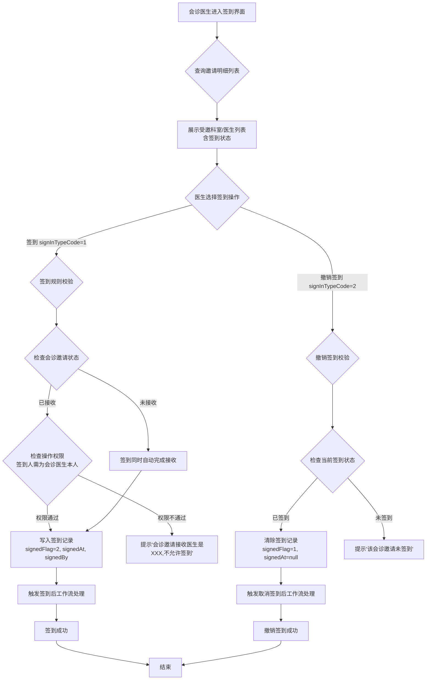
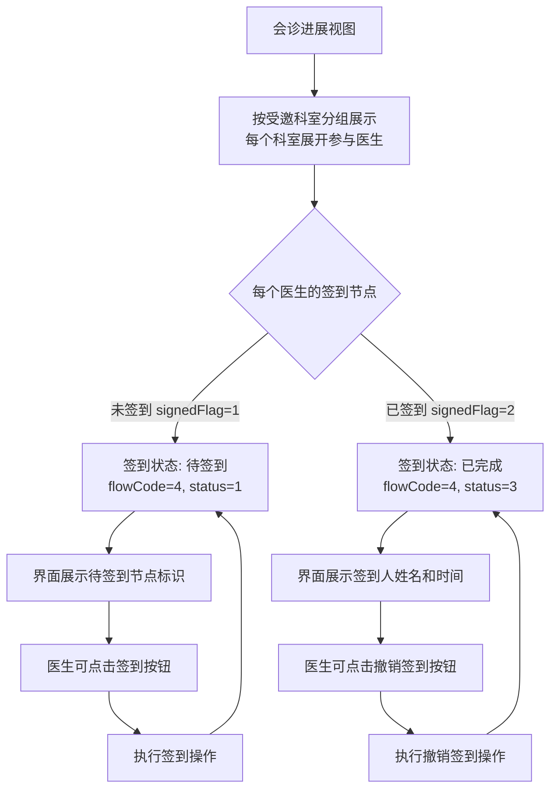

# BLGL-05-HZGL-005 会诊签到_Analyst-Spec

> **需求编号**：BLGL-05-HZGL-005
> **父需求**：BLGL-05-HZGL 会诊管理
> **关联PM Spec**：BLGL-05-HZGL-005_会诊签到_PM-spec.md
> **Spec版本**：V1.0
> **编写时间**：2026-08-21
> **编写人**：RACC

---

## 一、功能编号体系

> 使用带父子层级的 `<功能编号>-ID` 编号，便于追溯和讨论。

### 1.1 功能层级结构

```
BLGL-05-HZGL-005: 会诊签到
  ├─ BLGL-05-HZGL-005-01: 会诊签到/撤销签到 — 签到操作
  ├─ BLGL-05-HZGL-005-02: 签到规则配置 — 强制签到规则参数控制
  └─ BLGL-05-HZGL-005-03: 签到状态展示 — 进展中体现待签到节点
```

> 拆分依据：Phase 1 功能点Spec 第5章中已列出的子功能点。不新增功能清单中不存在的子功能点。

### 1.2 功能编号表

| REQ-ID | 功能名称 | 类型 | 优先级 | 说明 |
|--------|---------|------|--------|------|
| BLGL-05-HZGL-005-01 | 会诊签到/撤销签到 | 功能 | P0 | 会诊医生到场签到确认，支持撤销签到；未接收时签到自动完成接收；支持代为签到 |
| BLGL-05-HZGL-005-02 | 签到规则配置 | 功能 | P0 | 按会诊分类和会诊级别配置强制签到规则，分住院/门诊/急诊三套参数 |
| BLGL-05-HZGL-005-03 | 签到状态展示 | 功能 | P1 | 在会诊进展中体现签到节点状态（待签到/已签到/未开始），各受邀科室按参与医生展开 |

> 类型：功能 / 子功能。优先级与 PM-Spec 一致。功能编号来自 Phase 1 功能点Spec 第5章，子编号从功能清单展开。

---

## 二、核心业务流程

> 每个主流程一个 Mermaid flowchart。**流程步骤必须能在需求原文中找到对应描述，不推测中间步骤。**

### 2.1 会诊签到/撤销签到主流程



### 2.2 强制签到规则校验流程

```mermaid
flowchart TD
    A[会诊医生提交答复前] --> B{检查 signedFlag}
    B -->|已签到(2)| C[读取签到规则参数\nSIGN_RULE_001/002/003]
    B -->|未签到(1)| D[无需校验，直接放行]
    C --> E{参数是否配置}
    E -->|已配置| F[解析 ConsultSignInRuleParam]
    E -->|未配置| G[无需强制签到，放行]
    F --> H{遍历 detailList\n匹配会诊类型+会诊级别}
    H -->|匹配到强制规则| I[提示'当前会诊邀请未签到,请先签到后操作']
    H -->|未匹配到规则| J[放行，允许答复]
    I --> K[禁止答复操作]
    J --> L[允许继续答复]
    G --> L
```

### 2.3 会诊进展中签到状态流转流程



> 至少 2 个 Mermaid 流程图。每个流程对应一个核心业务场景。

---

## 三、功能规格说明

> 每个 REQ-ID 展开详细描述，包含功能概述、用户角色、业务流程、验收标准。

---

### BLGL-05-HZGL-005-01: 会诊签到/撤销签到

#### 3.1.1 功能概述

会诊医生到场后，通过签到操作确认到场参与会诊。支持签到和撤销签到两种操作类型（signInTypeCode: 1=签到, 2=撤销签到）。签到核心逻辑：校验会诊邀请状态为"已接收"后，写入签到标志（signedFlag=2）、签到时间（signedAt）、签到人（signedBy/signedByName）到会诊邀请表（EMR_CONSULT_INVITATION）；撤销签到则清除上述签到信息。签到前后均触发工作流处理（beforeSignHandle/afterSignHandle），撤销签到同理（beforeCancelSignHandle/afterCancelSignHandle）。签到前工作流含操作权限校验（checkOperatePermissionWorkFlow），确保签到人与会诊接收医生为同一人。未接收时签到支持自动完成接收。支持代为签到（申请医生或本科室人员代签）。

（来源：代码 — ConsultSignInServiceImpl.signInConsultation / checkOperatePermissionWorkFlow / ConsultInvitationV2PO signedFlag/signedAt/signedBy/signedByName / ConsultSignInApiPathConstant.SIGN_IN_CONSULTATION）

#### 3.1.2 用户角色

| 角色 | 使用场景 | 权限要求 | 操作频率 |
|------|---------|---------|---------|
| 会诊医生（受邀医生） | 到达会诊现场后签到确认到场 | 需具有签到权限（ConsultationPermission.SIGN_IN = '399297359'） | 中频 |
| 申请医生 | 代为签到（为已接收的受邀医生签到） | 需具有签到权限 | 低频 |
| 本科室人员 | 代为签到（为同科室已接收的医生签到） | 需具有签到权限 | 低频 |

> 角色必须在需求原文中出现过。操作频率从需求分析中归纳。

#### 3.1.3 业务流程（Given/When/Then）

##### 主流程（至少 1 个）

**Scenario 1: 会诊医生成功签到**

```gherkin
Given:
  - 会诊医生已登录系统
  - 存在一条会诊邀请记录，状态为"已接收"（consultStatusCode = ACCEPT）
  - 该邀请的会诊员工（consultEmployeeId）为当前登录医生
  - 该邀请当前未签到（signedFlag = 1, 未签到）
  - 系统已配置签到参数（SIGN_RULE_001），但该会诊类型/级别无需强制签到

When:
  - 医生进入会诊签到界面
  - 系统调用 queryConsultInvitationInfoListForSignIn 接口查询邀请明细列表
  - 医生在邀请列表中选择一条记录，点击"签到"按钮
  - 系统传入参数：emrConsultApplyId, emrConsultInvitationId, signInTypeCode=1, employeeNo
  - 系统调用 signInConsultation 接口
  - 后端执行签到前工作流（checkOperatePermissionWorkFlow）：校验邀请状态为已接收、签到人匹配
  - 后端更新 ConsultInvitationV2PO：signedFlag=2, signedAt=当前时间, signedBy=当前员工ID, signedByName=当前员工姓名
  - 后端执行签到后工作流（afterSignHandle）

Then:
  - 签到成功，系统返回 true
  - 会诊邀请表的 signedFlag 更新为 2（已签到）
  - 会诊邀请表记录签到时间、签到人信息
  - 界面刷新后，该邀请的签到状态显示为"已签到"
  - 操作日志记录签到操作（actionCode 对应签到）
```

##### 异常流程（至少 3 个）

**Scenario 2: 签到人非会诊接收医生本人（业务异常）**

```gherkin
Given:
  - 会诊邀请记录状态为"已接收"（ACCEPT）
  - 该邀请的会诊员工（consultEmployeeId）为医生A
  - 医生B尝试登录系统并进行签到操作
  - 签到人参数中 signInEmployeeId 对应医生B

When:
  - 医生B在签到界面点击"签到"按钮
  - 后端执行签到前工作流（checkOperatePermissionWorkFlow）
  - 系统检测到当前操作人（signInEmployeeId）≠ 会诊员工（consultEmployeeId）

Then:
  - 系统提示"会诊邀请接收医生是[医生A姓名],不允许签到"
  - 签到操作被拒绝
  - 会诊邀请的 signedFlag 保持不变（未签到）
  - 系统记录操作失败日志
```

**Scenario 3: 会诊邀请非接收状态不允许签到（数据异常）**

```gherkin
Given:
  - 会诊邀请记录状态为"已提交"或"未接收"（非 ACCEPT）
  - 会诊医生尝试签到

When:
  - 医生在签到界面点击"签到"按钮
  - 后端执行签到前工作流（checkOperatePermissionWorkFlow）
  - 系统检测到 consultStatusCode ≠ ACCEPT

Then:
  - 系统提示"会诊邀请非接收状态,不允许签到"
  - 签到操作被拒绝
  - 会诊邀请的 signedFlag 保持不变
```

**Scenario 4: 撤销签到操作时参数校验失败（系统异常）**

```gherkin
Given:
  - 医生已签到，signedFlag=2
  - 医生执行撤销签到操作，传入 signInTypeCode=2
  - 业务参数中 emrConsultApplyId 或 emrConsultInvitationId 为空

When:
  - 系统调用 signInConsultation 接口
  - 后端进行参数校验
  - 检测到必填参数 emrConsultApplyId 或 emrConsultInvitationId 为空

Then:
  - 系统抛出 WinningValidateException
  - 提示"会诊签到/撤销签到接口,参数[emrConsultApplyId]不能为空"
  - 撤销签到操作未执行
  - 会诊邀请的 signedFlag 保持不变
```

##### 边界流程（至少 2 个）

**Scenario 5: 未接收时签到自动完成接收（边界流程）**

```gherkin
Given:
  - 会诊邀请记录状态为"未接收"（consultStatusCode ≠ ACCEPT）
  - 签到规则参数允许该场景下签到

When:
  - 受邀医生在签到界面点击"签到"按钮
  - 系统执行签到操作
  - 系统检测到邀请未接收，触发自动接收逻辑

Then:
  - 签到操作成功执行
  - 会诊邀请的 consultStatusCode 变更为"已接收"（ACCEPT）
  - 会诊邀请的 signedFlag 更新为 2（已签到）
  - 签到时间、签到人信息同步记录
  - 操作日志记录"自动接收"和"签到"两个操作
```

**Scenario 6: 已签到状态下重复签到（边界流程）**

```gherkin
Given:
  - 会诊邀请已签到（signedFlag=2, 已签到）
  - 签到人再次点击"签到"按钮

When:
  - 系统调用 signInConsultation 接口，signInTypeCode=1
  - 后端检测到当前邀请的 signedFlag 已为 2（已签到）

Then:
  - 系统提示"会诊签到/撤销签到接口,参数[emrConsultInvitationId]对应的会诊邀请信息已签到"
  - 重复签到操作被拒绝
  - signedFlag 保持为 2，不变更
```

#### 3.1.5 验收标准

| AC编号 | 验收标准 | 对应REQ-ID | 验证方法 | 验证场景 |
|--------|---------|-----------|---------|---------|
| AC-001 | 已接收的会诊医生可成功签到，signedFlag更新为2，记录签到时间和签到人 | BLGL-05-HZGL-005-01 | 功能测试 | Scenario 1 |
| AC-002 | 非会诊接收医生本人签到被拒绝，给出明确提示 | BLGL-05-HZGL-005-01 | 功能测试 | Scenario 2 |
| AC-003 | 非接收状态的会诊邀请不允许签到 | BLGL-05-HZGL-005-01 | 功能测试 | Scenario 3 |
| AC-004 | 撤销签到必填参数为空时系统拒绝操作并给出提示 | BLGL-05-HZGL-005-01 | 功能测试 | Scenario 4 |
| AC-005 | 未接收时签到可自动完成接收后再签到 | BLGL-05-HZGL-005-01 | 功能测试 | Scenario 5 |
| AC-006 | 已签到状态下重复签到被拒绝，状态不变 | BLGL-05-HZGL-005-01 | 功能测试 | Scenario 6 |
| AC-007 | 撤销签到后清除签到信息，signedFlag恢复为1，signedAt/signedBy/signedByName置空 | BLGL-05-HZGL-005-01 | 功能测试 | Scenario 被撤销签到 |

---

### BLGL-05-HZGL-005-02: 签到规则配置

#### 3.2.1 功能概述

通过系统参数配置强制签到规则，按就诊来源（住院/门诊/急诊）分别控制。住院对应参数 SIGN_RULE_001，门诊对应 SIGN_RULE_002，急诊对应 SIGN_RULE_003。参数值格式为 JSON（ConsultSignInRuleParam），包含 detailList 列表，每个明细项定义会诊类型代码（consultTyeCode）、会诊类型名称、会诊级别代码（consultLevelCode）、会诊级别名称。当配置了某会诊类型+级别的强制签到规则后，对应场景的会诊医生在答复前须先完成签到，否则系统提示"当前会诊邀请未签到,请先签到后操作"并阻止答复操作。

（来源：代码 — ConsultCommonParamConstants.SIGN_RULE_001/002/003 / ConsultSignInRuleParam / checkConsultSignInStatusWorkFlow.execute）

#### 3.2.2 用户角色

| 角色 | 使用场景 | 权限要求 | 操作频率 |
|------|---------|---------|---------|
| 系统管理员 | 在会诊配置管理中配置签到规则参数 | 需具有会诊参数配置权限 | 低频 |
| 科室管理员 | 配置本科室关联的签到规则 | 需具有会诊参数配置权限 | 低频 |

> 角色必须在需求原文中出现过。操作频率从需求分析中归纳。

#### 3.2.3 业务流程（Given/When/Then）

##### 主流程（至少 1 个）

**Scenario 1: 配置住院会诊强制签到规则并生效**

```gherkin
Given:
  - 系统管理员登录会诊配置管理界面
  - 进入参数配置页面，找到签到规则参数 SIGN_RULE_001（住院）
  - 该参数当前未配置或值为空

When:
  - 管理员编辑 SIGN_RULE_001 参数值
  - 配置一条规则：会诊类型代码=科间会诊，会诊级别代码=普通会诊
  - 保存参数配置
  - 此后，该医院的住院科间普通会诊在答复前需先签到

Then:
  - 参数保存成功，SIGN_RULE_001 的 paramValue 更新为配置的 JSON 字符串
  - 参数格式为：{"detailList":[{"consultTyeCode":"科间会诊代码","consultTyeName":"科间会诊","consultLevelCode":"普通会诊代码","consultLevelName":"普通会诊"}]}
  - 后续该医院的住院科间普通会诊中，医生提交答复时触发 checkConsultSignInStatusWorkFlow 校验
  - 检测到未签到（signedFlag=1），系统提示"当前会诊邀请未签到,请先签到后操作"
  - 答复操作被阻止
```

##### 异常流程（至少 3 个）

**Scenario 2: 签到规则参数格式错误导致解析失败（数据异常）**

```gherkin
Given:
  - 系统管理员在参数配置界面编辑 SIGN_RULE_001
  - 输入的参数值 JSON 格式错误（如缺少括号、字段名错误）

When:
  - 管理员保存参数
  - 后端校验参数值格式
  - 或系统在运行态解析该参数时抛出异常

Then:
  - ⏳ 待确认：保存时是否做 JSON 格式校验
  - 若保存成功但运行态解析失败，系统应降级处理为"不强制签到"
  - 系统记录参数解析异常日志
  - 建议补充方：产品经理确认参数保存时的校验规则
```

**Scenario 3: 参数未配置时强制签到校验不生效（业务异常）**

```gherkin
Given:
  - 住院会诊参数 SIGN_RULE_001 未配置（paramValue 为空或参数不存在）
  - 会诊医生已接收邀请，未签到

When:
  - 医生提交会诊答复
  - 系统执行 checkConsultSignInStatusWorkFlow 校验
  - 检测到参数未配置，跳过强制签到校验

Then:
  - 系统不执行强制签到校验
  - 医生可在未签到状态下直接提交答复
  - 系统正常处理答复操作
```

**Scenario 4: 参数变更后已存在的会诊不受影响（系统异常/边界场景）**

```gherkin
Given:
  - 某个住院科间会诊已创建，医生已接收但尚未签到
  - 管理员在此时修改了 SIGN_RULE_001 参数，新增了该会诊类型的强制签到规则

When:
  - 医生在参数变更后提交会诊答复
  - 系统执行 checkConsultSignInStatusWorkFlow 校验
  - 系统读取最新的 SIGN_RULE_001 参数值

Then:
  - ⏳ 待确认：参数变更是否影响已创建的会诊
  - 若按运行态实时读取参数，则参数变更后已创建的会诊也受强制签到规则约束
  - 建议补充方：产品经理确认参数生效策略（实时生效/仅后续新会诊生效）
```

##### 边界流程（至少 2 个）

**Scenario 5: 三类就诊来源分别配置不同的签到规则（边界流程）**

```gherkin
Given:
  - 系统管理员分别配置 SIGN_RULE_001（住院）、SIGN_RULE_002（门诊）、SIGN_RULE_003（急诊）
  - 住院配置了科间会诊+普通会诊强制签到
  - 门诊配置了全院会诊强制签到
  - 急诊未配置任何强制签到规则

When:
  - 住院科间会诊医生提交答复时，触发强制签到校验
  - 门诊全院会诊医生提交答复时，触发强制签到校验
  - 急诊会诊医生提交答复时，无强制签到要求

Then:
  - 住院科间会诊未签到则答复被阻止
  - 门诊全院会诊未签到则答复被阻止
  - 急诊会诊未签到也可正常答复
  - 三类参数互不影响，独立生效
```

**Scenario 6: 会诊级别代码为 0 时匹配所有级别（边界流程）**

```gherkin
Given:
  - 签到规则配置中，某条明细的 consultLevelCode 为 "0"
  - 系统校验逻辑中，allowedLevelList 包含 "0" 和当前会诊的实际级别代码

When:
  - 医生提交该会诊类型的答复
  - 系统执行签到状态校验

Then:
  - 会诊级别代码为 0 的规则匹配所有会诊级别
  - 只要会诊类型匹配，即触发强制签到校验
  - 未签到时提示"当前会诊邀请未签到,请先签到后操作"
```

#### 3.2.5 验收标准

| AC编号 | 验收标准 | 对应REQ-ID | 验证方法 | 验证场景 |
|--------|---------|-----------|---------|---------|
| AC-008 | 配置 SIGN_RULE_001 后，住院科间会诊未签到则答复被阻止 | BLGL-05-HZGL-005-02 | 功能测试 | Scenario 1 |
| AC-009 | 参数未配置时不执行强制签到校验，医生可直接答复 | BLGL-05-HZGL-005-02 | 功能测试 | Scenario 3 |
| AC-010 | 住院/门诊/急诊三类参数独立配置，互不影响 | BLGL-05-HZGL-005-02 | 功能测试 | Scenario 5 |
| AC-011 | 会诊级别代码为0的规则匹配所有会诊级别 | BLGL-05-HZGL-005-02 | 功能测试 | Scenario 6 |
| AC-012 | 参数 JSON 格式校验规则符合预期（⏳ 待确认具体规则） | BLGL-05-HZGL-005-02 | 功能测试 | Scenario 2 |

---

### BLGL-05-HZGL-005-03: 签到状态展示

#### 3.3.1 功能概述

在会诊进展视图中，按受邀科室分组展示每个参与医生的会诊流程节点状态，其中"签到"节点（flowCode=4）作为流程节点之一展示。签到节点状态包括：未开始（status=1，显示待签到标识）、已完成（status=3，显示签到人姓名和签到时间）。进展视图通过 queryProgressView 接口获取，数据按受邀科室+参与医生展开，每个医生节点展示完整的流程链路（指派→接收→签到→答复→反馈→评价）。签到状态数据来源于会诊邀请表（EMR_CONSULT_INVITATION）的 signedFlag 字段。强制签到流程中，未签到时在进展上体现待签到节点，提示医生需要先完成签到。

（来源：代码 — 前端 mock getProgress.ts / 前端枚举 ConsultationFlow.CHECK_IN = '5' / ConsultInvitationV2PO.signedFlag）

#### 3.3.2 用户角色

| 角色 | 使用场景 | 权限要求 | 操作频率 |
|------|---------|---------|---------|
| 申请医生 | 查看会诊进展，了解各受邀医生签到状态 | 可查看本人发起的会诊进展 | 中频 |
| 会诊医生 | 查看个人签到状态，了解待签到节点 | 可查看本人参与的会诊进展 | 中频 |
| 科室主任/院总 | 查看科室会诊进展，监控签到情况 | 需具有会诊进展查看权限 | 中频 |

> 角色必须在需求原文中出现过。操作频率从需求分析中归纳。

#### 3.3.3 业务流程（Given/When/Then）

##### 主流程（至少 1 个）

**Scenario 1: 申请医生查看会诊进展中的签到状态**

```gherkin
Given:
  - 申请医生已登录系统
  - 存在一条已提交的会诊申请，已指派给多个科室的医生
  - 各受邀医生的签到状态不同：医生A已签到，医生B未签到，医生C尚未指派

When:
  - 申请医生进入会诊详情页，点击"进展"tab
  - 系统调用 queryProgressView 接口
  - 系统按受邀科室分组展示进展视图

Then:
  - 进展视图按受邀科室分组展示，每个科室下展开各参与医生的流程节点
  - 医生A的签到节点显示：flowName="签到", flowCode="4", status="3"（已完成）, employeeName="医生A姓名", operateDate="签到时间"
  - 医生B的签到节点显示：flowName="签到", flowCode="4", status="1"（未开始）, employeeName="", operateDate=""
  - 医生C的签到节点显示：flowName="签到", flowCode="4", status="1"（未开始）
  - 已签到节点以已完成样式展示（如绿色勾选标识）
  - 未签到节点以待签到样式展示（如灰色待办标识）
```

##### 异常流程（至少 3 个）

**Scenario 2: 签到节点在进展中展示但受邀医生未到会场（业务异常）**

```gherkin
Given:
  - 会诊进展视图中，某受邀医生的签到节点显示为"待签到"（status=1）
  - 医生已接收会诊邀请但尚未签到（signedFlag=1）
  - 已配置强制签到规则

When:
  - 申请医生或院总查看进展视图
  - 观察到该医生的签到节点为"待签到"状态
  - 强制签到规则生效，该医生在签到前无法提交答复

Then:
  - 进展视图中签到节点清晰标识为"待签到"
  - 该节点以提醒样式显示（如橙色或高亮）
  - 系统提示"该医生尚未签到，需先完成签到才能提交会诊答复"
  - 进展视图提供签到操作的快捷入口（如点击签到按钮）
```

**Scenario 3: 进展视图数据加载异常（系统异常）**

```gherkin
Given:
  - 用户进入会诊进展视图
  - 后端 queryProgressView 接口响应超时或返回异常

When:
  - 系统调用 queryProgressView 接口
  - 接口响应时间超过前端超时阈值

Then:
  - 系统显示进展视图加载失败提示
  - 保留其他已加载的会诊详情信息
  - 提供"重新加载"按钮
  - 系统记录接口异常日志
```

**Scenario 4: 进展视图无签到节点显示（数据异常）**

```gherkin
Given:
  - 会诊进展视图已加载
  - 某受邀医生的流程节点列表中缺少"签到"节点

When:
  - 用户查看该医生的流程节点列表
  - 节点列表中仅显示"指派→接收→答复→反馈→评价"，缺少"签到"

Then:
  - ⏳ 待确认：签到节点是否在所有会诊类型中均展示
  - 若签到规则参数未配置，是否在进展中隐藏签到节点
  - 建议补充方：产品经理确认签到节点展示策略
```

##### 边界流程（至少 2 个）

**Scenario 5: MDT会诊中多个参与医生的签到状态独立展示（边界流程）**

```gherkin
Given:
  - MDT会诊邀请了多个科室的医生
  - 各科室分别指派了会诊医生
  - 医生A已签到，医生B已签到，医生C未签到，医生D已撤销签到

When:
  - 用户查看MDT会诊进展视图
  - 进展视图按科室分组展示各医生的签到状态

Then:
  - 医生A显示"已签到"（status=3），展示签到时间和签到人
  - 医生B显示"已签到"（status=3）
  - 医生C显示"待签到"（status=1）
  - 医生D显示"待签到"（status=1，撤销签到后恢复为未签到状态）
  - 各医生的签到状态独立展示，互不影响
  - 每个医生的签到节点均有独立的签到/撤销签到操作入口
```

**Scenario 6: 撤销签到后进展视图状态同步更新（边界流程）**

```gherkin
Given:
  - 会诊医生A已签到，进展视图显示"已签到"（status=3）
  - 医生A执行撤销签到操作

When:
  - 撤销签到成功后，会诊邀请的 signedFlag 恢复为 1（未签到）
  - 用户重新加载进展视图
  - 系统调用 queryProgressView 接口获取最新数据

Then:
  - 进展视图中医生A的签到节点状态更新为"待签到"（status=1）
  - 签到时间和签到人信息清除
  - 节点展示恢复为未开始样式
  - 医生A可重新执行签到操作
```

#### 3.3.5 验收标准

| AC编号 | 验收标准 | 对应REQ-ID | 验证方法 | 验证场景 |
|--------|---------|-----------|---------|---------|
| AC-013 | 会诊进展视图按受邀科室分组展示签到节点状态 | BLGL-05-HZGL-005-03 | 功能测试 | Scenario 1 |
| AC-014 | 已签到节点展示签到人姓名和签到时间，未签到节点展示待签到标识 | BLGL-05-HZGL-005-03 | 功能测试 | Scenario 1 |
| AC-015 | 强制签到规则下未签到节点在进展中突出显示 | BLGL-05-HZGL-005-03 | 功能测试 | Scenario 2 |
| AC-016 | 进展视图加载异常时提供重试机制 | BLGL-05-HZGL-005-03 | 功能测试 | Scenario 3 |
| AC-017 | MDT会诊中各医生签到状态独立展示 | BLGL-05-HZGL-005-03 | 功能测试 | Scenario 5 |
| AC-018 | 撤销签到后进展视图签到状态同步更新为待签到 | BLGL-05-HZGL-005-03 | 功能测试 | Scenario 6 |

---

## 四、排除范围

本需求不包含以下功能项：

1. **会诊计费（签到节点计费）** - 签到节点作为计费触发条件之一的配置，归属于 BLGL-05-HZGL-006 会诊计费
2. **会诊答复与记录** - 签到后的会诊意见提交、会诊记录生成，归属于 BLGL-05-HZGL-003 会诊答复与记录
3. **会诊接收与指派** - 会诊任务的接收和指派流程，归属于 BLGL-05-HZGL-004 会诊接收与指派
4. **会诊申请** - 会诊申请的创建、编辑、提交，归属于 BLGL-05-HZGL-001 会诊申请
5. **会诊审核** - 会诊申请的审核流程，归属于 BLGL-05-HZGL-002 会诊审核
6. **会诊完成与统计** - 会诊完成后的实际参与人员确认与统计报表，归属于 BC-HZGL-002 会诊查询与统计基础能力
7. **会诊提醒/通知推送** - 签到提醒、未签到通知等消息推送，归属于 BC-HZGL-004 消息对接与通知基础能力
8. **CA签名** - 签到与CA签名关联，归属于 BLGL-15-QM CA签名模块

> 与 PM-Spec 第四章保持一致。对照 Phase 1 功能点Spec 第6章（基线能力），确保不越界。

---

## 五、业务规则清单

| 规则ID | 规则名称 | 规则描述 | 来源 | 优先级 |
|--------|---------|---------|------|--------|
| BR-001 | 签到操作类型规则 | 签到操作类型编码：1=签到，2=撤销签到（signInTypeCode） | 代码：SignInConsultationParam.signInTypeCode | P0 |
| BR-002 | 签到数据写入规则 | 签到成功后更新 EMR_CONSULT_INVITATION 表：signedFlag=2, signedAt=当前时间, signedBy=当前员工ID, signedByName=当前员工姓名 | 代码：ConsultSignInServiceImpl.signInConsultation | P0 |
| BR-003 | 撤销签到数据清除规则 | 撤销签到后清除签到信息：signedFlag=1, signedAt=null, signedBy=null, signedByName=null | 代码：ConsultSignInServiceImpl.signInConsultation | P0 |
| BR-004 | 签到权限校验规则 | 签到前校验：会诊邀请状态须为"已接收"（ACCEPT），且签到人须与会诊接收医生为同一人（consultEmployeeId = signInEmployeeId） | 代码：checkOperatePermissionWorkFlow | P0 |
| BR-005 | 未接收签到自动接收规则 | 未接收时签到支持自动完成接收，接收后再执行签到操作 | 需求要点 | P0 |
| BR-006 | 强制签到参数规则 | 按就诊来源配置强制签到规则：SIGN_RULE_001（住院）、SIGN_RULE_002（门诊）、SIGN_RULE_003（急诊） | 代码：ConsultCommonParamConstants | P0 |
| BR-007 | 强制签到匹配规则 | 强制签到校验按"会诊类型 + 会诊级别"匹配规则明细，会诊级别代码为0时匹配所有级别 | 代码：checkConsultSignInStatusWorkFlow | P0 |
| BR-008 | 签到节点进展展示规则 | 会诊进展视图中签到节点（flowCode=4）按受邀科室+参与医生展开，状态：1=未开始（待签到），3=已完成（已签到） | 代码：前端 mock getProgress.ts / 枚举 ConsultationFlow | P1 |
| BR-009 | 签到权限控制规则 | 签到操作受权限控制，权限代码为 SIGN_IN = '399297359' | 代码：前端枚举 ConsultationPermission | P0 |
| BR-010 | 参数未配置降级规则 | 签到规则参数未配置或值为空时，不执行强制签到校验，答复操作不受限制 | 代码：checkConsultSignInStatusWorkFlow | P0 |
| BR-011 | MDT会诊签到规则 | MDT会诊支持取消签到流程，实际参与人员确认与统计优化 | 需求要点 | P1 |
| BR-012 | 代为签到规则 | 支持代为签到：申请医生或本科室人员可为已接收的受邀医生代签 | 需求要点 | P1 |

> 每条 BR 注明来源需求编号。规则描述必须能从需求原文中逐字对应，不得概括后失去原意。优先级与 PM-Spec 保持一致。

---

## 六、关联文档

| 文档类型 | 文档路径 | 说明 |
|---------|---------|------|
| 功能点Spec | 上级目录 BLGL-05-HZGL 05会诊管理功能点Spec.md（V1.0） | Phase 1 功能点索引 |
| PM spec | 本目录 BLGL-05-HZGL-005_会诊签到_PM-spec.md（V0.1） | PM 产出的 Spec 文档 |
| -Spec | 本目录 BLGL-05-HZGL-005_会诊签到-Spec.md（V1.0） | Spec（研发视角） |
| data-model.md | 待产出 | 架构师产出的数据建模文档 |
| design.md | 待产出 | 架构师产出的技术方案文档 |
| api-contract.md | 待产出 | 开发经理产出的 API 契约文档 |

> 第1行必须引用 Phase 1 功能点Spec。

---

## 七、待确认问题清单

| 编号 | 问题描述 | 缺失信息 | 影响范围 | 建议补充方 |
|------|---------|---------|---------|-----------|
| Q-001 | 签到规则参数保存时是否做 JSON 格式校验？若不做校验，运行态解析失败时的降级策略是什么？ | 参数保存时的校验规则 | 3.2.3 Scenario 2, AC-012 | 产品经理 |
| Q-002 | 签到规则参数变更后，已创建的会诊是否受新规则约束？是实时生效还是仅对后续新会诊生效？ | 参数生效策略 | 3.2.3 Scenario 4 | 产品经理 |
| Q-003 | 签到节点是否在所有会诊类型中均展示？若签到规则参数未配置，进展视图中是否隐藏签到节点？ | 签到节点展示策略 | 3.3.3 Scenario 4 | 产品经理 |
| Q-004 | 代为签到（申请医生或本科室人员代签）的具体权限控制规则是什么？代签人需要满足什么条件？ | 代为签到的权限规则详情 | BR-012 | 产品经理 |
| Q-005 | MDT会诊取消签到流程的具体业务规则是什么？实际参与人员确认与统计优化的具体实现方式？ | MDT会诊签到相关优化规则 | BR-011 | 产品经理 |
| Q-006 | 未接收时签到自动完成接收，自动接收的逻辑是否与正常接收流程一致？是否需要额外校验（如不接收自己发起的会诊）？ | 自动接收的业务规则 | BR-005 | 产品经理 |
| Q-007 | 签到操作是否需要密码验证？SignInConsultationParam 中包含 password 字段，但实际调用场景中密码的使用规则是什么？ | 密码验证的使用场景 | 3.1.3 Scenario 1 | 研发工程师 |
| Q-008 | 会诊进展视图中签到节点的排序规则是什么？是否按流程顺序（指派→接收→签到→答复→反馈→评价）固定排列？ | 进展视图节点排序规则 | 3.3.3 Scenario 1 | 产品经理 |

> 逐条列出全文所有 `⏳ 待确认` 项。

---

## 填写检查清单

| 序号 | 检查项 | 是否完成 |
|:----:|--------|:--------:|
| 1 | 功能编号带父子层级 | ✅ |
| 2 | 每个 REQ-ID 有功能概述和用户角色 | ✅ |
| 3 | 主流程至少 1 个 Given/When/Then 场景 | ✅ |
| 4 | 异常流程至少 3 个 Given/When/Then 场景 | ✅ |
| 5 | 边界流程至少 2 个 Given/When/Then 场景 | ✅ |
| 6 | 每个 Given/When/Then 内容具体，不模糊 | ✅ |
| 7 | 验收标准 AC 编号独立，可验证 | ✅ |
| 8 | 每个子功能点含验收标准 | ✅ |
| 9 | 验收标准无"功能正常"等模糊表述 | ✅ |
| 10 | 排除范围明确列出 | ✅ |
| 11 | 业务规则清单列出所有规则，每条标注来源 | ✅ |
| 12 | 流程图使用 Mermaid 格式（≥2 个） | ✅ |
| 13 | 关联文档索引包含 Phase 1 功能点Spec | ✅ |
| 14 | 待确认问题清单汇总了全文所有 ⏳ 项 | ✅ |
| 15 | 全文无占位符 `< >` 残留 | ✅ |
| 16 | 全文陈述可溯源至资料区（S1~S10 溯源核查） | ✅ |
| 17 | 人工审核确认完成 | ⏳ 待确认 |

---

**文档状态**：⬜ 待审核
**维护责任**：需求分析师规范组
**下次更新**：根据评审反馈优化

---

## 版本历史

| 版本 | 日期 | 变更说明 | 编写人 |
|------|------|---------|--------|
| V1.0 | 2026-08-21 | 初始版本 | RACC |