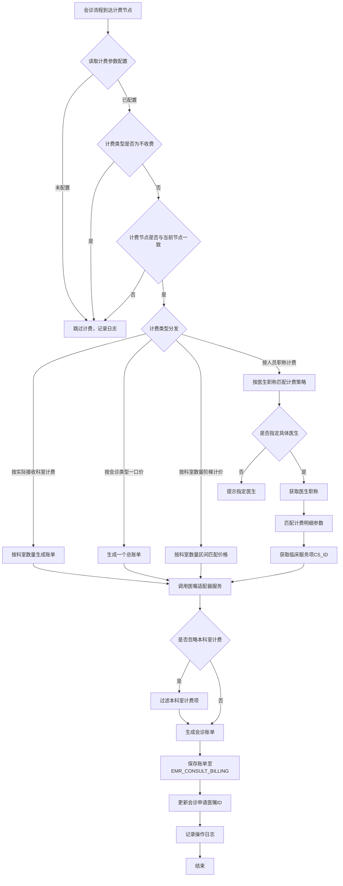
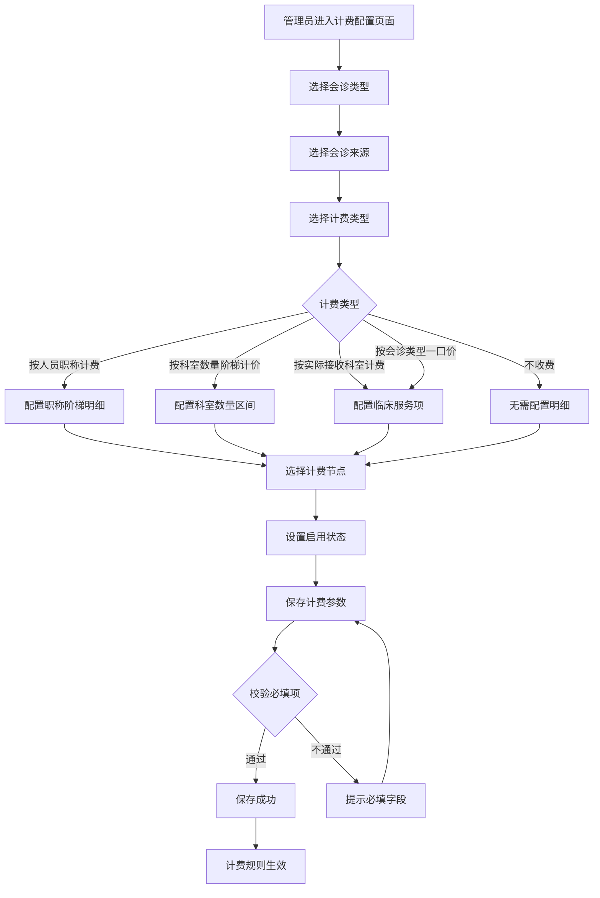
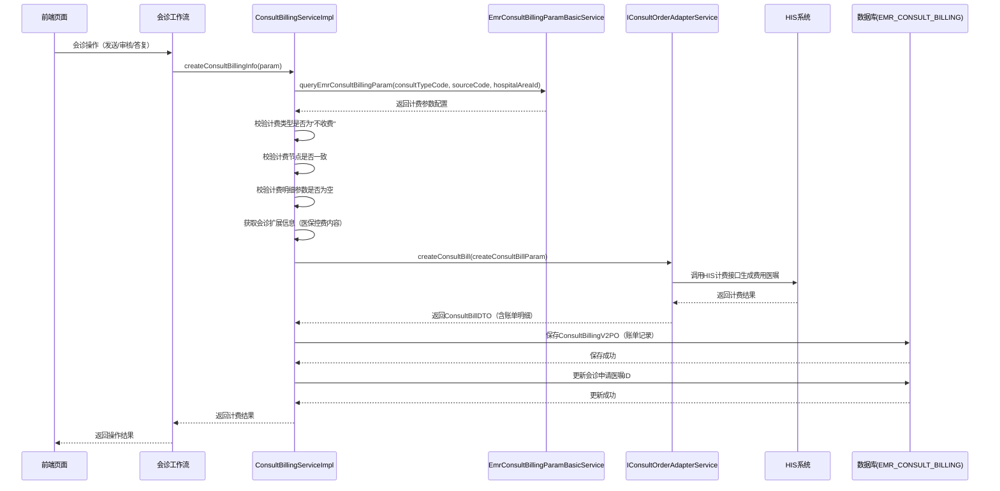
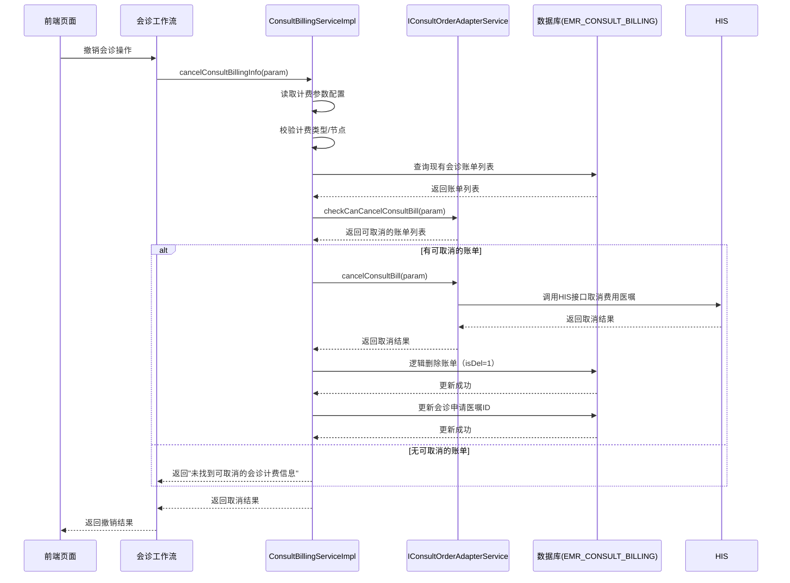

# BLGL-05-HZGL-006 会诊计费 - Spec

> **功能编号**：BLGL-05-HZGL-006
> **文档类型**：Spec（研发视角）
> **文档版本**：V1.0
> **编写时间**：2026-08-21
> **编写人**：RACC

---

## 文档索引

本节提供本文档的章节结构索引与关联文档索引，便于读者快速定位与检索。

#### 章节索引

**PM-Spec（业务视角）**

| 章节号 | 章节名称 | 内容说明 |
|--------|---------|---------|
| 一 | 目标 | 一句话描述功能目标 |
| 二 | 约束 | 业务约束、技术约束、非功能性约束 |
| 三 | 验收标准 | 验收标准与验证方法 |
| 四 | 排除范围 | 本次不做、明确边界 |
| 五 | 关键决策记录 | 方案决策、其他决议 |
| 六 | 优先级 | 需求优先级说明 |
| 附录 | 填写检查清单 | 检查项与完成状态 |

**Analyst-Spec（产品视角）**

| 章节号 | 章节名称 | 内容说明 |
|--------|---------|---------|
| 一 | 功能编号体系 | 带父子层级的编号树 |
| 二 | 核心业务流程 | Mermaid 流程图 |
| 三 | 功能规格说明 | 各子功能点的概述、用户角色、业务流程、验收标准 |
| 四 | 排除范围 | 本需求不包含的功能项 |
| 五 | 业务规则清单 | 规则ID、规则名称、规则描述、优先级 |
| 六 | 关联文档 | 文档类型、文档路径、说明 |
| 七 | 待确认问题清单 | 所有 ⏳ 待确认项的汇总 |
| - | 填写检查清单 | 检查项与完成状态 |

**Spec（研发视角）**

| 章节号 | 章节名称 | 内容说明 |
|--------|---------|---------|
| 第1章 | 文档概述 | 文档目的、文档范围、术语定义、阅读指南、参考文档 |
| 第2章 | 功能背景与定位 | 功能背景、功能定位、目标用户、核心价值 |
| 第3章 | 业务流程设计 | 主流程/异常流程/边界流程（Given/When/Then） |
| 第4章 | 数据模型设计 | 核心数据结构、状态定义、系统参数定义 |
| 第5章 | 接口契约设计 | API列表、接口详细设计、错误码定义 |
| 第6章 | 技术方案设计 | 页面路径、技术栈、关键技术点、部署方案 |
| 第7章 | 测试用例预设计 | 功能/边界/异常/性能测试用例 |
| 第8章 | 非功能性要求 | 性能、安全、可用性、兼容性 |
| 第9章 | 依赖与风险 | 外部依赖、风险项 |
| 第10章 | 附录 | 流程图、时序图、参考文档 |

#### 版本历史

| 版本 | 日期 | 变更说明 | 编写人 |
|------|------|---------|--------|
| V1.0 | 2026-08-21 | 初始版本 | RACC |

#### 关联文档索引

| 序号 | 文档名称 | 文档类型 | 版本 | 位置 |
|------|---------|---------|------|------|
| 1 | BLGL-05-HZGL-006_会诊计费-Spec.md | Spec（研发视角）（本文档） | V1.0 | 本目录 |
| 2 | BLGL-05-HZGL-006_会诊计费_PM-spec.md | PM-Spec（业务视角） | V1.0 | 本目录 |
| 3 | BLGL-05-HZGL-006_会诊计费_Analyst-spec.md | Analyst-Spec（产品视角） | V1.0 | 本目录 |
| 4 | BLGL-05-HZGL 05会诊管理功能点Spec.md | 功能点Spec（模块级） | V1.0 | 上级目录 |
| 5 | 新会诊历史需求.xlsx | 历史需求（资料区） | - | 资料区 |

> 📌 第4项为 Phase 1 输出，必须引用。版本号与 Phase 1 功能点Spec 实际版本一致。

---

## 1、文档概述

### 1.1、文档目的

本文档旨在明确"会诊计费"功能（BLGL-05-HZGL-006）的业务背景与设计方案，为需求分析、研发实现、测试验收及评审提供统一的业务上下文、设计口径与决策依据。

**具体目的包括**：

1. 梳理会诊计费功能的业务由来与历史需求演进脉络，说明"为什么要做"；
2. 明确功能的定位边界、目标用户与核心价值，回答"做成什么"；
3. 描述功能的业务流程、数据模型、接口契约与技术方案，回答"怎么做"；
4. 预设计测试用例并明确非功能性要求、依赖与风险，为研发与验收提供依据；
5. 作为 SPEC（功能编号体系、功能详情、业务规则、验收标准等章节）的业务前提与设计输入，保证各层文档业务口径一致。

> 📌 第1~2点对应业务层，第3~5点对应设计层。资料区的需求分析原文作为业务层素材，历史需求中的设计描述作为设计层素材。

### 1.2、文档范围

#### 1.2.1 纳入范围

本文档覆盖会诊计费功能的完整业务背景与设计，包括：

- 会诊计费参数配置：计费类型（按实际接收科室计费/按会诊类型一口价/按科室数量阶梯计价/按人员职称计费/不收费）、计费节点（发送/审核/签到/接收/答复/完成）、是否启用
- 职称阶梯计费：按医生职称（正高/副高/主任医师/副主任医师等）匹配不同的计费策略
- 医保控费校验：会诊计费时查询医保控费信息，校验费用是否在医保可报销范围内
- 医生自主选择是否计费：支持医生在会诊流程中忽略/恢复计费
- 院外会诊按职称分类计费：正高、副高分别对应不同计费标准
- 科间会诊按职称计费时提示邀请具体医生
- 参数控制邀请本科室抗菌药物会诊专家审批时不收取会诊费
- 急诊科发起会诊时自动生成费用医嘱，执行科室设为会诊科室
- 会诊费记账人控制为接收方
- 会诊计费服务不绑定计费策略，通过参数配置驱动
- 会诊未计费查询与预出院校验
- 计费账单生成、撤销与状态管理

#### 1.2.2 排除范围

本文档不涉及以下内容（详见其他功能点或模块）：

- 会诊申请（BLGL-05-HZGL-001）：申请创建、提交、撤销、删除等
- 会诊审核（BLGL-05-HZGL-002）：审核流程、审核意见、多级审核等
- 会诊答复与记录（BLGL-05-HZGL-003）：会诊意见书写、会诊记录生成等
- 会诊接收与指派（BLGL-05-HZGL-004）：会诊任务接收、指派具体医生等
- 会诊签到（BLGL-05-HZGL-005）：医生到场签到、撤销签到、代为签到等
- 会诊配置管理（BC-HZGL-003）：通用参数配置（不含计费参数）、审核流程配置、科室配置等
- HIS系统费用结算：实际扣费、退费、医保结算等由HIS系统完成

### 1.3、术语定义

| 术语 | 定义 |
|------|------|
| 会诊计费 | 根据会诊类型/医生职称等规则计算会诊费用，支持医生自主选择是否计费，医保控费校验，生成费用账单（来源：需求） |
| 计费类型 | 定义会诊费用的计算方式：按实际接收科室计费、按会诊类型一口价、按科室数量阶梯计价、按人员职称计费、不收费（来源：代码，BillingTypeEnum） |
| 计费节点 | 定义会诊费用触发的业务流程节点：发送、审核、签到、接收、答复、完成（来源：代码，BillingNodeEnum） |
| 计费参数配置 | 用于管理计费类型、计费节点、启用状态等参数的配置项，支持按会诊类型、会诊来源、院区等维度配置（来源：代码，EMR_CONSULT_BILLING_PARAM） |
| 计费明细参数 | 计费参数下的明细配置，按职称（正高/副高/主任医师等）或科室数量区间匹配临床服务项（CS_ID），定义具体计费金额来源（来源：代码，EMR_CONSULT_BILL_DETAIL_PARAM） |
| 职称阶梯计费 | 按会诊医生的职称等级（正高、副高、主任医师、副主任医师、主治医师等）匹配不同的计费标准（来源：需求） |
| 医保控费 | 会诊计费时查询医保控费信息，校验费用是否在医保可报销范围内，避免医保超额（来源：需求） |
| 会诊账单 | 记录每次会诊计费操作的账单信息，包含会诊申请ID、邀请ID、账单状态、金额、临床服务ID等（来源：代码，EMR_CONSULT_BILLING） |
| 会诊医嘱 | 与会诊相关的医疗指令，急诊会诊自动生成费用医嘱，执行科室设为会诊科室（来源：需求） |
| 临床服务项（CS_ID） | 临床服务标识，用于关联计费项目和医嘱项目，计费时通过CS_ID确定收费项目和金额（来源：代码） |
| 忽略计费 | 医生自主选择是否对某次会诊进行计费，支持在会诊过程中忽略计费或恢复计费（来源：需求） |
| 预出院校验 | 患者出院前校验会诊费用是否已计费，未计费时提示不允许出院（来源：需求） |

### 1.4、阅读指南

- **章节关系**：第1~2章为阅读铺垫与业务全貌（背景、定位、用户、价值）；第3~10章为设计实现层（流程、数据、接口、技术、测试、非功能、依赖风险、附录），可直接用于研发与测试。与 Analyst-Spec（产品视角）、PM-Spec（业务视角）的详细规则/验收口径互相引用，保持一致。
- **读者对象**：
  - 产品经理/需求分析师：阅读第1~2章了解业务全貌，据此维护 PM-Spec 与功能清单；
  - 研发：阅读第3~6章用于开发实现，第9~10章用于依赖评估与联调；
  - 测试：阅读第3章、第7~8章用于用例设计与验收；
  - 评审人员：以本文档为业务口径与设计基准，核对各层文档一致性。

### 1.5、参考文档

| 序号 | 文档名称 | 版本/日期 |
|------|---------|----------|
| 1 | 【历史需求】新会诊历史需求.xlsx（117条需求） | - |
| 2 | BLGL-05-HZGL-006_会诊计费_PM-spec.md | V1.0 |
| 3 | BLGL-05-HZGL-006_会诊计费_Analyst-spec.md | V1.0 |
| 4 | BLGL-05-HZGL 05会诊管理功能点Spec.md | V1.0 |
| 5 | 代码仓库扫描结果（sr-next/winning-emr-consultation-next） | 2026-08-21 |

---

## 2、功能背景与定位

### 2.1 功能背景

会诊计费是会诊管理模块中与财务结算相关的关键功能，处于会诊流程的收尾阶段，需满足：

- **管理要求**：会诊服务作为医疗协作行为，需建立规范的计费机制，按会诊类型、医生职称等维度进行费用核算，确保会诊费用的合理性和合规性。同时需与HIS系统对接，完成费用医嘱的生成和账单同步。（来源：需求）
- **现状痛点**：
  - 会诊计费规则硬编码，缺乏灵活的计费策略配置，修改计费规则需要代码变更
  - 职称阶梯计费支持不完善，院外会诊按职称（正高、副高）分类计费能力缺失
  - 科间会诊按职称计费时未提示邀请具体医生，导致计费时无法获取医生职称信息
  - 会诊计费时医保控费信息显示不全，医生无法判断费用是否在医保范围内
  - 会诊费记账人逻辑不清晰，应明确为接收方负责记账
  - 急诊科发起会诊时需手动生成费用医嘱，效率低且易出错
  - 急诊会诊撤销时提示"未找到计费信息"，但实际应存在计费信息
  - 会诊医嘱未计费时无法查询，预出院校验缺失，导致患者出院时费用遗漏
  - 计费服务与计费策略绑定，无法灵活切换（来源：需求）
- **历史需求演进**：通过对资料区新会诊历史需求.xlsx中117条需求的梳理，会诊计费功能从简单的固定计费演变为可配置的多种计费模式（按职称阶梯计费/按科室数量计费/按会诊类型一口价），计费节点从固定的发送节点扩展为可配置（发送/审核/签到/接收/答复/完成），计费参数从代码配置演变为独立的管理页面。当前版本以v2架构（winning-emr-consultation-next）实现，采用独立计费参数配置模块（v2-setting）和计费服务模块（v2-task）。（来源：需求 + 代码）

### 2.2 功能定位

"会诊计费"是WiNEX病历管理（住院）-会诊管理模块的财务结算功能，定位为：

- **灵活计费策略配置中心**：通过计费参数配置页面，支持按会诊类型、会诊来源、院区等维度配置计费类型、计费节点、职称阶梯价格，实现计费规则的参数化驱动，不绑定计费策略（来源：需求 + 代码）
- **多维度智能计费引擎**：根据会诊类型、医生职称、科室数量等多维度自动匹配计费策略，支持按实际接收科室计费、按会诊类型一口价、按科室数量阶梯计价、按人员职称计费等多种计费模式（来源：代码 - ConsultBillingConfigService + BillingTypeEnum）
- **医保控费校验**：会诊计费时通过医保控费信息校验费用是否在医保可报销范围内，保障医保合规（来源：需求）
- **医生自主计费管控**：支持医生在会诊流程中自主选择是否计费（忽略/恢复计费），提供灵活的业务操作空间（来源：需求 + 代码 - ConsultBillingCheckEndpointImpl）
- **全流程计费跟踪**：计费节点可配置（发送/审核/签到/接收/答复/完成），支持在会诊全生命周期中按需触发计费，并提供撤销计费能力（来源：代码 - BillingNodeEnum + createConsultBillingWorkFlow / cancelConsultBillingWorkFlow）

### 2.3 目标用户

| 用户角色 | 主要使用场景 |
|---------|-------------|
| 申请医生（住院医生） | 发起会诊申请时系统自动触发计费，或手动选择是否计费，查看费用信息（来源：需求） |
| 会诊医生（受邀医生） | 会诊答复后触发计费，查看计费状态（来源：需求） |
| 科室主任/医务管理人员 | 配置计费参数（计费类型、计费节点、职称阶梯价格），管理计费策略（来源：需求） |
| 财务人员/收费员 | 查看会诊账单，核对会诊费用是否已正确计费，处理预出校验收（来源：需求） |
| 急诊科医生 | 急诊会诊时系统自动生成费用医嘱，执行科室为会诊科室（来源：需求） |

### 2.4 核心价值

| 价值维度 | 价值描述 |
|---------|---------|
| 计费灵活性提升 | 五种计费类型（按实际接收科室/按会诊类型一口价/按科室数量阶梯计价/按人员职称计费/不收费）+ 六种计费节点（发送/审核/签到/接收/答复/完成），可按需组合配置，满足不同医院的管理需求（来源：代码） |
| 计费准确性 | 按职称阶梯计费时，自动匹配医生职称对应的计费标准，确保正高、副高等不同职称的费用正确计算（来源：需求 + 代码） |
| 医保合规性 | 计费时校验医保控费信息，显示控费详情，避免医保超额，降低医保拒付风险（来源：需求） |
| 操作便利性 | 医生可自主选择是否计费，急诊会诊自动生成费用医嘱，减少人工操作，降低出错率（来源：需求） |
| 出院管控 | 未计费会诊查询与预出院校验，确保患者在出院前会诊费用已全部处理，避免费用遗漏（来源：需求） |

---

## 3、业务流程设计（Given/When/Then）

> 📌 以下场景从资料区中的需求分析原文提取。每个场景的 Given/When/Then 内容必须有需求原文对应依据。

### 3.1 主流程

**Scenario 1: 会诊发送时按职称阶梯计费（主流程）**

```gherkin
Given:
  - 存在一条已填写完整的会诊申请，申请科室为"呼吸内科"，会诊类型为"科间会诊"
  - 受邀科室为"感染科"，受邀医生为"王主任"（职称：主任医师/正高）
  - 系统已配置计费参数：会诊类型对应"科间会诊"，计费类型为"按人员职称计费"，计费节点为"发送"
  - 计费明细参数已配置：主任医师职称对应临床服务项CS_ID=CS001（单价200元），副主任医师对应CS_ID=CS002（单价150元）
  - 计费参数已启用（ENABLE_FLAG=1）

When:
  - 申请医生点击"提交会诊申请"按钮
  - 系统进入会诊申请发送前工作流（createConsultBillingWorkFlow）
  - 系统读取计费参数配置，匹配到当前会诊类型的计费规则
  - 系统校验计费节点为"发送"，与当前操作节点一致
  - 系统获取受邀医生"王主任"的职称信息（主任医师/正高）
  - 系统按职称阶梯计费规则匹配到对应的临床服务项CS_ID=CS001
  - 系统调用医嘱适配器服务（IConsultOrderAdapterService）生成会诊账单
  - 系统保存会诊账单记录至EMR_CONSULT_BILLING表

Then:
  - 会诊账单创建成功，账单状态为"已计费"
  - 账单金额按临床服务项CS001的单价计算（200元）
  - 账单记录关联会诊申请ID和会诊邀请ID
  - 会诊申请记录更新会诊医嘱ID（CONSULT_ORDER_ID）
  - 受邀医生可在会诊列表中看到计费状态
  - 系统记录计费操作日志
```

**Scenario 2: 会诊计费参数配置（管理流程）**

```gherkin
Given:
  - 管理员用户已登录系统，具有会诊配置管理权限
  - 系统存在计费参数配置页面（/setting-billing）
  - 当前已配置的计费参数为空或需要修改

When:
  - 管理员进入计费配置页面
  - 管理员选择会诊类型为"科间会诊"，会诊来源为"住院"
  - 管理员选择计费类型为"按人员职称计费"，计费节点为"答复"
  - 管理员在计费明细中配置：
    - 主任医师 → 临床服务项CS001（单价200元）
    - 副主任医师 → 临床服务项CS002（单价150元）
    - 主治医师 → 临床服务项CS003（单价100元）
  - 管理员设置启用状态为"启用"
  - 管理员点击"保存"按钮

Then:
  - 计费参数配置保存成功（EMR_CONSULT_BILLING_PARAM）
  - 计费明细参数保存成功（EMR_CONSULT_BILL_DETAIL_PARAM）
  - 配置生效后，后续科间会诊在答复节点将按职称阶梯计费
  - 系统记录配置操作日志
```

**Scenario 3: 急诊科发起会诊自动生成费用医嘱**

```gherkin
Given:
  - 急诊科医生登录系统，发起急诊会诊
  - 系统已配置急诊会诊对应的计费参数，计费节点为"发送"
  - 计费明细参数配置了急诊会诊对应的临床服务项

When:
  - 急诊科医生选择会诊类型为"急诊会诊"，选择会诊科室
  - 医生填写会诊目的和理由后点击"提交"
  - 系统创建会诊申请的同时，触发计费工作流
  - 系统按急诊会诊计费规则自动生成费用医嘱
  - 费用医嘱的执行科室自动设为会诊科室

Then:
  - 会诊申请创建成功，状态为"已提交"
  - 费用医嘱自动生成，不依赖医生手动操作
  - 执行科室为会诊科室（受邀科室）
  - 会诊账单记录已创建，关联自动生成的费用医嘱
  - 受邀科室可查看计费状态
```

**Scenario 4: 医生自主选择忽略会诊计费**

```gherkin
Given:
  - 存在一条已提交的会诊申请，计费参数已配置
  - 受邀医生认为该会诊不需要计费（如科室内部讨论）
  - 系统提供"忽略计费"功能入口

When:
  - 医生（申请医生或授权角色）在会诊详情页选择"忽略计费"
  - 系统调用忽略计费接口（ignoreConsultBilling）
  - 系统标记该会诊的计费状态为"忽略计费"

Then:
  - 会诊账单标记为"忽略计费"状态
  - 该会诊不再参与后续计费流程
  - 不生成费用医嘱
  - 计费列表和预出院校验中忽略该会诊
  - 支持后续恢复计费操作
```

### 3.2 异常流程

**Scenario 5: 计费参数未配置（业务异常）**

```gherkin
Given:
  - 会诊申请已提交，系统进入计费工作流
  - 当前会诊类型对应的计费参数未配置或未启用
  - 计费节点为"发送"

When:
  - 系统尝试读取计费参数配置
  - 系统查询EMR_CONSULT_BILLING_PARAM表，未找到匹配的已启用配置

Then:
  - 系统记录日志："会诊申请单:[ID], 未获取到会诊计费参数"
  - 计费流程跳过，不生成费用账单
  - 会诊申请正常提交，不受计费流程影响
  - 前端无计费信息展示
```

**Scenario 6: 计费节点不一致（业务异常）**

```gherkin
Given:
  - 会诊申请已提交，系统进入计费工作流
  - 计费参数已配置，计费节点为"答复"（REPLY，code=5）
  - 当前操作节点为"发送"（SEND，code=1）

When:
  - 系统读取计费参数配置，获取到计费节点为"答复"
  - 系统校验当前操作节点（发送）与计费节点（答复）不一致

Then:
  - 系统记录日志："会诊参数配置的计费节点[5]"
  - 计费流程跳过，不生成费用账单
  - 会诊申请正常提交
  - 待会诊到达"答复"节点时再触发计费
```

**Scenario 7: 按职称计费时医生未指定（数据异常）**

```gherkin
Given:
  - 会诊申请已提交，计费类型为"按人员职称计费"
  - 计费明细参数按职称配置了不同的临床服务项
  - 受邀科室已选择，但未指定具体受邀医生（仅邀请到科室）

When:
  - 系统进入计费工作流，尝试按职称匹配计费策略
  - 系统遍历受邀医生列表，发现未指定具体医生（无医生ID）
  - 系统无法获取医生职称信息

Then:
  - 系统提示异常："按职级计费需指定受邀医生，请补充受邀人信息"
  - 计费流程中断，提示用户补充受邀医生信息
  - 会诊申请状态不改变，停留在当前节点
```

**Scenario 8: 受邀医生职称未匹配到计费策略（数据异常）**

```gherkin
Given:
  - 计费类型为"按人员职称计费"
  - 计费明细参数配置了主任医师和副主任医师的计费标准
  - 受邀医生为"张医生"，职称为"住院医师"

When:
  - 系统获取受邀医生职称（住院医师）
  - 系统按职称在计费明细参数中查找匹配的计费策略
  - 未找到住院医师对应的计费策略

Then:
  - 系统提示异常："受邀医生的职级未查询到计费策略"
  - 计费流程中断
  - 需管理员补充住院医师的计费策略配置
```

### 3.3 边界流程

**Scenario 9: 计费类型为"不收费"（边界场景）**

```gherkin
Given:
  - 计费参数配置中计费类型为"不收费"（NoCharges）
  - 计费节点已配置

When:
  - 系统进入计费工作流
  - 系统读取计费参数配置，发现计费类型为"不收费"

Then:
  - 系统记录日志："会诊参数配置的计费类型是[不收费]"
  - 计费流程跳过，不生成费用账单
  - 系统正常执行，不报错
  - 会诊流程正常推进
```

**Scenario 10: 会诊撤销时取消计费（边界场景）**

```gherkin
Given:
  - 存在一条已计费的会诊申请（账单已生成）
  - 申请医生发起会诊撤销操作

When:
  - 申请医生点击"撤销会诊"按钮
  - 系统进入撤销前工作流（cancelConsultBillingWorkFlow）
  - 系统读取计费参数配置，获取计费类型和节点
  - 系统调用医嘱适配器校验是否可以取消计费
  - 校验通过后，系统取消会诊账单（逻辑删除标记isDel=1）
  - 系统更新会诊申请的医嘱信息

Then:
  - 会诊账单标记为已取消（逻辑删除）
  - 会诊申请正常撤销
  - 如果已生成费用医嘱，同步取消医嘱
  - 系统记录取消计费操作日志
  - 受邀科室可查看取消后的计费状态
```

**Scenario 11: 科间会诊按职称计费时提示邀请具体医生（边界场景）**

```gherkin
Given:
  - 会诊类型为"科间会诊"
  - 计费类型为"按人员职称计费"
  - 受邀科室已选择，但未指定具体受邀医生

When:
  - 申请医生在会诊申请页面选择科间会诊
  - 系统检测到计费类型为"按人员职称计费"
  - 系统检测到当前未指定具体医生

Then:
  - 系统提示申请医生："按职称计费需指定具体会诊医生，请选择"
  - 医生选择框保持打开状态，引导医生选择具体医生
  - 只有选择了具体医生后，方可提交申请
```

**Scenario 12: 预出院校验未计费会诊（边界场景）**

```gherkin
Given:
  - 患者存在会诊申请记录
  - 会诊申请已答复完成，但未计费或计费已取消
  - 医生发起患者出院操作

When:
  - 出院系统调用预出院校验接口（queryUnbilledConsultList）
  - 系统查询该患者所有未计费的会诊列表

Then:
  - 系统返回未计费会诊列表，提示医生"该患者存在未计费的会诊记录"
  - 出院流程被拦截，提示医生先处理会诊计费
  - 医生可选择忽略计费（标记为不收费）或补计费后重新提交出院
  - 所有会诊费用处理完毕后，出院校验通过
```

---

## 4、数据模型设计

> 📌 以下数据模型信息来自代码仓库扫描结果（来源：代码）和资料区需求描述。

### 4.1 核心数据结构

#### 4.1.1 会诊账单表（EMR_CONSULT_BILLING）

对应PO类：ConsultBillingV2PO（来源：代码）

| 字段名 | 类型 | 必填 | 说明 |
|--------|------|------|------|
| EMR_CONSULT_BILLING_ID | Long | 是 | 主键ID，会诊账单标识 |
| EMR_CONSULT_APPLY_ID | Long | 是 | 会诊申请标识，关联EMR_CONSULT_APPLY |
| EMR_CONSULT_INVITATION_ID | Long | 是 | 会诊邀请标识，关联EMR_CONSULT_INVITATION |
| CONSULT_BILL_STATUS | Long | 否 | 会诊账单状态（0-未计费/1-已计费/2-已取消/3-忽略计费） |
| RETAIL_AMOUNT | Long | 否 | 会诊金额（单位：分） |
| CS_ID_SET | String | 否 | 临床服务标识集合，多个以逗号分隔 |
| BILL_ID | Long | 否 | 账单标识，关联HIS系统账单ID |
| BILL_DETAIL_ID_SET | String | 否 | 账单明细标识集合，多个以逗号分隔 |

#### 4.1.2 计费参数配置表（EMR_CONSULT_BILLING_PARAM）

对应PO类：EmrConsultBillingParamV2PO（来源：代码）

| 字段名 | 类型 | 必填 | 说明 |
|--------|------|------|------|
| EMR_CONSULT_BILLING_PARAM_ID | Long | 是 | 主键ID，会诊计费参数标识 |
| CONSULT_TYPE_CODE | Long | 是 | 会诊类型代码 |
| BILLING_TYPE | Long | 是 | 计费类型（1-按实际接收科室计费/2-按会诊类型一口价/3-按科室数量阶梯计价/4-按人员职称计费/5-不收费） |
| SOURCE_CODE | Long | 是 | 会诊来源（住院/门诊/急诊） |
| BILLING_NODE | Long | 是 | 计费节点（1-发送/2-审核/3-签到/4-接收/5-答复/6-完成） |
| ENABLE_FLAG | Long | 是 | 启用状态（0-禁用/1-启用） |
| HOSPITAL_AREA_ID | Long | 否 | 院区标识，支持多院区配置 |

#### 4.1.3 计费明细参数表（EMR_CONSULT_BILL_DETAIL_PARAM）

对应PO类：EmrConsultBillDetailParamV2PO（来源：代码）

| 字段名 | 类型 | 必填 | 说明 |
|--------|------|------|------|
| CONSULT_BILL_DETAIL_PARAM_ID | Long | 是 | 主键ID，会诊计费明细参数标识 |
| EMR_CONSULT_BILLING_PARAM_ID | Long | 是 | 会诊计费配置标识，关联EMR_CONSULT_BILLING_PARAM |
| EXPERTISE_CODE | Long | 是 | 职称编码（如正高、副高、主任医师、副主任医师、主治医师等） |
| EXPERTISE_NAME | String | 否 | 职称名称 |
| CLINICAL_SERVICE_ID | Long | 是 | 临床服务标识（CS_ID），关联收费项目 |
| CLINICAL_SERVICE_NAME | String | 否 | 临床服务名称 |
| DEPT_START_COUNT | Long | 否 | 科室起始数量（阶梯计价时使用） |
| DEPT_END_COUNT | Long | 否 | 科室结束数量（阶梯计价时使用） |

#### 4.1.4 会诊扩展信息表（EMR_CONSULT_EXTEND_INFO）

对应PO类：EmrConsultApplyExtendV2PO（来源：代码）

| 字段名 | 类型 | 必填 | 说明 |
|--------|------|------|------|
| EMR_CONSULT_EXTEND_INFO_ID | Long | 是 | 主键ID |
| EMR_CONSULT_APPLY_ID | Long | 是 | 会诊申请标识，关联EMR_CONSULT_APPLY |
| BILLING_SETTING_CONTENT | String | 否 | 计费设置内容JSON，存储为会诊单独设置的计费参数（覆盖全局配置） |
| MED_INSUR_FEE_CTRL_CONTENT | String | 否 | 医保控费内容JSON，存储医保控费校验结果 |

### 4.2 状态定义

#### 账单状态（CONSULT_BILL_STATUS）

| 状态码 | 状态名称 | 说明 |
|--------|---------|------|
| 0 | 未计费 | 会诊账单已创建但尚未完成计费（来源：代码） |
| 1 | 已计费 | 会诊账单已成功计费，费用已生成（来源：代码） |
| 2 | 已取消 | 会诊账单已取消（逻辑删除/撤销）（来源：代码） |
| 3 | 忽略计费 | 医生主动选择忽略该会诊的计费（来源：需求） |

#### 计费类型编码（BILLING_TYPE）

| 编码 | 类型名称 | 说明 |
|------|---------|------|
| 1 | 按实际接收科室计费 | 每次答复计费一次，每次费用固定，按科室计费（来源：代码 - BillingTypeEnum） |
| 2 | 按会诊类型一口价 | 总包模式，首次答复把所有的受邀科室传给HIS，金额分配由院方决定（来源：代码 - BillingTypeEnum） |
| 3 | 按科室数量阶梯计价 | 按科室数量区间匹配不同计费标准（来源：代码 - BillingTypeEnum） |
| 4 | 按人员职称计费 | 按医生职称匹配不同的临床服务项（CS_ID），实现差异化计费（来源：代码 - BillingTypeEnum） |
| 5 | 不收费 | 不计费，系统跳过计费流程（来源：代码 - BillingTypeEnum） |

#### 计费节点编码（BILLING_NODE）

| 编码 | 节点名称 | 说明 |
|------|---------|------|
| 1 | 发送 | 会诊申请提交时触发计费（来源：代码 - BillingNodeEnum） |
| 2 | 审核 | 会诊审核通过时触发计费（来源：代码 - BillingNodeEnum） |
| 3 | 签到 | 会诊医生签到确认时触发计费（来源：代码 - BillingNodeEnum） |
| 4 | 接收 | 会诊任务被接收时触发计费（来源：代码 - BillingNodeEnum） |
| 5 | 答复 | 会诊答复提交时触发计费（来源：代码 - BillingNodeEnum） |
| 6 | 完成 | 会诊完成时触发计费（来源：代码 - BillingNodeEnum） |

### 4.3 系统参数定义

| 参数编码 | 参数名称 | 说明 |
|---------|---------|------|
| ⏳ 待确认 | 邀请本科室不计费的会诊类型 | 配置哪些会诊类型在邀请本科室时不收取会诊费，如抗菌药物会诊邀请本科室专家审批时不收费（来源：需求，具体参数编码待确认） |
| ⏳ 待确认 | 住院会诊费用医保审核功能开关 | 是否开启住院会诊费用医保审核的功能，配置为"是"时住院会诊申请时弹出医保审核弹框（来源：资料区会诊管理功能清单） |
| ⏳ 待确认 | 住院生成会诊文字医嘱关联的临床服务项编码 | 住院会诊申请时生成的文字医嘱对应的临床服务项（来源：资料区会诊管理功能清单） |
| ⏳ 待确认 | 计费策略配置参数 | 按会诊类型/会诊来源/院区配置计费类型、计费节点、是否启用等（来源：代码 - EMR_CONSULT_BILLING_PARAM 配置表） |

> 📌 系统参数的具体编码和参数路径待从代码中 EMR_CONSULT_PARAM 实体或前端的参数配置页面确认。

---

## 5、接口契约设计

> 📌 接口列表和详细设计来自代码仓库扫描结果（来源：代码）。

### 5.1 API列表

#### 5.1.1 计费参数配置API（v2-setting模块）

| 序号 | API名称 | 路径 | 方法 | 说明 |
|:----:|---------|------|:----:|------|
| 1 | queryEmrConsultBillingParamTreeList | /api/v1/app_record_consult_v2/consult_billing_param/queryEmrConsultBillingParam | POST | 查询计费参数列表（来源：代码 - EmrConsultBillingParamController） |
| 2 | updateEmrConsultBillingParamEnableFlag | /api/v1/app_record_consult_v2/consult_billing_param/saveEmrConsultBillingParam | POST | 是否启用计费参数（来源：代码 - EmrConsultBillingParamController） |
| 3 | batchSaveEmrConsultAssignedParam | /api/v1/app_record_consult_v2/consult_billing_param/batchSaveEmrConsultBillingParam | POST | 批量保存计费参数（来源：代码 - EmrConsultBillingParamController） |
| 4 | deleteEmrConsultAuditParamById | /api/v1/app_record_consult_v2/consult_billing_param/deleteEmrConsultBillingParam | POST | 删除计费参数（来源：代码 - EmrConsultBillingParamController） |

#### 5.1.2 计费业务API（v1 + v2）

| 序号 | API名称 | 路径 | 方法 | 说明 |
|:----:|---------|------|:----:|------|
| 5 | queryInpConsultBillingSettingByExample | /api/v1/app_record_consult_v1/consult_billing_setting/query/by_example | POST | 查询会诊计费策略（按条件查询已启用的计费设置，来源：代码 - ConsultApiPathConstants） |
| 6 | queryUnbilledConsultList | /api/v1/app_record_consult_v2/consult_external_api/queryUnbilledConsultList | POST | 按就诊号查询未计费会诊列表（用于预出院校验，来源：代码 - ConsultBillingCheckEndpointImpl） |
| 7 | ignoreConsultBilling | /api/v1/app_record_consult_v2/consult_external_api/ignoreConsultBilling | POST | 忽略/恢复会诊计费（来源：代码 - ConsultBillingCheckEndpointImpl） |

#### 5.1.3 计费工作流API（内部调用）

| 序号 | API名称 | 路径 | 说明 |
|:----:|---------|------|------|
| 8 | createConsultBillingWorkFlow | 内部工作流 | 会诊发送前/审核前/答复前触发，生成会诊计费信息（来源：代码 - createConsultBillingWorkFlow） |
| 9 | cancelConsultBillingWorkFlow | 内部工作流 | 会诊撤销时触发，取消会诊计费信息（来源：代码 - cancelConsultBillingWorkFlow） |

### 5.2 接口详细设计

#### 5.2.1 queryEmrConsultBillingParamTreeList — 查询计费参数列表

**请求参数**:
```json
{
  "consultTypeCode": 1001,
  "sourceCode": 1,
  "hospitalAreaId": 1,
  "hospitalSOID": 100001
}
```

**返回值（成功）**:
```json
{
  "success": true,
  "data": [
    {
      "emrConsultBillingParamId": 10001,
      "consultTypeCode": 1001,
      "billingType": 4,
      "sourceCode": 1,
      "billingNode": 1,
      "enableFlag": 1,
      "hospitalAreaId": 1,
      "consultBillingDetailParamList": [
        {
          "consultBillDetailParamId": 20001,
          "emrConsultBillingParamId": 10001,
          "expertiseCode": 100001,
          "expertiseName": "主任医师",
          "clinicalServiceId": 5001,
          "clinicalServiceName": "主任医师会诊费",
          "deptStartCount": null,
          "deptEndCount": null
        },
        {
          "consultBillDetailParamId": 20002,
          "emrConsultBillingParamId": 10001,
          "expertiseCode": 100002,
          "expertiseName": "副主任医师",
          "clinicalServiceId": 5002,
          "clinicalServiceName": "副主任医师会诊费",
          "deptStartCount": null,
          "deptEndCount": null
        }
      ]
    }
  ]
}
```

**返回值（失败）**:
```json
{
  "success": false,
  "message": "查询计费参数列表失败",
  "data": null
}
```

#### 5.2.2 batchSaveEmrConsultBillingParam — 批量保存计费参数

**请求参数**:
```json
{
  "emrConsultBillingParamId": 10001,
  "consultTypeCode": 1001,
  "billingType": 4,
  "sourceCode": 1,
  "billingNode": 5,
  "enableFlag": 1,
  "hospitalAreaId": 1,
  "hospitalSoid": 100001,
  "consultBillingDetailParamList": [
    {
      "consultBillDetailParamId": null,
      "emrConsultBillingParamId": 10001,
      "expertiseCode": 100001,
      "expertiseName": "主任医师",
      "clinicalServiceId": 5001,
      "clinicalServiceName": "主任医师会诊费"
    },
    {
      "consultBillDetailParamId": null,
      "emrConsultBillingParamId": 10001,
      "expertiseCode": 100002,
      "expertiseName": "副主任医师",
      "clinicalServiceId": 5002,
      "clinicalServiceName": "副主任医师会诊费"
    }
  ]
}
```

**返回值（成功）**:
```json
{
  "success": true,
  "data": true,
  "message": "计费参数保存成功"
}
```

#### 5.2.3 queryUnbilledConsultList — 按就诊号查询未计费会诊列表

**请求参数**:
```json
{
  "hospitalSOID": 100001,
  "encounterNumber": "ZY202608210001"
}
```

**返回值（成功）**:
```json
{
  "success": true,
  "data": {
    "unbilledConsultApplyList": [
      {
        "emrConsultApplyId": 50001,
        "encounterNumber": "ZY202608210001",
        "consultTypeName": "科间会诊",
        "applyDeptName": "呼吸内科",
        "applyConsultEmployeeName": "李医生",
        "applyConsultAt": "2026-08-21 10:30:00",
        "consultBillStatus": 0,
        "invitationList": [
          {
            "emrConsultInvitationId": 60001,
            "invitedDeptName": "感染科",
            "invitedEmployeeName": "王主任",
            "consultBillStatus": 0
          }
        ]
      }
    ]
  }
}
```

**返回值（无未计费会诊）**:
```json
{
  "success": true,
  "data": {
    "unbilledConsultApplyList": []
  }
}
```

#### 5.2.4 ignoreConsultBilling — 忽略/恢复会诊计费

**请求参数**:
```json
{
  "hospitalSOID": 100001,
  "emrConsultApplyId": 50001,
  "ignoreFlag": true,
  "ignoreReason": "科室内部讨论，不计费"
}
```

**返回值（成功）**:
```json
{
  "success": true,
  "data": {
    "emrConsultApplyId": 50001,
    "ignoreFlag": true,
    "message": "会诊计费已忽略"
  }
}
```

### 5.3 错误码定义

| 错误码 | 错误信息 | 处理方式 |
|--------|---------|---------|
| ⏳ 待确认 | 未查询到计费策略，请联系管理员 | 前端提示用户，记录异常日志 |
| ⏳ 待确认 | 未查询到受邀科室信息，计费失败，请联系管理员 | 前端提示用户，阻止计费 |
| ⏳ 待确认 | 按职级计费需指定受邀医生，请补充受邀人信息 | 前端提示用户，引导选择具体医生 |
| ⏳ 待确认 | 未获取到[邀请ID]的答复人信息，请补充答复人信息 | 前端提示用户，补充答复人信息 |
| ⏳ 待确认 | 受邀医生的职级未查询到计费策略 | 前端提示用户，联系管理员配置计费策略 |
| ⏳ 待确认 | 未查询到科室信息，计费失败，请联系管理员 | 前端提示用户，记录异常日志 |
| ⏳ 待确认 | 未获取到服务接口 | 前端提示用户，系统异常，联系管理员 |
| ⏳ 待确认 | 未找到可取消的会诊计费信息 | 前端提示用户，无已计费信息可取消 |
| ⏳ 待确认 | 会诊参数配置的会诊计费明细参数列表为空 | 前端提示用户，联系管理员配置计费明细 |

> 📌 具体错误码编码值待从代码中的常量类或枚举定义中确认。上述为业务错误描述，编码值待补充。

---

## 6、技术方案设计

### 6.1 页面路径

- **前端页面路径**: winning-webui-consultation-next/src/pages/setting/（来源：代码）
  - /setting-billing — 计费配置页面（来源：代码）
- **后端模块路径**: 
  - 计费参数配置: winning-emr-consultation-next/winning-emr-consultation-v2-setting/（来源：代码）
    - Controller: EmrConsultBillingParamController（来源：代码）
    - Service: EmrConsultBillingParamService / EmrConsultBillingParamServiceImpl（来源：代码）
    - Repository: EmrConsultBillingParamRepository（来源：代码）
  - 计费业务服务: winning-emr-consultation-next/winning-emr-consultation-v2-task/（来源：代码）
    - ServiceImpl: ConsultBillingServiceImpl（来源：代码）
    - Repository: ConsultBillingRepository（来源：代码）
  - 计费校验: winning-emr-consultation-next/winning-emr-consultation-v2-basic/（来源：代码）
    - Endpoint: ConsultBillingCheckEndpointImpl（来源：代码）
  - 计费基础服务: winning-emr-consultation-next/winning-emr-consultation-v2-common/（来源：代码）
    - BasicService: ConsultBillingBasicService / ConsultBillingCheckBasicService / EmrConsultBillingParamBasicService（来源：代码）
- **数据模型模块**: winning-emr-consultation-next/winning-emr-consultation-v2-model/（来源：代码）
  - ConsultBillingV2PO（来源：代码）
  - EmrConsultBillingParamV2PO（来源：代码）
  - EmrConsultBillDetailParamV2PO（来源：代码）
  - EmrConsultApplyExtendV2PO（来源：代码）

### 6.2 技术栈

| 类别 | 技术 | 版本 |
|------|------|------|
| 前端框架（新版） | spark（WiNEX自研前端框架） | ⏳ 待确认 |
| 后端框架 | Spring Boot | ⏳ 待确认 |
| ORM框架 | JPA (Hibernate) | ⏳ 待确认 |
| 数据库 | ⏳ 待确认 | ⏳ 待确认 |
| 适配器模式 | IConsultOrderAdapterService（按来源适配不同计费逻辑） | ⏳ 待确认 |

> 📌 具体版本号待从项目pom.xml或package.json中确认。

### 6.3 关键技术点

1. **策略模式处理计费类型差异**：五种计费类型（按实际接收科室计费/按会诊类型一口价/按科室数量阶梯计价/按人员职称计费/不收费）各有不同的计费逻辑，在ConsultBillingConfigService中通过billingSettingMap按计费类型分组，分别处理不同策略。计费类型为"不收费"时直接跳过，不报错（来源：代码 - ConsultBillingConfigService）

2. **适配器模式对接HIS计费**：通过IConsultOrderAdapterService适配器接口，按会诊来源（住院/门诊/急诊）适配不同的HIS计费服务实现，实现会诊计费服务与计费策略的解耦，支持不同来源的差异化计费逻辑（来源：代码 - ConsultBillingServiceImpl）

3. **工作流驱动计费**：计费功能通过工作流模式嵌入会诊流程，在会诊发送前（createConsultBillingWorkFlow）、审核前、答复前等节点自动触发，与主流程解耦。工作流序号设为999（最后执行），确保会诊医嘱和会诊费用在其他前置工作流完成后执行（来源：代码 - createConsultBillingWorkFlow）

4. **职称阶梯计费匹配**：按人员职称计费时，优先取答复人ID，其次取接收人ID，再取被邀请人ID，获取医生职称后匹配计费明细参数中的EXPERTISE_CODE，找到对应的临床服务项（CS_ID），实现差异化计费。支持门诊MDT场景下读取排班数据判断专家身份（来源：代码 - ConsultBillingConfigService）

5. **忽略本科室计费**：参数配置"邀请本科室不计费的会诊类型"（CONSULT_INVITATION_SAME_DEPT_NOT_FEE_CONSULT_TYPE_CODE），当受邀科室与申请科室相同时，该科室不计费，适用于抗菌药物会诊邀请本科室专家审批的场景（来源：代码 - ConsultBillingConfigService + 需求）

6. **计费参数配置驱动**：计费参数通过EMR_CONSULT_BILLING_PARAM表配置，支持按会诊类型、会诊来源、院区维度配置不同的计费类型和计费节点。计费服务不绑定计费策略，通过参数配置驱动，支持运行时动态调整（来源：代码 - EmrConsultBillingParamV2PO + EditeEmrConsultBillingParamDTO）

7. **会诊扩展信息存储计费配置**：EMR_CONSULT_EXTEND_INFO表的BILLING_SETTING_CONTENT字段存储为会诊单独设置的计费参数JSON，支持覆盖全局配置。MED_INSUR_FEE_CTRL_CONTENT字段存储医保控费校验结果，供前端展示（来源：代码 - EmrConsultApplyExtendV2PO）

8. **急诊会诊自动计费**：急诊科发起会诊时，通过工作流在发送前自动触发计费，生成费用医嘱并将执行科室设为会诊科室（受邀科室），不依赖医生手动操作（来源：需求 + 代码）

9. **预出院校验**：通过queryUnbilledConsultList接口按就诊号查询未计费会诊列表，在患者出院前校验是否所有会诊费用已处理。支持忽略计费（标记为不收费）后通过校验（来源：代码 - ConsultBillingCheckEndpointImpl）

10. **忽略/恢复计费机制**：通过ignoreConsultBilling接口支持医生自主选择是否计费，标记会诊为忽略计费状态后，该会诊不再参与计费流程，但支持后续恢复计费操作（来源：代码 - ConsultBillingCheckEndpointImpl + 需求）

### 6.4 部署方案

⏳ 待确认：部署方案信息未在资料区中详细描述。会诊管理模块作为WiNEX病历管理系统的一部分，通常随主应用一起部署，建议采用以下常规方式：

- 前后端分离部署，前端静态资源部署至Nginx/CDN
- 后端服务以JAR包形式部署至应用服务器集群
- 数据库采用Oracle/MySQL，使用独立schema存储会诊相关表
- 计费服务需与HIS系统对接，需确保网络连通性和接口稳定性

---

## 7、测试用例预设计

> 📌 测试用例从第3章业务流程和资料区需求分析的场景归纳。Given/When/Then 与第3章保持一致。

### 7.1 功能测试

| 用例编号 | 测试场景 | Given | When | Then |
|---------|---------|-------|------|------|
| TC-F-001 | 会诊发送时按职称阶梯计费 | 计费参数配置为按人员职称计费，计费节点为发送，受邀医生为正高职称 | 提交会诊申请 | 系统自动按正高职称匹配临床服务项，生成会诊账单，金额正确 |
| TC-F-002 | 会诊答复时按职称阶梯计费 | 计费参数配置为按人员职称计费，计费节点为答复，受邀医生为副高职称 | 提交会诊答复 | 系统在答复节点触发计费，按副高职称匹配临床服务项，生成会诊账单 |
| TC-F-003 | 按科室数量阶梯计价计费 | 计费参数配置为按科室数量阶梯计价，邀请3个科室 | 提交会诊申请 | 系统按科室数量3匹配阶梯价格，生成对应数量的账单 |
| TC-F-004 | 按会诊类型一口价计费 | 计费参数配置为按会诊类型一口价，邀请多个科室 | 提交会诊申请 | 系统只生成一个总费用账单，所有科室共同分摊 |
| TC-F-005 | 计费参数配置新增 | 管理员进入计费配置页面 | 填写计费参数，配置职称阶梯价格，点击保存 | 计费参数保存成功，配置生效 |
| TC-F-006 | 计费参数配置修改 | 已存在计费参数配置 | 修改计费类型或计费节点，点击保存 | 计费参数更新成功，后续计费按新规则执行 |
| TC-F-007 | 急诊会诊自动计费 | 急诊科医生发起急诊会诊，计费参数已配置 | 提交急诊会诊申请 | 系统自动生成费用医嘱，执行科室为会诊科室 |
| TC-F-008 | 医生自主忽略计费 | 会诊已提交，计费参数已配置 | 医生点击"忽略计费" | 会诊账单标记为忽略计费，不生成费用 |
| TC-F-009 | 恢复已忽略的计费 | 会诊已标记为忽略计费 | 医生点击"恢复计费" | 会诊账单恢复正常计费状态 |
| TC-F-010 | 预出院校验未计费会诊 | 患者存在未计费的会诊记录 | 发起出院操作 | 系统提示存在未计费会诊，阻止出院 |

### 7.2 边界测试

| 用例编号 | 测试场景 | Given | When | Then |
|---------|---------|-------|------|------|
| TC-B-001 | 计费类型为"不收费" | 计费参数配置为"不收费" | 提交会诊申请 | 系统跳过计费流程，不报错，正常执行 |
| TC-B-002 | 计费节点与当前节点不一致 | 计费参数配置计费节点为"答复"，当前为"发送"节点 | 提交会诊申请 | 系统跳过计费，记录日志，待答复节点再触发 |
| TC-B-003 | 会诊撤销时取消计费 | 已计费的会诊被撤销 | 撤销会诊申请 | 系统取消会诊账单（逻辑删除），同步取消医嘱 |
| TC-B-004 | 科间会诊按职称计费未指定医生 | 计费类型为按人员职称计费，受邀科室未指定具体医生 | 提交会诊申请 | 系统提示"按职级计费需指定受邀医生" |
| TC-B-005 | 受邀医生职称未配置计费策略 | 计费明细参数只配置了正高职称，受邀医生为副高 | 提交会诊申请 | 系统提示"受邀医生的职级未查询到计费策略" |
| TC-B-006 | 多院区不同计费规则 | 两个院区配置了不同的计费参数 | 不同院区发起相同会诊类型 | 各院区按各自的计费规则执行，互不影响 |
| TC-B-007 | 邀请本科室不计费 | 参数配置了邀请本科室不计费的会诊类型，申请科室与受邀科室相同 | 提交会诊申请 | 系统过滤掉本科室计费，其他科室正常计费 |
| TC-B-008 | 会诊无未计费记录时预出院校验 | 患者所有会诊均已计费或已忽略 | 发起出院操作 | 预出院校验通过，不提示未计费信息 |

### 7.3 异常测试

| 用例编号 | 测试场景 | Given | When | Then |
|---------|---------|-------|------|------|
| TC-E-001 | 计费参数未配置 | 当前会诊类型未配置计费参数 | 提交会诊申请 | 系统跳过计费，记录日志"未获取到会诊计费参数" |
| TC-E-002 | 计费参数未启用 | 计费参数已配置但ENABLE_FLAG=0 | 提交会诊申请 | 系统跳过计费，不生成账单 |
| TC-E-003 | 计费明细参数为空 | 计费参数已配置但明细参数列表为空 | 提交会诊申请 | 系统提示"会诊参数配置的会诊计费明细参数列表为空" |
| TC-E-004 | HIS接口不可用 | HIS系统异常，计费接口调用失败 | 触发计费 | 系统返回错误信息，计费失败，会诊申请不受影响 |
| TC-E-005 | 未获取到服务接口 | 适配器服务未找到对应来源的实现 | 触发计费 | 系统提示"未获取到服务接口" |
| TC-E-006 | 撤销会诊时未找到可取消的计费信息 | 会诊账单已取消或不存在 | 撤销会诊 | 系统提示"未找到可取消的会诊计费信息" |
| TC-E-007 | 批量保存计费参数时参数校验失败 | 必填字段缺失（如会诊类型、计费类型为空） | 点击保存 | 前端提示必填字段，阻止提交 |
| TC-E-008 | 院外会诊计费时医生职称信息缺失 | 院外会诊，受邀医生信息不完整，职称缺失 | 触发计费 | 系统提示职称信息缺失，计费失败 |

### 7.4 性能测试

| 用例编号 | 测试场景 | 指标 |
|---------|---------|------|
| TC-P-001 | 会诊计费触发响应时间（含HIS接口调用） | ⏳ 待确认（建议：99%的计费请求在5秒内完成） |
| TC-P-002 | 计费参数配置查询响应时间 | ⏳ 待确认（建议：99%在2秒内完成） |
| TC-P-003 | 未计费会诊列表查询响应时间 | ⏳ 待确认（建议：99%在2秒内完成） |
| TC-P-004 | 计费参数批量保存响应时间 | ⏳ 待确认（建议：99%在3秒内完成） |
| TC-P-005 | 会诊计费高并发场景 | ⏳ 待确认（建议：支持50个会诊同时触发计费） |

---

## 8、非功能性要求

> 📌 指标数值待从资料区或性能测试标准中确认。下述为基于行业实践的合理建议值，标注为⏳待确认。

### 8.1 性能要求

| 指标 | 要求 |
|------|------|
| 会诊计费触发响应时间（P99，含HIS接口调用） | ⏳ 待确认 |
| 计费参数配置查询响应时间（P99） | ⏳ 待确认 |
| 未计费会诊列表查询响应时间（P99） | ⏳ 待确认 |
| 并发用户数 | ⏳ 待确认 |
| 系统可用性 | ⏳ 待确认 |

### 8.2 安全要求

| 要求 | 说明 |
|------|------|
| 权限控制 | 计费参数配置需管理员权限，仅授权人员可修改计费规则（来源：需求） |
| 操作日志 | 计费参数配置的创建、修改、删除和计费账单的生成、取消、忽略等关键操作必须记录操作日志，支持审计追溯（来源：代码 - BaseRecordEntity的initCreateOperaLogData/initModifiedOperaLogData） |
| 数据一致性 | 会诊账单与会诊申请、会诊邀请之间需保持数据一致性，撤销会诊时同步取消计费（来源：需求） |
| HIS接口安全 | 与HIS系统的计费接口调用需通过内网或VPN，确保数据传输安全 |

**医疗行业特殊要求**

| 要求 | 说明 |
|------|------|
| 计费合规性 | 会诊计费需符合当地医疗服务价格政策，按职称阶梯计费需有政策依据 |
| 医保合规 | 会诊计费时需校验医保控费信息，确保费用在医保可报销范围内，避免医保拒付 |
| 数据可追溯 | 会诊计费记录作为财务凭证，需保留完整的计费历史，满足审计和财务核查要求 |
| 费用准确性 | 会诊费用计算必须准确，涉及金额的字段需进行精度校验，避免小数点误差 |

### 8.3 可用性要求

| 指标 | 要求值 |
|------|--------|
| 系统可用性 | ⏳ 待确认（建议：99.9%以上，排除计划内维护） |
| 最大并发 | ⏳ 待确认 |
| 计费失败不影响主流程 | 计费流程异常时不应阻塞会诊主流程，确保会诊操作不受计费影响（来源：需求 - 代码中的日志记录机制） |
| 操作容错 | 计费参数配置修改需提供二次确认，防止误操作导致计费规则错误（来源：需求） |

### 8.4 兼容性要求

| 类型 | 要求 |
|------|------|
| 浏览器兼容性 | ⏳ 待确认（建议：支持Chrome/Firefox/Edge最新版本） |
| 旧版兼容 | 需兼容v1版会诊系统的计费数据，已存在的会诊账单数据可正常查询（来源：代码 - v1 ConsultBillingService与v2 ConsultBillingServiceImpl并存） |
| HIS系统兼容 | 需兼容不同HIS系统的计费接口差异，通过适配器模式隔离（来源：代码 - IConsultOrderAdapterService） |
| 多院区兼容 | 计费参数支持按院区配置，不同院区可独立设置计费规则（来源：代码 - EMR_CONSULT_BILLING_PARAM的HOSPITAL_AREA_ID字段） |

---

## 9、依赖与风险

### 9.1 外部依赖

| 依赖项 | 说明 |
|--------|------|
| HIS系统 | 依赖HIS系统的计费接口进行费用医嘱生成和账单同步，急诊会诊自动生成费用医嘱需调用HIS接口（来源：需求 + 代码 - IConsultOrderAdapterService） |
| 主数据系统（MDM） | 依赖MDM同步医生职称信息，用于按职称阶梯计费时匹配计费策略（来源：代码 - ConsultBillingConfigService） |
| 临床服务项配置 | 计费明细参数中的临床服务项（CS_ID）需在临床服务系统中预先配置，确定收费项目和价格（来源：代码） |
| 医保控费系统 | 需要医保控费接口提供控费信息，校验会诊费用是否在医保可报销范围内（来源：需求） |
| 会诊申请模块 | 计费功能依赖会诊申请模块提供会诊申请信息、邀请信息、医生信息等（来源：代码 - ConsultBillingServiceImpl） |
| 会诊配置模块 | 计费参数配置依赖配置模块的存储和查询能力（来源：代码 - EmrConsultBillingParamController） |
| 数据库 | 依赖数据库存储会诊账单、计费参数等数据，需支持事务（来源：代码） |

### 9.2 风险项

| 风险项 | 等级 | 说明 | 应对方案 |
|--------|------|------|---------|
| HIS接口变更 | 高 | 会诊计费依赖HIS系统接口，HIS接口变更可能导致计费失败 | 通过适配器模式（IConsultOrderAdapterService）隔离HIS接口差异，与HIS团队建立接口变更通知机制 |
| 计费参数配置错误 | 中 | 管理员配置计费参数时设置错误，导致计费金额计算错误或计费失败 | 提供配置校验和预览功能，保存前展示计费规则预览，增加操作日志审计 |
| 职称信息不准确 | 中 | MDM同步的医生职称信息不准确，导致按职称阶梯计费时匹配错误 | 增加职称信息校验，支持手动刷新，计费时提示当前匹配的职称和计费标准 |
| 医保控费接口超时 | 中 | 医保控费接口响应慢或超时，影响计费流程 | 设置合理的超时时间，超时后跳过医保校验，记录日志，不影响会诊主流程 |
| 并发计费冲突 | 低 | 多个会诊同时触发计费时，数据库并发写入冲突 | 使用事务管理，合理设置事务隔离级别，乐观锁处理并发写入 |
| 计费数据一致性问题 | 中 | 会诊撤销时计费取消失败，导致会诊已取消但计费未取消 | 事务管理确保计费取消与会诊撤销操作在同一个事务中，回滚时保持一致性 |

---

## 10、附录

### 10.1 流程图

#### 会诊计费核心流程



#### 会诊计费参数配置流程



### 10.2 时序图

#### 会诊计费触发时序



#### 会诊撤销计费时序



### 10.3 参考文档

- BLGL-05-HZGL 05会诊管理功能点Spec.md（V1.0）— 第5章功能点清单、第8章代码架构
- 【历史需求】新会诊历史需求.xlsx（涉及本功能点的需求编号列表：以会诊计费、计费配置、医保控费、计费医嘱、职称计费等关键词命中的7条需求）
- 关联Spec: BLGL-05-HZGL-006_会诊计费_PM-spec.md（V1.0）— 业务约束与验收标准
- 关联Spec: BLGL-05-HZGL-006_会诊计费_Analyst-spec.md（V1.0）— 功能编号体系与业务规则
- 关联Spec: BLGL-05-HZGL-001 会诊申请-Spec.md — 会诊申请前置流程
- 关联Spec: BLGL-05-HZGL-003 会诊答复与记录-Spec.md — 会诊答复后置流程

---

## 填写检查清单

| 序号 | 检查项 | 是否完成 |
|:----:|--------|:--------:|
| 1 | 章节索引与正文章节一致 | ✅ |
| 2 | 版本历史记录完整 | ✅ |
| 3 | 关联文档索引已登记全部Spec | ✅ |
| 4 | 文档目的明确回答"为什么做/做成什么/怎么做" | ✅ |
| 5 | 纳入范围/排除范围清晰 | ✅ |
| 6 | 术语定义覆盖关键概念，从资料区可溯源 | ✅ |
| 7 | 参考文档已登记 | ✅ |
| 8 | 功能背景基于法规/规范/需求来源组织 | ✅ |
| 9 | 功能定位体现业务价值（3~5个定位点） | ✅ |
| 10 | 目标用户角色覆盖完整，在需求原文中有出处 | ✅ |
| 11 | 核心价值可陈述，与 Phase 1 口径一致 | ✅ |
| 12 | 业务流程：主流程≥1、异常≥3、边界≥2，Given/When/Then 具体 | ✅（4主+4异常+4边界） |
| 13 | 数据模型：字段/表/状态/参数可溯源（概念ID/表名/参数编码） | ✅（部分参数编码⏳待确认） |
| 14 | 接口契约：API列表+详细设计+错误码齐全（资料区有信息时）或标记待确认 | ✅（9个API列表+4个详细设计+9个错误码） |
| 15 | 技术方案：页面路径/技术栈/关键点/部署方案（资料区有信息时）或标记待确认 | ✅（1个页面路径+10个关键点+技术栈⏳待确认） |
| 16 | 测试用例：功能/边界/异常/性能覆盖，与第3章场景对应 | ✅（10功能+8边界+8异常+5性能） |
| 17 | 非功能性要求：性能/安全/可用性/兼容性指标可量化或标记待确认 | ✅（安全要求具体，性能指标⏳待确认） |
| 18 | 依赖与风险：外部依赖登记完整，风险有具体应对方案或标记待确认 | ✅（6个依赖+6个风险） |
| 19 | 附录：流程图/时序图与正文流程一致 | ✅（2个流程图+2个时序图） |
| 20 | 全文无占位符 `< >` 残留 | ✅ |
| 21 | 全文陈述可溯源至资料区，无来源的已标记 ⏳ | ✅ |
| 22 | 人工审核确认完成 | ⏳ 待确认 |

---

**文档状态**：⬜ 待审核
**维护责任**：RACC
**下次更新**：根据评审反馈优化