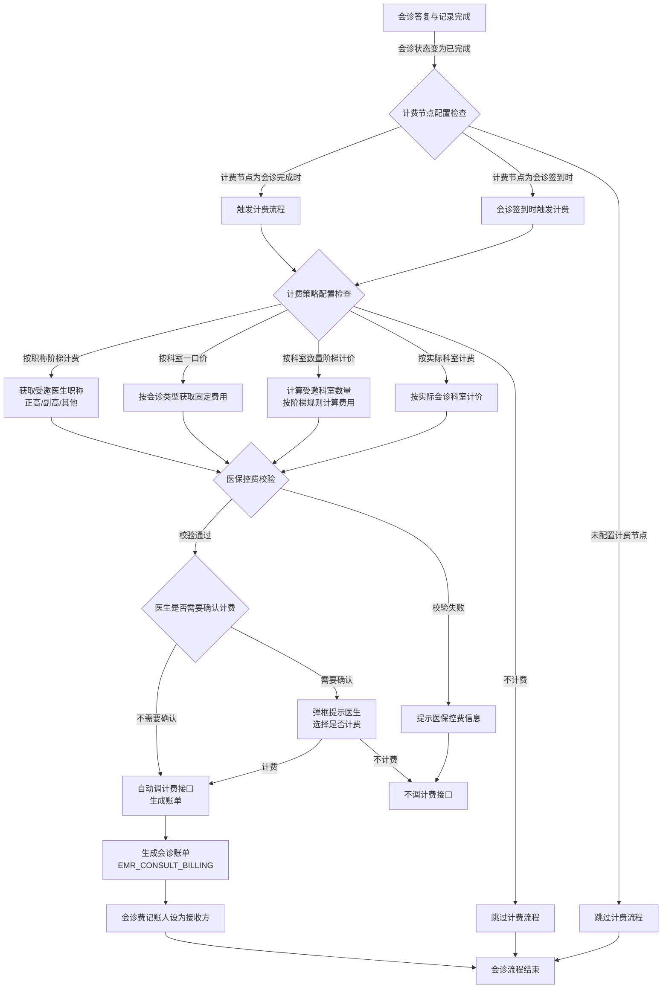
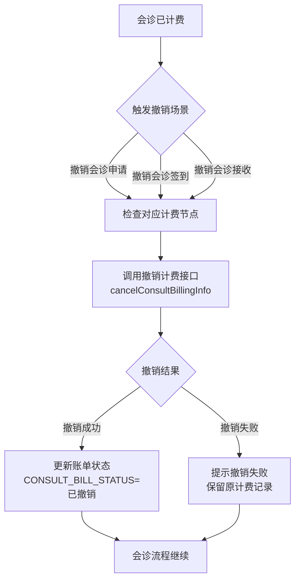

# BLGL-05-HZGL-006 会诊计费_Analyst-Spec

> **需求编号**：BLGL-05-HZGL-006
> **父需求**：BLGL-05-HZGL 会诊管理
> **关联PM Spec**：BLGL-05-HZGL-006_会诊计费_PM-spec.md
> **Spec版本**：V1.0
> **编写时间**：2026-08-21
> **编写人**：RACC

---

## 一、功能编号体系

> 使用带父子层级的 `<功能编号>-ID` 编号，便于追溯和讨论。

### 1.1 功能层级结构

```
BLGL-05-HZGL-006: 会诊计费
  ├─ BLGL-05-HZGL-006-01: 会诊费用计算 — 按职称/类型计算费用
  ├─ BLGL-05-HZGL-006-02: 计费策略配置 — 医生自主选择是否计费
  ├─ BLGL-05-HZGL-006-03: 医保控费校验 — 医保控费信息校验
  └─ BLGL-05-HZGL-006-04: 费用账单生成 — 生成会诊账单
```

> 拆分依据：Phase 1 功能点Spec 第5章中已列出的子功能点。不新增功能清单中不存在的子功能点。

### 1.2 功能编号表

| REQ-ID | 功能名称 | 类型 | 优先级 | 说明 |
|--------|---------|------|--------|------|
| BLGL-05-HZGL-006-01 | 会诊费用计算 | 功能 | P0 | 按受邀医生职称（正高、副高）和会诊类型计算会诊费用 |
| BLGL-05-HZGL-006-02 | 计费策略配置 | 功能 | P0 | 医生自主选择是否计费，计费参数配置（按职称阶梯计费） |
| BLGL-05-HZGL-006-03 | 医保控费校验 | 功能 | P1 | 医保控费信息显示与校验，按职称计费时医保控费信息校验 |
| BLGL-05-HZGL-006-04 | 费用账单生成 | 功能 | P0 | 生成会诊账单，记录计费信息至EMR_CONSULT_BILLING，会诊费记账人应为接收方 |

> 类型：功能 / 子功能。优先级与 PM-Spec 一致。功能编号来自 Phase 1 功能点Spec 第5章，子编号从功能清单展开。

---

## 二、核心业务流程

> 每个主流程一个 Mermaid flowchart。**流程步骤必须能在需求原文中找到对应描述，不推测中间步骤。**

### 2.1 会诊计费全流程（主流程）



### 2.2 会诊计费撤销与异常处理流程



> 至少 2 个 Mermaid 流程图。每个流程对应一个核心业务场景。

---

## 三、功能规格说明

> 每个 REQ-ID 展开详细描述，包含功能概述、用户角色、业务流程、验收标准。

---

### BLGL-05-HZGL-006-01: 会诊费用计算

#### 3.1.1 功能概述

根据会诊类型和受邀医生的职称（正高、副高）计算会诊费用。支持按职称阶梯计费、按会诊类型一口价、按科室数量阶梯计价、按实际会诊科室计费、不计费五种计费模式。院外会诊只支持"按会诊类型一口价"和"会诊不计费"。邀请本科室抗菌药物会诊专家审批时不收取会诊费。会诊计费服务不绑定计费策略，优化提示。计费参数配置支持按职称阶梯计费明细配置（EditeEmrConsultBillingDetailParamDTO含职称编码、职称名称、科室起始数量、科室结束数量等字段）。

#### 3.1.2 用户角色

| 角色 | 使用场景 | 权限要求 | 操作频率 |
|------|---------|---------|---------|
| 申请医生 | 发起会诊时触发的计费计算 | 需具有会诊计费权限 | 中频 |
| 计费操作员 | 查看和确认计费计算结果 | 计费操作权限 | 低频 |
| 系统管理员 | 配置计费规则参数 | 配置权限 | 低频 |

> 角色必须在需求原文中出现过。操作频率从需求分析中归纳。

#### 3.1.3 业务流程（Given/When/Then）

##### 主流程（至少 1 个）

**Scenario 1: 按职称阶梯计费模式成功计算会诊费用**

```gherkin
Given:
  - 系统已配置计费模式为"按人员职称计费"
  - 计费参数明细中已配置：正高职称计费标准为200元，副高职称计费标准为150元
  - 会诊申请已提交，受邀医生职称分别为"主任医师（正高）"和"副主任医师（副高）"
  - 会诊已到达计费节点（如：会诊完成）

When:
  - 系统触发计费计算
  - 系统获取受邀医生列表及其职称信息
  - 系统按职称阶梯计费规则计算费用
  - 正高职称医生计费200元，副高职称医生计费150元

Then:
  - 系统计算得出会诊总费用为350元
  - 计费明细记录每位受邀医生的职称和对应费用
  - 计算结果写入EMR_CONSULT_BILLING表的retailAmount字段
  - 计费状态（consultBillStatus）更新为"已计费"
```

##### 异常流程（至少 3 个）

**Scenario 2: 院外会诊选择不支持的计费模式（业务异常）**

```gherkin
Given:
  - 会诊类型为"院外会诊"
  - 系统已配置院外会诊仅支持"按会诊类型一口价"和"会诊不计费"两种模式
  - 管理员尝试为院外会诊配置"按人员职称计费"模式

When:
  - 管理员在计费配置页面选择院外会诊类型
  - 选择计费模式为"按人员职称计费"
  - 点击保存配置

Then:
  - 系统拒绝保存，提示"院外会诊只支持按会诊类型一口价和会诊不计费"
  - 计费模式选择恢复为之前的值
  - 配置记录未被修改
  - 操作日志记录本次违规配置尝试
```

**Scenario 3: 受邀医生职称信息缺失导致费用计算失败（数据异常）**

```gherkin
Given:
  - 计费模式为"按人员职称计费"
  - 会诊申请中邀请了某位医生
  - 该医生的职称信息在主数据系统中未维护或为空

When:
  - 系统到达计费节点触发费用计算
  - 系统获取受邀医生职称信息时发现职称字段为空

Then:
  - 系统提示"受邀医生职称信息缺失，无法计算会诊费用，请联系主数据维护人员"
  - 计费流程暂停，等待职称信息补充
  - 会诊流程继续但不生成计费记录
  - 系统记录异常日志，包含缺失职称信息的医生ID
```

**Scenario 4: 计费服务接口调用超时（系统异常）**

```gherkin
Given:
  - 系统触发费用计算
  - 计费服务接口调用外部计费系统

When:
  - 计费服务接口请求发送后超过超时阈值（如：30秒）
  - 接口未返回响应

Then:
  - 系统提示"计费服务调用超时，请稍后重试"
  - 费用计算未完成，保留当前状态
  - 系统记录接口超时日志供运维排查
  - 系统支持重试机制，医生可手动触发重新计费
```

##### 边界流程（至少 2 个）

**Scenario 5: 邀请本科室抗菌药物会诊专家审批时不收取会诊费（边界流程）**

```gherkin
Given:
  - 会诊类型为"抗菌药物会诊"
  - 受邀专家与申请医生属于同一科室
  - 系统已配置相应计费规则
  - 会诊到达计费节点

When:
  - 系统触发费用计算
  - 系统检测到会诊类型为抗菌药物会诊，且受邀专家与申请人为同一科室

Then:
  - 系统自动跳过计费流程，不收取会诊费
  - 会诊账单中记录费用为0
  - 计费状态（consultBillStatus）标记为"不计费"
  - 会诊流程继续，无需额外确认
```

**Scenario 6: 急诊科发起会诊时自动生成费用医嘱（边界流程）**

```gherkin
Given:
  - 急诊科医生发起会诊申请
  - 会诊类型为急诊会诊
  - 系统已配置：急诊科发起会诊时自动生成费用医嘱，执行科室设为会诊科室

When:
  - 急诊科医生提交会诊申请
  - 系统自动触发费用医嘱生成逻辑
  - 费用医嘱的执行科室设置为会诊科室

Then:
  - 系统自动生成费用医嘱，无需医生手动操作
  - 费用医嘱的执行科室为会诊科室
  - 会诊计费记录与费用医嘱关联
  - 会诊申请正常提交，流程继续
```

#### 3.1.5 验收标准

| AC编号 | 验收标准 | 对应REQ-ID | 验证方法 | 验证场景 |
|--------|---------|-----------|---------|---------|
| AC-001 | 按职称阶梯计费模式下，系统根据受邀医生职称正确计算费用，正高/副高不同标准 | BLGL-05-HZGL-006-01 | 功能测试 | Scenario 1 |
| AC-002 | 院外会诊配置不支持的计费模式时系统拒绝并给出明确提示 | BLGL-05-HZGL-006-01 | 功能测试 | Scenario 2 |
| AC-003 | 受邀医生职称信息缺失时计费暂停，提示维护主数据 | BLGL-05-HZGL-006-01 | 功能测试 | Scenario 3 |
| AC-004 | 计费服务接口超时时系统给出明确提示，支持重试机制 | BLGL-05-HZGL-006-01 | 功能测试 | Scenario 4 |
| AC-005 | 邀请本科室抗菌药物会诊专家时不收取会诊费 | BLGL-05-HZGL-006-01 | 功能测试 | Scenario 5 |
| AC-006 | 急诊科发起会诊时自动生成费用医嘱，执行科室设为会诊科室 | BLGL-05-HZGL-006-01 | 功能测试 | Scenario 6 |

---

### BLGL-05-HZGL-006-02: 计费策略配置

#### 3.2.1 功能概述

支持医生自主选择是否计费，通过配置"计费需要医生确认"开关控制。开关默认不开启，开启后对应会诊类型在计费节点时弹框提示医生选择"计费"或"不计费"。计费参数配置支持按职称阶梯计费，配置项包括会诊类型代码、计费类型、计费节点、来源、启用状态、院区标识等（来源：代码 EmrConsultBillingParamV2PO）。住院/门诊/急诊会诊可分别配置计费策略。会诊计费服务不绑定计费策略，优化提示。

#### 3.2.2 用户角色

| 角色 | 使用场景 | 权限要求 | 操作频率 |
|------|---------|---------|---------|
| 申请医生 | 计费节点弹框选择是否计费 | 需具有会诊计费权限 | 中频 |
| 系统管理员 | 配置计费策略参数 | 配置权限 | 低频 |

> 角色必须在需求原文中出现过。操作频率从需求分析中归纳。

#### 3.2.3 业务流程（Given/When/Then）

##### 主流程（至少 1 个）

**Scenario 1: 医生开启"计费需要医生确认"开关后成功选择计费**

```gherkin
Given:
  - 系统管理员已配置计费策略，开启"计费需要医生确认"开关
  - 开关默认不开启，本次已手动开启
  - 会诊流程到达计费节点

When:
  - 系统检测到计费需要医生确认开关已开启
  - 系统弹出确认对话框，提示"请选择本次会诊是否计费"
  - 医生点击"计费"按钮

Then:
  - 系统调用计费服务接口进行计费
  - 计费信息写入EMR_CONSULT_BILLING表
  - 会诊流程继续
  - 操作日志记录医生计费确认操作
```

##### 异常流程（至少 3 个）

**Scenario 2: 医生选择"不计费"后跳过计费流程（业务异常/正常分支）**

```gherkin
Given:
  - 计费需要医生确认开关已开启
  - 会诊流程到达计费节点
  - 系统弹出计费确认对话框

When:
  - 医生点击"不计费"按钮
  - 系统不调用计费服务接口

Then:
  - 系统跳过计费流程
  - 会诊账单中记录费用为0或标记为"不计费"
  - 会诊流程继续
  - 操作日志记录医生选择不计费
```

**Scenario 3: 计费参数配置保存失败（数据异常）**

```gherkin
Given:
  - 管理员进入计费策略配置页面
  - 页面展示计费参数配置项：会诊类型代码、计费类型、计费节点、来源、启用状态、院区标识
  - 管理员修改了计费策略配置

When:
  - 管理员点击"保存"按钮
  - 后端校验发现参数数据格式异常或必填项缺失

Then:
  - 系统提示"计费策略保存失败，请检查配置项"
  - 报错字段高亮标记
  - 已修改的配置内容不丢失，保留在界面中
  - 操作日志记录保存失败原因
```

**Scenario 4: 计费策略配置接口异常（系统异常）**

```gherkin
Given:
  - 管理员在计费策略配置页面进行配置修改
  - 后端计费参数服务（EmrConsultBillingParamService）临时不可用

When:
  - 管理员点击保存配置
  - 调用计费参数保存接口失败

Then:
  - 系统提示"配置保存失败，服务暂时不可用，请稍后重试"
  - 已修改的配置内容暂存于前端
  - 系统记录异常日志
  - 管理员可稍后重试保存操作
```

##### 边界流程（至少 2 个）

**Scenario 5: 住院/门诊/急诊会诊分别配置不同计费策略（边界流程）**

```gherkin
Given:
  - 系统支持按会诊来源分别配置计费策略
  - 会诊来源包括：住院、门诊、急诊
  - 管理员需要为不同来源配置不同的计费策略

When:
  - 管理员在计费策略配置页面选择会诊来源为"住院"
  - 配置计费类型为"按人员职称计费"，计费节点为"会诊完成"
  - 切换到"急诊"来源，配置计费类型为"按实际会诊科室计费"，计费节点为"会诊申请发送"
  - 切换到"门诊"来源，配置计费类型为"不计费"

Then:
  - 住院会诊按职称阶梯计费，在会诊完成时触发
  - 急诊会诊按实际科室计费，在申请发送时触发
  - 门诊会诊不计费
  - 三种来源的计费策略独立生效，互不影响
```

**Scenario 6: 多院区配置不同计费规则（边界流程）**

```gherkin
Given:
  - 系统支持多院区部署
  - 计费参数配置中包含院区标识（hospitalAreaId）字段
  - 不同院区需要不同的计费规则

When:
  - 管理员为A院区配置计费模式为"按人员职称计费"，计费节点为"会诊完成"
  - 管理员为B院区配置计费模式为"按会诊类型一口价"，计费节点为"会诊申请发送"

Then:
  - A院区会诊按职称阶梯计费，在会诊完成时触发
  - B院区会诊按一口价计费，在申请发送时触发
  - 两院区计费规则独立配置，互不影响
  - 历史配置数据与当前配置兼容
```

#### 3.2.5 验收标准

| AC编号 | 验收标准 | 对应REQ-ID | 验证方法 | 验证场景 |
|--------|---------|-----------|---------|---------|
| AC-007 | 计费需要医生确认开关开启后，计费节点弹框提示医生选择是否计费 | BLGL-05-HZGL-006-02 | 功能测试 | Scenario 1 |
| AC-008 | 医生选择"不计费"后跳过计费流程，不调用计费接口 | BLGL-05-HZGL-006-02 | 功能测试 | Scenario 2 |
| AC-009 | 计费参数配置保存失败时给出明确提示，保留界面内容 | BLGL-05-HZGL-006-02 | 功能测试 | Scenario 3 |
| AC-010 | 计费策略配置接口异常时暂存内容，支持重试 | BLGL-05-HZGL-006-02 | 功能测试 | Scenario 4 |
| AC-011 | 住院/门诊/急诊会诊可分别配置不同计费策略，独立生效 | BLGL-05-HZGL-006-02 | 功能测试 | Scenario 5 |
| AC-012 | 多院区可配置不同计费规则，互不影响 | BLGL-05-HZGL-006-02 | 功能测试 | Scenario 6 |

---

### BLGL-05-HZGL-006-03: 医保控费校验

#### 3.3.1 功能概述

在会诊计费过程中进行医保控费信息校验，确保会诊费用符合医保控费规则。按职称计费时医保控费信息显示完整，包括控费规则、控费金额、控费结果等。医保控费信息显示给医生，辅助医生判断计费是否合规。会诊计费按职称计费时医保控费信息显示不全的问题需在此子功能中解决。

#### 3.3.2 用户角色

| 角色 | 使用场景 | 权限要求 | 操作频率 |
|------|---------|---------|---------|
| 申请医生 | 计费时查看医保控费信息 | 需具有会诊计费权限 | 中频 |
| 医保管理员 | 配置医保控费规则 | 医保配置权限 | 低频 |

> 角色必须在需求原文中出现过。操作频率从需求分析中归纳。

#### 3.3.3 业务流程（Given/When/Then）

##### 主流程（至少 1 个）

**Scenario 1: 医保控费校验通过，计费正常执行**

```gherkin
Given:
  - 系统已配置医保控费规则
  - 会诊费用计算完成，待进行医保控费校验
  - 患者医保类型为"城镇职工医保"
  - 会诊费用为350元，在医保控费限额范围内

When:
  - 系统触发医保控费校验
  - 系统校验费用金额是否在医保控费限额内
  - 系统校验会诊类型是否在医保控费范围内

Then:
  - 医保控费校验通过
  - 系统显示医保控费信息：控费规则名称、控费金额、控费结果
  - 计费流程继续，进入账单生成环节
  - 医保控费信息记录在计费日志中
```

##### 异常流程（至少 3 个）

**Scenario 2: 医保控费校验失败，费用超出限额（业务异常）**

```gherkin
Given:
  - 医保控费规则中，会诊费用限额为200元
  - 本次会诊按职称阶梯计费计算出的总费用为350元
  - 患者医保类型为"城镇职工医保"

When:
  - 系统触发医保控费校验
  - 系统校验发现会诊费用350元超出医保控费限额200元

Then:
  - 系统提示"医保控费校验失败：会诊费用超出医保控费限额"
  - 系统显示详细信息：控费规则名称、限额金额（200元）、实际费用（350元）、超出金额（150元）
  - 计费流程暂停，等待医生处理
  - 医生可选择"继续计费"（自费部分）或"调整计费"
```

**Scenario 3: 按职称计费时医保控费信息显示不全（数据异常）**

```gherkin
Given:
  - 计费模式为"按人员职称计费"
  - 会诊费用计算完成
  - 系统进行医保控费校验

When:
  - 系统获取医保控费信息
  - 系统按职称维度展示控费信息
  - 控费信息中应包含：控费规则名称、控费金额、控费结果、控费明细（按职称分列）

Then:
  - 医保控费信息完整显示，包含所有字段
  - 按职称分列的控费明细清晰展示（正高、副高各自控费信息）
  - 无信息缺失或截断情况
  - 医生可查看完整的控费信息
```

**Scenario 4: 医保控费系统接口异常（系统异常）**

```gherkin
Given:
  - 系统触发医保控费校验
  - 医保控费系统接口不可用或响应超时

When:
  - 系统调用医保控费校验接口
  - 接口返回异常或超时

Then:
  - 系统提示"医保控费校验服务暂时不可用，请稍后重试"
  - 计费流程暂停，等待医保控费恢复
  - 系统记录医保控费接口异常日志
  - 医生可手动触发重新校验
```

##### 边界流程（至少 2 个）

**Scenario 5: 患者自费类型不进行医保控费校验（边界流程）**

```gherkin
Given:
  - 患者费用类型为"自费"
  - 患者不享受医保待遇

When:
  - 系统到达计费节点
  - 系统检测到患者费用类型为自费

Then:
  - 系统跳过医保控费校验环节
  - 计费流程直接进入账单生成
  - 操作日志记录"患者自费，跳过医保控费校验"
  - 医保控费信息显示为"不适用"
```

**Scenario 6: 医保控费规则变更后对新旧会诊的不同处理（边界流程）**

```gherkin
Given:
  - 医保控费规则于今日进行了变更（如：限额从200元调整为300元）
  - 规则变更前已有一笔会诊计费正在进行（按旧规则限额200元）

When:
  - 新会诊到达计费节点，触发医保控费校验
  - 系统使用新规则（限额300元）进行校验
  - 旧规则下的会诊如果重新触发校验，使用新规则

Then:
  - 新会诊按新规则（限额300元）进行校验
  - 医保控费校验结果按新规则展示
  - 系统记录校验使用的规则版本
  - 规则变更不影响已完成的计费记录
```

#### 3.3.5 验收标准

| AC编号 | 验收标准 | 对应REQ-ID | 验证方法 | 验证场景 |
|--------|---------|-----------|---------|---------|
| AC-013 | 医保控费校验通过时计费正常执行，控费信息完整显示 | BLGL-05-HZGL-006-03 | 功能测试 | Scenario 1 |
| AC-014 | 医保控费校验失败时给出明确提示，显示详细控费信息 | BLGL-05-HZGL-006-03 | 功能测试 | Scenario 2 |
| AC-015 | 按职称计费时医保控费信息完整显示，按职称维度分列 | BLGL-05-HZGL-006-03 | 功能测试 | Scenario 3 |
| AC-016 | 医保控费系统接口异常时给出明确提示，支持重试 | BLGL-05-HZGL-006-03 | 功能测试 | Scenario 4 |
| AC-017 | 自费患者跳过医保控费校验 | BLGL-05-HZGL-006-03 | 功能测试 | Scenario 5 |
| AC-018 | 医保控费规则变更后新会诊按新规则校验 | BLGL-05-HZGL-006-03 | 功能测试 | Scenario 6 |

---

### BLGL-05-HZGL-006-04: 费用账单生成

#### 3.4.1 功能概述

生成会诊费用账单，记录计费信息至EMR_CONSULT_BILLING表（ConsultBillingV2PO），包含会诊账单标识、会诊申请标识、会诊邀请标识、会诊账单状态、会诊金额、临床服务标识、账单标识、账单明细标识集合等字段。会诊费记账人应为接收方（即接收会诊的医生或科室）。会诊医嘱未计费无法查询与预出院校验缺失问题需在此子功能中处理。支持计费撤销操作，撤销后账单状态更新为"已撤销"。

#### 3.4.2 用户角色

| 角色 | 使用场景 | 权限要求 | 操作频率 |
|------|---------|---------|---------|
| 申请医生 | 查看会诊账单信息 | 查看权限 | 中频 |
| 计费操作员 | 管理会诊账单，处理撤销计费 | 计费操作权限 | 低频 |
| 住院医生 | 预出院时查看会诊计费状态 | 查看权限 | 中频 |

> 角色必须在需求原文中出现过。操作频率从需求分析中归纳。

#### 3.4.3 业务流程（Given/When/Then）

##### 主流程（至少 1 个）

**Scenario 1: 会诊费用账单成功生成并关联记账人**

```gherkin
Given:
  - 会诊费用计算完成，医保控费校验通过
  - 计费节点到达（如：会诊完成）
  - 会诊已被接收方医生接收

When:
  - 系统调用计费服务接口（createConsultBillingInfo）
  - 系统生成会诊账单记录
  - 系统将账单记账人设为接收方（接收会诊的医生/科室）
  - 系统更新账单状态为"已计费"

Then:
  - EMR_CONSULT_BILLING表中新增一条账单记录
  - 账单记录包含：会诊申请标识、会诊邀请标识、会诊金额（retailAmount）、账单状态（consultBillStatus）
  - 会诊费记账人为接收方（接收会诊的医生）
  - 账单状态为"已计费"
  - 账单与临床服务标识（csIdSet）关联
```

##### 异常流程（至少 3 个）

**Scenario 2: 会诊医嘱未计费，预出院校验失败（业务异常）**

```gherkin
Given:
  - 住院医生发起预出院操作
  - 患者有未完成的会诊记录
  - 会诊医嘱尚未计费

When:
  - 系统进行预出院校验
  - 系统检测到会诊医嘱未计费

Then:
  - 系统提示"该患者存在未计费的会诊医嘱，请先完成会诊计费"
  - 预出院操作被阻止
  - 系统列出未计费的会诊记录清单
  - 医生需先完成会诊计费或处理会诊记录后，方可继续预出院
```

**Scenario 3: 撤销计费时账单状态更新失败（数据异常）**

```gherkin
Given:
  - 会诊已计费，账单状态为"已计费"
  - 触发撤销计费操作（如：撤销会诊申请、撤销签到等）
  - 系统调用取消计费接口（cancelConsultBillingInfo）

When:
  - 系统尝试更新账单状态为"已撤销"
  - 数据库更新操作异常或事务回滚

Then:
  - 系统提示"撤销计费失败，请稍后重试"
  - 账单状态保持为"已计费"
  - 系统记录异常日志，包含事务回滚信息
  - 操作员可手动重新执行撤销操作
```

**Scenario 4: 账单生成时外部系统接口异常（系统异常）**

```gherkin
Given:
  - 计费服务接口调用成功
  - 账单生成时需与HIS系统交互获取账单明细

When:
  - 系统调用HIS账单接口
  - HIS接口返回异常或超时

Then:
  - 系统提示"账单生成失败，HIS系统接口异常，请稍后重试"
  - 计费信息已记录但账单未完成关联
  - 系统记录异常日志，包含HIS接口返回信息
  - 系统支持重试机制，可手动触发重新生成账单
```

##### 边界流程（至少 2 个）

**Scenario 5: 会诊医嘱未计费时查询列表显示标记（边界流程）**

```gherkin
Given:
  - 患者存在多条会诊记录
  - 其中部分会诊已计费，部分未计费
  - 医生查询会诊列表

When:
  - 医生在会诊查询页面查看所有会诊记录
  - 列表展示中应包含计费状态字段

Then:
  - 会诊列表展示每条记录的计费状态（已计费/未计费/已撤销）
  - 未计费的会诊记录有特殊标记（如颜色标识或文字提示）
  - 医生可筛选未计费的会诊记录
  - 计费状态字段在列表和详情页均可见
```

**Scenario 6: 会诊账单生成后接收方发生变更（边界流程）**

```gherkin
Given:
  - 会诊账单已生成，记账人已设为接收方A
  - 会诊任务被重新指派，接收方变更为B
  - 原有会诊计费记录未撤销

When:
  - 系统检测到接收方变更
  - 系统检查原账单的计费状态

Then:
  - 系统提示"接收方已变更，请确认是否重新计费或撤销原账单"
  - 原账单可手动撤销，重新生成新账单时将记账人设为新接收方B
  - 系统记录接收方变更操作日志
  - 操作员可选择保留原账单或重新计费
```

#### 3.4.5 验收标准

| AC编号 | 验收标准 | 对应REQ-ID | 验证方法 | 验证场景 |
|--------|---------|-----------|---------|---------|
| AC-019 | 会诊账单成功生成，记录完整信息，记账人设为接收方 | BLGL-05-HZGL-006-04 | 功能测试 | Scenario 1 |
| AC-020 | 会诊医嘱未计费时预出院校验失败，系统给出明确提示 | BLGL-05-HZGL-006-04 | 功能测试 | Scenario 2 |
| AC-021 | 撤销计费失败时账单状态保持不变，给出重试提示 | BLGL-05-HZGL-006-04 | 功能测试 | Scenario 3 |
| AC-022 | 账单生成时HIS接口异常给出明确提示，支持重试 | BLGL-05-HZGL-006-04 | 功能测试 | Scenario 4 |
| AC-023 | 会诊列表展示计费状态，未计费有特殊标记，支持筛选 | BLGL-05-HZGL-006-04 | 功能测试 | Scenario 5 |
| AC-024 | 接收方变更后系统提示确认计费处理方式 | BLGL-05-HZGL-006-04 | 功能测试 | Scenario 6 |

---

## 四、排除范围

本需求不包含以下功能项：

1. **会诊申请** - 会诊申请的创建、编辑、提交、撤销，归属于 BLGL-05-HZGL-001 会诊申请
2. **会诊审核** - 会诊申请的审核流程（审核通过/驳回），归属于 BLGL-05-HZGL-002 会诊审核
3. **会诊接收与指派** - 院总/科室管理员接收会诊任务并指派给具体会诊医生，归属于 BLGL-05-HZGL-004 会诊接收与指派
4. **会诊签到** - 会诊医生到场签到确认，归属于 BLGL-05-HZGL-005 会诊签到
5. **会诊答复与记录** - 会诊医生提交会诊意见、诊断、治疗建议，生成会诊记录，归属于 BLGL-05-HZGL-003 会诊答复与记录
6. **会诊统计报表** - 跨会诊全流程的综合统计报表，归属于 BC-HZGL-002 基础能力
7. **计费参数配置的UI界面** - 计费参数配置的管理界面归属于 BC-HZGL-003 基础能力。本功能点仅引用配置结果，不涉及配置界面的UI交互

> 与 PM-Spec 第四章保持一致。对照 Phase 1 功能点Spec 第6章（基线能力），确保不越界。

---

## 五、业务规则清单

| 规则ID | 规则名称 | 规则描述 | 来源 | 优先级 |
|--------|---------|---------|------|--------|
| BR-001 | 计费模式规则 | 支持五种计费类型：按实际会诊科室计费、按会诊类型一口价、按科室数量阶梯计价、按人员职称计费、不计费 | 需求要点 | P0 |
| BR-002 | 按职称阶梯计费规则 | 按医生职称（正高、副高）分类计费，不同职称对应不同计费标准 | 需求要点 | P0 |
| BR-003 | 医生自主选择计费规则 | 医生自主选择是否计费，通过"计费需要医生确认"开关控制，默认不开启 | 需求要点 | P0 |
| BR-004 | 医保控费校验规则 | 医保控费信息显示，计费时进行医保控费校验，按职称计费时医保控费信息完整显示 | 需求要点 | P0 |
| BR-005 | 记账人规则 | 会诊费记账人应为接收方（接收会诊的医生/科室） | 需求要点 | P0 |
| BR-006 | 抗菌药物会诊免费规则 | 邀请本科室抗菌药物会诊专家审批时不收取会诊费 | 需求要点 | P0 |
| BR-007 | 急诊费用医嘱规则 | 急诊科发起会诊时自动生成费用医嘱，执行科室设为会诊科室 | 需求要点 | P0 |
| BR-008 | 计费策略解耦规则 | 会诊计费服务不绑定计费策略，计费策略独立配置，优化提示 | 需求要点 | P1 |
| BR-009 | 未计费查询与预出院校验规则 | 会诊医嘱未计费无法查询与预出院校验缺失，预出院时校验会诊计费状态 | 需求要点 | P1 |
| BR-010 | 计费参数配置规则 | 计费参数配置（按职称阶梯计费），配置项包括会诊类型代码、计费类型、计费节点、来源、启用状态、院区标识 | 需求要点 + 代码 | P0 |
| BR-011 | 院外会诊计费限制规则 | 院外会诊只支持"按会诊类型一口价"和"会诊不计费" | 需求 1531657 | P1 |
| BR-012 | 撤销计费规则 | 支持在对应节点（撤销申请、撤销签到、撤销接收等）进行撤销计费，账单状态更新为"已撤销" | 需求要点 | P1 |
| BR-013 | 计费节点触发规则 | 计费节点可配置为：申请单发送、审核完成、签到、接收、答复、会诊完成 | 功能清单 | P1 |
| BR-014 | 多院区计费规则 | 支持多院区设置不同的计费规则，计费参数含院区标识（hospitalAreaId） | 功能清单 + 代码 | P1 |
| BR-015 | 来源分别配置规则 | 住院/门诊/急诊会诊可分别配置计费策略，独立生效 | 功能清单 | P1 |
| BR-016 | 医保控费接口规则 | 医保控费校验通过后计费继续，校验失败时提示完整控费信息 | 需求要点 | P0 |
| BR-017 | 自费跳过控费规则 | 自费患者跳过医保控费校验 | 需求分析 | P1 |
| BR-018 | 账单生成规则 | 生成会诊账单（EMR_CONSULT_BILLING），包含会诊金额、账单状态、临床服务标识等字段 | 代码 | P0 |
| BR-019 | 接收方变更规则 | 会诊接收方变更后，需确认是否重新计费或撤销原账单 | 需求分析 | P1 |

> 每条 BR 注明来源需求编号。规则描述必须能从需求原文中逐字对应，不得概括后失去原意。优先级与 PM-Spec 保持一致。

---

## 六、关联文档

| 文档类型 | 文档路径 | 说明 |
|---------|---------|------|
| 功能点Spec | 上级目录 BLGL-05-HZGL 05会诊管理功能点Spec.md（V1.0） | Phase 1 功能点索引 |
| PM spec | 本目录 BLGL-05-HZGL-006_会诊计费_PM-spec.md（V0.1） | PM 产出的 Spec 文档 |
| -Spec | 本目录 BLGL-05-HZGL-006_会诊计费-Spec.md（V1.0） | Spec（研发视角） |
| data-model.md | 待产出 | 架构师产出的数据建模文档 |
| design.md | 待产出 | 架构师产出的技术方案文档 |
| api-contract.md | 待产出 | 开发经理产出的 API 契约文档 |

> 第1行必须引用 Phase 1 功能点Spec。

---

## 七、待确认问题清单

| 编号 | 问题描述 | 缺失信息 | 影响范围 | 建议补充方 |
|------|---------|---------|---------|-----------|
| Q-001 | 按职称阶梯计费的具体金额标准是什么？正高、副高及各职称的计费标准金额有无统一定价 | 各职称计费金额标准 | 3.1.3 Scenario 1, BR-002 | 产品经理 |
| Q-002 | 医保控费校验的具体规则和接口交互方式是什么？是否与HIS医保系统对接，接口契约未明确 | 医保控费接口详细契约 | 3.3.3 Scenario 1-4, BR-004 | 架构师/接口负责人 |
| Q-003 | 会诊记账人设为接收方的具体逻辑：接收方变更时，账单记账人是否自动更新，还是需要手动操作 | 记账人变更处理逻辑 | 3.4.3 Scenario 6, BR-005 | 产品经理 |
| Q-004 | 急诊科发起会诊时自动生成费用医嘱的具体规则：费用医嘱的计费标准、生成时机（提交时或创建时）、医嘱类型的模板配置 | 费用医嘱生成的详细业务规则 | 3.1.3 Scenario 6, BR-007 | 产品经理 |
| Q-005 | 会诊医嘱未计费时预出院校验的具体拦截规则：是否所有未计费会诊都拦截，还是仅拦截特定类型的会诊 | 预出院校验的详细规则 | 3.4.3 Scenario 2, BR-009 | 产品经理 |
| Q-006 | 会诊计费服务不绑定计费策略的优化提示具体指什么内容？是UI提示还是后端日志提示 | 优化提示的详细内容 | BR-008 | 产品经理 |
| Q-007 | 按科室数量阶梯计价的阶梯规则是什么？不同科室数量区间对应的费用标准未明确 | 阶梯计价规则的具体算法 | BR-001 | 产品经理 |
| Q-008 | 计费撤销的逆向流程是否完整：撤销后已生成的费用医嘱是否需要同步撤销，与HIS的交互如何处理 | 撤销计费的逆向流程 | 3.4.3 Scenario 3, BR-012 | 产品经理/架构师 |
| Q-009 | 会诊计费操作的性能指标要求是什么？计费服务接口响应时间是否有SLA要求 | 性能指标量化要求 | 全功能点 | 需求分析师 |
| Q-010 | 会诊医嘱未计费无法查询的具体表现是什么？是查询不到该会诊记录，还是查询到但无法操作 | 未计费查询受限的具体表现 | BR-009 | 产品经理 |

> 逐条列出全文所有 `⏳ 待确认` 项。

---

## 填写检查清单

| 序号 | 检查项 | 是否完成 |
|:----:|--------|:--------:|
| 1 | 功能编号带父子层级 | ✅ |
| 2 | 每个 REQ-ID 有功能概述和用户角色 | ✅ |
| 3 | 主流程至少 1 个 Given/When/Then 场景 | ✅ |
| 4 | 异常流程至少 3 个 Given/When/Then 场景 | ✅ |
| 5 | 边界流程至少 2 个 Given/When/Then 场景 | ✅ |
| 6 | 每个 Given/When/Then 内容具体，不模糊 | ✅ |
| 7 | 验收标准 AC 编号独立，可验证 | ✅ |
| 8 | 每个子功能点含验收标准 | ✅ |
| 9 | 验收标准无"功能正常"等模糊表述 | ✅ |
| 10 | 排除范围明确列出 | ✅ |
| 11 | 业务规则清单列出所有规则，每条标注来源 | ✅ |
| 12 | 流程图使用 Mermaid 格式（≥2 个） | ✅ |
| 13 | 关联文档索引包含 Phase 1 功能点Spec | ✅ |
| 14 | 待确认问题清单汇总了全文所有 ⏳ 项 | ✅ |
| 15 | 全文无占位符 `< >` 残留 | ✅ |
| 16 | 全文陈述可溯源至资料区（S1~S10 溯源核查） | ✅ |
| 17 | 人工审核确认完成 | ⏳ 待确认 |

---

**文档状态**：⬜ 待审核
**维护责任**：需求分析师规范组
**下次更新**：根据评审反馈优化

---

## 版本历史

| 版本 | 日期 | 变更说明 | 编写人 |
|------|------|---------|--------|
| V1.0 | 2026-08-21 | 初始版本 | RACC |