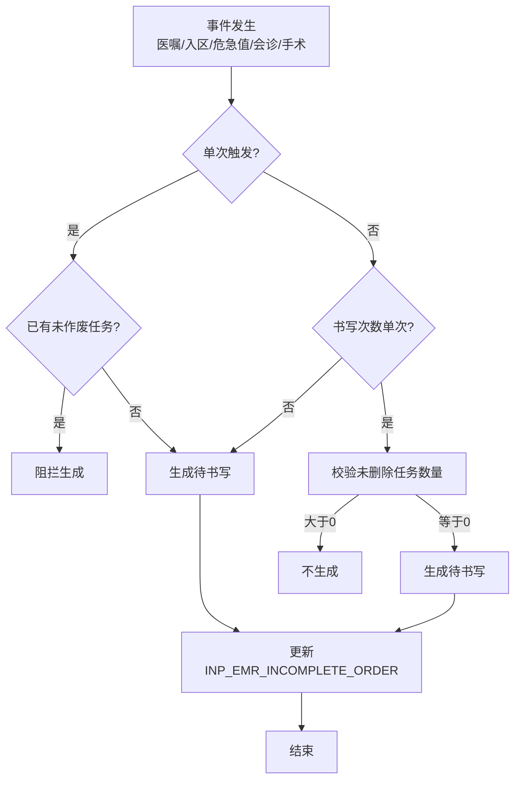
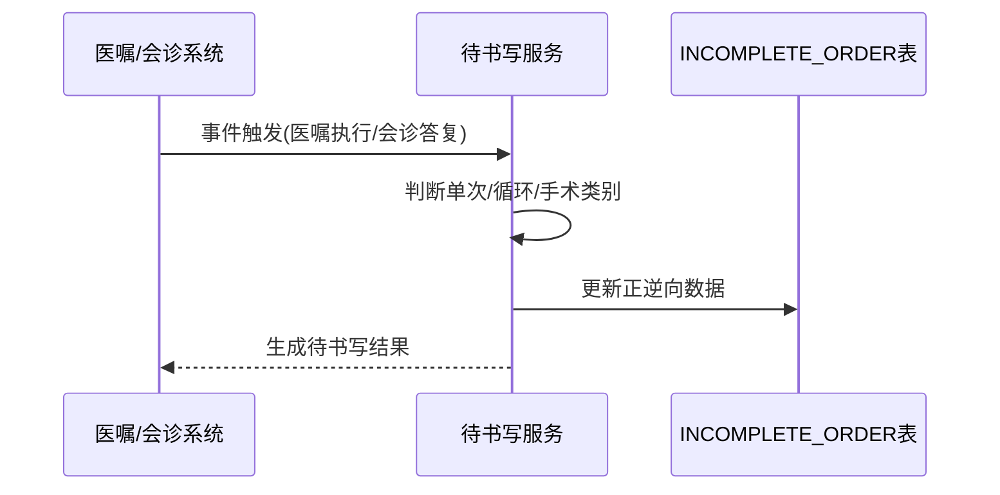

# BLGL-06-DSXTX-001 待书写任务生成 - Spec

> **功能编号**：BLGL-06-DSXTX-001
> **文档类型**：Spec（研发视角）
> **文档版本**：V1.0
> **编写时间**：2026-08-14
> **编写人**：RACC

---

## 文档索引

#### 章节索引

**Spec（研发视角）**

| 章节号 | 章节名称 | 内容说明 |
|--------|---------|---------|
| 1、 | 文档概述 | 文档目的、文档范围、术语定义、阅读指南、参考文档 |
| 2、 | 功能背景与定位 | 功能背景、功能定位、目标用户、核心价值 |
| 3、 | 业务流程设计 | 主流程/异常流程/边界流程（Given/When/Then） |
| 4、 | 数据模型设计 | 核心数据结构、状态定义、系统参数定义 |
| 5、 | 接口契约设计 | API列表、接口详细设计、错误码定义 |
| 6、 | 技术方案设计 | 页面路径、技术栈、关键技术点、部署方案 |
| 7、 | 测试用例预设计 | 功能/边界/异常/性能测试用例 |
| 8、 | 非功能性要求 | 性能、安全、可用性、兼容性 |
| 9、 | 依赖与风险 | 外部依赖、风险项 |
| 10、 | 附录 | 流程图、时序图、参考文档 |

**PM-Spec（业务视角）**

| 章节号 | 章节名称 | 内容说明 |
|--------|---------|---------|
| 一 | 目标 | 功能定位与核心价值 |
| 二 | 约束 | 业务/技术/非功能性约束 |
| 三 | 验收标准 | 验收条件与验证方法 |
| 四 | 排除范围 | 本次不做项与明确边界 |
| 五 | 关键决策记录 | 方案决策与选型理由 |
| 六 | 优先级 | 优先级定义 |
| 七 | 关联文档 | 关联文档索引 |
| 附录 | 填写检查清单 | 质量检查 |

**Analyst-Spec（产品视角）**

| 章节号 | 章节名称 | 内容说明 |
|--------|---------|---------|
| 一 | 功能编号体系 | 功能编号与层级结构 |
| 二 | 核心业务流程 | 核心业务流程与时序 |
| 三 | 功能规格说明 | 详细功能规格与验收标准 |
| 四 | 排除范围 | 排除范围 |
| 五 | 业务规则清单 | 业务规则清单 |
| 六 | 关联文档 | 关联文档索引 |
| 七 | 待确认问题清单 | 待确认问题汇总 |
| - | 填写检查清单 | 质量检查 |

#### 版本历史

| 版本 | 日期 | 变更说明 | 编写人 |
|------|------|---------|--------|
| V1.0 | 2026-08-14 | 初始版本 | RACC |

#### 关联文档索引

| 序号 | 文档名称 | 文档类型 | 版本 | 位置 |
|------|---------|---------|------|------|
| 1 | BLGL-06-DSXTX-001_待书写任务生成_PM-spec.md | PM-Spec（业务视角） | V0.1 | 本目录 |
| 2 | BLGL-06-DSXTX-001_待书写任务生成_Analyst-spec.md | Analyst-Spec（产品视角） | V1.0 | 本目录 |
| 3 | BLGL-06-DSXTX-001_待书写任务生成-Spec.md | Spec（研发视角） | V1.0 | 本目录 |
| 4 | BLGL-06-DSXTX 06待书写提醒功能点Spec.md | 功能点Spec（模块级） | V1.0 | 上级目录 |

---

## 1、文档概述

### 1.1、文档目的

本文档旨在明确"待书写任务生成"功能（BLGL-06-DSXTX-001）的业务背景与设计方案，为需求分析、研发实现、测试验收及评审提供统一的业务上下文、设计口径与决策依据。

### 1.2、文档范围

#### 1.2.1 纳入范围

本文档覆盖待书写任务生成的完整业务背景与设计，包括：

- 事件触发（医嘱、入区扫腕带、危急值、会诊答复、手术）生成待书写文书任务
- 循环规则/替代组/单次触发生成逻辑
- 手术类别判断文书类型、医嘱属性判断条件
- 医嘱与病历关联关系（正向/逆向）
- 24小时出入院、新生儿等特殊场景抑制

#### 1.2.2 排除范围

本文档不涉及以下内容（详见其他功能点或模块）：

- 时限质控与超时计算—— BLGL-06-DSXTX-003
- 任务中心与提醒展示—— BLGL-06-DSXTX-002
- 待书写任务处理与状态—— BLGL-06-DSXTX-004
- 时限规则配置与参数—— BLGL-06-DSXTX-005

### 1.3、术语定义

| 术语 | 定义 |
|------|------|
| 待书写任务 | 根据时限规则生成的待书写文书任务 |
| 事件触发 | 医嘱/入区/危急值/会诊/手术等事件触发规则 |
| 循环规则 | 周期内重复生成待书写任务（如连续3天病程） |
| 替代组 | 监控类型与可替代项的替代关系 |
| 单次触发 | 入区/出区/死亡条件规则每次就诊只触发一次 |

> ⏳ 待确认：规范术语表待产品文档确认。

### 1.4、阅读指南

- **章节关系**：第1~2章为业务全貌，第3~10章为设计实现层。与 Analyst-Spec、PM-Spec 互相引用保持一致。
- **读者对象**：产品经理/需求分析师读第1~2章；研发读第3~6、9~10章；测试读第3、7~8章；评审人员核对各层一致性。

### 1.5、参考文档

| 序号 | 文档名称 | 版本/日期 |
|------|---------|----------|
| 1 | 【历史需求】住院病历的历史需求.xlsx | - |
| 2 | BLGL-06-DSXTX-001_待书写任务生成_PM-spec.md | V0.1 |
| 3 | BLGL-06-DSXTX-001_待书写任务生成_Analyst-spec.md | V1.0 |
| 4 | BLGL-06-DSXTX 06待书写提醒功能点Spec.md | V1.0 |

---

## 2、功能背景与定位

### 2.1 功能背景

待书写任务生成是待书写提醒的任务引擎，需满足：

- **管理要求**：根据时限质控规则在事件触发时生成待书写文书任务，驱动医生按时书写
- **现状痛点**：
  - 循环规则多次触发无法生成多条待书写
  - xxjob跑批数据量大报错，循环任务未生成
  - 患者多次入区导致待书写生成多条
  - 手术类别/医嘱属性判断不准确
- **历史需求演进**：从单一事件触发 → 循环/替代组/单次触发逻辑完善→ 手术类别/医嘱属性增强→ 医嘱病历关联→ 生成判断优化

### 2.2 功能定位

"待书写任务生成"是 WiNEX 病历管理-待书写提醒模块的任务引擎，定位为：

- **任务驱动引擎**：事件触发生成待书写文书任务
- **规则智能化**：循环/替代组/单次/手术类别/医嘱属性多维判断
- **数据关联**：医嘱与病历绑定关系，支撑正逆向流程

### 2.3 目标用户

| 用户角色 | 主要使用场景 |
|---------|-------------|
| 住院医生 | 接收待书写任务，按时书写 |
| 系统（事件监听） | 医嘱/入区/危急值/会诊/手术事件触发 |

### 2.4 核心价值

| 价值维度 | 价值描述 |
|---------|---------|
| 规则准确 | 循环/替代组/单次触发逻辑，避免重复或遗漏 |
| 文书匹配 | 按手术类别/医嘱属性判断文书类型 |
| 数据关联 | 医嘱病历绑定支撑正逆向流程 |

---

## 3、业务流程设计（Given/When/Then）

### 3.1 主流程

**Scenario 1: 事件触发生成待书写**

```gherkin
Given:
  - 时限规则已配置（触发条件+监控类型）
  - 事件源（医嘱/入区/危急值/会诊/手术）发生

When:
  - 事件触发时限规则

Then:
  - 生成待书写文书任务
  - 记录事件标识（医嘱/会诊单/危急值）
  - 数据同步到 INP_EMR_INCOMPLETE_ORDER
```

### 3.2 异常流程

**Scenario 2: 业务异常——多次触发无法生成多条**

```gherkin
Given:
  - 规则配置的监控类型书写次数不是单次

When:
  - 多次触发（医嘱/危急值/会诊）

Then:
  - 只要有未完成的待书写也生成不了多条（原逻辑问题）
  - 应修改：非单次书写监控类型直接生成待书写
```

**Scenario 3: 数据异常——循环跑批报错**

```gherkin
Given:
  - 配置入区后连续3天生成日常病程规则
  - 数据量太大

When:
  - xxjob任务跑批

Then:
  - 只有第一天生成了日常病程，后面两天没有生成（接口报错）
  - 应有限/无限循环生成任务，患者分批处理
```

**Scenario 4: 系统异常——多次入区重复生成**

```gherkin
Given:
  - 患者多次入区

When:
  - 入区事件触发

Then:
  - 待书写生成多条（原逻辑问题）
  - 应限制：入区/出区/死亡条件规则每次就诊只触发一次
```

### 3.3 边界流程

**Scenario 5: 边界场景——手术类别判断**

```gherkin
Given:
  - 规则配置了手术类别（如急诊手术不生成术前讨论）

When:
  - 手术医嘱触发

Then:
  - 主手术的手术类别 surgeryTypeCode 符合配置时触发待书写
  - 急诊手术不生成术前病历讨论记录书写任务
```

**Scenario 6: 边界场景——替代组逻辑**

```gherkin
Given:
  - 监控类型A可替代项为B

When:
  - 写了B病历

Then:
  - 查找已生成的监控类型A的任务中生成日期当天/之前的，更新书写状态
  - 循环周期内监控类型+可替代项存在病历时，监控类型任务不生成
```

---

## 4、数据模型设计

> 数据模型信息来自代码扫描（`E:\39EMR\sr-next`）和历史。标注 `` 的表名/字段来自 PO 实体，标注 `` 的来自需求文本。

### 4.1 核心数据结构

#### 4.1.1 核心表/实体

| 表/实体 | 关键字段 | 说明 |
|---------|---------|------|
| INPATIENT_EMR_INCOMPLETE（InpatientEmrIncompletePO） | INP_EMR_INCOMPLETE_ID、INP_EMR_CLASS_ID、EMPLOYEE_ID、ENCOUNTER_ID、IS_DEL | 待书写文书主表 |
| INP_EMR_INCOMPLETE_ORDER（InpatientEmrIncompleteOrderPO） | 患者就诊标识、事件标识 | 待书写医嘱关联表，正逆向流程更新 |
| INPATIENT_EMR_INCOMPLETE_ALL | - | 待书写全量视图 |
| 医嘱病历绑定模型 | 患者就诊标识/住院病历标识/医嘱标识 | 文书与医嘱绑定关系 |

> ⏳ 待确认：医嘱病历绑定模型是否复用 INP_EMR_SET_CLINICAL_ORDER_ID 待确认。

### 4.2 状态定义

| 状态码 | 状态名称 | 说明 |
|--------|---------|------|
| 未删除 | 有效 | 待书写任务有效 |
| 已书写 | 已书写 | 有对应病历 |
| 未书写 | 未书写 | 无对应病历 |

### 4.3 系统参数定义

| 参数编码 | 参数名称 | 说明 |
|---------|---------|------|
| 需要按照登录科室过滤的待书写监控类型 | 科室过滤监控类型 | 默认{转出记录，转入记录} |
| 每次就诊只需要生成一条待书写任务的病历监控类型 | 单条任务监控类型 | 多选 |
| 是否启用新建病历手动关联待书写的功能 | 手动关联开关 | 默认否 |

---

## 5、接口契约设计

> 接口信息来自代码扫描（`E:\39EMR\sr-next`）的 InpEmrInCompleteDocController。标注 ``。

### 5.1 API列表

| 序号 | API名称（代码函数） | 路径 | 方法 | 说明 |
|:----:|---------|------|:----:|------|
| 1 | updateEmrSetIncomplete | /api/v1/app_record_inpatient/emr_inpatient/incomplete_doc/update | POST | 更新待书写任务（生成/完成） |
| 2 | delInpatientEmrIncompleteDoc | /api/v1/app_record_inpatient/emr_inpatient/incomplete_doc/cmd_del/by_id | POST | 更新待书写任务接口-指令处理 |
| 3 | updateEmrCompleteDoc | /api/v1/app_record_inpatient/emr_inpatient/incomplete_doc/complete | POST | 更改未完成文书状态 |
| 4 | updateEmrSetIncompleteReduce | /api/v1/app_record_inpatient/emr_inpatient/incomplete_doc/reduce | POST | 更新待书写任务（恢复） |
| 5 | queryInpEmrMonitorInRuleWithIncomplete | /api/v1/app_record_inpatient/emr_inpatient/monitor_in_rule_with_incomplete/query | POST | 查询监控规则与待书写 |

> 前端实际请求前缀：`/inpatient-clinicalnote/api/v1/app_record_inpatient/`。

### 5.2 接口详细设计

#### 5.2.1 更新待书写任务（updateEmrSetIncomplete）

**请求参数（InpEmrSetCheckIncompleteInputAO）**:
```json
{
  "encounterId": 1001,
  "inpEmrClassId": 2001,
  "eventId": "EVT123",
  "status": "generated"
}
```

**返回值（成功）**:
```json
{
  "success": true,
  "data": null
}
```

**返回值（失败）**:
```json
{
  "success": false,
  "message": "生成失败",
  "data": null
}
```

> ⏳ 待确认：具体字段名/结构以接口契约文档为准。

### 5.3 错误码定义

| 错误码 | 错误信息 | 处理方式 |
|--------|---------|---------|
| ⏳ 待确认 | xxjob跑批报错 | 患者分批处理 |

> ⏳ 待确认：业务错误码定义未在代码扫描中提取完整。

---

## 6、技术方案设计

### 6.1 页面路径

- **页面路径**: 住院医生站→任务中心/文书总览；定义态→时限规则配置
- **后端接口**: InpEmrInCompleteDocController（tags: 住院病历待书写）
- **定时任务**: xxjob（循环跑批生成待书写）

### 6.2 技术栈

| 类别 | 技术 | 版本 |
|------|------|------|
| 前端框架 | Vue | 2.6.14 |
| 前端UI | element-ui | 2.13.0 |
| 后端框架 | Spring Boot（Java） | java.version 17 |
| 构建工具 | webpack / Maven | 前端 webpack + 后端 Maven |

### 6.3 关键技术点

- 生成判断：非单次书写监控类型直接生成待书写
- 循环跑批：有限/无限循环生成，患者分批处理，一种监控类型每天只生成一条
- 单次触发：入区/出区/死亡条件规则每次就诊只触发一次，存在未作废任务直接阻拦
- 手术类别：按主手术 surgeryTypeCode 判断文书类型
- 医嘱属性：判断条件增加医嘱属性（术前/术中/术后）
- 医嘱病历关联：正向（触发生成）/逆向（作废删除）更新 INP_EMR_INCOMPLETE_ORDER

### 6.4 部署方案

⏳ 待确认：部署方案未在资料区中找到。

---

## 7、测试用例预设计

### 7.1 功能测试

| 用例编号 | 测试场景 | Given | When | Then |
|---------|---------|-------|------|------|
| TC-001 | 医嘱事件触发生成 | 医嘱事件发生 | 触发规则 | 生成待书写 |
| TC-002 | 循环规则生成 | 配置连续3天病程 | 循环跑批 | 每天生成一条 |

### 7.2 边界测试

| 用例编号 | 测试场景 | Given | When | Then |
|---------|---------|-------|------|------|
| TC-003 | 手术类别判断 | 急诊手术 | 触发 | 不生成术前讨论 |
| TC-004 | 替代组逻辑 | 写了B病历 | 更新A任务 | 生成日期当天/之前更新 |

### 7.3 异常测试

| 用例编号 | 测试场景 | Given | When | Then |
|---------|---------|-------|------|------|
| TC-005 | 多次触发多条 | 非单次监控类型 | 多次触发 | 生成多条待书写 |
| TC-006 | 多次入区重复 | 患者多次入区 | 入区事件 | 单次触发限制 |

### 7.4 性能测试

| 用例编号 | 测试场景 | 指标 |
|---------|---------|------|
| TC-007 | 循环跑批性能 | ⏳ 待确认：性能指标未在资料区中找到 |

---

## 8、非功能性要求

### 8.1 性能要求

| 指标 | 要求 |
|------|------|
| 循环跑批性能 | ⏳ 待确认 |

### 8.2 安全要求

| 要求 | 说明 |
|------|------|
| 科室过滤 | 按参数配置科室过滤待书写 |

**医疗行业特殊要求**

| 要求 | 说明 |
|------|------|
| 患者安全 | 事件触发生成待书写保障及时书写 |

### 8.3 可用性要求

| 指标 | 要求值 |
|------|--------|
| 可用性 | ⏳ 待确认 |

### 8.4 兼容性要求

| 类型 | 要求 |
|------|------|
| 事件兼容 | 医嘱/入区/危急值/会诊/手术多种事件源 |

---

## 9、依赖与风险

### 9.1 外部依赖

| 依赖项 | 说明 |
|--------|------|
| 医嘱系统 | 医嘱事件/属性 |
| 会诊系统 | 会诊答复事件 |
| 危急值系统 | 危急值事件 |
| xxjob | 循环跑批 |

### 9.2 风险项

| 风险项 | 等级 | 说明 | 应对方案 |
|--------|------|------|---------|
| 跑批数据量大 | 高 | xxjob接口报错 | 患者分批处理 |
| 重复生成 | 中 | 多次入区/多次触发重复 | 单次触发/非单次逻辑 |
| 关联数据一致性 | 中 | 医嘱病历绑定正逆向 | 触发生成/作废删除同步 |

---

## 10、附录

### 10.1 流程图



### 10.2 时序图



### 10.3 参考文档

- 【历史需求】住院病历的历史需求.xlsx（、270311、236056、343867、332922、253722、242577、268046、371175、371176、372359 等）
- BLGL-06-DSXTX 06待书写提醒功能点Spec.md（V1.0，第5章 -001 行）
- 关联Spec: BLGL-06-DSXTX-003（超时计算）、-005（时限规则配置）

---

## 填写检查清单

| 序号 | 检查项 | 是否完成 |
|:----:|--------|:--------:|
| 1 | 章节索引与正文章节一致 | ✅ |
| 2 | 版本历史记录完整 | ✅ |
| 3 | 关联文档索引已登记全部Spec | ✅ |
| 4 | 文档目的明确回答"为什么做/做成什么/怎么做" | ✅ |
| 5 | 纳入范围/排除范围清晰 | ✅ |
| 6 | 术语定义覆盖关键概念，从资料区可溯源 | ✅ |
| 7 | 参考文档已登记 | ✅ |
| 8 | 功能背景基于法规/规范/需求来源组织 | ✅ |
| 9 | 功能定位体现业务价值（3~5个定位点） | ✅ |
| 10 | 目标用户角色覆盖完整，在需求原文中有出处 | ✅ |
| 11 | 核心价值可陈述，与 Phase 1 口径一致 | ✅ |
| 12 | 业务流程：主流程≥1、异常≥3、边界≥2，Given/When/Then 具体 | ✅ |
| 13 | 数据模型：字段/表/状态/参数可溯源 | ✅ |
| 14 | 接口契约：API列表+详细设计+错误码齐全或标记待确认 | ✅ |
| 15 | 技术方案：页面路径/技术栈/关键点/部署方案或标记待确认 | ✅ |
| 16 | 测试用例：功能/边界/异常/性能覆盖 | ✅ |
| 17 | 非功能性要求：性能/安全/可用性/兼容性指标可量化或标记待确认 | ✅ |
| 18 | 依赖与风险：外部依赖登记完整 | ✅ |
| 19 | 附录：流程图/时序图与正文流程一致 | ✅ |
| 20 | 全文无占位符 `< >` 残留 | ✅ |
| 21 | 全文陈述可溯源至资料区 | ✅ |
| 22 | 人工审核确认完成 | ⏳ 待确认 |

---

**文档状态**：⬜ 待审核
**维护责任**：RACC
**下次更新**：根据评审反馈优化
