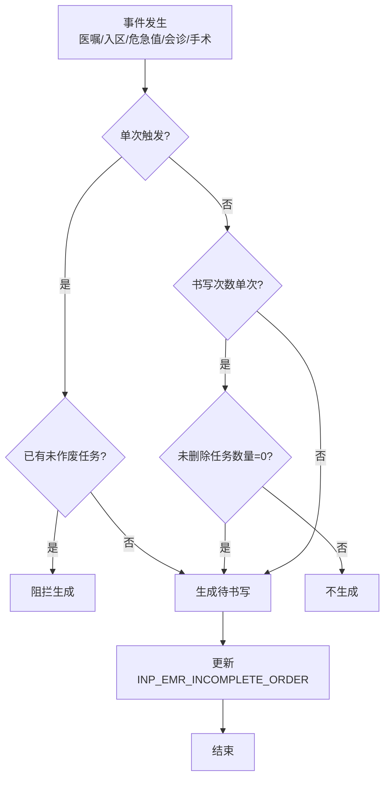
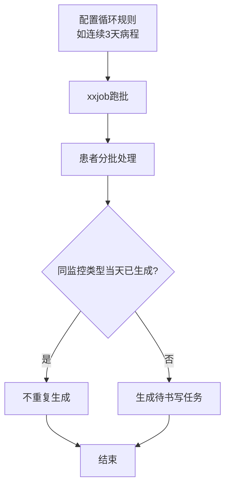

# BLGL-06-DSXTX-001待书写任务生成_ Analyst - Spec

> **需求编号**：BLGL-06-DSXTX-001
> **父需求**：BLGL-06-DSXTX
> **关联PM Spec**：BLGL-06-DSXTX-001_待书写任务生成_PM-spec.md
> **Spec版本**：V1.0
> **编写时间**：2026-08-14
> **编写人**：需求分析师

---

## 一、功能编号体系

### 1.1 功能层级结构

```
BLGL-06-DSXTX-001: 待书写任务生成
  ├─ BLGL-06-DSXTX-001-01: 事件触发生成
  │   ├─ -01-01: 医嘱事件触发生成
  │   ├─ -01-02: 入区/出区/死亡触发生成
  │   ├─ -01-03: 危急值/会诊/手术触发生成
  │   └─ -01-04: 事件标识记录（医嘱/会诊单/危急值）
  ├─ BLGL-06-DSXTX-001-02: 生成逻辑控制
  │   ├─ -02-01: 单次触发限制
  │   ├─ -02-02: 循环规则生成
  │   ├─ -02-03: 替代组逻辑
  │   └─ -02-04: 手术类别/医嘱属性判断
  └─ BLGL-06-DSXTX-001-03: 医嘱病历关联
      ├─ -03-01: 正向流程（触发生成更新关联）
      └─ -03-02: 逆向流程（作废删除关联）
```

### 1.2 功能编号表

| REQ-ID | 功能名称 | 类型 | 优先级 | 说明 |
|--------|---------|------|--------|------|
| BLGL-06-DSXTX-001-01 | 事件触发生成 | 功能 | P0 | 事件触发生成待书写 |
| BLGL-06-DSXTX-001-01-01 | 医嘱事件触发生成 | 子功能 | P0 | 医嘱执行/属性触发 |
| BLGL-06-DSXTX-001-01-02 | 入区/出区/死亡触发生成 | 子功能 | P0 | 起始条件触发 |
| BLGL-06-DSXTX-001-01-03 | 危急值/会诊/手术触发 | 子功能 | P0 | 事件监听触发 |
| BLGL-06-DSXTX-001-01-04 | 事件标识记录 | 子功能 | P0 | 医嘱/会诊单/危急值标识 |
| BLGL-06-DSXTX-001-02 | 生成逻辑控制 | 功能 | P0 | 单次/循环/替代组判断 |
| BLGL-06-DSXTX-001-02-01 | 单次触发限制 | 子功能 | P0 | 入区/出区/死亡单次 |
| BLGL-06-DSXTX-001-02-02 | 循环规则生成 | 子功能 | P0 | 每天一条同监控类型 |
| BLGL-06-DSXTX-001-02-03 | 替代组逻辑 | 子功能 | P1 | 可替代项更新状态 |
| BLGL-06-DSXTX-001-02-04 | 手术类别/医嘱属性 | 子功能 | P1 | 判断文书类型 |
| BLGL-06-DSXTX-001-03 | 医嘱病历关联 | 功能 | P1 | 正逆向更新 |
| BLGL-06-DSXTX-001-03-01 | 正向流程 | 子功能 | P1 | 触发生成更新INCOMPLETE_ORDER |
| BLGL-06-DSXTX-001-03-02 | 逆向流程 | 子功能 | P1 | 作废删除关联 |

---

## 二、核心业务流程

### 2.1 事件触发生成流程



### 2.2 循环规则生成流程



---

## 三、功能规格说明

---

### BLGL-06-DSXTX-001-01: 事件触发生成

#### 3.1.1 功能概述

事件（医嘱/入区/危急值/会诊/手术）触发时限规则生成待书写文书任务，记录事件标识（医嘱/会诊单/危急值），数据同步到 INP_EMR_INCOMPLETE_ORDER。

#### 3.1.2 用户角色

| 角色 | 使用场景 | 权限要求 | 操作频率 |
|------|---------|---------|---------|
| 住院医生 | 接收待书写任务 | 病历编辑权限 | 高频 |
| 系统（事件监听） | 事件触发规则 | 系统权限 | 高频 |

#### 3.1.3 业务流程（Given/When/Then）

##### 主流程

**Scenario 1: 医嘱事件触发生成**

```gherkin
Given:
  - 时限规则已配置（医嘱事件+监控类型）
  - 医嘱事件发生（医嘱执行/医嘱属性匹配）

When:
  - 医嘱签收后触发时限规则

Then:
  - 生成待书写文书任务
  - 记录医嘱标识
  - 数据同步到 INP_EMR_INCOMPLETE_ORDER
```

##### 异常流程

**Scenario 2: 业务异常——危急值事件**

```gherkin
Given:
  - 危急值产生

When:
  - 危急值事件触发

Then:
  - 生成危急值病程待书写
  - 记录危急值报告ID
  - ⏳ 待确认：危急值报告ID关联
```

**Scenario 3: 系统异常——会诊撤销**

```gherkin
Given:
  - 会诊答复已生成会诊病程待书写

When:
  - 会诊撤销申请

Then:
  - 根据会诊标识删除对应的待书写文书
```

##### 边界流程

**Scenario 4: 边界场景——会诊病程显示**

```gherkin
Given:
  - 监控类型为会诊病程录

When:
  - 会诊意见答复触发待书写

Then:
  - 待书写提醒显示"会诊病程录（10-26 呼吸内科）"
  - 描述字段记录申请时间+受邀科室
```

**Scenario 5: 边界场景——医嘱属性判断**

```gherkin
Given:
  - 医嘱事件配置了医嘱属性（术前/术中/术后）

When:
  - 医嘱开立时选择属性

Then:
  - 医嘱签收后按医嘱属性判断是否触发待书写
```

#### 3.1.4 数据字段定义

> 字段名来自代码扫描（`E:\39EMR\sr-next`，标注 ``）和历史。

#### 3.1.5 验收标准

| AC编号 | 验收标准 | 对应REQ-ID | 验证方法 | 验证场景 |
|--------|---------|-----------|---------|---------|
| AC-001 | 医嘱事件触发后生成对应待书写任务 | -001-01 | 集成测试 | Scenario 1 |
| AC-002 | 会诊撤销时删除对应待书写 | -001-01 | 集成测试 | Scenario 3 |
| AC-003 | 会诊病程待书写显示描述（申请时间+受邀科室） | -001-01 | 功能测试 | Scenario 4 |

---

### BLGL-06-DSXTX-001-02: 生成逻辑控制

#### 3.2.1 功能概述

单次触发限制（入区/出区/死亡每次就诊只触发一次）、循环规则生成（每天一条同监控类型）、替代组逻辑、手术类别/医嘱属性判断文书类型。

#### 3.2.2 用户角色

| 角色 | 使用场景 | 权限要求 | 操作频率 |
|------|---------|---------|---------|
| 系统（生成逻辑） | 规则判断生成 | 系统权限 | 高频 |

#### 3.2.3 业务流程（Given/When/Then）

##### 主流程

**Scenario 1: 单次触发限制**

```gherkin
Given:
  - 起始条件是入区/出区/死亡的时限规则
  - 循环设置为单次

When:
  - 患者入区/出区/死亡

Then:
  - 存在未作废的同就诊标识+同规则标识任务时阻拦生成
  - 每次就诊只触发一次
```

##### 异常流程

**Scenario 2: 数据异常——循环跑批报错**

```gherkin
Given:
  - 配置入区后连续3天生成日常病程规则
  - 数据量太大

When:
  - xxjob任务跑批

Then:
  - 后面两天没有生成（接口报错）
  - 应患者分批处理，有限/无限循环生成
```

##### 边界流程

**Scenario 3: 边界场景——替代组逻辑**

```gherkin
Given:
  - 监控类型A可替代项为B

When:
  - 写了B病历

Then:
  - 查找生成日期当天/之前的A任务，更新书写状态
  - 循环周期内A+可替代项存在病历时，A任务不生成
```

**Scenario 4: 边界场景——手术类别判断**

```gherkin
Given:
  - 规则配置了手术类别（如急诊手术不生成术前讨论）

When:
  - 手术医嘱触发

Then:
  - 主手术的手术类别 surgeryTypeCode 符合配置时触发
  - 急诊手术不生成术前病历讨论记录
```

#### 3.2.4 数据字段定义

#### 3.2.5 验收标准

| AC编号 | 验收标准 | 对应REQ-ID | 验证方法 | 验证场景 |
|--------|---------|-----------|---------|---------|
| AC-004 | 入区/出区/死亡规则每次就诊只触发一次，重复触发阻拦 | -001-02 | 功能测试 | Scenario 1 |
| AC-005 | 循环规则每天只生成一条同监控类型待书写 | -001-02 | 功能测试 | Scenario 2 |
| AC-006 | 手术类别为急诊时不生成术前讨论待书写 | -001-02 | 功能测试 | Scenario 4 |

---

### BLGL-06-DSXTX-001-03: 医嘱病历关联

#### 3.3.1 功能概述

建立医嘱与病历的绑定关系，正向流程（触发生成更新关联）、逆向流程（作废删除关联）同步 INP_EMR_INCOMPLETE_ORDER。

#### 3.3.2 用户角色

| 角色 | 使用场景 | 权限要求 | 操作频率 |
|------|---------|---------|---------|
| 系统（临床接口） | 医嘱病历绑定 | 系统权限 | 高频 |

#### 3.3.3 业务流程（Given/When/Then）

##### 主流程

**Scenario 1: 正向流程更新**

```gherkin
Given:
  - 时限规则触发成功（入区/医嘱执行/会诊答复/危急值接收）

When:
  - 生成待书写任务

Then:
  - 更新数据到 INP_EMR_INCOMPLETE_ORDER
```

##### 异常流程

**Scenario 2: 业务异常——逆向流程删除**

```gherkin
Given:
  - 入区取消/医嘱作废/取消会诊/危急值撤销

When:
  - 逆向事件发生

Then:
  - 删除 INP_EMR_INCOMPLETE_ORDER 中对应数据
  - 入区取消删除同就诊标识且医嘱类型为入区的数据
```

##### 边界流程

**Scenario 3: 边界场景——文书医嘱绑定**

```gherkin
Given:
  - 临床传入患者就诊标识和病历监控类型

When:
  - 医嘱开立

Then:
  - 创建医嘱和病历的关联关系
  - 提供患者该监控类型下所有已创建病历及关联医嘱
```

#### 3.3.4 数据字段定义

#### 3.3.5 验收标准

| AC编号 | 验收标准 | 对应REQ-ID | 验证方法 | 验证场景 |
|--------|---------|-----------|---------|---------|
| AC-007 | 医嘱作废/取消会诊时删除对应 INP_EMR_INCOMPLETE_ORDER 数据 | -001-03 | 集成测试 | Scenario 2 |
| AC-008 | 医嘱开立创建医嘱病历关联，提供监控类型下病历及关联医嘱 | -001-03 | 集成测试 | Scenario 3 |

---

## 四、排除范围

本需求不包含以下功能项：

1. **时限质控与超时计算** - 属 BLGL-06-DSXTX-003
2. **任务中心与提醒展示** - 属 BLGL-06-DSXTX-002
3. **待书写任务处理与状态** - 属 BLGL-06-DSXTX-004
4. **时限规则配置与参数** - 属 BLGL-06-DSXTX-005

> 与 PM-Spec 第四章一致。对照 Phase 1 功能点Spec 第6章（基线能力），确保不越界。

---

## 五、业务规则清单

| 规则ID | 规则名称 | 规则描述 | 来源 | 优先级 |
|--------|---------|---------|------|--------|
| BR-001 | 事件触发生成 | 医嘱/入区/危急值/会诊/手术事件触发规则生成待书写 | | P0 |
| BR-002 | 单次触发 | 入区/出区/死亡条件规则每次就诊只触发一次 | | P0 |
| BR-003 | 循环生成 | 每天只生成一条同监控类型待书写 | | P0 |
| BR-004 | 书写次数 | 非单次书写监控类型多次触发可生成多条 | | P0 |
| BR-005 | 手术类别 | 按主手术 surgeryTypeCode 判断文书类型 | | P1 |
| BR-006 | 医嘱属性 | 医嘱事件判断条件增加医嘱属性 | | P1 |
| BR-007 | 替代组 | 循环周期内监控类型+可替代项存在病历不生成 | | P1 |
| BR-008 | 事件标识 | 生成待书写记录事件标识（医嘱/会诊单/危急值） | | P1 |
| BR-009 | 医嘱病历关联 | 正向触发生成/逆向作废删除 INP_EMR_INCOMPLETE_ORDER | | P1 |

---

## 六、关联文档

| 文档类型 | 文档路径 | 说明 |
|---------|---------|------|
| PM-Spec（业务视角） | 本目录 BLGL-06-DSXTX-001_待书写任务生成_PM-spec.md（V0.1） | PM 产出的 Spec 文档 |
| Spec（研发视角） | 本目录 BLGL-06-DSXTX-001_待书写任务生成-Spec.md（V1.0） | 业务背景与目标 Spec |
| 功能点Spec（模块级） | BLGL-06-DSXTX 06待书写提醒功能点Spec.md（V1.0，上级目录） | Phase 1 功能点索引 |
| data-model.md | 待产出 | 架构师产出的数据建模文档 |
| design.md | 待产出 | 架构师产出的技术方案文档 |
| api-contract.md | 待产出 | 开发经理产出的 API 契约文档 |

---

## 七、待确认问题清单

| 编号 | 问题描述 | 缺失信息 | 影响范围 | 建议补充方 |
|------|---------|---------|---------|-----------|
| Q-001 | 危急值报告ID关联 | 危急值待书写与报告ID绑定 | 3.1.3 Scenario 2 | 开发经理 |
| Q-002 | 医嘱病历绑定模型 | 是否复用 INP_EMR_SET_CLINICAL_ORDER_ID | 4.1.1 数据模型 | 架构师 |
| Q-003 | 完整接口契约 | API 请求/返回字段 | 第5章接口设计 | 开发经理 |
| Q-004 | 概念ID、性能指标 | 字段概念ID、跑批SLA | 数据模型、非功能 | 架构师/产品经理 |

---

## 填写检查清单

| 序号 | 检查项 | 是否完成 |
|:----:|--------|:--------:|
| 1 | 功能编号带父子层级 | ✅ |
| 2 | 每个 REQ-ID 有功能概述和用户角色 | ✅ |
| 3 | 主流程至少 1 个 Given/When/Then 场景 | ✅ |
| 4 | 异常流程至少 3 个 Given/When/Then 场景 | ✅ |
| 5 | 边界流程至少 2 个 Given/When/Then 场景 | ✅ |
| 6 | 每个 Given/When/Then 内容具体，不模糊 | ✅ |
| 7 | 数据字段定义完整 | ✅ |
| 8 | 验收标准 AC 编号独立，可验证 | ✅ |
| 9 | 验收标准无"功能正常"等模糊表述 | ✅ |
| 10 | 排除范围明确列出 | ✅ |
| 11 | 业务规则清单列出所有规则，每条标注来源 | ✅ |
| 12 | 流程图使用 Mermaid 格式（≥2 个） | ✅ |
| 13 | 关联文档索引包含 Phase 1 功能点Spec | ✅ |
| 14 | 待确认问题清单汇总了全文所有 ⏳ 项 | ✅ |
| 15 | 全文无占位符 `< >` 残留 | ✅ |
| 16 | 全文陈述可溯源至资料区（S1~S10 溯源核查） | ✅ |
| 17 | 人工审核确认完成 | ⏳ 待确认 |

---

**文档状态**：⬜ 待审核
**维护责任**：需求分析师规范组
**下次更新**：根据评审反馈优化

---

## 版本历史

| 版本 | 日期 | 变更说明 | 编写人 |
|------|------|---------|--------|
| V1.0 | 2026-08-14 | 初始版本 | 需求分析师 |
