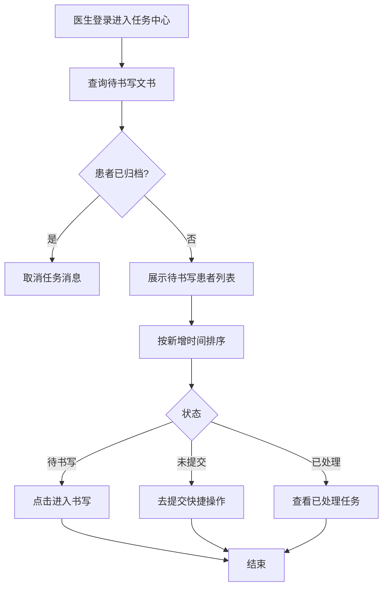
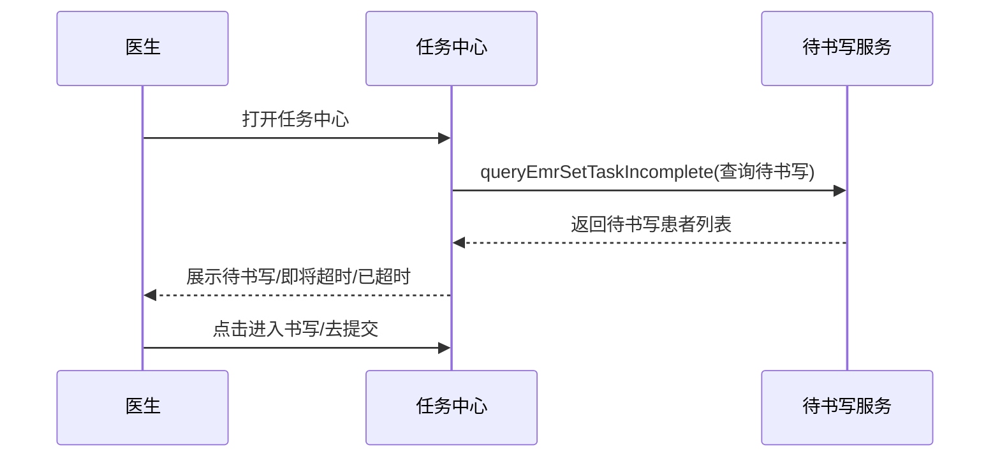

# BLGL-06-DSXTX-002 任务中心与提醒展示 - Spec

> **功能编号**：BLGL-06-DSXTX-002
> **文档类型**：Spec（研发视角）
> **文档版本**：V1.0
> **编写时间**：2026-08-14
> **编写人**：RACC

---

## 文档索引

#### 章节索引

**Spec（研发视角）**

| 章节号 | 章节名称 | 内容说明 |
|--------|---------|---------|
| 1、 | 文档概述 | 文档目的、文档范围、术语定义、阅读指南、参考文档 |
| 2、 | 功能背景与定位 | 功能背景、功能定位、目标用户、核心价值 |
| 3、 | 业务流程设计 | 主流程/异常流程/边界流程（Given/When/Then） |
| 4、 | 数据模型设计 | 核心数据结构、状态定义、系统参数定义 |
| 5、 | 接口契约设计 | API列表、接口详细设计、错误码定义 |
| 6、 | 技术方案设计 | 页面路径、技术栈、关键技术点、部署方案 |
| 7、 | 测试用例预设计 | 功能/边界/异常/性能测试用例 |
| 8、 | 非功能性要求 | 性能、安全、可用性、兼容性 |
| 9、 | 依赖与风险 | 外部依赖、风险项 |
| 10、 | 附录 | 流程图、时序图、参考文档 |

**PM-Spec（业务视角）**

| 章节号 | 章节名称 | 内容说明 |
|--------|---------|---------|
| 一 | 目标 | 功能定位与核心价值 |
| 二 | 约束 | 业务/技术/非功能性约束 |
| 三 | 验收标准 | 验收条件与验证方法 |
| 四 | 排除范围 | 本次不做项与明确边界 |
| 五 | 关键决策记录 | 方案决策与选型理由 |
| 六 | 优先级 | 优先级定义 |
| 七 | 关联文档 | 关联文档索引 |
| 附录 | 填写检查清单 | 质量检查 |

**Analyst-Spec（产品视角）**

| 章节号 | 章节名称 | 内容说明 |
|--------|---------|---------|
| 一 | 功能编号体系 | 功能编号与层级结构 |
| 二 | 核心业务流程 | 核心业务流程与时序 |
| 三 | 功能规格说明 | 详细功能规格与验收标准 |
| 四 | 排除范围 | 排除范围 |
| 五 | 业务规则清单 | 业务规则清单 |
| 六 | 关联文档 | 关联文档索引 |
| 七 | 待确认问题清单 | 待确认问题汇总 |
| - | 填写检查清单 | 质量检查 |

#### 版本历史

| 版本 | 日期 | 变更说明 | 编写人 |
|------|------|---------|--------|
| V1.0 | 2026-08-14 | 初始版本 | RACC |

#### 关联文档索引

| 序号 | 文档名称 | 文档类型 | 版本 | 位置 |
|------|---------|---------|------|------|
| 1 | BLGL-06-DSXTX-002_任务中心与提醒展示_PM-spec.md | PM-Spec（业务视角） | V0.1 | 本目录 |
| 2 | BLGL-06-DSXTX-002_任务中心与提醒展示_Analyst-spec.md | Analyst-Spec（产品视角） | V1.0 | 本目录 |
| 3 | BLGL-06-DSXTX-002_任务中心与提醒展示-Spec.md | Spec（研发视角） | V1.0 | 本目录 |
| 4 | BLGL-06-DSXTX 06待书写提醒功能点Spec.md | 功能点Spec（模块级） | V1.0 | 上级目录 |

---

## 1、文档概述

### 1.1、文档目的

本文档旨在明确"任务中心与提醒展示"功能（BLGL-06-DSXTX-002）的业务背景与设计方案，为需求分析、研发实现、测试验收及评审提供统一的业务上下文、设计口径与决策依据。

### 1.2、文档范围

#### 1.2.1 纳入范围

本文档覆盖任务中心与提醒展示的完整业务背景与设计，包括：

- 任务中心展示待书写文书，按待书写/即将超时/已超时数量排序
- 消息中心/弹窗提醒即将超时和已超时的待书写
- 已创建未提交状态展示（未提交Tab）
- 病历归档患者取消提醒
- 定时提醒、已处理任务查看

#### 1.2.2 排除范围

本文档不涉及以下内容（详见其他功能点或模块）：

- 待书写任务生成—— BLGL-06-DSXTX-001
- 时限质控与超时计算—— BLGL-06-DSXTX-003
- 待书写任务处理与状态—— BLGL-06-DSXTX-004
- 时限规则配置与参数—— BLGL-06-DSXTX-005

### 1.3、术语定义

| 术语 | 定义 |
|------|------|
| 任务中心 | 医生查看待书写文书、已处理任务的统一入口 |
| 消息中心 | 即将超时提醒的消息推送 |
| 未提交状态 | 已创建但未提交的病历草稿 |
| 定时提醒 | 待书写病历提醒定时触发 |

> ⏳ 待确认：规范术语表待产品文档确认。

### 1.4、阅读指南

- **章节关系**：第1~2章为业务全貌，第3~10章为设计实现层。与 Analyst-Spec、PM-Spec 互相引用保持一致。
- **读者对象**：产品经理/需求分析师读第1~2章；研发读第3~6、9~10章；测试读第3、7~8章；评审人员核对各层一致性。

### 1.5、参考文档

| 序号 | 文档名称 | 版本/日期 |
|------|---------|----------|
| 1 | 【历史需求】住院病历的历史需求.xlsx | - |
| 2 | BLGL-06-DSXTX-002_任务中心与提醒展示_PM-spec.md | V0.1 |
| 3 | BLGL-06-DSXTX-002_任务中心与提醒展示_Analyst-spec.md | V1.0 |
| 4 | BLGL-06-DSXTX 06待书写提醒功能点Spec.md | V1.0 |

---

## 2、功能背景与定位

### 2.1 功能背景

任务中心与提醒展示是待书写提醒的使用入口，需满足：

- **管理要求**：提醒医生哪些患者还有未书写的病历，提供统一查询和书写入口
- **现状痛点**：
  - 医生关闭提醒弹窗后忘记书写，只能等下次登录再提醒
  - 待书写提醒仅显示未创建病历，无法看到已创建未提交草稿
  - 任务中心病历超时提示功能缺失
- **历史需求演进**：从任务中心待书写提醒建立→ 定时提醒→ 未提交Tab→ 已归档取消提醒→ 已处理任务查看

### 2.2 功能定位

"任务中心与提醒展示"是 WiNEX 病历管理-待书写提醒模块的使用入口，定位为：

- **待书写查询入口**：统一查询待书写文书，点击进入书写
- **超时提醒通道**：消息/弹窗提醒即将超时和已超时的待书写
- **状态展示**：待书写/已创建未提交/已处理多状态展示

### 2.3 目标用户

| 用户角色 | 主要使用场景 |
|---------|-------------|
| 住院医生 | 任务中心查看待书写、接收提醒、点击书写 |
| 责任医生 | 接收未提交病历提醒（AT003） |
| 质控办主任 | 查看待书写/未提交状态 |

### 2.4 核心价值

| 价值维度 | 价值描述 |
|---------|---------|
| 效率提升 | 统一查询和书写入口 |
| 及时性 | 定时/消息提醒防止漏写 |
| 状态透明 | 待书写/未提交/已处理多状态 |

---

## 3、业务流程设计（Given/When/Then）

### 3.1 主流程

**Scenario 1: 任务中心待书写展示**

```gherkin
Given:
  - 医生已登录
  - 医生名下有待书写文书任务

When:
  - 医生打开任务中心
  - 点击待书写文书table

Then:
  - 展示当前医生名下有待书写文书任务的患者
  - 患者信息展示：床位号、姓名、性别、年龄、待书写数量、即将超时数量、已超时数量
  - 按待书写/即将超时/已超时数量更新（只算新增）的时间降序排序
  - 点击患者可进入对应文书编辑部分
```

### 3.2 异常流程

**Scenario 2: 业务异常——关闭弹窗后漏提醒**

```gherkin
Given:
  - 医生看到待书写病历提醒弹窗

When:
  - 医生直接关闭弹窗

Then:
  - 医生可能忘记书写病历
  - 应支持定时提醒，而非仅下次登录再提醒
```

**Scenario 3: 数据异常——已归档患者提醒**

```gherkin
Given:
  - 患者已归档状态（不能写病历）

When:
  - 任务中心展示待书写病历

Then:
  - 只显示未归档的患者，不显示已归档和已召回的患者
  - 已归档/已召回患者待书写不删除，仅取消任务消息
```

**Scenario 4: 系统异常——超时提示缺失**

```gherkin
Given:
  - 任务中心待书写病历

When:
  - 病历超时

Then:
  - 任务中心应展示超时提示
  - ⏳ 待确认：超时提示缺失原因
```

### 3.3 边界流程

**Scenario 5: 边界场景——未提交Tab展示**

```gherkin
Given:
  - 病历已创建但未提交（草稿）

When:
  - 医生查看待书写目录

Then:
  - 待书写目录增加"未提交"Tab
  - 展示新建、草稿、审签退回状态的病历
  - 提供"去提交"快捷操作
```

**Scenario 6: 边界场景——已处理任务查看**

```gherkin
Given:
  - 医生已完成任务处理（如首页打回修改）

When:
  - 医生查看任务中心

Then:
  - 可查看已处理的任务
  - 可回溯处理过的病历
```

---

## 4、数据模型设计

> 数据模型信息来自代码扫描（`E:\39EMR\sr-next`）和历史。标注 `` 的字段来自输入/输出 VO，标注 `` 的来自需求文本。

### 4.1 核心数据结构

#### 4.1.1 核心表/实体

| 表/实体 | 关键字段 | 说明 |
|---------|---------|------|
| INPATIENT_EMR_INCOMPLETE（InpatientEmrIncompletePO） | INP_EMR_INCOMPLETE_ID、INP_EMR_CLASS_ID、EMPLOYEE_ID、ENCOUNTER_ID、IS_DEL | 待书写文书主表，任务中心数据源 |
| 任务消息表 | 任务标识、发送时间 | 任务中心消息 |

> ⏳ 待确认：完整数据表清单待代码扫描或功能清单数据表清单补充。

### 4.2 状态定义

| 状态码 | 状态名称 | 说明 |
|--------|---------|------|
| 待书写 | 未创建 | 待创建病历 |
| 未提交 | 已创建未提交 | 草稿/审签退回 |
| 已处理 | 已完成 | 已处理任务 |
| 即将超时 | 待超时 | 即将超时任务 |
| 已超时 | 超时 | 已超时任务 |

### 4.3 系统参数定义

| 参数编码 | 参数名称 | 说明 |
|---------|---------|------|
| COMMON172 | 是否开启提醒责任医生的待书写任务弹窗 | 默认否 |
| AT003 | 患者归档提醒的发送人 | 需增加责任医生选项 |
| 待书写文书任务是否显示忽略按钮 | 忽略按钮开关 | 默认为是 |

---

## 5、接口契约设计

> 接口信息来自代码扫描（`E:\39EMR\sr-next`）的 InpEmrInCompleteDocController + TaskController。标注 ``。

### 5.1 API列表

| 序号 | API名称（代码函数） | 路径 | 方法 | 说明 |
|:----:|---------|------|:----:|------|
| 1 | queryEmrSetTaskIncomplete | /api/v1/app_record_inpatient/emr_inpatient/incomplete_doc/query/task | POST | 查询待书写数据-任务中心 |
| 2 | queryEmrCompleteDoc | /api/v1/app_record_inpatient/emr_inpatient/incomplete_doc/query | POST | 查询未完成文书列表 |
| 3 | queryEmrCompleteDocDone | /api/v1/app_record_inpatient/emr_inpatient/incomplete_doc/query/done | POST | 查询已完成文书列表（已处理任务） |
| 4 | cancelTaskIncomplete | /api/v1/app_record_inpatient/emr_inpatient_task_complete_doc/cancel | POST | 取消任务中心待书写 |
| 5 | delMergeTask | /api/v1/app_record_inpatient/task/del | POST | 删除任务中心消息（TaskController） |

> 前端实际请求前缀：`/inpatient-clinicalnote/api/v1/app_record_inpatient/`。

### 5.2 接口详细设计

#### 5.2.1 查询待书写数据-任务中心（queryEmrSetTaskIncomplete）

**请求参数（InpatIncompleteDocQueryInputAO）**:
```json
{
  "encounterId": 1001,
  "employeeId": 2001,
  "deptId": 101,
  "status": "incomplete"
}
```

**返回值（成功，List<InpatientIncompleteDocVO>）**:
```json
{
  "success": true,
  "data": [
    {
      "inpEmrIncompleteId": 5001,
      "patientName": "张三",
      "bedNo": "101-1",
      "inpEmrClassName": "手术记录",
      "deadlineAt": "2026-08-15 10:00",
      "overtimeFlag": 0
    }
  ]
}
```

**返回值（失败）**:
```json
{
  "success": false,
  "message": "查询失败",
  "data": null
}
```

> ⏳ 待确认：具体字段名/结构以接口契约文档为准。

### 5.3 错误码定义

| 错误码 | 错误信息 | 处理方式 |
|--------|---------|---------|
| ⏳ 待确认 | 超时提示缺失 | 排查任务中心超时展示 |

> ⏳ 待确认：业务错误码定义未在代码扫描中提取完整。

---

## 6、技术方案设计

### 6.1 页面路径

- **页面路径**: 住院医生站→任务中心；文书总览→待书写；消息中心
- **前端组件**: EmrCreatorAndWrite/（含待书写查询）、AuxiliaryOnQualityRemind/（质量提醒弹窗）
- **后端接口**: InpEmrInCompleteDocController + TaskController

### 6.2 技术栈

| 类别 | 技术 | 版本 |
|------|------|------|
| 前端框架 | Vue | 2.6.14 |
| 前端UI | element-ui | 2.13.0 |
| 后端框架 | Spring Boot（Java） | java.version 17 |
| 构建工具 | webpack / Maven | 前端 webpack + 后端 Maven |

### 6.3 关键技术点

- 任务中心排序：按待书写/即将超时/已超时数量新增时间降序
- 定时提醒：支持定时触发而非仅登录时提醒
- 未提交Tab：展示已创建未提交草稿，提供去提交快捷操作
- 已归档取消提醒：只显示未归档患者，已归档仅取消任务消息
- 忽略按钮参数：按参数控制是否显示忽略按钮

### 6.4 部署方案

⏳ 待确认：部署方案未在资料区中找到。

---

## 7、测试用例预设计

### 7.1 功能测试

| 用例编号 | 测试场景 | Given | When | Then |
|---------|---------|-------|------|------|
| TC-001 | 任务中心待书写展示 | 医生名下有待书写任务 | 打开任务中心 | 展示患者+数量，按新增时间排序 |
| TC-002 | 未提交Tab | 有已创建未提交草稿 | 查看待书写目录 | 展示未提交Tab+去提交 |

### 7.2 边界测试

| 用例编号 | 测试场景 | Given | When | Then |
|---------|---------|-------|------|------|
| TC-003 | 已归档取消提醒 | 患者已归档 | 查看任务中心 | 不显示已归档患者，取消任务消息 |
| TC-004 | 已处理任务查看 | 医生已完成任务 | 查看任务中心 | 可查看已处理任务 |

### 7.3 异常测试

| 用例编号 | 测试场景 | Given | When | Then |
|---------|---------|-------|------|------|
| TC-005 | 关闭弹窗漏提醒 | 医生关闭提醒弹窗 | 后续 | 定时提醒兜底 |
| TC-006 | 超时提示缺失 | 病历超时 | 查看任务中心 | 修复超时提示 |

### 7.4 性能测试

| 用例编号 | 测试场景 | 指标 |
|---------|---------|------|
| TC-007 | 任务中心查询响应 | ⏳ 待确认：性能指标未在资料区中找到 |

---

## 8、非功能性要求

### 8.1 性能要求

| 指标 | 要求 |
|------|------|
| 任务中心查询响应 | ⏳ 待确认 |

### 8.2 安全要求

| 要求 | 说明 |
|------|------|
| 任务中心权限 | 按医生/科室权限展示 |
| 授权患者控制 | 无病程新增权限的授权患者待书写需控制 |

**医疗行业特殊要求**

| 要求 | 说明 |
|------|------|
| 提醒及时性 | 定时提醒保障病历书写及时 |

### 8.3 可用性要求

| 指标 | 要求值 |
|------|--------|
| 可用性 | ⏳ 待确认 |

### 8.4 兼容性要求

| 类型 | 要求 |
|------|------|
| 归档状态兼容 | 已归档/已召回患者取消任务消息 |

---

## 9、依赖与风险

### 9.1 外部依赖

| 依赖项 | 说明 |
|--------|------|
| 消息系统 | 消息中心提醒 |

### 9.2 风险项

| 风险项 | 等级 | 说明 | 应对方案 |
|--------|------|------|---------|
| 漏提醒 | 中 | 关闭弹窗后忘记书写 | 定时提醒 |
| 已归档误提醒 | 低 | 已归档患者仍在任务中心 | 取消任务消息 |

---

## 10、附录

### 10.1 流程图



### 10.2 时序图



### 10.3 参考文档

- 【历史需求】住院病历的历史需求.xlsx（、242324、1511005、1372436、1579045、254378、1519051、1582186 等）
- BLGL-06-DSXTX 06待书写提醒功能点Spec.md（V1.0，第5章 -002 行）
- 关联Spec: BLGL-06-DSXTX-001（任务生成）、-004（任务处理状态）

---

## 填写检查清单

| 序号 | 检查项 | 是否完成 |
|:----:|--------|:--------:|
| 1 | 章节索引与正文章节一致 | ✅ |
| 2 | 版本历史记录完整 | ✅ |
| 3 | 关联文档索引已登记全部Spec | ✅ |
| 4 | 文档目的明确回答"为什么做/做成什么/怎么做" | ✅ |
| 5 | 纳入范围/排除范围清晰 | ✅ |
| 6 | 术语定义覆盖关键概念，从资料区可溯源 | ✅ |
| 7 | 参考文档已登记 | ✅ |
| 8 | 功能背景基于法规/规范/需求来源组织 | ✅ |
| 9 | 功能定位体现业务价值（3~5个定位点） | ✅ |
| 10 | 目标用户角色覆盖完整，在需求原文中有出处 | ✅ |
| 11 | 核心价值可陈述，与 Phase 1 口径一致 | ✅ |
| 12 | 业务流程：主流程≥1、异常≥3、边界≥2，Given/When/Then 具体 | ✅ |
| 13 | 数据模型：字段/表/状态/参数可溯源 | ✅ |
| 14 | 接口契约：API列表+详细设计+错误码齐全或标记待确认 | ✅ |
| 15 | 技术方案：页面路径/技术栈/关键点/部署方案或标记待确认 | ✅ |
| 16 | 测试用例：功能/边界/异常/性能覆盖 | ✅ |
| 17 | 非功能性要求：性能/安全/可用性/兼容性指标可量化或标记待确认 | ✅ |
| 18 | 依赖与风险：外部依赖登记完整 | ✅ |
| 19 | 附录：流程图/时序图与正文流程一致 | ✅ |
| 20 | 全文无占位符 `< >` 残留 | ✅ |
| 21 | 全文陈述可溯源至资料区 | ✅ |
| 22 | 人工审核确认完成 | ⏳ 待确认 |

---

**文档状态**：⬜ 待审核
**维护责任**：RACC
**下次更新**：根据评审反馈优化
