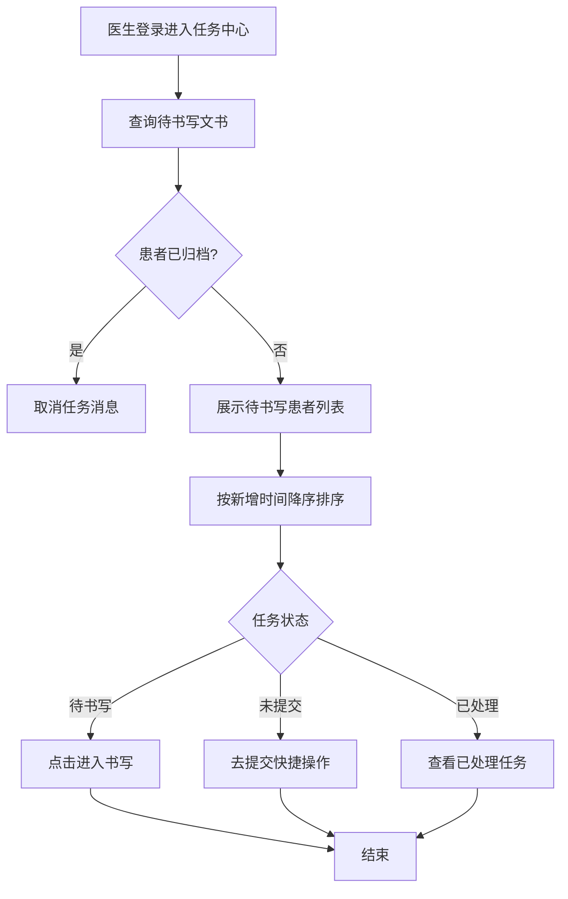
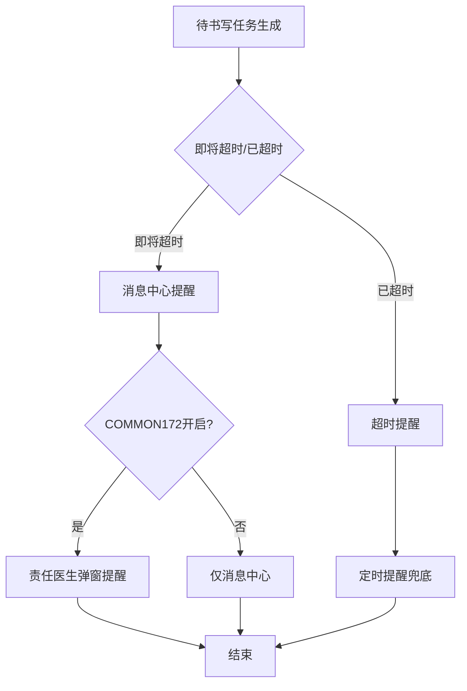

# BLGL-06-DSXTX-002任务中心与提醒展示_ Analyst - Spec

> **需求编号**：BLGL-06-DSXTX-002
> **父需求**：BLGL-06-DSXTX
> **关联PM Spec**：BLGL-06-DSXTX-002_任务中心与提醒展示_PM-spec.md
> **Spec版本**：V1.0
> **编写时间**：2026-08-14
> **编写人**：需求分析师

---

## 一、功能编号体系

### 1.1 功能层级结构

```
BLGL-06-DSXTX-002: 任务中心与提醒展示
  ├─ BLGL-06-DSXTX-002-01: 任务中心待书写展示
  │   ├─ -01-01: 待书写患者列表展示（床位号/姓名/数量）
  │   ├─ -01-02: 排序（按新增时间降序）
  │   └─ -01-03: 点击进入文书编辑
  ├─ BLGL-06-DSXTX-002-02: 消息/弹窗提醒
  │   ├─ -02-01: 消息中心即将超时提醒
  │   ├─ -02-02: 定时提醒
  │   └─ -02-03: 责任医生弹窗提醒（COMMON172）
  ├─ BLGL-06-DSXTX-002-03: 状态展示与归档处理
  │   ├─ -03-01: 未提交Tab展示
  │   ├─ -03-02: 已归档取消提醒
  │   └─ -03-03: 已处理任务查看
```

### 1.2 功能编号表

| REQ-ID | 功能名称 | 类型 | 优先级 | 说明 |
|--------|---------|------|--------|------|
| BLGL-06-DSXTX-002-01 | 任务中心待书写展示 | 功能 | P0 | 待书写患者列表展示与排序 |
| BLGL-06-DSXTX-002-01-01 | 待书写患者列表 | 子功能 | P0 | 床位号/姓名/数量 |
| BLGL-06-DSXTX-002-01-02 | 排序 | 子功能 | P0 | 新增时间降序 |
| BLGL-06-DSXTX-002-01-03 | 点击进入书写 | 子功能 | P0 | 进入文书编辑 |
| BLGL-06-DSXTX-002-02 | 消息/弹窗提醒 | 功能 | P0 | 提醒通道 |
| BLGL-06-DSXTX-002-02-01 | 消息中心提醒 | 子功能 | P0 | 即将超时提醒 |
| BLGL-06-DSXTX-002-02-02 | 定时提醒 | 子功能 | P1 | 非仅登录提醒 |
| BLGL-06-DSXTX-002-02-03 | 责任医生弹窗 | 子功能 | P1 | COMMON172控制 |
| BLGL-06-DSXTX-002-03 | 状态展示与归档 | 功能 | P1 | 未提交/已归档/已处理 |
| BLGL-06-DSXTX-002-03-01 | 未提交Tab | 子功能 | P1 | 草稿展示+去提交 |
| BLGL-06-DSXTX-002-03-02 | 已归档取消提醒 | 子功能 | P1 | 取消任务消息 |
| BLGL-06-DSXTX-002-03-03 | 已处理任务查看 | 子功能 | P1 | 已处理回溯 |

---

## 二、核心业务流程

### 2.1 任务中心待书写展示流程



### 2.2 提醒流程



---

## 三、功能规格说明

---

### BLGL-06-DSXTX-002-01: 任务中心待书写展示

#### 3.1.1 功能概述

任务中心展示当前医生名下有待书写文书任务的患者，按待书写/即将超时/已超时数量新增时间降序排序，点击可进入文书编辑。

#### 3.1.2 用户角色

| 角色 | 使用场景 | 权限要求 | 操作频率 |
|------|---------|---------|---------|
| 住院医生 | 查看待书写任务 | 病历编辑权限 | 高频 |

#### 3.1.3 业务流程（Given/When/Then）

##### 主流程

**Scenario 1: 任务中心待书写展示**

```gherkin
Given:
  - 医生已登录
  - 医生名下有待书写文书任务

When:
  - 医生打开任务中心
  - 点击待书写文书table

Then:
  - 展示当前医生名下有待书写文书任务的患者
  - 患者信息展示：床位号、姓名、性别、年龄、待书写数量、即将超时数量、已超时数量
  - 按新增时间降序排序
  - 点击患者可进入对应文书编辑部分
```

##### 异常流程

**Scenario 2: 系统异常——超时提示缺失**

```gherkin
Given:
  - 任务中心待书写病历

When:
  - 病历超时

Then:
  - 任务中心应展示超时提示
  - ⏳ 待确认：超时提示缺失原因
```

##### 边界流程

**Scenario 3: 边界场景——任务科室多选**

```gherkin
Given:
  - 医生有登录权限的多科室

When:
  - 医生查看任务中心

Then:
  - 任务科室默认当前登录科室
  - 下拉选择有登录权限的科室，可多选
```

#### 3.1.4 数据字段定义

> 字段名来自代码扫描（`E:\39EMR\sr-next`，标注 ``）。

#### 3.1.5 验收标准

| AC编号 | 验收标准 | 对应REQ-ID | 验证方法 | 验证场景 |
|--------|---------|-----------|---------|---------|
| AC-001 | 任务中心展示医生名下待书写患者，按新增时间降序排序 | -002-01 | 功能测试 | Scenario 1 |
| AC-002 | 点击患者进入对应文书编辑 | -002-01 | 功能测试 | Scenario 1 |
| AC-003 | 任务科室下拉多选 | -002-01 | 功能测试 | Scenario 3 |

---

### BLGL-06-DSXTX-002-02: 消息/弹窗提醒

#### 3.2.1 功能概述

消息中心提醒即将超时待书写，支持定时提醒（非仅登录时），责任医生弹窗提醒按 COMMON172 控制。

#### 3.2.2 用户角色

| 角色 | 使用场景 | 权限要求 | 操作频率 |
|------|---------|---------|---------|
| 住院医生 | 接收消息/弹窗提醒 | 病历编辑权限 | 高频 |
| 责任医生 | 接收弹窗提醒 | 责任医生权限 | 中频 |

#### 3.2.3 业务流程（Given/When/Then）

##### 主流程

**Scenario 1: 消息中心提醒**

```gherkin
Given:
  - 待书写任务即将超时

When:
  - 消息中心推送提醒

Then:
  - 医生收到即将超时提醒
  - 可点击进入书写
```

##### 异常流程

**Scenario 2: 业务异常——关闭弹窗漏提醒**

```gherkin
Given:
  - 医生看到待书写病历提醒弹窗

When:
  - 医生直接关闭弹窗

Then:
  - 医生可能忘记书写病历
  - 应支持定时提醒，而非仅下次登录再提醒
```

##### 边界流程

**Scenario 3: 边界场景——责任医生弹窗**

```gherkin
Given:
  - 参数 COMMON172 开启提醒责任医生弹窗

When:
  - 责任医生点开住院病历界面

Then:
  - 弹出待书写提醒
  - 每条任务文字提醒取时限质控规则的名称
```

#### 3.2.4 数据字段定义

#### 3.2.5 验收标准

| AC编号 | 验收标准 | 对应REQ-ID | 验证方法 | 验证场景 |
|--------|---------|-----------|---------|---------|
| AC-004 | 待书写提醒定时触发，非仅登录时提醒 | -002-02 | 功能测试 | Scenario 2 |
| AC-005 | COMMON172开启时责任医生弹窗提醒 | -002-02 | 功能测试 | Scenario 3 |

---

### BLGL-06-DSXTX-002-03: 状态展示与归档处理

#### 3.3.1 功能概述

待书写目录增加未提交Tab展示已创建未提交草稿；已归档/已召回患者取消任务消息；任务中心可查看已处理任务。

#### 3.3.2 用户角色

| 角色 | 使用场景 | 权限要求 | 操作频率 |
|------|---------|---------|---------|
| 住院医生 | 查看未提交/已处理任务 | 病历编辑权限 | 中频 |
| 质控办主任 | 查看未提交病历 | 质控权限 | 中频 |

#### 3.3.3 业务流程（Given/When/Then）

##### 主流程

**Scenario 1: 未提交Tab展示**

```gherkin
Given:
  - 病历已创建但未提交（草稿）

When:
  - 医生查看待书写目录

Then:
  - 待书写目录增加"未提交"Tab
  - 展示新建、草稿、审签退回状态的病历
  - 提供"去提交"快捷操作
```

##### 异常流程

**Scenario 2: 数据异常——已归档患者提醒**

```gherkin
Given:
  - 患者已归档状态（不能写病历）

When:
  - 任务中心展示待书写病历

Then:
  - 只显示未归档的患者，不显示已归档和已召回的患者
  - 已归档/已召回患者待书写不删除，仅取消任务消息
```

##### 边界流程

**Scenario 3: 边界场景——已处理任务查看**

```gherkin
Given:
  - 医生已完成任务处理（如首页打回修改）

When:
  - 医生查看任务中心

Then:
  - 可查看已处理的任务
  - 可回溯处理过的病历
```

#### 3.3.4 数据字段定义

#### 3.3.5 验收标准

| AC编号 | 验收标准 | 对应REQ-ID | 验证方法 | 验证场景 |
|--------|---------|-----------|---------|---------|
| AC-006 | 待书写目录增加未提交Tab，展示草稿并提供去提交 | -002-03 | 功能测试 | Scenario 1 |
| AC-007 | 已归档/已召回患者不在任务中心显示，取消任务消息 | -002-03 | 功能测试 | Scenario 2 |
| AC-008 | 任务中心可查看已处理任务 | -002-03 | 功能测试 | Scenario 3 |

---

## 四、排除范围

本需求不包含以下功能项：

1. **待书写任务生成** - 属 BLGL-06-DSXTX-001
2. **时限质控与超时计算** - 属 BLGL-06-DSXTX-003
3. **待书写任务处理与状态** - 属 BLGL-06-DSXTX-004
4. **时限规则配置与参数** - 属 BLGL-06-DSXTX-005

> 与 PM-Spec 第四章一致。对照 Phase 1 功能点Spec 第6章（基线能力），确保不越界。

---

## 五、业务规则清单

| 规则ID | 规则名称 | 规则描述 | 来源 | 优先级 |
|--------|---------|---------|------|--------|
| BR-001 | 任务中心排序 | 按待书写/即将超时/已超时数量新增时间降序排序 | | P0 |
| BR-002 | 发送对象 | 待写病历任务发送给患者责任医生（可配置） | | P0 |
| BR-003 | 定时提醒 | 待书写提醒支持定时触发 | | P1 |
| BR-004 | 责任医生弹窗 | COMMON172开启时责任医生弹窗提醒，取规则名称 | | P1 |
| BR-005 | 未提交展示 | 待书写目录增加未提交Tab，展示草稿 | | P1 |
| BR-006 | 已归档取消提醒 | 已归档/已召回患者取消任务消息，不删除待书写 | | P1 |
| BR-007 | 已处理查看 | 任务中心可查看已处理任务 | | P1 |

---

## 六、关联文档

| 文档类型 | 文档路径 | 说明 |
|---------|---------|------|
| PM-Spec（业务视角） | 本目录 BLGL-06-DSXTX-002_任务中心与提醒展示_PM-spec.md（V0.1） | PM 产出的 Spec 文档 |
| Spec（研发视角） | 本目录 BLGL-06-DSXTX-002_任务中心与提醒展示-Spec.md（V1.0） | 业务背景与目标 Spec |
| 功能点Spec（模块级） | BLGL-06-DSXTX 06待书写提醒功能点Spec.md（V1.0，上级目录） | Phase 1 功能点索引 |
| data-model.md | 待产出 | 架构师产出的数据建模文档 |
| design.md | 待产出 | 架构师产出的技术方案文档 |
| api-contract.md | 待产出 | 开发经理产出的 API 契约文档 |

---

## 七、待确认问题清单

| 编号 | 问题描述 | 缺失信息 | 影响范围 | 建议补充方 |
|------|---------|---------|---------|-----------|
| Q-001 | 超时提示缺失根因 | 任务中心超时展示缺失原因 | 3.1.3 Scenario 2 | 开发经理 |
| Q-002 | 定时提醒机制 | 定时触发方案 | 3.2.3 Scenario 2 | 产品经理 |
| Q-003 | 完整接口契约 | API 请求/返回字段 | 第5章接口设计 | 开发经理 |
| Q-004 | 概念ID、性能指标 | 字段概念ID、查询SLA | 数据模型、非功能 | 架构师/产品经理 |

---

## 填写检查清单

| 序号 | 检查项 | 是否完成 |
|:----:|--------|:--------:|
| 1 | 功能编号带父子层级 | ✅ |
| 2 | 每个 REQ-ID 有功能概述和用户角色 | ✅ |
| 3 | 主流程至少 1 个 Given/When/Then 场景 | ✅ |
| 4 | 异常流程至少 3 个 Given/When/Then 场景 | ✅ |
| 5 | 边界流程至少 2 个 Given/When/Then 场景 | ✅ |
| 6 | 每个 Given/When/Then 内容具体，不模糊 | ✅ |
| 7 | 数据字段定义完整 | ✅ |
| 8 | 验收标准 AC 编号独立，可验证 | ✅ |
| 9 | 验收标准无"功能正常"等模糊表述 | ✅ |
| 10 | 排除范围明确列出 | ✅ |
| 11 | 业务规则清单列出所有规则，每条标注来源 | ✅ |
| 12 | 流程图使用 Mermaid 格式（≥2 个） | ✅ |
| 13 | 关联文档索引包含 Phase 1 功能点Spec | ✅ |
| 14 | 待确认问题清单汇总了全文所有 ⏳ 项 | ✅ |
| 15 | 全文无占位符 `< >` 残留 | ✅ |
| 16 | 全文陈述可溯源至资料区（S1~S10 溯源核查） | ✅ |
| 17 | 人工审核确认完成 | ⏳ 待确认 |

---

**文档状态**：⬜ 待审核
**维护责任**：需求分析师规范组
**下次更新**：根据评审反馈优化

---

## 版本历史

| 版本 | 日期 | 变更说明 | 编写人 |
|------|------|---------|--------|
| V1.0 | 2026-08-14 | 初始版本 | 需求分析师 |
