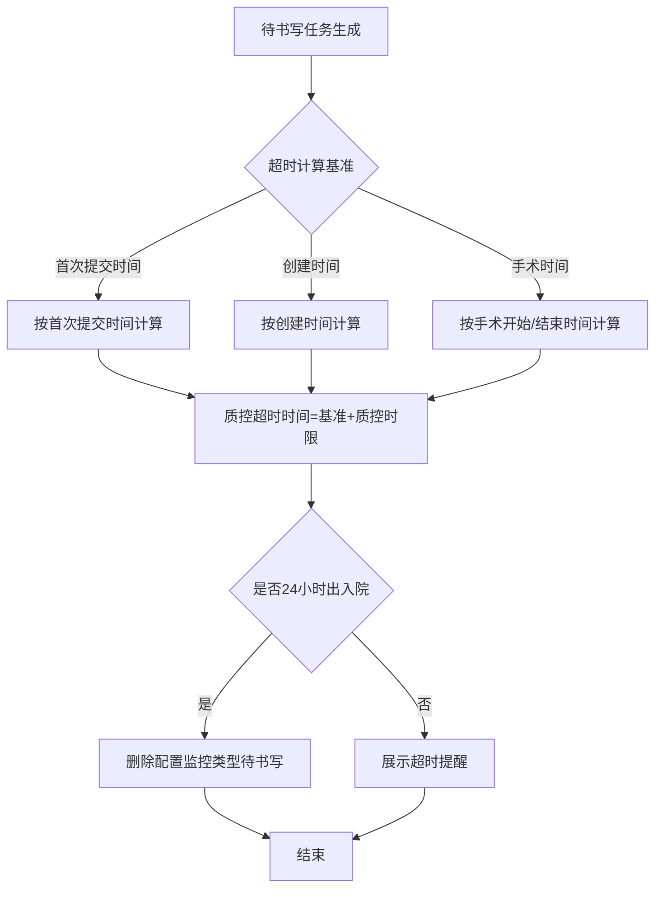
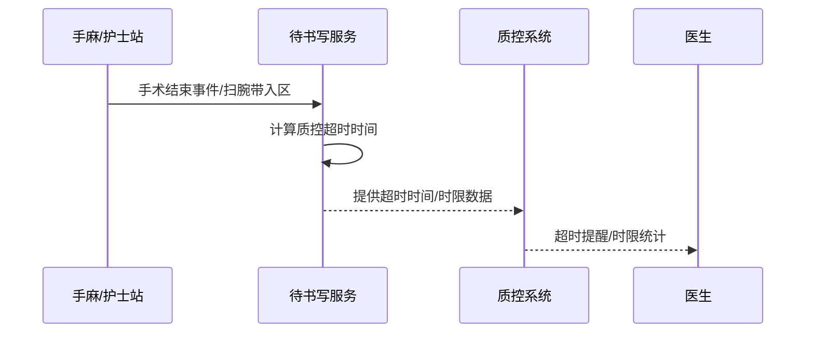

# BLGL-06-DSXTX-003 时限质控与超时计算 - Spec

> **功能编号**：BLGL-06-DSXTX-003
> **文档类型**：Spec（研发视角）
> **文档版本**：V1.0
> **编写时间**：2026-08-14
> **编写人**：RACC

---

## 文档索引

#### 章节索引

**Spec（研发视角）**

| 章节号 | 章节名称 | 内容说明 |
|--------|---------|---------|
| 1、 | 文档概述 | 文档目的、文档范围、术语定义、阅读指南、参考文档 |
| 2、 | 功能背景与定位 | 功能背景、功能定位、目标用户、核心价值 |
| 3、 | 业务流程设计 | 主流程/异常流程/边界流程（Given/When/Then） |
| 4、 | 数据模型设计 | 核心数据结构、状态定义、系统参数定义 |
| 5、 | 接口契约设计 | API列表、接口详细设计、错误码定义 |
| 6、 | 技术方案设计 | 页面路径、技术栈、关键技术点、部署方案 |
| 7、 | 测试用例预设计 | 功能/边界/异常/性能测试用例 |
| 8、 | 非功能性要求 | 性能、安全、可用性、兼容性 |
| 9、 | 依赖与风险 | 外部依赖、风险项 |
| 10、 | 附录 | 流程图、时序图、参考文档 |

**PM-Spec（业务视角）**

| 章节号 | 章节名称 | 内容说明 |
|--------|---------|---------|
| 一 | 目标 | 功能定位与核心价值 |
| 二 | 约束 | 业务/技术/非功能性约束 |
| 三 | 验收标准 | 验收条件与验证方法 |
| 四 | 排除范围 | 本次不做项与明确边界 |
| 五 | 关键决策记录 | 方案决策与选型理由 |
| 六 | 优先级 | 优先级定义 |
| 七 | 关联文档 | 关联文档索引 |
| 附录 | 填写检查清单 | 质量检查 |

**Analyst-Spec（产品视角）**

| 章节号 | 章节名称 | 内容说明 |
|--------|---------|---------|
| 一 | 功能编号体系 | 功能编号与层级结构 |
| 二 | 核心业务流程 | 核心业务流程与时序 |
| 三 | 功能规格说明 | 详细功能规格与验收标准 |
| 四 | 排除范围 | 排除范围 |
| 五 | 业务规则清单 | 业务规则清单 |
| 六 | 关联文档 | 关联文档索引 |
| 七 | 待确认问题清单 | 待确认问题汇总 |
| - | 填写检查清单 | 质量检查 |

#### 版本历史

| 版本 | 日期 | 变更说明 | 编写人 |
|------|------|---------|--------|
| V1.0 | 2026-08-14 | 初始版本 | RACC |

#### 关联文档索引

| 序号 | 文档名称 | 文档类型 | 版本 | 位置 |
|------|---------|---------|------|------|
| 1 | BLGL-06-DSXTX-003_时限质控与超时计算_PM-spec.md | PM-Spec（业务视角） | V0.1 | 本目录 |
| 2 | BLGL-06-DSXTX-003_时限质控与超时计算_Analyst-spec.md | Analyst-Spec（产品视角） | V1.0 | 本目录 |
| 3 | BLGL-06-DSXTX-003_时限质控与超时计算-Spec.md | Spec（研发视角） | V1.0 | 本目录 |
| 4 | BLGL-06-DSXTX 06待书写提醒功能点Spec.md | 功能点Spec（模块级） | V1.0 | 上级目录 |

---

## 1、文档概述

### 1.1、文档目的

本文档旨在明确"时限质控与超时计算"功能（BLGL-06-DSXTX-003）的业务背景与设计方案，为需求分析、研发实现、测试验收及评审提供统一的业务上下文、设计口径与决策依据。

### 1.2、文档范围

#### 1.2.1 纳入范围

本文档覆盖时限质控与超时计算的完整业务背景与设计，包括：

- 待书写任务超时时间计算（按病历首次提交时间/创建时间）
- 手术相关病历超时计算（以手麻系统手术开始/结束时间为准）
- 入区触发的待书写以扫腕带入区时间为准
- 24小时出入院患者时限质控豁免
- 时限质控明细统计与超时提醒
- 输血后24小时评价单时限闭环

#### 1.2.2 排除范围

本文档不涉及以下内容（详见其他功能点或模块）：

- 待书写任务生成—— BLGL-06-DSXTX-001
- 任务中心与提醒展示—— BLGL-06-DSXTX-002
- 待书写任务处理与状态—— BLGL-06-DSXTX-004
- 时限规则配置与参数—— BLGL-06-DSXTX-005

### 1.3、术语定义

| 术语 | 定义 |
|------|------|
| 首次提交时间 | 病历首次提交的时间，时限超时计算依据 |
| 手术开始/结束时间 | 手麻系统的手术开始/结束时间，手术相关病历超时计算依据 |
| 扫腕带入区时间 | 护士首次扫腕带视为真正入区，入区待书写超时计算依据 |
| 质控超时时间 | 触发时间 + 质控时限（如手术结束时间 + 24小时） |

> ⏳ 待确认：规范术语表待产品文档确认。

### 1.4、阅读指南

- **章节关系**：第1~2章为业务全貌，第3~10章为设计实现层。与 Analyst-Spec、PM-Spec 互相引用保持一致。
- **读者对象**：产品经理/需求分析师读第1~2章；研发读第3~6、9~10章；测试读第3、7~8章；评审人员核对各层一致性。

### 1.5、参考文档

| 序号 | 文档名称 | 版本/日期 |
|------|---------|----------|
| 1 | 【历史需求】住院病历的历史需求.xlsx | - |
| 2 | BLGL-06-DSXTX-003_时限质控与超时计算_PM-spec.md | V0.1 |
| 3 | BLGL-06-DSXTX-003_时限质控与超时计算_Analyst-spec.md | V1.0 |
| 4 | BLGL-06-DSXTX 06待书写提醒功能点Spec.md | V1.0 |

---

## 2、功能背景与定位

### 2.1 功能背景

时限质控与超时计算是保障病历书写及时性的核心机制，需满足：

- **管理要求**：按法规/规范要求病历需在时限内书写（如手术记录24小时内、首次病程8小时内）》）
- **现状痛点**：
  - 超时计算误取创建时间而非首次提交时间
  - 手术病历超时未按手麻系统手术时间计算
  - 超时提醒剩余时间不准
  - 有按时书写仍被超时提醒
- **历史需求演进**：从创建时间计算超时 → 首次提交时间计算→ 手术时间/扫腕带时间→ 24小时出入院豁免→ 输血闭环

### 2.2 功能定位

"时限质控与超时计算"是 WiNEX 病历管理-待书写提醒模块的核心质控能力，定位为：

- **病历书写及时性保障**：计算待书写任务超时，防止病历超时未书写
- **质控合规支撑**：满足电子病历分级/法规时限要求
- **跨系统时间基准**：以手麻/护士站/医嘱系统真实时间计算超时

### 2.3 目标用户

| 用户角色 | 主要使用场景 |
|---------|-------------|
| 住院医生 | 查看待书写超时提醒，按时书写病历 |
| 质控办/质控系统 | 时限质控统计、超时病历追踪 |
| 责任医生 | 接收未提交病历提醒 |

### 2.4 核心价值

| 价值维度 | 价值描述 |
|---------|---------|
| 患者安全 | 防止病历超时未书写导致诊疗延误 |
| 合规性 | 满足手术记录24小时、首次病程8小时等法规时限 |
| 准确性 | 超时计算以真实时间（首次提交/手术/扫腕带）为准 |

---

## 3、业务流程设计（Given/When/Then）

### 3.1 主流程

**Scenario 1: 超时时间计算**

```gherkin
Given:
  - 待书写任务已生成（如手术记录、首次病程）
  - 参数配置超时计算基准（首次提交时间/创建时间）

When:
  - 待书写任务从未完成更新为已完成
  - 或质控系统计算超时

Then:
  - 超时时间按配置基准计算（首次提交时间/创建时间）
  - 任务匹配病历创建时间/首次提交时间字段填充
  - 超时提醒按质控超时时间展示
```

### 3.2 异常流程

**Scenario 2: 业务异常——手术超时时间不准**

```gherkin
Given:
  - 手术记录待书写任务已生成

When:
  - 手术医嘱完成24小时书写手术记录

Then:
  - 超时提醒剩余时间应按手术结束时间更新
  - ⏳ 待确认：手术结束时间未更新时的处理
```

**Scenario 3: 数据异常——有书写仍被超时提醒**

```gherkin
Given:
  - 医生已按时书写病历

When:
  - 超时提醒持续触发

Then:
  - 应正确处理已完成待书写任务，不再提醒
  - ⏳ 待确认：已书写仍提醒的根因
```

**Scenario 4: 系统异常——时限质控明细统计缺失**

```gherkin
Given:
  - 时限规则已配置并启用

When:
  - 质控系统查询时限质控明细统计

Then:
  - 部分规则查不到数据
  - ⏳ 待确认：规则未统计到的原因
```

### 3.3 边界流程

**Scenario 5: 边界场景——24小时出入院豁免**

```gherkin
Given:
  - 患者出区时间-入区时间≤24小时
  - 参数"24小时入出院患者无需质控的病历监控类型"已配置

When:
  - 患者出区

Then:
  - 删除配置的监控类型的待书写任务
  - 无需书写首次病程/主治查房/入院前三天日常病程
```

**Scenario 6: 边界场景——手术结束事件更新超时**

```gherkin
Given:
  - 参数"是否通过医生站手术结束事件更新病历超时时间"开启
  - 手术结束事件（399630436）触发

When:
  - 手术结束事件推送

Then:
  - 匹配手术待书写任务
  - 超时时间更新为【手术结束时间SURGERY_END_AT + 质控时限】
```

---

## 4、数据模型设计

> 数据模型信息来自代码扫描（`E:\39EMR\sr-next`）和历史。标注 `` 的表名/字段来自 PO 实体，标注 `` 的来自需求文本。

### 4.1 核心数据结构

#### 4.1.1 核心表/实体

| 表/实体 | 关键字段 | 说明 |
|---------|---------|------|
| INPATIENT_EMR_INCOMPLETE（InpatientEmrIncompletePO） | INP_EMR_INCOMPLETE_ID、INP_EMR_CLASS_ID、EMPLOYEE_ID、ENCOUNTER_ID、IS_DEL | 待书写文书主表 |
| INP_EMR_TIME_QCR_ORDER | - | 时限质控医嘱表 |
| INP_EMR_TIME_QCR_ORDER_REL（InpEmrTimeQcrOrderRelPO） | - | 时限质控医嘱关联表 |
| INP_EMR_TIME_QCR_STATISTICS | - | 时限质控统计表 |
| INP_EMR_TIME_QCR_LOCK_ACTION | - | 时限质控锁定动作表 |

> ⏳ 待确认：完整数据表清单待代码扫描或功能清单数据表清单补充。

#### 4.1.2 超时计算字段

| 字段名 | 类型 | 说明 |
|--------|------|------|
| 病历创建时间 | Date | 待书写任务关联病历创建时间 |
| 首次提交时间 | Date | 病历首次提交时间（超时计算基准，来源：） |
| 手术开始时间 SURGERY_START_AT | Date | 手麻系统手术开始时间 |
| 手术结束时间 SURGERY_END_AT | Date | 手麻系统手术结束时间 |
| 扫腕带入区时间 | Date | 护士首次扫腕带入区时间 |

### 4.2 状态定义

| 状态码 | 状态名称 | 说明 |
|--------|---------|------|
| 已完成 | 完成状态 | 待书写任务已完成（更新超时字段） |
| 未完成 | 未完成状态 | 待书写任务未完成 |
| 任务作废原因 | 作废 | 24小时出入院等作废待书写 |

### 4.3 系统参数定义

| 参数编码 | 参数名称 | 说明 |
|---------|---------|------|
| 待书写任务实际完成时间匹配时间取值类型 | 病历创建时间/首次提交时间 | 默认病历创建时间（false） |
| 是否开启查询医嘱中手术开始日期时间的每日定时任务 | 是/否 | 默认否 |
| 手术触发的待书写任务通过定时任务获取手术开始时间的监控类型 | 病历监控类型多选 | 默认无 |
| 是否通过医生站手术结束事件更新病历超时时间 | 是/否 | 默认否 |
| 需要根据手术结束事件更新超时时间的病历 | 病历监控类型多选 | 默认无 |
| 24小时入出院患者无需质控的病历监控类型 | 病历监控类型多选 | 默认空 |

---

## 5、接口契约设计

> 接口信息来自代码扫描（`E:\39EMR\sr-next`）的 InpEmrInCompleteDocController。标注 ``。

### 5.1 API列表

| 序号 | API名称（代码函数） | 路径 | 方法 | 说明 |
|:----:|---------|------|:----:|------|
| 1 | queryEmrSetIncomplete | /api/v1/app_record_inpatient/emr_inpatient/incomplete_doc/query/by_example | POST | 根据查询条件筛选待书写数据（含超时时间） |
| 2 | queryEmrSetTaskIncomplete | /api/v1/app_record_inpatient/emr_inpatient/incomplete_doc/query/task | POST | 查询待书写数据-任务中心 |
| 3 | queryEmrDiagnosisPlan | /api/v1/app_record_inpatient/emr_inpatient/diagnosis_plan/query | POST | 查询待书写、病历数据-诊疗计划（含剩余时间显示） |
| 4 | queryInpEmrMonitorInRuleWithIncomplete | /api/v1/app_record_inpatient/emr_inpatient/monitor_in_rule_with_incomplete/query | POST | 查询监控规则与待书写 |

> 前端实际请求前缀：`/inpatient-clinicalnote/api/v1/app_record_inpatient/`。

### 5.2 接口详细设计

#### 5.2.1 查询待书写数据（queryEmrSetIncomplete）

**请求参数（InpatIncompleteDocQueryInputAO）**:
```json
{
  "encounterId": 1001,
  "employeeId": 2001,
  "status": "incomplete",
  "pageNum": 1,
  "pageSize": 20
}
```

**返回值（成功，InpatientEmrCompleteDocOutputVO）**:
```json
{
  "success": true,
  "data": {
    "list": [
      {
        "inpEmrIncompleteId": 5001,
        "inpEmrClassName": "手术记录",
        "deadlineAt": "2026-08-15 10:00",
        "overtimeFlag": 0
      }
    ]
  }
}
```

**返回值（失败）**:
```json
{
  "success": false,
  "message": "查询失败",
  "data": null
}
```

> ⏳ 待确认：具体字段名/结构以接口契约文档为准，以上字段来自代码扫描的输入/输出VO。

### 5.3 错误码定义

| 错误码 | 错误信息 | 处理方式 |
|--------|---------|---------|
| ⏳ 待确认 | 时限质控查询无数据 | 排查规则与任务生成 |

> ⏳ 待确认：业务错误码定义未在代码扫描中提取完整。

---

## 6、技术方案设计

### 6.1 页面路径

- **页面路径**: 住院医生站→任务中心/诊疗计划；病历质控系统→时限质控统计
- **前端组件**: EmrCreatorAndWrite/components/DiagnosisPlan/（诊疗计划 writeDay.vue）、AuxiliaryOnQualityRemind/（质量提醒）
- **后端接口**: InpEmrInCompleteDocController（tags: 住院病历待书写）
- **桥接服务**: InpEmrTimeQcrBridgeService（时限质控桥接）

### 6.2 技术栈

| 类别 | 技术 | 版本 |
|------|------|------|
| 前端框架 | Vue | 2.6.14 |
| 前端UI | element-ui | 2.13.0 |
| 后端框架 | Spring Boot（Java） | java.version 17 |
| 构建工具 | webpack / Maven | 前端 webpack + 后端 Maven |

### 6.3 关键技术点

- 超时计算基准：病历创建时间 vs 首次提交时间（参数控制，默认创建时间）
- 手术超时：定时任务获取手术开始时间 SURGERY_START_AT / 手术结束事件 399630436 更新
- 入区超时：扫腕带首次入院标识触发（事件 399336099）
- 24小时出入院豁免：出区时间-入区时间≤24h 删除配置监控类型待书写
- 诊疗计划剩余时间显示：remindAt-当前时间，<24h 显示"剩余n.x小时"，>24h 显示"剩余n天"

### 6.4 部署方案

⏳ 待确认：部署方案未在资料区中找到。

---

## 7、测试用例预设计

### 7.1 功能测试

| 用例编号 | 测试场景 | Given | When | Then |
|---------|---------|-------|------|------|
| TC-001 | 首次提交时间超时计算 | 配置基准=首次提交时间 | 病历提交 | 超时按首次提交时间计算 |
| TC-002 | 手术结束时间超时 | 手术结束事件触发 | 更新超时时间 | 超时=SURGERY_END_AT+质控时限 |

### 7.2 边界测试

| 用例编号 | 测试场景 | Given | When | Then |
|---------|---------|-------|------|------|
| TC-003 | 24小时出入院豁免 | 出区-入区≤24h | 出区 | 删除配置监控类型待书写 |
| TC-004 | 诊疗计划剩余时间 | 未超时任务 | 查看 | <24h显示剩余n.x小时，>24h显示n天 |

### 7.3 异常测试

| 用例编号 | 测试场景 | Given | When | Then |
|---------|---------|-------|------|------|
| TC-005 | 有书写仍提醒 | 医生已按时书写 | 超时提醒触发 | 不再提醒已完成任务 |
| TC-006 | 明细统计缺失 | 规则已启用 | 查询明细统计 | 修复规则未统计问题 |

### 7.4 性能测试

| 用例编号 | 测试场景 | 指标 |
|---------|---------|------|
| TC-007 | 超时计算/统计响应 | ⏳ 待确认：性能指标未在资料区中找到 |

---

## 8、非功能性要求

### 8.1 性能要求

| 指标 | 要求 |
|------|------|
| 超时计算响应 | ⏳ 待确认 |

### 8.2 安全要求

| 要求 | 说明 |
|------|------|
| 质控权限 | 时限质控统计仅质控/授权角色可查 |

**医疗行业特殊要求**

| 要求 | 说明 |
|------|------|
| 患者安全 | 未书写病历超时提醒防止诊疗延误 |
| 输血闭环 | 输血后24小时完成评价单（《临床用血技术规范（2025）》） |

### 8.3 可用性要求

| 指标 | 要求值 |
|------|--------|
| 可用性 | ⏳ 待确认 |

### 8.4 兼容性要求

| 类型 | 要求 |
|------|------|
| 时间基准兼容 | 支持首次提交/创建/手术/扫腕带多种时间基准 |

---

## 9、依赖与风险

### 9.1 外部依赖

| 依赖项 | 说明 |
|--------|------|
| 手麻系统 | 手术开始/结束时间 |
| 护士站 | 扫腕带入区时间 |
| 输血系统 | 输血评价单闭环 |

### 9.2 风险项

| 风险项 | 等级 | 说明 | 应对方案 |
|--------|------|------|---------|
| 超时时间不准 | 高 | 手术结束时间未更新导致提醒不准 | 手术结束事件更新超时 |
| 已书写仍提醒 | 中 | 已完成任务被重复提醒 | 修复完成状态处理 |
| 统计缺失 | 中 | 部分规则未统计 | 排查规则与任务生成 |

---

## 10、附录

### 10.1 流程图



### 10.2 时序图



### 10.3 参考文档

- 【历史需求】住院病历的历史需求.xlsx（、282282、332549、332925、350328、365317、1548388、1582770、1598870 等）
- BLGL-06-DSXTX 06待书写提醒功能点Spec.md（V1.0，第5章 -003 行）
- 关联Spec: BLGL-06-DSXTX-001（任务生成）、-005（时限规则配置）

---

## 填写检查清单

| 序号 | 检查项 | 是否完成 |
|:----:|--------|:--------:|
| 1 | 章节索引与正文章节一致 | ✅ |
| 2 | 版本历史记录完整 | ✅ |
| 3 | 关联文档索引已登记全部Spec | ✅ |
| 4 | 文档目的明确回答"为什么做/做成什么/怎么做" | ✅ |
| 5 | 纳入范围/排除范围清晰 | ✅ |
| 6 | 术语定义覆盖关键概念，从资料区可溯源 | ✅ |
| 7 | 参考文档已登记 | ✅ |
| 8 | 功能背景基于法规/规范/需求来源组织 | ✅ |
| 9 | 功能定位体现业务价值（3~5个定位点） | ✅ |
| 10 | 目标用户角色覆盖完整，在需求原文中有出处 | ✅ |
| 11 | 核心价值可陈述，与 Phase 1 口径一致 | ✅ |
| 12 | 业务流程：主流程≥1、异常≥3、边界≥2，Given/When/Then 具体 | ✅ |
| 13 | 数据模型：字段/表/状态/参数可溯源 | ✅ |
| 14 | 接口契约：API列表+详细设计+错误码齐全或标记待确认 | ✅ |
| 15 | 技术方案：页面路径/技术栈/关键点/部署方案或标记待确认 | ✅ |
| 16 | 测试用例：功能/边界/异常/性能覆盖 | ✅ |
| 17 | 非功能性要求：性能/安全/可用性/兼容性指标可量化或标记待确认 | ✅ |
| 18 | 依赖与风险：外部依赖登记完整 | ✅ |
| 19 | 附录：流程图/时序图与正文流程一致 | ✅ |
| 20 | 全文无占位符 `< >` 残留 | ✅ |
| 21 | 全文陈述可溯源至资料区 | ✅ |
| 22 | 人工审核确认完成 | ⏳ 待确认 |

---

**文档状态**：⬜ 待审核
**维护责任**：RACC
**下次更新**：根据评审反馈优化
