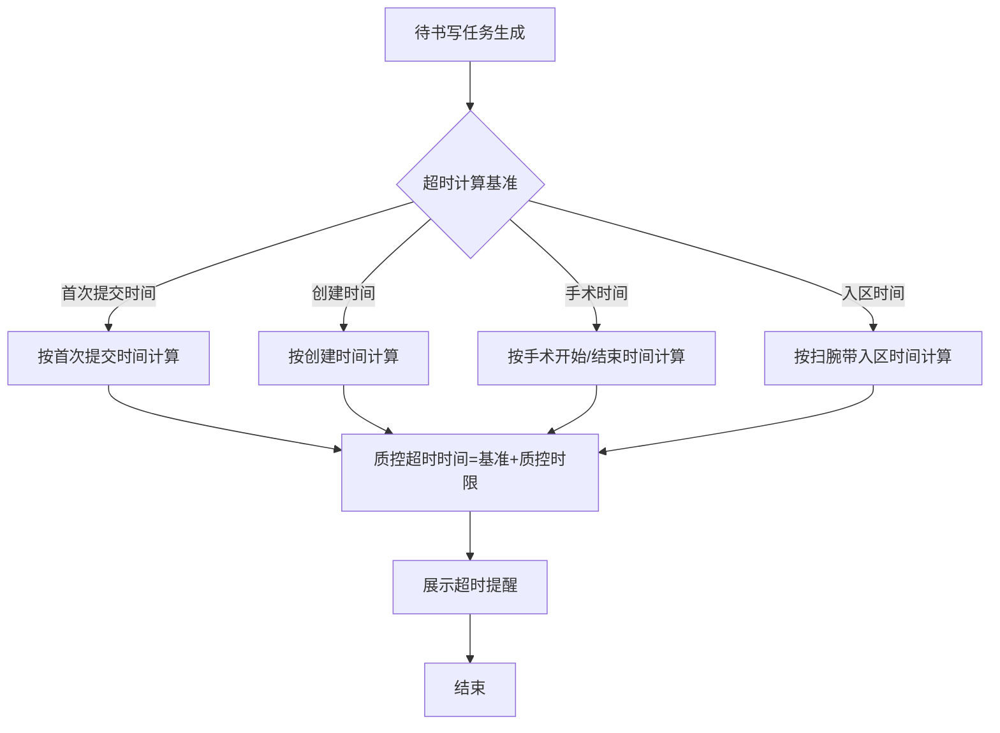
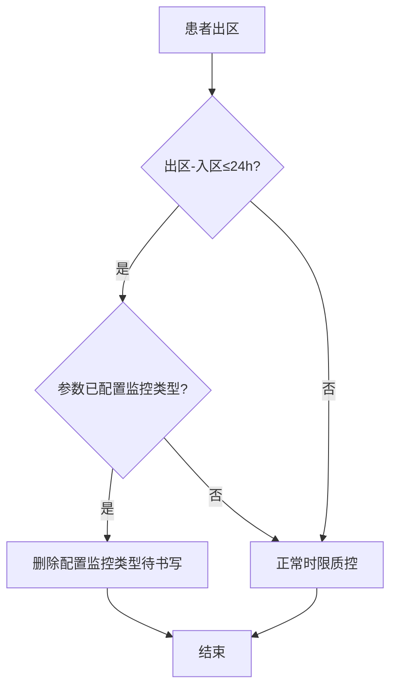

# BLGL-06-DSXTX-003时限质控与超时计算_ Analyst - Spec

> **需求编号**：BLGL-06-DSXTX-003
> **父需求**：BLGL-06-DSXTX
> **关联PM Spec**：BLGL-06-DSXTX-003_时限质控与超时计算_PM-spec.md
> **Spec版本**：V1.0
> **编写时间**：2026-08-14
> **编写人**：需求分析师

---

## 一、功能编号体系

### 1.1 功能层级结构

```
BLGL-06-DSXTX-003: 时限质控与超时计算
  ├─ BLGL-06-DSXTX-003-01: 超时时间计算
  │   ├─ -01-01: 按首次提交/创建时间计算
  │   ├─ -01-02: 手术时间计算（开始/结束事件）
  │   └─ -01-03: 入区扫腕带时间计算
  ├─ BLGL-06-DSXTX-003-02: 时限质控豁免与闭环
  │   ├─ -02-01: 24小时出入院豁免
  │   └─ -02-02: 输血评价单时限闭环
  └─ BLGL-06-DSXTX-003-03: 时限质控统计与提醒
      ├─ -03-01: 时限质控明细统计
      └─ -03-02: 诊疗计划剩余时间显示
```

### 1.2 功能编号表

| REQ-ID | 功能名称 | 类型 | 优先级 | 说明 |
|--------|---------|------|--------|------|
| BLGL-06-DSXTX-003-01 | 超时时间计算 | 功能 | P0 | 按多时间基准计算超时 |
| BLGL-06-DSXTX-003-01-01 | 首次提交/创建时间计算 | 子功能 | P0 | 按参数取值类型 |
| BLGL-06-DSXTX-003-01-02 | 手术时间计算 | 子功能 | P0 | 手术开始/结束事件 |
| BLGL-06-DSXTX-003-01-03 | 入区扫腕带时间 | 子功能 | P0 | 首次入院标识 |
| BLGL-06-DSXTX-003-02 | 时限质控豁免与闭环 | 功能 | P1 | 24小时豁免/输血闭环 |
| BLGL-06-DSXTX-003-02-01 | 24小时出入院豁免 | 子功能 | P1 | 删除配置监控类型待书写 |
| BLGL-06-DSXTX-003-02-02 | 输血评价单闭环 | 子功能 | P1 | 输血后24小时填写 |
| BLGL-06-DSXTX-003-03 | 时限质控统计与提醒 | 功能 | P1 | 统计与剩余时间显示 |
| BLGL-06-DSXTX-003-03-01 | 时限质控明细统计 | 子功能 | P1 | 质控系统统计 |
| BLGL-06-DSXTX-003-03-02 | 诊疗计划剩余时间 | 子功能 | P1 | remindAt-当前时间 |

---

## 二、核心业务流程

### 2.1 超时时间计算流程



### 2.2 24小时出入院豁免流程



---

## 三、功能规格说明

---

### BLGL-06-DSXTX-003-01: 超时时间计算

#### 3.1.1 功能概述

待书写任务超时时间按配置基准计算（病历创建时间/首次提交时间），手术相关病历按手麻系统手术开始/结束时间，入区待书写按扫腕带入区时间。

#### 3.1.2 用户角色

| 角色 | 使用场景 | 权限要求 | 操作频率 |
|------|---------|---------|---------|
| 住院医生 | 查看待书写超时提醒 | 病历编辑权限 | 高频 |
| 质控系统 | 计算超时/时限质控 | 质控权限 | 高频 |

#### 3.1.3 业务流程（Given/When/Then）

##### 主流程

**Scenario 1: 首次提交时间超时计算**

```gherkin
Given:
  - 待书写任务已生成
  - 参数取值类型=病历首次提交时间（true）

When:
  - 待书写任务从未完成更新为已完成

Then:
  - 超时时间按首次提交时间计算
  - 任务匹配病历首次提交时间字段填充
```

##### 异常流程

**Scenario 2: 业务异常——手术超时时间不准**

```gherkin
Given:
  - 手术记录待书写任务已生成

When:
  - 手术医嘱完成24小时书写手术记录

Then:
  - 超时提醒剩余时间应按手术结束时间更新
  - ⏳ 待确认：手术结束时间未更新时的处理
```

**Scenario 3: 数据异常——有书写仍被超时提醒**

```gherkin
Given:
  - 医生已按时书写病历

When:
  - 超时提醒持续触发

Then:
  - 应正确处理已完成待书写任务，不再提醒
  - ⏳ 待确认：已书写仍提醒的根因
```

##### 边界流程

**Scenario 4: 边界场景——手术结束事件更新超时**

```gherkin
Given:
  - 参数"是否通过手术结束事件更新超时时间"开启
  - 手术结束事件（399630436）触发

When:
  - 手术结束事件推送

Then:
  - 匹配手术待书写任务
  - 超时时间更新为【手术结束时间SURGERY_END_AT + 质控时限】
```

**Scenario 5: 边界场景——入区扫腕带**

```gherkin
Given:
  - 入区事件（399336099）触发
  - 接口传入【首次入院标识】

When:
  - 护士首次扫腕带

Then:
  - 首次入院标识为是：触发入区待书写
  - 标识为否：不触发入区待书写
```

#### 3.1.4 数据字段定义

> 字段名来自代码扫描（`E:\39EMR\sr-next`，标注 ``）和历史。

#### 3.1.5 验收标准

| AC编号 | 验收标准 | 对应REQ-ID | 验证方法 | 验证场景 |
|--------|---------|-----------|---------|---------|
| AC-001 | 超时按首次提交时间计算 | -003-01 | 功能测试 | Scenario 1 |
| AC-002 | 手术结束事件更新超时为SURGERY_END_AT+质控时限 | -003-01 | 集成测试 | Scenario 4 |
| AC-003 | 入区事件按首次入院标识判断 | -003-01 | 集成测试 | Scenario 5 |

---

### BLGL-06-DSXTX-003-02: 时限质控豁免与闭环

#### 3.2.1 功能概述

24小时出入院患者豁免部分时限质控（删除配置监控类型待书写）；输血后24小时内完成输血评价单填写并同步输血系统（电子病历五级闭环）。

#### 3.2.2 用户角色

| 角色 | 使用场景 | 权限要求 | 操作频率 |
|------|---------|---------|---------|
| 质控系统 | 24小时出入院豁免校验 | 质控权限 | 中频 |
| 住院医生 | 输血评价单填写 | 病历编辑权限 | 低频 |

#### 3.2.3 业务流程（Given/When/Then）

##### 主流程

**Scenario 1: 24小时出入院豁免**

```gherkin
Given:
  - 患者出区时间-入区时间≤24小时
  - 参数"24小时入出院患者无需质控的病历监控类型"已配置

When:
  - 患者出区

Then:
  - 删除配置的监控类型的待书写任务
  - 无需书写首次病程/主治查房/入院前三天日常病程
```

##### 边界流程

**Scenario 2: 边界场景——输血评价单闭环**

```gherkin
Given:
  - 输血结束

When:
  - 医生填写输血评价单（1-4部分）

Then:
  - 24小时内完成填写
  - 评价内容同步推送输血系统
  - 输血科完成第5部分终评后回写病历系统重新生成PDF
```

#### 3.2.4 数据字段定义

#### 3.2.5 验收标准

| AC编号 | 验收标准 | 对应REQ-ID | 验证方法 | 验证场景 |
|--------|---------|-----------|---------|---------|
| AC-004 | 24小时出入院患者删除配置监控类型待书写 | -003-02 | 功能测试 | Scenario 1 |
| AC-005 | 输血后24小时完成评价单并同步输血系统 | -003-02 | 集成测试 | Scenario 2 |

---

### BLGL-06-DSXTX-003-03: 时限质控统计与提醒

#### 3.3.1 功能概述

时限质控明细统计（质控系统），诊疗计划待书写剩余时间显示（remindAt-当前时间，<24h显示小时，>24h显示天）。

#### 3.3.2 用户角色

| 角色 | 使用场景 | 权限要求 | 操作频率 |
|------|---------|---------|---------|
| 质控办 | 时限质控明细统计 | 质控权限 | 中频 |
| 住院医生 | 诊疗计划查看剩余时间 | 病历编辑权限 | 高频 |

#### 3.3.3 业务流程（Given/When/Then）

##### 主流程

**Scenario 1: 诊疗计划剩余时间显示**

```gherkin
Given:
  - 待书写未超时任务

When:
  - 医生查看诊疗计划

Then:
  - 剩余时间=remindAt-当前时间
  - 剩余时间<24h显示"剩余n.x小时"
  - 剩余时间>24h显示"剩余n天"
```

##### 异常流程

**Scenario 2: 数据异常——时限质控明细统计缺失**

```gherkin
Given:
  - 时限规则已配置并启用

When:
  - 质控系统查询时限质控明细统计

Then:
  - 部分规则查不到数据
  - ⏳ 待确认：规则未统计到的原因
```

##### 边界流程

**Scenario 3: 边界场景——统计口径**

```gherkin
Given:
  - 时限质控明细统计

When:
  - 质控系统统计任务生成时间

Then:
  - 任务生成时间口径统一（拟手术时间/手术结束时间一致）
  - ⏳ 待确认：统计口径
```

#### 3.3.4 数据字段定义

#### 3.3.5 验收标准

| AC编号 | 验收标准 | 对应REQ-ID | 验证方法 | 验证场景 |
|--------|---------|-----------|---------|---------|
| AC-006 | 诊疗计划剩余时间<24h显示小时，>24h显示天 | -003-03 | 功能测试 | Scenario 1 |

---

## 四、排除范围

本需求不包含以下功能项：

1. **待书写任务生成** - 属 BLGL-06-DSXTX-001
2. **任务中心与提醒展示** - 属 BLGL-06-DSXTX-002
3. **待书写任务处理与状态** - 属 BLGL-06-DSXTX-004
4. **时限规则配置与参数** - 属 BLGL-06-DSXTX-005

> 与 PM-Spec 第四章一致。对照 Phase 1 功能点Spec 第6章（基线能力），确保不越界。

---

## 五、业务规则清单

| 规则ID | 规则名称 | 规则描述 | 来源 | 优先级 |
|--------|---------|---------|------|--------|
| BR-001 | 超时计算基准 | 超时按首次提交时间或创建时间（参数控制）计算 | | P0 |
| BR-002 | 手术超时 | 手术相关病历超时以手麻系统手术开始/结束时间为准 | 、332549 | P0 |
| BR-003 | 手术结束事件 | 手术结束事件（399630436）触发更新超时时间 | | P1 |
| BR-004 | 入区扫腕带 | 入区事件按首次入院标识判断，首次扫腕带才触发 | | P1 |
| BR-005 | 24小时豁免 | 出区-入区≤24h删除配置监控类型待书写 | | P1 |
| BR-006 | 输血闭环 | 输血后24小时完成评价单并同步输血系统 | | P1 |
| BR-007 | 剩余时间显示 | 诊疗计划剩余时间<24h显示小时，>24h显示天 | | P1 |

---

## 六、关联文档

| 文档类型 | 文档路径 | 说明 |
|---------|---------|------|
| PM-Spec（业务视角） | 本目录 BLGL-06-DSXTX-003_时限质控与超时计算_PM-spec.md（V0.1） | PM 产出的 Spec 文档 |
| Spec（研发视角） | 本目录 BLGL-06-DSXTX-003_时限质控与超时计算-Spec.md（V1.0） | 业务背景与目标 Spec |
| 功能点Spec（模块级） | BLGL-06-DSXTX 06待书写提醒功能点Spec.md（V1.0，上级目录） | Phase 1 功能点索引 |
| data-model.md | 待产出 | 架构师产出的数据建模文档 |
| design.md | 待产出 | 架构师产出的技术方案文档 |
| api-contract.md | 待产出 | 开发经理产出的 API 契约文档 |

---

## 七、待确认问题清单

| 编号 | 问题描述 | 缺失信息 | 影响范围 | 建议补充方 |
|------|---------|---------|---------|-----------|
| Q-001 | 手术结束时间未更新处理 | 超时更新失败降级 | 3.1.3 Scenario 2 | 开发经理 |
| Q-002 | 已书写仍提醒根因 | 已完成任务重复提醒原因 | 3.1.3 Scenario 3 | 开发经理 |
| Q-003 | 明细统计缺失根因 | 规则未统计原因 | 3.3.3 Scenario 2 | 开发经理 |
| Q-004 | 统计口径 | 任务生成时间取值统一 | 3.3.3 Scenario 3 | 产品经理 |
| Q-005 | 完整接口契约 | API 请求/返回字段 | 第5章接口设计 | 开发经理 |
| Q-006 | 概念ID、性能指标 | 字段概念ID、超时SLA | 数据模型、非功能 | 架构师/产品经理 |

---

## 填写检查清单

| 序号 | 检查项 | 是否完成 |
|:----:|--------|:--------:|
| 1 | 功能编号带父子层级 | ✅ |
| 2 | 每个 REQ-ID 有功能概述和用户角色 | ✅ |
| 3 | 主流程至少 1 个 Given/When/Then 场景 | ✅ |
| 4 | 异常流程至少 3 个 Given/When/Then 场景 | ✅ |
| 5 | 边界流程至少 2 个 Given/When/Then 场景 | ✅ |
| 6 | 每个 Given/When/Then 内容具体，不模糊 | ✅ |
| 7 | 数据字段定义完整 | ✅ |
| 8 | 验收标准 AC 编号独立，可验证 | ✅ |
| 9 | 验收标准无"功能正常"等模糊表述 | ✅ |
| 10 | 排除范围明确列出 | ✅ |
| 11 | 业务规则清单列出所有规则，每条标注来源 | ✅ |
| 12 | 流程图使用 Mermaid 格式（≥2 个） | ✅ |
| 13 | 关联文档索引包含 Phase 1 功能点Spec | ✅ |
| 14 | 待确认问题清单汇总了全文所有 ⏳ 项 | ✅ |
| 15 | 全文无占位符 `< >` 残留 | ✅ |
| 16 | 全文陈述可溯源至资料区（S1~S10 溯源核查） | ✅ |
| 17 | 人工审核确认完成 | ⏳ 待确认 |

---

**文档状态**：⬜ 待审核
**维护责任**：需求分析师规范组
**下次更新**：根据评审反馈优化

---

## 版本历史

| 版本 | 日期 | 变更说明 | 编写人 |
|------|------|---------|--------|
| V1.0 | 2026-08-14 | 初始版本 | 需求分析师 |
