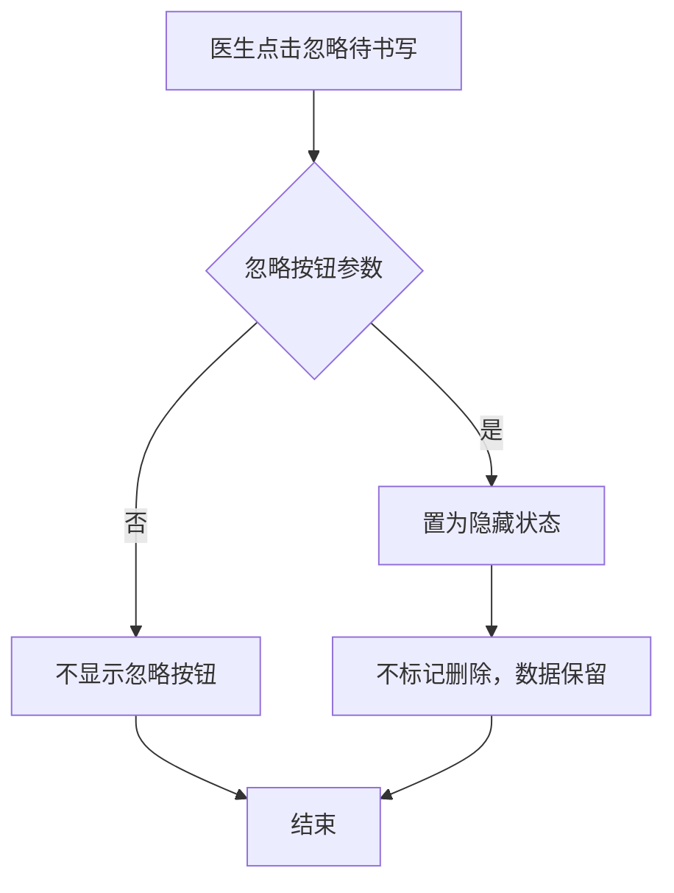
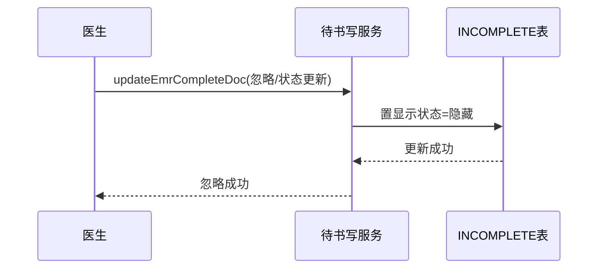

# BLGL-06-DSXTX-004 待书写任务处理与状态 - Spec

> **功能编号**：BLGL-06-DSXTX-004
> **文档类型**：Spec（研发视角）
> **文档版本**：V1.0
> **编写时间**：2026-08-14
> **编写人**：RACC

---

## 文档索引

#### 章节索引

**Spec（研发视角）**

| 章节号 | 章节名称 | 内容说明 |
|--------|---------|---------|
| 1、 | 文档概述 | 文档目的、文档范围、术语定义、阅读指南、参考文档 |
| 2、 | 功能背景与定位 | 功能背景、功能定位、目标用户、核心价值 |
| 3、 | 业务流程设计 | 主流程/异常流程/边界流程（Given/When/Then） |
| 4、 | 数据模型设计 | 核心数据结构、状态定义、系统参数定义 |
| 5、 | 接口契约设计 | API列表、接口详细设计、错误码定义 |
| 6、 | 技术方案设计 | 页面路径、技术栈、关键技术点、部署方案 |
| 7、 | 测试用例预设计 | 功能/边界/异常/性能测试用例 |
| 8、 | 非功能性要求 | 性能、安全、可用性、兼容性 |
| 9、 | 依赖与风险 | 外部依赖、风险项 |
| 10、 | 附录 | 流程图、时序图、参考文档 |

**PM-Spec（业务视角）**

| 章节号 | 章节名称 | 内容说明 |
|--------|---------|---------|
| 一 | 目标 | 功能定位与核心价值 |
| 二 | 约束 | 业务/技术/非功能性约束 |
| 三 | 验收标准 | 验收条件与验证方法 |
| 四 | 排除范围 | 本次不做项与明确边界 |
| 五 | 关键决策记录 | 方案决策与选型理由 |
| 六 | 优先级 | 优先级定义 |
| 七 | 关联文档 | 关联文档索引 |
| 附录 | 填写检查清单 | 质量检查 |

**Analyst-Spec（产品视角）**

| 章节号 | 章节名称 | 内容说明 |
|--------|---------|---------|
| 一 | 功能编号体系 | 功能编号与层级结构 |
| 二 | 核心业务流程 | 核心业务流程与时序 |
| 三 | 功能规格说明 | 详细功能规格与验收标准 |
| 四 | 排除范围 | 排除范围 |
| 五 | 业务规则清单 | 业务规则清单 |
| 六 | 关联文档 | 关联文档索引 |
| 七 | 待确认问题清单 | 待确认问题汇总 |
| - | 填写检查清单 | 质量检查 |

#### 版本历史

| 版本 | 日期 | 变更说明 | 编写人 |
|------|------|---------|--------|
| V1.0 | 2026-08-14 | 初始版本 | RACC |

#### 关联文档索引

| 序号 | 文档名称 | 文档类型 | 版本 | 位置 |
|------|---------|---------|------|------|
| 1 | BLGL-06-DSXTX-004_待书写任务处理与状态_PM-spec.md | PM-Spec（业务视角） | V0.1 | 本目录 |
| 2 | BLGL-06-DSXTX-004_待书写任务处理与状态_Analyst-spec.md | Analyst-Spec（产品视角） | V1.0 | 本目录 |
| 3 | BLGL-06-DSXTX-004_待书写任务处理与状态-Spec.md | Spec（研发视角） | V1.0 | 本目录 |
| 4 | BLGL-06-DSXTX 06待书写提醒功能点Spec.md | 功能点Spec（模块级） | V1.0 | 上级目录 |

---

## 1、文档概述

### 1.1、文档目的

本文档旨在明确"待书写任务处理与状态"功能（BLGL-06-DSXTX-004）的业务背景与设计方案，为需求分析、研发实现、测试验收及评审提供统一的业务上下文、设计口径与决策依据。

### 1.2、文档范围

#### 1.2.1 纳入范围

本文档覆盖待书写任务处理与状态的完整业务背景与设计，包括：

- 待书写文书点击忽略（仅隐藏，不删除）
- 病历删除还原待书写逻辑优化（替代组重新关联）
- 医嘱待书写作废增加事件监控
- 书写状态准确显示（进行中/已完成）
- 病历删除/作废后待书写任务处理

#### 1.2.2 排除范围

本文档不涉及以下内容（详见其他功能点或模块）：

- 待书写任务生成—— BLGL-06-DSXTX-001
- 任务中心与提醒展示—— BLGL-06-DSXTX-002
- 时限质控与超时计算—— BLGL-06-DSXTX-003
- 时限规则配置与参数—— BLGL-06-DSXTX-005

### 1.3、术语定义

| 术语 | 定义 |
|------|------|
| 忽略 | 待书写文书点击忽略后仅在页面隐藏，不标记删除 |
| 还原待书写 | 病历删除后待书写任务状态还原 |
| 书写状态 | 病历书写显示状态：进行中/已完成 |

> ⏳ 待确认：规范术语表待产品文档确认。

### 1.4、阅读指南

- **章节关系**：第1~2章为业务全貌，第3~10章为设计实现层。与 Analyst-Spec、PM-Spec 互相引用保持一致。
- **读者对象**：产品经理/需求分析师读第1~2章；研发读第3~6、9~10章；测试读第3、7~8章；评审人员核对各层一致性。

### 1.5、参考文档

| 序号 | 文档名称 | 版本/日期 |
|------|---------|----------|
| 1 | 【历史需求】住院病历的历史需求.xlsx | - |
| 2 | BLGL-06-DSXTX-004_待书写任务处理与状态_PM-spec.md | V0.1 |
| 3 | BLGL-06-DSXTX-004_待书写任务处理与状态_Analyst-spec.md | V1.0 |
| 4 | BLGL-06-DSXTX 06待书写提醒功能点Spec.md | V1.0 |

---

## 2、功能背景与定位

### 2.1 功能背景

待书写任务处理与状态是待书写任务的生命周期管理，需满足：

- **管理要求**：待书写文书处理（忽略/作废/还原）状态准确，书写状态显示真实
- **现状痛点**：
  - 点击忽略将待书写标记为删除，误操作不可恢复
  - 新创建病程记录未写内容、未签字却显示"已完成"
  - 病历删除后待书写状态未正确还原
- **历史需求演进**：从忽略标记删除 → 忽略仅隐藏→ 删除还原逻辑优化→ 医嘱作废事件监控→ 书写状态准确显示

### 2.2 功能定位

"待书写任务处理与状态"是 WiNEX 病历管理-待书写提醒模块的任务生命周期管理，定位为：

- **任务处理**：忽略/作废/还原待书写任务
- **状态准确**：书写状态（进行中/已完成）准确显示
- **数据一致性**：病历删除/医嘱作废后待书写正确还原

### 2.3 目标用户

| 用户角色 | 主要使用场景 |
|---------|-------------|
| 住院医生 | 忽略待书写、查看书写状态 |
| 系统（事件监听） | 医嘱作废/病历删除触发任务处理 |

### 2.4 核心价值

| 价值维度 | 价值描述 |
|---------|---------|
| 操作安全 | 忽略仅隐藏不删除，避免误操作 |
| 状态真实 | 书写状态准确显示 |
| 数据一致 | 病历删除/医嘱作废后待书写还原 |

---

## 3、业务流程设计（Given/When/Then）

### 3.1 主流程

**Scenario 1: 待书写文书忽略（仅隐藏）**

```gherkin
Given:
  - 医生在病历书写页面有待书写文书

When:
  - 医生点击忽略

Then:
  - 待书写任务置为隐藏状态（增加显示状态字段）
  - 不标记删除，数据保留
```

### 3.2 异常流程

**Scenario 2: 业务异常——忽略按钮参数控制**

```gherkin
Given:
  - 参数"待书写文书任务是否显示忽略按钮"配置为"否"

When:
  - 医生查看病历目录待书写/诊疗计划/待书写弹窗

Then:
  - 不显示忽略按钮
```

**Scenario 3: 数据异常——书写状态不准确**

```gherkin
Given:
  - 医生新建病程记录，未填写内容、未签字

When:
  - 医生查看病历书写显示总览

Then:
  - 状态应显示"进行中"而非"已完成"
  - 签字后状态变更为"已完成"
```

**Scenario 4: 系统异常——医嘱作废事件**

```gherkin
Given:
  - 医嘱生成的待书写任务

When:
  - 护士取消申请→取消签收→医生撤销医嘱

Then:
  - 需删除待书写任务（原仅医嘱作废时删除）
  - ⏳ 待确认：取消医嘱全流程事件监控
```

### 3.3 边界流程

**Scenario 5: 边界场景——病历删除还原待书写**

```gherkin
Given:
  - 病历删除后，关联书写任务状态将要还原成未书写

When:
  - 系统查找符合条件的新病历

Then:
  - 能找到：书写任务仍为已书写，关联新病历（时间正序最早）
  - 找不到：书写任务更新为未书写
```

**Scenario 6: 边界场景——忽略按钮显示开关**

```gherkin
Given:
  - 参数"待书写文书任务是否显示忽略按钮"默认为"是"

When:
  - 医生查看待书写

Then:
  - 显示忽略按钮
```

---

## 4、数据模型设计

> 数据模型信息来自代码扫描（`E:\39EMR\sr-next`）和历史。标注 `` 的表名/字段来自 PO 实体，标注 `` 的来自需求文本。

### 4.1 核心数据结构

#### 4.1.1 核心表/实体

| 表/实体 | 关键字段 | 说明 |
|---------|---------|------|
| INPATIENT_EMR_INCOMPLETE（InpatientEmrIncompletePO） | INP_EMR_INCOMPLETE_ID、INP_EMR_SET_ID、IS_DEL、显示状态字段 | 待书写文书主表，增加显示状态字段 |
| INP_EMR_INCOMPLETE_ORDER | - | 待书写医嘱关联（作废事件） |

> ⏳ 待确认：显示状态字段名待代码扫描补充。

#### 4.1.2 关键字段

| 字段名 | 类型 | 说明 |
|--------|------|------|
| INP_EMR_SET_ID | Long | 住院病历标识，需支持为空 |
| 显示状态 | String | 显示/隐藏，点击忽略置隐藏 |

### 4.2 状态定义

| 状态码 | 状态名称 | 说明 |
|--------|---------|------|
| 进行中 | 书写状态 | 新建未签字 |
| 已完成 | 书写状态 | 签字后 |
| 显示 | 显示状态 | 待书写显示 |
| 隐藏 | 显示状态 | 点击忽略置隐藏 |

### 4.3 系统参数定义

| 参数编码 | 参数名称 | 说明 |
|---------|---------|------|
| 待书写文书任务是否显示忽略按钮 | 忽略按钮开关 | 默认为是 |

---

## 5、接口契约设计

> 接口信息来自代码扫描（`E:\39EMR\sr-next`）的 InpEmrInCompleteDocController。标注 ``。

### 5.1 API列表

| 序号 | API名称（代码函数） | 路径 | 方法 | 说明 |
|:----:|---------|------|:----:|------|
| 1 | updateEmrCompleteDoc | /api/v1/app_record_inpatient/emr_inpatient/incomplete_doc/complete | POST | 更改未完成文书状态（忽略/完成） |
| 2 | updateEmrSetIncompleteReduce | /api/v1/app_record_inpatient/emr_inpatient/incomplete_doc/reduce | POST | 更新待书写任务（还原） |
| 3 | delInpatientEmrIncompleteDoc | /api/v1/app_record_inpatient/emr_inpatient/incomplete_doc/cmd_del/by_id | POST | 更新待书写任务-指令处理 |
| 4 | cancelTaskIncomplete | /api/v1/app_record_inpatient/emr_inpatient_task_complete_doc/cancel | POST | 取消任务中心待书写 |

> 前端实际请求前缀：`/inpatient-clinicalnote/api/v1/app_record_inpatient/`。

### 5.2 接口详细设计

#### 5.2.1 更改未完成文书状态（updateEmrCompleteDoc）

**请求参数（InpatientIncompleteDocUpdateInputAO）**:
```json
{
  "inpEmrIncompleteId": 5001,
  "status": "hidden"
}
```

**返回值（成功）**:
```json
{
  "success": true,
  "data": null
}
```

**返回值（失败）**:
```json
{
  "success": false,
  "message": "更新失败",
  "data": null
}
```

> ⏳ 待确认：具体字段名/结构以接口契约文档为准。

### 5.3 错误码定义

| 错误码 | 错误信息 | 处理方式 |
|--------|---------|---------|
| ⏳ 待确认 | 状态更新失败 | 提示错误并返回原状态 |

> ⏳ 待确认：业务错误码定义未在代码扫描中提取完整。

---

## 6、技术方案设计

### 6.1 页面路径

- **页面路径**: 住院医生站→病历书写页面→待书写文书；文书总览
- **后端接口**: InpEmrInCompleteDocController（tags: 住院病历待书写）

### 6.2 技术栈

| 类别 | 技术 | 版本 |
|------|------|------|
| 前端框架 | Vue | 2.6.14 |
| 前端UI | element-ui | 2.13.0 |
| 后端框架 | Spring Boot（Java） | java.version 17 |
| 构建工具 | webpack / Maven | 前端 webpack + 后端 Maven |

### 6.3 关键技术点

- 忽略仅隐藏：增加显示状态字段，点击忽略置隐藏不删除
- 还原待书写：病历删除后按替代组重新关联或更新未书写
- 医嘱作废事件：护士取消申请→取消签收→医生撤销全流程监控
- 书写状态：进行中/已完成准确显示
- INP_EMR_SET_ID 可为空

### 6.4 部署方案

⏳ 待确认：部署方案未在资料区中找到。

---

## 7、测试用例预设计

### 7.1 功能测试

| 用例编号 | 测试场景 | Given | When | Then |
|---------|---------|-------|------|------|
| TC-001 | 待书写忽略仅隐藏 | 有待书写文书 | 点击忽略 | 置隐藏，不删除 |
| TC-002 | 书写状态准确 | 新建病程未签字 | 查看总览 | 状态为进行中 |

### 7.2 边界测试

| 用例编号 | 测试场景 | Given | When | Then |
|---------|---------|-------|------|------|
| TC-003 | 忽略按钮开关 | 参数为否 | 查看待书写 | 不显示忽略按钮 |
| TC-004 | 病历删除还原 | 病历删除后 | 还原待书写 | 按替代组重新关联或更新未书写 |

### 7.3 异常测试

| 用例编号 | 测试场景 | Given | When | Then |
|---------|---------|-------|------|------|
| TC-005 | 医嘱作废事件 | 护士取消申请→取消签收→撤销 | 待书写处理 | 删除待书写 |
| TC-006 | INP_EMR_SET_ID 空 | 无关联病历 | 待书写 | 允许为空 |

### 7.4 性能测试

| 用例编号 | 测试场景 | 指标 |
|---------|---------|------|
| TC-007 | 任务状态更新响应 | ⏳ 待确认：性能指标未在资料区中找到 |

---

## 8、非功能性要求

### 8.1 性能要求

| 指标 | 要求 |
|------|------|
| 状态更新响应 | ⏳ 待确认 |

### 8.2 安全要求

| 要求 | 说明 |
|------|------|
| 忽略权限 | 按参数控制忽略按钮显示 |

**医疗行业特殊要求**

| 要求 | 说明 |
|------|------|
| 书写状态真实 | 防止未签字病历误标已完成 |

### 8.3 可用性要求

| 指标 | 要求值 |
|------|--------|
| 可用性 | ⏳ 待确认 |

### 8.4 兼容性要求

| 类型 | 要求 |
|------|------|
| 显示状态兼容 | 忽略仅隐藏不删除，历史数据兼容 |

---

## 9、依赖与风险

### 9.1 外部依赖

| 依赖项 | 说明 |
|--------|------|
| 医嘱系统 | 医嘱作废事件 |

### 9.2 风险项

| 风险项 | 等级 | 说明 | 应对方案 |
|--------|------|------|---------|
| 忽略误删 | 中 | 原忽略标记删除不可恢复 | 忽略仅隐藏 |
| 状态不准确 | 中 | 未签字显示已完成 | 状态字段准确更新 |
| 还原逻辑复杂 | 中 | 病历删除后替代组重新关联 | 按监控类型/时间排序关联 |

---

## 10、附录

### 10.1 流程图



### 10.2 时序图



### 10.3 参考文档

- 【历史需求】住院病历的历史需求.xlsx
- BLGL-06-DSXTX 06待书写提醒功能点Spec.md（V1.0，第5章 -004 行）
- 关联Spec: BLGL-06-DSXTX-001（任务生成）、-002（任务中心）

---

## 填写检查清单

| 序号 | 检查项 | 是否完成 |
|:----:|--------|:--------:|
| 1 | 章节索引与正文章节一致 | ✅ |
| 2 | 版本历史记录完整 | ✅ |
| 3 | 关联文档索引已登记全部Spec | ✅ |
| 4 | 文档目的明确回答"为什么做/做成什么/怎么做" | ✅ |
| 5 | 纳入范围/排除范围清晰 | ✅ |
| 6 | 术语定义覆盖关键概念，从资料区可溯源 | ✅ |
| 7 | 参考文档已登记 | ✅ |
| 8 | 功能背景基于法规/规范/需求来源组织 | ✅ |
| 9 | 功能定位体现业务价值（3~5个定位点） | ✅ |
| 10 | 目标用户角色覆盖完整，在需求原文中有出处 | ✅ |
| 11 | 核心价值可陈述，与 Phase 1 口径一致 | ✅ |
| 12 | 业务流程：主流程≥1、异常≥3、边界≥2，Given/When/Then 具体 | ✅ |
| 13 | 数据模型：字段/表/状态/参数可溯源 | ✅ |
| 14 | 接口契约：API列表+详细设计+错误码齐全或标记待确认 | ✅ |
| 15 | 技术方案：页面路径/技术栈/关键点/部署方案或标记待确认 | ✅ |
| 16 | 测试用例：功能/边界/异常/性能覆盖 | ✅ |
| 17 | 非功能性要求：性能/安全/可用性/兼容性指标可量化或标记待确认 | ✅ |
| 18 | 依赖与风险：外部依赖登记完整 | ✅ |
| 19 | 附录：流程图/时序图与正文流程一致 | ✅ |
| 20 | 全文无占位符 `< >` 残留 | ✅ |
| 21 | 全文陈述可溯源至资料区 | ✅ |
| 22 | 人工审核确认完成 | ⏳ 待确认 |

---

**文档状态**：⬜ 待审核
**维护责任**：RACC
**下次更新**：根据评审反馈优化
