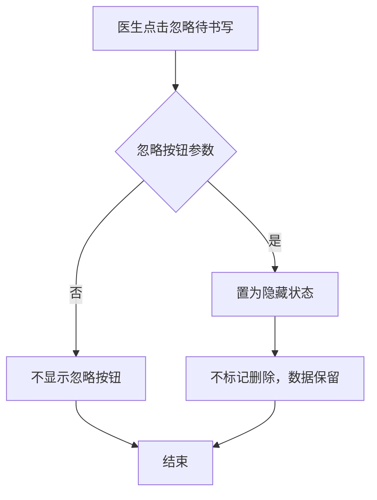
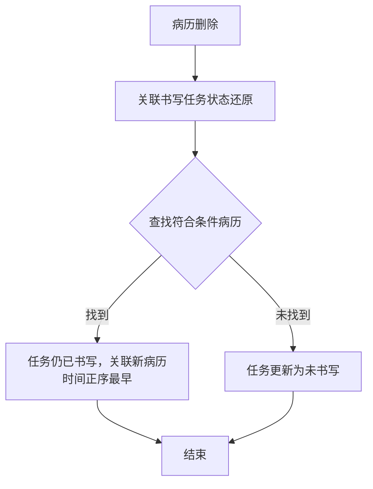

# BLGL-06-DSXTX-004待书写任务处理与状态_ Analyst - Spec

> **需求编号**：BLGL-06-DSXTX-004
> **父需求**：BLGL-06-DSXTX
> **关联PM Spec**：BLGL-06-DSXTX-004_待书写任务处理与状态_PM-spec.md
> **Spec版本**：V1.0
> **编写时间**：2026-08-14
> **编写人**：需求分析师

---

## 一、功能编号体系

### 1.1 功能层级结构

```
BLGL-06-DSXTX-004: 待书写任务处理与状态
  ├─ BLGL-06-DSXTX-004-01: 待书写忽略处理
  │   ├─ -01-01: 忽略仅隐藏（不删除）
  │   ├─ -01-02: 忽略按钮参数控制
  │   └─ -01-03: 忽略状态恢复
  ├─ BLGL-06-DSXTX-004-02: 待书写还原与作废
  │   ├─ -02-01: 病历删除还原待书写
  │   ├─ -02-02: 医嘱作废事件监控
  │   └─ -02-03: 还原按替代组重新关联
  └─ BLGL-06-DSXTX-004-03: 书写状态准确显示
      ├─ -03-01: 状态字段（进行中/已完成）
      └─ -03-02: INP_EMR_SET_ID 可为空
```

### 1.2 功能编号表

| REQ-ID | 功能名称 | 类型 | 优先级 | 说明 |
|--------|---------|------|--------|------|
| BLGL-06-DSXTX-004-01 | 待书写忽略处理 | 功能 | P0 | 忽略仅隐藏 |
| BLGL-06-DSXTX-004-01-01 | 忽略仅隐藏 | 子功能 | P0 | 置隐藏不删除 |
| BLGL-06-DSXTX-004-01-02 | 忽略按钮参数控制 | 子功能 | P1 | 按参数显示 |
| BLGL-06-DSXTX-004-02 | 待书写还原与作废 | 功能 | P0 | 还原/作废处理 |
| BLGL-06-DSXTX-004-02-01 | 病历删除还原 | 子功能 | P0 | 按替代组重新关联 |
| BLGL-06-DSXTX-004-02-02 | 医嘱作废事件监控 | 子功能 | P1 | 取消全流程监控 |
| BLGL-06-DSXTX-004-03 | 书写状态准确显示 | 功能 | P1 | 状态字段 |
| BLGL-06-DSXTX-004-03-01 | 状态字段 | 子功能 | P1 | 进行中/已完成 |
| BLGL-06-DSXTX-004-03-02 | INP_EMR_SET_ID可空 | 子功能 | P1 | 模型字段调整 |

---

## 二、核心业务流程

### 2.1 待书写忽略流程



### 2.2 病历删除还原流程



---

## 三、功能规格说明

---

### BLGL-06-DSXTX-004-01: 待书写忽略处理

#### 3.1.1 功能概述

待书写文书点击忽略仅置为隐藏状态，不标记删除，数据保留。忽略按钮按参数控制显示。

#### 3.1.2 用户角色

| 角色 | 使用场景 | 权限要求 | 操作频率 |
|------|---------|---------|---------|
| 住院医生 | 忽略待书写文书 | 病历编辑权限 | 中频 |

#### 3.1.3 业务流程（Given/When/Then）

##### 主流程

**Scenario 1: 待书写忽略（仅隐藏）**

```gherkin
Given:
  - 医生在病历书写页面有待书写文书

When:
  - 医生点击忽略

Then:
  - 待书写任务置为隐藏状态（增加显示状态字段）
  - 不标记删除，数据保留
```

##### 异常流程

**Scenario 2: 业务异常——忽略按钮参数控制**

```gherkin
Given:
  - 参数"待书写文书任务是否显示忽略按钮"配置为"否"

When:
  - 医生查看病历目录待书写/诊疗计划/待书写弹窗

Then:
  - 不显示忽略按钮
```

##### 边界流程

**Scenario 3: 边界场景——忽略后恢复**

```gherkin
Given:
  - 医生已忽略某待书写

When:
  - 医生后续查看待书写

Then:
  - 隐藏状态不删除，可通过状态字段管理
  - ⏳ 待确认：隐藏任务的恢复入口
```

#### 3.1.4 数据字段定义

> 字段名来自代码扫描（`E:\39EMR\sr-next`，标注 ``）。

#### 3.1.5 验收标准

| AC编号 | 验收标准 | 对应REQ-ID | 验证方法 | 验证场景 |
|--------|---------|-----------|---------|---------|
| AC-001 | 点击忽略后待书写置隐藏，不标记删除 | -004-01 | 功能测试 | Scenario 1 |
| AC-002 | 忽略按钮按参数控制显示 | -004-01 | 功能测试 | Scenario 2 |

---

### BLGL-06-DSXTX-004-02: 待书写还原与作废

#### 3.2.1 功能概述

病历删除后待书写状态还原（按替代组重新关联或更新未书写）；医嘱作废全流程（取消申请/签收/撤销）触发待书写处理。

#### 3.2.2 用户角色

| 角色 | 使用场景 | 权限要求 | 操作频率 |
|------|---------|---------|---------|
| 系统（事件监听） | 病历删除/医嘱作废触发 | 系统权限 | 中频 |

#### 3.2.3 业务流程（Given/When/Then）

##### 主流程

**Scenario 1: 病历删除还原待书写**

```gherkin
Given:
  - 病历删除后，关联书写任务状态将要还原成未书写

When:
  - 系统查找符合条件的新病历

Then:
  - 能找到：书写任务仍为已书写，关联新病历（时间正序最早）
  - 找不到：书写任务更新为未书写
```

##### 异常流程

**Scenario 2: 业务异常——医嘱作废事件**

```gherkin
Given:
  - 医嘱生成的待书写任务

When:
  - 护士取消申请→取消签收→医生撤销医嘱

Then:
  - 需删除待书写任务（原仅医嘱作废时删除）
  - ⏳ 待确认：取消医嘱全流程事件监控
```

##### 边界流程

**Scenario 3: 边界场景——手术类病历还原**

```gherkin
Given:
  - 手术类病历删除

When:
  - 还原待书写

Then:
  - 关联的手术医嘱和触发待书写任务的手术一样
  - 监控类型和书写任务一样
```

#### 3.2.4 数据字段定义

#### 3.2.5 验收标准

| AC编号 | 验收标准 | 对应REQ-ID | 验证方法 | 验证场景 |
|--------|---------|-----------|---------|---------|
| AC-003 | 病历删除后待书写按替代组重新关联或更新未书写 | -004-02 | 功能测试 | Scenario 1 |
| AC-004 | 医嘱取消全流程触发待书写删除 | -004-02 | 集成测试 | Scenario 2 |

---

### BLGL-06-DSXTX-004-03: 书写状态准确显示

#### 3.3.1 功能概述

病历书写显示总览中书写状态准确显示（进行中/已完成）；INP_EMR_SET_ID 支持为空。

#### 3.3.2 用户角色

| 角色 | 使用场景 | 权限要求 | 操作频率 |
|------|---------|---------|---------|
| 住院医生 | 查看书写状态 | 病历编辑权限 | 高频 |

#### 3.3.3 业务流程（Given/When/Then）

##### 主流程

**Scenario 1: 书写状态准确**

```gherkin
Given:
  - 医生新建病程记录，未填写内容、未签字

When:
  - 医生查看病历书写显示总览

Then:
  - 状态应显示"进行中"而非"已完成"
  - 填写内容后状态保持"进行中"
  - 签字后状态变更为"已完成"
```

##### 边界流程

**Scenario 2: 边界场景——模型字段可空**

```gherkin
Given:
  - 待书写文书模型 INPATIENT_EMR_INCOMPLETE

When:
  - 待书写无关联病历

Then:
  - INP_EMR_SET_ID 字段支持为空
```

#### 3.3.4 数据字段定义

#### 3.3.5 验收标准

| AC编号 | 验收标准 | 对应REQ-ID | 验证方法 | 验证场景 |
|--------|---------|-----------|---------|---------|
| AC-005 | 新建病程未签字显示"进行中"，签字后"已完成" | -004-03 | 功能测试 | Scenario 1 |
| AC-006 | INP_EMR_SET_ID 可为空 | -004-03 | 功能测试 | Scenario 2 |

---

## 四、排除范围

本需求不包含以下功能项：

1. **待书写任务生成** - 属 BLGL-06-DSXTX-001
2. **任务中心与提醒展示** - 属 BLGL-06-DSXTX-002
3. **时限质控与超时计算** - 属 BLGL-06-DSXTX-003
4. **时限规则配置与参数** - 属 BLGL-06-DSXTX-005

> 与 PM-Spec 第四章一致。对照 Phase 1 功能点Spec 第6章（基线能力），确保不越界。

---

## 五、业务规则清单

| 规则ID | 规则名称 | 规则描述 | 来源 | 优先级 |
|--------|---------|---------|------|--------|
| BR-001 | 忽略仅隐藏 | 待书写点击忽略仅置隐藏，不标记删除 | | P0 |
| BR-002 | 忽略按钮开关 | 忽略按钮按参数控制显示，默认是 | | P1 |
| BR-003 | 病历删除还原 | 病历删除后按替代组重新关联或更新未书写 | | P0 |
| BR-004 | 手术类还原 | 手术类病历还原关联手术医嘱和触发任务的手术一致 | | P1 |
| BR-005 | 医嘱作废事件 | 取消申请→签收→撤销全流程监控触发待书写处理 | | P1 |
| BR-006 | 书写状态 | 新建未签字为进行中，签字后已完成 | | P1 |
| BR-007 | 模型可空 | INP_EMR_SET_ID 支持为空 | | P1 |

---

## 六、关联文档

| 文档类型 | 文档路径 | 说明 |
|---------|---------|------|
| PM-Spec（业务视角） | 本目录 BLGL-06-DSXTX-004_待书写任务处理与状态_PM-spec.md（V0.1） | PM 产出的 Spec 文档 |
| Spec（研发视角） | 本目录 BLGL-06-DSXTX-004_待书写任务处理与状态-Spec.md（V1.0） | 业务背景与目标 Spec |
| 功能点Spec（模块级） | BLGL-06-DSXTX 06待书写提醒功能点Spec.md（V1.0，上级目录） | Phase 1 功能点索引 |
| data-model.md | 待产出 | 架构师产出的数据建模文档 |
| design.md | 待产出 | 架构师产出的技术方案文档 |
| api-contract.md | 待产出 | 开发经理产出的 API 契约文档 |

---

## 七、待确认问题清单

| 编号 | 问题描述 | 缺失信息 | 影响范围 | 建议补充方 |
|------|---------|---------|---------|-----------|
| Q-001 | 隐藏任务恢复入口 | 隐藏状态任务的恢复方案 | 3.1.3 Scenario 3 | 产品经理 |
| Q-002 | 医嘱作废全流程监控 | 取消申请/签收/撤销事件接入 | 3.2.3 Scenario 2 | 开发经理 |
| Q-003 | 完整接口契约 | API 请求/返回字段 | 第5章接口设计 | 开发经理 |
| Q-004 | 概念ID、性能指标 | 字段概念ID、更新SLA | 数据模型、非功能 | 架构师/产品经理 |

---

## 填写检查清单

| 序号 | 检查项 | 是否完成 |
|:----:|--------|:--------:|
| 1 | 功能编号带父子层级 | ✅ |
| 2 | 每个 REQ-ID 有功能概述和用户角色 | ✅ |
| 3 | 主流程至少 1 个 Given/When/Then 场景 | ✅ |
| 4 | 异常流程至少 3 个 Given/When/Then 场景 | ✅ |
| 5 | 边界流程至少 2 个 Given/When/Then 场景 | ✅ |
| 6 | 每个 Given/When/Then 内容具体，不模糊 | ✅ |
| 7 | 数据字段定义完整 | ✅ |
| 8 | 验收标准 AC 编号独立，可验证 | ✅ |
| 9 | 验收标准无"功能正常"等模糊表述 | ✅ |
| 10 | 排除范围明确列出 | ✅ |
| 11 | 业务规则清单列出所有规则，每条标注来源 | ✅ |
| 12 | 流程图使用 Mermaid 格式（≥2 个） | ✅ |
| 13 | 关联文档索引包含 Phase 1 功能点Spec | ✅ |
| 14 | 待确认问题清单汇总了全文所有 ⏳ 项 | ✅ |
| 15 | 全文无占位符 `< >` 残留 | ✅ |
| 16 | 全文陈述可溯源至资料区（S1~S10 溯源核查） | ✅ |
| 17 | 人工审核确认完成 | ⏳ 待确认 |

---

**文档状态**：⬜ 待审核
**维护责任**：需求分析师规范组
**下次更新**：根据评审反馈优化

---

## 版本历史

| 版本 | 日期 | 变更说明 | 编写人 |
|------|------|---------|--------|
| V1.0 | 2026-08-14 | 初始版本 | 需求分析师 |
