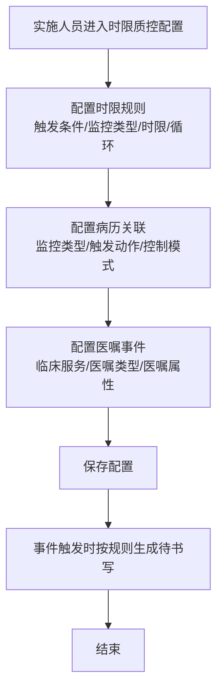
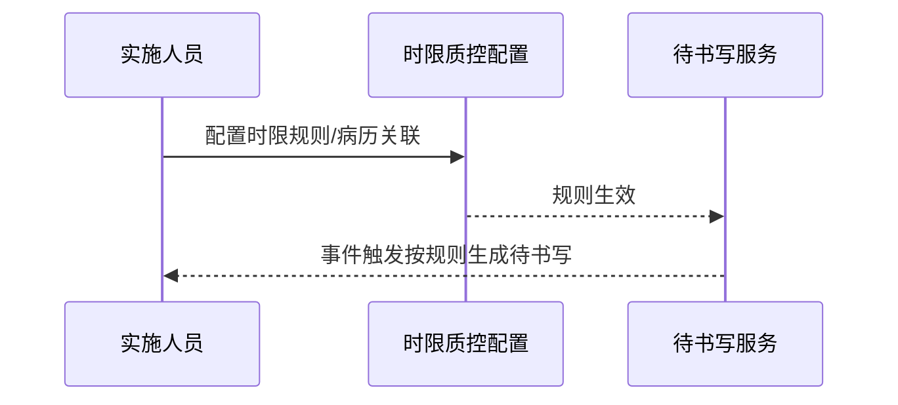

# BLGL-06-DSXTX-005 时限规则配置与参数 - Spec

> **功能编号**：BLGL-06-DSXTX-005
> **文档类型**：Spec（研发视角）
> **文档版本**：V1.0
> **编写时间**：2026-08-14
> **编写人**：RACC

---

## 文档索引

#### 章节索引

**Spec（研发视角）**

| 章节号 | 章节名称 | 内容说明 |
|--------|---------|---------|
| 1、 | 文档概述 | 文档目的、文档范围、术语定义、阅读指南、参考文档 |
| 2、 | 功能背景与定位 | 功能背景、功能定位、目标用户、核心价值 |
| 3、 | 业务流程设计 | 主流程/异常流程/边界流程（Given/When/Then） |
| 4、 | 数据模型设计 | 核心数据结构、状态定义、系统参数定义 |
| 5、 | 接口契约设计 | API列表、接口详细设计、错误码定义 |
| 6、 | 技术方案设计 | 页面路径、技术栈、关键技术点、部署方案 |
| 7、 | 测试用例预设计 | 功能/边界/异常/性能测试用例 |
| 8、 | 非功能性要求 | 性能、安全、可用性、兼容性 |
| 9、 | 依赖与风险 | 外部依赖、风险项 |
| 10、 | 附录 | 流程图、时序图、参考文档 |

**PM-Spec（业务视角）**

| 章节号 | 章节名称 | 内容说明 |
|--------|---------|---------|
| 一 | 目标 | 功能定位与核心价值 |
| 二 | 约束 | 业务/技术/非功能性约束 |
| 三 | 验收标准 | 验收条件与验证方法 |
| 四 | 排除范围 | 本次不做项与明确边界 |
| 五 | 关键决策记录 | 方案决策与选型理由 |
| 六 | 优先级 | 优先级定义 |
| 七 | 关联文档 | 关联文档索引 |
| 附录 | 填写检查清单 | 质量检查 |

**Analyst-Spec（产品视角）**

| 章节号 | 章节名称 | 内容说明 |
|--------|---------|---------|
| 一 | 功能编号体系 | 功能编号与层级结构 |
| 二 | 核心业务流程 | 核心业务流程与时序 |
| 三 | 功能规格说明 | 详细功能规格与验收标准 |
| 四 | 排除范围 | 排除范围 |
| 五 | 业务规则清单 | 业务规则清单 |
| 六 | 关联文档 | 关联文档索引 |
| 七 | 待确认问题清单 | 待确认问题汇总 |
| - | 填写检查清单 | 质量检查 |

#### 版本历史

| 版本 | 日期 | 变更说明 | 编写人 |
|------|------|---------|--------|
| V1.0 | 2026-08-14 | 初始版本 | RACC |

#### 关联文档索引

| 序号 | 文档名称 | 文档类型 | 版本 | 位置 |
|------|---------|---------|------|------|
| 1 | BLGL-06-DSXTX-005_时限规则配置与参数_PM-spec.md | PM-Spec（业务视角） | V0.1 | 本目录 |
| 2 | BLGL-06-DSXTX-005_时限规则配置与参数_Analyst-spec.md | Analyst-Spec（产品视角） | V1.0 | 本目录 |
| 3 | BLGL-06-DSXTX-005_时限规则配置与参数-Spec.md | Spec（研发视角） | V1.0 | 本目录 |
| 4 | BLGL-06-DSXTX 06待书写提醒功能点Spec.md | 功能点Spec（模块级） | V1.0 | 上级目录 |

---

## 1、文档概述

### 1.1、文档目的

本文档旨在明确"时限规则配置与参数"功能（BLGL-06-DSXTX-005）的业务背景与设计方案，为需求分析、研发实现、测试验收及评审提供统一的业务上下文、设计口径与决策依据。

### 1.2、文档范围

#### 1.2.1 纳入范围

本文档覆盖时限规则配置与参数的完整业务背景与设计，包括：

- 时限质控规则配置（触发条件/监控类型/时限/循环/替代组）
- 病历关联待书写配置（监控类型/触发动作/控制模式）
- 医嘱事件配置（判断条件含医嘱属性）
- 手术类别/会诊类型关联条件
- 参数配置（手动关联开关、科室过滤、单条任务、提醒开关等）

#### 1.2.2 排除范围

本文档不涉及以下内容（详见其他功能点或模块）：

- 待书写任务生成—— BLGL-06-DSXTX-001
- 任务中心与提醒展示—— BLGL-06-DSXTX-002
- 时限质控与超时计算—— BLGL-06-DSXTX-003
- 待书写任务处理与状态—— BLGL-06-DSXTX-004

### 1.3、术语定义

| 术语 | 定义 |
|------|------|
| 时限质控规则 | 触发条件+监控类型+时限+循环的配置 |
| 病历关联配置 | 监控类型+触发动作+控制模式（提醒/限制） |
| 医嘱事件配置 | 医嘱事件判断条件（临床服务/医嘱类型/医嘱属性） |
| 替代组 | 监控类型与可替代项的替代关系 |

> ⏳ 待确认：规范术语表待产品文档确认。

### 1.4、阅读指南

- **章节关系**：第1~2章为业务全貌，第3~10章为设计实现层。与 Analyst-Spec、PM-Spec 互相引用保持一致。
- **读者对象**：产品经理/需求分析师读第1~2章；研发读第3~6、9~10章；测试读第3、7~8章；评审人员核对各层一致性。

### 1.5、参考文档

| 序号 | 文档名称 | 版本/日期 |
|------|---------|----------|
| 1 | 【历史需求】住院病历的历史需求.xlsx | - |
| 2 | BLGL-06-DSXTX-005_时限规则配置与参数_PM-spec.md | V0.1 |
| 3 | BLGL-06-DSXTX-005_时限规则配置与参数_Analyst-spec.md | V1.0 |
| 4 | BLGL-06-DSXTX 06待书写提醒功能点Spec.md | V1.0 |

---

## 2、功能背景与定位

### 2.1 功能背景

时限规则配置与参数是待书写提醒的定义态基础，需满足：

- **管理要求**：定义时限质控规则、病历关联配置、医嘱事件配置，驱动待书写生成
- **现状痛点**：
  - 时限规则配置后质控系统不生效
  - 出院记录质控规则开启后无数据
  - 医嘱事件判断条件缺少医嘱属性
- **历史需求演进**：从基础时限规则配置 → 病历关联配置→ 手术类别/会诊类型关联→ 医嘱属性判断→ 参数增强

### 2.2 功能定位

"时限规则配置与参数"是 WiNEX 病历管理-待书写提醒模块的定义态基础，定位为：

- **规则定义**：配置时限质控规则驱动待书写生成
- **病历关联**：配置病历与待书写的关联（提醒/限制）
- **参数治理**：科室过滤、单条任务、提醒开关等参数

### 2.3 目标用户

| 用户角色 | 主要使用场景 |
|---------|-------------|
| 病案管理员/实施人员 | 配置时限规则、病历关联、医嘱事件 |
| 质控办 | 配置质控规则参数 |

### 2.4 核心价值

| 价值维度 | 价值描述 |
|---------|---------|
| 灵活配置 | 规则/关联/事件多维配置 |
| 规则准确 | 手术类别/医嘱属性判断 |
| 参数治理 | 科室过滤/单条任务/提醒开关 |

---

## 3、业务流程设计（Given/When/Then）

### 3.1 主流程

**Scenario 1: 时限规则配置**

```gherkin
Given:
  - 实施人员/病案管理员有配置权限
  - 配置路径：病历业务配置-时限质控配置

When:
  - 实施人员配置时限质控规则（触发条件/监控类型/时限/循环）
  - 保存规则

Then:
  - 规则配置成功
  - 事件触发时按规则生成待书写
  - 规则在质控系统生效
```

### 3.2 异常流程

**Scenario 2: 业务异常——规则不生效**

```gherkin
Given:
  - 时限规则已配置并启用

When:
  - 质控系统查询时限数据

Then:
  - 部分规则查不到数据
  - ⏳ 待确认：规则不生效原因
```

**Scenario 3: 数据异常——病历关联配置**

```gherkin
Given:
  - 配置页面新增病历关联配置

When:
  - 新增关联配置（监控类型/触发动作/控制模式）

Then:
  - 保存成功，控制模式=提醒/限制生效
  - 监控类型在配置中时创建病历需选择待书写
```

**Scenario 4: 系统异常——医嘱事件属性缺失**

```gherkin
Given:
  - 术后医嘱需要和医嘱属性相关

When:
  - 配置医嘱事件判断条件

Then:
  - 判断条件增加医嘱属性（术前/术中/术后）
  - ⏳ 待确认：属性值域配置
```

### 3.3 边界流程

**Scenario 5: 边界场景——手术类别关联**

```gherkin
Given:
  - 规则配置了手术类别（DHCV01890 手术操作类别代码）

When:
  - 手术医嘱触发

Then:
  - 主手术手术类别 surgeryTypeCode 符合配置时触发待书写
```

**Scenario 6: 边界场景——会诊类型关联**

```gherkin
Given:
  - 规则配置了会诊类型

When:
  - 会诊意见答复触发

Then:
  - 只有配置的会诊类型才提醒书写会诊记录
  - 如北大只有多学科联合会诊才提醒
```

---

## 4、数据模型设计

> 数据模型信息来自代码扫描（`E:\39EMR\sr-next`）和历史。标注 `` 的字段来自 PO 实体，标注 `` 的来自需求文本。

### 4.1 核心数据结构

#### 4.1.1 核心表/实体

| 表/实体 | 关键字段 | 说明 |
|---------|---------|------|
| 时限质控规则表 | 触发条件/监控类型/时限/循环 | 时限规则配置 |
| 病历关联配置表 | 监控类型/触发动作/控制模式 | 病历关联配置 |
| 医嘱事件配置表 | 临床服务/医嘱类型/医嘱属性 | 医嘱事件配置 |
| INP_EMR_TIME_QCR_ORDER_REL | - | 时限质控医嘱关联 |

> ⏳ 待确认：完整数据表清单待代码扫描或功能清单数据表清单补充。

### 4.2 状态定义

| 状态码 | 状态名称 | 说明 |
|--------|---------|------|
| 启用 | 规则状态 | 规则启用 |
| 停用 | 规则状态 | 规则停用 |

### 4.3 系统参数定义

| 参数编码 | 参数名称 | 说明 |
|---------|---------|------|
| 是否启用新建病历手动关联待书写的功能 | 手动关联开关 | 默认否 |
| 需要按照登录科室过滤的待书写监控类型 | 科室过滤监控类型 | 默认{转出记录，转入记录} |
| 每次就诊只需要生成一条待书写任务的病历监控类型 | 单条任务监控类型 | 多选 |
| COMMON172 | 是否开启提醒责任医生的待书写任务弹窗 | 默认否 |
| AT003 | 患者归档提醒的发送人 | 增加责任医生选项 |

---

## 5、接口契约设计

> 接口信息来自代码扫描（`E:\39EMR\sr-next`）和。标注 `` 或 ``。

### 5.1 API列表

| 序号 | API名称（代码函数） | 路径 | 方法 | 说明 |
|:----:|---------|------|:----:|------|
| 1 | 时限规则配置保存 | ⏳ 待确认：时限质控规则配置接口 | POST | 保存时限规则 |
| 2 | 病历关联配置保存 | ⏳ 待确认：病历关联配置接口 | POST | 保存病历关联配置 |
| 3 | 医嘱事件配置 | ⏳ 待确认：医嘱事件配置接口 | POST | 配置医嘱事件判断条件 |
| 4 | queryInpEmrMonitorInRuleWithIncomplete | /api/v1/app_record_inpatient/emr_inpatient/monitor_in_rule_with_incomplete/query | POST | 查询监控规则与待书写 |

> ⏳ 待确认：时限规则/病历关联/医嘱事件配置接口待接口文档补充。

### 5.2 接口详细设计

#### 5.2.1 时限规则配置

> ⏳ 待确认：时限规则配置接口契约待接口文档补充，当前为配置场景描述。

### 5.3 错误码定义

| 错误码 | 错误信息 | 处理方式 |
|--------|---------|---------|
| ⏳ 待确认 | 规则保存失败 | 提示错误并返回配置页 |

> ⏳ 待确认：错误码定义未在代码扫描中提取完整。

---

## 6、技术方案设计

### 6.1 页面路径

- **页面路径**: 病历业务配置→时限质控配置→参数配置/规则配置
- **前端工程**: 管理端配置页面

> ⏳ 待确认：配置页面组件待代码扫描补充。

### 6.2 技术栈

| 类别 | 技术 | 版本 |
|------|------|------|
| 前端框架 | ⏳ 待确认 | ⏳ 待确认 |
| 后端框架 | ⏳ 待确认 | ⏳ 待确认 |

> ⏳ 待确认：配置服务技术栈待代码扫描。

### 6.3 关键技术点

- 时限规则配置：触发条件+监控类型+时限+循环
- 病历关联配置：监控类型/触发动作/控制模式（提醒/限制）
- 医嘱事件配置：判断条件增加医嘱属性
- 手术类别关联：DHCV01890 手术操作类别代码
- 会诊类型关联：按会诊类型提醒

### 6.4 部署方案

⏳ 待确认：部署方案未在资料区中找到。

---

## 7、测试用例预设计

### 7.1 功能测试

| 用例编号 | 测试场景 | Given | When | Then |
|---------|---------|-------|------|------|
| TC-001 | 时限规则配置 | 实施人员有配置权限 | 配置规则并保存 | 规则保存成功，事件触发生成 |
| TC-002 | 病历关联配置 | 新增关联配置 | 保存 | 控制模式=提醒/限制生效 |

### 7.2 边界测试

| 用例编号 | 测试场景 | Given | When | Then |
|---------|---------|-------|------|------|
| TC-003 | 手术类别关联 | 配置急诊手术 | 手术医嘱触发 | 不生成术前讨论 |
| TC-004 | 会诊类型关联 | 配置多学科会诊 | 会诊答复 | 仅配置类型提醒 |

### 7.3 异常测试

| 用例编号 | 测试场景 | Given | When | Then |
|---------|---------|-------|------|------|
| TC-005 | 规则不生效 | 规则已启用 | 质控系统查询 | 修复规则不生效 |
| TC-006 | 医嘱属性缺失 | 术后医嘱 | 配置判断条件 | 增加医嘱属性 |

### 7.4 性能测试

| 用例编号 | 测试场景 | 指标 |
|---------|---------|------|
| TC-007 | 规则配置响应 | ⏳ 待确认：性能指标未在资料区中找到 |

---

## 8、非功能性要求

### 8.1 性能要求

| 指标 | 要求 |
|------|------|
| 规则配置响应 | ⏳ 待确认 |

### 8.2 安全要求

| 要求 | 说明 |
|------|------|
| 配置权限 | 仅实施人员/病案管理员可配置 |

**医疗行业特殊要求**

| 要求 | 说明 |
|------|------|
| 规则合规 | 时限规则配置支撑质控合规 |

### 8.3 可用性要求

| 指标 | 要求值 |
|------|--------|
| 可用性 | ⏳ 待确认 |

### 8.4 兼容性要求

| 类型 | 要求 |
|------|------|
| 规则生效 | 配置后规则在质控系统生效 |

---

## 9、依赖与风险

### 9.1 外部依赖

| 依赖项 | 说明 |
|--------|------|
| 主数据系统 | 参数配置存储 |
| 医嘱系统 | 医嘱事件属性 |

### 9.2 风险项

| 风险项 | 等级 | 说明 | 应对方案 |
|--------|------|------|---------|
| 规则不生效 | 中 | 配置后质控系统不生效 | 排查规则生效链路 |
| 配置复杂 | 中 | 多维配置（规则/关联/事件） | 配置页面引导 |

---

## 10、附录

### 10.1 流程图



### 10.2 时序图



### 10.3 参考文档

- 【历史需求】住院病历的历史需求.xlsx（、372356、253722、329651、389513、990534、1372436、1487769 等）
- BLGL-06-DSXTX 06待书写提醒功能点Spec.md（V1.0，第5章 -005 行）
- 关联Spec: BLGL-06-DSXTX-001（任务生成）、-003（超时计算）

---

## 填写检查清单

| 序号 | 检查项 | 是否完成 |
|:----:|--------|:--------:|
| 1 | 章节索引与正文章节一致 | ✅ |
| 2 | 版本历史记录完整 | ✅ |
| 3 | 关联文档索引已登记全部Spec | ✅ |
| 4 | 文档目的明确回答"为什么做/做成什么/怎么做" | ✅ |
| 5 | 纳入范围/排除范围清晰 | ✅ |
| 6 | 术语定义覆盖关键概念，从资料区可溯源 | ✅ |
| 7 | 参考文档已登记 | ✅ |
| 8 | 功能背景基于法规/规范/需求来源组织 | ✅ |
| 9 | 功能定位体现业务价值（3~5个定位点） | ✅ |
| 10 | 目标用户角色覆盖完整，在需求原文中有出处 | ✅ |
| 11 | 核心价值可陈述，与 Phase 1 口径一致 | ✅ |
| 12 | 业务流程：主流程≥1、异常≥3、边界≥2，Given/When/Then 具体 | ✅ |
| 13 | 数据模型：字段/表/状态/参数可溯源 | ✅ |
| 14 | 接口契约：API列表+详细设计+错误码齐全或标记待确认 | ✅ |
| 15 | 技术方案：页面路径/技术栈/关键点/部署方案或标记待确认 | ✅ |
| 16 | 测试用例：功能/边界/异常/性能覆盖 | ✅ |
| 17 | 非功能性要求：性能/安全/可用性/兼容性指标可量化或标记待确认 | ✅ |
| 18 | 依赖与风险：外部依赖登记完整 | ✅ |
| 19 | 附录：流程图/时序图与正文流程一致 | ✅ |
| 20 | 全文无占位符 `< >` 残留 | ✅ |
| 21 | 全文陈述可溯源至资料区 | ✅ |
| 22 | 人工审核确认完成 | ⏳ 待确认 |

---

**文档状态**：⬜ 待审核
**维护责任**：RACC
**下次更新**：根据评审反馈优化
