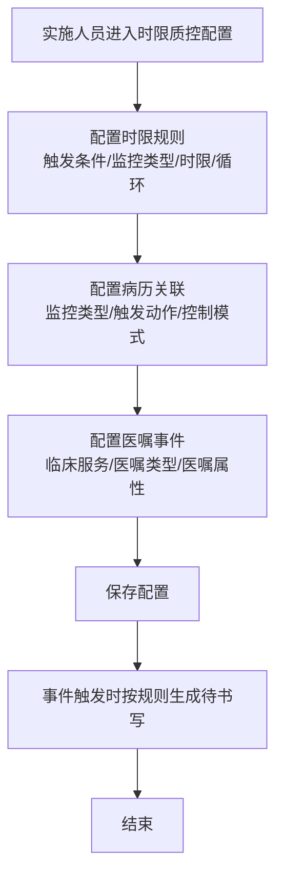
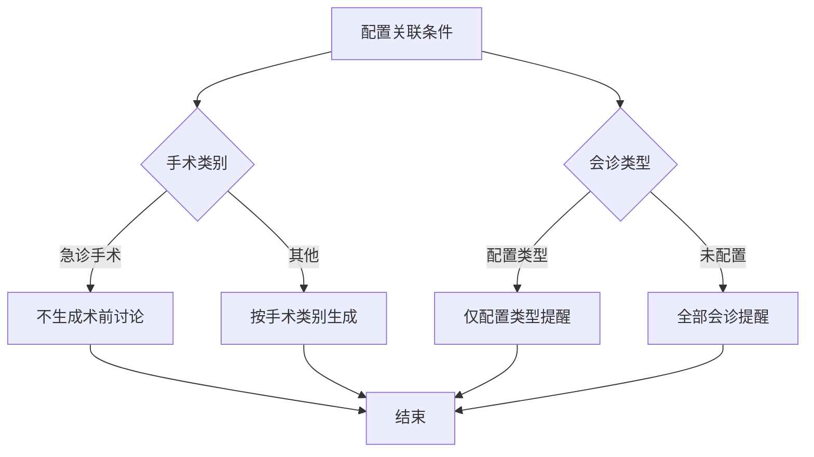

# BLGL-06-DSXTX-005时限规则配置与参数_ Analyst - Spec

> **需求编号**：BLGL-06-DSXTX-005
> **父需求**：BLGL-06-DSXTX
> **关联PM Spec**：BLGL-06-DSXTX-005_时限规则配置与参数_PM-spec.md
> **Spec版本**：V1.0
> **编写时间**：2026-08-14
> **编写人**：需求分析师

---

## 一、功能编号体系

### 1.1 功能层级结构

```
BLGL-06-DSXTX-005: 时限规则配置与参数
  ├─ BLGL-06-DSXTX-005-01: 时限质控规则配置
  │   ├─ -01-01: 规则新增/修改（触发条件/监控类型/时限/循环）
  │   ├─ -01-02: 手术类别关联条件
  │   └─ -01-03: 会诊类型关联条件
  ├─ BLGL-06-DSXTX-005-02: 病历关联配置
  │   ├─ -02-01: 关联配置新增/修改（监控类型/触发动作/控制模式）
  │   └─ -02-02: 控制模式生效（提醒/限制）
  ├─ BLGL-06-DSXTX-005-03: 医嘱事件配置
  │   └─ -03-01: 判断条件（临床服务/医嘱类型/医嘱属性）
  └─ BLGL-06-DSXTX-005-04: 参数配置
      ├─ -04-01: 手动关联开关
      ├─ -04-02: 科室过滤监控类型
      └─ -04-03: 单条任务监控类型
```

### 1.2 功能编号表

| REQ-ID | 功能名称 | 类型 | 优先级 | 说明 |
|--------|---------|------|--------|------|
| BLGL-06-DSXTX-005-01 | 时限质控规则配置 | 功能 | P0 | 规则配置 |
| BLGL-06-DSXTX-005-01-01 | 规则新增/修改 | 子功能 | P0 | 触发条件/监控类型/时限/循环 |
| BLGL-06-DSXTX-005-01-02 | 手术类别关联 | 子功能 | P1 | DHCV01890 |
| BLGL-06-DSXTX-005-01-03 | 会诊类型关联 | 子功能 | P1 | 按会诊类型提醒 |
| BLGL-06-DSXTX-005-02 | 病历关联配置 | 功能 | P0 | 控制模式 |
| BLGL-06-DSXTX-005-02-01 | 关联配置新增/修改 | 子功能 | P0 | 监控类型/触发动作/控制模式 |
| BLGL-06-DSXTX-005-02-02 | 控制模式生效 | 子功能 | P1 | 提醒/限制 |
| BLGL-06-DSXTX-005-03 | 医嘱事件配置 | 功能 | P1 | 判断条件 |
| BLGL-06-DSXTX-005-03-01 | 判断条件配置 | 子功能 | P1 | 医嘱属性 |
| BLGL-06-DSXTX-005-04 | 参数配置 | 功能 | P1 | 多参数 |
| BLGL-06-DSXTX-005-04-01 | 手动关联开关 | 子功能 | P1 | 默认否 |
| BLGL-06-DSXTX-005-04-02 | 科室过滤监控类型 | 子功能 | P1 | 默认{转出记录，转入记录} |
| BLGL-06-DSXTX-005-04-03 | 单条任务监控类型 | 子功能 | P1 | 多选 |

---

## 二、核心业务流程

### 2.1 时限规则配置流程



### 2.2 手术类别/会诊类型关联流程



---

## 三、功能规格说明

---

### BLGL-06-DSXTX-005-01: 时限质控规则配置

#### 3.1.1 功能概述

配置时限质控规则（触发条件/监控类型/时限/循环），支持手术类别/会诊类型关联条件。

#### 3.1.2 用户角色

| 角色 | 使用场景 | 权限要求 | 操作频率 |
|------|---------|---------|---------|
| 实施人员/病案管理员 | 配置时限规则 | 配置权限 | 低频 |

#### 3.1.3 业务流程（Given/When/Then）

##### 主流程

**Scenario 1: 时限规则配置**

```gherkin
Given:
  - 实施人员有配置权限
  - 配置路径：病历业务配置-时限质控配置

When:
  - 实施人员配置时限质控规则（触发条件/监控类型/时限/循环）
  - 保存规则

Then:
  - 规则配置成功
  - 事件触发时按规则生成待书写
```

##### 异常流程

**Scenario 2: 业务异常——规则不生效**

```gherkin
Given:
  - 时限规则已配置并启用

When:
  - 质控系统查询时限数据

Then:
  - 部分规则查不到数据
  - ⏳ 待确认：规则不生效原因
```

##### 边界流程

**Scenario 3: 边界场景——手术类别关联**

```gherkin
Given:
  - 规则配置了手术类别（DHCV01890）

When:
  - 手术医嘱触发

Then:
  - 主手术手术类别 surgeryTypeCode 符合配置时触发
  - 急诊手术不生成术前讨论
```

**Scenario 4: 边界场景——会诊类型关联**

```gherkin
Given:
  - 规则配置了会诊类型

When:
  - 会诊意见答复触发

Then:
  - 只有配置的会诊类型才提醒书写会诊记录
```

#### 3.1.4 数据字段定义

#### 3.1.5 验收标准

| AC编号 | 验收标准 | 对应REQ-ID | 验证方法 | 验证场景 |
|--------|---------|-----------|---------|---------|
| AC-001 | 配置时限规则后事件触发按规则生成待书写 | -005-01 | 集成测试 | Scenario 1 |
| AC-002 | 手术类别为急诊时不生成术前讨论 | -005-01 | 功能测试 | Scenario 3 |
| AC-003 | 会诊类型配置后仅配置类型提醒 | -005-01 | 功能测试 | Scenario 4 |

---

### BLGL-06-DSXTX-005-02: 病历关联配置

#### 3.2.1 功能概述

配置病历关联待书写（监控类型/触发动作/控制模式），控制模式=提醒/限制。监控类型在配置中时创建病历需选择待书写。

#### 3.2.2 用户角色

| 角色 | 使用场景 | 权限要求 | 操作频率 |
|------|---------|---------|---------|
| 实施人员/病案管理员 | 配置病历关联 | 配置权限 | 低频 |

#### 3.2.3 业务流程（Given/When/Then）

##### 主流程

**Scenario 1: 病历关联配置**

```gherkin
Given:
  - 实施人员进入时限质控配置

When:
  - 新增病历关联配置（监控类型/触发动作/控制模式）
  - 保存

Then:
  - 配置保存成功
  - 控制模式=提醒：创建病历提示选择待书写
  - 控制模式=限制：创建病历必须选择待书写
```

##### 异常流程

**Scenario 2: 数据异常——配置校验**

```gherkin
Given:
  - 新增关联配置弹窗

When:
  - 实施人员填写配置

Then:
  - 提示信息限制50字以内
  - 控制模式单选{提醒，限制}
```

#### 3.2.4 数据字段定义

#### 3.2.5 验收标准

| AC编号 | 验收标准 | 对应REQ-ID | 验证方法 | 验证场景 |
|--------|---------|-----------|---------|---------|
| AC-004 | 病历关联配置控制模式=提醒/限制生效 | -005-02 | 功能测试 | Scenario 1 |
| AC-005 | 提示信息限制50字以内 | -005-02 | 功能测试 | Scenario 2 |

---

### BLGL-06-DSXTX-005-03: 医嘱事件配置

#### 3.3.1 功能概述

医嘱事件配置判断条件（临床服务/医嘱类型/医嘱属性），医嘱属性值域{术前医嘱，术中医嘱，术后医嘱}。

#### 3.3.2 用户角色

| 角色 | 使用场景 | 权限要求 | 操作频率 |
|------|---------|---------|---------|
| 实施人员 | 配置医嘱事件 | 配置权限 | 低频 |

#### 3.3.3 业务流程（Given/When/Then）

##### 主流程

**Scenario 1: 医嘱事件配置**

```gherkin
Given:
  - 实施人员进入医嘱事件配置页面

When:
  - 配置判断条件，增加医嘱属性（术前/术中/术后）

Then:
  - 判断条件包含医嘱属性
  - 医嘱开立时选择属性，签收后按规则触发待书写
```

##### 边界流程

**Scenario 2: 边界场景——多维度判断**

```gherkin
Given:
  - 医嘱事件同时配置临床服务/医嘱类型/医嘱属性

When:
  - 判断医嘱是否属于该事件

Then:
  - 依次从临床服务→医嘱类型→医嘱属性判断
  - 只要有一项符合即满足医嘱事件
```

#### 3.3.4 数据字段定义

#### 3.3.5 验收标准

| AC编号 | 验收标准 | 对应REQ-ID | 验证方法 | 验证场景 |
|--------|---------|-----------|---------|---------|
| AC-006 | 医嘱事件配置支持医嘱属性判断 | -005-03 | 功能测试 | Scenario 1 |

---

### BLGL-06-DSXTX-005-04: 参数配置

#### 3.4.1 功能概述

配置参数（手动关联开关、科室过滤监控类型、单条任务监控类型、提醒开关等）。

#### 3.4.2 用户角色

| 角色 | 使用场景 | 权限要求 | 操作频率 |
|------|---------|---------|---------|
| 病案管理员 | 配置参数 | 配置权限 | 低频 |

#### 3.4.3 业务流程（Given/When/Then）

##### 主流程

**Scenario 1: 参数配置**

```gherkin
Given:
  - 病案管理员有配置权限

When:
  - 配置参数（手动关联开关/科室过滤/单条任务）

Then:
  - 手动关联开关=是：创建病历选择待书写
  - 科室过滤：配置监控类型按登录科室过滤
  - 单条任务：每次就诊只生成一条
```

##### 边界流程

**Scenario 2: 边界场景——科室过滤默认值**

```gherkin
Given:
  - 参数"需要按照登录科室过滤的待书写监控类型"

When:
  - 查看默认配置

Then:
  - 默认{转出记录，转入记录}
  - 可下拉选择病历监控类型，多选
```

#### 3.4.4 数据字段定义

#### 3.4.5 验收标准

| AC编号 | 验收标准 | 对应REQ-ID | 验证方法 | 验证场景 |
|--------|---------|-----------|---------|---------|
| AC-007 | 手动关联开关=是时创建病历选择待书写 | -005-04 | 功能测试 | Scenario 1 |
| AC-008 | 科室过滤默认{转出记录，转入记录}，可多选 | -005-04 | 功能测试 | Scenario 2 |

---

## 四、排除范围

本需求不包含以下功能项：

1. **待书写任务生成** - 属 BLGL-06-DSXTX-001
2. **任务中心与提醒展示** - 属 BLGL-06-DSXTX-002
3. **时限质控与超时计算** - 属 BLGL-06-DSXTX-003
4. **待书写任务处理与状态** - 属 BLGL-06-DSXTX-004

> 与 PM-Spec 第四章一致。对照 Phase 1 功能点Spec 第6章（基线能力），确保不越界。

---

## 五、业务规则清单

| 规则ID | 规则名称 | 规则描述 | 来源 | 优先级 |
|--------|---------|---------|------|--------|
| BR-001 | 规则配置 | 时限规则配置触发条件+监控类型+时限+循环 | | P0 |
| BR-002 | 手术类别 | 手术类别关联条件（DHCV01890） | | P1 |
| BR-003 | 会诊类型 | 会诊类型关联条件，仅配置类型提醒 | | P1 |
| BR-004 | 病历关联 | 病历关联配置监控类型/触发动作/控制模式 | | P0 |
| BR-005 | 控制模式 | 控制模式={提醒，限制} | | P1 |
| BR-006 | 医嘱属性 | 医嘱事件判断条件增加医嘱属性 | | P1 |
| BR-007 | 手动关联开关 | 参数控制手动关联，默认否 | | P1 |
| BR-008 | 科室过滤 | 按参数配置科室过滤待书写监控类型 | | P1 |
| BR-009 | 单条任务 | 每次就诊只生成一条待书写的监控类型 | | P1 |

---

## 六、关联文档

| 文档类型 | 文档路径 | 说明 |
|---------|---------|------|
| PM-Spec（业务视角） | 本目录 BLGL-06-DSXTX-005_时限规则配置与参数_PM-spec.md（V0.1） | PM 产出的 Spec 文档 |
| Spec（研发视角） | 本目录 BLGL-06-DSXTX-005_时限规则配置与参数-Spec.md（V1.0） | 业务背景与目标 Spec |
| 功能点Spec（模块级） | BLGL-06-DSXTX 06待书写提醒功能点Spec.md（V1.0，上级目录） | Phase 1 功能点索引 |
| data-model.md | 待产出 | 架构师产出的数据建模文档 |
| design.md | 待产出 | 架构师产出的技术方案文档 |
| api-contract.md | 待产出 | 开发经理产出的 API 契约文档 |

---

## 七、待确认问题清单

| 编号 | 问题描述 | 缺失信息 | 影响范围 | 建议补充方 |
|------|---------|---------|---------|-----------|
| Q-001 | 规则不生效根因 | 配置后质控系统不生效原因 | 3.1.3 Scenario 2 | 开发经理 |
| Q-002 | 医嘱属性值域配置 | 术前/术中/术后值域配置 | 3.3.3 Scenario 1 | 产品经理 |
| Q-003 | 配置接口契约 | 规则/关联/事件配置接口 | 第5章接口设计 | 开发经理 |
| Q-004 | 概念ID、性能指标 | 字段概念ID、配置SLA | 数据模型、非功能 | 架构师/产品经理 |

---

## 填写检查清单

| 序号 | 检查项 | 是否完成 |
|:----:|--------|:--------:|
| 1 | 功能编号带父子层级 | ✅ |
| 2 | 每个 REQ-ID 有功能概述和用户角色 | ✅ |
| 3 | 主流程至少 1 个 Given/When/Then 场景 | ✅ |
| 4 | 异常流程至少 3 个 Given/When/Then 场景 | ✅ |
| 5 | 边界流程至少 2 个 Given/When/Then 场景 | ✅ |
| 6 | 每个 Given/When/Then 内容具体，不模糊 | ✅ |
| 7 | 数据字段定义完整 | ✅ |
| 8 | 验收标准 AC 编号独立，可验证 | ✅ |
| 9 | 验收标准无"功能正常"等模糊表述 | ✅ |
| 10 | 排除范围明确列出 | ✅ |
| 11 | 业务规则清单列出所有规则，每条标注来源 | ✅ |
| 12 | 流程图使用 Mermaid 格式（≥2 个） | ✅ |
| 13 | 关联文档索引包含 Phase 1 功能点Spec | ✅ |
| 14 | 待确认问题清单汇总了全文所有 ⏳ 项 | ✅ |
| 15 | 全文无占位符 `< >` 残留 | ✅ |
| 16 | 全文陈述可溯源至资料区（S1~S10 溯源核查） | ✅ |
| 17 | 人工审核确认完成 | ⏳ 待确认 |

---

**文档状态**：⬜ 待审核
**维护责任**：需求分析师规范组
**下次更新**：根据评审反馈优化

---

## 版本历史

| 版本 | 日期 | 变更说明 | 编写人 |
|------|------|---------|--------|
| V1.0 | 2026-08-14 | 初始版本 | 需求分析师 |
