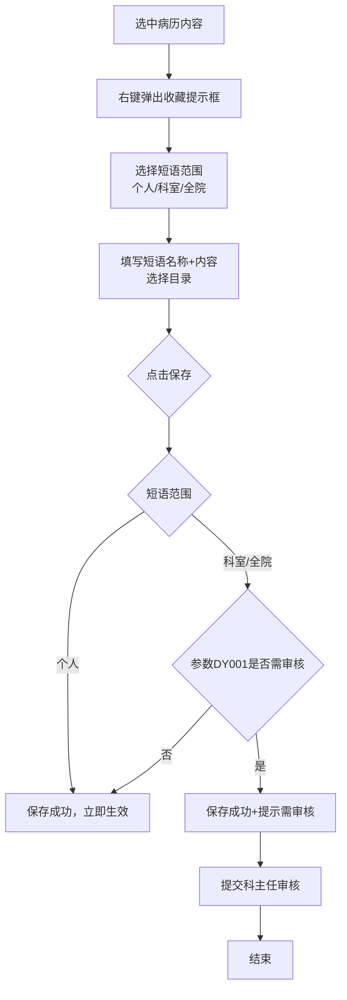
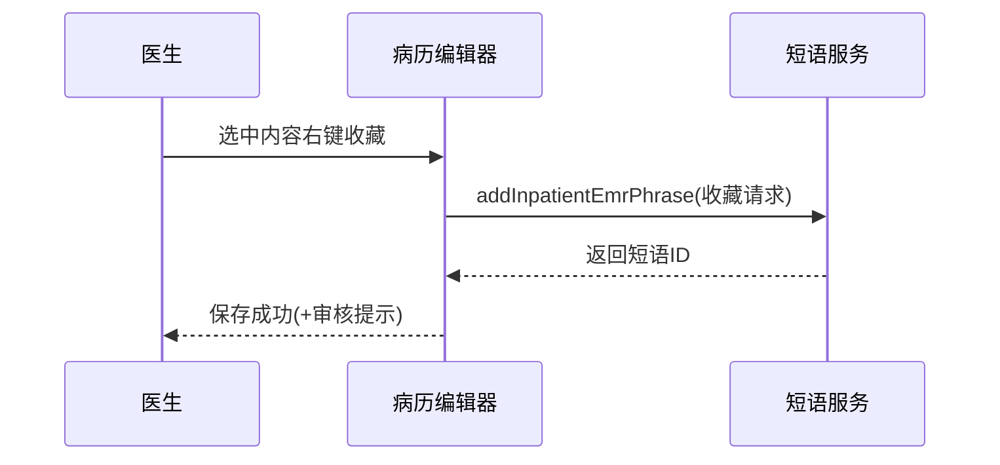

# BLGL-07-DYGL-001 短语收藏与创建 - Spec

> **功能编号**：BLGL-07-DYGL-001
> **文档类型**：功能Spec（业务背景与设计）
> **文档版本**：V1.0
> **编写时间**：2026-08-14
> **编写人**：RACC

---

## 文档索引

#### 章节索引

**Spec（研发视角）**

| 章节号 | 章节名称 | 内容说明 |
|--------|---------|---------|
| 1、 | 文档概述 | 文档目的、文档范围、术语定义、阅读指南、参考文档 |
| 2、 | 功能背景与定位 | 功能背景、功能定位、目标用户、核心价值 |
| 3、 | 业务流程设计 | 主流程/异常流程/边界流程（Given/When/Then） |
| 4、 | 数据模型设计 | 核心数据结构、状态定义、系统参数定义 |
| 5、 | 接口契约设计 | API列表、接口详细设计、错误码定义 |
| 6、 | 技术方案设计 | 页面路径、技术栈、关键技术点、部署方案 |
| 7、 | 测试用例预设计 | 功能/边界/异常/性能测试用例 |
| 8、 | 非功能性要求 | 性能、安全、可用性、兼容性 |
| 9、 | 依赖与风险 | 外部依赖、风险项 |
| 10、 | 附录 | 流程图、时序图、参考文档 |

**PM-Spec（业务视角）**

| 章节号 | 章节名称 | 内容说明 |
|--------|---------|---------|
| 一 | 目标 | 功能定位与核心价值 |
| 二 | 约束 | 业务/技术/非功能性约束 |
| 三 | 验收标准 | 验收条件与验证方法 |
| 四 | 排除范围 | 本次不做项与明确边界 |
| 五 | 关键决策记录 | 方案决策与选型理由 |
| 六 | 优先级 | 优先级定义 |
| 七 | 关联文档 | 关联文档索引 |
| 附录 | 填写检查清单 | 质量检查 |

**Analyst-Spec（产品视角）**

| 章节号 | 章节名称 | 内容说明 |
|--------|---------|---------|
| 一 | 功能编号体系 | 功能编号与层级结构 |
| 二 | 核心业务流程 | 核心业务流程与时序 |
| 三 | 功能规格说明 | 详细功能规格与验收标准 |
| 四 | 排除范围 | 排除范围 |
| 五 | 业务规则清单 | 业务规则清单 |
| 六 | 关联文档 | 关联文档索引 |
| 七 | 待确认问题清单 | 待确认问题汇总 |
| - | 填写检查清单 | 质量检查 |

#### 版本历史

| 版本 | 日期 | 变更说明 | 编写人 |
|------|------|---------|--------|
| V1.0 | 2026-08-14 | 初始版本 | RACC |

#### 关联文档索引

| 序号 | 文档名称 | 文档类型 | 版本 | 位置 |
|------|---------|---------|------|------|
| 1 | BLGL-07-DYGL 07短语管理功能点Spec.md | 功能点Spec（模块级） | V1.0 | 上级目录 |
| 2 | BLGL-07-DYGL-001_短语收藏与创建-Spec.md | 功能Spec（业务背景与设计）（本文档） | V1.0 | 本目录 |
| 3 | BLGL-07-DYGL-001_短语收藏与创建_Analyst-spec.md | Analyst-Spec（分析规格） | V1.0 | 本目录 |
| 4 | BLGL-07-DYGL-001_短语收藏与创建_PM-spec.md | PM-Spec（需求规格） | V0.1 | 本目录 |

---

## 1、文档概述

### 1.1、文档目的

本文档旨在明确"短语收藏与创建"功能（BLGL-07-DYGL-001）的业务背景与设计方案，为需求分析、研发实现、测试验收及评审提供统一的业务上下文、设计口径与决策依据。

### 1.2、文档范围

#### 1.2.1 纳入范围

本文档覆盖短语收藏与创建的完整业务背景与设计，包括：

- 医生在病历编辑界面选中结构化内容，右键收藏为个人或科室短语
- 收藏弹窗：选择短语范围（个人/科室/全院）、填写短语名称与内容、选择一级/二级目录
- 科室/全院短语保存后需经科主任审核方可使用（审核提示）
- 收藏成功后提示（含审核提示文案优化）

#### 1.2.2 排除范围

本文档不涉及以下内容（详见其他功能点或模块）：

- 短语审核（科主任审核通过/驳回）—— BLGL-07-DYGL-002
- 短语引用与快捷检索（引用插入病历）—— BLGL-07-DYGL-003
- 短语维护（编辑/删除/排序）—— BLGL-07-DYGL-004
- 短语审核与权限参数配置（审核开关等参数）—— BLGL-07-DYGL-005
- 短语目录维护、共享、导入迁移 —— Phase 1 功能点Spec 第6章基础能力（BC-DYGL-001~007）

### 1.3、术语定义

| 术语 | 定义 |
|------|------|
| 短语收藏 | 医生选中病历内容右键收藏为个人/科室/全院短语 |
| 短语范围 | 个人/科室/全院三级 |
| 科室短语 | 按 DEPT_ID 隔离存储，仅当前登录科室可见 |
| 审核提示 | 科室/全院短语需科主任审核通过后方可使用 |

> ⏳ 待确认：规范术语表待产品文档确认。

### 1.4、阅读指南

- **章节关系**：第1~2章为业务全貌，第3~10章为设计实现层。与 Analyst-Spec、PM-Spec 互相引用保持一致。
- **读者对象**：产品经理/需求分析师读第1~2章；研发读第3~6、9~10章；测试读第3、7~8章；评审人员核对各层一致性。

### 1.5、参考文档

| 序号 | 文档名称 | 版本/日期 |
|------|---------|----------|
| 1 | 【历史需求】住院病历的历史需求.xlsx | - |
| 2 | BLGL-07-DYGL-001_短语收藏与创建_PM-spec.md | V0.1 |
| 3 | BLGL-07-DYGL-001_短语收藏与创建_Analyst-spec.md | V1.0 |
| 4 | BLGL-07-DYGL 07短语管理功能点Spec.md | V1.0 |

---

## 2、功能背景与定位

### 2.1 功能背景

短语收藏与创建是短语管理体系的入口，需满足：

- **管理要求**：医生需要将常用病历内容收藏为短语，支持个人/科室/全院三级，供书写病历反复引用
- **现状痛点**：
  - 收藏保存后仅提示"短语收藏成功！"，未告知科室短语需科主任审核后才能使用，现场医生反复咨询
  - 收藏弹窗目录下拉框提示"请选择目录"，未体现支持手动输入，导致使用困惑
- **历史需求演进**：从右键收藏→ 收藏提交审核→ 收藏审核提示优化（3、1703116）→ 收藏BUG修复（4）

### 2.2 功能定位

"短语收藏与创建"是 WiNEX 病历管理-短语管理模块的短语来源入口，定位为：

- **短语内容来源**：医生将常用文本收藏为个人/科室/全院短语
- **内容标准化**：按病历结构化内容收藏，支持选择目录分类
- **审核前置环节**：科室/全院短语收藏后进入审核流程

### 2.3 目标用户

| 用户角色 | 主要使用场景 |
|---------|-------------|
| 住院医生 | 在病历编辑界面选中内容收藏为个人/科室短语 |
| 科室管理者 | 创建科室短语（需科主任审核） |

### 2.4 核心价值

| 价值维度 | 价值描述 |
|---------|---------|
| 效率提升 | 常用内容一次收藏、反复引用 |
| 体验优化 | 收藏审核提示清晰，避免现场误判 |
| 流程合规 | 科室/全院短语需审核后生效 |

---

## 3、业务流程设计（Given/When/Then）

### 3.1 主流程

**Scenario 1: 短语收藏**

```gherkin
Given:
  - 医生已登录并在病历编辑界面
  - 病历中已有待收藏的结构化内容

When:
  - 医生选中病历中的结构化内容
  - 右键弹出收藏提示框
  - 选择短语范围（个人/科室/全院）、填写短语名称、选择一级/二级目录
  - 点击保存

Then:
  - 个人短语保存成功，立即生效可引用
  - 科室/全院短语保存成功后提示审核提示（"当前科室/全院短语需审核通过后方可使用！"）
```

### 3.2 异常流程

**Scenario 2: 业务异常——短语名称含特殊字符**

```gherkin
Given:
  - 医生在维护科室短语时输入短语名称

When:
  - 短语名称加"-"后继续输入

Then:
  - 系统不应阻止正常输入（原"不让敲写骨折的折"问题）
  - ⏳ 待确认：短语名称特殊字符校验规则
```

**Scenario 3: 数据异常——收藏目录选择**

```gherkin
Given:
  - 医生在收藏弹窗选择一级/二级目录

When:
  - 目录下拉框仅显示"请选择目录"

Then:
  - 目录选择框应提示支持手动输入
  - ⏳ 待确认：目录手动输入的完整交互
```

**Scenario 4: 系统异常——收藏BUG**

```gherkin
Given:
  - 医生执行短语收藏操作

When:
  - 收藏过程中出现异常

Then:
  - 系统应正确处理收藏异常
  - ⏳ 待确认：收藏BUG 1314584 的具体异常场景
```

### 3.3 边界流程

**Scenario 5: 边界场景——个人/科室短语差异**

```gherkin
Given:
  - 医生收藏个人短语或科室短语

When:
  - 医生点击保存

Then:
  - 个人短语立即生效
  - 科室短语需科主任审核通过后方可使用
```

**Scenario 6: 边界场景——审核参数为否**

```gherkin
Given:
  - 参数 DY001（科室或院级短语是否需要审核）设置为"否"

When:
  - 医生收藏科室/全院短语并保存

Then:
  - 不提示审核，短语直接生效
```

---

## 4、数据模型设计

> 数据模型信息来自代码扫描（`E:\39EMR\sr-next`）和历史需求。标注 `` 的字段来自输入 AO/PO 实体，标注 `` 的来自需求文本。

### 4.1 核心数据结构

#### 4.1.1 核心保存请求（AddInpatientEmrPhraseInputAO）

| 字段名 | 类型 | 必填 | 备注 |
|--------|------|------|------|
| inpEmrPhraseName | String | 是 | 短语名称 |
| inpEmrPhraseScopeCode | Long | 是 | 短语范围：个人/科室/全院 |
| inpEmrPhraseCatagoryId | Long | 是 | 短语目录ID（一级/二级） |
| deptId | Long | 否 | 科室ID（科室短语时必填） |
| shareDeptIds | List\<Long\> | 否 | 共享科室 |
| inpEmrPhraseContentData | String | 是 | 短语内容（编辑器块格式，保留换行/空格） |
| inpEmrPhraseContentTxt | String | 是 | 短语纯文本内容 |
| enabledFlag | Long | 是 | 启用标志 |
| seqNo | Integer | 否 | 排序序号 |
| oneLevelPhraseClassId | Long | 否 | 一级目录ID |

> ⏳ 待确认：完整入参结构待接口契约文档补充。

#### 4.1.2 核心表/实体

| 表/实体 | 关键字段 | 说明 |
|---------|---------|------|
| INPATIENT_EMR_PHRASE（InpatientEmrPhrasePO） | INP_EMR_PHRASE_ID、INP_EMR_PHRASE_NAME、INP_EMR_PHRASE_SCOPE_CODE、DEPT_ID、CURRENT_DEPT_ID、PINYIN、WUBI、ENABLED_FLAG、SEQ_NO | 短语主表，收藏/创建结果 |
| INPATIENT_EMR_PHRASE_CONTENT（InpatientEmrPhraseContentPO） | 短语内容 | 短语内容表，存编辑器块格式+纯文本 |
| INPATIENT_EMR_PHRASE_REVIEW | 审核记录 | 科室/全院短语审核记录 |

> ⏳ 待确认：完整数据表清单待代码扫描或功能清单数据表清单补充。

### 4.2 状态定义

| 状态码 | 状态名称 | 说明 |
|--------|---------|------|
| enabledFlag | 启用标志 | 0禁用/1启用 |
| 审核状态 | 待审核/已通过/已驳回 | 科室/全院短语审核状态 |

> ⏳ 待确认：审核状态枚举值未在代码扫描中提取完整。

### 4.3 系统参数定义

| 参数编码 | 参数名称 | 说明 |
|---------|---------|------|
| DY001 | 科室或院级短语是否需要审核 | 默认是；设置为"是"时科室/全院短语需审核 |

---

## 5、接口契约设计

> 接口信息来自代码扫描（`E:\39EMR\sr-next`）的 InpatientEmrPhraseController。标注 ``。

### 5.1 API列表

| 序号 | API名称（代码函数） | 路径 | 方法 | 说明 |
|:----:|---------|------|:----:|------|
| 1 | addInpatientEmrPhrase / V2 | /api/v1\|v2/app_record_inpatient/emr_inpatient/emr_phrase/add | POST | 收藏个人或科室短语 |
| 2 | addInpatientEmrPhraseNotContainContent / V2 | /api/v2/app_record_inpatient/emr_inpatient/phrase_not_content/add | POST | 创建个人或科室短语（不含内容） |
| 3 | addInpatientEmrPhraseContent | /api/v2/app_record_inpatient/emr_inpatient/emr_phrase_content/save | POST | 创建个人或科室短语内容 |
| 4 | queryInpatientEmrPhraseCatagoryTree | /api/v1/app_record_inpatient/emr_inpatient/emr_phrase_catagory_tree/query | POST | 查询短语目录树（收藏目录选择） |

> 前端实际请求前缀：`/inpatient-clinicalnote/api/v1\|v2/app_record_inpatient/`。

### 5.2 接口详细设计

#### 5.2.1 收藏个人或科室短语（addInpatientEmrPhrase）

**请求参数（AddInpatientEmrPhraseInputAO）**:
```json
{
  "inpEmrPhraseName": "肺部感染常用描述",
  "inpEmrPhraseScopeCode": 1,
  "inpEmrPhraseCatagoryId": 1001,
  "deptId": 101,
  "inpEmrPhraseContentData": "<编辑器块>",
  "inpEmrPhraseContentTxt": "肺部听诊呼吸音清",
  "enabledFlag": 1
}
```

**返回值（成功，InpEmrPhraseAddOutputVO）**:
```json
{
  "success": true,
  "data": {
    "inpEmrPhraseId": 5001
  }
}
```

**返回值（失败）**:
```json
{
  "success": false,
  "message": "收藏失败",
  "data": null
}
```

> ⏳ 待确认：具体字段名/结构以接口契约文档为准，以上字段来自代码扫描的输入AO。

### 5.3 错误码定义

| 错误码 | 错误信息 | 处理方式 |
|--------|---------|---------|
| ⏳ 待确认 | 收藏失败 | 提示错误并返回收藏弹窗 |

> ⏳ 待确认：业务错误码定义未在代码扫描中提取完整。

---

## 6、技术方案设计

### 6.1 页面路径

- **页面路径**: 住院医生站→病历编辑界面→选中内容右键→收藏为短语
- **前端组件**: PgEditor/widget/widget_phrase.vue（编辑器短语组件）
- **前端工程**: winning-webui-inpatient-clinicalnote-pango（Vue2 + element-ui）

### 6.2 技术栈

| 类别 | 技术 | 版本 |
|------|------|------|
| 前端框架 | Vue | 2.6.14 |
| 前端UI | element-ui | 2.13.0 |
| 后端框架 | Spring Boot（Java） | java.version 17 |
| 构建工具 | webpack / Maven | 前端 webpack + 后端 Maven |

### 6.3 关键技术点

- 收藏保存：addInpatientEmrPhrase（V1/V2），内容含编辑器块格式+纯文本双字段
- 目录树：queryInpatientEmrPhraseCatagoryTree 供收藏弹窗选择
- 审核提示：参数 DY001=是 时科室/全院短语保存后提示审核

### 6.4 部署方案

⏳ 待确认：部署方案未在资料区中找到。

---

## 7、测试用例预设计

### 7.1 功能测试

| 用例编号 | 测试场景 | Given | When | Then |
|---------|---------|-------|------|------|
| TC-001 | 个人短语收藏 | 医生在病历中选中内容 | 右键收藏为个人短语并保存 | 个人短语保存成功，立即生效 |
| TC-002 | 科室短语收藏 | 医生在病历中选中内容 | 右键收藏为科室短语并保存 | 保存成功，提示需审核（3） |

### 7.2 边界测试

| 用例编号 | 测试场景 | Given | When | Then |
|---------|---------|-------|------|------|
| TC-003 | 审核参数为否 | 参数 DY001=否 | 收藏科室短语 | 不提示审核，直接生效 |
| TC-004 | 目录手动输入 | 收藏弹窗目录下拉框 | 手动输入目录 | 支持手动输入目录（6） |

### 7.3 异常测试

| 用例编号 | 测试场景 | Given | When | Then |
|---------|---------|-------|------|------|
| TC-005 | 短语名称特殊字符 | 输入含"-"的名称 | 继续输入 | 不阻止正常输入 |
| TC-006 | 收藏BUG | 执行收藏操作 | 出现异常 | ⏳ 待确认：异常处理 |

### 7.4 性能测试

| 用例编号 | 测试场景 | 指标 |
|---------|---------|------|
| TC-007 | 收藏保存响应 | ⏳ 待确认：性能指标未在资料区中找到 |

---

## 8、非功能性要求

### 8.1 性能要求

| 指标 | 要求 |
|------|------|
| 收藏保存响应 | ⏳ 待确认 |

### 8.2 安全要求

| 要求 | 说明 |
|------|------|
| 收藏范围权限 | 科室短语按科室权限可见 |
| 审核流程 | 科室/全院短语需审核后生效 |

**医疗行业特殊要求**

| 要求 | 说明 |
|------|------|
| 病历内容版权 | 收藏内容来自病历，需保证引用一致性 |

### 8.3 可用性要求

| 指标 | 要求值 |
|------|--------|
| 可用性 | ⏳ 待确认 |

### 8.4 兼容性要求

| 类型 | 要求 |
|------|------|
| 科室短语隔离 | 科室短语按 DEPT_ID 隔离，新科室需导入 |

---

## 9、依赖与风险

### 9.1 外部依赖

| 依赖项 | 说明 |
|--------|------|
| 病历编辑器 | 收藏内容的来源与展示 |
| 主数据参数 | DY001 审核开关 |

### 9.2 风险项

| 风险项 | 等级 | 说明 | 应对方案 |
|--------|------|------|---------|
| 审核提示缺失 | 中 | 现场医生误认为程序BUG | 按 DY001 参数提示审核 |
| 目录选择困惑 | 低 | 下拉框未提示手动输入 | 优化提示文本 |

---

## 10、附录

### 10.1 流程图



### 10.2 时序图



### 10.3 参考文档

- BLGL-07-DYGL 07短语管理功能点Spec.md（V1.0，第5章 -001 行）
- 关联Spec: BLGL-07-DYGL-002_短语审核-Spec.md（审核流程承接）

---

## 填写检查清单

| 序号 | 检查项 | 是否完成 |
|:----:|--------|:--------:|
| 1 | 章节索引与正文章节一致 | ✅ |
| 2 | 版本历史记录完整 | ✅ |
| 3 | 关联文档索引已登记全部Spec | ✅ |
| 4 | 文档目的明确回答"为什么做/做成什么/怎么做" | ✅ |
| 5 | 纳入范围/排除范围清晰 | ✅ |
| 6 | 术语定义覆盖关键概念，从资料区可溯源 | ✅ |
| 7 | 参考文档已登记 | ✅ |
| 8 | 功能背景基于法规/规范/需求来源组织 | ✅ |
| 9 | 功能定位体现业务价值（3~5个定位点） | ✅ |
| 10 | 目标用户角色覆盖完整，在需求原文中有出处 | ✅ |
| 11 | 核心价值可陈述，与 Phase 1 口径一致 | ✅ |
| 12 | 业务流程：主流程≥1、异常≥3、边界≥2，Given/When/Then 具体 | ✅ |
| 13 | 数据模型：字段/表/状态/参数可溯源 | ✅ |
| 14 | 接口契约：API列表+详细设计+错误码齐全或标记待确认 | ✅ |
| 15 | 技术方案：页面路径/技术栈/关键点/部署方案或标记待确认 | ✅ |
| 16 | 测试用例：功能/边界/异常/性能覆盖 | ✅ |
| 17 | 非功能性要求：性能/安全/可用性/兼容性指标可量化或标记待确认 | ✅ |
| 18 | 依赖与风险：外部依赖登记完整 | ✅ |
| 19 | 附录：流程图/时序图与正文流程一致 | ✅ |
| 20 | 全文无占位符 `< >` 残留 | ✅ |
| 21 | 全文陈述可溯源至资料区 | ✅ |
| 22 | 人工审核确认完成 | ⏳ 待确认 |

---

**文档状态**：⬜ 待审核
**维护责任**：RACC
**下次更新**：根据评审反馈优化
