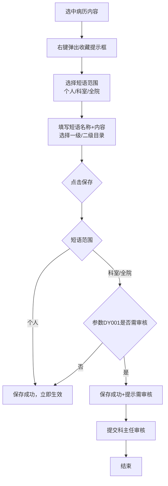
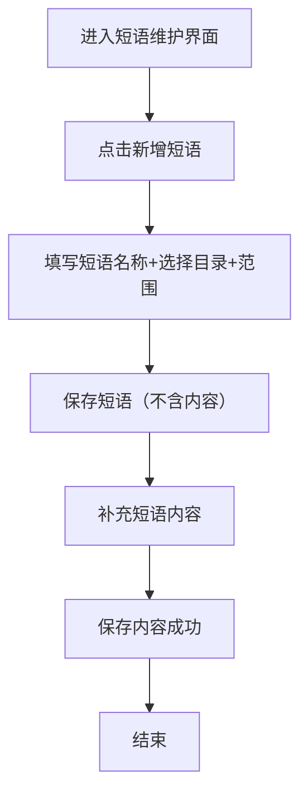

# BLGL-07-DYGL-001短语收藏与创建_ Analyst - Spec

> **需求编号**：BLGL-07-DYGL-001
> **父需求**：BLGL-07-DYGL
> **关联PM Spec**：BLGL-07-DYGL-001_短语收藏与创建_PM-spec.md
> **Spec版本**：V1.0
> **编写时间**：2026-08-14
> **编写人**：需求分析师

---

## 一、功能编号体系

### 1.1 功能层级结构

```
BLGL-07-DYGL-001: 短语收藏与创建
  ├─ BLGL-07-DYGL-001-01: 选中内容收藏
  │   ├─ -01-01: 病历内容右键收藏（个人/科室/全院）
  │   ├─ -01-02: 收藏弹窗（范围/名称/目录/内容填写）
  │   └─ -01-03: 收藏保存（审核提示按 DY001）
  └─ BLGL-07-DYGL-001-02: 创建短语（不含内容）
      ├─ -02-01: 创建个人/科室短语（仅名称+目录）
      └─ -02-02: 补充短语内容
```

### 1.2 功能编号表

| REQ-ID | 功能名称 | 类型 | 优先级 | 说明 |
|--------|---------|------|--------|------|
| BLGL-07-DYGL-001-01 | 选中内容收藏 | 功能 | P0 | 病历内容右键收藏为短语 |
| BLGL-07-DYGL-001-01-01 | 病历内容右键收藏 | 子功能 | P0 | 选中内容收藏为个人/科室/全院短语 |
| BLGL-07-DYGL-001-01-02 | 收藏弹窗 | 子功能 | P0 | 范围/名称/目录/内容填写 |
| BLGL-07-DYGL-001-01-03 | 收藏保存 | 子功能 | P0 | 保存+审核提示（DY001） |
| BLGL-07-DYGL-001-02 | 创建短语 | 功能 | P1 | 仅创建名称+目录，后补内容 |
| BLGL-07-DYGL-001-02-01 | 创建个人/科室短语 | 子功能 | P1 | 创建不含内容的短语 |
| BLGL-07-DYGL-001-02-02 | 补充短语内容 | 子功能 | P1 | 保存短语内容 |

---

## 二、核心业务流程

### 2.1 短语收藏流程



### 2.2 创建短语流程



---

## 三、功能规格说明

---

### BLGL-07-DYGL-001-01: 选中内容收藏

#### 3.1.1 功能概述

医生在病历编辑界面选中结构化内容，右键收藏为个人/科室/全院短语。收藏弹窗支持选择短语范围、填写短语名称与内容、选择一级/二级目录。科室/全院短语按 DY001 参数提示审核。

#### 3.1.2 用户角色

| 角色 | 使用场景 | 权限要求 | 操作频率 |
|------|---------|---------|---------|
| 住院医生 | 选中病历内容收藏短语 | 病历编辑权限 | 高频 |
| 科室管理者 | 创建科室短语 | 科室短语创建权限 | 中频 |

#### 3.1.3 业务流程（Given/When/Then）

##### 主流程

**Scenario 1: 短语收藏**

```gherkin
Given:
  - 医生已登录并在病历编辑界面
  - 病历中已有待收藏的结构化内容

When:
  - 医生选中病历中的结构化内容
  - 右键弹出收藏提示框
  - 选择短语范围（个人/科室/全院）、填写短语名称、选择目录
  - 点击保存

Then:
  - 个人短语保存成功，立即生效可引用
  - 科室/全院短语保存成功后提示审核提示（参数 DY001=是 时）
```

##### 异常流程

**Scenario 2: 业务异常——短语名称特殊字符**

```gherkin
Given:
  - 医生输入短语名称

When:
  - 短语名称加"-"后继续输入

Then:
  - 系统不应阻止正常输入
  - ⏳ 待确认：短语名称特殊字符校验规则
```

**Scenario 3: 数据异常——目录选择**

```gherkin
Given:
  - 医生在收藏弹窗选择目录

When:
  - 目录下拉框仅显示"请选择目录"

Then:
  - 目录选择框应提示支持手动输入
  - ⏳ 待确认：目录手动输入完整交互
```

**Scenario 4: 系统异常——收藏BUG**

```gherkin
Given:
  - 医生执行短语收藏操作

When:
  - 收藏过程中出现异常

Then:
  - 系统应正确处理收藏异常
  - ⏳ 待确认：收藏BUG 1314584 具体异常场景
```

##### 边界流程

**Scenario 5: 边界场景——个人/科室短语差异**

```gherkin
Given:
  - 医生收藏个人短语或科室短语

When:
  - 医生点击保存

Then:
  - 个人短语立即生效
  - 科室短语需科主任审核通过后方可使用
```

**Scenario 6: 边界场景——审核参数为否**

```gherkin
Given:
  - 参数 DY001 设置为"否"

When:
  - 医生收藏科室/全院短语并保存

Then:
  - 不提示审核，短语直接生效
```

#### 3.1.4 数据字段定义

> 字段名来自代码扫描（`E:\39EMR\sr-next`，标注 `` 的来自 AddInpatientEmrPhraseInputAO）。

| 字段名 | 类型 | 必填 | 默认值 | 取值范围 | 说明 | 概念ID |
|--------|------|------|--------|---------|------|--------|
| inpEmrPhraseName | String | 是 | - | - | 短语名称 | ⏳ 待确认 |
| inpEmrPhraseScopeCode | Long | 是 | 个人 | 个人/科室/全院 | 短语范围 | ⏳ 待确认 |
| inpEmrPhraseCatagoryId | Long | 是 | - | - | 短语目录ID | ⏳ 待确认 |
| deptId | Long | 否 | - | 科室ID | 科室短语时必填 | ⏳ 待确认 |
| inpEmrPhraseContentData | String | 是 | - | - | 短语内容（编辑器块格式） | ⏳ 待确认 |
| inpEmrPhraseContentTxt | String | 是 | - | - | 短语纯文本 | ⏳ 待确认 |
| oneLevelPhraseClassId | Long | 否 | - | - | 一级目录ID | ⏳ 待确认 |

#### 3.1.5 验收标准

| AC编号 | 验收标准 | 对应REQ-ID | 验证方法 | 验证场景 |
|--------|---------|-----------|---------|---------|
| AC-001 | 医生选中内容右键收藏为个人短语，保存后立即生效 | -001-01 | 功能测试 | Scenario 1 |
| AC-002 | 收藏科室/全院短语，DY001=是 时提示审核 | -001-01 | 功能测试 | Scenario 1 |
| AC-003 | DY001=否 时收藏科室短语不提示审核，直接生效 | -001-01 | 功能测试 | Scenario 6 |
| AC-004 | 收藏弹窗目录选择框支持手动输入 | -001-01 | 功能测试 | Scenario 3 |
| AC-005 | 短语名称含"-"等特殊字符不影响正常输入 | -001-01 | 功能测试 | Scenario 2 |

---

### BLGL-07-DYGL-001-02: 创建短语（不含内容）

#### 3.2.1 功能概述

在短语维护界面创建不含内容的短语（仅名称+目录+范围），随后补充短语内容。对应 addInpatientEmrPhraseNotContainContent 接口。

#### 3.2.2 用户角色

| 角色 | 使用场景 | 权限要求 | 操作频率 |
|------|---------|---------|---------|
| 住院医生 | 创建个人短语 | 短语创建权限 | 中频 |
| 科室管理者 | 创建科室短语 | 科室短语创建权限 | 中频 |

#### 3.2.3 业务流程（Given/When/Then）

##### 主流程

**Scenario 1: 创建短语**

```gherkin
Given:
  - 用户进入短语维护界面

When:
  - 用户点击新增短语
  - 填写短语名称、选择目录、选择范围
  - 点击保存

Then:
  - 短语创建成功（不含内容）
  - 用户可继续补充短语内容
```

##### 边界流程

**Scenario 2: 边界场景——先创建后补内容**

```gherkin
Given:
  - 用户先创建短语（不含内容）

When:
  - 用户后续补充短语内容

Then:
  - 短语内容保存成功，短语完整可引用
```

#### 3.2.4 数据字段定义

| 字段名 | 类型 | 必填 | 默认值 | 取值范围 | 说明 | 概念ID |
|--------|------|------|--------|---------|------|--------|
| addInpatientEmrPhraseNotContainContent | - | 否 | - | - | 创建短语（不含内容）接口：/phrase_not_content/add | ⏳ 待确认 |
| addInpatientEmrPhraseContent | - | 否 | - | - | 创建短语内容接口：/emr_phrase_content/save | ⏳ 待确认 |

#### 3.2.5 验收标准

| AC编号 | 验收标准 | 对应REQ-ID | 验证方法 | 验证场景 |
|--------|---------|-----------|---------|---------|
| AC-006 | 可创建不含内容的短语，后补内容成功 | -001-02 | 功能测试 | Scenario 1 |

---

## 四、排除范围

本需求不包含以下功能项：

1. **短语审核** - 审核通过/驳回，属 BLGL-07-DYGL-002
2. **短语引用与快捷检索** - 引用插入病历，属 BLGL-07-DYGL-003
3. **短语维护** - 编辑/删除/排序，属 BLGL-07-DYGL-004
4. **审核与权限参数配置** - 属 BLGL-07-DYGL-005

> 与 PM-Spec 第四章一致。对照 Phase 1 功能点Spec 第6章（基线能力），确保不越界。

---

## 五、业务规则清单

| 规则ID | 规则名称 | 规则描述 | 来源 | 优先级 |
|--------|---------|---------|------|--------|
| BR-001 | 收藏方式 | 医生可选中病历结构化内容右键收藏为个人或科室短语 | — | P0 |
| BR-002 | 审核要求 | 科室/全院短语需经科主任审核通过后方可使用 | — | P0 |
| BR-003 | 审核提示 | DY001=是 时，收藏科室/全院短语保存后提示"当前科室/全院短语需审核通过后方可使用！" | 3、1703116 | P1 |
| BR-004 | 目录选择 | 收藏弹窗目录下拉框支持手动输入 | 6 | P1 |
| BR-005 | 名称输入 | 短语名称含"-"等特殊字符不影响正常输入 |  | P1 |

---

## 六、关联文档

| 文档类型 | 文档路径 | 说明 |
|---------|---------|------|
| 功能点Spec（模块级） | 上级目录 BLGL-07-DYGL 07短语管理功能点Spec.md（V1.0） | 模块级功能点索引 |
| 功能Spec（业务背景与设计） | 本目录 BLGL-07-DYGL-001_短语收藏与创建-Spec.md（V1.0） | 业务背景与目标 Spec |
| Analyst-Spec（分析规格） | 本目录 BLGL-07-DYGL-001_短语收藏与创建_Analyst-spec.md（V1.0）（本文档） | 分析规格 |
| PM-Spec（需求规格） | 本目录 BLGL-07-DYGL-001_短语收藏与创建_PM-spec.md（V0.1） | PM 产出的 Spec 文档 |
| data-model.md | 待产出 | 架构师产出的数据建模文档 |
| design.md | 待产出 | 架构师产出的技术方案文档 |
| api-contract.md | 待产出 | 开发经理产出的 API 契约文档 |

---

## 七、待确认问题清单

| 编号 | 问题描述 | 缺失信息 | 影响范围 | 建议补充方 |
|------|---------|---------|---------|-----------|
| Q-001 | 短语名称特殊字符校验规则 | 允许/禁止的特殊字符清单 | 3.1.3 Scenario 2 | 产品经理 |
| Q-002 | 目录手动输入完整交互 | 手动输入+选择结合的交互方案 | 3.1.3 Scenario 3 | 产品经理 |
| Q-003 | 收藏BUG 1314584 具体场景 | 异常复现场景 | 3.1.3 Scenario 4 | 开发经理 |
| Q-004 | 收藏完整接口契约 | API 请求/返回字段 | 第5章接口设计 | 开发经理 |
| Q-005 | 概念ID、状态枚举、性能指标 | 字段概念ID、审核状态、SLA | 数据模型、非功能 | 架构师/产品经理 |

---

## 填写检查清单

| 序号 | 检查项 | 是否完成 |
|:----:|--------|:--------:|
| 1 | 功能编号带父子层级 | ✅ |
| 2 | 每个 REQ-ID 有功能概述和用户角色 | ✅ |
| 3 | 主流程至少 1 个 Given/When/Then 场景 | ✅ |
| 4 | 异常流程至少 3 个 Given/When/Then 场景 | ✅ |
| 5 | 边界流程至少 2 个 Given/When/Then 场景 | ✅ |
| 6 | 每个 Given/When/Then 内容具体，不模糊 | ✅ |
| 7 | 数据字段定义完整 | ✅ |
| 8 | 验收标准 AC 编号独立，可验证 | ✅ |
| 9 | 验收标准无"功能正常"等模糊表述 | ✅ |
| 10 | 排除范围明确列出 | ✅ |
| 11 | 业务规则清单列出所有规则，每条标注来源 | ✅ |
| 12 | 流程图使用 Mermaid 格式（≥2 个） | ✅ |
| 13 | 关联文档索引包含 Phase 1 功能点Spec | ✅ |
| 14 | 待确认问题清单汇总了全文所有 ⏳ 项 | ✅ |
| 15 | 全文无占位符 `< >` 残留 | ✅ |
| 16 | 全文陈述可溯源至资料区（S1~S10 溯源核查） | ✅ |
| 17 | 人工审核确认完成 | ⏳ 待确认 |

---

**文档状态**：⬜ 待审核
**维护责任**：需求分析师规范组
**下次更新**：根据评审反馈优化

---

## 版本历史

| 版本 | 日期 | 变更说明 | 编写人 |
|------|------|---------|--------|
| V1.0 | 2026-08-14 | 初始版本 | 需求分析师 |
