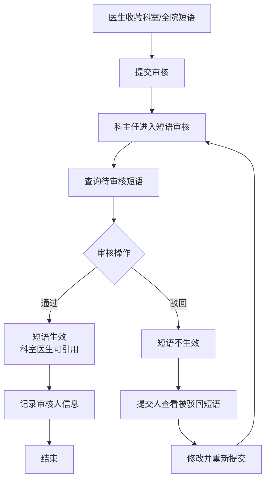
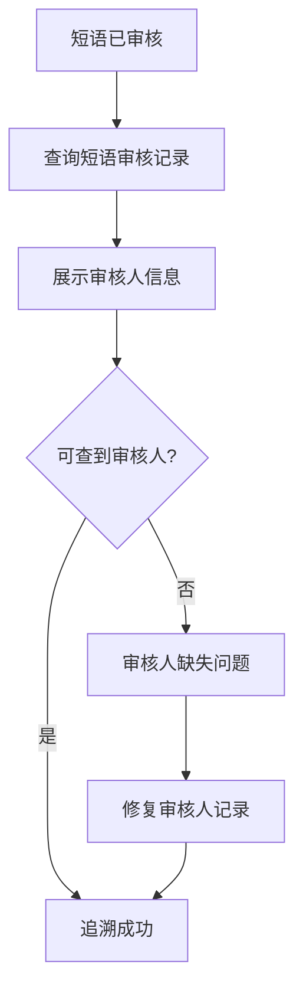

# BLGL-07-DYGL-002短语审核_ Analyst - Spec

> **需求编号**：BLGL-07-DYGL-002
> **父需求**：BLGL-07-DYGL
> **关联PM Spec**：BLGL-07-DYGL-002_短语审核_PM-spec.md
> **Spec版本**：V1.0
> **编写时间**：2026-08-14
> **编写人**：需求分析师

---

## 一、功能编号体系

### 1.1 功能层级结构

```
BLGL-07-DYGL-002: 短语审核
  ├─ BLGL-07-DYGL-002-01: 待审核短语查询
  │   ├─ -01-01: 查询待审核短语（个人共享/科室/全院）
  │   └─ -01-02: 待审核短语列表展示
  ├─ BLGL-07-DYGL-002-02: 短语审核操作
  │   ├─ -02-01: 审核通过
  │   ├─ -02-02: 审核驳回
  │   └─ -02-03: 审核人信息记录
  └─ BLGL-07-DYGL-002-03: 被驳回短语修改重提
      └─ -03-01: 提交人查看并修改被驳回短语
```

### 1.2 功能编号表

| REQ-ID | 功能名称 | 类型 | 优先级 | 说明 |
|--------|---------|------|--------|------|
| BLGL-07-DYGL-002-01 | 待审核短语查询 | 功能 | P0 | 科主任查询待审核的科室/全院短语 |
| BLGL-07-DYGL-002-01-01 | 查询待审核短语 | 子功能 | P0 | 按短语类型查询待审核数据 |
| BLGL-07-DYGL-002-01-02 | 待审核列表展示 | 子功能 | P0 | 展示待审核短语列表 |
| BLGL-07-DYGL-002-02 | 短语审核操作 | 功能 | P0 | 审核通过/驳回 |
| BLGL-07-DYGL-002-02-01 | 审核通过 | 子功能 | P0 | 审核通过后短语生效 |
| BLGL-07-DYGL-002-02-02 | 审核驳回 | 子功能 | P0 | 审核驳回后短语不生效 |
| BLGL-07-DYGL-002-02-03 | 审核人信息记录 | 子功能 | P1 | 记录审核人 employeeNo/employeeId |
| BLGL-07-DYGL-002-03 | 被驳回短语修改重提 | 功能 | P1 | 提交人修改被驳回短语并重提 |

---

## 二、核心业务流程

### 2.1 短语审核流程



### 2.2 审核人追溯流程



---

## 三、功能规格说明

---

### BLGL-07-DYGL-002-01: 待审核短语查询

#### 3.1.1 功能概述

业务科主任在"日常管理-短语审核"下查询待审核的科室/全院短语，支持查看待审核数据列表。

#### 3.1.2 用户角色

| 角色 | 使用场景 | 权限要求 | 操作频率 |
|------|---------|---------|---------|
| 业务科主任 | 查询待审核短语 | 短语审核权限 | 中频 |

#### 3.1.3 业务流程（Given/When/Then）

##### 主流程

**Scenario 1: 查询待审核短语**

```gherkin
Given:
  - 业务科主任已登录
  - 存在已提交待审核的科室/全院短语

When:
  - 科主任进入"日常管理-短语审核"
  - 查看待审核的短语数据

Then:
  - 系统展示待审核短语列表
  - 支持审核通过/驳回操作
```

##### 异常流程

**Scenario 2: 数据异常——待审核列表为空**

```gherkin
Given:
  - 无待审核短语

When:
  - 科主任进入短语审核

Then:
  - 系统展示空列表或"暂无待审核短语"
```

##### 边界流程

**Scenario 3: 边界场景——个人短语共享审核**

```gherkin
Given:
  - 医生创建的个人短语共享给科室A

When:
  - 科室A科主任查询待审核短语

Then:
  - 该共享短语出现在待审核列表中
  - 需科室A科主任审核通过后生效
```

#### 3.1.4 数据字段定义

| 字段名 | 类型 | 必填 | 默认值 | 取值范围 | 说明 | 概念ID |
|--------|------|------|--------|---------|------|--------|
| mrtEditorTypeCode | Long | 否 | - | - | 编辑器类型 | ⏳ 待确认 |

#### 3.1.5 验收标准

| AC编号 | 验收标准 | 对应REQ-ID | 验证方法 | 验证场景 |
|--------|---------|-----------|---------|---------|
| AC-001 | 科主任可查询待审核短语列表 | -002-01 | 功能测试 | Scenario 1 |
| AC-002 | 个人短语共享科室A，出现在科室A待审核列表 | -002-01 | 功能测试 | Scenario 3 |

---

### BLGL-07-DYGL-002-02: 短语审核操作

#### 3.2.1 功能概述

业务科主任对待审核短语执行审核通过/驳回操作。审核通过后短语生效；驳回后短语不生效。记录审核人信息。

#### 3.2.2 用户角色

| 角色 | 使用场景 | 权限要求 | 操作频率 |
|------|---------|---------|---------|
| 业务科主任 | 审核通过/驳回 | 短语审核权限 | 中频 |

#### 3.2.3 业务流程（Given/When/Then）

##### 主流程

**Scenario 1: 审核通过**

```gherkin
Given:
  - 业务科主任查看待审核的科室/全院短语

When:
  - 科主任点击审核通过

Then:
  - 科室短语生效，支持科室内的所有医生查看引用
  - 审核状态变更为"已通过"
  - 记录审核人信息
```

##### 异常流程

**Scenario 2: 业务异常——审核驳回**

```gherkin
Given:
  - 业务科主任查看待审核的科室/全院短语

When:
  - 科主任点击审核驳回

Then:
  - 该审核短语不生效
  - 提交人科室在"日常管理-待审核短语"下查看并修改
  - 审核状态变更为"已驳回"
```

**Scenario 3: 数据异常——审核人缺失**

```gherkin
Given:
  - 科室短语已维护并审核通过

When:
  - 用户查询该短语的审核人信息

Then:
  - 系统应能查到审核人信息
  - ⏳ 待确认：审核人信息缺失的根因与修复
```

##### 边界流程

**Scenario 4: 边界场景——审核开关为否**

```gherkin
Given:
  - 参数 DY001 设置为"否"

When:
  - 医生收藏科室/全院短语

Then:
  - 短语直接生效，无需审核
```

**Scenario 5: 边界场景——审核通过后引用**

```gherkin
Given:
  - 科室短语已审核通过

When:
  - 科室医生引用该短语

Then:
  - 短语可正常引用插入病历
```

#### 3.2.4 数据字段定义

> 字段名来自代码扫描（`E:\39EMR\sr-next`，标注 `` 的来自 InpEmrPhraseReviewDeptDirectorInputAO）。

| 字段名 | 类型 | 必填 | 默认值 | 取值范围 | 说明 | 概念ID |
|--------|------|------|--------|---------|------|--------|
| inpEmrPhraseId | Long | 是 | - | - | 短语ID | ⏳ 待确认 |
| inpEmrPhraseStatus | Long | 是 | - | 待审核/已通过/已驳回 | 审核状态 | ⏳ 待确认 |
| deptId | Long | 是 | - | 科室ID | 科室 | ⏳ 待确认 |
| employeeNo | String | 是 | - | - | 审核人工号 | ⏳ 待确认 |
| employeeId | Long | 是 | - | - | 审核人ID | ⏳ 待确认 |

#### 3.2.5 验收标准

| AC编号 | 验收标准 | 对应REQ-ID | 验证方法 | 验证场景 |
|--------|---------|-----------|---------|---------|
| AC-003 | 审核通过后短语生效，科室医生可引用 | -002-02 | 功能测试 | Scenario 1 |
| AC-004 | 审核驳回后短语不生效，提交人可修改重提 | -002-02 | 功能测试 | Scenario 2 |
| AC-005 | 审核记录审核人信息，可追溯 | -002-02 | 功能测试 | Scenario 3 |

---

### BLGL-07-DYGL-002-03: 被驳回短语修改重提

#### 3.3.1 功能概述

审核驳回后，提交人在"日常管理-待审核短语"下查看被驳回的短语并修改，重新提交审核。

#### 3.3.2 用户角色

| 角色 | 使用场景 | 权限要求 | 操作频率 |
|------|---------|---------|---------|
| 短语提交人（医生/科室管理者） | 修改被驳回短语并重提 | 短语创建权限 | 低频 |

#### 3.3.3 业务流程（Given/When/Then）

##### 主流程

**Scenario 1: 修改被驳回短语**

```gherkin
Given:
  - 科室短语被审核驳回

When:
  - 提交人进入"日常管理-待审核短语"
  - 查看被驳回的短语并修改

Then:
  - 修改保存后重新提交审核
```

##### 边界流程

**Scenario 2: 边界场景——重提后再次审核**

```gherkin
Given:
  - 提交人修改被驳回短语并重新提交

When:
  - 科主任再次审核

Then:
  - 通过则生效，驳回则继续修改
```

#### 3.3.4 数据字段定义

| 字段名 | 类型 | 必填 | 默认值 | 取值范围 | 说明 | 概念ID |
|--------|------|------|--------|---------|------|--------|
| 被驳回短语状态 | - | 否 | - | 已驳回 | 待修改短语状态 | ⏳ 待确认 |

#### 3.3.5 验收标准

| AC编号 | 验收标准 | 对应REQ-ID | 验证方法 | 验证场景 |
|--------|---------|-----------|---------|---------|
| AC-006 | 被驳回短语提交人可查看并修改，重新提交审核 | -002-03 | 功能测试 | Scenario 1 |

---

## 四、排除范围

本需求不包含以下功能项：

1. **短语收藏与创建** - 收藏提交，属 BLGL-07-DYGL-001
2. **短语引用与快捷检索** - 引用插入病历，属 BLGL-07-DYGL-003
3. **短语维护** - 编辑/删除/排序，属 BLGL-07-DYGL-004
4. **审核与权限参数配置** - 属 BLGL-07-DYGL-005

> 与 PM-Spec 第四章一致。对照 Phase 1 功能点Spec 第6章（基线能力），确保不越界。

---

## 五、业务规则清单

| 规则ID | 规则名称 | 规则描述 | 来源 | 优先级 |
|--------|---------|---------|------|--------|
| BR-001 | 审核前提 | 科室/全院短语需经业务科主任审核通过后方可生效 | — | P0 |
| BR-002 | 个人短语共享审核 | 个人短语共享给科室A使用时，需经科室A业务科主任审核 | — | P0 |
| BR-003 | 审核通过生效 | 审核通过后科室短语生效，支持科室所有医生查看引用 | — | P1 |
| BR-004 | 审核驳回处理 | 审核驳回后短语不生效，提交人在待审核短语下查看并修改 | — | P1 |
| BR-005 | 审核人追溯 | 审核操作记录审核人信息，可查询追溯 | 1 | P1 |

---

## 六、关联文档

| 文档类型 | 文档路径 | 说明 |
|---------|---------|------|
| 功能点Spec（模块级） | 上级目录 BLGL-07-DYGL 07短语管理功能点Spec.md（V1.0） | 模块级功能点索引 |
| 功能Spec（业务背景与设计） | 本目录 BLGL-07-DYGL-002_短语审核-Spec.md（V1.0） | 业务背景与目标 Spec |
| Analyst-Spec（分析规格） | 本目录 BLGL-07-DYGL-002_短语审核_Analyst-spec.md（V1.0）（本文档） | 分析规格 |
| PM-Spec（需求规格） | 本目录 BLGL-07-DYGL-002_短语审核_PM-spec.md（V0.1） | PM 产出的 Spec 文档 |
| data-model.md | 待产出 | 架构师产出的数据建模文档 |
| design.md | 待产出 | 架构师产出的技术方案文档 |
| api-contract.md | 待产出 | 开发经理产出的 API 契约文档 |

---

## 七、待确认问题清单

| 编号 | 问题描述 | 缺失信息 | 影响范围 | 建议补充方 |
|------|---------|---------|---------|-----------|
| Q-001 | 审核人缺失根因 | 审核人信息丢失原因 | 3.2.3 Scenario 3 | 开发经理 |
| Q-002 | 审核状态枚举值 | 待审核/已通过/已驳回的枚举编码 | 数据模型、BR | 开发经理 |
| Q-003 | 审核完整接口契约 | API 请求/返回字段 | 第5章接口设计 | 开发经理 |
| Q-004 | 概念ID、性能指标 | 字段概念ID、审核SLA | 数据模型、非功能 | 架构师/产品经理 |

---

## 填写检查清单

| 序号 | 检查项 | 是否完成 |
|:----:|--------|:--------:|
| 1 | 功能编号带父子层级 | ✅ |
| 2 | 每个 REQ-ID 有功能概述和用户角色 | ✅ |
| 3 | 主流程至少 1 个 Given/When/Then 场景 | ✅ |
| 4 | 异常流程至少 3 个 Given/When/Then 场景 | ✅ |
| 5 | 边界流程至少 2 个 Given/When/Then 场景 | ✅ |
| 6 | 每个 Given/When/Then 内容具体，不模糊 | ✅ |
| 7 | 数据字段定义完整 | ✅ |
| 8 | 验收标准 AC 编号独立，可验证 | ✅ |
| 9 | 验收标准无"功能正常"等模糊表述 | ✅ |
| 10 | 排除范围明确列出 | ✅ |
| 11 | 业务规则清单列出所有规则，每条标注来源 | ✅ |
| 12 | 流程图使用 Mermaid 格式（≥2 个） | ✅ |
| 13 | 关联文档索引包含 Phase 1 功能点Spec | ✅ |
| 14 | 待确认问题清单汇总了全文所有 ⏳ 项 | ✅ |
| 15 | 全文无占位符 `< >` 残留 | ✅ |
| 16 | 全文陈述可溯源至资料区（S1~S10 溯源核查） | ✅ |
| 17 | 人工审核确认完成 | ⏳ 待确认 |

---

**文档状态**：⬜ 待审核
**维护责任**：需求分析师规范组
**下次更新**：根据评审反馈优化

---

## 版本历史

| 版本 | 日期 | 变更说明 | 编写人 |
|------|------|---------|--------|
| V1.0 | 2026-08-14 | 初始版本 | 需求分析师 |
