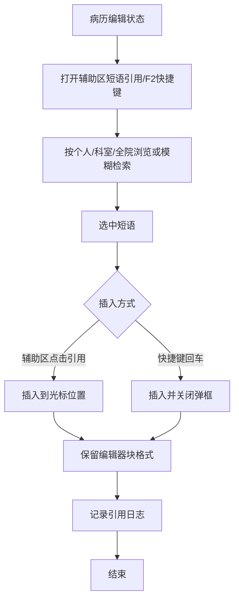
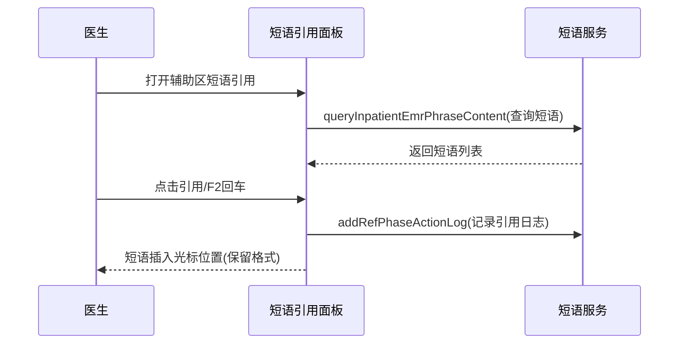

# BLGL-07-DYGL-003 短语引用与快捷检索 - Spec

> **功能编号**：BLGL-07-DYGL-003
> **文档类型**：功能Spec（业务背景与设计）
> **文档版本**：V1.0
> **编写时间**：2026-08-14
> **编写人**：RACC

---

## 文档索引

#### 章节索引

**Spec（研发视角）**

| 章节号 | 章节名称 | 内容说明 |
|--------|---------|---------|
| 1、 | 文档概述 | 文档目的、文档范围、术语定义、阅读指南、参考文档 |
| 2、 | 功能背景与定位 | 功能背景、功能定位、目标用户、核心价值 |
| 3、 | 业务流程设计 | 主流程/异常流程/边界流程（Given/When/Then） |
| 4、 | 数据模型设计 | 核心数据结构、状态定义、系统参数定义 |
| 5、 | 接口契约设计 | API列表、接口详细设计、错误码定义 |
| 6、 | 技术方案设计 | 页面路径、技术栈、关键技术点、部署方案 |
| 7、 | 测试用例预设计 | 功能/边界/异常/性能测试用例 |
| 8、 | 非功能性要求 | 性能、安全、可用性、兼容性 |
| 9、 | 依赖与风险 | 外部依赖、风险项 |
| 10、 | 附录 | 流程图、时序图、参考文档 |

**PM-Spec（业务视角）**

| 章节号 | 章节名称 | 内容说明 |
|--------|---------|---------|
| 一 | 目标 | 功能定位与核心价值 |
| 二 | 约束 | 业务/技术/非功能性约束 |
| 三 | 验收标准 | 验收条件与验证方法 |
| 四 | 排除范围 | 本次不做项与明确边界 |
| 五 | 关键决策记录 | 方案决策与选型理由 |
| 六 | 优先级 | 优先级定义 |
| 七 | 关联文档 | 关联文档索引 |
| 附录 | 填写检查清单 | 质量检查 |

**Analyst-Spec（产品视角）**

| 章节号 | 章节名称 | 内容说明 |
|--------|---------|---------|
| 一 | 功能编号体系 | 功能编号与层级结构 |
| 二 | 核心业务流程 | 核心业务流程与时序 |
| 三 | 功能规格说明 | 详细功能规格与验收标准 |
| 四 | 排除范围 | 排除范围 |
| 五 | 业务规则清单 | 业务规则清单 |
| 六 | 关联文档 | 关联文档索引 |
| 七 | 待确认问题清单 | 待确认问题汇总 |
| - | 填写检查清单 | 质量检查 |

#### 版本历史

| 版本 | 日期 | 变更说明 | 编写人 |
|------|------|---------|--------|
| V1.0 | 2026-08-14 | 初始版本 | RACC |

#### 关联文档索引

| 序号 | 文档名称 | 文档类型 | 版本 | 位置 |
|------|---------|---------|------|------|
| 1 | BLGL-07-DYGL 07短语管理功能点Spec.md | 功能点Spec（模块级） | V1.0 | 上级目录 |
| 2 | BLGL-07-DYGL-003_短语引用与快捷检索-Spec.md | 功能Spec（业务背景与设计）（本文档） | V1.0 | 本目录 |
| 3 | BLGL-07-DYGL-003_短语引用与快捷检索_Analyst-spec.md | Analyst-Spec（分析规格） | V1.0 | 本目录 |
| 4 | BLGL-07-DYGL-003_短语引用与快捷检索_PM-spec.md | PM-Spec（需求规格） | V0.1 | 本目录 |

---

## 1、文档概述

### 1.1、文档目的

本文档旨在明确"短语引用与快捷检索"功能（BLGL-07-DYGL-003）的业务背景与设计方案，为需求分析、研发实现、测试验收及评审提供统一的业务上下文、设计口径与决策依据。

### 1.2、文档范围

#### 1.2.1 纳入范围

本文档覆盖短语引用与快捷检索的完整业务背景与设计，包括：

- 医生在病历编辑器辅助区"短语引用"面板按个人/科室/全院浏览、引用短语
- 短语引用支持模糊检索过滤（关键词输入过滤）
- 文书编辑状态快捷键（默认F2）弹出短语快捷检索框，键盘上下切换、回车插入
- 短语引用插入保留维护时保存的回车换行、空格等格式
- 短语引用交互体验优化（卡片样式、悬浮操作、缩略模式）

#### 1.2.2 排除范围

本文档不涉及以下内容（详见其他功能点或模块）：

- 短语收藏与创建（收藏提交）—— BLGL-07-DYGL-001
- 短语审核（审核通过/驳回）—— BLGL-07-DYGL-002
- 短语维护（编辑/删除/排序）—— BLGL-07-DYGL-004
- 短语审核与权限参数配置—— BLGL-07-DYGL-005

### 1.3、术语定义

| 术语 | 定义 |
|------|------|
| 短语引用 | 医生在病历编辑器辅助区引用短语插入病历 |
| 快捷键检索 | 文书编辑状态开启快捷键（默认F2）弹出短语快捷检索框 |
| 模糊检索 | 输入关键词对短语标题模糊查询过滤 |
| 保留格式 | 短语引用插入保留维护时保存的换行/空格等格式 |

> ⏳ 待确认：规范术语表待产品文档确认。

### 1.4、阅读指南

- **章节关系**：第1~2章为业务全貌，第3~10章为设计实现层。与 Analyst-Spec、PM-Spec 互相引用保持一致。
- **读者对象**：产品经理/需求分析师读第1~2章；研发读第3~6、9~10章；测试读第3、7~8章；评审人员核对各层一致性。

### 1.5、参考文档

| 序号 | 文档名称 | 版本/日期 |
|------|---------|----------|
| 1 | 【历史需求】住院病历的历史需求.xlsx | - |
| 2 | BLGL-07-DYGL-003_短语引用与快捷检索_PM-spec.md | V0.1 |
| 3 | BLGL-07-DYGL-003_短语引用与快捷检索_Analyst-spec.md | V1.0 |
| 4 | BLGL-07-DYGL 07短语管理功能点Spec.md | V1.0 |

---

## 2、功能背景与定位

### 2.1 功能背景

短语引用与快捷检索是短语体系的核心使用场景，需满足：

- **管理要求**：医生需要在病历书写时快速引用常用短语，支持个人/科室/全院三级
- **现状痛点**：
  - 短语引用按纯文本插入，丢弃维护时保存的格式，插入后变单行
  - 快捷键检索未覆盖全院短语
  - 辅助区交互体验待优化（搜索、卡片、悬浮操作）
- **历史需求演进**：从短语引用建立（0）→ 快捷键引用（6）→ 全院短语快捷键检索（3）→ 引用保留格式（1）→ 交互体验优化（5）

### 2.2 功能定位

"短语引用与快捷检索"是 WiNEX 病历管理-短语管理模块的核心使用场景，定位为：

- **快速录入入口**：医生书写病历快速引用常用短语
- **高效检索**：关键词模糊检索 + 快捷键快捷检索
- **格式保真**：引用保留维护时格式，避免手动调整

### 2.3 目标用户

| 用户角色 | 主要使用场景 |
|---------|-------------|
| 住院医生 | 病历编辑辅助区引用短语、快捷键快捷检索插入 |

### 2.4 核心价值

| 价值维度 | 价值描述 |
|---------|---------|
| 效率提升 | 常用短语快速引用，快捷键快捷插入 |
| 格式保真 | 引用保留换行/空格格式，避免手动调整 |
| 体验优化 | 卡片样式、悬浮操作、缩略模式 |

---

## 3、业务流程设计（Given/When/Then）

### 3.1 主流程

**Scenario 1: 短语引用（辅助区）**

```gherkin
Given:
  - 医生已登录并在病历编辑界面
  - 病历编辑器右侧辅助区已有"短语引用"面板

When:
  - 医生打开辅助区"短语引用"面板
  - 按个人/科室/全院浏览短语
  - 点击引用按钮（或悬浮"引用"按钮）

Then:
  - 短语插入到病历光标位置
  - 插入保留维护时保存的回车换行、空格等格式
  - 记录短语引用日志
```

### 3.2 异常流程

**Scenario 2: 业务异常——短语格式丢失**

```gherkin
Given:
  - 短语维护时保存了回车换行、空格等格式

When:
  - 医生在辅助区引用短语插入病历

Then:
  - 若按纯文本插入，短语变单行连续文本（格式丢失）
  - 应复用编辑器块格式插入能力，保留格式
```

**Scenario 3: 数据异常——模糊检索无结果**

```gherkin
Given:
  - 医生输入关键词模糊检索短语

When:
  - 检索关键词无匹配短语

Then:
  - 显示空结果提示
  - ⏳ 待确认：空结果提示文案
```

**Scenario 4: 系统异常——快捷键未生效**

```gherkin
Given:
  - 文书编辑状态

When:
  - 医生按快捷键（默认F2）

Then:
  - 弹出短语快捷检索框，光标定位到检索框
  - ⏳ 待确认：快捷键冲突时的处理
```

### 3.3 边界流程

**Scenario 5: 边界场景——快捷键检索交互**

```gherkin
Given:
  - 文书编辑状态，开启快捷键（默认F2）

When:
  - 医生按F2弹出短语快捷检索框
  - 输入关键词模糊查询短语标题
  - 键盘上下切换短语，选中内容底纹显示
  - 点回车插入到光标位置

Then:
  - 插入短语并关闭弹框
  - 检索结果以先个人后科室短语的顺序显示
```

**Scenario 6: 边界场景——缩略显示模式**

```gherkin
Given:
  - 医生设置短语引用显示模式为缩略

When:
  - 医生查看辅助区短语引用

Then:
  - 只显示标题，更多按钮显示在标题后面
  - 选择后按账号记忆
```

---

## 4、数据模型设计

> 数据模型信息来自代码扫描（`E:\39EMR\sr-next`）和历史需求。标注 `` 的字段来自输入/输出 VO，标注 `` 的来自需求文本。

### 4.1 核心数据结构

#### 4.1.1 核心查询入参（InpatientEmrPhraseContentQueryInputAO / InpatientEmrPhraseCustomQueryInputAO）

| 字段名 | 类型 | 必填 | 备注 |
|--------|------|------|------|
| 短语范围 | Long | 否 | 个人/科室/全院 |
| 目录ID | Long | 否 | 短语目录 |
| 关键词 | String | 否 | 模糊检索关键词 |
| 分页参数 | - | 否 | 分页查询 |

> ⏳ 待确认：完整入参结构待接口契约文档补充。

#### 4.1.2 核心表/实体

| 表/实体 | 关键字段 | 说明 |
|---------|---------|------|
| INPATIENT_EMR_PHRASE（InpatientEmrPhrasePO） | INP_EMR_PHRASE_ID、INP_EMR_PHRASE_NAME、PINYIN、WUBI | 短语主表，引用数据源 |
| INPATIENT_EMR_PHRASE_CONTENT | 短语内容 | 短语内容，含编辑器块格式 |
| INPATIENT_EMR_PHRASE_QUOTE | 引用记录 | 短语引用记录 |

> ⏳ 待确认：完整数据表清单待代码扫描或功能清单数据表清单补充。

### 4.2 状态定义

| 状态码 | 状态名称 | 说明 |
|--------|---------|------|
| ⏳ 待确认 | 短语显示模式 | 正常/缩略 |

> ⏳ 待确认：显示模式枚举未在代码扫描中提取完整。

### 4.3 系统参数定义

| 参数编码 | 参数名称 | 说明 |
|---------|---------|------|
| 快捷键 | 短语引用快捷键 | 默认F2 |
| 显示模式记忆 | 短语引用显示模式 | 按账号记忆正常/缩略 |

---

## 5、接口契约设计

> 接口信息来自代码扫描（`E:\39EMR\sr-next`）的 InpatientEmrPhraseController + 前端 API。标注 ``。

### 5.1 API列表

| 序号 | API名称（代码函数） | 路径 | 方法 | 说明 |
|:----:|---------|------|:----:|------|
| 1 | queryInpatientEmrPhraseContent / V2 | /api/v2/app_record_inpatient/emr_inpatient/emr_phrase_content/query | POST | 查询短语明细（引用面板） |
| 2 | queryInpatientEmrPhraseContentPage / V2 | /api/v2/app_record_inpatient/emr_inpatient/emr_phrase_content/queryPage | POST | 按目录分页查询短语 |
| 3 | queryInpatientEmrPhraseCatagoryTree | /api/v2/app_record_inpatient/emr_inpatient/emr_phrase_catagory_tree/query | POST | 查询短语目录树（引用面板分类） |
| 4 | queryInpatientEmrPhraseLastestFavourite | /api/v3/app_record_inpatient/emr_inpatient/emr_phrase_lastest_favourite/query | POST | 查询最近收藏短语 |
| 5 | addRefPhaseActionLog | /api/v1/app_record_inpatient/emr_inpatient/add_phrase_action | POST | 引用短语添加日志 |
| 6 | countInpatientEmrPhraseQuoteNum | /api/v1/app_record_inpatient/emr_inpatient/emr_phrase_quote_num/count | POST | 引用短语统计引用数量 |
| 7 | queryInpatientEmrPhraseQuoteTopThree | /api/v1/app_record_inpatient/emr_inpatient/emr_phrase_quote_top_three/query | POST | 按使用频率推荐短语 |

> 前端实际请求前缀：`/inpatient-clinicalnote/api/v1\|v2\|v3/app_record_inpatient/`。

### 5.2 接口详细设计

#### 5.2.1 查询短语明细（queryInpatientEmrPhraseContent）

**请求参数**:
```json
{
  "phraseScopeCode": 1,
  "catagoryId": 1001,
  "keyword": "肺部",
  "pageNum": 1,
  "pageSize": 20
}
```

**返回值（成功，InpatientEmrPhraseContentQueryOutputVO）**:
```json
{
  "success": true,
  "data": {
    "list": [
      {
        "inpEmrPhraseId": 5001,
        "inpEmrPhraseName": "肺部感染常用描述",
        "contentData": "<编辑器块>",
        "contentTxt": "肺部听诊呼吸音清"
      }
    ]
  }
}
```

**返回值（失败）**:
```json
{
  "success": false,
  "message": "查询失败",
  "data": null
}
```

> ⏳ 待确认：具体字段名/结构以接口契约文档为准，以上字段来自代码扫描的输入/输出VO。

### 5.3 错误码定义

| 错误码 | 错误信息 | 处理方式 |
|--------|---------|---------|
| ⏳ 待确认 | 查询失败 | 提示错误并返回空列表 |

> ⏳ 待确认：业务错误码定义未在代码扫描中提取完整。

---

## 6、技术方案设计

### 6.1 页面路径

- **页面路径**: 住院医生站→病历编辑界面→辅助区"短语引用"面板
- **前端组件**: AuxiliaryOnPhraseRefen/index.vue（短语引用面板）+ PgEditor/widget/widget_phrase.vue（编辑器短语组件）
- **前端工程**: winning-webui-inpatient-clinicalnote-pango（Vue2 + element-ui）

### 6.2 技术栈

| 类别 | 技术 | 版本 |
|------|------|------|
| 前端框架 | Vue | 2.6.14 |
| 前端UI | element-ui | 2.13.0 |
| 后端框架 | Spring Boot（Java） | java.version 17 |
| 构建工具 | webpack / Maven | 前端 webpack + 后端 Maven |

### 6.3 关键技术点

- 短语引用面板：AuxiliaryOnPhraseRefen/index.vue
- 模糊检索：输入关键词过滤短语标题，enter 键筛选
- 快捷键检索：默认F2弹出快捷检索框，键盘上下切换、回车插入
- 保留格式：复用编辑器块格式插入能力，传递 contentData（编辑器块）而非仅 contentTxt（纯文本）
- 引用日志：addRefPhaseActionLog 记录引用操作

### 6.4 部署方案

⏳ 待确认：部署方案未在资料区中找到。

---

## 7、测试用例预设计

### 7.1 功能测试

| 用例编号 | 测试场景 | Given | When | Then |
|---------|---------|-------|------|------|
| TC-001 | 辅助区短语引用 | 医生在病历编辑界面 | 打开短语引用面板点击引用 | 短语插入光标位置 |
| TC-002 | 快捷键检索插入 | 文书编辑状态 | 按F2弹出检索框，上下切换回车插入 | 插入并关闭弹框（3） |
| TC-003 | 引用保留格式 | 短语维护时保存了换行格式 | 引用插入 | 保留格式（1） |

### 7.2 边界测试

| 用例编号 | 测试场景 | Given | When | Then |
|---------|---------|-------|------|------|
| TC-004 | 缩略显示模式 | 设置为缩略模式 | 查看辅助区 | 只显示标题+更多按钮（5） |
| TC-005 | 模糊检索空结果 | 输入无匹配关键词 | 检索 | 显示空结果提示 |

### 7.3 异常测试

| 用例编号 | 测试场景 | Given | When | Then |
|---------|---------|-------|------|------|
| TC-006 | 格式丢失 | 按纯文本插入 | 引用 | 复用编辑器块格式插入（1） |
| TC-007 | 快捷键冲突 | 文书编辑状态 | 按F2 | ⏳ 待确认：冲突处理 |

### 7.4 性能测试

| 用例编号 | 测试场景 | 指标 |
|---------|---------|------|
| TC-008 | 短语引用响应 | ⏳ 待确认：性能指标未在资料区中找到 |

---

## 8、非功能性要求

### 8.1 性能要求

| 指标 | 要求 |
|------|------|
| 短语引用响应 | ⏳ 待确认 |

### 8.2 安全要求

| 要求 | 说明 |
|------|------|
| 引用范围权限 | 科室短语按科室权限可见 |

**医疗行业特殊要求**

| 要求 | 说明 |
|------|------|
| 病历内容一致性 | 引用保留格式保证病历内容完整 |

### 8.3 可用性要求

| 指标 | 要求值 |
|------|--------|
| 可用性 | ⏳ 待确认 |

### 8.4 兼容性要求

| 类型 | 要求 |
|------|------|
| 编辑器兼容 | 短语引用与病历编辑器块格式兼容 |
| 辅助区位置 | 支持个人设置辅助区显示位置（上侧/下侧） |

---

## 9、依赖与风险

### 9.1 外部依赖

| 依赖项 | 说明 |
|--------|------|
| 病历编辑器 | 短语引用插入能力 |

### 9.2 风险项

| 风险项 | 等级 | 说明 | 应对方案 |
|--------|------|------|---------|
| 格式丢失 | 中 | 纯文本插入导致格式丢失 | 复用编辑器块格式插入 |
| 快捷键冲突 | 低 | 快捷键可能与其他功能冲突 | 提供配置或提示 |

---

## 10、附录

### 10.1 流程图



### 10.2 时序图



### 10.3 参考文档

- BLGL-07-DYGL 07短语管理功能点Spec.md（V1.0，第5章 -003 行）
- 关联Spec: BLGL-07-DYGL-001_短语收藏与创建-Spec.md（短语来源）

---

## 填写检查清单

| 序号 | 检查项 | 是否完成 |
|:----:|--------|:--------:|
| 1 | 章节索引与正文章节一致 | ✅ |
| 2 | 版本历史记录完整 | ✅ |
| 3 | 关联文档索引已登记全部Spec | ✅ |
| 4 | 文档目的明确回答"为什么做/做成什么/怎么做" | ✅ |
| 5 | 纳入范围/排除范围清晰 | ✅ |
| 6 | 术语定义覆盖关键概念，从资料区可溯源 | ✅ |
| 7 | 参考文档已登记 | ✅ |
| 8 | 功能背景基于法规/规范/需求来源组织 | ✅ |
| 9 | 功能定位体现业务价值（3~5个定位点） | ✅ |
| 10 | 目标用户角色覆盖完整，在需求原文中有出处 | ✅ |
| 11 | 核心价值可陈述，与 Phase 1 口径一致 | ✅ |
| 12 | 业务流程：主流程≥1、异常≥3、边界≥2，Given/When/Then 具体 | ✅ |
| 13 | 数据模型：字段/表/状态/参数可溯源 | ✅ |
| 14 | 接口契约：API列表+详细设计+错误码齐全或标记待确认 | ✅ |
| 15 | 技术方案：页面路径/技术栈/关键点/部署方案或标记待确认 | ✅ |
| 16 | 测试用例：功能/边界/异常/性能覆盖 | ✅ |
| 17 | 非功能性要求：性能/安全/可用性/兼容性指标可量化或标记待确认 | ✅ |
| 18 | 依赖与风险：外部依赖登记完整 | ✅ |
| 19 | 附录：流程图/时序图与正文流程一致 | ✅ |
| 20 | 全文无占位符 `< >` 残留 | ✅ |
| 21 | 全文陈述可溯源至资料区 | ✅ |
| 22 | 人工审核确认完成 | ⏳ 待确认 |

---

**文档状态**：⬜ 待审核
**维护责任**：RACC
**下次更新**：根据评审反馈优化
