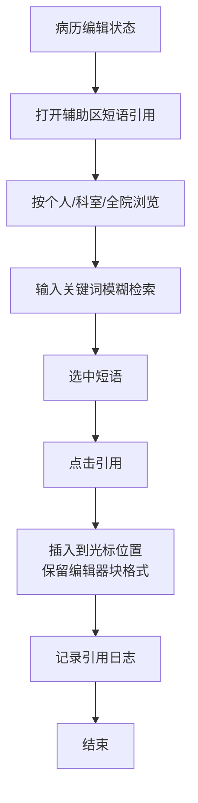
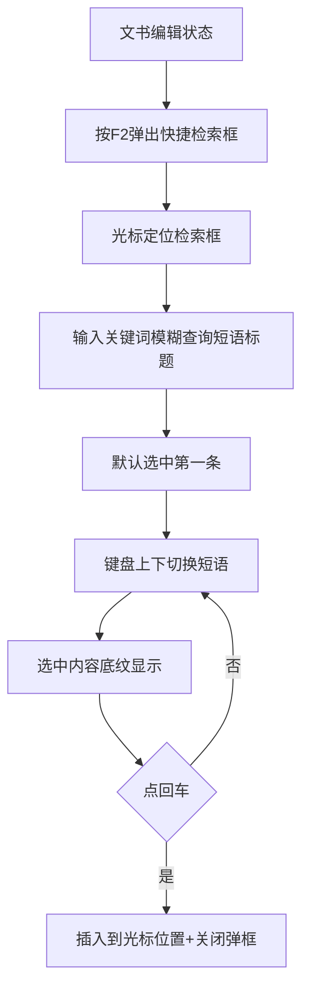

# BLGL-07-DYGL-003短语引用与快捷检索_ Analyst - Spec

> **需求编号**：BLGL-07-DYGL-003
> **父需求**：BLGL-07-DYGL
> **关联PM Spec**：BLGL-07-DYGL-003_短语引用与快捷检索_PM-spec.md
> **Spec版本**：V1.0
> **编写时间**：2026-08-14
> **编写人**：需求分析师

---

## 一、功能编号体系

### 1.1 功能层级结构

```
BLGL-07-DYGL-003: 短语引用与快捷检索
  ├─ BLGL-07-DYGL-003-01: 辅助区短语引用
  │   ├─ -01-01: 按个人/科室/全院浏览短语
  │   ├─ -01-02: 模糊检索过滤（关键词输入）
  │   └─ -01-03: 引用插入（保留格式）
  ├─ BLGL-07-DYGL-003-02: 快捷键快捷检索
  │   ├─ -02-01: 快捷键（F2）弹出检索框
  │   ├─ -02-02: 键盘上下切换/回车插入
  │   └─ -02-03: 检索结果排序（先个人后科室）
  └─ BLGL-07-DYGL-003-03: 引用交互与日志
      ├─ -03-01: 卡片样式/悬浮操作
      ├─ -03-02: 缩略显示模式
      └─ -03-03: 引用日志记录
```

### 1.2 功能编号表

| REQ-ID | 功能名称 | 类型 | 优先级 | 说明 |
|--------|---------|------|--------|------|
| BLGL-07-DYGL-003-01 | 辅助区短语引用 | 功能 | P0 | 辅助区浏览/检索/引用短语 |
| BLGL-07-DYGL-003-01-01 | 按范围浏览短语 | 子功能 | P0 | 个人/科室/全院浏览 |
| BLGL-07-DYGL-003-01-02 | 模糊检索过滤 | 子功能 | P0 | 关键词输入过滤 |
| BLGL-07-DYGL-003-01-03 | 引用插入保留格式 | 子功能 | P0 | 插入保留编辑器块格式 |
| BLGL-07-DYGL-003-02 | 快捷键快捷检索 | 功能 | P0 | F2快捷检索插入 |
| BLGL-07-DYGL-003-02-01 | 快捷键弹出检索框 | 子功能 | P0 | 默认F2弹出 |
| BLGL-07-DYGL-003-02-02 | 键盘切换回车插入 | 子功能 | P0 | 上下切换、回车插入关闭 |
| BLGL-07-DYGL-003-02-03 | 检索结果排序 | 子功能 | P1 | 先个人后科室 |
| BLGL-07-DYGL-003-03 | 引用交互与日志 | 功能 | P1 | 交互优化与日志 |
| BLGL-07-DYGL-003-03-01 | 卡片/悬浮交互 | 子功能 | P1 | 卡片样式、悬浮引用删除 |
| BLGL-07-DYGL-003-03-02 | 缩略显示模式 | 子功能 | P1 | 只显示标题，按账号记忆 |
| BLGL-07-DYGL-003-03-03 | 引用日志记录 | 子功能 | P1 | addRefPhaseActionLog |

---

## 二、核心业务流程

### 2.1 辅助区短语引用流程



### 2.2 快捷键检索流程



---

## 三、功能规格说明

---

### BLGL-07-DYGL-003-01: 辅助区短语引用

#### 3.1.1 功能概述

医生在病历编辑器辅助区"短语引用"面板按个人/科室/全院浏览短语，支持关键词模糊检索过滤，点击引用插入病历并保留格式。

#### 3.1.2 用户角色

| 角色 | 使用场景 | 权限要求 | 操作频率 |
|------|---------|---------|---------|
| 住院医生 | 辅助区引用短语 | 病历编辑权限 | 高频 |

#### 3.1.3 业务流程（Given/When/Then）

##### 主流程

**Scenario 1: 辅助区短语引用**

```gherkin
Given:
  - 医生已登录并在病历编辑界面
  - 病历编辑器右侧辅助区已有"短语引用"面板

When:
  - 医生打开辅助区"短语引用"面板
  - 按个人/科室/全院浏览短语
  - 点击引用按钮

Then:
  - 短语插入到病历光标位置
  - 插入保留维护时保存的回车换行、空格等格式
  - 记录短语引用日志
```

##### 异常流程

**Scenario 2: 业务异常——短语格式丢失**

```gherkin
Given:
  - 短语维护时保存了回车换行、空格等格式

When:
  - 医生在辅助区引用短语插入病历

Then:
  - 若按纯文本插入，短语变单行连续文本（格式丢失）
  - 应复用编辑器块格式插入能力，保留格式
```

**Scenario 3: 数据异常——模糊检索无结果**

```gherkin
Given:
  - 医生输入关键词模糊检索短语

When:
  - 检索关键词无匹配短语

Then:
  - 显示空结果提示
  - ⏳ 待确认：空结果提示文案
```

##### 边界流程

**Scenario 4: 边界场景——模糊检索交互**

```gherkin
Given:
  - 医生在短语引用面板输入关键词

When:
  - 医生输入文字后按enter键

Then:
  - 系统筛选短语信息，相关文字颜色变蓝
```

**Scenario 5: 边界场景——卡片悬浮交互**

```gherkin
Given:
  - 医生鼠标移入短语区域

When:
  - 医生查看短语区域

Then:
  - 描边线变色，显示"删除""引用"按钮
  - 删除在左，引用在右
```

#### 3.1.4 数据字段定义

> 字段名来自代码扫描（`E:\39EMR\sr-next`，标注 ``）。

| 字段名 | 类型 | 必填 | 默认值 | 取值范围 | 说明 | 概念ID |
|--------|------|------|--------|---------|------|--------|
| contentData | String | 是 | - | - | 短语内容（编辑器块格式，引用时保留格式用） | ⏳ 待确认 |
| contentTxt | String | 是 | - | - | 短语纯文本 | ⏳ 待确认 |
| inpEmrPhraseName | String | 是 | - | - | 短语名称（模糊检索匹配字段） | ⏳ 待确认 |
| 关键词 | String | 否 | 空 | - | 模糊检索输入 | ⏳ 待确认 |

#### 3.1.5 验收标准

| AC编号 | 验收标准 | 对应REQ-ID | 验证方法 | 验证场景 |
|--------|---------|-----------|---------|---------|
| AC-001 | 辅助区按个人/科室/全院浏览并引用短语，插入光标位置 | -003-01 | 功能测试 | Scenario 1 |
| AC-002 | 输入关键词模糊检索，enter 键筛选过滤 | -003-01 | 功能测试 | Scenario 4 |
| AC-003 | 引用插入保留换行/空格格式 | -003-01 | 功能测试 | Scenario 2 |
| AC-004 | 悬浮显示引用/删除按钮，删除在左引用在右 | -003-01 | 功能测试 | Scenario 5 |

---

### BLGL-07-DYGL-003-02: 快捷键快捷检索

#### 3.2.1 功能概述

文书编辑状态开启快捷键（默认F2），弹出短语快捷检索框，光标定位到检索框，支持键盘上下切换短语、回车插入并关闭弹框。检索结果按先个人后科室短语顺序显示。

#### 3.2.2 用户角色

| 角色 | 使用场景 | 权限要求 | 操作频率 |
|------|---------|---------|---------|
| 住院医生 | 文书编辑时快捷键检索短语 | 病历编辑权限 | 高频 |

#### 3.2.3 业务流程（Given/When/Then）

##### 主流程

**Scenario 1: 快捷键快捷检索**

```gherkin
Given:
  - 文书编辑状态，开启快捷键（默认F2）

When:
  - 医生按F2弹出短语快捷检索框
  - 输入关键词模糊查询短语标题
  - 键盘上下切换短语，选中内容底纹显示
  - 点回车插入到光标位置

Then:
  - 插入短语并关闭弹框
  - 检索结果以先个人后科室短语的顺序显示
  - 默认选中第一条数据
```

##### 异常流程

**Scenario 2: 系统异常——快捷键未生效**

```gherkin
Given:
  - 文书编辑状态

When:
  - 医生按快捷键（默认F2）

Then:
  - 弹出短语快捷检索框，光标定位到检索框
  - ⏳ 待确认：快捷键冲突时的处理
```

##### 边界流程

**Scenario 3: 边界场景——全院短语检索**

```gherkin
Given:
  - 医生开启快捷键（默认F2）

When:
  - 医生检索全院短语

Then:
  - 支持全院短语快捷键检索（优化后）
  - 检索结果按先个人后科室顺序
```

#### 3.2.4 数据字段定义

| 字段名 | 类型 | 必填 | 默认值 | 取值范围 | 说明 | 概念ID |
|--------|------|------|--------|---------|------|--------|
| 快捷键 | String | 否 | F2 | - | 短语引用快捷键 | ⏳ 待确认 |

#### 3.2.5 验收标准

| AC编号 | 验收标准 | 对应REQ-ID | 验证方法 | 验证场景 |
|--------|---------|-----------|---------|---------|
| AC-005 | 按F2弹出快捷检索框，光标定位检索框 | -003-02 | 功能测试 | Scenario 1 |
| AC-006 | 键盘上下切换短语，回车插入并关闭弹框 | -003-02 | 功能测试 | Scenario 1 |
| AC-007 | 检索结果先个人后科室顺序显示 | -003-02 | 功能测试 | Scenario 3 |

---

### BLGL-07-DYGL-003-03: 引用交互与日志

#### 3.3.1 功能概述

短语引用面板的交互体验优化（卡片样式、悬浮操作、缩略模式）与引用日志记录。引用操作通过 addRefPhaseActionLog 记录。

#### 3.3.2 用户角色

| 角色 | 使用场景 | 权限要求 | 操作频率 |
|------|---------|---------|---------|
| 住院医生 | 设置显示模式、查看引用 | 病历编辑权限 | 中频 |

#### 3.3.3 业务流程（Given/When/Then）

##### 主流程

**Scenario 1: 缩略显示模式**

```gherkin
Given:
  - 医生在短语引用设置显示模式

When:
  - 医生切换为缩略模式

Then:
  - 只显示标题，更多按钮显示在标题后面
  - 点击后展开全部短语内容
  - 选择后按账号记忆
```

##### 异常流程

**Scenario 2: 数据异常——引用日志**

```gherkin
Given:
  - 医生引用短语

When:
  - 系统记录引用操作

Then:
  - 引用日志成功记录（addRefPhaseActionLog）
  - ⏳ 待确认：日志记录失败时的处理
```

##### 边界流程

**Scenario 3: 边界场景——辅助区位置**

```gherkin
Given:
  - 医生个人设置辅助区显示位置为下侧

When:
  - 医生查看短语引用

Then:
  - 短语引用在下侧底部弹出展示
  - 分类仍为个人/科室/全院
```

#### 3.3.4 数据字段定义

| 字段名 | 类型 | 必填 | 默认值 | 取值范围 | 说明 | 概念ID |
|--------|------|------|--------|---------|------|--------|
| 显示模式 | String | 否 | 正常 | 正常/缩略 | 引用显示模式，按账号记忆 | ⏳ 待确认 |
| addRefPhaseActionLog | - | 否 | - | - | 引用日志接口：/add_phrase_action | ⏳ 待确认 |

#### 3.3.5 验收标准

| AC编号 | 验收标准 | 对应REQ-ID | 验证方法 | 验证场景 |
|--------|---------|-----------|---------|---------|
| AC-008 | 缩略模式只显示标题+更多按钮，按账号记忆 | -003-03 | 功能测试 | Scenario 1 |
| AC-009 | 引用操作记录到引用日志 | -003-03 | 功能测试 | Scenario 2 |

---

## 四、排除范围

本需求不包含以下功能项：

1. **短语收藏与创建** - 收藏提交，属 BLGL-07-DYGL-001
2. **短语审核** - 审核通过/驳回，属 BLGL-07-DYGL-002
3. **短语维护** - 编辑/删除/排序，属 BLGL-07-DYGL-004
4. **审核与权限参数配置** - 属 BLGL-07-DYGL-005

> 与 PM-Spec 第四章一致。对照 Phase 1 功能点Spec 第6章（基线能力），确保不越界。

---

## 五、业务规则清单

| 规则ID | 规则名称 | 规则描述 | 来源 | 优先级 |
|--------|---------|---------|------|--------|
| BR-001 | 引用范围 | 医生可在辅助区按个人/科室/全院浏览引用短语 | 0 | P0 |
| BR-002 | 模糊检索 | 输入关键词对短语标题模糊查询过滤 | — | P0 |
| BR-003 | 快捷键检索 | 文书编辑状态按F2弹出快捷检索框，光标定位检索框 | 6、1487023 | P0 |
| BR-004 | 检索排序 | 检索结果按先个人后科室短语顺序显示 | 3 | P1 |
| BR-005 | 保留格式 | 短语引用插入保留维护时保存的换行/空格等格式 | 1 | P1 |
| BR-006 | 显示模式 | 短语引用支持正常/缩略模式，按账号记忆 | 5 | P1 |

---

## 六、关联文档

| 文档类型 | 文档路径 | 说明 |
|---------|---------|------|
| 功能点Spec（模块级） | 上级目录 BLGL-07-DYGL 07短语管理功能点Spec.md（V1.0） | 模块级功能点索引 |
| 功能Spec（业务背景与设计） | 本目录 BLGL-07-DYGL-003_短语引用与快捷检索-Spec.md（V1.0） | 业务背景与目标 Spec |
| Analyst-Spec（分析规格） | 本目录 BLGL-07-DYGL-003_短语引用与快捷检索_Analyst-spec.md（V1.0）（本文档） | 分析规格 |
| PM-Spec（需求规格） | 本目录 BLGL-07-DYGL-003_短语引用与快捷检索_PM-spec.md（V0.1） | PM 产出的 Spec 文档 |
| data-model.md | 待产出 | 架构师产出的数据建模文档 |
| design.md | 待产出 | 架构师产出的技术方案文档 |
| api-contract.md | 待产出 | 开发经理产出的 API 契约文档 |

---

## 七、待确认问题清单

| 编号 | 问题描述 | 缺失信息 | 影响范围 | 建议补充方 |
|------|---------|---------|---------|-----------|
| Q-001 | 模糊检索空结果提示文案 | 空结果提示方案 | 3.1.3 Scenario 3 | 产品经理 |
| Q-002 | 快捷键冲突处理 | 快捷键冲突降级方案 | 3.2.3 Scenario 2 | 产品经理 |
| Q-003 | 引用日志失败处理 | 日志记录失败降级 | 3.3.3 Scenario 2 | 开发经理 |
| Q-004 | 引用完整接口契约 | API 请求/返回字段 | 第5章接口设计 | 开发经理 |
| Q-005 | 概念ID、显示模式枚举、性能指标 | 字段概念ID、模式枚举、SLA | 数据模型、非功能 | 架构师/产品经理 |

---

## 填写检查清单

| 序号 | 检查项 | 是否完成 |
|:----:|--------|:--------:|
| 1 | 功能编号带父子层级 | ✅ |
| 2 | 每个 REQ-ID 有功能概述和用户角色 | ✅ |
| 3 | 主流程至少 1 个 Given/When/Then 场景 | ✅ |
| 4 | 异常流程至少 3 个 Given/When/Then 场景 | ✅ |
| 5 | 边界流程至少 2 个 Given/When/Then 场景 | ✅ |
| 6 | 每个 Given/When/Then 内容具体，不模糊 | ✅ |
| 7 | 数据字段定义完整 | ✅ |
| 8 | 验收标准 AC 编号独立，可验证 | ✅ |
| 9 | 验收标准无"功能正常"等模糊表述 | ✅ |
| 10 | 排除范围明确列出 | ✅ |
| 11 | 业务规则清单列出所有规则，每条标注来源 | ✅ |
| 12 | 流程图使用 Mermaid 格式（≥2 个） | ✅ |
| 13 | 关联文档索引包含 Phase 1 功能点Spec | ✅ |
| 14 | 待确认问题清单汇总了全文所有 ⏳ 项 | ✅ |
| 15 | 全文无占位符 `< >` 残留 | ✅ |
| 16 | 全文陈述可溯源至资料区（S1~S10 溯源核查） | ✅ |
| 17 | 人工审核确认完成 | ⏳ 待确认 |

---

**文档状态**：⬜ 待审核
**维护责任**：需求分析师规范组
**下次更新**：根据评审反馈优化

---

## 版本历史

| 版本 | 日期 | 变更说明 | 编写人 |
|------|------|---------|--------|
| V1.0 | 2026-08-14 | 初始版本 | 需求分析师 |
