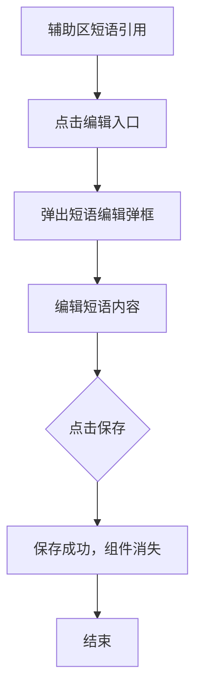
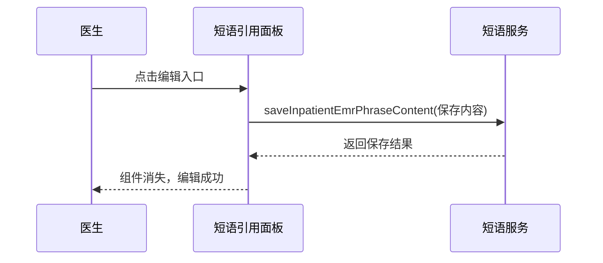

# BLGL-07-DYGL-004 短语维护 - Spec

> **功能编号**：BLGL-07-DYGL-004
> **文档类型**：功能Spec（业务背景与设计）
> **文档版本**：V1.0
> **编写时间**：2026-08-14
> **编写人**：RACC

---

## 文档索引

#### 章节索引

**Spec（研发视角）**

| 章节号 | 章节名称 | 内容说明 |
|--------|---------|---------|
| 1、 | 文档概述 | 文档目的、文档范围、术语定义、阅读指南、参考文档 |
| 2、 | 功能背景与定位 | 功能背景、功能定位、目标用户、核心价值 |
| 3、 | 业务流程设计 | 主流程/异常流程/边界流程（Given/When/Then） |
| 4、 | 数据模型设计 | 核心数据结构、状态定义、系统参数定义 |
| 5、 | 接口契约设计 | API列表、接口详细设计、错误码定义 |
| 6、 | 技术方案设计 | 页面路径、技术栈、关键技术点、部署方案 |
| 7、 | 测试用例预设计 | 功能/边界/异常/性能测试用例 |
| 8、 | 非功能性要求 | 性能、安全、可用性、兼容性 |
| 9、 | 依赖与风险 | 外部依赖、风险项 |
| 10、 | 附录 | 流程图、时序图、参考文档 |

**PM-Spec（业务视角）**

| 章节号 | 章节名称 | 内容说明 |
|--------|---------|---------|
| 一 | 目标 | 功能定位与核心价值 |
| 二 | 约束 | 业务/技术/非功能性约束 |
| 三 | 验收标准 | 验收条件与验证方法 |
| 四 | 排除范围 | 本次不做项与明确边界 |
| 五 | 关键决策记录 | 方案决策与选型理由 |
| 六 | 优先级 | 优先级定义 |
| 七 | 关联文档 | 关联文档索引 |
| 附录 | 填写检查清单 | 质量检查 |

**Analyst-Spec（产品视角）**

| 章节号 | 章节名称 | 内容说明 |
|--------|---------|---------|
| 一 | 功能编号体系 | 功能编号与层级结构 |
| 二 | 核心业务流程 | 核心业务流程与时序 |
| 三 | 功能规格说明 | 详细功能规格与验收标准 |
| 四 | 排除范围 | 排除范围 |
| 五 | 业务规则清单 | 业务规则清单 |
| 六 | 关联文档 | 关联文档索引 |
| 七 | 待确认问题清单 | 待确认问题汇总 |
| - | 填写检查清单 | 质量检查 |

#### 版本历史

| 版本 | 日期 | 变更说明 | 编写人 |
|------|------|---------|--------|
| V1.0 | 2026-08-14 | 初始版本 | RACC |

#### 关联文档索引

| 序号 | 文档名称 | 文档类型 | 版本 | 位置 |
|------|---------|---------|------|------|
| 1 | BLGL-07-DYGL 07短语管理功能点Spec.md | 功能点Spec（模块级） | V1.0 | 上级目录 |
| 2 | BLGL-07-DYGL-004_短语维护-Spec.md | 功能Spec（业务背景与设计）（本文档） | V1.0 | 本目录 |
| 3 | BLGL-07-DYGL-004_短语维护_Analyst-spec.md | Analyst-Spec（分析规格） | V1.0 | 本目录 |
| 4 | BLGL-07-DYGL-004_短语维护_PM-spec.md | PM-Spec（需求规格） | V0.1 | 本目录 |

---

## 1、文档概述

### 1.1、文档目的

本文档旨在明确"短语维护"功能（BLGL-07-DYGL-004）的业务背景与设计方案，为需求分析、研发实现、测试验收及评审提供统一的业务上下文、设计口径与决策依据。

### 1.2、文档范围

#### 1.2.1 纳入范围

本文档覆盖短语维护的完整业务背景与设计，包括：

- 短语内容编辑：在辅助区"短语引用"面板编辑短语内容并保存
- 短语删除：按创建人/角色权限控制删除
- 短语启用/停用管理
- 短语名称修改（支持标点符号录入）

#### 1.2.2 排除范围

本文档不涉及以下内容（详见其他功能点或模块）：

- 短语收藏与创建（收藏提交）—— BLGL-07-DYGL-001
- 短语审核（审核通过/驳回）—— BLGL-07-DYGL-002
- 短语引用与快捷检索（引用插入）—— BLGL-07-DYGL-003
- 短语审核与权限参数配置—— BLGL-07-DYGL-005
- 短语目录维护、排序、共享、导入 —— Phase 1 功能点Spec 第6章基础能力（BC-DYGL-001~007）

### 1.3、术语定义

| 术语 | 定义 |
|------|------|
| 短语编辑 | 在辅助区"短语引用"面板编辑短语内容并保存 |
| 短语删除权限 | 按短语创建人及参数 COMMON170 配置角色控制删除 |
| 短语工具栏 | 短语编辑界面沿用的病历工具栏（已去掉） |

> ⏳ 待确认：规范术语表待产品文档确认。

### 1.4、阅读指南

- **章节关系**：第1~2章为业务全貌，第3~10章为设计实现层。与 Analyst-Spec、PM-Spec 互相引用保持一致。
- **读者对象**：产品经理/需求分析师读第1~2章；研发读第3~6、9~10章；测试读第3、7~8章；评审人员核对各层一致性。

### 1.5、参考文档

| 序号 | 文档名称 | 版本/日期 |
|------|---------|----------|
| 1 | 【历史需求】住院病历的历史需求.xlsx | - |
| 2 | BLGL-07-DYGL-004_短语维护_PM-spec.md | V0.1 |
| 3 | BLGL-07-DYGL-004_短语维护_Analyst-spec.md | V1.0 |
| 4 | BLGL-07-DYGL 07短语管理功能点Spec.md | V1.0 |

---

## 2、功能背景与定位

### 2.1 功能背景

短语维护是短语内容的管理环节，需满足：

- **管理要求**：医生可在辅助区直接编辑短语内容保存，无需切换到日常管理页面
- **现状痛点**：
  - 辅助区短语编辑弹窗保存按钮置灰，无法保存
  - 科室短语删除权限不统一，无编辑权限时仍可删除
  - 短语编辑界面沿用了病历工具栏，无意义
- **历史需求演进**：从短语可在框内编辑→ 编辑保存功能补齐（4）→ 删除权限统一→ 去掉工具栏（9）

### 2.2 功能定位

"短语维护"是 WiNEX 病历管理-短语管理模块的内容管理环节，定位为：

- **短语内容管理**：编辑、删除、启用/停用短语
- **权限管控**：按创建人/角色控制删除权限
- **便捷编辑**：辅助区直接编辑保存，无需切换页面

### 2.3 目标用户

| 用户角色 | 主要使用场景 |
|---------|-------------|
| 住院医生 | 在辅助区短语引用面板编辑/删除个人短语 |
| 科室管理者 | 编辑/删除科室短语（按权限） |

### 2.4 核心价值

| 价值维度 | 价值描述 |
|---------|---------|
| 便捷高效 | 辅助区直接编辑保存，无需切换页面 |
| 权限合规 | 删除权限与短语维护页面一致 |
| 界面简洁 | 去掉无用工具栏 |

---

## 3、业务流程设计（Given/When/Then）

### 3.1 主流程

**Scenario 1: 短语编辑保存**

```gherkin
Given:
  - 医生已登录并在病历编辑界面
  - 辅助区"短语引用"面板已有短语

When:
  - 医生点击短语卡片上的"编辑"入口
  - 弹出短语编辑组件弹框
  - 在组件里编辑短语内容
  - 点击保存

Then:
  - 保存编辑后的短语内容
  - 组件消失
  - 短语更新生效
```

### 3.2 异常流程

**Scenario 2: 业务异常——保存按钮置灰**

```gherkin
Given:
  - 医生在辅助区打开短语编辑弹窗

When:
  - 医生编辑短语内容

Then:
  - 保存按钮应可点击
  - 原"保存按钮置灰无法操作"问题需修复
```

**Scenario 3: 数据异常——无删除权限**

```gherkin
Given:
  - 医生不是短语创建人
  - 医生角色不在参数 COMMON170 配置的"允许编辑所有科室短语的角色"中

When:
  - 医生尝试删除科室短语

Then:
  - 系统提醒"该短语创建人为xxx，当前账号无操作权限"
  - 阻止删除操作
```

**Scenario 4: 系统异常——短语名称特殊字符**

```gherkin
Given:
  - 医生修改短语名称

When:
  - 短语名称含"-"等标点符号

Then:
  - 系统支持录入标点符号，不阻止输入
  - ⏳ 待确认：特殊字符校验规则
```

### 3.3 边界流程

**Scenario 5: 边界场景——删除权限**

```gherkin
Given:
  - 医生是短语创建人
  - 或医生角色在参数 COMMON170 配置的角色中

When:
  - 医生尝试删除短语

Then:
  - 删除成功
```

**Scenario 6: 边界场景——启用/停用**

```gherkin
Given:
  - 医生在短语维护界面

When:
  - 医生执行短语启用/停用操作

Then:
  - 停用后短语不可引用，启用后可引用
```

---

## 4、数据模型设计

> 数据模型信息来自代码扫描（`E:\39EMR\sr-next`）和历史需求。标注 `` 的字段来自输入 AO/PO 实体，标注 `` 的来自需求文本。

### 4.1 核心数据结构

#### 4.1.1 核心维护入参（InpatientEmrPhraseUpdateInputAO / InpatientEmrPhraseDelInputAO）

| 字段名 | 类型 | 必填 | 备注 |
|--------|------|------|------|
| inpEmrPhraseId | Long | 是 | 短语ID |
| enabledFlag | Long | 是 | 启用标志 |
| 短语内容 | String | 是 | 编辑后的短语内容 |
| 短语名称 | String | 是 | 修改后的短语名称 |

> ⏳ 待确认：完整入参结构待接口契约文档补充。

#### 4.1.2 核心表/实体

| 表/实体 | 关键字段 | 说明 |
|---------|---------|------|
| INPATIENT_EMR_PHRASE（InpatientEmrPhrasePO） | INP_EMR_PHRASE_ID、INP_EMR_PHRASE_NAME、ENABLED_FLAG | 短语主表，编辑/删除/启用停用 |
| INPATIENT_EMR_PHRASE_CONTENT | 短语内容 | 短语内容表，编辑保存 |

> ⏳ 待确认：完整数据表清单待代码扫描或功能清单数据表清单补充。

### 4.2 状态定义

| 状态码 | 状态名称 | 说明 |
|--------|---------|------|
| enabledFlag=1 | 启用 | 短语可引用 |
| enabledFlag=0 | 停用 | 短语不可引用 |

### 4.3 系统参数定义

| 参数编码 | 参数名称 | 说明 |
|---------|---------|------|
| COMMON170 | 允许编辑所有科室短语的角色 | 配置该角色的用户可编辑/删除所有科室短语 |

---

## 5、接口契约设计

> 接口信息来自代码扫描（`E:\39EMR\sr-next`）的 InpatientEmrPhraseController + 前端 API。标注 ``。

### 5.1 API列表

| 序号 | API名称（代码函数） | 路径 | 方法 | 说明 |
|:----:|---------|------|:----:|------|
| 1 | saveInpatientEmrPhraseContent / V2 | /api/v2/app_record_inpatient/emr_inpatient/emr_phrase_content/save | POST | 保存短语内容 |
| 2 | deleteInpatientEmrPhrase | /api/v1/app_record_inpatient/emr_inpatient/phrase/delete | POST | 删除短语 |
| 3 | updateInpatientEmrPhraseEnabledById | /api/v1/app_record_inpatient/emr_inpatient/phrase/enabled | POST | 启用短语 |
| 4 | updateInpatientEmrPhraseDisabledById | /api/v1/app_record_inpatient/emr_inpatient/phrase/disabled | POST | 停用短语 |
| 5 | updateInpatientEmrPhraseNameById | /api/v1/app_record_inpatient/emr_inpatient/phrase_name/update | POST | 修改短语名称 |
| 6 | updateInpatientEmrPhraseClass | /api/v1/app_record_inpatient/emr_inpatient/phrase_class/update | POST | 更新短语目录 |

> 前端实际请求前缀：`/inpatient-clinicalnote/api/v1\|v2/app_record_inpatient/`。

### 5.2 接口详细设计

#### 5.2.1 保存短语内容（saveInpatientEmrPhraseContent）

**请求参数（InpatientEmrPhraseContentSaveInputAO）**:
```json
{
  "inpEmrPhraseId": 5001,
  "inpEmrPhraseContentData": "<编辑器块>",
  "inpEmrPhraseContentTxt": "肺部听诊呼吸音清"
}
```

**返回值（成功，InpatientEmrPhraseContentSaveOutputVO）**:
```json
{
  "success": true,
  "data": {
    "inpEmrPhraseId": 5001
  }
}
```

**返回值（失败）**:
```json
{
  "success": false,
  "message": "保存失败",
  "data": null
}
```

> ⏳ 待确认：具体字段名/结构以接口契约文档为准，以上字段来自代码扫描的输入AO。

### 5.3 错误码定义

| 错误码 | 错误信息 | 处理方式 |
|--------|---------|---------|
| ⏳ 待确认 | 该短语创建人为xxx，当前账号无操作权限 | 删除权限不足提示 |

> ⏳ 待确认：业务错误码定义未在代码扫描中提取完整。

---

## 6、技术方案设计

### 6.1 页面路径

- **页面路径**: 住院医生站→病历编辑界面→辅助区"短语引用"面板编辑；日常管理→短语维护
- **前端组件**: AuxiliaryOnPhraseRefen/index.vue（引用面板编辑）+ PhraseManagement/index.vue（维护页面）
- **前端工程**: winning-webui-inpatient-clinicalnote-pango（Vue2 + element-ui）

### 6.2 技术栈

| 类别 | 技术 | 版本 |
|------|------|------|
| 前端框架 | Vue | 2.6.14 |
| 前端UI | element-ui | 2.13.0 |
| 后端框架 | Spring Boot（Java） | java.version 17 |
| 构建工具 | webpack / Maven | 前端 webpack + 后端 Maven |

### 6.3 关键技术点

- 编辑保存：saveInpatientEmrPhraseContent（/emr_phrase_content/save），修复辅助区保存按钮置灰
- 删除权限：按创建人 + COMMON170 配置角色控制
- 启用/停用：updateInpatientEmrPhraseEnabledById/DisabledById
- 去掉工具栏：短语为纯文本编辑，工具栏无意义

### 6.4 部署方案

⏳ 待确认：部署方案未在资料区中找到。

---

## 7、测试用例预设计

### 7.1 功能测试

| 用例编号 | 测试场景 | Given | When | Then |
|---------|---------|-------|------|------|
| TC-001 | 短语编辑保存 | 辅助区有短语 | 点击编辑并保存 | 保存成功，组件消失 |
| TC-002 | 短语删除 | 医生是创建人 | 删除短语 | 删除成功 |

### 7.2 边界测试

| 用例编号 | 测试场景 | Given | When | Then |
|---------|---------|-------|------|------|
| TC-003 | 无删除权限 | 非创建人且非COMMON170角色 | 尝试删除 | 提示无操作权限 |
| TC-004 | 短语启用/停用 | 短语在维护界面 | 停用/启用 | 停用不可引用，启用可引用 |

### 7.3 异常测试

| 用例编号 | 测试场景 | Given | When | Then |
|---------|---------|-------|------|------|
| TC-005 | 保存按钮置灰 | 辅助区打开编辑弹窗 | 编辑内容 | 保存按钮可点击（6） |
| TC-006 | 名称特殊字符 | 输入含"-"的名称 | 修改名称 | 支持标点符号录入 |

### 7.4 性能测试

| 用例编号 | 测试场景 | 指标 |
|---------|---------|------|
| TC-007 | 编辑保存响应 | ⏳ 待确认：性能指标未在资料区中找到 |

---

## 8、非功能性要求

### 8.1 性能要求

| 指标 | 要求 |
|------|------|
| 编辑保存响应 | ⏳ 待确认 |

### 8.2 安全要求

| 要求 | 说明 |
|------|------|
| 删除权限 | 按创建人 + COMMON170 角色控制 |

**医疗行业特殊要求**

| 要求 | 说明 |
|------|------|
| 病历内容一致性 | 短语编辑不影响已引用病历内容 |

### 8.3 可用性要求

| 指标 | 要求值 |
|------|--------|
| 可用性 | ⏳ 待确认 |

### 8.4 兼容性要求

| 类型 | 要求 |
|------|------|
| 编辑界面 | 去掉工具栏，短语为纯文本编辑 |

---

## 9、依赖与风险

### 9.1 外部依赖

| 依赖项 | 说明 |
|--------|------|
| 权限系统 | 删除权限校验 |

### 9.2 风险项

| 风险项 | 等级 | 说明 | 应对方案 |
|--------|------|------|---------|
| 保存按钮置灰 | 中 | 辅助区编辑无法保存 | 修复保存逻辑 |
| 删除权限不统一 | 中 | 无权限仍可删除 | 统一按创建人+角色控制 |

---

## 10、附录

### 10.1 流程图



### 10.2 时序图



### 10.3 参考文档

- BLGL-07-DYGL 07短语管理功能点Spec.md（V1.0，第5章 -004 行）
- 关联Spec: BLGL-07-DYGL-001_短语收藏与创建-Spec.md（短语来源）、BLGL-07-DYGL-003_短语引用与快捷检索-Spec.md（引用场景）

---

## 填写检查清单

| 序号 | 检查项 | 是否完成 |
|:----:|--------|:--------:|
| 1 | 章节索引与正文章节一致 | ✅ |
| 2 | 版本历史记录完整 | ✅ |
| 3 | 关联文档索引已登记全部Spec | ✅ |
| 4 | 文档目的明确回答"为什么做/做成什么/怎么做" | ✅ |
| 5 | 纳入范围/排除范围清晰 | ✅ |
| 6 | 术语定义覆盖关键概念，从资料区可溯源 | ✅ |
| 7 | 参考文档已登记 | ✅ |
| 8 | 功能背景基于法规/规范/需求来源组织 | ✅ |
| 9 | 功能定位体现业务价值（3~5个定位点） | ✅ |
| 10 | 目标用户角色覆盖完整，在需求原文中有出处 | ✅ |
| 11 | 核心价值可陈述，与 Phase 1 口径一致 | ✅ |
| 12 | 业务流程：主流程≥1、异常≥3、边界≥2，Given/When/Then 具体 | ✅ |
| 13 | 数据模型：字段/表/状态/参数可溯源 | ✅ |
| 14 | 接口契约：API列表+详细设计+错误码齐全或标记待确认 | ✅ |
| 15 | 技术方案：页面路径/技术栈/关键点/部署方案或标记待确认 | ✅ |
| 16 | 测试用例：功能/边界/异常/性能覆盖 | ✅ |
| 17 | 非功能性要求：性能/安全/可用性/兼容性指标可量化或标记待确认 | ✅ |
| 18 | 依赖与风险：外部依赖登记完整 | ✅ |
| 19 | 附录：流程图/时序图与正文流程一致 | ✅ |
| 20 | 全文无占位符 `< >` 残留 | ✅ |
| 21 | 全文陈述可溯源至资料区 | ✅ |
| 22 | 人工审核确认完成 | ⏳ 待确认 |

---

**文档状态**：⬜ 待审核
**维护责任**：RACC
**下次更新**：根据评审反馈优化
