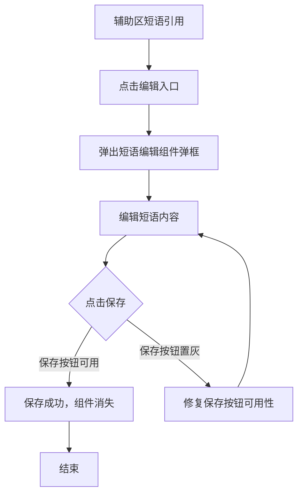
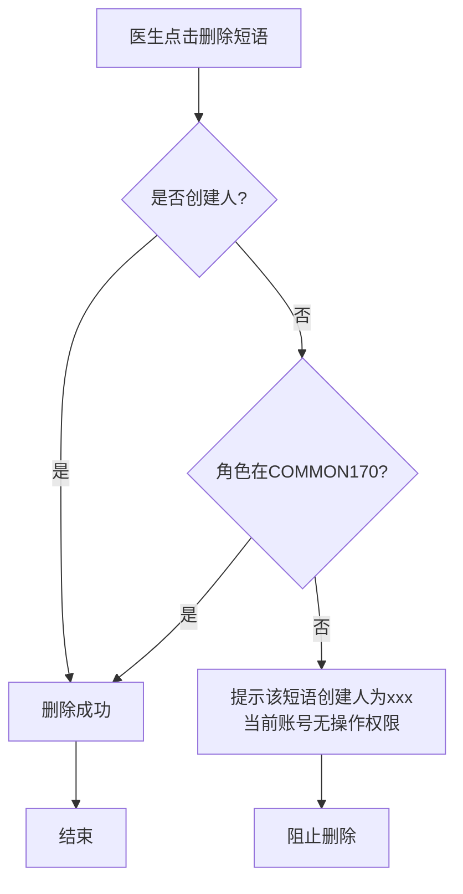

# BLGL-07-DYGL-004短语维护_ Analyst - Spec

> **需求编号**：BLGL-07-DYGL-004
> **父需求**：BLGL-07-DYGL
> **关联PM Spec**：BLGL-07-DYGL-004_短语维护_PM-spec.md
> **Spec版本**：V1.0
> **编写时间**：2026-08-14
> **编写人**：需求分析师

---

## 一、功能编号体系

### 1.1 功能层级结构

```
BLGL-07-DYGL-004: 短语维护
  ├─ BLGL-07-DYGL-004-01: 短语内容编辑
  │   ├─ -01-01: 辅助区编辑弹框（编辑内容）
  │   ├─ -01-02: 编辑保存
  │   └─ -01-03: 保存按钮可用性修复
  ├─ BLGL-07-DYGL-004-02: 短语删除与权限
  │   ├─ -02-01: 删除短语（创建人/COMMON170角色）
  │   └─ -02-02: 无权限删除提示
  └─ BLGL-07-DYGL-004-03: 短语启用/停用与名称修改
      ├─ -03-01: 短语启用/停用
      └─ -03-02: 短语名称修改（含标点符号）
```

### 1.2 功能编号表

| REQ-ID | 功能名称 | 类型 | 优先级 | 说明 |
|--------|---------|------|--------|------|
| BLGL-07-DYGL-004-01 | 短语内容编辑 | 功能 | P0 | 辅助区编辑短语内容并保存 |
| BLGL-07-DYGL-004-01-01 | 辅助区编辑弹框 | 子功能 | P0 | 点击编辑弹出弹框编辑内容 |
| BLGL-07-DYGL-004-01-02 | 编辑保存 | 子功能 | P0 | 保存编辑后的短语内容 |
| BLGL-07-DYGL-004-01-03 | 保存按钮可用性修复 | 子功能 | P1 | 修复保存按钮置灰问题 |
| BLGL-07-DYGL-004-02 | 短语删除与权限 | 功能 | P0 | 按创建人/角色权限删除 |
| BLGL-07-DYGL-004-02-01 | 删除短语 | 子功能 | P0 | 有权限删除 |
| BLGL-07-DYGL-004-02-02 | 无权限删除提示 | 子功能 | P1 | 提示无操作权限 |
| BLGL-07-DYGL-004-03 | 启用/停用与名称修改 | 功能 | P1 | 启停与改名 |
| BLGL-07-DYGL-004-03-01 | 短语启用/停用 | 子功能 | P1 | enabledFlag 控制 |
| BLGL-07-DYGL-004-03-02 | 短语名称修改 | 子功能 | P1 | 支持标点符号 |

---

## 二、核心业务流程

### 2.1 短语编辑保存流程



### 2.2 短语删除权限流程



---

## 三、功能规格说明

---

### BLGL-07-DYGL-004-01: 短语内容编辑

#### 3.1.1 功能概述

医生在辅助区"短语引用"面板点击编辑入口，弹出短语编辑组件弹框，编辑短语内容后保存。修复从短语引用面板进入时保存按钮置灰的问题。

#### 3.1.2 用户角色

| 角色 | 使用场景 | 权限要求 | 操作频率 |
|------|---------|---------|---------|
| 住院医生 | 辅助区编辑短语内容 | 病历编辑权限 | 中频 |

#### 3.1.3 业务流程（Given/When/Then）

##### 主流程

**Scenario 1: 短语编辑保存**

```gherkin
Given:
  - 医生已登录并在病历编辑界面
  - 辅助区"短语引用"面板已有短语

When:
  - 医生点击短语卡片上的"编辑"入口
  - 弹出短语编辑组件弹框
  - 在组件里编辑短语内容
  - 点击保存

Then:
  - 保存编辑后的短语内容
  - 组件消失
  - 短语更新生效
```

##### 异常流程

**Scenario 2: 业务异常——保存按钮置灰**

```gherkin
Given:
  - 医生在辅助区打开短语编辑弹窗

When:
  - 医生编辑短语内容

Then:
  - 保存按钮应可点击
  - 原"保存按钮置灰无法操作"问题需修复
```

**Scenario 3: 数据异常——短语名称特殊字符**

```gherkin
Given:
  - 医生修改短语名称

When:
  - 短语名称含"-"等标点符号

Then:
  - 系统支持录入标点符号，不阻止输入
  - ⏳ 待确认：特殊字符校验规则
```

##### 边界流程

**Scenario 4: 边界场景——纯文本编辑**

```gherkin
Given:
  - 医生打开短语编辑界面

When:
  - 医生查看编辑工具栏

Then:
  - 短语为纯文本编辑，去掉无用工具栏
```

**Scenario 5: 边界场景——编辑后保存生效**

```gherkin
Given:
  - 医生编辑短语内容并保存

When:
  - 医生后续引用该短语

Then:
  - 引用的是编辑后的新内容
```

#### 3.1.4 数据字段定义

> 字段名来自代码扫描（`E:\39EMR\sr-next`，标注 ``）。

| 字段名 | 类型 | 必填 | 默认值 | 取值范围 | 说明 | 概念ID |
|--------|------|------|--------|---------|------|--------|
| inpEmrPhraseId | Long | 是 | - | - | 短语ID | ⏳ 待确认 |
| inpEmrPhraseContentData | String | 是 | - | - | 编辑后内容（编辑器块格式） | ⏳ 待确认 |
| inpEmrPhraseContentTxt | String | 是 | - | - | 编辑后纯文本 | ⏳ 待确认 |
| 短语名称 | String | 否 | - | 含标点符号 | 修改后的名称 | ⏳ 待确认 |

#### 3.1.5 验收标准

| AC编号 | 验收标准 | 对应REQ-ID | 验证方法 | 验证场景 |
|--------|---------|-----------|---------|---------|
| AC-001 | 辅助区点击编辑，修改内容保存成功组件消失 | -004-01 | 功能测试 | Scenario 1 |
| AC-002 | 编辑保存按钮可点击，不再置灰 | -004-01 | 功能测试 | Scenario 2 |
| AC-003 | 短语名称支持录入"-"等标点符号 | -004-01 | 功能测试 | Scenario 3 |

---

### BLGL-07-DYGL-004-02: 短语删除与权限

#### 3.2.1 功能概述

短语删除权限与日常管理-短语维护页面保持一致：短语创建人以及参数 COMMON170（允许编辑所有科室短语的角色）配置的角色可以删除，否则提示无操作权限。

#### 3.2.2 用户角色

| 角色 | 使用场景 | 权限要求 | 操作频率 |
|------|---------|---------|---------|
| 住院医生 | 删除个人短语 | 创建人权限 | 低频 |
| 科室管理者 | 删除科室短语 | 创建人或 COMMON170 角色 | 低频 |

#### 3.2.3 业务流程（Given/When/Then）

##### 主流程

**Scenario 1: 删除短语（有权限）**

```gherkin
Given:
  - 医生是短语创建人
  - 或医生角色在参数 COMMON170 配置的角色中

When:
  - 医生点击删除短语

Then:
  - 删除成功
```

##### 异常流程

**Scenario 2: 业务异常——无删除权限**

```gherkin
Given:
  - 医生不是短语创建人
  - 医生角色不在参数 COMMON170 配置的角色中

When:
  - 医生尝试删除科室短语

Then:
  - 系统提醒"该短语创建人为xxx，当前账号无操作权限"
  - 阻止删除操作
```

##### 边界流程

**Scenario 3: 边界场景——删除二次确认**

```gherkin
Given:
  - 医生在辅助区删除短语

When:
  - 医生点击删除

Then:
  - 弹出二次确认（气泡弹窗）
  - 确认后删除成功
```

#### 3.2.4 数据字段定义

| 字段名 | 类型 | 必填 | 默认值 | 取值范围 | 说明 | 概念ID |
|--------|------|------|--------|---------|------|--------|
| inpEmrPhraseId | Long | 是 | - | - | 短语ID | ⏳ 待确认 |
| deleteInpatientEmrPhrase | - | 否 | - | - | 删除接口 | ⏳ 待确认 |

#### 3.2.5 验收标准

| AC编号 | 验收标准 | 对应REQ-ID | 验证方法 | 验证场景 |
|--------|---------|-----------|---------|---------|
| AC-004 | 创建人或COMMON170角色可删除短语 | -004-02 | 功能测试 | Scenario 1 |
| AC-005 | 无权限删除时提示"该短语创建人为xxx，当前账号无操作权限" | -004-02 | 功能测试 | Scenario 2 |

---

### BLGL-07-DYGL-004-03: 短语启用/停用与名称修改

#### 3.3.1 功能概述

短语支持启用/停用管理（enabledFlag 控制），支持短语名称修改（含标点符号）。

#### 3.3.2 用户角色

| 角色 | 使用场景 | 权限要求 | 操作频率 |
|------|---------|---------|---------|
| 住院医生 | 停用/启用个人短语 | 短语维护权限 | 低频 |
| 科室管理者 | 停用/启用科室短语 | 短语维护权限 | 低频 |

#### 3.3.3 业务流程（Given/When/Then）

##### 主流程

**Scenario 1: 短语停用/启用**

```gherkin
Given:
  - 医生在短语维护界面

When:
  - 医生执行短语停用操作

Then:
  - 停用后短语不可引用
  - 再次启用后可引用
```

##### 边界流程

**Scenario 2: 边界场景——名称修改**

```gherkin
Given:
  - 医生在维护界面修改短语名称

When:
  - 名称含"-"等标点符号

Then:
  - 系统支持录入标点符号
```

#### 3.3.4 数据字段定义

| 字段名 | 类型 | 必填 | 默认值 | 取值范围 | 说明 | 概念ID |
|--------|------|------|--------|---------|------|--------|
| enabledFlag | Long | 是 | 1 | 0/1 | 启用标志 | ⏳ 待确认 |
| updateInpatientEmrPhraseNameById | - | 否 | - | - | 修改名称接口：/phrase_name/update | ⏳ 待确认 |

#### 3.3.5 验收标准

| AC编号 | 验收标准 | 对应REQ-ID | 验证方法 | 验证场景 |
|--------|---------|-----------|---------|---------|
| AC-006 | 短语停用后不可引用，启用后可引用 | -004-03 | 功能测试 | Scenario 1 |
| AC-007 | 短语名称修改支持标点符号 | -004-03 | 功能测试 | Scenario 2 |

---

## 四、排除范围

本需求不包含以下功能项：

1. **短语收藏与创建** - 收藏提交，属 BLGL-07-DYGL-001
2. **短语审核** - 审核通过/驳回，属 BLGL-07-DYGL-002
3. **短语引用与快捷检索** - 引用插入病历，属 BLGL-07-DYGL-003
4. **审核与权限参数配置** - 属 BLGL-07-DYGL-005
5. **短语目录维护、排序、共享、导入** - 属基础能力 BC-DYGL-001~007

> 与 PM-Spec 第四章一致。对照 Phase 1 功能点Spec 第6章（基线能力），确保不越界。

---

## 五、业务规则清单

| 规则ID | 规则名称 | 规则描述 | 来源 | 优先级 |
|--------|---------|---------|------|--------|
| BR-001 | 编辑保存 | 医生可在辅助区直接编辑短语内容并保存 | 4 | P0 |
| BR-002 | 删除权限 | 短语删除需为创建人或 COMMON170 配置的角色 |  | P0 |
| BR-003 | 无权限提示 | 无权限删除时提示"该短语创建人为xxx，当前账号无操作权限" |  | P1 |
| BR-004 | 名称标点符号 | 短语名称支持录入"-"等标点符号 |  | P1 |
| BR-005 | 去工具栏 | 短语为纯文本编辑，去掉工具栏 | 9 | P1 |

---

## 六、关联文档

| 文档类型 | 文档路径 | 说明 |
|---------|---------|------|
| 功能点Spec（模块级） | 上级目录 BLGL-07-DYGL 07短语管理功能点Spec.md（V1.0） | 模块级功能点索引 |
| 功能Spec（业务背景与设计） | 本目录 BLGL-07-DYGL-004_短语维护-Spec.md（V1.0） | 业务背景与目标 Spec |
| Analyst-Spec（分析规格） | 本目录 BLGL-07-DYGL-004_短语维护_Analyst-spec.md（V1.0）（本文档） | 分析规格 |
| PM-Spec（需求规格） | 本目录 BLGL-07-DYGL-004_短语维护_PM-spec.md（V0.1） | PM 产出的 Spec 文档 |
| data-model.md | 待产出 | 架构师产出的数据建模文档 |
| design.md | 待产出 | 架构师产出的技术方案文档 |
| api-contract.md | 待产出 | 开发经理产出的 API 契约文档 |

---

## 七、待确认问题清单

| 编号 | 问题描述 | 缺失信息 | 影响范围 | 建议补充方 |
|------|---------|---------|---------|-----------|
| Q-001 | 短语名称特殊字符校验规则 | 允许/禁止的特殊字符清单 | 3.1.3 Scenario 3 | 产品经理 |
| Q-002 | 维护完整接口契约 | API 请求/返回字段 | 第5章接口设计 | 开发经理 |
| Q-003 | 概念ID、性能指标 | 字段概念ID、维护SLA | 数据模型、非功能 | 架构师/产品经理 |

---

## 填写检查清单

| 序号 | 检查项 | 是否完成 |
|:----:|--------|:--------:|
| 1 | 功能编号带父子层级 | ✅ |
| 2 | 每个 REQ-ID 有功能概述和用户角色 | ✅ |
| 3 | 主流程至少 1 个 Given/When/Then 场景 | ✅ |
| 4 | 异常流程至少 3 个 Given/When/Then 场景 | ✅ |
| 5 | 边界流程至少 2 个 Given/When/Then 场景 | ✅ |
| 6 | 每个 Given/When/Then 内容具体，不模糊 | ✅ |
| 7 | 数据字段定义完整 | ✅ |
| 8 | 验收标准 AC 编号独立，可验证 | ✅ |
| 9 | 验收标准无"功能正常"等模糊表述 | ✅ |
| 10 | 排除范围明确列出 | ✅ |
| 11 | 业务规则清单列出所有规则，每条标注来源 | ✅ |
| 12 | 流程图使用 Mermaid 格式（≥2 个） | ✅ |
| 13 | 关联文档索引包含 Phase 1 功能点Spec | ✅ |
| 14 | 待确认问题清单汇总了全文所有 ⏳ 项 | ✅ |
| 15 | 全文无占位符 `< >` 残留 | ✅ |
| 16 | 全文陈述可溯源至资料区（S1~S10 溯源核查） | ✅ |
| 17 | 人工审核确认完成 | ⏳ 待确认 |

---

**文档状态**：⬜ 待审核
**维护责任**：需求分析师规范组
**下次更新**：根据评审反馈优化

---

## 版本历史

| 版本 | 日期 | 变更说明 | 编写人 |
|------|------|---------|--------|
| V1.0 | 2026-08-14 | 初始版本 | 需求分析师 |
