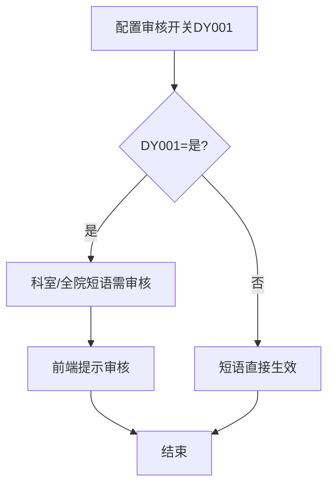
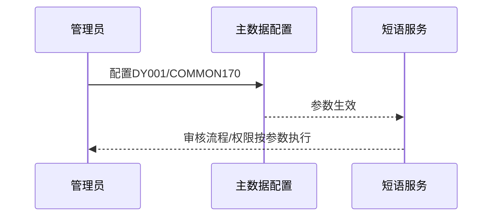

# BLGL-07-DYGL-005 短语审核与权限参数配置 - Spec

> **功能编号**：BLGL-07-DYGL-005
> **文档类型**：功能Spec（业务背景与设计）
> **文档版本**：V1.0
> **编写时间**：2026-08-14
> **编写人**：RACC

---

## 文档索引

#### 章节索引

**Spec（研发视角）**

| 章节号 | 章节名称 | 内容说明 |
|--------|---------|---------|
| 1、 | 文档概述 | 文档目的、文档范围、术语定义、阅读指南、参考文档 |
| 2、 | 功能背景与定位 | 功能背景、功能定位、目标用户、核心价值 |
| 3、 | 业务流程设计 | 主流程/异常流程/边界流程（Given/When/Then） |
| 4、 | 数据模型设计 | 核心数据结构、状态定义、系统参数定义 |
| 5、 | 接口契约设计 | API列表、接口详细设计、错误码定义 |
| 6、 | 技术方案设计 | 页面路径、技术栈、关键技术点、部署方案 |
| 7、 | 测试用例预设计 | 功能/边界/异常/性能测试用例 |
| 8、 | 非功能性要求 | 性能、安全、可用性、兼容性 |
| 9、 | 依赖与风险 | 外部依赖、风险项 |
| 10、 | 附录 | 流程图、时序图、参考文档 |

**PM-Spec（业务视角）**

| 章节号 | 章节名称 | 内容说明 |
|--------|---------|---------|
| 一 | 目标 | 功能定位与核心价值 |
| 二 | 约束 | 业务/技术/非功能性约束 |
| 三 | 验收标准 | 验收条件与验证方法 |
| 四 | 排除范围 | 本次不做项与明确边界 |
| 五 | 关键决策记录 | 方案决策与选型理由 |
| 六 | 优先级 | 优先级定义 |
| 七 | 关联文档 | 关联文档索引 |
| 附录 | 填写检查清单 | 质量检查 |

**Analyst-Spec（产品视角）**

| 章节号 | 章节名称 | 内容说明 |
|--------|---------|---------|
| 一 | 功能编号体系 | 功能编号与层级结构 |
| 二 | 核心业务流程 | 核心业务流程与时序 |
| 三 | 功能规格说明 | 详细功能规格与验收标准 |
| 四 | 排除范围 | 排除范围 |
| 五 | 业务规则清单 | 业务规则清单 |
| 六 | 关联文档 | 关联文档索引 |
| 七 | 待确认问题清单 | 待确认问题汇总 |
| - | 填写检查清单 | 质量检查 |

#### 版本历史

| 版本 | 日期 | 变更说明 | 编写人 |
|------|------|---------|--------|
| V1.0 | 2026-08-14 | 初始版本 | RACC |

#### 关联文档索引

| 序号 | 文档名称 | 文档类型 | 版本 | 位置 |
|------|---------|---------|------|------|
| 1 | BLGL-07-DYGL 07短语管理功能点Spec.md | 功能点Spec（模块级） | V1.0 | 上级目录 |
| 2 | BLGL-07-DYGL-005_短语审核与权限参数配置-Spec.md | 功能Spec（业务背景与设计）（本文档） | V1.0 | 本目录 |
| 3 | BLGL-07-DYGL-005_短语审核与权限参数配置_Analyst-spec.md | Analyst-Spec（分析规格） | V1.0 | 本目录 |
| 4 | BLGL-07-DYGL-005_短语审核与权限参数配置_PM-spec.md | PM-Spec（需求规格） | V0.1 | 本目录 |

---

## 1、文档概述

### 1.1、文档目的

本文档旨在明确"短语审核与权限参数配置"功能（BLGL-07-DYGL-005）的业务背景与设计方案，为需求分析、研发实现、测试验收及评审提供统一的业务上下文、设计口径与决策依据。

### 1.2、文档范围

#### 1.2.1 纳入范围

本文档覆盖短语审核与权限参数配置的完整业务背景与设计，包括：

- 配置科室/院级短语是否需要审核开关（DY001）
- 配置允许编辑所有科室短语的角色（COMMON170）
- 参数变更后对各功能点（收藏/审核/删除）的影响

#### 1.2.2 排除范围

本文档不涉及以下内容（详见其他功能点或模块）：

- 短语收藏与创建（收藏提交）—— BLGL-07-DYGL-001
- 短语审核（审核执行）—— BLGL-07-DYGL-002
- 短语引用与快捷检索—— BLGL-07-DYGL-003
- 短语维护（编辑/删除）—— BLGL-07-DYGL-004

### 1.3、术语定义

| 术语 | 定义 |
|------|------|
| 审核开关（DY001） | 科室或院级短语是否需要审核，默认是 |
| 编辑权限角色（COMMON170） | 允许编辑所有科室短语的角色 |

> ⏳ 待确认：规范术语表待产品文档确认。

### 1.4、阅读指南

- **章节关系**：第1~2章为业务全貌，第3~10章为设计实现层。与 Analyst-Spec、PM-Spec 互相引用保持一致。
- **读者对象**：产品经理/需求分析师读第1~2章；研发读第3~6、9~10章；测试读第3、7~8章；评审人员核对各层一致性。

### 1.5、参考文档

| 序号 | 文档名称 | 版本/日期 |
|------|---------|----------|
| 1 | 【历史需求】住院病历的历史需求.xlsx | - |
| 2 | BLGL-07-DYGL-005_短语审核与权限参数配置_PM-spec.md | V0.1 |
| 3 | BLGL-07-DYGL-005_短语审核与权限参数配置_Analyst-spec.md | V1.0 |
| 4 | BLGL-07-DYGL 07短语管理功能点Spec.md | V1.0 |

---

## 2、功能背景与定位

### 2.1 功能背景

短语审核与权限参数配置是短语管理体系的决策配置层，需满足：

- **管理要求**：短语审核流程需支持开关控制，删除/编辑权限需支持角色配置
- **现状痛点**：
  - 参数 DY001 默认是，前台无审核提示，医生误认为程序BUG
  - 科室短语删除权限不统一，无编辑权限仍可删除
- **历史需求演进**：从审核开关配置→ 审核提示优化（3）→ 编辑权限角色配置

### 2.2 功能定位

"短语审核与权限参数配置"是 WiNEX 病历管理-短语管理模块的决策配置层，定位为：

- **审核流程开关**：控制科室/院级短语是否需要审核
- **权限角色配置**：控制可编辑所有科室短语的角色
- **跨功能点决策**：参数影响收藏、审核、删除多个功能点

### 2.3 目标用户

| 用户角色 | 主要使用场景 |
|---------|-------------|
| 病案管理员/系统管理员 | 配置审核开关与编辑权限角色 |

### 2.4 核心价值

| 价值维度 | 价值描述 |
|---------|---------|
| 灵活配置 | 审核流程可开关 |
| 权限合规 | 编辑权限按角色配置 |
| 体验提升 | 审核提示避免误判 |

---

## 3、业务流程设计（Given/When/Then）

### 3.1 主流程

**Scenario 1: 审核开关配置**

```gherkin
Given:
  - 系统管理员具有参数配置权限
  - 参数路径：住院病历配置-病历业务配置-住院通用配置-基础设置

When:
  - 管理员配置参数 DY001（科室或院级短语是否需要审核）

Then:
  - DY001=是：科室/全院短语收藏后需审核，前端提示审核
  - DY001=否：短语直接生效，无需审核
```

### 3.2 异常流程

**Scenario 2: 业务异常——参数未生效**

```gherkin
Given:
  - 参数 DY001 配置为"是"

When:
  - 医生收藏科室短语

Then:
  - 前端应提示审核
  - ⏳ 待确认：参数未生效时的影响
```

**Scenario 3: 数据异常——角色配置缺失**

```gherkin
Given:
  - 参数 COMMON170 未配置角色

When:
  - 非创建人尝试编辑科室短语

Then:
  - ⏳ 待确认：参数未配置时的默认删除权限
```

### 3.3 边界流程

**Scenario 4: 边界场景——权限角色多选**

```gherkin
Given:
  - 管理员配置 COMMON170 角色

When:
  - 管理员选择多个角色

Then:
  - 配置的角色均可编辑所有科室短语
```

**Scenario 5: 边界场景——参数变更影响**

```gherkin
Given:
  - 参数 DY001 由"是"改为"否"

When:
  - 管理员保存参数

Then:
  - 后续收藏科室短语直接生效，无需审核
```

---

## 4、数据模型设计

### 4.1 核心数据结构

#### 4.1.1 系统参数

| 参数编码 | 参数名称 | 默认值 | 说明 |
|---------|---------|--------|------|
| DY001 | 科室或院级短语是否需要审核 | 是 | 控制科室/全院短语审核流程 |
| COMMON170 | 允许编辑所有科室短语的角色 | 无 | 控制编辑/删除科室短语权限 |

#### 4.1.2 核心表/实体

| 表/实体 | 关键字段 | 说明 |
|---------|---------|------|
| 主数据参数表 | 参数编码/值 | 参数配置存储 |

> ⏳ 待确认：参数存储表结构待代码扫描或功能清单补充。

### 4.2 状态定义

| 状态码 | 状态名称 | 说明 |
|--------|---------|------|
| DY001=是 | 需审核 | 科室/全院短语需审核后生效 |
| DY001=否 | 免审核 | 短语直接生效 |

### 4.3 系统参数定义

| 参数编码 | 参数名称 | 说明 |
|---------|---------|------|
| DY001 | 科室或院级短语是否需要审核 | 默认是 |
| COMMON170 | 允许编辑所有科室短语的角色 | 多选角色 |

---

## 5、接口契约设计

> 接口信息来自代码扫描（`E:\39EMR\sr-next`）。标注 ``。

### 5.1 API列表

| 序号 | API名称（代码函数） | 路径 | 方法 | 说明 |
|:----:|---------|------|:----:|------|
| 1 | 参数查询 | ⏳ 待确认：主数据参数查询接口 | POST | 查询 DY001/COMMON170 参数 |
| 2 | 参数保存 | ⏳ 待确认：主数据参数保存接口 | POST | 保存参数配置 |

> ⏳ 待确认：主数据参数配置接口（查询/保存）待接口文档补充。

### 5.2 接口详细设计

#### 5.2.1 参数配置

> ⏳ 待确认：参数查询/保存接口契约待接口文档补充，当前为配置场景描述。

### 5.3 错误码定义

| 错误码 | 错误信息 | 处理方式 |
|--------|---------|---------|
| ⏳ 待确认 | 参数保存失败 | 提示错误并返回配置页 |

> ⏳ 待确认：错误码定义未在代码扫描中提取完整。

---

## 6、技术方案设计

### 6.1 页面路径

- **页面路径**: 住院病历配置→病历业务配置→住院通用配置→基础设置
- **前端工程**: 管理端配置页面

> ⏳ 待确认：参数配置页面组件待代码扫描补充。

### 6.2 技术栈

| 类别 | 技术 | 版本 |
|------|------|------|
| 前端框架 | ⏳ 待确认 | ⏳ 待确认 |
| 后端框架 | ⏳ 待确认 | ⏳ 待确认 |

> ⏳ 待确认：参数配置涉及的主数据服务技术栈待代码扫描。

### 6.3 关键技术点

- 参数 DY001 控制审核流程，影响 -001 收藏提示、-002 审核执行
- 参数 COMMON170 控制编辑权限，影响 -004 删除权限

### 6.4 部署方案

⏳ 待确认：部署方案未在资料区中找到。

---

## 7、测试用例预设计

### 7.1 功能测试

| 用例编号 | 测试场景 | Given | When | Then |
|---------|---------|-------|------|------|
| TC-001 | DY001=是 | 配置参数为是 | 收藏科室短语 | 提示审核（3） |
| TC-002 | DY001=否 | 配置参数为否 | 收藏科室短语 | 直接生效无需审核 |

### 7.2 边界测试

| 用例编号 | 测试场景 | Given | When | Then |
|---------|---------|-------|------|------|
| TC-003 | COMMON170 多角色 | 配置多个角色 | 各角色编辑科室短语 | 均可编辑 |
| TC-004 | 参数变更 | DY001由是改否 | 后续收藏 | 直接生效 |

### 7.3 异常测试

| 用例编号 | 测试场景 | Given | When | Then |
|---------|---------|-------|------|------|
| TC-005 | 参数未生效 | DY001=是 | 收藏科室短语 | ⏳ 待确认：影响与处理 |
| TC-006 | 角色未配置 | COMMON170 为空 | 非创建人编辑 | ⏳ 待确认：默认权限 |

### 7.4 性能测试

| 用例编号 | 测试场景 | 指标 |
|---------|---------|------|
| TC-007 | 参数配置响应 | ⏳ 待确认 |

---

## 8、非功能性要求

### 8.1 性能要求

| 指标 | 要求 |
|------|------|
| 参数配置响应 | ⏳ 待确认 |

### 8.2 安全要求

| 要求 | 说明 |
|------|------|
| 参数配置权限 | 仅管理员可配置 |

**医疗行业特殊要求**

| 要求 | 说明 |
|------|------|
| 审核流程合规 | 参数控制审核开关 |

### 8.3 可用性要求

| 指标 | 要求值 |
|------|--------|
| 可用性 | ⏳ 待确认 |

### 8.4 兼容性要求

| 类型 | 要求 |
|------|------|
| 参数兼容 | 参数变更需对现有短语生效 |

---

## 9、依赖与风险

### 9.1 外部依赖

| 依赖项 | 说明 |
|--------|------|
| 主数据系统 | 参数配置存储 |

### 9.2 风险项

| 风险项 | 等级 | 说明 | 应对方案 |
|--------|------|------|---------|
| 参数未生效 | 中 | 审核提示不生效 | 排查参数传递链路 |
| 角色配置缺失 | 中 | 无默认权限处理 | 明确默认行为 |

---

## 10、附录

### 10.1 流程图



### 10.2 时序图



### 10.3 参考文档

- BLGL-07-DYGL 07短语管理功能点Spec.md（V1.0，第5章 -005 行）
- 关联Spec: BLGL-07-DYGL-001/002/004（参数影响的功能点）

---

## 填写检查清单

| 序号 | 检查项 | 是否完成 |
|:----:|--------|:--------:|
| 1 | 章节索引与正文章节一致 | ✅ |
| 2 | 版本历史记录完整 | ✅ |
| 3 | 关联文档索引已登记全部Spec | ✅ |
| 4 | 文档目的明确回答"为什么做/做成什么/怎么做" | ✅ |
| 5 | 纳入范围/排除范围清晰 | ✅ |
| 6 | 术语定义覆盖关键概念，从资料区可溯源 | ✅ |
| 7 | 参考文档已登记 | ✅ |
| 8 | 功能背景基于法规/规范/需求来源组织 | ✅ |
| 9 | 功能定位体现业务价值（3~5个定位点） | ✅ |
| 10 | 目标用户角色覆盖完整，在需求原文中有出处 | ✅ |
| 11 | 核心价值可陈述，与 Phase 1 口径一致 | ✅ |
| 12 | 业务流程：主流程≥1、异常≥3、边界≥2，Given/When/Then 具体 | ✅ |
| 13 | 数据模型：字段/表/状态/参数可溯源 | ✅ |
| 14 | 接口契约：API列表+详细设计+错误码齐全或标记待确认 | ✅ |
| 15 | 技术方案：页面路径/技术栈/关键点/部署方案或标记待确认 | ✅ |
| 16 | 测试用例：功能/边界/异常/性能覆盖 | ✅ |
| 17 | 非功能性要求：性能/安全/可用性/兼容性指标可量化或标记待确认 | ✅ |
| 18 | 依赖与风险：外部依赖登记完整 | ✅ |
| 19 | 附录：流程图/时序图与正文流程一致 | ✅ |
| 20 | 全文无占位符 `< >` 残留 | ✅ |
| 21 | 全文陈述可溯源至资料区 | ✅ |
| 22 | 人工审核确认完成 | ⏳ 待确认 |

---

**文档状态**：⬜ 待审核
**维护责任**：RACC
**下次更新**：根据评审反馈优化
