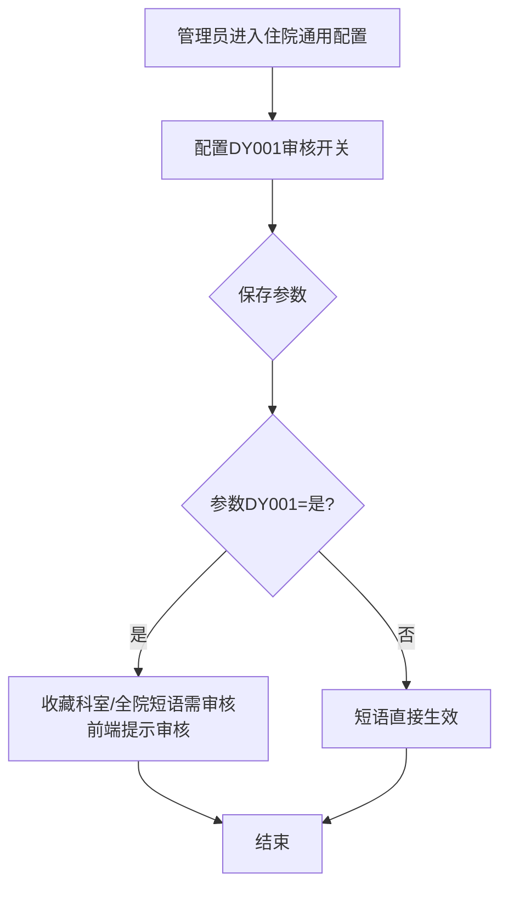
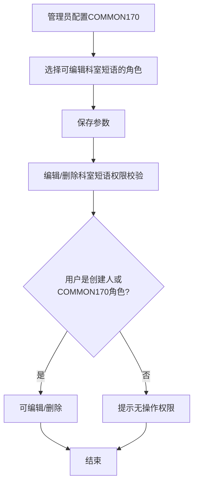

# BLGL-07-DYGL-005短语审核与权限参数配置_ Analyst - Spec

> **需求编号**：BLGL-07-DYGL-005
> **父需求**：BLGL-07-DYGL
> **关联PM Spec**：BLGL-07-DYGL-005_短语审核与权限参数配置_PM-spec.md
> **Spec版本**：V1.0
> **编写时间**：2026-08-14
> **编写人**：需求分析师

---

## 一、功能编号体系

### 1.1 功能层级结构

```
BLGL-07-DYGL-005: 短语审核与权限参数配置
  ├─ BLGL-07-DYGL-005-01: 审核开关配置（DY001）
  │   ├─ -01-01: 参数 DY001 查询/保存
  │   └─ -01-02: 审核流程生效（影响-001/-002）
  └─ BLGL-07-DYGL-005-02: 编辑权限角色配置（COMMON170）
      ├─ -02-01: 参数 COMMON170 查询/保存
      └─ -02-02: 编辑权限生效（影响-004）
```

### 1.2 功能编号表

| REQ-ID | 功能名称 | 类型 | 优先级 | 说明 |
|--------|---------|------|--------|------|
| BLGL-07-DYGL-005-01 | 审核开关配置 | 功能 | P0 | 配置 DY001 审核开关 |
| BLGL-07-DYGL-005-01-01 | 参数查询/保存 | 子功能 | P0 | 配置 DY001 |
| BLGL-07-DYGL-005-01-02 | 审核流程生效 | 子功能 | P1 | 影响收藏提示/审核执行 |
| BLGL-07-DYGL-005-02 | 编辑权限角色配置 | 功能 | P0 | 配置 COMMON170 |
| BLGL-07-DYGL-005-02-01 | 参数查询/保存 | 子功能 | P0 | 配置 COMMON170 |
| BLGL-07-DYGL-005-02-02 | 编辑权限生效 | 子功能 | P1 | 影响删除权限 |

---

## 二、核心业务流程

### 2.1 审核开关配置流程



### 2.2 编辑权限角色配置流程



---

## 三、功能规格说明

---

### BLGL-07-DYGL-005-01: 审核开关配置（DY001）

#### 3.1.1 功能概述

配置参数 DY001（科室或院级短语是否需要审核），默认是。DY001=是 时科室/全院短语收藏后需审核，前端提示；DY001=否 时短语直接生效。

#### 3.1.2 用户角色

| 角色 | 使用场景 | 权限要求 | 操作频率 |
|------|---------|---------|---------|
| 病案管理员/系统管理员 | 配置审核开关 | 参数配置权限 | 低频 |

#### 3.1.3 业务流程（Given/When/Then）

##### 主流程

**Scenario 1: 审核开关配置**

```gherkin
Given:
  - 系统管理员具有参数配置权限
  - 参数路径：住院病历配置-病历业务配置-住院通用配置-基础设置

When:
  - 管理员配置参数 DY001

Then:
  - DY001=是：科室/全院短语收藏后需审核，前端提示审核
  - DY001=否：短语直接生效，无需审核
```

##### 异常流程

**Scenario 2: 业务异常——参数未生效**

```gherkin
Given:
  - 参数 DY001 配置为"是"

When:
  - 医生收藏科室短语

Then:
  - 前端应提示审核
  - ⏳ 待确认：参数未生效时的影响
```

##### 边界流程

**Scenario 3: 边界场景——参数变更**

```gherkin
Given:
  - 参数 DY001 由"是"改为"否"

When:
  - 管理员保存参数

Then:
  - 后续收藏科室短语直接生效，无需审核
```

#### 3.1.4 数据字段定义

| 字段名 | 类型 | 必填 | 默认值 | 取值范围 | 说明 | 概念ID |
|--------|------|------|--------|---------|------|--------|
| DY001 | Boolean | 是 | 是 | 是/否 | 科室或院级短语是否需要审核 | ⏳ 待确认 |

#### 3.1.5 验收标准

| AC编号 | 验收标准 | 对应REQ-ID | 验证方法 | 验证场景 |
|--------|---------|-----------|---------|---------|
| AC-001 | DY001=是 时收藏科室短语前端提示审核 | -005-01 | 功能测试 | Scenario 1 |
| AC-002 | DY001=否 时收藏直接生效 | -005-01 | 功能测试 | Scenario 3 |

---

### BLGL-07-DYGL-005-02: 编辑权限角色配置（COMMON170）

#### 3.2.1 功能概述

配置参数 COMMON170（允许编辑所有科室短语的角色），配置的角色可编辑/删除所有科室短语；否则仅创建人可操作。

#### 3.2.2 用户角色

| 角色 | 使用场景 | 权限要求 | 操作频率 |
|------|---------|---------|---------|
| 病案管理员/系统管理员 | 配置编辑权限角色 | 参数配置权限 | 低频 |

#### 3.2.3 业务流程（Given/When/Then）

##### 主流程

**Scenario 1: 编辑权限角色配置**

```gherkin
Given:
  - 系统管理员具有参数配置权限

When:
  - 管理员配置 COMMON170 角色（多选）

Then:
  - 配置的角色可编辑所有科室短语
  - 非配置角色仅创建人可编辑
```

##### 异常流程

**Scenario 2: 数据异常——角色未配置**

```gherkin
Given:
  - 参数 COMMON170 未配置角色

When:
  - 非创建人尝试编辑科室短语

Then:
  - ⏳ 待确认：参数未配置时的默认删除权限
```

##### 边界流程

**Scenario 3: 边界场景——权限校验**

```gherkin
Given:
  - 用户不是短语创建人
  - 用户角色不在 COMMON170 中

When:
  - 用户尝试删除科室短语

Then:
  - 提示"该短语创建人为xxx，当前账号无操作权限"
  - 阻止删除
```

#### 3.2.4 数据字段定义

| 字段名 | 类型 | 必填 | 默认值 | 取值范围 | 说明 | 概念ID |
|--------|------|------|--------|---------|------|--------|
| COMMON170 | List | 否 | 无 | 角色多选 | 允许编辑所有科室短语的角色 | ⏳ 待确认 |

#### 3.2.5 验收标准

| AC编号 | 验收标准 | 对应REQ-ID | 验证方法 | 验证场景 |
|--------|---------|-----------|---------|---------|
| AC-003 | COMMON170 配置的角色可编辑所有科室短语 | -005-02 | 功能测试 | Scenario 1 |
| AC-004 | 非配置角色且非创建人删除时提示无操作权限 | -005-02 | 功能测试 | Scenario 3 |

---

## 四、排除范围

本需求不包含以下功能项：

1. **短语收藏与创建** - 收藏提交，属 BLGL-07-DYGL-001
2. **短语审核** - 审核执行，属 BLGL-07-DYGL-002
3. **短语引用与快捷检索** - 引用插入病历，属 BLGL-07-DYGL-003
4. **短语维护** - 编辑/删除执行，属 BLGL-07-DYGL-004

> 与 PM-Spec 第四章一致。对照 Phase 1 功能点Spec 第6章（基线能力），确保不越界。

---

## 五、业务规则清单

| 规则ID | 规则名称 | 规则描述 | 来源 | 优先级 |
|--------|---------|---------|------|--------|
| BR-001 | 审核开关 | DY001 控制科室/院级短语是否需要审核，默认是 | 6 | P0 |
| BR-002 | 审核提示 | DY001=是 时收藏科室/全院短语前端提示审核 | 3 | P1 |
| BR-003 | 编辑权限角色 | COMMON170 配置允许编辑所有科室短语的角色 |  | P0 |
| BR-004 | 权限校验 | 非创建人且非COMMON170角色删除时提示无操作权限 |  | P1 |

---

## 六、关联文档

| 文档类型 | 文档路径 | 说明 |
|---------|---------|------|
| 功能点Spec（模块级） | 上级目录 BLGL-07-DYGL 07短语管理功能点Spec.md（V1.0） | 模块级功能点索引 |
| 功能Spec（业务背景与设计） | 本目录 BLGL-07-DYGL-005_短语审核与权限参数配置-Spec.md（V1.0） | 业务背景与目标 Spec |
| Analyst-Spec（分析规格） | 本目录 BLGL-07-DYGL-005_短语审核与权限参数配置_Analyst-spec.md（V1.0）（本文档） | 分析规格 |
| PM-Spec（需求规格） | 本目录 BLGL-07-DYGL-005_短语审核与权限参数配置_PM-spec.md（V0.1） | PM 产出的 Spec 文档 |
| data-model.md | 待产出 | 架构师产出的数据建模文档 |
| design.md | 待产出 | 架构师产出的技术方案文档 |
| api-contract.md | 待产出 | 开发经理产出的 API 契约文档 |

---

## 七、待确认问题清单

| 编号 | 问题描述 | 缺失信息 | 影响范围 | 建议补充方 |
|------|---------|---------|---------|-----------|
| Q-001 | 参数未生效影响 | DY001 未生效时的处理 | 3.1.3 Scenario 2 | 开发经理 |
| Q-002 | 角色未配置默认权限 | COMMON170 为空时默认删除权限 | 3.2.3 Scenario 2 | 产品经理 |
| Q-003 | 参数配置接口契约 | 主数据参数查询/保存接口 | 第5章接口设计 | 开发经理 |
| Q-004 | 概念ID、性能指标 | 参数概念ID、配置SLA | 数据模型、非功能 | 架构师/产品经理 |

---

## 填写检查清单

| 序号 | 检查项 | 是否完成 |
|:----:|--------|:--------:|
| 1 | 功能编号带父子层级 | ✅ |
| 2 | 每个 REQ-ID 有功能概述和用户角色 | ✅ |
| 3 | 主流程至少 1 个 Given/When/Then 场景 | ✅ |
| 4 | 异常流程至少 3 个 Given/When/Then 场景 | ✅ |
| 5 | 边界流程至少 2 个 Given/When/Then 场景 | ✅ |
| 6 | 每个 Given/When/Then 内容具体，不模糊 | ✅ |
| 7 | 数据字段定义完整 | ✅ |
| 8 | 验收标准 AC 编号独立，可验证 | ✅ |
| 9 | 验收标准无"功能正常"等模糊表述 | ✅ |
| 10 | 排除范围明确列出 | ✅ |
| 11 | 业务规则清单列出所有规则，每条标注来源 | ✅ |
| 12 | 流程图使用 Mermaid 格式（≥2 个） | ✅ |
| 13 | 关联文档索引包含 Phase 1 功能点Spec | ✅ |
| 14 | 待确认问题清单汇总了全文所有 ⏳ 项 | ✅ |
| 15 | 全文无占位符 `< >` 残留 | ✅ |
| 16 | 全文陈述可溯源至资料区（S1~S10 溯源核查） | ✅ |
| 17 | 人工审核确认完成 | ⏳ 待确认 |

---

**文档状态**：⬜ 待审核
**维护责任**：需求分析师规范组
**下次更新**：根据评审反馈优化

---

## 版本历史

| 版本 | 日期 | 变更说明 | 编写人 |
|------|------|---------|--------|
| V1.0 | 2026-08-14 | 初始版本 | 需求分析师 |
