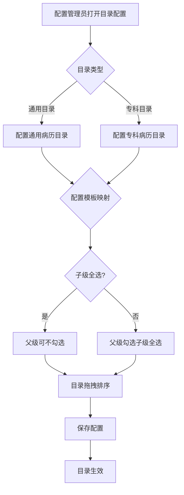
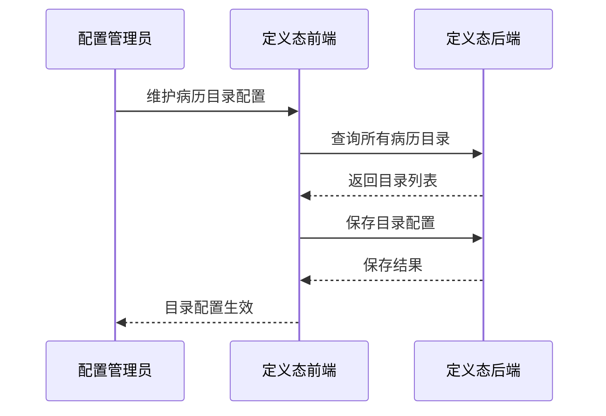

# BLGL-08-BLML-001 病历目录配置-Spec

> **功能编号**：BLGL-08-BLML-001
> **文档类型**：功能Spec（业务背景与设计）
> **文档版本**：V1.0
> **编写时间**：2026-08-13
> **编写人**：RACC

---

## 文档索引

本节提供本文档的章节结构索引与关联文档索引，便于读者快速定位与检索。

#### 章节索引

**Spec（研发视角）**

| 章节号 | 章节名称 |
|--------|---------|
| 1、 | 文档概述 |
| 2、 | 功能背景与定位 |
| 3、 | 业务流程设计 |
| 4、 | 数据模型设计 |
| 5、 | 接口契约设计 |
| 6、 | 技术方案设计 |
| 7、 | 测试用例预设计 |
| 8、 | 非功能性要求 |
| 9、 | 依赖与风险 |
| 10、 | 附录 |

**PM-Spec（需求规格）**

| 章节号 | 章节名称 |
|--------|---------|
| 一 | 目标 |
| 二 | 约束 |
| 三 | 验收标准 |
| 四 | 排除范围 |
| 五 | 关键决策记录 |
| 六 | 优先级 |
| 附录 | 填写检查清单 |

**Analyst-Spec（分析规格）**

| 章节号 | 章节名称 |
|--------|---------|
| 一 | 功能编号体系 |
| 二 | 核心业务流程 |
| 三 | 功能规格说明 |
| 四 | 排除范围 |
| 五 | 业务规则清单 |
| 六 | 关联文档 |
| 七 | 待确认问题清单 |
| - | 填写检查清单 | 检查项与完成状态 |

#### 版本历史

| 版本 | 日期 | 变更说明 | 编写人 |
|------|------|---------|--------|
| V1.0 | 2026-08-13 | 初始版本 | RACC |

#### 关联文档索引

| 序号 | 文档名称 | 文档类型 | 版本 | 位置 |
|------|---------|---------|------|------|
| 1 | BLGL-08-BLML-001_病历目录配置-Spec.md | 功能Spec（业务背景与设计）（本文档） | V1.0 | 本目录 |
| 2 | BLGL-08-BLML-001_病历目录配置_PM-spec.md | PM-Spec（需求规格） | V0.1 | 本目录 |
| 3 | BLGL-08-BLML-001_病历目录配置_Analyst-spec.md | Analyst-Spec（分析规格） | V1.0 | 本目录 |
| 4 | BLGL-08-BLML 08病历目录功能点Spec.md | 功能点Spec（模块级） | V1.0 | 上级目录 |

---

## 1、文档概述

### 1.1、文档目的

本文档旨在明确"病历目录配置"功能（BLGL-08-BLML-001）的业务背景与设计方案，为需求分析、研发实现、测试验收及评审提供统一的业务上下文、设计口径与决策依据。

**具体目的包括**：

1. 梳理病历目录配置功能的业务由来与历史需求演进脉络，说明"为什么要做"
2. 明确功能的定位边界、目标用户与核心价值，回答"做成什么"
3. 描述功能的业务流程、数据模型、接口契约与技术方案，回答"怎么做"
4. 预设计测试用例并明确非功能性要求、依赖与风险，为研发与验收提供依据
5. 作为 SPEC（功能编号体系、功能详情、业务规则、验收标准等章节）的业务前提与设计输入，保证各层文档业务口径一致。

### 1.2、文档范围

#### 1.2.1 纳入范围

本文档覆盖病历目录配置的完整业务背景与设计，包括：

- 通用/专科病历目录配置
- 病历目录与模板映射
- 目录拖拽排序
- 科室默认模板配置
- 目录停用/启用状态

#### 1.2.2 排除范围

本文档不涉及以下内容（详见其他功能点或模块）：

- 模板目录映射与顺序调整——见 BLGL-08-BLML-002
- 文书目录展示（签名标志、数量显示、展开收起）——见 BLGL-08-BLML-003
- 病历新建与模板选择——见 BLGL-08-BLML-004
- 文书分组与多语显示——见 BLGL-08-BLML-005

### 1.3、术语定义

| 术语 | 定义 |
|------|------|
| 通用病历目录 | 通用病历目录配置 |
| 专科病历目录 | 专科病历目录配置，含专科目录分组/条目/发布科室 |
| 模板映射 | 病历目录与模板的映射关系 |
| 科室默认模板 | 科室默认模板配置，分页查询/保存/删除/批量保存 |
| 扩展分类 | 病历分类扩展分类，批量增删导入 |

### 1.4、阅读指南

- **章节关系**：第1~2章为阅读铺垫与业务全貌（背景、定位、用户、价值）；第3~10章为设计实现层（流程、数据、接口、技术、测试、非功能、依赖风险、附录），可直接用于研发与测试。与 Analyst-Spec、PM-Spec 的详细规则/验收口径互相引用，保持一致。
- **读者对象**：
 - 产品经理/需求分析师：阅读第1~2章了解业务全貌，据此维护 PM-Spec 与功能清单
 - 研发：阅读第3~6章用于开发实现，第9~10章用于依赖评估与联调
 - 测试：阅读第3章、第7~8章用于用例设计与验收
 - 评审人员：以本文档为业务口径与设计基准，核对各层文档一致性。

### 1.5、参考文档

| 序号 | 文档名称 | 版本/日期 |
|------|---------|
| 1 | 病历目录-0813.xlsx | - |
| 2 | BLGL-08-BLML-001_病历目录配置_PM-spec.md | V0.1 |
| 3 | BLGL-08-BLML-001_病历目录配置_Analyst-spec.md | V1.0 |
| 4 | BLGL-08-BLML 08病历目录功能点Spec.md | V1.0 |

---

## 2、功能背景与定位

### 2.1 功能背景

病历目录配置是病历目录的基础能力，需满足：

- **管理要求**：配置通用/专科病历目录及模板映射
- **现状痛点**：目录配置映射逻辑不清晰
- **历史需求演进**：从"住院病历目录配置"→"模板目录功能优化重构"→"目录顺序调整"

### 2.2 功能定位

"病历目录配置"是WiNEX病历管理-病历目录模块的基础配置层，定位为：

- **目录配置定位**：通用/专科病历目录维护
- **映射配置定位**：病历目录与模板映射
- **顺序配置定位**：目录拖拽排序

### 2.3 目标用户

| 用户角色 | 主要使用场景 |
|---------|-------------|
| 配置管理员 | 维护病历目录配置 |

### 2.4 核心价值

| 价值维度 | 价值描述 |
|---------|---------|
| 配置灵活 | 通用/专科目录配置 |
| 映射准确 | 模板映射逻辑 |
| 维护高效 | 目录顺序调整 |

---

## 3、业务流程设计（Given/When/Then）

### 3.1 主流程

**Scenario 1: 病历目录配置**

```gherkin
Given:
 - 配置管理员有病历配置权限

When:
 - 配置管理员维护通用/专科病历目录
 - 配置模板映射

Then:
 - 目录配置保存
 - 目录与模板映射生效
```

### 3.2 异常流程

**Scenario 2: 业务异常——目录停用**

```gherkin
Given:
 - 某目录在移除时发现所有列表中都没有

When:
 - 配置管理员移除目录

Then:
 - 目录状态更新为停用
```

**Scenario 3: 数据异常——子级勾选父级**

```gherkin
Given:
 - 子级目录全部勾选

When:
 - 配置管理员配置映射

Then:
 - 父级目录可以不被勾选上
 - 父级勾选上时子级全部勾选上
```

**Scenario 4: 系统异常——配置保存失败**

```gherkin
Given:
 - 配置保存接口异常

When:
 - 配置管理员保存

Then:
 - 保存失败提示
```

### 3.3 边界流程

**Scenario 5: 边界场景——目录拖拽排序**

```gherkin
Given:
 - 配置管理员维护模板目录

When:
 - 配置管理员拖拽调换目录顺序

Then:
 - 模板目录支持拖拽调换顺序
```

**Scenario 6: 边界场景——科室默认模板**

```gherkin
Given:
 - 科室默认模板配置

When:
 - 配置管理员配置

Then:
 - 支持分页查询/保存/删除/批量保存科室默认模板
```

---

## 4、数据模型设计

### 4.1 核心数据结构

#### 4.1.1 核心保存请求

| 字段名 | 类型 | 必填 | 备注 |
|--------|------|------|------|
| 目录ID | Long | 是 | 病历目录ID |
| 目录名称 | String | 是 | 目录名称 |
| 目录状态 | String | 是 | 启用/停用 |

#### 4.1.2 核心表/实体

| 表/实体 | 关键字段 | 说明 |
|---------|---------|------|
| EMR_CLASS（InpatientEmrClassPO） | EMR_CLASS_ID、EMR_CLASS_NAME、EMR_CLASS_DISPLAY_NAME、SEQ_NO、ENABLED_FLAG、GENERAL_FLAG、SYS_DEFAULT_FLAG、SUBJECT_CODE、HAS_EMR_FLAG、PRINTING_NO | 病历目录主表（通用/专科目录、启用标志、顺序） |
| EMR_CLASS_SPECIALTY_GROUP（EmrClassSpecialtyGroupPO） | EMR_CLASS_SPECIALTY_GROUP_ID、EMR_CLASS_SPECIALTY_GROUP_NAME、SEQ_NO、ENABLED_FLAG | 专科目录分组 |
| EMR_CLASS_SPECIALTY_DEPT（EmrClassSpecialtyDeptPO） | EMR_CLASS_SPECIALTY_DEPT_ID、EMR_CLASS_SPECIALTY_GROUP_ID、DEPT_ID、ENABLED_FLAG、HAS_EMR_FLAG | 专科目录分组发布科室 |
| EMR_CLASS_EXT_CLASS（EmrClassExtClassPO） | EMR_CLASS_EXT_CLASS_ID、EMR_CLASS_ID、EXT_EMR_CLASS_NO、EXT_EMR_CLASS_NAME | 病历分类扩展分类 |

### 4.2 状态定义

| 状态码 | 状态名称 | 说明 |
|--------|---------|------|
| 启用 | 目录启用状态 | ENABLED_FLAG 启用标志，查询在用目录公共方法为"未删除&启用状态" |
| 停用 | 目录停用状态 | 目录移除且在所有专科/通用列表中均不存在时状态更新为停用 |

### 4.3 系统参数定义

| 参数编码 | 参数名称 | 说明 |
|---------|---------|------|
| ⏳ 待确认 | 目录配置参数 | 参数未在资料区明确 |

---

## 5、接口契约设计

### 5.1 API列表

| 序号 | API名称（代码函数） | 路径 | 方法 | 说明 |
|:----:|---------|------|:----:|------|
| 1 | 查询所有病历目录接口 | /api/v1/app_record_inpatient/emr_inpatient/emr_inpatient_class/all/query | POST | 查询所有病历目录 |
| 2 | 查询病历目录规则配置模板集合 | /api/v1/app_record_inpatient/emr_inpatient/verify_class_template/query/by_example | POST | 查询病历目录规则配置模板集合 |
| 3 | 查询住院病历目录列表 | /api/v1/app_record_mdm/inpatient_emr_type/query | POST | 定义态查询住院病历目录列表 |
| 4 | 修改病历目录 | /api/v1/app_record_mdm/inpatient_emr_class/save | POST | 修改病历目录 |
| 5 | 病历目录排序 | /api/v1/app_record_mdm/emr_class/batch/update/seq_no/by_example | POST | 病历目录排序 |
| 6 | 根据病历目录 id 删除 | /api/v1/app_record_mdm/emr_class/delete/by_id | POST | 删除病历目录 |
| 7 | 病历专科目录明细排序 | /api/v1/app_record_mdm/emr_class/emr_class_specialty_item/sort | POST | 专科目录明细排序 |
| 8 | 校验病历专科目录分组发布科室 | /api/v1/app_record_mdm/emr_class/emr_class_specialty_group_save_dept/check | POST | 校验专科目录分组发布科室 |
| 9 | 病历目录对应-关系取消/编辑保存 | /api/v1/app_record_mdm/inpatient_emr_template/emr_catalogue_relation/save | POST | 病历目录对应关系保存 |
| 10 | 保存病历模板目录 | /api/v1/app_record_mdm/inpatient_emr_template_class/save | POST | 新增/修改病历模板目录 |
| 11 | 删除病历模板目录 | /api/v1/app_record_mdm/inpatient_emr_template_class/delete | POST | 删除病历模板目录 |
| 12 | 分页查询科室默认模板 | /api/v1/app_record_inpatient/emr_class_default_dept_mrt/query/by_example | POST | 科室默认模板分页查询 |
| 13 | 保存科室默认模板 | /api/v1/app_record_inpatient/emr_class_default_dept_mrt/save | POST | 保存科室默认模板 |
| 14 | 批量保存科室默认模板 | /api/v1/app_record_inpatient/emr_class_default_dept_mrt/batch/save | POST | 批量保存科室默认模板 |
| 15 | 扩展分类批量保存/删除/导入 | /api/v1/app_record_mdm/emr_class_ext_class/{batch/save, batch/delete, batch/import} | POST | 扩展分类批量增删导入 |

### 5.2 接口详细设计

#### 5.2.1 查询所有病历目录

**请求参数**:
```json
{
 "⏳ 待确认": "入参 InpatientEmrTypeInputAO 字段结构未在资料区/接口文档明确"
}
```

**返回值（成功）**:
```json
{
 "success": true
 "data": [
 {
 "emrClassId": "⏳ 待确认"
 "emrClassName": "⏳ 待确认"
 "enabledFlag": "⏳ 待确认"
 }
 ]
}
```

**返回值（失败）**:
```json
{
 "success": false
 "message": "⏳ 待确认"
 "data": null
}
```

> 📌 接口路径与函数名来自代码（InpEmrClassController / InpEmrClassApiPathConstants）；目录实体字段名已确认（EMR_CLASS_ID、EMR_CLASS_NAME、ENABLED_FLAG），但接口出参 VO 的实际字段映射待与接口文档核对，标记 ⏳ 待确认。

### 5.3 错误码定义

| 错误码 | 错误信息 | 处理方式 |
|--------|---------|---------|
| ⏳ 待确认 | - | 错误码定义未在资料区找到 |

---

## 6、技术方案设计

### 6.1 页面路径

- **页面路径**: winning-mas-record-inpatient/winning-mas-record-webmvc-inpatient/.../definition/controller/InpatientEmrConfigController.java（定义态：电子病历配置）
- **路由**: 病历管理配置-目录配置
- **核心逻辑模块**: InpEmrClassController（业务态目录查询）、InpatientEmrConfigController（定义态目录增删改/排序/专科目录/扩展分类）、EmrClassDefaultDeptMrtController（定义态科室默认模板）

### 6.2 技术栈

| 类别 | 技术 | 版本 |
|------|------|------|
| 前端框架 | Vue（winning-webui-admin-emr 等管理端） | ⏳ 待确认 |
| 后端框架 | Java Spring Boot + Akso MVC | ⏳ 待确认 |

### 6.3 关键技术点

- 目录停用/启用状态管理
- 模板映射勾选逻辑：子级全选父级可不选，父级选子级全选
- 目录拖拽排序

### 6.4 部署方案

⏳ 待确认：部署方案未在资料区中找到

---

## 7、测试用例预设计

### 7.1 功能测试

| 用例编号 | 测试场景 | Given | When | Then |
|---------|---------|-------|--------|
| TC-001 | 通用/专科目录配置 | 配置管理员 | 维护目录 | 目录保存 |
| TC-002 | 模板映射配置 | 配置管理员 | 配置映射 | 映射生效 |
| TC-003 | 科室默认模板 | 配置管理员 | 配置科室模板 | 保存生效 |

### 7.2 边界测试

| 用例编号 | 测试场景 | Given | When | Then |
|---------|---------|-------|--------|
| TC-004 | 目录拖拽排序 | 维护目录 | 拖拽排序 | 顺序调整 |
| TC-005 | 子级勾选父级 | 子级全选 | 配置映射 | 父级可不选 |

### 7.3 异常测试

| 用例编号 | 测试场景 | Given | When | Then |
|---------|---------|-------|--------|
| TC-006 | 目录移除停用 | 目录移除 | 移除目录 | 状态更新停用 |
| TC-007 | 配置保存失败 | 接口异常 | 保存配置 | 保存失败提示 |

### 7.4 性能测试

| 用例编号 | 测试场景 | 指标 |
|---------|---------|
| TC-008 | 目录配置响应时间 |

---

## 8、非功能性要求

### 8.1 性能要求

| 指标 | 要求 |
|------|------|
| 目录配置响应时间 | ⏳ 待确认 |

### 8.2 安全要求

| 要求 | 说明 |
|------|------|
| 配置权限 | 目录配置需配置管理员权限 |

**医疗行业特殊要求**

| 要求 | 说明 |
|------|------|
| 目录规范 | 病历目录配置符合管理要求 |

### 8.3 可用性要求

| 指标 | 要求值 |
|------|--------|
| ⏳ 待确认 | - |

### 8.4 兼容性要求

| 类型 | 要求 |
|------|------|
| 定义态兼容 | 目录配置对接定义态 |

---

## 9、依赖与风险

### 9.1 外部依赖

| 依赖项 | 说明 |
|--------|------|
| 模板系统 | 目录模板映射 |

### 9.2 风险项

| 风险项 | 等级 | 说明 | 应对方案 |
|--------|------|------|---------|
| 映射冲突 | 中 | 目录映射逻辑冲突 | 勾选逻辑校验 |
| 目录误停用 | 中 | 目录误移除停用 | 状态管理 |

---

## 10、附录

### 10.1 流程图



### 10.2 时序图



### 10.3 参考文档

- 病历目录-0813.xlsx（、663869、309720、1395871 等）
- BLGL-08-BLML 08病历目录功能点Spec.md（V1.0）
- 关联Spec: BLGL-08-BLML-002 病历目录展示 -Spec.md

---

## 填写检查清单

| 序号 | 检查项 | 是否完成 |
|:----:|--------|:--------:|
| 1 | 章节索引与正文章节一致 | ✅ |
| 2 | 版本历史记录完整 | ✅ |
| 3 | 关联文档索引已登记全部Spec | ✅ |
| 4 | 文档目的明确回答"为什么做/做成什么/怎么做" | ✅ |
| 5 | 纳入范围/排除范围清晰 | ✅ |
| 6 | 术语定义覆盖关键概念，从资料区可溯源 | ✅ |
| 7 | 参考文档已登记 | ✅ |
| 8 | 功能背景基于法规/规范/需求来源组织 | ✅ |
| 9 | 功能定位体现业务价值（3~5个定位点） | ✅ |
| 10 | 目标用户角色覆盖完整，在需求原文中有出处 | ✅ |
| 11 | 核心价值可陈述，与 Phase 1 口径一致 | ✅ |
| 12 | 业务流程：主流程≥1、异常≥3、边界≥2，Given/When/Then 具体 | ✅ |
| 13 | 数据模型：字段/表/状态/参数可溯源 | ✅（参数 ⏳） |
| 14 | 接口契约：API列表+详细设计+错误码齐全或标记待确认 | ✅（错误码 ⏳） |
| 15 | 技术方案：页面路径/技术栈/关键点/部署方案或标记待确认 | ✅ |
| 16 | 测试用例：功能/边界/异常/性能覆盖，与第3章场景对应 | ✅ |
| 17 | 非功能性要求：性能/安全/可用性/兼容性指标可量化或标记待确认 | ✅ |
| 18 | 依赖与风险：外部依赖登记完整，风险有具体应对方案或标记待确认 | ✅ |
| 19 | 附录：流程图/时序图与正文流程一致 | ✅ |
| 20 | 全文无占位符 `< >` 残留 | ✅ |
| 21 | 全文陈述可溯源至资料区，无来源的已标记 ⏳ | ✅ |
| 22 | 人工审核确认完成 | ⏳ 待确认 |

---

**文档状态**：⬜ 待审核
**维护责任**：RACC
**下次更新**：根据评审反馈优化
