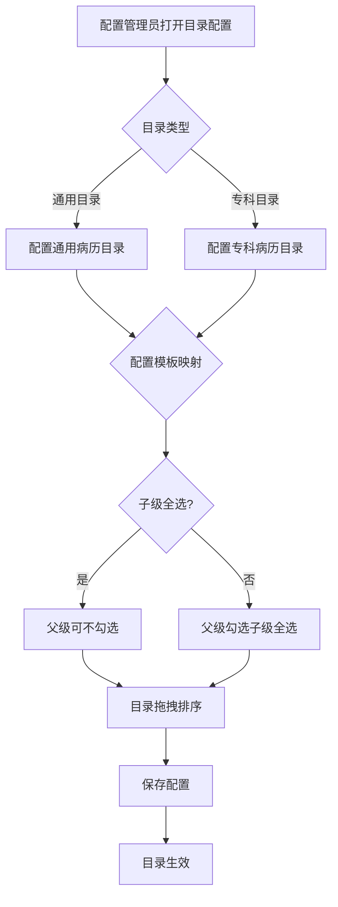
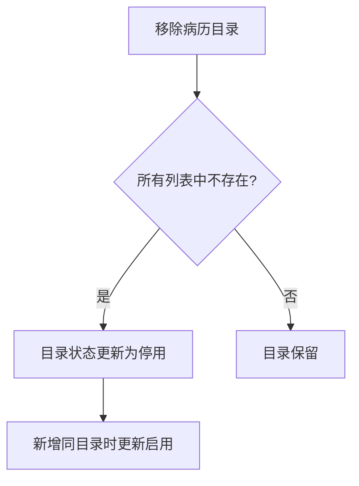

# BLGL-08-BLML-001病历目录配置_ Analyst - Spec

> **需求编号**：BLGL-08-BLML-001
> **父需求**：BLGL-08-BLML
> **关联PM Spec**：BLGL-08-BLML-001_病历目录配置_PM-spec.md
> **Spec版本**：V1.0
> **编写时间**：2026-08-13
> **编写人**：需求分析师

---

## 一、功能编号体系

### 1.1 功能层级结构

```
BLGL-08-BLML-001: 病历目录配置
 ├─ BLGL-08-BLML-001-01: 通用/专科病历目录配置
 ├─ BLGL-08-BLML-001-02: 病历目录与模板映射
 ├─ BLGL-08-BLML-001-03: 目录拖拽排序
 ├─ BLGL-08-BLML-001-04: 科室默认模板配置
 └─ BLGL-08-BLML-001-05: 目录停用/启用状态
```

### 1.2 功能编号表

| REQ-ID | 功能名称 | 类型 | 优先级 | 说明 |
|--------|---------|------|--------|
| BLGL-08-BLML-001-01 | 通用/专科病历目录配置 | 功能 | P0 | 目录维护 |
| BLGL-08-BLML-001-02 | 病历目录与模板映射 | 功能 | P0 | 映射勾选逻辑 |
| BLGL-08-BLML-001-03 | 目录拖拽排序 | 功能 | P1 | 顺序调整 |
| BLGL-08-BLML-001-04 | 科室默认模板配置 | 功能 | P1 | 科室模板 |
| BLGL-08-BLML-001-05 | 目录停用/启用状态 | 功能 | P1 | 状态管理 |

---

## 二、核心业务流程

### 2.1 病历目录配置流程



### 2.2 目录停用流程



---

## 三、功能规格说明

### BLGL-08-BLML-001-01: 通用/专科病历目录配置

#### 3.1.1 功能概述

病历管理配置-定义态-目录配置，支持通用病历目录和专科病历目录配置。

#### 3.1.2 用户角色

| 角色 | 使用场景 | 权限要求 | 操作频率 |
|------|---------|---------|---------|
| 配置管理员 | 维护病历目录 | 病历配置权限 | 低频 |

#### 3.1.3 业务流程（Given/When/Then）

##### 主流程（1 个）

**Scenario 1: 通用/专科目录配置**

```gherkin
Given:
 - 配置管理员有病历配置权限

When:
 - 配置管理员配置通用/专科病历目录

Then:
 - 目录配置保存
```

##### 异常流程（3 个）

**Scenario 2: 业务异常——目录无模板**

```gherkin
Given:
 - 目录分类下无病历模板

When:
 - 配置管理员配置

Then:
 - 提示目录无模板
```

**Scenario 3: 数据异常——配置保存失败**

```gherkin
Given:
 - 配置保存接口异常

When:
 - 配置管理员保存

Then:
 - 保存失败提示
```

**Scenario 4: 系统异常——配置加载失败**

```gherkin
Given:
 - 配置接口异常

When:
 - 配置管理员打开配置

Then:
 - 配置加载失败提示
```

##### 边界流程（2 个）

**Scenario 5: 边界——通用目录**

```gherkin
Given:
 - 通用病历目录

When:
 - 配置管理员配置

Then:
 - 通用目录生效
```

**Scenario 6: 边界——专科目录**

```gherkin
Given:
 - 专科病历目录

When:
 - 配置管理员配置

Then:
 - 专科目录生效
```

#### 3.1.4 数据字段定义

| 字段名 | 类型 | 必填 | 默认值 | 取值范围 | 说明 | 概念ID |
|--------|------|------|--------|---------|------|--------|
| EMR_CLASS_ID | Long | 是 | - | - | 病历目录标识 | ⏳ 待确认 |
| EMR_CLASS_NAME | String | 否 | - | - | 病历目录名称 | ⏳ 待确认 |
| EMR_CLASS_DISPLAY_NAME | String | 否 | - | - | 病历目录显示名称 | ⏳ 待确认 |
| ENABLED_FLAG | Long | 否 | - | - | 目录启用标志 | ⏳ 待确认 |
| GENERAL_FLAG | Long | 否 | - | - | 通用目录标志 | ⏳ 待确认 |
| SYS_DEFAULT_FLAG | Long | 否 | - | - | 系统默认标志 | ⏳ 待确认 |
| SEQ_NO | Integer | 否 | - | - | 目录顺序 | ⏳ 待确认 |

#### 3.1.5 验收标准

| AC编号 | 验收标准 | 对应REQ-ID | 验证方法 | 验证场景 |
|--------|---------|-----------|--------|
| AC-001 | 通用/专科目录配置保存生效 | BLGL-08-BLML-001-01 | 功能测试 | Scenario 1 |
| AC-002 | 目录无模板时提示 | BLGL-08-BLML-001-01 | 功能测试 | Scenario 2 |

---

### BLGL-08-BLML-001-02: 病历目录与模板映射

#### 3.2.1 功能概述

病历目录和模板目录映射优化：子级目录全部勾选时父级目录可以不被勾选上；父级勾选上时子级全部勾选上。

#### 3.2.2 用户角色

| 角色 | 使用场景 | 权限要求 | 操作频率 |
|------|---------|---------|---------|
| 配置管理员 | 配置模板映射 | 病历配置权限 | 低频 |

#### 3.2.3 业务流程（Given/When/Then）

##### 主流程（1 个）

**Scenario 1: 模板映射**

```gherkin
Given:
 - 配置管理员配置目录模板映射

When:
 - 配置管理员勾选子级目录

Then:
 - 子级全部勾选时父级可不勾选
 - 父级勾选时子级全部勾选
```

##### 异常流程（3 个）

**Scenario 2: 业务异常——映射冲突**

```gherkin
Given:
 - 目录模板映射冲突

When:
 - 配置管理员配置

Then:
 - 提示映射冲突
```

**Scenario 3: 数据异常——映射不全**

```gherkin
Given:
 - 目录未映射模板

When:
 - 配置管理员配置

Then:
 - 目录无模板提示
```

**Scenario 4: 系统异常——映射接口异常**

```gherkin
Given:
 - 映射接口异常

When:
 - 配置管理员保存

Then:
 - 保存失败提示
```

##### 边界流程（2 个）

**Scenario 5: 边界——子级全选父级不选**

```gherkin
Given:
 - 子级目录全部勾选

When:
 - 配置管理员配置

Then:
 - 父级目录可以不被勾选上
```

**Scenario 6: 边界——父级选子级全选**

```gherkin
Given:
 - 父级目录勾选

When:
 - 配置管理员配置

Then:
 - 子级全部勾选上
```

#### 3.2.4 数据字段定义

| 字段名 | 类型 | 必填 | 默认值 | 取值范围 | 说明 | 概念ID |
|--------|------|------|--------|---------|------|--------|
| 父级目录勾选 | Boolean | 否 | 否 | 是/否 | 映射逻辑 | - |
| 子级目录勾选 | List | 否 | 空 | - | 映射逻辑 | - |

#### 3.2.5 验收标准

| AC编号 | 验收标准 | 对应REQ-ID | 验证方法 | 验证场景 |
|--------|---------|-----------|--------|
| AC-001 | 子级全选父级可不选 | BLGL-08-BLML-001-02 | 功能测试 | Scenario 5 |
| AC-002 | 父级选子级全选 | BLGL-08-BLML-001-02 | 功能测试 | Scenario 6 |

---

### BLGL-08-BLML-001-03: 目录拖拽排序

#### 3.3.1 功能概述

模板目录支持拖拽调换模板目录顺序。

#### 3.3.2 用户角色

| 角色 | 使用场景 | 权限要求 | 操作频率 |
|------|---------|---------|---------|
| 配置管理员 | 调整目录顺序 | 病历配置权限 | 低频 |

#### 3.3.3 业务流程（Given/When/Then）

##### 主流程（1 个）

**Scenario 1: 目录拖拽排序**

```gherkin
Given:
 - 配置管理员维护模板目录

When:
 - 配置管理员拖拽调换目录顺序

Then:
 - 模板目录顺序调整
```

##### 异常流程（3 个）

**Scenario 2: 业务异常——拖拽失败**

```gherkin
Given:
 - 配置管理员拖拽

When:
 - 配置管理员调整顺序

Then:
 - 顺序正常调整
```

**Scenario 3: 数据异常——顺序保存失败**

```gherkin
Given:
 - 顺序保存接口异常

When:
 - 配置管理员保存

Then:
 - 保存失败提示
```

**Scenario 4: 系统异常——拖拽组件异常**

```gherkin
Given:
 - 拖拽组件异常

When:
 - 配置管理员拖拽

Then:
 - 拖拽失败
```

##### 边界流程（2 个）

**Scenario 5: 边界——二级目录排序**

```gherkin
Given:
 - 二级目录

When:
 - 配置管理员调整

Then:
 - 二级目录顺序调整
```

**Scenario 6: 边界——模板收缩**

```gherkin
Given:
 - 模板目录

When:
 - 配置管理员查看

Then:
 - 支持模板收缩
```

#### 3.3.4 数据字段定义

| 字段名 | 类型 | 必填 | 默认值 | 取值范围 | 说明 | 概念ID |
|--------|------|------|--------|---------|------|--------|
| 目录顺序 | Integer | 否 | 0 | - | 目录排序 | - |

#### 3.3.5 验收标准

| AC编号 | 验收标准 | 对应REQ-ID | 验证方法 | 验证场景 |
|--------|---------|-----------|--------|
| AC-001 | 模板目录拖拽调换顺序 | BLGL-08-BLML-001-03 | 功能测试 | Scenario 1 |
| AC-002 | 二级目录顺序调整 | BLGL-08-BLML-001-03 | 功能测试 | Scenario 5 |

---

### BLGL-08-BLML-001-04: 科室默认模板配置

#### 3.4.1 功能概述

定义态支持科室默认模板配置，分页查询/保存/删除/批量保存科室默认模板。

#### 3.4.2 用户角色

| 角色 | 使用场景 | 权限要求 | 操作频率 |
|------|---------|---------|---------|
| 配置管理员 | 配置科室默认模板 | 病历配置权限 | 低频 |

#### 3.4.3 业务流程（Given/When/Then）

##### 主流程（1 个）

**Scenario 1: 科室默认模板配置**

```gherkin
Given:
 - 配置管理员有病历配置权限

When:
 - 配置管理员配置科室默认模板

Then:
 - 支持分页查询/保存/删除/批量保存科室默认模板
```

##### 异常流程（3 个）

**Scenario 2: 业务异常——保存失败**

```gherkin
Given:
 - 模板保存接口异常

When:
 - 配置管理员保存

Then:
 - 保存失败提示
```

**Scenario 3: 数据异常——批量保存失败**

```gherkin
Given:
 - 批量保存数据异常

When:
 - 配置管理员批量保存

Then:
 - 批量保存失败提示
```

**Scenario 4: 系统异常——查询接口异常**

```gherkin
Given:
 - 查询接口异常

When:
 - 配置管理员查询

Then:
 - 查询失败提示
```

##### 边界流程（2 个）

**Scenario 5: 边界——分页查询**

```gherkin
Given:
 - 科室默认模板较多

When:
 - 配置管理员查询

Then:
 - 分页查询
```

**Scenario 6: 边界——删除科室默认模板**

```gherkin
Given:
 - 配置管理员删除

When:
 - 配置管理员删除科室默认模板

Then:
 - 删除成功
```

#### 3.4.4 数据字段定义

| 字段名 | 类型 | 必填 | 默认值 | 取值范围 | 说明 | 概念ID |
|--------|------|------|--------|---------|------|--------|
| 科室默认模板 | String | 否 | 空 | - | 科室默认模板 | - |

#### 3.4.5 验收标准

| AC编号 | 验收标准 | 对应REQ-ID | 验证方法 | 验证场景 |
|--------|---------|-----------|--------|
| AC-001 | 科室默认模板保存生效 | BLGL-08-BLML-001-04 | 功能测试 | Scenario 1 |
| AC-002 | 科室默认模板分页查询 | BLGL-08-BLML-001-04 | 功能测试 | Scenario 5 |

---

### BLGL-08-BLML-001-05: 目录停用/启用状态

#### 3.5.1 功能概述

某个目录在移除时发现其在所有专科和通用列表中都没有了，需要将其状态更新为停用；查询所有在用的通用+专科目录的公共方法为：未删除&启用状态；新增成功后需将其状态更新为启用。

#### 3.5.2 用户角色

| 角色 | 使用场景 | 权限要求 | 操作频率 |
|------|---------|---------|---------|
| 配置管理员 | 管理目录状态 | 病历配置权限 | 低频 |

#### 3.5.3 业务流程（Given/When/Then）

##### 主流程（1 个）

**Scenario 1: 目录停用**

```gherkin
Given:
 - 某目录移除后发现所有列表中都没有

When:
 - 配置管理员移除目录

Then:
 - 目录状态更新为停用
```

##### 异常流程（3 个）

**Scenario 2: 业务异常——停用目录仍显示**

```gherkin
Given:
 - 目录停用后

When:
 - 授权和转科患者查看目录

Then:
 - 停用目录不再显示
```

**Scenario 3: 数据异常——新增启用**

```gherkin
Given:
 - 目录停用状态

When:
 - 配置管理员新增同目录

Then:
 - 新增成功后更新为启用
```

**Scenario 4: 系统异常——状态接口异常**

```gherkin
Given:
 - 状态接口异常

When:
 - 配置管理员操作

Then:
 - 状态不更新
```

##### 边界流程（2 个）

**Scenario 5: 边界——在用目录查询**

```gherkin
Given:
 - 查询在用目录

When:
 - 配置管理员查询

Then:
 - 查询未删除&启用状态目录
```

**Scenario 6: 边界——目录恢复**

```gherkin
Given:
 - 停用目录

When:
 - 配置管理员恢复

Then:
 - 目录状态更新为启用
```

#### 3.5.4 数据字段定义

| 字段名 | 类型 | 必填 | 默认值 | 取值范围 | 说明 | 概念ID |
|--------|------|------|--------|---------|------|--------|
| ENABLED_FLAG | Long | 否 | - | 启用/停用 | 目录启用标志，未删除&启用状态为在用目录 | ⏳ 待确认 |

#### 3.5.5 验收标准

| AC编号 | 验收标准 | 对应REQ-ID | 验证方法 | 验证场景 |
|--------|---------|-----------|--------|
| AC-001 | 目录移除后状态更新停用 | BLGL-08-BLML-001-05 | 功能测试 | Scenario 1 |
| AC-002 | 停用目录不再显示 | BLGL-08-BLML-001-05 | 功能测试 | Scenario 2 |

---

## 四、排除范围

本需求不包含以下功能项：

1. **模板目录映射与顺序调整** - 归属 BLGL-08-BLML-002
2. **文书目录展示（签名标志/数量显示/展开收起）** - 归属 BLGL-08-BLML-003
3. **病历新建与模板选择** - 归属 BLGL-08-BLML-004
4. **文书分组与多语显示** - 归属 BLGL-08-BLML-005

---

## 五、业务规则清单

| 规则ID | 规则名称 | 规则描述 | 优先级 |
|--------|---------|---------|--------|
| BR-001 | 通用/专科目录配置 | 支持通用/专科病历目录配置 | P0 |
| BR-002 | 模板映射逻辑 | 子级全选父级可不选，父级选子级全选 | P0 |
| BR-003 | 目录拖拽排序 | 模板目录支持拖拽调换顺序 | P1 |
| BR-004 | 目录停用 | 移除后状态更新停用 | P1 |

---

## 六、关联文档

| 文档类型 | 文档路径 | 说明 |
|---------|---------|
| 功能点Spec | BLGL-08-BLML 08病历目录功能点Spec.md（V1.0，上级目录） | Phase 1 功能点索引 |
| PM spec | 本目录 BLGL-08-BLML-001_病历目录配置_PM-spec.md（V0.1） | PM 产出的 Spec 文档 |
| -Spec | 本目录 BLGL-08-BLML-001_病历目录配置-Spec.md（V1.0） | 业务背景与目标 Spec |
| data-model.md | 待产出 | 架构师产出的数据建模文档 |
| design.md | 待产出 | 架构师产出的技术方案文档 |
| api-contract.md | 待产出 | 开发经理产出的 API 契约文档 |

---

## 七、待确认问题清单

| 编号 | 问题描述 | 缺失信息 | 影响范围 | 建议补充方 |
|------|---------|---------|--------|
| Q-001 | 目录配置接口（InpatientEmrClassController/InpatientEmrConfigController）的入参/出参 VO 字段结构未在接口文档中明确 | 接口契约字段映射 | 第5章接口详细设计 | 开发经理 |
| Q-002 | 目录配置性能指标未在资料区提供 | 性能指标 | 第8章非功能性要求 | 产品经理 |
| Q-003 | 目录配置相关参数编码/路径未在资料区明确 | 参数配置 | 第4章系统参数 | 产品经理 |
| Q-004 | 模板映射完整规则（勾选联动之外的边界）未在资料区明确 | 业务规则 | 第5章业务规则清单 | 模块负责人 |
| Q-005 | 目录字段（EMR_CLASS_ID/EMR_CLASS_NAME 等）的概念ID未在资料区明确 | 概念ID | 第3章数据字段定义 | 产品经理 |

---

## 填写检查清单

| 序号 | 检查项 | 是否完成 |
|:----:|--------|:--------:|
| 1 | 功能编号带父子层级 | ✅ |
| 2 | 每个 REQ-ID 有功能概述和用户角色 | ✅ |
| 3 | 主流程至少 1 个 Given/When/Then 场景 | ✅ |
| 4 | 异常流程至少 3 个 Given/When/Then 场景 | ✅ |
| 5 | 边界流程至少 2 个 Given/When/Then 场景 | ✅ |
| 6 | 每个 Given/When/Then 内容具体，不模糊 | ✅ |
| 7 | 数据字段定义完整（字段名、类型、必填、说明、概念ID） | ✅ |
| 8 | 验收标准 AC 编号独立，可验证 | ✅ |
| 9 | 验收标准无"功能正常"等模糊表述 | ✅ |
| 10 | 排除范围明确列出 | ✅ |
| 11 | 业务规则清单列出所有规则，每条标注来源 | ✅ |
| 12 | 流程图使用 Mermaid 格式（≥2 个） | ✅ |
| 13 | 关联文档索引包含 Phase 1 功能点Spec | ✅ |
| 14 | 待确认问题清单汇总了全文所有 ⏳ 项 | ✅ |
| 15 | 全文无占位符 `< >` 残留 | ✅ |
| 16 | 全文陈述可溯源至资料区（S1~S10 溯源核查） | ✅ |
| 17 | 人工审核确认完成 | ⏳ 待确认 |

---

**文档状态**：⬜ 待审核
**维护责任**：需求分析师规范组
**下次更新**：根据评审反馈优化

---

## 版本历史

| 版本 | 日期 | 变更说明 | 编写人 |
|------|------|---------|--------|
| V1.0 | 2026-08-13 | 初始版本 | 需求分析师 |
