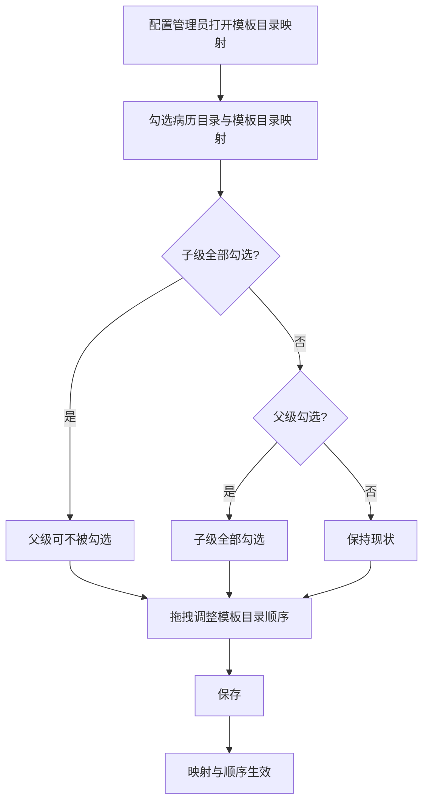
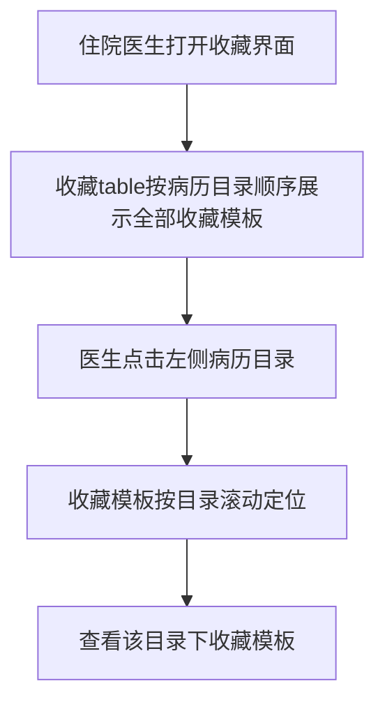

# BLGL-08-BLML-002模板目录映射_ Analyst - Spec

> **需求编号**：BLGL-08-BLML-002
> **父需求**：BLGL-08-BLML
> **关联PM Spec**：BLGL-08-BLML-002_模板目录映射_PM-spec.md
> **Spec版本**：V1.0
> **编写时间**：2026-08-15
> **编写人**：需求分析师

---

## 一、功能编号体系

> 使用带父子层级的 `<功能编号>-ID` 编号，便于追溯和讨论。

### 1.1 功能层级结构

```
BLGL-08-BLML-002: 模板目录映射
 ├─ BLGL-08-BLML-002-01: 模板目录顺序调整
 ├─ BLGL-08-BLML-002-02: 病历目录与模板目录映射
 ├─ BLGL-08-BLML-002-03: 模板及二级目录收缩
 └─ BLGL-08-BLML-002-04: 收藏模板按目录展示与定位
```

### 1.2 功能编号表

| REQ-ID | 功能名称 | 类型 | 优先级 | 说明 |
|--------|---------|------|--------|
| BLGL-08-BLML-002 | 模板目录映射 | 功能 | P1 | 病历目录与模板目录映射、模板目录顺序调整（L2） |
| BLGL-08-BLML-002-01 | 模板目录顺序调整 | 子功能 | P1 | 模板目录拖拽调换顺序 |
| BLGL-08-BLML-002-02 | 病历目录与模板目录映射 | 子功能 | P1 | 父子级勾选联动映射 |
| BLGL-08-BLML-002-03 | 模板及二级目录收缩 | 子功能 | P1 | 模板及二级目录收缩 |
| BLGL-08-BLML-002-04 | 收藏模板按目录展示与定位 | 子功能 | P1 | 收藏模板按病历目录顺序展示、滚动定位 |

---

## 二、核心业务流程

> 每个主流程一个 Mermaid flowchart。**流程步骤必须能在需求原文中找到对应描述，不推测中间步骤。**

### 2.1 模板目录映射与顺序调整



### 2.2 收藏模板按目录展示与定位



---

## 三、功能规格说明

> 每个 REQ-ID 展开详细描述，包含功能概述、用户角色、业务流程、验收标准。

---

### BLGL-08-BLML-002-01: 模板目录顺序调整

#### 3.1.1 功能概述

模板目录支持拖拽调换模板目录顺序。住院病历模板及其二级目录顺序需要可以调整。

#### 3.1.2 用户角色

| 角色 | 使用场景 | 权限要求 | 操作频率 |
|------|---------|---------|---------|
| 配置管理员 | 拖拽调整模板目录顺序 | 病历配置权限 | 中频 |

#### 3.1.3 业务流程（Given/When/Then）

##### 主流程（至少 1 个）

**Scenario 1: 拖拽调整模板目录顺序**

```gherkin
Given:
 - 配置管理员已进入模板目录管理页面
 - 模板目录已加载展示

When:
 - 配置管理员拖拽调换模板目录顺序
 - 配置管理员保存

Then:
 - 模板目录顺序按拖拽结果保存
```

##### 异常流程（至少 3 个）

**Scenario 2: 业务异常——顺序保存失败**

```gherkin
Given:
 - 拖拽后的目录顺序与现有数据冲突

When:
 - 配置管理员保存顺序

Then:
 - ⏳ 待确认：资料区未明确顺序冲突时的具体处理与提示
```

**Scenario 3: 数据异常——二级目录顺序调整**

```gherkin
Given:
 - 模板含二级目录

When:
 - 配置管理员调整二级目录顺序

Then:
 - 住院病历模板及其二级目录顺序可调整
```

**Scenario 4: 系统异常——拖拽接口异常**

```gherkin
Given:
 - 目录顺序拖拽保存接口异常

When:
 - 配置管理员保存

Then:
 - 系统提示保存失败
 - ⏳ 待确认：具体提示文案与回滚策略未在资料区明确
```

##### 边界流程（至少 2 个）

**Scenario 5: 边界场景——空目录**

```gherkin
Given:
 - 模板目录列表为空

When:
 - 配置管理员执行拖拽

Then:
 - ⏳ 待确认：空目录下的拖拽行为未在资料区明确
```

**Scenario 6: 边界场景——末位目录拖拽**

```gherkin
Given:
 - 目标目录位于列表末位

When:
 - 配置管理员拖拽该目录

Then:
 - ⏳ 待确认：末位目录拖拽的边界行为未在资料区明确
```

#### 3.1.4 数据字段定义

| 字段名 | 类型 | 必填 | 默认值 | 取值范围 | 说明 | 概念ID |
|--------|------|------|--------|---------|------|--------|
| EMR_CLASS_ID | Long | 是 | - | - | 病历目录标识 | ⏳ 待确认 |
| SEQ_NO | Integer | 否 | - | - | 目录顺序 | ⏳ 待确认 |

#### 3.1.5 验收标准

| AC编号 | 验收标准 | 对应REQ-ID | 验证方法 | 验证场景 |
|--------|---------|-----------|--------|
| AC-001 | 拖拽模板目录后保存顺序生效，刷新后顺序保持 | BLGL-08-BLML-002-01 | 功能测试 | Scenario 1 |

---

### BLGL-08-BLML-002-02: 病历目录与模板目录映射

#### 3.2.1 功能概述

病历目录和模板目录映射优化：子级目录全部勾选时，父级目录可以不被勾选上；父级勾选上时，子级全部勾选上。

#### 3.2.2 用户角色

| 角色 | 使用场景 | 权限要求 | 操作频率 |
|------|---------|---------|---------|
| 配置管理员 | 勾选病历目录与模板目录映射关系 | 病历配置权限 | 中频 |

#### 3.2.3 业务流程（Given/When/Then）

##### 主流程（至少 1 个）

**Scenario 1: 配置映射关系**

```gherkin
Given:
 - 配置管理员已进入映射配置页面
 - 病历目录与模板目录均已加载

When:
 - 配置管理员勾选病历目录与模板目录的映射关系
 - 配置管理员保存

Then:
 - 病历目录与模板目录映射生效
```

##### 异常流程（至少 3 个）

**Scenario 2: 业务异常——子级全选时父级状态**

```gherkin
Given:
 - 某父级目录下所有子级目录均被勾选

When:
 - 配置管理员配置映射

Then:
 - 父级目录可以不被勾选上
```

**Scenario 3: 数据异常——父级勾选子级联动**

```gherkin
Given:
 - 某父级目录被勾选

When:
 - 配置管理员配置映射

Then:
 - 该父级目录下子级全部勾选上
```

**Scenario 4: 系统异常——映射保存接口异常**

```gherkin
Given:
 - 映射保存接口异常

When:
 - 配置管理员保存映射

Then:
 - 系统提示保存失败
 - ⏳ 待确认：具体提示文案未在资料区明确
```

##### 边界流程（至少 2 个）

**Scenario 5: 边界场景——单层目录映射**

```gherkin
Given:
 - 模板目录为单层（无子级）

When:
 - 配置管理员勾选映射

Then:
 - ⏳ 待确认：单层目录的勾选联动行为未在资料区明确
```

**Scenario 6: 边界场景——全部取消勾选**

```gherkin
Given:
 - 已配置映射的目录全部取消勾选

When:
 - 配置管理员保存

Then:
 - ⏳ 待确认：全部取消勾选后的处理未在资料区明确
```

#### 3.2.4 数据字段定义

| 字段名 | 类型 | 必填 | 默认值 | 取值范围 | 说明 | 概念ID |
|--------|------|------|--------|---------|------|--------|
| ⏳ 待确认 | ⏳ 待确认 | ⏳ 待确认 | - | - | 映射关系的字段结构未在资料区明确 | ⏳ 待确认 |

#### 3.2.5 验收标准

| AC编号 | 验收标准 | 对应REQ-ID | 验证方法 | 验证场景 |
|--------|---------|-----------|--------|
| AC-002 | 子级目录全部勾选时，父级目录处于未勾选状态 | BLGL-08-BLML-002-02 | 功能测试 | Scenario 2 |
| AC-003 | 父级目录勾选后，其下所有子级目录均被勾选 | BLGL-08-BLML-002-02 | 功能测试 | Scenario 3 |

---

### BLGL-08-BLML-002-03: 模板及二级目录收缩

#### 3.3.1 功能概述

住院病历模板及其二级目录支持模板收缩。

#### 3.3.2 用户角色

| 角色 | 使用场景 | 权限要求 | 操作频率 |
|------|---------|---------|---------|
| 住院医生 | 收缩/展开模板目录 | 无特殊权限要求 | 中频 |

#### 3.3.3 业务流程（Given/When/Then）

##### 主流程（至少 1 个）

**Scenario 1: 模板目录收缩**

```gherkin
Given:
 - 住院病历模板目录已展示，含二级目录

When:
 - 用户点击收缩

Then:
 - 模板目录收缩
```

##### 异常流程（至少 3 个）

**Scenario 2: 业务异常——收缩状态保存**

```gherkin
Given:
 - 用户收缩模板目录后刷新

When:
 - 刷新页面

Then:
 - ⏳ 待确认：收缩状态是否持久化未在资料区明确
```

**Scenario 3: 数据异常——二级目录为空**

```gherkin
Given:
 - 模板目录下无二级目录

When:
 - 用户点击收缩

Then:
 - ⏳ 待确认：无二级目录时的收缩行为未在资料区明确
```

**Scenario 4: 系统异常——目录加载失败**

```gherkin
Given:
 - 模板目录加载接口异常

When:
 - 用户打开模板目录

Then:
 - ⏳ 待确认：加载失败时的降级与提示未在资料区明确
```

##### 边界流程（至少 2 个）

**Scenario 5: 边界场景——深层目录收缩**

```gherkin
Given:
 - 目录层级较深

When:
 - 用户收缩顶层目录

Then:
 - ⏳ 待确认：深层目录收缩行为未在资料区明确
```

**Scenario 6: 边界场景——反复收缩展开**

```gherkin
Given:
 - 模板目录已展开

When:
 - 用户反复收缩/展开

Then:
 - ⏳ 待确认：反复操作的最终状态未在资料区明确
```

#### 3.3.4 数据字段定义

| 字段名 | 类型 | 必填 | 默认值 | 取值范围 | 说明 | 概念ID |
|--------|------|------|--------|---------|------|--------|
| ⏳ 待确认 | ⏳ 待确认 | ⏳ 待确认 | - | - | 收缩相关字段未在资料区明确 | ⏳ 待确认 |

#### 3.3.5 验收标准

| AC编号 | 验收标准 | 对应REQ-ID | 验证方法 | 验证场景 |
|--------|---------|-----------|--------|
| AC-004 | 模板及二级目录可收缩/展开 | BLGL-08-BLML-002-03 | 功能测试 | Scenario 1 |

---

### BLGL-08-BLML-002-04: 收藏模板按目录展示与定位

#### 3.4.1 功能概述

收藏界面平移到左侧，与入院记录、病程记录等同列；收藏table按照病历目录的顺序显示在当前科室目录下收藏的全部模板；点击左侧病历目录，对收藏的模板按照目录进行滚动定位。

#### 3.4.2 用户角色

| 角色 | 使用场景 | 权限要求 | 操作频率 |
|------|---------|---------|---------|
| 住院医生 | 查看收藏模板、按目录滚动定位 | 无特殊权限要求 | 中频 |

#### 3.4.3 业务流程（Given/When/Then）

##### 主流程（至少 1 个）

**Scenario 1: 收藏模板按目录展示与滚动定位**

```gherkin
Given:
 - 住院医生打开收藏界面
 - 收藏table按病历目录顺序显示当前科室目录下收藏的全部模板

When:
 - 医生点击左侧病历目录

Then:
 - 收藏模板按目录进行滚动定位
```

##### 异常流程（至少 3 个）

**Scenario 2: 业务异常——收藏为空**

```gherkin
Given:
 - 当前科室目录下无收藏模板

When:
 - 医生打开收藏界面

Then:
 - ⏳ 待确认：无收藏时的展示未在资料区明确
```

**Scenario 3: 数据异常——收藏模板目录顺序变化**

```gherkin
Given:
 - 病历目录顺序发生调整

When:
 - 医生重新打开收藏界面

Then:
 - 收藏table按最新病历目录顺序展示
```

**Scenario 4: 系统异常——收藏列表加载失败**

```gherkin
Given:
 - 收藏模板列表加载接口异常

When:
 - 医生打开收藏界面

Then:
 - ⏳ 待确认：加载失败时的降级与提示未在资料区明确
```

##### 边界流程（至少 2 个）

**Scenario 5: 边界场景——多目录收藏定位**

```gherkin
Given:
 - 收藏模板分布在多个病历目录下

When:
 - 医生依次点击不同目录

Then:
 - 收藏模板按各自目录滚动定位
```

**Scenario 6: 边界场景——目录无收藏内容**

```gherkin
Given:
 - 某病历目录下无收藏模板

When:
 - 医生点击该目录

Then:
 - ⏳ 待确认：点击无收藏内容目录的定位行为未在资料区明确
```

#### 3.4.4 数据字段定义

| 字段名 | 类型 | 必填 | 默认值 | 取值范围 | 说明 | 概念ID |
|--------|------|------|--------|---------|------|--------|
| ⏳ 待确认 | ⏳ 待确认 | ⏳ 待确认 | - | - | 收藏模板相关字段未在资料区明确 | ⏳ 待确认 |

#### 3.4.5 验收标准

| AC编号 | 验收标准 | 对应REQ-ID | 验证方法 | 验证场景 |
|--------|---------|-----------|--------|
| AC-005 | 收藏界面点击左侧病历目录后，收藏模板列表滚动定位到对应目录 | BLGL-08-BLML-002-04 | 功能测试 | Scenario 1 |

---

## 四、排除范围

本需求不包含以下功能项：

1. **病历目录配置（启停用/挂URL/通用专科目录）** - 属 BLGL-08-BLML-001
2. **文书目录展示（签名标志/数量显示/展开收起快捷键）** - 属 BLGL-08-BLML-003
3. **病历新建与模板选择（双击模板创建病历）** - 属 BLGL-08-BLML-004
4. **知识文档/模板内容维护** - 属模板管理模块 BLGL-12-MBGL

---

## 五、业务规则清单

| 规则ID | 规则名称 | 规则描述 | 优先级 |
|--------|---------|---------|--------|
| BR-001 | 模板目录拖拽排序 | 模板目录支持拖拽调换模板目录顺序 | P1 |
| BR-002 | 子级全选父级状态 | 子级目录全部勾选时，父级目录可以不被勾选上 | P1 |
| BR-003 | 父级勾选子级联动 | 父级勾选上时，子级全部勾选上 | P1 |
| BR-004 | 模板及二级目录收缩 | 住院病历模板及其二级目录顺序需要可以调整+模板收缩 | P1 |
| BR-005 | 收藏模板目录排序 | 收藏table按照病历目录的顺序显示当前科室目录下收藏的全部模板 | P1 |
| BR-006 | 收藏模板滚动定位 | 点击左侧病历目录，对收藏的模板按照目录进行滚动定位 | P1 |

---

## 六、关联文档

| 文档类型 | 文档路径 | 说明 |
|---------|---------|
| 功能点Spec | BLGL-08-BLML 病历目录功能点Spec.md（V1.0，上级目录） | Phase 1 功能点索引 |
| PM spec | 本目录 BLGL-08-BLML-002_模板目录映射_PM-spec.md（V0.1） | PM 产出的 Spec 文档 |
| -Spec | 本目录 BLGL-08-BLML-002_模板目录映射-Spec.md（V1.0） | 业务背景与目标 Spec |
| data-model.md | 待产出 | 架构师产出的数据建模文档 |
| design.md | 待产出 | 架构师产出的技术方案文档 |
| api-contract.md | 待产出 | 开发经理产出的 API 契约文档 |

---

## 七、待确认问题清单

| 编号 | 问题描述 | 缺失信息 | 影响范围 | 建议补充方 |
|------|---------|---------|--------|
| Q-001 | 模板目录映射保存请求的结构、映射关系表名与字段未在资料区与代码扫描中明确 | 映射关系的表名/字段/请求结构 | 第4章数据模型、第5章接口契约 | 架构师/开发经理 |
| Q-002 | 顺序保存冲突、空目录、末位目录拖拽等边界行为未在资料区明确 | 顺序冲突处理、空/末位目录拖拽行为 | 第3章场景 | 产品经理 |
| Q-003 | 模板收缩状态是否持久化、无二级目录时的收缩行为未在资料区明确 | 收缩状态持久化策略 | 第3章场景 | 产品经理 |
| Q-004 | 收藏为空、目录无收藏内容时的展示与定位行为未在资料区明确 | 空收藏展示与定位策略 | 第3章场景 | 产品经理 |
| Q-005 | 映射/拖拽保存失败时的错误码与提示文案未在资料区明确 | 错误码定义、提示文案 | 第5章接口契约 | 开发经理 |
| Q-006 | 本功能点的性能/可用性指标未在资料区提供 | 性能、可用性量化指标 | 第8章非功能要求 | 产品经理/需求分析师 |
| Q-007 | EMR_CLASS_ID、SEQ_NO 等字段的概念ID未在资料区明确 | 概念ID | 第3章数据字段定义 | 产品经理 |

---

## 填写检查清单

| 序号 | 检查项 | 是否完成 |
|:----:|--------|:--------:|
| 1 | 功能编号带父子层级 | ✅ |
| 2 | 每个 REQ-ID 有功能概述和用户角色 | ✅ |
| 3 | 主流程至少 1 个 Given/When/Then 场景 | ✅ |
| 4 | 异常流程至少 3 个 Given/When/Then 场景 | ✅ |
| 5 | 边界流程至少 2 个 Given/When/Then 场景 | ✅ |
| 6 | 每个 Given/When/Then 内容具体，不模糊 | ✅ |
| 7 | 数据字段定义完整（字段名、类型、必填、说明、概念ID） | ✅（大量 ⏳） |
| 8 | 验收标准 AC 编号独立，可验证 | ✅ |
| 9 | 验收标准无"功能正常"等模糊表述 | ✅ |
| 10 | 排除范围明确列出 | ✅ |
| 11 | 业务规则清单列出所有规则，每条标注来源 | ✅（6 条） |
| 12 | 流程图使用 Mermaid 格式（≥2 个） | ✅ |
| 13 | 关联文档索引包含 Phase 1 功能点Spec | ✅ |
| 14 | 待确认问题清单汇总了全文所有 ⏳ 项 | ✅ |
| 15 | 全文无占位符 `< >` 残留 | ✅ |
| 16 | 全文陈述可溯源至资料区（S1~S10 溯源核查） | ✅ |
| 17 | 人工审核确认完成 | ⏳ 待确认 |

---

**文档状态**：⬜ 待审核
**维护责任**：需求分析师规范组
**下次更新**：根据评审反馈优化

---

## 版本历史

| 版本 | 日期 | 变更说明 | 编写人 |
|------|------|---------|--------|
| V1.0 | 2026-08-15 | 初始版本 | 需求分析师 |
