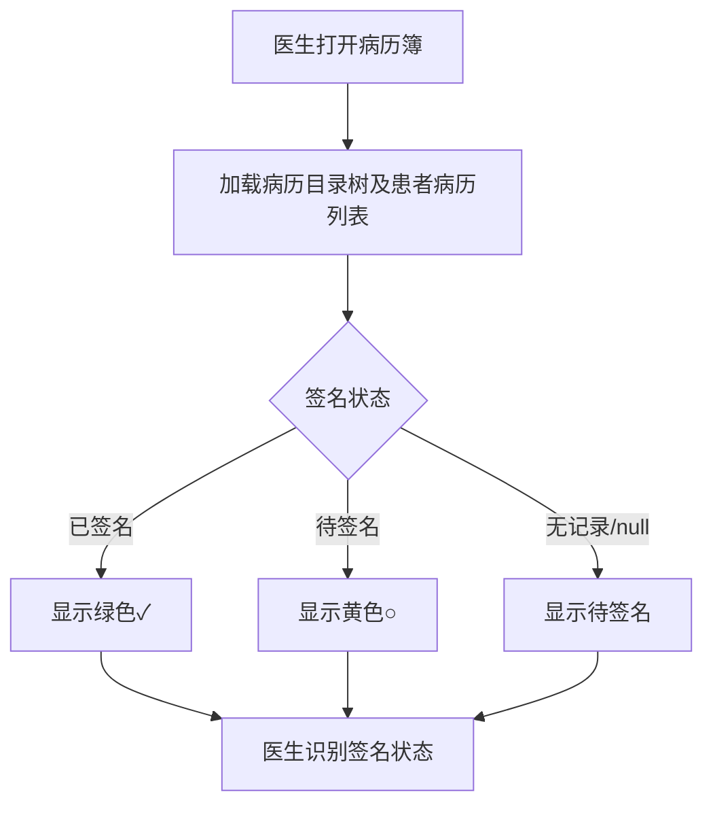
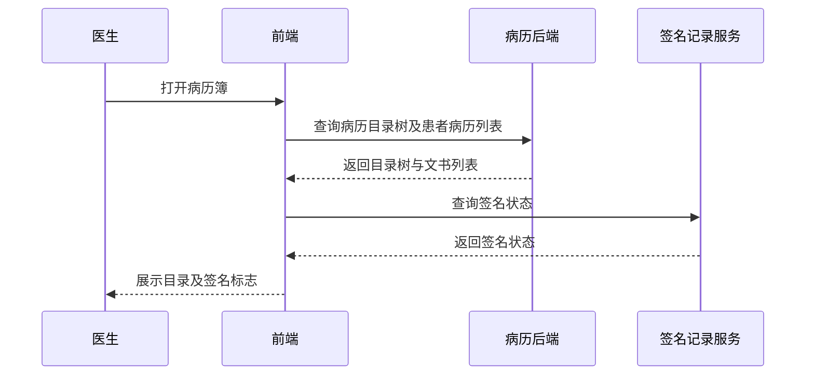

# BLGL-08-BLML-003 文书目录展示-Spec

> **功能编号**：BLGL-08-BLML-003
> **文档类型**：功能Spec（业务背景与设计）
> **文档版本**：V1.0
> **编写时间**：2026-08-15
> **编写人**：RACC

---

## 文档索引

本节提供本文档的章节结构索引与关联文档索引，便于读者快速定位与检索。

#### 章节索引

**Spec（研发视角）**

| 章节号 | 章节名称 |
|--------|---------|
| 1、 | 文档概述 |
| 2、 | 功能背景与定位 |
| 3、 | 业务流程设计 |
| 4、 | 数据模型设计 |
| 5、 | 接口契约设计 |
| 6、 | 技术方案设计 |
| 7、 | 测试用例预设计 |
| 8、 | 非功能性要求 |
| 9、 | 依赖与风险 |
| 10、 | 附录 |

**PM-Spec（需求规格）**

| 章节号 | 章节名称 |
|--------|---------|
| 一 | 目标 |
| 二 | 约束 |
| 三 | 验收标准 |
| 四 | 排除范围 |
| 五 | 关键决策记录 |
| 六 | 优先级 |
| 附录 | 填写检查清单 |

**Analyst-Spec（分析规格）**

| 章节号 | 章节名称 |
|--------|---------|
| 一 | 功能编号体系 |
| 二 | 核心业务流程 |
| 三 | 功能规格说明 |
| 四 | 排除范围 |
| 五 | 业务规则清单 |
| 六 | 关联文档 |
| 七 | 待确认问题清单 |
| - | 填写检查清单 | 检查项与完成状态 |

#### 版本历史

| 版本 | 日期 | 变更说明 | 编写人 |
|------|------|---------|--------|
| V1.0 | 2026-08-15 | 初始版本 | RACC |

#### 关联文档索引

| 序号 | 文档名称 | 文档类型 | 版本 | 位置 |
|------|---------|---------|------|------|
| 1 | BLGL-08-BLML-003_文书目录展示-Spec.md | 功能Spec（业务背景与设计）（本文档） | V1.0 | 本目录 |
| 2 | BLGL-08-BLML-003_文书目录展示_PM-spec.md | PM-Spec（需求规格） | V0.1 | 本目录 |
| 3 | BLGL-08-BLML-003_文书目录展示_Analyst-spec.md | Analyst-Spec（分析规格） | V1.0 | 本目录 |
| 4 | BLGL-08-BLML 病历目录功能点Spec.md | 功能点Spec（模块级） | V1.0 | 上级目录 |

---

## 1、文档概述

### 1.1、文档目的

本文档旨在明确"文书目录展示"功能（BLGL-08-BLML-003）的业务背景与设计方案，为需求分析、研发实现、测试验收及评审提供统一的业务上下文、设计口径与决策依据。

**具体目的包括**：

1. 梳理文书目录展示功能的业务由来与历史需求演进脉络，说明"为什么要做"
2. 明确功能的定位边界、目标用户与核心价值，回答"做成什么"
3. 描述功能的业务流程、数据模型、接口契约与技术方案，回答"怎么做"
4. 预设计测试用例并明确非功能性要求、依赖与风险，为研发与验收提供依据
5. 作为 SPEC（功能编号体系、功能详情、业务规则、验收标准等章节）的业务前提与设计输入，保证各层文档业务口径一致。

### 1.2、文档范围

#### 1.2.1 纳入范围

本文档覆盖文书目录展示的完整业务背景与设计，包括：

- 病历簿目录展示
- 文书数量显示
- 患者签名标志
- 目录展开收起（快捷键 Alt+1）
- 缩放按钮颜色
- 非本科室目录颜色

#### 1.2.2 排除范围

本文档不涉及以下内容（详见其他功能点或模块）：

- 病历目录本身的配置（启停用、挂URL、通用/专科目录维护）——见 BLGL-08-BLML-001
- 模板目录映射与顺序调整——见 BLGL-08-BLML-002
- 病历新建与模板选择——见 BLGL-08-BLML-004
- 文书分组与多语显示——见 BLGL-08-BLML-005
- 新增病历按钮快捷键（Ctrl+N）——见 BLGL-08-BLML-004 基础能力 BC-BLML-003

### 1.3、术语定义

| 术语 | 定义 |
|------|------|
| 病历簿 | 住院医生查看患者病历文书的界面 |
| 文书总览 | 文书管理下的文书总览列表 |
| 患者签名标志 | 病历目录/文书中展示患者是否已签名的标志 |
| 监控类型 | 病历监控类型 |

### 1.4、阅读指南

- **章节关系**：第1~2章为阅读铺垫与业务全貌（背景、定位、用户、价值）；第3~10章为设计实现层（流程、数据、接口、技术、测试、非功能、依赖风险、附录），可直接用于研发与测试。与 Analyst-Spec、PM-Spec 的详细规则/验收口径互相引用，保持一致。
- **读者对象**：
 - 产品经理/需求分析师：阅读第1~2章了解业务全貌，据此维护 PM-Spec 与功能清单
 - 研发：阅读第3~6章用于开发实现，第9~10章用于依赖评估与联调
 - 测试：阅读第3章、第7~8章用于用例设计与验收
 - 评审人员：以本文档为业务口径与设计基准，核对各层文档一致性。

### 1.5、参考文档

| 序号 | 文档名称 | 版本/日期 |
|------|---------|
| 1 | 病历目录-0813.xlsx | - |
| 2 | BLGL-08-BLML-003_文书目录展示_PM-spec.md | V0.1 |
| 3 | BLGL-08-BLML-003_文书目录展示_Analyst-spec.md | V1.0 |
| 4 | BLGL-08-BLML 病历目录功能点Spec.md | V1.0 |

---

## 2、功能背景与定位

### 2.1 功能背景

文书目录展示是医生查看病历文书的首屏导航，需满足：

- **现状痛点**：医生无法直观识别病历签名状态，需逐个打开病历确认，效率低、易遗漏、存在医疗纠纷风险
- **管理要求**：病历导航界面的缩放按钮需加颜色，便于医生找回
- **历史需求演进**：从"缩放按钮加颜色"→"目录展开收起快捷键 Alt+1"→"增加患者签名显示标志"

### 2.2 功能定位

"文书目录展示"是WiNEX病历管理-病历目录模块的展示层，定位为：

- **导航定位**：病历簿目录树展示与展开收起
- **状态标识定位**：文书数量、患者签名标志展示
- **视觉标识定位**：缩放按钮、非本科室目录颜色

### 2.3 目标用户

| 用户角色 | 主要使用场景 |
|---------|-------------|
| 住院医生 | 查看病历簿目录、识别签名状态、展开收起目录 |

### 2.4 核心价值

| 价值维度 | 价值描述 |
|---------|---------|
| 效率提升 | 无需逐个打开病历即可识别签名状态 |
| 减少遗漏 | 签名状态可视化，减少遗漏未签名病历 |
| 操作便捷 | 快捷键展开收起目录、缩放按钮可识别 |

---

## 3、业务流程设计（Given/When/Then）

### 3.1 主流程

**Scenario 1: 病历簿目录展示与签名标志识别**

```gherkin
Given:
 - 住院医生已打开病历簿
 - 病历目录已加载展示

When:
 - 医生查看病历目录及文书列表
 - 系统在目录中展示患者签名状态标志

Then:
 - 病历目录及文书列表正确展示
 - 每个病历项展示对应签名状态标志
```

### 3.2 异常流程

**Scenario 2: 业务异常——无签名记录**

```gherkin
Given:
 - 患者无任何签名记录

When:
 - 医生查看病历目录签名标志

Then:
 - 默认显示为"待签名"
```

**Scenario 3: 数据异常——签名状态字段为空**

```gherkin
Given:
 - 签名状态字段为 null

When:
 - 医生查看病历目录签名标志

Then:
 - 显示为"待签名"
```

**Scenario 4: 系统异常——目录加载失败**

```gherkin
Given:
 - 病历目录加载接口异常

When:
 - 医生打开病历簿

Then:
 - ⏳ 待确认：目录加载失败时的降级与提示未在资料区明确
```

### 3.3 边界流程

**Scenario 5: 边界场景——大量文书数据**

```gherkin
Given:
 - 患者病历文书数量达 1000+ 条

When:
 - 医生加载文书总览列表

Then:
 - 1000 条病历数据加载时间不超过 3 秒
```

**Scenario 6: 边界场景——签名状态筛选**

```gherkin
Given:
 - 使用签名状态下拉框进行筛选

When:
 - 医生筛选对应状态

Then:
 - 表格仅显示对应状态的病历，筛选操作响应时间不超过 1 秒
```

---

## 4、数据模型设计

### 4.1 核心数据结构

#### 4.1.1 核心保存请求

| 字段名 | 类型 | 必填 | 备注 |
|--------|------|------|------|
| ⏳ 待确认 | ⏳ 待确认 | ⏳ 待确认 | 本功能点以展示为主，保存请求结构未在资料区明确 |

#### 4.1.2 核心表/实体

| 表/实体 | 关键字段 | 说明 |
|---------|---------|------|
| INPATIENT_EMR_SET（InpatientEmrSetPO） | PATIENT_SIGNED_FLAG（患者签名标志）、INP_EMR_CLASS_ID（目录关联）、INP_MRT_MONITOR_ID（监控类型）、INP_EMR_SET_TITLE（病历标题） | 住院病历集，承载签名标志与目录关联 |
| INPATIENT_EMR_TYPE / INPAT_EMR_CLASS | - | 病历目录树数据源 |

### 4.2 状态定义

| 状态码 | 状态名称 | 说明 |
|--------|---------|------|
| 已患者签名 | 已签名 | 显示绿色 ✓ |
| 待患者签名 | 待签名 | 显示黄色 ○ |

### 4.3 系统参数定义

| 参数编码 | 参数名称 | 说明 |
|---------|---------|------|
| ⏳ 待确认 | - | 文书目录展示相关参数未在资料区明确 |

---

## 5、接口契约设计

### 5.1 API列表

| 序号 | API名称（代码函数） | 路径 | 方法 | 说明 |
|:----:|---------|------|:----:|------|
| 1 | 查询病历目录树及患者病历列表 | /api/v1/app_record_inpatient/emr_type/query/by_example | POST | 查询病历目录树及患者病历列表 |
| 2 | 查询时间线病历目录 | /api/v1/app_record_inpatient/emr_set/order_by_time/query/by_example | POST | 时间线病历目录 |
| 3 | 签名状态查询 | ⏳ 待确认 | ⏳ 待确认 | 提到"数据服务-签名记录提供签名状态查询接口"，具体路径未在代码扫描定位 |

### 5.2 接口详细设计

#### 5.2.1 查询病历目录树及患者病历列表

**请求参数**:
```json
{
 "encounterId": "⏳ 待确认"
 "emrSourceCode": "⏳ 待确认"
}
```

**返回值（成功）**:
```json
{
 "success": true
 "data": [
 {
 "classId": "⏳ 待确认"
 "className": "⏳ 待确认"
 "emrSetList": ["⏳ 待确认"]
 }
 ]
}
```

**返回值（失败）**:
```json
{
 "success": false
 "message": "⏳ 待确认"
 "data": null
}
```

> 📌 接口路径与函数名来自代码（InpEmrClassController / InpEmrClassApiPathConstants.EMR_TYPE_QUERY_BY_ENCOUNTER_V1）；入参/出参字段结构待与接口文档核对，标记 ⏳ 待确认。

### 5.3 错误码定义

| 错误码 | 错误信息 | 处理方式 |
|--------|---------|---------|
| ⏳ 待确认 | - | 错误码定义未在资料区找到 |

---

## 6、技术方案设计

### 6.1 页面路径

- **页面路径**: winning-webui-inpatient-clinicalnote-pango/src/pages/EmrNavigator/（病历导航，目录树、时间线病历目录）
- **路由**: ⏳ 待确认（病历导航页面路由未在代码扫描中定位）
- **核心逻辑模块**: InpEmrClassController（业务态：住院病历目录）

### 6.2 技术栈

| 类别 | 技术 | 版本 |
|------|------|------|
| 前端框架 | Vue 2 + element-ui + qiankun 微前端 | ⏳ 待确认 |
| 后端框架 | Spring Boot + JPA/Hibernate + winning-akso | ⏳ 待确认 |

### 6.3 关键技术点

- 签名状态展示：已签名显示绿色 ✓，待签名显示黄色 ○
- 目录展开/收起快捷键 Alt+1，hover 提示"Alt+1"
- 缩放按钮边缘线调整为有色并加粗，颜色跟随系统皮肤

### 6.4 部署方案

⏳ 待确认：部署方案未在资料区中找到

---

## 7、测试用例预设计

### 7.1 功能测试

| 用例编号 | 测试场景 | Given | When | Then |
|---------|---------|-------|--------|
| TC-001 | 签名状态展示 | 文书总览加载 | 查看签名状态列 | 已签名显示绿色✓，待签名显示黄色○ |
| TC-002 | 签名状态标识 | 病历目录加载 | 查看病历项 | 每个病历项右侧显示对应状态图标/文字 |
| TC-003 | 状态排序 | 点击签名状态列标题 | 排序 | 待签名病历排在前面 |

### 7.2 边界测试

| 用例编号 | 测试场景 | Given | When | Then |
|---------|---------|-------|--------|
| TC-004 | 无签名记录 | 患者无签名记录 | 查看签名状态 | 默认显示"待签名" |
| TC-005 | 签名状态为空 | 签名状态字段为 null | 查看签名状态 | 显示"待签名" |
| TC-006 | 大量病历数据 | 1000+ 条病历数据 | 加载列表 | 加载时间 ≤3 秒 |

### 7.3 异常测试

| 用例编号 | 测试场景 | Given | When | Then |
|---------|---------|-------|--------|
| TC-007 | 目录加载失败 | 目录加载接口异常 | 打开病历簿 | ⏳ 待确认 |

### 7.4 性能测试

| 用例编号 | 测试场景 | 指标 |
|---------|---------|
| TC-008 | 列表加载时间 |
| TC-009 | 筛选响应时间 |

---

## 8、非功能性要求

### 8.1 性能要求

| 指标 | 要求 |
|------|------|
| 列表加载时间 | 1000 条病历数据加载不超过 3 秒 |
| 筛选响应时间 | 筛选操作响应不超过 1 秒 |

### 8.2 安全要求

| 要求 | 说明 |
|------|------|
| ⏳ 待确认 | 本功能点安全要求未在资料区明确 |

**医疗行业特殊要求**

| 要求 | 说明 |
|------|------|
| 签名状态可视 | 减少遗漏未签名病历，降低医疗纠纷风险 |

### 8.3 可用性要求

| 指标 | 要求值 |
|------|--------|
| ⏳ 待确认 | - |

### 8.4 兼容性要求

| 类型 | 要求 |
|------|------|
| 换肤兼容 | 病历目录背景色由写死的白色改为变量，支持换肤 |

---

## 9、依赖与风险

### 9.1 外部依赖

| 依赖项 | 说明 |
|--------|------|
| 数据服务-签名记录 | 提供签名状态查询接口 |

### 9.2 风险项

| 风险项 | 等级 | 说明 | 应对方案 |
|--------|------|------|---------|
| 签名遗漏 | 中 | 遗漏未签名病历可能导致医疗纠纷或验收不通过 | 签名状态可视化展示 |
| 大文书量性能 | 中 | 1000+ 条病历数据加载性能 | 性能指标约束（≤3 秒） |

---

## 10、附录

### 10.1 流程图



### 10.2 时序图



### 10.3 参考文档

- 病历目录-0813.xlsx（、445464、335375、1360424 等）
- BLGL-08-BLML 病历目录功能点Spec.md（V1.0）
- 关联Spec: BLGL-08-BLML-001_病历目录配置-Spec.md（目录数据来源）

---

## 填写检查清单

| 序号 | 检查项 | 是否完成 |
|:----:|--------|:--------:|
| 1 | 章节索引与正文章节一致 | ✅ |
| 2 | 版本历史记录完整 | ✅ |
| 3 | 关联文档索引已登记全部Spec | ✅ |
| 4 | 文档目的明确回答"为什么做/做成什么/怎么做" | ✅ |
| 5 | 纳入范围/排除范围清晰 | ✅ |
| 6 | 术语定义覆盖关键概念，从资料区可溯源 | ✅ |
| 7 | 参考文档已登记 | ✅ |
| 8 | 功能背景基于法规/规范/需求来源组织 | ✅ |
| 9 | 功能定位体现业务价值（3~5个定位点） | ✅ |
| 10 | 目标用户角色覆盖完整，在需求原文中有出处 | ✅ |
| 11 | 核心价值可陈述，与 Phase 1 口径一致 | ✅ |
| 12 | 业务流程：主流程≥1、异常≥3、边界≥2，Given/When/Then 具体 | ✅ |
| 13 | 数据模型：字段/表/状态/参数可溯源 | ✅（保存请求/参数 ⏳） |
| 14 | 接口契约：API列表+详细设计+错误码齐全或标记待确认 | ✅（签名查询接口/入参/错误码 ⏳） |
| 15 | 技术方案：页面路径/技术栈/关键点/部署方案或标记待确认 | ✅（路由/版本/部署 ⏳） |
| 16 | 测试用例：功能/边界/异常/性能覆盖，与第3章场景对应 | ✅ |
| 17 | 非功能性要求：性能/安全/可用性/兼容性指标可量化或标记待确认 | ✅（性能有量化指标） |
| 18 | 依赖与风险：外部依赖登记完整，风险有具体应对方案或标记待确认 | ✅ |
| 19 | 附录：流程图/时序图与正文流程一致 | ✅ |
| 20 | 全文无占位符 `< >` 残留 | ✅ |
| 21 | 全文陈述可溯源至资料区，无来源的已标记 ⏳ | ✅ |
| 22 | 人工审核确认完成 | ⏳ 待确认 |

---

**文档状态**：⬜ 待审核
**维护责任**：RACC
**下次更新**：根据评审反馈优化
